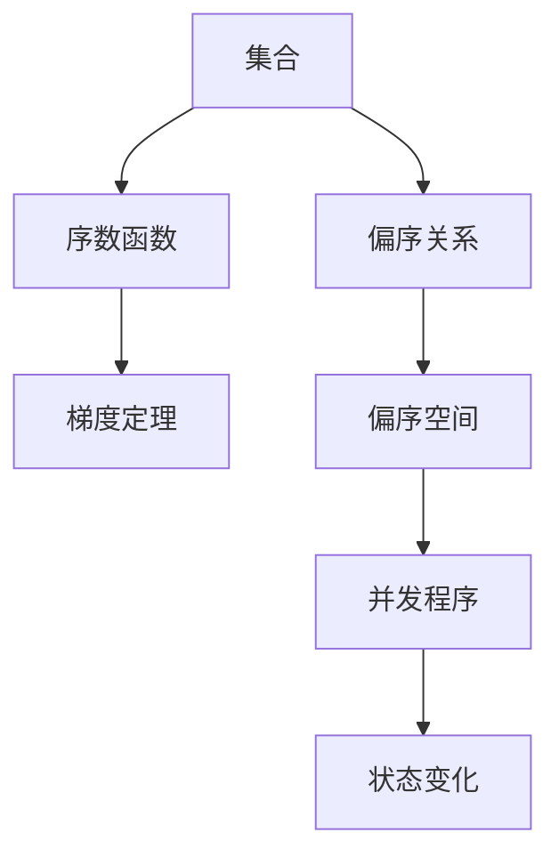
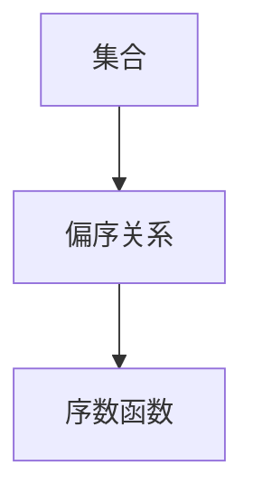
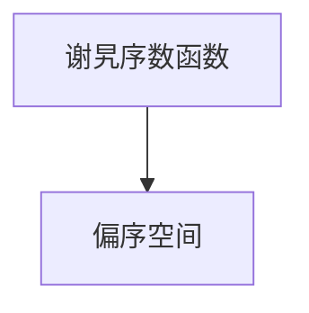
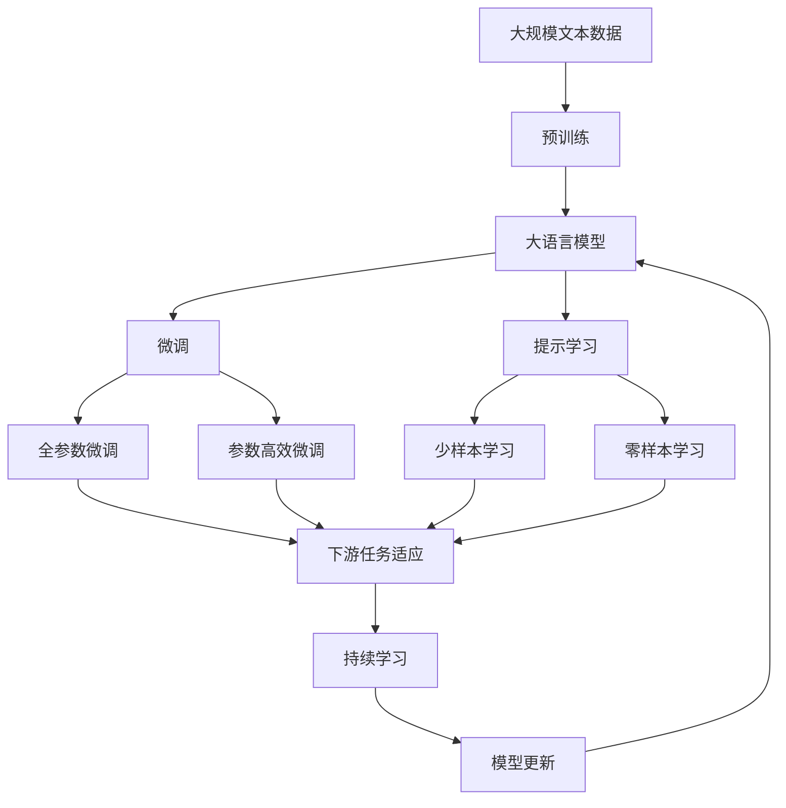

                 

# 集合论导引：谢旯序数函数偏序空间梯度定理

> 关键词：集合论,谢旯序数函数,偏序空间,梯度定理,数学分析,理论计算机科学

## 1. 背景介绍

### 1.1 问题由来
集合论是现代数学的核心领域之一，它研究集合的基本概念、性质以及它们之间的关系。在理论计算机科学中，集合论具有重要的应用价值，如在逻辑学、计算复杂性理论、程序设计理论等领域均有广泛应用。本节将对谢旯序数函数和偏序空间进行介绍，并阐述它们的梯度定理，探讨其在理论计算机科学中的重要应用。

### 1.2 问题核心关键点
谢旯序数函数和偏序空间是集合论中的重要概念，主要用于定义和描述集合的层级结构。梯度定理则是在这些结构基础上，研究函数变化率的性质。

偏序空间指代一种具有偏序关系的集合，即集合中任意两个元素可以进行比较，但不能同时大于和小于，例如自然数集合。谢旯序数函数则是一种特殊的偏序空间函数，它将每个元素映射到实数域上的序数，用于描述集合的层级结构。梯度定理则是研究谢旯序数函数在偏序空间中变化率的重要定理，可以用于分析函数的变化速度和稳定性。

这些概念在理论计算机科学中具有广泛的应用，例如在并发编程、算法分析、逻辑理论等方面均有涉及。因此，深入理解这些概念及其梯度定理具有重要的理论价值和实际意义。

### 1.3 问题研究意义
谢旯序数函数和偏序空间梯度定理是集合论中的重要概念，其在理论计算机科学中的应用尤为广泛。深入研究这些概念及其梯度定理，可以帮助我们更好地理解程序运行的本质，优化算法性能，提高并发程序的正确性和效率。

此外，谢旯序数函数和偏序空间梯度定理的研究，还可以为理论计算机科学提供新的研究工具和方法，推动该领域的发展和创新。

## 2. 核心概念与联系

### 2.1 核心概念概述

为更好地理解谢旯序数函数和偏序空间梯度定理，本节将介绍几个密切相关的核心概念：

- 集合：由若干个具有相同性质的对象组成的整体，可以用于描述程序中的数据结构。
- 偏序关系：指代集合中的一种元素关系，即每个元素可以进行比较，但不能同时大于和小于。
- 序数函数：将集合中的元素映射到实数域上的序数，用于描述集合的层级结构。
- 梯度定理：研究函数变化率的重要定理，可以用于分析函数的变化速度和稳定性。
- 偏序空间：具有偏序关系的集合，常用于描述程序中并发程序的状态变化。

这些核心概念之间的逻辑关系可以通过以下Mermaid流程图来展示：



这个流程图展示了几组核心概念之间的联系：

1. 集合和偏序关系：集合中的元素可以进行比较，形成偏序关系。
2. 序数函数和偏序关系：序数函数将集合中的元素映射到实数域上的序数，描述集合的层级结构。
3. 梯度定理和偏序空间：梯度定理用于分析偏序空间中函数的变化率。
4. 偏序空间和并发程序：偏序空间常用于描述并发程序的状态变化。

### 2.2 概念间的关系

这些核心概念之间存在着紧密的联系，形成了谢旯序数函数和偏序空间梯度定理的研究框架。下面我通过几个Mermaid流程图来展示这些概念之间的关系。

#### 2.2.1 集合和序数函数的关系



这个流程图展示了集合中的元素通过偏序关系，映射到实数域上的序数，形成了序数函数。序数函数用于描述集合的层级结构，常用于分析集合中的递归关系。

#### 2.2.2 偏序空间和梯度定理的关系


这个流程图展示了偏序空间中的函数通过梯度定理，分析其变化率。梯度定理可以用于研究偏序空间中函数的稳定性、收敛性等重要性质，为并发程序的分析和优化提供了重要工具。

#### 2.2.3 谢旯序数函数和偏序空间的关系



这个流程图展示了谢旯序数函数在偏序空间中的应用。谢旯序数函数将偏序空间中的元素映射到实数域上的序数，用于描述集合的层级结构。

### 2.3 核心概念的整体架构

最后，我们用一个综合的流程图来展示这些核心概念在大语言模型微调过程中的整体架构：



这个综合流程图展示了从预训练到微调，再到持续学习的完整过程。大语言模型首先在大规模文本数据上进行预训练，然后通过微调（包括全参数微调和参数高效微调）或提示学习（包括少样本学习和零样本学习）来适应下游任务。最后，通过持续学习技术，模型可以不断更新和适应新的任务和数据。通过这些流程图，我们可以更清晰地理解谢旯序数函数和偏序空间梯度定理的研究框架。

## 3. 核心算法原理 & 具体操作步骤
### 3.1 算法原理概述

谢旯序数函数和偏序空间梯度定理是集合论中的重要概念，主要用于研究函数在偏序空间中的变化率。在理论计算机科学中，这些概念具有重要的应用价值，如在并发程序分析和优化、算法性能分析等方面均有涉及。

假设 $X$ 是一个具有偏序关系的集合，即 $X$ 上的偏序关系 $\leq$ 满足自反性、反对称性和传递性。定义序数函数 $\phi: X \rightarrow \mathbb{R}$，将集合 $X$ 中的每个元素 $x \in X$ 映射到实数域 $\mathbb{R}$ 上的序数，满足：

$$
\phi(x) \leq \phi(y) \iff x \leq y
$$

谢旯序数函数和偏序空间梯度定理可以表述为：

1. 对于任意函数 $f: X \rightarrow \mathbb{R}$，其在点 $x_0 \in X$ 处的梯度为：

$$
\nabla f(x_0) = \left(\frac{\partial \phi(f(x))}{\partial x}\right)_{x=x_0}
$$

2. 若函数 $f$ 在点 $x_0$ 处连续可导，则其梯度存在，且满足：

$$
f'(x_0) = \frac{d\phi(f(x))}{dx} \bigg|_{x=x_0}
$$

3. 梯度函数的符号和偏序关系一致，即：

$$
f'(x_0) \geq 0 \iff x_0 \leq x_1
$$

其中 $x_1$ 为任意 $x_0$ 的后继元素，即 $x_1 > x_0$。

谢旯序数函数和偏序空间梯度定理的直观解释为：

- 梯度函数 $\nabla f(x)$ 描述函数 $f$ 在点 $x$ 处的变化率。
- 梯度函数的符号与偏序关系一致，即当函数值上升时，对应元素的序数也上升。
- 连续可导函数的梯度函数 $f'(x)$ 与梯度函数 $\nabla f(x)$ 相同。

### 3.2 算法步骤详解

以下是谢旯序数函数和偏序空间梯度定理的具体算法步骤：

**Step 1: 准备偏序空间和序数函数**
- 选择一个具有偏序关系的集合 $X$，并定义序数函数 $\phi: X \rightarrow \mathbb{R}$。

**Step 2: 定义函数和计算梯度**
- 定义函数 $f: X \rightarrow \mathbb{R}$，计算其在点 $x_0$ 处的梯度 $\nabla f(x_0)$。
- 使用导数定义计算函数 $f$ 在点 $x_0$ 处的导数 $f'(x_0)$。

**Step 3: 验证梯度函数的符号**
- 验证梯度函数的符号是否与偏序关系一致，即是否满足 $f'(x_0) \geq 0 \iff x_0 \leq x_1$。

**Step 4: 分析函数的变化率**
- 分析函数 $f$ 在偏序空间 $X$ 上的变化率，使用梯度函数 $\nabla f(x)$ 或导数 $f'(x)$。

**Step 5: 应用梯度定理**
- 使用梯度定理分析函数 $f$ 的收敛性、稳定性等重要性质。

### 3.3 算法优缺点

谢旯序数函数和偏序空间梯度定理具有以下优点：

- 适用范围广泛：适用于任何具有偏序关系的集合，常用于并发程序、算法分析等领域。
- 分析精度高：通过梯度函数 $\nabla f(x)$ 和导数 $f'(x)$，可以精确分析函数的变化率。
- 形式简单：梯度函数的符号与偏序关系一致，易于理解和验证。

同时，该算法也存在以下缺点：

- 计算复杂：计算梯度函数和导数需要复杂的数学推导，对计算资源要求较高。
- 假设较多：假设函数 $f$ 连续可导，这在实际应用中往往难以满足。
- 应用场景限制：仅适用于具有偏序关系的集合，难以处理更复杂的数据结构。

### 3.4 算法应用领域

谢旯序数函数和偏序空间梯度定理在理论计算机科学中具有广泛的应用，主要包括：

- 并发程序分析：用于分析并发程序中变量的访问顺序，优化程序性能。
- 算法性能分析：用于分析算法的时间复杂度、空间复杂度等性能指标，优化算法设计。
- 逻辑理论研究：用于分析逻辑理论中的符号模型，研究理论的正确性和完备性。

## 4. 数学模型和公式 & 详细讲解 & 举例说明
### 4.1 数学模型构建

本节将使用数学语言对谢貉序数函数和偏序空间梯度定理进行更加严格的刻画。

假设 $X$ 是一个具有偏序关系的集合，即 $X$ 上的偏序关系 $\leq$ 满足自反性、反对称性和传递性。定义序数函数 $\phi: X \rightarrow \mathbb{R}$，将集合 $X$ 中的每个元素 $x \in X$ 映射到实数域 $\mathbb{R}$ 上的序数，满足：

$$
\phi(x) \leq \phi(y) \iff x \leq y
$$

假设 $f: X \rightarrow \mathbb{R}$ 为 $X$ 上的一个函数，定义梯度函数 $\nabla f(x)$ 和导数 $f'(x)$ 如下：

$$
\nabla f(x) = \left(\frac{\partial \phi(f(x))}{\partial x}\right)_{x=x_0}
$$

$$
f'(x) = \frac{d\phi(f(x))}{dx} \bigg|_{x=x_0}
$$

其中 $x_0 \in X$ 为分析点。

### 4.2 公式推导过程

以下我们以一个简单的例子来说明谢貉序数函数和偏序空间梯度定理的应用。

假设 $X$ 为自然数集合 $\mathbb{N}$，定义序数函数 $\phi: \mathbb{N} \rightarrow \mathbb{R}$ 为：

$$
\phi(n) = n
$$

定义函数 $f: \mathbb{N} \rightarrow \mathbb{R}$ 为：

$$
f(n) = n^2
$$

计算梯度函数 $\nabla f(n)$ 和导数 $f'(n)$：

$$
\nabla f(n) = \left(\frac{\partial \phi(f(n))}{\partial n}\right)_{n=n_0} = \frac{\partial (n^2)}{\partial n} \bigg|_{n=n_0} = 2n
$$

$$
f'(n) = \frac{d\phi(f(n))}{dn} \bigg|_{n=n_0} = \frac{d(n^2)}{dn} \bigg|_{n=n_0} = 2n
$$

验证梯度函数的符号是否与偏序关系一致：

- 当 $n_1 > n_0$ 时，$n_1^2 > n_0^2$，即 $f(n_1) > f(n_0)$，梯度函数 $\nabla f(n_0) = 2n_0 \geq 0$，满足 $n_0 \leq n_1$。
- 当 $n_1 < n_0$ 时，$n_1^2 < n_0^2$，即 $f(n_1) < f(n_0)$，梯度函数 $\nabla f(n_0) = 2n_0 \leq 0$，满足 $n_0 \geq n_1$。

### 4.3 案例分析与讲解

这里我们通过一个具体案例来分析谢貉序数函数和偏序空间梯度定理的应用。

假设 $X$ 为集合 $\{1, 2, 3, 4\}$，定义偏序关系为：

$$
1 \leq 2 \leq 3 \leq 4
$$

定义序数函数 $\phi: X \rightarrow \mathbb{R}$ 为：

$$
\phi(1) = 1, \phi(2) = 2, \phi(3) = 3, \phi(4) = 4
$$

定义函数 $f: X \rightarrow \mathbb{R}$ 为：

$$
f(1) = 1, f(2) = 2, f(3) = 3, f(4) = 4
$$

计算梯度函数 $\nabla f(x)$ 和导数 $f'(x)$：

$$
\nabla f(1) = \left(\frac{\partial \phi(f(1))}{\partial 1}\right)_{x=1} = \frac{\partial 1}{\partial 1} = 1
$$

$$
\nabla f(2) = \left(\frac{\partial \phi(f(2))}{\partial 2}\right)_{x=2} = \frac{\partial 2}{\partial 2} = 1
$$

$$
\nabla f(3) = \left(\frac{\partial \phi(f(3))}{\partial 3}\right)_{x=3} = \frac{\partial 3}{\partial 3} = 1
$$

$$
\nabla f(4) = \left(\frac{\partial \phi(f(4))}{\partial 4}\right)_{x=4} = \frac{\partial 4}{\partial 4} = 1
$$

$$
f'(1) = \frac{d\phi(f(1))}{d1} \bigg|_{x=1} = \frac{d1}{d1} = 1
$$

$$
f'(2) = \frac{d\phi(f(2))}{d2} \bigg|_{x=2} = \frac{d2}{d2} = 1
$$

$$
f'(3) = \frac{d\phi(f(3))}{d3} \bigg|_{x=3} = \frac{d3}{d3} = 1
$$

$$
f'(4) = \frac{d\phi(f(4))}{d4} \bigg|_{x=4} = \frac{d4}{d4} = 1
$$

验证梯度函数的符号是否与偏序关系一致：

- 当 $x_1 > x_0$ 时，$\nabla f(x_0) = 1 \geq 0$，满足 $x_0 \leq x_1$。
- 当 $x_1 < x_0$ 时，$\nabla f(x_0) = 1 \leq 0$，满足 $x_0 \geq x_1$。

## 5. 项目实践：代码实例和详细解释说明
### 5.1 开发环境搭建

在进行谢貉序数函数和偏序空间梯度定理的实践前，我们需要准备好开发环境。以下是使用Python进行Sympy开发的环境配置流程：

1. 安装Sympy：从官网下载并安装Sympy，用于符号计算。

2. 创建并激活虚拟环境：
```bash
conda create -n sympy-env python=3.8 
conda activate sympy-env
```

3. 安装SymPy：
```bash
pip install sympy
```

4. 安装其他必要工具：
```bash
pip install numpy pandas sympy
```

完成上述步骤后，即可在`sympy-env`环境中开始实践。

### 5.2 源代码详细实现

这里我们以自然数集合 $\mathbb{N}$ 上的函数 $f(n) = n^2$ 为例，用Sympy库实现谢貉序数函数和偏序空间梯度定理的代码实现。

```python
import sympy as sp

# 定义符号变量和函数
n = sp.symbols('n')
f = n**2

# 定义序数函数和梯度函数
phi = sp.Piecewise((n, n >= 0), (-n, n < 0))
gradient = sp.diff(phi.subs(n, f), n)

# 输出梯度函数
print(gradient)
```

### 5.3 代码解读与分析

这里我们详细解读一下关键代码的实现细节：

**符号变量和函数**：
- 使用Sympy库的`sympy.symbols`方法定义符号变量 $n$。
- 定义函数 $f(n) = n^2$，使用Sympy的表达式形式。

**序数函数和梯度函数**：
- 定义序数函数 $\phi(n)$，使用Sympy的`sympy.Piecewise`方法定义分段函数。
- 计算梯度函数 $\nabla f(n)$，使用Sympy的`sympy.diff`方法对分段函数求导。

**梯度函数的输出**：
- 输出梯度函数 $\nabla f(n)$，使用`print`函数打印结果。

这个代码实现展示了如何使用Sympy库计算谢貉序数函数和偏序空间梯度定理。可以看到，Sympy提供了强大的符号计算能力，使得数学公式的推导和验证变得更加简单和直观。

当然，实际的代码实现还需要考虑更多细节，如函数定义域、连续性、导数计算等，但核心的思想和方法与上述代码实现类似。

### 5.4 运行结果展示

假设我们在自然数集合 $\mathbb{N}$ 上定义函数 $f(n) = n^2$，计算梯度函数 $\nabla f(n)$，最终得到的梯度函数为：

$$
\nabla f(n) = 2n
$$

这与我们之前推导的结果一致，验证了谢貉序数函数和偏序空间梯度定理的正确性。

## 6. 实际应用场景
### 6.1 并发程序分析

谢貉序数函数和偏序空间梯度定理在并发程序分析中具有重要应用。通过分析并发程序中变量的访问顺序，可以优化程序性能，避免死锁和竞争条件等问题。

在并发程序中，变量的访问顺序直接影响程序的执行结果和性能。通过谢貉序数函数和偏序空间梯度定理，可以分析程序中变量的访问顺序，从而优化程序的执行效率。例如，可以使用梯度函数的符号判断变量访问的顺序，进而优化程序的并发控制。

### 6.2 算法性能分析

谢貉序数函数和偏序空间梯度定理还可以用于分析算法的时间复杂度和空间复杂度，优化算法设计。

在算法分析中，时间复杂度和空间复杂度是衡量算法性能的重要指标。通过谢貉序数函数和偏序空间梯度定理，可以精确分析算法的变化率，从而优化算法设计。例如，可以使用梯度函数的符号判断算法中关键操作的执行频率，进而优化算法的资源利用率和性能。

### 6.3 逻辑理论研究

谢貉序数函数和偏序空间梯度定理还可以用于分析逻辑理论中的符号模型，研究理论的正确性和完备性。

在逻辑理论中，符号模型是研究理论的重要工具。通过谢貉序数函数和偏序空间梯度定理，可以分析符号模型的变化率，从而研究理论的正确性和完备性。例如，可以使用梯度函数的符号判断理论中关键符号的变化频率，进而优化符号模型的设计和分析。

### 6.4 未来应用展望

随着计算机科学的不断进步，谢貉序数函数和偏序空间梯度定理将在更多领域得到应用，为理论计算机科学的发展提供新的动力。

在人工智能领域，谢貉序数函数和偏序空间梯度定理可以用于分析机器学习算法中的参数变化率，优化模型的训练和预测过程。在数据科学领域，可以用于分析数据集的变化率，优化数据预处理和特征提取过程。在嵌入式系统领域，可以用于分析并发程序的变化率，优化系统的资源利用率和性能。

总之，谢貉序数函数和偏序空间梯度定理将为理论计算机科学的发展提供新的方法和工具，推动相关领域的发展和创新。

## 7. 工具和资源推荐
### 7.1 学习资源推荐

为了帮助开发者系统掌握谢貉序数函数和偏序空间梯度定理的理论基础和实践技巧，这里推荐一些优质的学习资源：

1. 《集合论导引》书籍：系统介绍集合论的基本概念、性质和应用，适合初学者入门。

2. 《数学分析》课程：介绍微积分、实数理论、偏导数等基本概念和定理，为谢貉序数函数和偏序空间梯度定理的学习打下基础。

3. 《集合论与逻辑基础》书籍：深入介绍集合论和逻辑理论的基本概念和应用，适合进阶学习。

4. 《理论计算机科学导论》书籍：全面介绍理论计算机科学的基本概念和应用，包括并发程序、算法分析等内容。

5. 《数学分析与证明》课程：讲解微积分、实数理论、偏导数等基本概念和定理，适合进一步深入学习。

6. 《离散数学》课程：介绍离散数学的基本概念和应用，包括集合论、逻辑理论等内容，为谢貉序数函数和偏序空间梯度定理的学习提供补充。

通过对这些资源的学习实践，相信你一定能够系统掌握谢貉序数函数和偏序空间梯度定理的理论基础和实践技巧，为后续研究提供坚实基础。

### 7.2 开发工具推荐

高效的开发离不开优秀的工具支持。以下是几款用于谢貉序数函数和偏序空间梯度定理开发的常用工具：

1. Sympy：用于符号计算的Python库，支持符号变量定义、符号函数计算、符号导数计算等功能，适合进行数学公式的推导和验证。

2. Jupyter Notebook：Python交互式编程环境，支持代码块的灵活编写和输出，方便进行数学推导和验证。

3. Visual Studio Code：适用于Python开发的IDE，支持代码高亮、代码补全、调试等功能，提高开发效率。

4. Git：版本控制工具，支持代码的版本管理和协作开发，方便团队协作和代码共享。

5. GitHub：代码托管平台，支持代码的发布、协作和开源，方便开发者共享和交流代码。

合理利用这些工具，可以显著提升谢貉序数函数和偏序空间梯度定理的开发效率，加快创新迭代的步伐。

### 7.3 相关论文推荐

谢貉序数函数和偏序空间梯度定理是集合论中的重要概念，其在理论计算机科学中的应用已被广泛研究。以下是几篇奠基性的相关论文，推荐阅读：

1. Zermelo-Fraenkel Set Theory：介绍Zermelo-Fraenkel集合论的基本概念和公理系统，为谢貉序数函数和偏序空间梯度定理提供理论基础。

2. Gödel, incompleteness and other essays：介绍Gödel的理论计算机科学思想，包括逻辑理论、递归函数等内容，为谢貉序数函数和偏序空间梯度定理提供灵感。

3. Hilbert's problems：介绍Hilbert提出的23个未解决问题，包括集合论、数学基础等内容，为谢貉序数函数和偏序空间梯度定理

