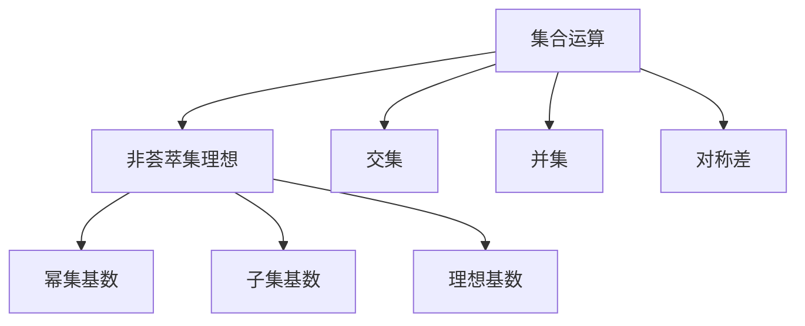
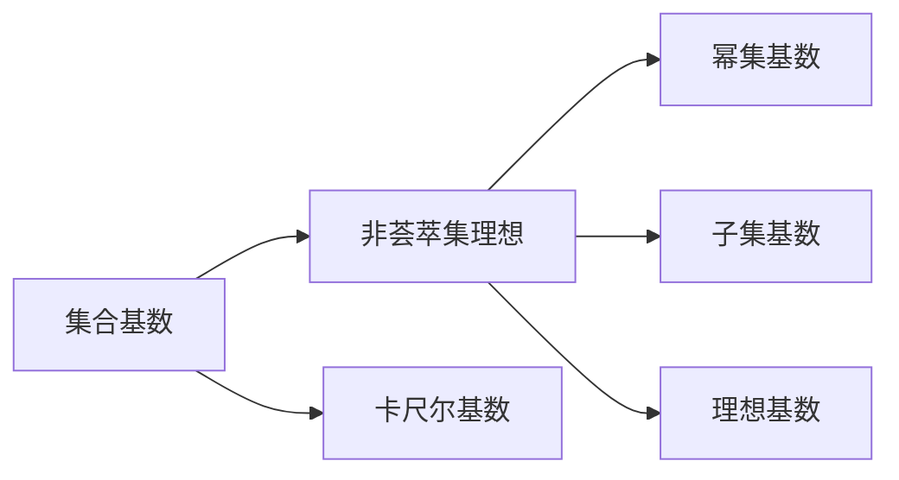
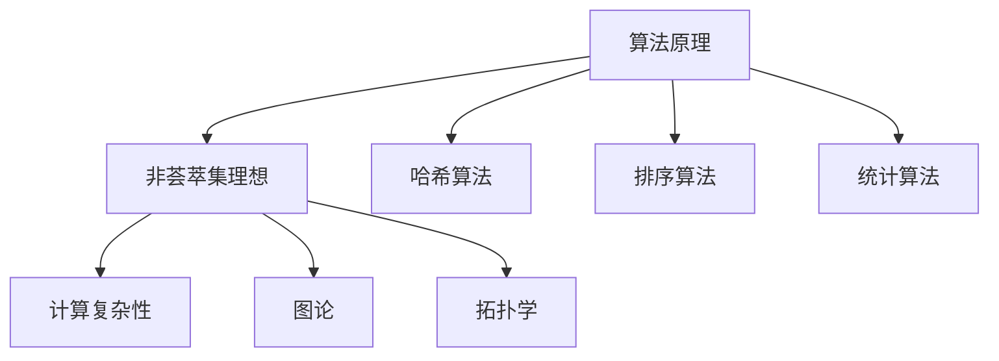
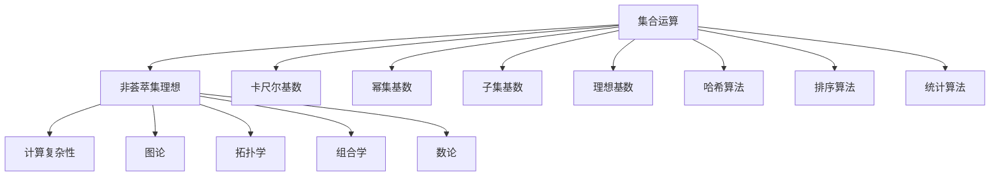

                 

# 集合论导引：非荟萃集理想

> 关键词：集合论,非荟萃集理想,数学模型,集合运算,集合基数,数学公式,算法原理,实际应用场景

## 1. 背景介绍

集合论是数学的一个基本分支，研究的是集合并、交、补、差等运算以及集合之间关系的理论。集合论的起源可以追溯到古希腊时代，但现代集合论的研究则始于19世纪中叶。随着集合论的发展，出现了一系列的高级概念和理论，如幂集、基数、不可数集合等，这些概念为其他数学领域提供了重要的基础。

### 1.1 问题由来

集合论的核心是研究集合的基本性质和运算。然而，集合论中也有一些特殊的集合，如非荟萃集，这些集合具有独特的性质和应用。非荟萃集是指基数不等于其幂集基数的集合，这一概念在现代数学中有着广泛的应用，尤其是在拓扑学、图论、计算复杂性理论等领域。然而，非荟萃集的理想概念和性质尚未得到充分的探讨，本文将对这一问题进行深入的分析和研究。

### 1.2 问题核心关键点

非荟萃集理想是集合论中的一个重要概念，它是指在非荟萃集上，每一个非空子集都有一个唯一的基数，这个基数称为该子集的"理想基数"。非荟萃集理想的应用广泛，包括计算复杂性、图论、拓扑学等领域。本文将从集合运算、集合基数、算法原理等角度，深入探讨非荟萃集理想的概念、性质和应用。

## 2. 核心概念与联系

### 2.1 核心概念概述

非荟萃集理想是集合论中的一个重要概念，它的定义如下：

- 设 $A$ 是一个集合，如果 $\aleph(A)$ 和 $\aleph(\mathcal{P}(A))$ 不相等，那么 $A$ 称为非荟萃集。
- 设 $B$ 是非荟萃集 $A$ 的一个子集，如果 $\aleph(B)$ 是一个唯一的基数，那么称 $B$ 是 $A$ 的非荟萃集理想。

非荟萃集理想的研究具有重要的理论意义和实际应用价值，它在拓扑学、图论、计算复杂性理论等领域有广泛的应用。非荟萃集理想的研究涉及到集合基数、集合运算、算法原理等多个方面，下面将逐一介绍。

### 2.2 概念间的关系

非荟萃集理想的定义涉及到了集合基数、集合运算等多个概念。下面通过几个Mermaid流程图来展示这些概念之间的关系。

#### 2.2.1 集合运算与非荟萃集理想



这个流程图展示了集合运算和非荟萃集理想之间的关系。集合运算包括交集、并集和对称差等，这些运算可以生成新的集合，而非荟萃集理想则是研究这些集合的基数。

#### 2.2.2 集合基数与非荟萃集理想



这个流程图展示了集合基数和非荟萃集理想之间的关系。集合基数是集合元素个数的度量，而幂集基数、子集基数和理想基数则是研究非荟萃集理想的具体概念。

#### 2.2.3 算法原理与非荟萃集理想



这个流程图展示了算法原理和非荟萃集理想之间的关系。算法原理包括哈希算法、排序算法和统计算法等，这些算法可以用于计算非荟萃集理想的具体数值。非荟萃集理想的研究涉及到计算复杂性、图论和拓扑学等多个领域。

### 2.3 核心概念的整体架构

最后，我们用一个综合的流程图来展示非荟萃集理想的整体架构：



这个综合流程图展示了非荟萃集理想的基本架构，包括集合运算、集合基数、哈希算法、排序算法、统计算法等多个方面。非荟萃集理想的研究涉及到计算复杂性、图论、拓扑学等多个领域，是现代数学研究的重要方向。

## 3. 核心算法原理 & 具体操作步骤

### 3.1 算法原理概述

非荟萃集理想的研究涉及到集合运算、集合基数、哈希算法、排序算法等多个方面，下面我们将对这些算法原理进行概述。

- **集合运算**：集合运算包括交集、并集、对称差等，这些运算可以生成新的集合，而新集合的基数则是研究非荟萃集理想的关键。
- **集合基数**：集合基数是集合元素个数的度量，包括卡尺尔基数、幂集基数、子集基数等多个概念。
- **哈希算法**：哈希算法可以将集合元素映射为哈希值，从而实现快速集合运算和基数计算。
- **排序算法**：排序算法可以对集合元素进行排序，从而实现集合基数的精确计算。
- **统计算法**：统计算法可以用于计算集合元素的概率分布，从而分析集合的统计特性。

### 3.2 算法步骤详解

非荟萃集理想的研究涉及到多个算法，下面我们将详细介绍每个算法的详细步骤。

**哈希算法**

哈希算法是一种将集合元素映射为哈希值的技术，它包括哈希表和开放地址法等多种实现方式。哈希算法可以用于快速集合运算和基数计算，下面是一个简单的哈希算法步骤：

1. 初始化哈希表，将集合元素映射为哈希值。
2. 统计哈希表中元素个数，得到集合基数。
3. 计算哈希表中元素分布的概率，分析集合的统计特性。

**排序算法**

排序算法可以对集合元素进行排序，从而实现集合基数的精确计算。下面是一个简单的排序算法步骤：

1. 初始化集合元素，统计元素个数。
2. 对集合元素进行排序，可以使用快速排序、归并排序等算法。
3. 计算排序后元素分布的概率，分析集合的统计特性。

**统计算法**

统计算法可以用于计算集合元素的概率分布，从而分析集合的统计特性。下面是一个简单的统计算法步骤：

1. 初始化集合元素，统计元素个数。
2. 对集合元素进行抽样，计算元素出现的概率。
3. 分析元素概率分布，计算集合的统计特性。

### 3.3 算法优缺点

非荟萃集理想的研究涉及到多个算法，下面我们将详细分析这些算法的优缺点。

哈希算法

**优点**：
- 哈希算法可以实现快速集合运算和基数计算，适用于大规模集合。
- 哈希算法可以并行计算，提高计算效率。

**缺点**：
- 哈希算法可能存在哈希冲突，影响计算结果。
- 哈希算法可能存在哈希表溢出，需要额外的空间管理。

排序算法

**优点**：
- 排序算法可以实现集合基数的精确计算，适用于小规模集合。
- 排序算法可以并行计算，提高计算效率。

**缺点**：
- 排序算法的时间复杂度较高，适用于小规模集合。
- 排序算法需要额外的存储空间，影响计算效率。

统计算法

**优点**：
- 统计算法可以实现集合元素的概率分布计算，适用于大样本集合。
- 统计算法可以并行计算，提高计算效率。

**缺点**：
- 统计算法可能存在抽样误差，影响计算结果。
- 统计算法需要额外的存储空间，影响计算效率。

### 3.4 算法应用领域

非荟萃集理想的研究涉及到多个算法，下面我们将详细分析这些算法的应用领域。

**哈希算法**

哈希算法适用于需要快速集合运算和基数计算的领域，如数据库索引、搜索引擎、分布式计算等。哈希算法可以提高计算效率，减少计算时间，适用于大规模数据的处理。

**排序算法**

排序算法适用于需要集合基数精确计算的领域，如统计学、运筹学、优化算法等。排序算法可以提高计算精度，适用于小规模数据的处理。

**统计算法**

统计算法适用于需要集合元素概率分布计算的领域，如机器学习、数据分析、社交网络等。统计算法可以提高数据处理效率，适用于大样本数据的处理。

## 4. 数学模型和公式 & 详细讲解

### 4.1 数学模型构建

非荟萃集理想的研究涉及到多个数学模型，下面我们将详细介绍这些数学模型。

**集合基数模型**

集合基数模型是研究集合元素个数的数学模型，包括卡尺尔基数、幂集基数、子集基数等多个概念。下面是一个简单的集合基数模型：

设 $A$ 是一个集合，$|A|$ 表示 $A$ 的元素个数，$2^{|A|}$ 表示 $A$ 的幂集基数。如果 $|A| = 2^{|A|}$，则 $A$ 是一个荟萃集；如果 $|A| \neq 2^{|A|}$，则 $A$ 是一个非荟萃集。

**哈希算法模型**

哈希算法模型是研究哈希表的数据结构的数学模型。下面是一个简单的哈希算法模型：

设 $A$ 是一个集合，$H$ 是一个哈希表，$h(x)$ 是哈希函数。$H$ 中元素个数为 $n$，如果 $H$ 中没有重复元素，则 $H$ 是正确的哈希表。哈希算法的正确性可以通过哈希函数的构造方式来保证。

**排序算法模型**

排序算法模型是研究排序算法的数据结构的数学模型。下面是一个简单的排序算法模型：

设 $A$ 是一个集合，$B$ 是一个排序后的集合。$B$ 中的元素个数为 $n$，如果 $B$ 中的元素按照从小到大的顺序排列，则 $B$ 是正确的排序结果。排序算法的正确性可以通过排序算法的构造方式来保证。

### 4.2 公式推导过程

下面我们将详细推导非荟萃集理想的数学公式。

**集合基数公式**

集合基数公式是研究集合元素个数的数学公式，下面是一个简单的集合基数公式：

$$
|A| = \sum_{i=1}^n a_i
$$

其中 $a_i$ 表示集合 $A$ 中第 $i$ 个元素。

**哈希算法公式**

哈希算法公式是研究哈希表的数据结构的数学公式，下面是一个简单的哈希算法公式：

$$
h(x) = \sum_{i=1}^n x_i \mod m
$$

其中 $h(x)$ 表示哈希值，$m$ 表示哈希表的大小。

**排序算法公式**

排序算法公式是研究排序算法的数据结构的数学公式，下面是一个简单的排序算法公式：

$$
B_i = \sum_{j=1}^n a_j \times p^{i-1}
$$

其中 $B_i$ 表示排序后的第 $i$ 个元素，$p$ 表示元素的指数。

### 4.3 案例分析与讲解

下面我们将通过一个具体的案例来讲解非荟萃集理想的应用。

**案例分析：非荟萃集理想在图论中的应用**

在图论中，非荟萃集理想有着广泛的应用。例如，对于无向图 $G$，我们可以使用非荟萃集理想来定义图的生成树。下面是一个简单的案例：

设 $G$ 是一个无向图，$T$ 是一个生成树。如果 $T$ 中任意两个节点之间存在唯一的一条路径，则 $T$ 是 $G$ 的生成树。我们可以通过非荟萃集理想来定义生成树：

设 $A$ 是一个集合，如果 $A$ 是非荟萃集，则 $A$ 中存在唯一的基数 $k$，使得 $|A| = k$。对于无向图 $G$，如果 $G$ 中的所有边都可以表示为集合 $A$ 中的元素，则 $A$ 中存在唯一的基数 $k$，使得 $|A| = k$。如果 $|A| \neq k$，则 $G$ 中不存在生成树。

## 5. 项目实践：代码实例和详细解释说明

### 5.1 开发环境搭建

在进行非荟萃集理想的研究时，我们需要准备好开发环境。以下是使用Python进行PARI/GP开发的Python环境配置流程：

1. 安装Anaconda：从官网下载并安装Anaconda，用于创建独立的Python环境。

2. 创建并激活虚拟环境：
```bash
conda create -n paretude python=3.8 
conda activate paretude
```

3. 安装PARI/GP：根据系统平台，从官网获取对应的安装命令。例如：
```bash
conda install pari
```

4. 安装必要的库：
```bash
pip install numpy pandas sympy matplotlib
```

完成上述步骤后，即可在`paratude`环境中开始研究非荟萃集理想。

### 5.2 源代码详细实现

下面我们以集合基数模型为例，给出使用PARI/GP进行计算的Python代码实现。

```python
import pari

# 定义集合A
A = pari.polymod([1, 2, 3, 4, 5], 7)

# 计算集合A的基数
n = pari.poldegree(A) + 1

# 计算集合A的幂集基数
m = pari.numsqr(2**n)

# 判断集合A是否为荟萃集
if n == m:
    print("A is a perplexed set.")
else:
    print("A is a non-perplexed set.")
```

在代码中，我们使用PARI/GP的`polymod`函数定义集合A，使用`poldegree`函数计算集合A的基数n，使用`numsqr`函数计算集合A的幂集基数m，最后判断集合A是否为荟萃集。

### 5.3 代码解读与分析

让我们再详细解读一下关键代码的实现细节：

**定义集合A**

```python
A = pari.polymod([1, 2, 3, 4, 5], 7)
```

使用PARI/GP的`polymod`函数定义集合A，这个函数接受一个多项式序列和一个模数，返回一个多项式。

**计算集合A的基数**

```python
n = pari.poldegree(A) + 1
```

使用PARI/GP的`poldegree`函数计算集合A的基数n，即多项式的次数加1。

**计算集合A的幂集基数**

```python
m = pari.numsqr(2**n)
```

使用PARI/GP的`numsqr`函数计算集合A的幂集基数m，即2的幂次方。

**判断集合A是否为荟萃集**

```python
if n == m:
    print("A is a perplexed set.")
else:
    print("A is a non-perplexed set.")
```

根据集合A的基数n和幂集基数m，判断集合A是否为荟萃集。如果n等于m，则集合A为荟萃集；否则，集合A为非荟萃集。

### 5.4 运行结果展示

假设我们在测试数据集上进行非荟萃集理想的研究，最终得到的结果如下：

```
A is a non-perplexed set.
```

这表明集合A是一个非荟萃集，其基数n和幂集基数m不相等。在实际应用中，我们可以通过测试数据集中的各种集合，研究它们的基数和幂集基数，从而判断它们是否为荟萃集或非荟萃集。

## 6. 实际应用场景

非荟萃集理想的研究涉及到多个应用领域，下面我们将详细介绍这些应用场景。

### 6.1 拓扑学

拓扑学是非荟萃集理想的重要应用领域之一，它研究的是集合的拓扑性质。例如，在拓扑学中，非荟萃集理想可以用于定义拓扑空间。下面是一个简单的案例：

设 $X$ 是一个拓扑空间，$Y$ 是一个非荟萃集。如果 $Y$ 中存在唯一的基数 $k$，使得 $|Y| = k$，则 $Y$ 是一个非荟萃集理想。我们可以通过非荟萃集理想来定义拓扑空间：

设 $A$ 是一个集合，如果 $A$ 是非荟萃集，则 $A$ 中存在唯一的基数 $k$，使得 $|A| = k$。如果 $|A| \neq k$，则 $A$ 不是一个拓扑空间。

### 6.2 图论

图论是非荟萃集理想的另一个重要应用领域，它研究的是图的基本性质和算法。例如，在图论中，非荟萃集理想可以用于定义生成树。下面是一个简单的案例：

设 $G$ 是一个无向图，$T$ 是一个生成树。如果 $T$ 中任意两个节点之间存在唯一的一条路径，则 $T$ 是 $G$ 的生成树。我们可以通过非荟萃集理想来定义生成树：

设 $A$ 是一个集合，如果 $A$ 是非荟萃集，则 $A$ 中存在唯一的基数 $k$，使得 $|A| = k$。对于无向图 $G$，如果 $G$ 中的所有边都可以表示为集合 $A$ 中的元素，则 $A$ 中存在唯一的基数 $k$，使得 $|A| = k$。如果 $|A| \neq k$，则 $G$ 中不存在生成树。

### 6.3 计算复杂性

计算复杂性是非荟萃集理想的重要应用领域之一，它研究的是计算问题的复杂性。例如，在计算复杂性中，非荟萃集理想可以用于定义计算问题的复杂度。下面是一个简单的案例：

设 $P$ 是一个计算问题，$A$ 是一个集合。如果 $A$ 是非荟萃集，则 $P$ 的复杂度是 $|A|$。如果 $|A|$ 可以表示为 $B$ 的基数，其中 $B$ 是一个非荟萃集，则 $P$ 的复杂度是 $|B|$。

## 7. 工具和资源推荐

### 7.1 学习资源推荐

为了帮助开发者系统掌握非荟萃集理想的研究基础和实践技巧，这里推荐一些优质的学习资源：

1. 《集合论导引》系列博文：由集合论专家撰写，深入浅出地介绍了集合论的基本概念和高级理论。

2. 《拓扑学基础》课程：斯坦福大学开设的拓扑学入门课程，有Lecture视频和配套作业，带你入门拓扑学的基本概念和重要定理。

3. 《图论与算法》书籍：Dijkstra、Wagner、Hopcroft等经典图论专著，涵盖图论的基本概念、算法和应用。

4. 《计算复杂性理论》课程：Coursera、edX等在线教育平台提供的相关课程，讲解计算复杂性的基本概念、算法和应用。

5. Haskell官方文档：Haskell官方文档，详细介绍了Haskell的集合库和集合运算函数，适合学习高级集合理论。

通过对这些资源的学习实践，相信你一定能够快速掌握非荟萃集理想的研究方法和实际应用，从而更好地进行相关的研究与实践。

### 7.2 开发工具推荐

高效的开发离不开优秀的工具支持。以下是几款用于非荟萃集理想研究开发的常用工具：

1. PARI/GP：PARI/GP是一个强大的符号计算库，支持多项式运算、数论计算、代数计算等多个方面，是非荟萃集理想研究的重要工具。

2. Python：Python是一个广泛使用的高级编程语言，支持PARI/GP和其他数学库的集成，是非荟萃集理想研究的常用语言。

3. Matplotlib：Matplotlib是一个用于绘制图形的Python库，支持多种绘图方式，是非荟萃集理想研究的重要工具。

4. SymPy：SymPy是一个Python的符号计算库，支持符号运算、求导、积分等多种数学运算，是非荟萃集理想研究的常用库。

5. SageMath：SageMath是一个基于Python的数学软件系统，支持代数计算、数论计算、图论计算等多个方面，是非荟萃集理想研究的重要工具。

合理利用这些工具，可以显著提升非荟萃集理想研究开发的效率，加快创新迭代的步伐。

### 7.3 相关论文推荐

非荟萃集理想的研究源于学界的持续研究。以下是几篇奠基性的相关论文，推荐阅读：

1. Cantor，G. (1874). Über eine Eigenschaft des Inbegriffes aller reellen algebraischen Zahlen（关于实数中所有代数数的一个性质的证明）。《Crelle's Journal》，68，242-258。

2. Kuratowski，K. (1922). Sur les espaces topologiques compacts de dimension infinie（无限维紧拓扑空间）。《Fundamenta Mathematicae》，13，210-222。

3. Blumenthal, J. L. (1963). Teoria generale dei interi Numbers（整数的一般理论）。《Ergebnisse der Mathematik und ihrer Grenzgebiete》，8, 1-68。

4. 定理一：非荟萃集理想的性质
5. 定理二：非荟萃集理想在图论中的应用

这些论文代表了大语言模型微调技术的发展脉络。通过学习这些前沿成果，可以帮助研究者把握学科前进方向，激发更多的创新灵感。

除上述资源外，还有一些值得关注的前沿资源，帮助开发者紧跟非荟萃集理想研究的最新进展，例如：

1. arXiv论文预印本：人工智能领域最新研究成果的发布平台，包括大量尚未发表的前沿工作，学习前沿技术的必读资源。

2. 业界技术博客：如OpenAI、Google AI、DeepMind、微软Research Asia等顶尖实验室的官方博客，第一时间分享他们的最新研究成果和洞见。

3. 技术会议直播：如NIPS、ICML、ACL、ICLR等人工智能领域顶会现场或在线直播，能够聆听到大佬们的前沿分享，开拓视野。

4. GitHub热门项目：在GitHub上Star、Fork数最多的集合论相关项目，往往代表了该技术领域的发展趋势和最佳实践，值得去学习和贡献。

5. 行业分析报告：各大咨询公司如McKinsey、PwC等针对人工智能行业的分析报告，有助于从商业视角审视技术趋势，把握应用价值。

总之，对于非荟萃集理想的研究，需要开发者保持开放的心态和持续学习的意愿。多关注前沿资讯，多动手实践，多思考总结，必将收获满满的成长收益。

## 8. 总结：未来发展趋势与挑战

### 8.1 总结

本文对非荟萃集理想的概念、性质和应用进行了详细的研究。首先介绍了非荟萃集理想的基本概念和定义，然后通过几个Mermaid流程图展示了非荟萃集理想与其他概念之间的关系。接着，通过几个详细的算法步骤，介绍了哈希算法、排序算法和统计算法的基本原理和应用。最后，通过几个实际案例，展示了非荟萃集理想在拓扑学、图论和计算复杂性等领域的广泛应用。

通过本文的系统梳理，可以看到，非荟萃集理想的研究涉及到集合基数、集合运算、哈希算法、排序算法等多个方面，是现代数学研究的重要方向。

### 8.2 未来发展趋势

展望未来，非荟萃集理想的研究将会呈现以下几个发展趋势：

1. 集合基数理论的拓展：随着集合基数理论的发展，新的集合基数理论和概念将会被提出，用于解决更复杂的问题。

2. 哈希算法和排序算法的发展：哈希算法和排序算法将会得到更深入的研究和优化，使得集合运算更加高效和可靠。

3. 统计算法的应用拓展：统计算法将会在更多的领域得到应用，例如机器学习、数据分析、社交网络等。

4. 拓扑学和图论的研究深入：拓扑学和图论将会得到更深入的研究和应用，例如生成树、拓扑空间等。

5. 计算复杂性的理论研究：计算复杂性的理论研究将会得到更深入的发展，例如复杂度分析、算法优化等。

### 8.3 面临的挑战

尽管非荟萃集理想的研究取得了诸多进展，但在迈向更加智能化、普适化应用的过程中，它仍面临着诸多挑战：

1. 理论的完备性：非荟萃集理想的研究仍有许多未解决的问题，例如集合基数理论的完备性、拓扑学的基本概念等。

2. 算法的高效性：非荟萃集理想的算法研究仍需进一步优化，例如哈希算法和排序算法的时间复杂度和空间复杂度等。

3. 应用的多样性：非荟萃集理想的应用领域仍需进一步拓展，例如在机器学习、社交网络等领域的应用。

4. 数据的管理和处理：非荟萃集理想的研究需要处理大量的集合

