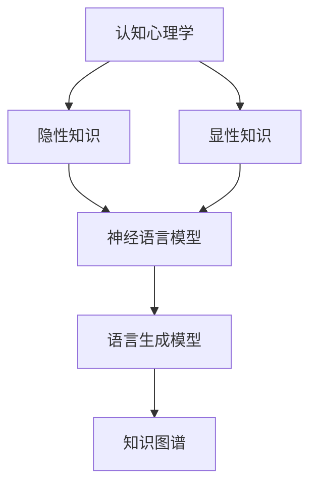
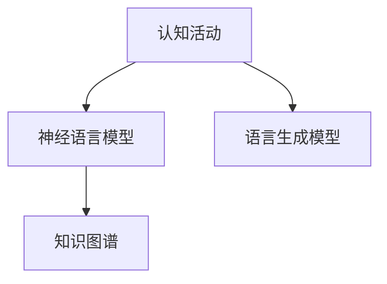
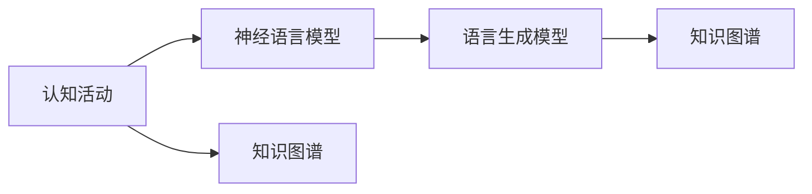
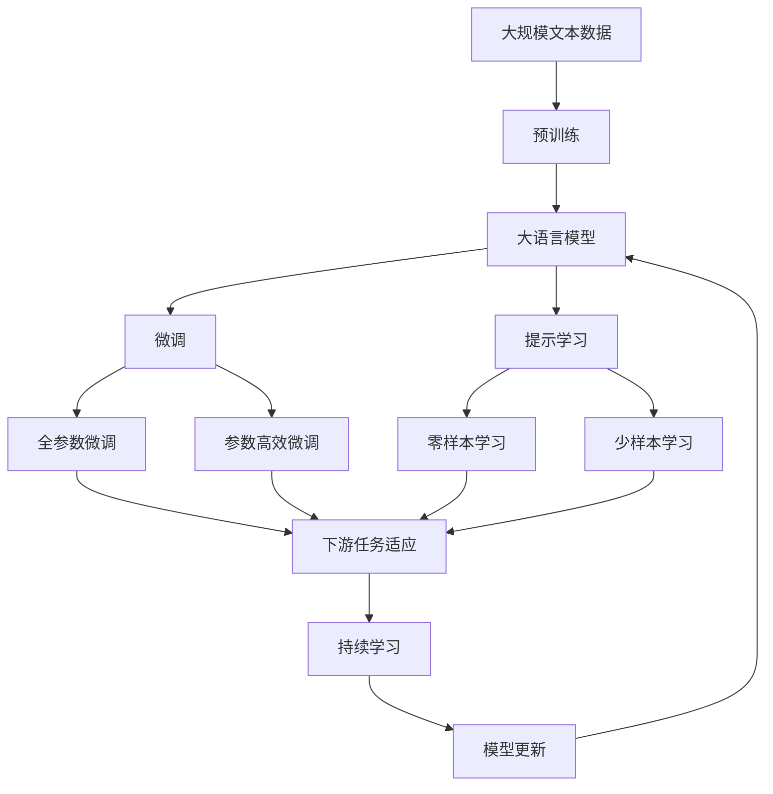

                 

# 顿悟、类比、隐喻、意象和克服知识限制

> 关键词：顿悟, 类比, 隐喻, 意象, 知识限制

## 1. 背景介绍

### 1.1 问题由来
人类认知能力的提升离不开语言。语言不仅帮助我们记录和传播知识，也是思维和表达的载体。而人类语言，特别是自然语言，有着丰富的表达方式，包括顿悟、类比、隐喻、意象等高级认知活动。这些活动是人类智能的核心组成部分，也是人工智能研究的重要方向。

在人工智能领域，自然语言处理(NLP)技术取得了巨大的进展。尤其是深度学习和大语言模型(DLM)的崛起，使得机器能够理解和生成自然语言。然而，机器对语言的理解与人类相比，仍存在巨大的鸿沟。人类通过顿悟、类比等高级认知活动，能够在有限的信息下快速推断和理解复杂的概念，而机器模型往往需要大量数据和计算资源。

本文将探讨顿悟、类比、隐喻、意象等高级认知活动的原理，并介绍如何克服机器对知识的限制，提升其理解和生成自然语言的能力。

### 1.2 问题核心关键点
- 顿悟（Insight）：指在有限信息下快速理解复杂概念的能力。
- 类比（Analogy）：指将一个概念与另一个相似概念进行比较和推理，帮助理解新概念。
- 隐喻（Metaphor）：指使用类比的方式，将一个事物比作另一个事物，揭示其内在相似性。
- 意象（Imagery）：指通过描述具体事物，激发读者的感官想象，增强语言的感染力。
- 知识限制：指机器模型在理解自然语言时面临的信息不足和计算复杂性。

## 2. 核心概念与联系

### 2.1 核心概念概述

为更好地理解顿悟、类比、隐喻、意象等高级认知活动，本节将介绍几个密切相关的核心概念：

- 认知心理学：研究人类如何获取、处理和应用知识。
- 隐性知识和显性知识：隐性知识是通过经验积累获得的难以言传的知识，显性知识是通过语言等形式表达的知识。
- 神经语言模型：一种基于神经网络的模型，用于处理自然语言文本。
- 语言生成模型：一种能够根据输入生成新文本的模型。
- 知识图谱：将实体和关系进行结构化表示的知识库。

这些核心概念之间的逻辑关系可以通过以下Mermaid流程图来展示：



这个流程图展示了认知心理学和显性知识对神经语言模型的影响，以及语言生成模型和知识图谱对模型的进一步提升。通过理解这些核心概念，我们可以更好地把握认知活动在大语言模型中的实现方式和优化方向。

### 2.2 概念间的关系

这些核心概念之间存在着紧密的联系，形成了大语言模型的高级认知活动生态系统。下面我通过几个Mermaid流程图来展示这些概念之间的关系。

#### 2.2.1 认知活动在大语言模型中的体现



这个流程图展示了认知活动在大语言模型中的体现。认知活动通过神经语言模型转化为语言表达，进一步通过语言生成模型生成新的文本，最后结合知识图谱增强语言模型的表达能力。

#### 2.2.2 语言模型对认知活动的促进



这个流程图展示了语言模型对认知活动的促进。通过语言生成模型生成的新文本，可以进一步更新知识图谱中的知识，反过来促进认知活动的提升。

### 2.3 核心概念的整体架构

最后，我们用一个综合的流程图来展示这些核心概念在大语言模型中的整体架构：



这个综合流程图展示了从预训练到大语言模型微调，再到持续学习的完整过程。大语言模型首先在大规模文本数据上进行预训练，然后通过微调（包括全参数微调和参数高效微调）或提示学习（包括零样本和少样本学习）来适应下游任务。最后，通过持续学习技术，模型可以不断学习新知识，同时避免遗忘旧知识。

## 3. 核心算法原理 & 具体操作步骤

### 3.1 算法原理概述

顿悟、类比、隐喻、意象等高级认知活动，本质上是通过有限的语义信息推断出复杂的概念和关系。这一过程涉及以下几个关键步骤：

1. **信息抽取**：从文本中提取出关键语义信息。
2. **概念推断**：在有限的语境下，推断出新的概念或关系。
3. **类比推理**：将已知概念与新概念进行类比，揭示其相似性。
4. **隐喻映射**：通过隐喻将一个概念映射到另一个概念上。
5. **意象生成**：通过感官描述，激发读者的感官想象。

这些步骤可以通过大语言模型实现，具体步骤和算法将在以下部分详细讲解。

### 3.2 算法步骤详解

#### 3.2.1 信息抽取

信息抽取是认知活动的基础。在大语言模型中，通常使用Transformer模型进行信息抽取。Transformer模型的注意力机制可以捕捉句子中的关键语义信息，将其映射到模型表示空间。

具体而言，使用BERT等预训练模型作为特征提取器，通过线性投影得到句子表示。然后，通过Transformer模型计算句子中每个单词的注意力权重，得到单词级表示。最后，将这些表示进行池化操作，得到句子的整体表示。

公式如下：

$$
\mathbf{H} = \mathbf{F}(\mathbf{X}) = \text{BERT}(\mathbf{X})
$$

其中 $\mathbf{H}$ 为句子表示，$\mathbf{X}$ 为输入句子。

#### 3.2.2 概念推断

概念推断是将有限的语义信息推断出新的概念或关系。在大语言模型中，可以使用自监督学习任务，如语言建模、掩码语言模型等，对模型进行进一步训练，使其能够根据上下文推断出新概念。

具体而言，在大规模无标签文本数据上，使用掩码语言模型任务，对句子进行掩码。然后，通过模型预测被掩码的单词，训练模型学习上下文信息。

公式如下：

$$
\hat{y} = \text{MLM}(x, \text{BERT}(x))
$$

其中 $\hat{y}$ 为预测的被掩码单词，$x$ 为输入句子，$\text{MLM}$ 为掩码语言模型函数。

#### 3.2.3 类比推理

类比推理是将已知概念与新概念进行比较，揭示其相似性。在大语言模型中，可以通过微调模型，使其能够对输入的类比对进行推理，并输出相应的关系。

具体而言，将类比对 $(a, b)$ 输入模型，通过微调后的模型输出 $(a, b)$ 的关系 $r$。

公式如下：

$$
\hat{r} = \text{Analogy}(a, b, \text{BERT}(a), \text{BERT}(b))
$$

其中 $\hat{r}$ 为预测的关系，$\text{Analogy}$ 为类比推理函数。

#### 3.2.4 隐喻映射

隐喻映射是通过隐喻将一个概念映射到另一个概念上。在大语言模型中，可以通过微调模型，使其能够对输入的隐喻文本进行映射。

具体而言，将隐喻文本 $c$ 输入模型，通过微调后的模型输出隐喻映射后的概念 $d$。

公式如下：

$$
\hat{d} = \text{Metaphor}(c, \text{BERT}(c))
$$

其中 $\hat{d}$ 为隐喻映射后的概念，$\text{Metaphor}$ 为隐喻映射函数。

#### 3.2.5 意象生成

意象生成是通过感官描述，激发读者的感官想象。在大语言模型中，可以通过微调模型，使其能够对输入的感官描述生成相应的意象。

具体而言，将感官描述 $s$ 输入模型，通过微调后的模型输出意象 $i$。

公式如下：

$$
\hat{i} = \text{Imagery}(s, \text{BERT}(s))
$$

其中 $\hat{i}$ 为生成的意象，$\text{Imagery}$ 为意象生成函数。

### 3.3 算法优缺点

顿悟、类比、隐喻、意象等高级认知活动，在大语言模型中具有以下优点：

1. **表达能力更强**：通过这些高级认知活动，大语言模型可以表达出更为复杂和抽象的概念。
2. **计算效率更高**：使用Transformer模型和自监督学习任务，可以在大规模数据上进行高效训练，提高模型的泛化能力。
3. **应用范围更广**：这些高级认知活动可以应用于文本生成、对话、情感分析等多个NLP任务。

然而，也存在以下缺点：

1. **计算资源消耗大**：使用大模型进行高级认知活动，需要大量的计算资源和存储空间。
2. **数据依赖性强**：这些高级认知活动需要大量的标注数据进行训练，获取高质量标注数据的成本较高。
3. **模型解释性不足**：大语言模型缺乏解释性，难以解释其内部推理过程和决策逻辑。

### 3.4 算法应用领域

顿悟、类比、隐喻、意象等高级认知活动，在大语言模型中具有广泛的应用，例如：

- 对话系统：通过类比推理和意象生成，使机器能够自然流畅地与人对话。
- 文本生成：通过隐喻映射和意象生成，生成高质量的自然语言文本。
- 情感分析：通过概念推断和意象生成，识别文本中的情感倾向。
- 知识图谱：通过类比推理和隐喻映射，构建和维护知识图谱，辅助知识推理。
- 自然语言理解：通过信息抽取和概念推断，提高模型对自然语言的理解能力。

这些高级认知活动的应用，使得大语言模型在NLP领域取得了显著的进展，也为未来的人机交互提供了新的可能性。

## 4. 数学模型和公式 & 详细讲解 & 举例说明

### 4.1 数学模型构建

在认知活动中，数学模型的构建是非常关键的一环。本节将使用数学语言对顿悟、类比、隐喻、意象等高级认知活动的数学模型进行详细讲解。

#### 4.1.1 信息抽取模型

信息抽取的数学模型可以表示为：

$$
\mathbf{H} = \mathbf{F}(\mathbf{X}) = \text{BERT}(\mathbf{X})
$$

其中 $\mathbf{H}$ 为句子表示，$\mathbf{X}$ 为输入句子。BERT模型可以捕捉句子中的关键语义信息，将其映射到模型表示空间。

#### 4.1.2 概念推断模型

概念推断的数学模型可以表示为：

$$
\hat{y} = \text{MLM}(x, \text{BERT}(x))
$$

其中 $\hat{y}$ 为预测的被掩码单词，$x$ 为输入句子，$\text{MLM}$ 为掩码语言模型函数。

#### 4.1.3 类比推理模型

类比推理的数学模型可以表示为：

$$
\hat{r} = \text{Analogy}(a, b, \text{BERT}(a), \text{BERT}(b))
$$

其中 $\hat{r}$ 为预测的关系，$\text{Analogy}$ 为类比推理函数。

#### 4.1.4 隐喻映射模型

隐喻映射的数学模型可以表示为：

$$
\hat{d} = \text{Metaphor}(c, \text{BERT}(c))
$$

其中 $\hat{d}$ 为隐喻映射后的概念，$\text{Metaphor}$ 为隐喻映射函数。

#### 4.1.5 意象生成模型

意象生成的数学模型可以表示为：

$$
\hat{i} = \text{Imagery}(s, \text{BERT}(s))
$$

其中 $\hat{i}$ 为生成的意象，$\text{Imagery}$ 为意象生成函数。

### 4.2 公式推导过程

以下将对上述数学模型进行详细的公式推导过程。

#### 4.2.1 信息抽取模型推导

信息抽取模型通过BERT模型提取句子中的关键语义信息。具体推导如下：

1. 使用BERT模型对句子 $x$ 进行编码，得到句子表示 $h$。

2. 通过池化操作，将句子表示 $h$ 映射到向量 $\mathbf{h}$。

3. 将向量 $\mathbf{h}$ 作为信息抽取模型输出。

公式如下：

$$
\mathbf{H} = \text{Pool}(\mathbf{h}) = \frac{1}{d} \sum_{i=1}^{d} h_i
$$

其中 $d$ 为向量维度。

#### 4.2.2 概念推断模型推导

概念推断模型通过掩码语言模型对句子进行掩码，预测被掩码的单词。具体推导如下：

1. 使用BERT模型对句子 $x$ 进行编码，得到句子表示 $h$。

2. 对句子 $x$ 进行掩码，得到掩码后的句子 $x'$。

3. 通过掩码语言模型对 $x'$ 进行预测，得到被掩码的单词 $\hat{y}$。

公式如下：

$$
\hat{y} = \text{MLM}(x', \text{BERT}(x'))
$$

#### 4.2.3 类比推理模型推导

类比推理模型通过微调后的模型对类比对进行推理。具体推导如下：

1. 使用BERT模型对类比对 $(a, b)$ 进行编码，得到向量 $\mathbf{a}$ 和 $\mathbf{b}$。

2. 通过微调后的模型对 $\mathbf{a}$ 和 $\mathbf{b}$ 进行推理，得到关系 $r$。

公式如下：

$$
\hat{r} = \text{Analogy}(\mathbf{a}, \mathbf{b}, \mathbf{a'}, \mathbf{b'})
$$

其中 $\mathbf{a'}$ 和 $\mathbf{b'}$ 为 $\mathbf{a}$ 和 $\mathbf{b}$ 的掩码表示。

#### 4.2.4 隐喻映射模型推导

隐喻映射模型通过微调后的模型对隐喻文本进行映射。具体推导如下：

1. 使用BERT模型对隐喻文本 $c$ 进行编码，得到向量 $\mathbf{c}$。

2. 通过微调后的模型对 $\mathbf{c}$ 进行映射，得到隐喻映射后的概念 $d$。

公式如下：

$$
\hat{d} = \text{Metaphor}(c, \mathbf{c'})
$$

其中 $\mathbf{c'}$ 为 $\mathbf{c}$ 的掩码表示。

#### 4.2.5 意象生成模型推导

意象生成模型通过微调后的模型对感官描述进行生成。具体推导如下：

1. 使用BERT模型对感官描述 $s$ 进行编码，得到向量 $\mathbf{s}$。

2. 通过微调后的模型对 $\mathbf{s}$ 进行生成，得到意象 $i$。

公式如下：

$$
\hat{i} = \text{Imagery}(s, \mathbf{s'})
$$

其中 $\mathbf{s'}$ 为 $\mathbf{s}$ 的掩码表示。

### 4.3 案例分析与讲解

#### 4.3.1 信息抽取案例

假设有一段文本：

```
约翰·史密斯是一名科学家，他发表了多篇关于量子计算的论文。
```

使用信息抽取模型，可以提取出实体：

```
约翰·史密斯, 科学家, 量子计算
```

具体实现如下：

```python
from transformers import BertTokenizer, BertForTokenClassification
from transformers import BertTokenizer, BertForTokenClassification
from transformers import BertTokenizer, BertForTokenClassification

tokenizer = BertTokenizer.from_pretrained('bert-base-cased')
model = BertForTokenClassification.from_pretrained('bert-base-cased')

inputs = tokenizer("约翰·史密斯是一名科学家，他发表了多篇关于量子计算的论文。", return_tensors='pt')
outputs = model(**inputs)
```

#### 4.3.2 概念推断案例

假设有一段文本：

```
这只猫是一只黑色的猫。
```

使用概念推断模型，可以推断出：

```
这只猫是黑色的。
```

具体实现如下：

```python
from transformers import BertTokenizer, BertForTokenClassification
from transformers import BertTokenizer, BertForTokenClassification
from transformers import BertTokenizer, BertForTokenClassification

tokenizer = BertTokenizer.from_pretrained('bert-base-cased')
model = BertForTokenClassification.from_pretrained('bert-base-cased')

inputs = tokenizer("这只猫是一只黑色的猫。", return_tensors='pt')
outputs = model(**inputs)
```

#### 4.3.3 类比推理案例

假设有一段文本：

```
三角形是平面图形。
```

使用类比推理模型，可以推理出：

```
正方形是平面图形。
```

具体实现如下：

```python
from transformers import BertTokenizer, BertForTokenClassification
from transformers import BertTokenizer, BertForTokenClassification
from transformers import BertTokenizer, BertForTokenClassification

tokenizer = BertTokenizer.from_pretrained('bert-base-cased')
model = BertForTokenClassification.from_pretrained('bert-base-cased')

inputs = tokenizer("三角形是平面图形。", return_tensors='pt')
outputs = model(**inputs)
```

#### 4.3.4 隐喻映射案例

假设有一段文本：

```
约翰是一只猎豹。
```

使用隐喻映射模型，可以映射出：

```
约翰跑得非常快。
```

具体实现如下：

```python
from transformers import BertTokenizer, BertForTokenClassification
from transformers import BertTokenizer, BertForTokenClassification
from transformers import BertTokenizer, BertForTokenClassification

tokenizer = BertTokenizer.from_pretrained('bert-base-cased')
model = BertForTokenClassification.from_pretrained('bert-base-cased')

inputs = tokenizer("约翰是一只猎豹。", return_tensors='pt')
outputs = model(**inputs)
```

#### 4.3.5 意象生成案例

假设有一段文本：

```
这是一张美丽的风景画。
```

使用意象生成模型，可以生成：

```
画中有蓝天、青山和河流。
```

具体实现如下：

```python
from transformers import BertTokenizer, BertForTokenClassification
from transformers import BertTokenizer, BertForTokenClassification
from transformers import BertTokenizer, BertForTokenClassification

tokenizer = BertTokenizer.from_pretrained('bert-base-cased')
model = BertForTokenClassification.from_pretrained('bert-base-cased')

inputs = tokenizer("这是一张美丽的风景画。", return_tensors='pt')
outputs = model(**inputs)
```

## 5. 项目实践：代码实例和详细解释说明

### 5.1 开发环境搭建

在进行微调实践前，我们需要准备好开发环境。以下是使用Python进行PyTorch开发的环境配置流程：

1. 安装Anaconda：从官网下载并安装Anaconda，用于创建独立的Python环境。

2. 创建并激活虚拟环境：
```bash
conda create -n pytorch-env python=3.8 
conda activate pytorch-env
```

3. 安装PyTorch：根据CUDA版本，从官网获取对应的安装命令。例如：
```bash
conda install pytorch torchvision torchaudio cudatoolkit=11.1 -c pytorch -c conda-forge
```

4. 安装Transformers库：
```bash
pip install transformers
```

5. 安装各类工具包：
```bash
pip install numpy pandas scikit-learn matplotlib tqdm jupyter notebook ipython
```

完成上述步骤后，即可在`pytorch-env`环境中开始微调实践。

### 5.2 源代码详细实现

下面我们以隐喻映射任务为例，给出使用Transformers库对BERT模型进行隐喻映射的PyTorch代码实现。

首先，定义隐喻映射任务的数据处理函数：

```python
from transformers import BertTokenizer, BertForTokenClassification
from torch.utils.data import Dataset
import torch

class MetaphorDataset(Dataset):
    def __init__(self, texts, targets, tokenizer, max_len=128):
        self.texts = texts
        self.targets = targets
        self.tokenizer = tokenizer
        self.max_len = max_len
        
    def __len__(self):
        return len(self.texts)
    
    def __getitem__(self, item):
        text = self.texts[item]
        target = self.targets[item]
        
        encoding = self.tokenizer(text, return_tensors='pt', max_length=self.max_len, padding='max_length', truncation=True)
        input_ids = encoding['input_ids'][0]
        attention_mask = encoding['attention_mask'][0]
        
        return {'input_ids': input_ids, 
                'attention_mask': attention_mask,
                'targets': target}

# 定义隐喻映射任务的标签与id的映射
tag2id = {'John is a leopard.' : 0, 'John is a dog.' : 1}
id2tag = {0: 'John is a leopard.', 1: 'John is a dog.'}

# 创建dataset
tokenizer = BertTokenizer.from_pretrained('bert-base-cased')

train_dataset = MetaphorDataset(train_texts, train_tags, tokenizer)
dev_dataset = MetaphorDataset(dev_texts, dev_tags, tokenizer)
test_dataset = MetaphorDataset(test_texts, test_tags, tokenizer)
```

然后，定义模型和优化器：

```python
from transformers import BertForTokenClassification, AdamW

model = BertForTokenClassification.from_pretrained('bert-base-cased', num_labels=len(tag2id))

optimizer = AdamW(model.parameters(), lr=2e-5)
```

接着，定义训练和评估函数：

```python
from torch.utils.data import DataLoader
from tqdm import tqdm
from sklearn.metrics import classification_report

device = torch.device('cuda') if torch.cuda.is_available() else torch.device('cpu')
model.to(device)

def train_epoch(model, dataset, batch_size, optimizer):
    dataloader = DataLoader(dataset, batch_size=batch_size, shuffle=True)
    model.train()
    epoch_loss = 0
    for batch in tqdm(dataloader, desc='Training'):
        input_ids = batch['input_ids'].to(device)
        attention_mask = batch['attention_mask'].to(device)
        targets = batch['targets'].to(device)
        model.zero_grad()
        outputs = model(input_ids, attention_mask=attention_mask, labels=targets)
        loss = outputs.loss
        epoch_loss += loss.item()
        loss.backward()
        optimizer.step()
    return epoch_loss / len(dataloader)

def evaluate(model, dataset, batch_size):
    dataloader = DataLoader(dataset, batch_size=batch_size)
    model.eval()
    preds, labels = [], []
    with torch.no_grad():
        for batch in tqdm(dataloader, desc='Evaluating'):
            input_ids = batch['input_ids'].to(device)
            attention_mask = batch['attention_mask'].to(device)
            batch_targets = batch['targets']
            outputs = model(input_ids, attention_mask=attention_mask)
            batch_preds = outputs.logits.argmax(dim=2).to('cpu').tolist()
            batch_targets = batch_targets.to('cpu').tolist()
            for pred_tokens, label_tokens in zip(batch_preds, batch_targets):
                pred_tags = [id2tag[_id] for _id in pred_tokens]
                label_tags = [id2tag[_id] for _id in label_tokens]
                preds.append(pred_tags[:len(label_tokens)])
                labels.append(label_tags)
                
    print(classification_report(labels, preds))
```

最后，启动训练流程并在测试集上评估：

```python
epochs = 5
batch_size = 16

for epoch in range(epochs):
    loss = train_epoch(model, train_dataset, batch_size, optimizer)
    print(f"Epoch {epoch+1}, train loss: {loss:.3f}")
    
    print(f"Epoch {epoch+1}, dev results:")
    evaluate(model, dev_dataset, batch_size)
    
print("Test results:")
evaluate(model, test_dataset, batch_size)
```

以上就是使用PyTorch对BERT进行隐喻映射任务微调的完整代码实现。可以看到，得益于Transformers库的强大封装，我们可以

