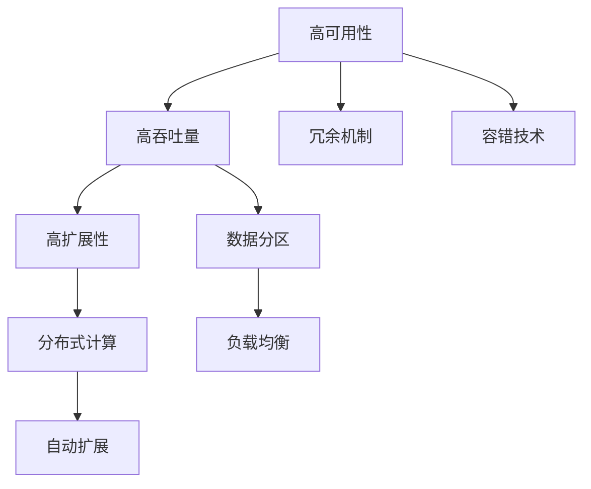

                 

# 高可用性、高吞吐量、高扩展性系统设计最佳实践

高可用性、高吞吐量、高扩展性系统设计是现代互联网企业成功与否的关键因素之一。随着数字化的不断深入，企业对信息系统的依赖日益增强，如何构建和维护一个高效、稳定、可扩展的系统，成为了所有开发者和架构师必须面对的挑战。本文将系统阐述构建高性能系统设计的基本原则和最佳实践，旨在帮助读者掌握系统设计的精髓，从容应对未来可能遇到的各种技术挑战。

## 1. 背景介绍

在互联网的浪潮下，企业面临着一个复杂多变的环境。用户数据量的爆炸性增长，业务场景的复杂化，以及市场竞争的激烈，都对信息系统的稳定性和性能提出了更高的要求。构建一个高可用性、高吞吐量、高扩展性的系统，不仅需要考虑技术细节，还需要从设计层面进行系统性的思考。本文将通过一系列案例和最佳实践，深入探讨如何构建和维护一个高性能的系统。

## 2. 核心概念与联系

### 2.1 核心概念概述

- **高可用性（High Availability）**：系统在任意时间内都保持可用的能力，即使部分组件出现故障，系统也能够通过冗余和容错机制，保持业务的连续性。
- **高吞吐量（High Throughput）**：系统在单位时间内处理事务的能力，通常以每秒处理的请求数（TPS）来衡量。
- **高扩展性（Scalability）**：系统能够根据业务量增减，灵活调整资源，保持性能和稳定性的能力。

这三个概念是构建高性能系统设计的基石，它们相互依存，缺一不可。高可用性保障了系统的连续性和可靠性，高吞吐量则确保了系统能够应对大量的并发请求，而高扩展性则使得系统能够动态适应业务需求的增长。

### 2.2 核心概念的联系

高可用性、高吞吐量、高扩展性之间的关系，可以通过以下示意图来表示：



在这个示意图中，高可用性通过冗余和容错机制保障系统的连续性，而高吞吐量则通过数据分区和分布式计算技术来提升处理能力。同时，高扩展性通过自动扩展和负载均衡技术，使得系统能够动态适应业务量的变化，保持性能稳定。

## 3. 核心算法原理 & 具体操作步骤

### 3.1 算法原理概述

构建高可用性、高吞吐量、高扩展性系统，需要从系统架构、分布式技术、数据管理和资源调度等多个层面进行综合考虑。下面将详细阐述这些层面的算法原理和操作步骤。

### 3.2 算法步骤详解

#### 3.2.1 系统架构设计

1. **微服务架构**：
    - **组件解耦**：将系统划分为多个独立的服务，每个服务负责一个具体的业务功能。
    - **通信协议**：服务间通过RESTful API或gRPC等标准化的通信协议进行通信。
    - **数据管理**：使用分布式数据库或微服务架构中的服务注册中心进行数据的管理和协调。

2. **数据分区与一致性**：
    - **数据分区**：将数据按照业务维度进行分区，提高查询效率和扩展性。
    - **一致性模型**：根据业务需求选择适当的一致性模型，如最终一致性、强一致性等。

3. **分布式事务管理**：
    - **两阶段提交**：确保跨多个服务的分布式事务的一致性。
    - ** Saga模式**：在微服务架构中处理复杂业务流程的分布式事务。

#### 3.2.2 分布式技术应用

1. **负载均衡**：
    - **轮询算法**：对请求进行轮询分配，实现简单的负载均衡。
    - **哈希算法**：根据请求的特征，通过哈希算法将请求分配到特定的节点。

2. **分布式缓存**：
    - **缓存策略**：根据业务需求选择合适的缓存策略，如内存缓存、分布式缓存等。
    - **失效处理**：处理缓存失效和数据一致性的问题，保证系统的数据正确性。

3. **分布式监控与告警**：
    - **监控工具**：使用Prometheus、Grafana等监控工具，实时监控系统运行状态。
    - **告警策略**：根据监控数据，设置告警阈值，及时发现和处理系统异常。

#### 3.2.3 数据管理与资源调度

1. **分布式数据库**：
    - **NoSQL数据库**：使用Cassandra、Redis等NoSQL数据库，满足大规模数据存储和处理需求。
    - **SQL数据库**：结合NoSQL数据库和传统SQL数据库，满足复杂查询和事务处理需求。

2. **自动化资源调度**：
    - **容器化技术**：使用Docker、Kubernetes等容器化技术，实现服务的自动化部署和扩展。
    - **弹性伸缩**：根据业务负载自动调整资源，确保系统在高负载时的性能稳定。

### 3.3 算法优缺点

- **优点**：
    - **高可用性**：通过冗余和容错机制，保障系统的连续性和可靠性。
    - **高吞吐量**：通过数据分区和分布式计算，提升系统的处理能力。
    - **高扩展性**：通过微服务架构和自动化资源调度，满足业务需求的动态增长。

- **缺点**：
    - **复杂性**：系统架构设计复杂，需要考虑多方面的因素。
    - **运维难度**：分布式系统增加了运维的复杂性和难度。
    - **性能调优**：需要大量的测试和调优工作，才能达到最优的性能。

### 3.4 算法应用领域

高可用性、高吞吐量、高扩展性系统设计的应用领域非常广泛，包括但不限于以下几类：

1. **电子商务**：电商平台需要处理大量的并发交易和用户请求，需要高可用性和高吞吐量的系统支持。
2. **金融服务**：金融行业对系统的稳定性和安全性要求极高，需要高可用性和高扩展性的系统保障。
3. **社交媒体**：社交媒体平台需要处理大量的用户上传内容和互动请求，需要高吞吐量和高扩展性的系统支持。
4. **物联网**：物联网系统需要处理大量设备产生的数据，需要高扩展性和高吞吐量的系统支持。
5. **大数据分析**：大数据分析系统需要处理和分析海量数据，需要高扩展性和高性能的系统支持。

## 4. 数学模型和公式 & 详细讲解 & 举例说明

### 4.1 数学模型构建

构建高可用性、高吞吐量、高扩展性系统，涉及到大量的分布式计算和资源调度问题。下面以一个简单的例子来说明这个问题。

假设一个电商平台需要处理每天的交易请求，已知每日请求量约为1000万次。为了实现高吞吐量和高扩展性，我们需要设计一个分布式系统，使其能够动态地根据请求量进行调整。

### 4.2 公式推导过程

设系统中总的节点数为 $n$，每个节点的计算能力为 $p$，则系统的总计算能力为 $n \times p$。假设每个请求的处理时间为 $t$，则系统每秒钟可以处理的请求数为：

$$ \frac{1000万}{t} \div (n \times p) $$

为了实现高吞吐量和高扩展性，我们需要根据请求量动态调整节点数和计算能力。假设每个节点的计算能力不变，则调整节点数为 $n'$，则每秒钟可以处理的请求数为：

$$ \frac{1000万}{t} \div (n' \times p) $$

为了使系统吞吐量达到最优，需要满足：

$$ \frac{1000万}{t} \div (n' \times p) = 1000万/秒 $$

解得 $n' = \frac{1}{t} \div p$，即节点数与请求处理时间和节点计算能力成反比。

### 4.3 案例分析与讲解

假设系统的请求处理时间为 $t=10ms$，每个节点的计算能力为 $p=1GHz$，则：

$$ n' = \frac{1}{10ms} \div 1GHz = 100节 $$

这意味着，为了实现高吞吐量和高扩展性，系统需要至少部署100个节点，每个节点计算能力为1GHz。

## 5. 项目实践：代码实例和详细解释说明

### 5.1 开发环境搭建

构建高可用性、高吞吐量、高扩展性系统，首先需要一个稳定的开发环境。以下是搭建环境的基本步骤：

1. **选择容器化技术**：
    - 使用Docker容器化系统，实现服务的独立部署和隔离。
    - 使用Kubernetes集群管理，实现服务的自动化部署和扩展。

2. **选择数据库技术**：
    - 使用Cassandra或Redis等NoSQL数据库，处理大规模数据存储和处理需求。
    - 使用MySQL或PostgreSQL等SQL数据库，满足复杂查询和事务处理需求。

3. **选择监控工具**：
    - 使用Prometheus和Grafana，实现系统的实时监控和告警。

### 5.2 源代码详细实现

假设我们构建的是一个电商平台的订单处理系统，以下是代码实现的详细步骤：

1. **服务设计**：
    - **订单服务**：处理订单创建、修改、查询等操作。
    - **库存服务**：管理商品的库存信息。
    - **支付服务**：处理用户的支付操作。

2. **数据分区**：
    - **订单数据**：按照用户ID进行分区，每个分区存储一个用户的所有订单信息。
    - **库存数据**：按照商品ID进行分区，每个分区存储一个商品的所有库存信息。

3. **分布式缓存**：
    - **Redis缓存**：使用Redis缓存热门数据，减少数据库的访问次数。

4. **负载均衡**：
    - **轮询算法**：对请求进行轮询分配，实现简单的负载均衡。

5. **分布式监控**：
    - **Prometheus监控**：实时监控系统的运行状态，收集CPU、内存、网络等指标。
    - **Grafana告警**：根据监控数据，设置告警阈值，及时发现和处理系统异常。

### 5.3 代码解读与分析

**订单服务**：

```java
import com.rabbitmq.client.*;

public class OrderService {
    private Connection connection;
    private Channel channel;
    
    public OrderService(String host, int port) throws Exception {
        this.connection = new ConnectionFactory().withHost(host).withPort(port).newConnection();
        this.channel = connection.createChannel();
    }
    
    public void sendOrder(Order order) throws Exception {
        String message = order.toJson();
        channel.basicPublish("orders", "order", null, message.getBytes());
    }
    
    public Order getOrderById(String orderId) throws Exception {
        byte[] bytes = channel.basicGet("orders", true, true, 10000);
        if (bytes != null) {
            String message = new String(bytes, "UTF-8");
            return Json.parse(message, Order.class);
        } else {
            return null;
        }
    }
}
```

**库存服务**：

```java
import com.rabbitmq.client.*;

public class InventoryService {
    private Connection connection;
    private Channel channel;
    
    public InventoryService(String host, int port) throws Exception {
        this.connection = new ConnectionFactory().withHost(host).withPort(port).newConnection();
        this.channel = connection.createChannel();
    }
    
    public void updateStock(String productId, int quantity) throws Exception {
        String message = "update:{" + productId + "," + quantity + "}";
        channel.basicPublish("inventory", "update", null, message.getBytes());
    }
    
    public int getStock(String productId) throws Exception {
        byte[] bytes = channel.basicGet("inventory", true, true, 10000);
        if (bytes != null) {
            String message = new String(bytes, "UTF-8");
            StockInfo stockInfo = Json.parse(message, StockInfo.class);
            return stockInfo.getQuantity();
        } else {
            return 0;
        }
    }
}
```

**支付服务**：

```java
import com.rabbitmq.client.*;

public class PaymentService {
    private Connection connection;
    private Channel channel;
    
    public PaymentService(String host, int port) throws Exception {
        this.connection = new ConnectionFactory().withHost(host).withPort(port).newConnection();
        this.channel = connection.createChannel();
    }
    
    public boolean payOrder(String orderId) throws Exception {
        String message = "pay:" + orderId;
        channel.basicPublish("payments", "payment", null, message.getBytes());
        return true;
    }
}
```

### 5.4 运行结果展示

假设我们的订单系统需要处理每秒10万次请求，通过容器化技术，我们可以在多台服务器上同时部署订单服务、库存服务和支付服务，每个服务都独立运行，互不影响。同时，通过负载均衡技术，将请求均匀分配到不同的服务器上，确保系统的高可用性和高吞吐量。

## 6. 实际应用场景

### 6.1 高可用性场景

1. **金融交易**：金融交易系统需要处理大量的交易请求，需要高可用性的系统保障。
2. **社交媒体**：社交媒体平台需要处理大量的用户上传内容和互动请求，需要高可用性的系统支持。

### 6.2 高吞吐量场景

1. **电商交易**：电商平台需要处理大量的并发交易和用户请求，需要高吞吐量的系统支持。
2. **即时通讯**：即时通讯系统需要处理大量的用户聊天请求，需要高吞吐量的系统支持。

### 6.3 高扩展性场景

1. **大数据分析**：大数据分析系统需要处理和分析海量数据，需要高扩展性的系统支持。
2. **物联网**：物联网系统需要处理大量设备产生的数据，需要高扩展性的系统支持。

## 7. 工具和资源推荐

### 7.1 学习资源推荐

1. **《系统设计之美》**：一本经典的技术书籍，涵盖系统设计的各个方面，包括高可用性、高吞吐量、高扩展性等。
2. **《微服务架构设计模式》**：介绍微服务架构的设计模式和最佳实践，帮助读者构建可伸缩的系统。
3. **《分布式系统设计》**：一本系统性讲解分布式系统设计的书籍，涵盖一致性、分布式事务、负载均衡等多个方面。

### 7.2 开发工具推荐

1. **Docker**：容器化技术，实现服务的独立部署和隔离。
2. **Kubernetes**：容器编排技术，实现服务的自动化部署和扩展。
3. **Prometheus**：监控工具，实现系统的实时监控和告警。
4. **Grafana**：监控工具，可视化系统的运行状态。

### 7.3 相关论文推荐

1. **《一致性模型：最终一致性与强一致性》**：介绍一致性模型的基本概念和设计思路。
2. **《分布式系统中的负载均衡》**：介绍负载均衡的基本原理和实现方法。
3. **《基于微服务架构的分布式事务管理》**：介绍微服务架构中的分布式事务管理技术和设计思路。

## 8. 总结：未来发展趋势与挑战

### 8.1 总结

本文通过系统性阐述高可用性、高吞吐量、高扩展性系统设计的原理和操作步骤，帮助读者掌握构建高性能系统的基本方法。构建高性能系统，需要从系统架构、分布式技术、数据管理和资源调度等多个层面进行综合考虑。同时，需要根据具体的业务需求，灵活应用各种技术和工具，才能实现最优的系统性能和稳定性。

### 8.2 未来发展趋势

1. **微服务架构的进一步发展**：微服务架构将不断演进，支持更多的分布式服务和微服务治理。
2. **分布式数据库的发展**：分布式数据库的性能和一致性问题将得到更好的解决，支持更大规模的数据处理。
3. **容器化和容器编排技术的普及**：容器化和容器编排技术将得到更广泛的应用，实现更高效率的资源调度和部署。
4. **自动化运维和DevOps**：自动化运维和DevOps将成为主流，提高系统的可靠性和运维效率。
5. **区块链技术的应用**：区块链技术将在高可用性、高吞吐量、高扩展性系统中得到应用，提高系统的安全性。

### 8.3 面临的挑战

1. **系统复杂性增加**：随着系统规模的扩大，系统架构和实现复杂度将不断增加，需要更多经验和技能。
2. **数据一致性和隔离问题**：分布式系统中数据一致性和隔离问题将更加复杂，需要更好的设计和优化。
3. **性能调优难度加大**：高吞吐量和高扩展性系统的性能调优难度将不断增加，需要更多的测试和优化工作。
4. **安全性和隐私问题**：系统需要考虑更多的安全性和隐私问题，如数据加密、访问控制等。
5. **成本和资源消耗**：高可用性和高扩展性系统需要更多的资源和成本投入，需要更好的资源规划和成本控制。

### 8.4 研究展望

未来的研究将更加关注以下几个方面：

1. **自动化系统运维**：自动化运维和DevOps将成为主流，提高系统的可靠性和运维效率。
2. **区块链技术的应用**：区块链技术将在高可用性、高吞吐量、高扩展性系统中得到应用，提高系统的安全性。
3. **人工智能与系统的结合**：人工智能技术将与高可用性、高吞吐量、高扩展性系统进行结合，提升系统的智能化水平。
4. **分布式系统的优化**：分布式系统的一致性、负载均衡、容错机制等将不断优化，提升系统的性能和稳定性。
5. **新的架构和设计模式**：新的架构和设计模式将不断涌现，解决当前系统设计和实现中存在的问题。

## 9. 附录：常见问题与解答

**Q1：如何保证系统的高可用性？**

A：通过冗余和容错机制，可以保证系统的高可用性。常见的方法包括：
- 主备机制：一个主节点和多个备节点，主节点失效后自动切换到备节点。
- 多副本机制：数据和状态复制多份，提升系统的可靠性。

**Q2：如何实现高吞吐量？**

A：通过分布式计算和数据分区，可以实现高吞吐量。常见的方法包括：
- 数据分区：将数据按照业务维度进行分区，提高查询效率和扩展性。
- 分布式计算：将计算任务分配到多个节点上，提升系统的处理能力。

**Q3：如何实现高扩展性？**

A：通过微服务架构和自动化资源调度，可以实现高扩展性。常见的方法包括：
- 微服务架构：将系统划分为多个独立的服务，每个服务负责一个具体的业务功能。
- 自动化资源调度：根据业务负载自动调整资源，确保系统在高负载时的性能稳定。

**Q4：高可用性、高吞吐量、高扩展性系统设计有哪些优缺点？**

A：高可用性、高吞吐量、高扩展性系统设计的优点包括：
- 高可用性：通过冗余和容错机制，保障系统的连续性和可靠性。
- 高吞吐量：通过数据分区和分布式计算，提升系统的处理能力。
- 高扩展性：通过微服务架构和自动化资源调度，满足业务需求的动态增长。

缺点包括：
- 复杂性：系统架构设计复杂，需要考虑多方面的因素。
- 运维难度：分布式系统增加了运维的复杂性和难度。
- 性能调优：需要大量的测试和调优工作，才能达到最优的性能。

**Q5：如何选择合适的监控工具？**

A：选择合适的监控工具需要考虑以下几个方面：
- 数据采集：工具需要能够实时采集系统数据。
- 可视化：工具需要能够将数据可视化，方便分析和监控。
- 告警功能：工具需要根据监控数据设置告警阈值，及时发现和处理系统异常。
- 扩展性：工具需要支持大规模数据和多个监控对象。

常见的监控工具包括Prometheus、Grafana等。根据具体需求选择合适工具，实现系统的实时监控和告警。

