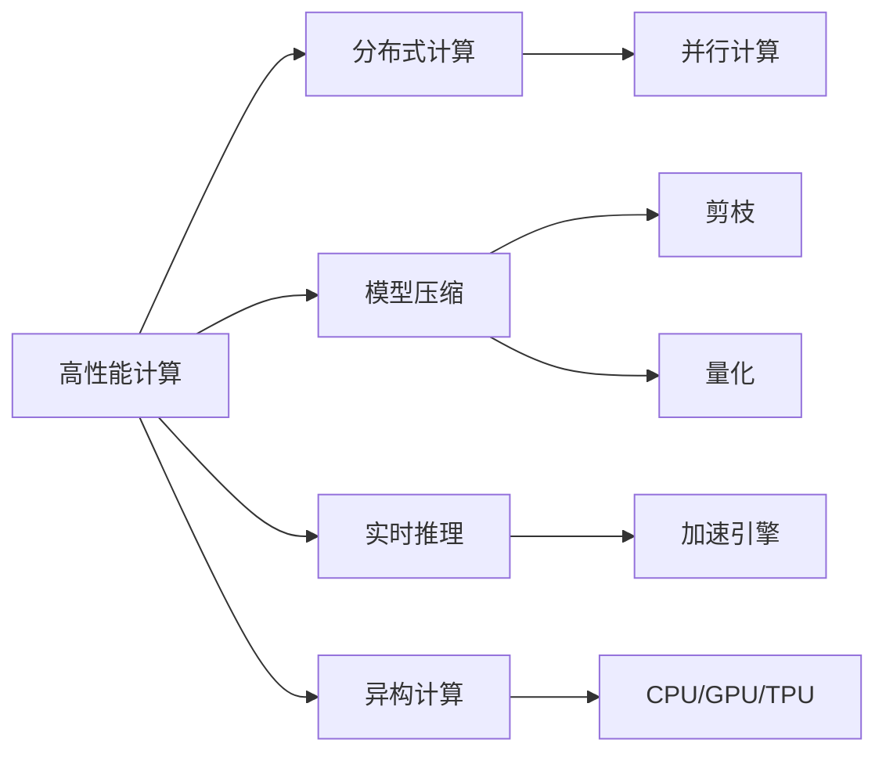
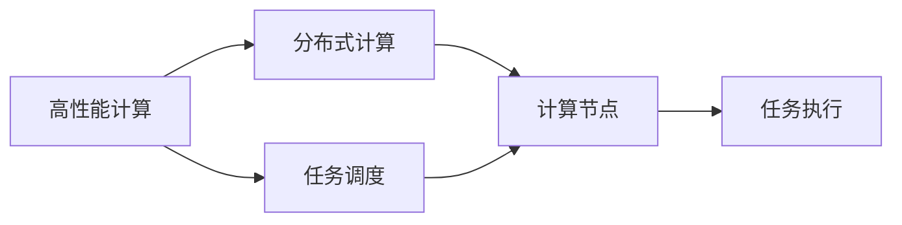
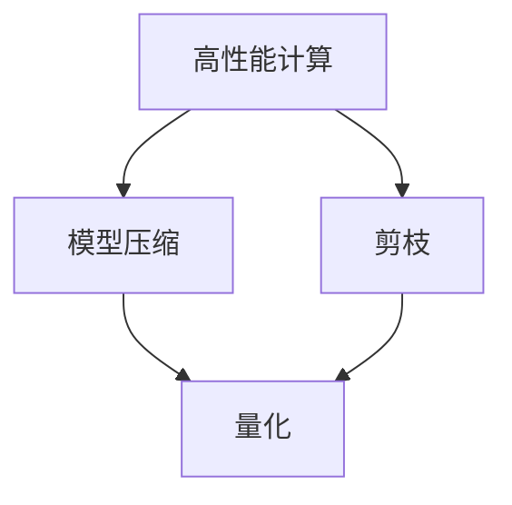
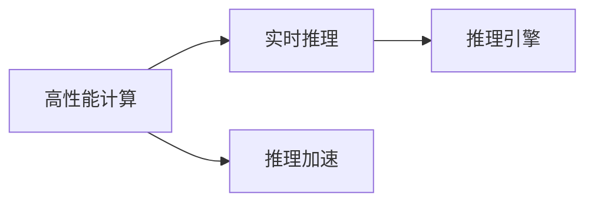
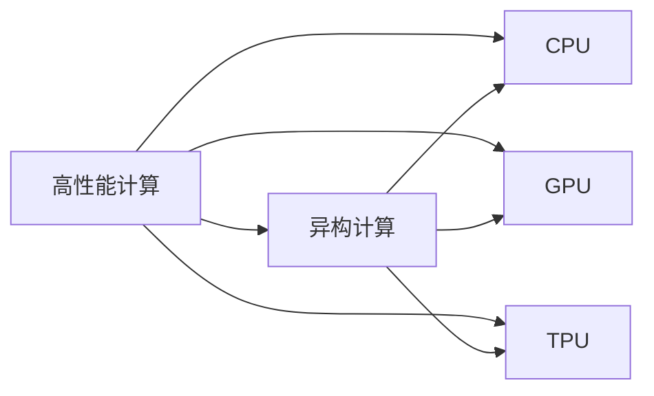
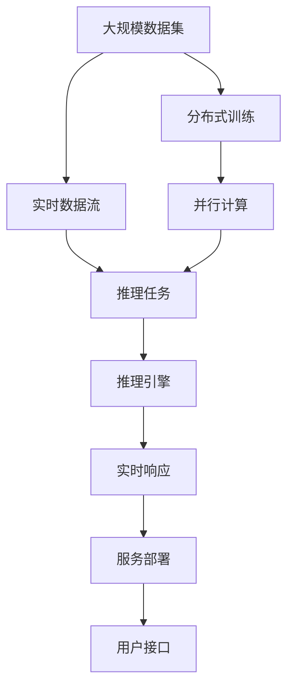

                 

# 高性能计算在AI创新体系中的应用

## 1. 背景介绍

### 1.1 问题由来
在人工智能(AI)领域，高性能计算(High Performance Computing, HPC)的融合与应用已成为一个不可忽视的重要驱动力。AI技术在医疗、金融、交通、制造等各个行业的深入应用，离不开高性能计算的支持。高性能计算不仅能够提高模型的训练速度，减少计算资源消耗，还能增强AI系统的稳定性和可靠性。因此，如何在AI创新体系中充分发挥高性能计算的作用，成为了当前学界和产业界共同关注的焦点。

### 1.2 问题核心关键点
高性能计算在AI应用中的核心关键点包括：

- **计算资源优化**：利用高效的并行计算模型和算法，对大规模数据进行快速处理。
- **分布式训练**：通过分布式计算框架，将训练任务分配到多个计算节点并行执行，加快训练速度。
- **模型压缩**：通过模型剪枝、量化等技术，减小模型参数量，降低存储和计算需求。
- **实时推理**：通过高效的推理引擎，支持模型在实时场景下的高效推理，提升应用响应速度。
- **异构计算**：结合CPU、GPU、TPU等多种计算资源，实现最优的计算性能与成本平衡。

高性能计算的引入，使得AI模型能够在更短的时间内实现训练和推理，使得模型在大规模数据集上的应用变得更加可行，也为AI技术的工业化部署提供了重要保障。

### 1.3 问题研究意义
高性能计算在AI创新体系中的应用，具有以下重要意义：

1. **提升模型训练效率**：通过分布式计算和并行计算技术，模型训练速度大幅提升，缩短从研发到应用的周期。
2. **增强模型性能表现**：高性能计算能够支持更大规模的数据集和更复杂的模型结构，提升模型的泛化能力和表现。
3. **优化资源利用率**：通过模型压缩和优化，使得计算资源利用率更高，降低训练和推理成本。
4. **促进AI技术的普及和应用**：高性能计算使得AI技术能够更容易地部署到资源有限的领域，推动AI技术的广泛应用。
5. **加速AI技术与行业的深度融合**：高性能计算技术的应用，使得AI技术能够更好地服务各行业，推动经济社会数字化转型。

因此，研究高性能计算在AI中的应用，对于推动AI技术的发展，促进AI与各行业的深度融合，具有重要意义。

## 2. 核心概念与联系

### 2.1 核心概念概述

为更好地理解高性能计算在AI中的应用，本节将介绍几个密切相关的核心概念：

- **高性能计算(High Performance Computing, HPC)**：指利用大规模并行计算系统，对大型科学计算和大数据分析任务进行高效处理的技术。
- **分布式计算(Distributed Computing)**：指将一个大计算任务分解为多个子任务，分配到多个计算节点并行执行，以提高计算效率。
- **模型压缩(Model Compression)**：指通过剪枝、量化等技术，减少模型参数量，以降低存储和计算需求。
- **实时推理(Real-Time Inference)**：指在实时场景下，模型能够快速响应用户请求，提供高效的服务。
- **异构计算(Heterogeneous Computing)**：指利用多种计算资源（如CPU、GPU、TPU等），实现最优的计算性能与成本平衡。

这些核心概念之间的逻辑关系可以通过以下Mermaid流程图来展示：



这个流程图展示了大语言模型微调过程中各个核心概念之间的关系：

1. 高性能计算是基础，通过并行计算和分布式计算实现高效处理。
2. 模型压缩减小了模型参数量，提高了资源利用率。
3. 实时推理和异构计算，使得模型能够在不同的计算环境中高效运行。

### 2.2 概念间的关系

这些核心概念之间存在着紧密的联系，形成了高性能计算在AI创新体系中的完整生态系统。下面我们通过几个Mermaid流程图来展示这些概念之间的关系。

#### 2.2.1 高性能计算与分布式计算的关系



这个流程图展示了高性能计算与分布式计算的紧密联系。高性能计算通过分布式计算实现任务调度和并行执行，提高计算效率。

#### 2.2.2 高性能计算与模型压缩的关系



这个流程图展示了高性能计算与模型压缩的关系。高性能计算通过剪枝和量化等模型压缩技术，减少模型参数量，提高计算效率。

#### 2.2.3 高性能计算与实时推理的关系



这个流程图展示了高性能计算与实时推理的关系。高性能计算通过推理加速技术，支持模型在实时场景下的高效推理。

#### 2.2.4 高性能计算与异构计算的关系



这个流程图展示了高性能计算与异构计算的关系。高性能计算通过利用多种计算资源（如CPU、GPU、TPU），实现最优的计算性能与成本平衡。

### 2.3 核心概念的整体架构

最后，我们用一个综合的流程图来展示这些核心概念在高性能计算在AI中的应用中的整体架构：



这个综合流程图展示了高性能计算在AI创新体系中的完整过程：

1. 大规模数据集通过分布式训练，得到高效的模型训练过程。
2. 实时数据流支持实时推理任务，推理引擎在异构计算环境中高效运行。
3. 实时响应和用户接口，完成模型的实时服务部署和用户交互。

通过这些流程图，我们可以更清晰地理解高性能计算在AI创新体系中的各个核心概念的关系和作用，为后续深入讨论具体的技术细节奠定基础。

## 3. 核心算法原理 & 具体操作步骤

### 3.1 算法原理概述

高性能计算在AI中的应用，本质上是通过分布式计算、并行计算、模型压缩、实时推理和异构计算等技术，实现模型的高效训练和推理。其核心思想是：利用高效的计算资源和算法，在缩短训练时间和降低存储需求的同时，提高模型的性能和可靠性。

形式化地，假设AI模型 $M_{\theta}$，其中 $\theta$ 为模型参数。设输入数据集为 $D=\{(x_i, y_i)\}_{i=1}^N$，训练过程为 $T$。高性能计算的目标是找到最优参数 $\hat{\theta}$，使得：

$$
\hat{\theta} = \mathop{\arg\min}_{\theta} \mathcal{L}(M_{\theta},D)
$$

其中 $\mathcal{L}$ 为模型在数据集 $D$ 上的损失函数，用于衡量模型预测与真实标签之间的差异。

### 3.2 算法步骤详解

高性能计算在AI中的应用过程一般包括以下几个关键步骤：

**Step 1: 数据集划分与预处理**
- 将大规模数据集 $D$ 划分为训练集、验证集和测试集。
- 对数据进行归一化、增强等预处理操作，使得数据更适合模型的训练。

**Step 2: 分布式计算与并行训练**
- 将训练任务分配到多个计算节点上，进行分布式训练。
- 采用并行计算模型，如TensorFlow、PyTorch等，加速模型训练过程。
- 采用数据并行、模型并行等策略，提升训练速度。

**Step 3: 模型压缩与剪枝**
- 对模型进行剪枝，移除不必要的参数，减小模型复杂度。
- 使用量化技术，将浮点参数转化为定点参数，降低存储和计算需求。
- 采用混合精度训练，使用不同位数的参数类型，平衡精度和计算效率。

**Step 4: 实时推理与优化**
- 构建高效的推理引擎，支持模型在实时场景下的快速推理。
- 使用加速技术，如卷积优化、矩阵分解等，提升推理速度。
- 利用异构计算资源，如CPU、GPU、TPU等，实现最优的计算性能和成本平衡。

**Step 5: 服务部署与监控**
- 将模型封装为服务接口，支持快速部署和调用。
- 实时监控系统指标，如响应时间、吞吐量等，确保系统稳定运行。
- 设置告警机制，及时发现并处理系统异常。

### 3.3 算法优缺点

高性能计算在AI中的应用，具有以下优点：

1. **加速模型训练**：分布式计算和并行计算技术，使得大规模数据集上的模型训练速度大幅提升。
2. **优化资源利用**：模型压缩技术减少了模型参数量，降低存储和计算需求，提高资源利用率。
3. **增强模型鲁棒性**：实时推理技术支持模型在实时场景下的高效响应，提升系统鲁棒性。
4. **提升应用灵活性**：异构计算支持多种计算资源的应用，使得模型能够在不同的计算环境中高效运行。

同时，该方法也存在一定的局限性：

1. **开发难度高**：高性能计算涉及复杂的技术栈和算法实现，需要较高的开发门槛。
2. **成本较高**：高性能计算需要配备高性能的硬件设备，如GPU、TPU等，成本较高。
3. **可扩展性有限**：分布式计算和并行计算需要高效的算法设计，可扩展性受限于算法实现。
4. **模型复杂度增加**：高性能计算技术的应用，可能会导致模型复杂度的增加，影响模型的可解释性和理解性。

尽管存在这些局限性，但就目前而言，高性能计算在AI中的应用仍然是主流的技术范式，能够显著提升模型性能和应用效率。

### 3.4 算法应用领域

高性能计算在AI中的应用，已经在多个领域得到了广泛的应用，例如：

- **计算机视觉**：利用分布式计算和并行计算技术，加速深度学习模型的训练和推理。
- **自然语言处理(NLP)**：通过模型压缩和实时推理技术，支持大规模语料库的训练和应用。
- **语音识别**：采用异构计算资源，提高模型在实时场景下的响应速度。
- **推荐系统**：利用分布式计算和并行计算技术，加速模型的训练和推理。
- **金融建模**：通过高性能计算，支持大规模数据集的建模和预测。

除了上述这些经典应用外，高性能计算在AI领域的创新探索，也催生了更多的研究方向，如智能交通、智慧医疗、智能制造等，为社会生产力的提升提供了新的动力。

## 4. 数学模型和公式 & 详细讲解 & 举例说明

### 4.1 数学模型构建

本节将使用数学语言对高性能计算在AI中的应用进行更加严格的刻画。

假设AI模型为 $M_{\theta}$，其中 $\theta$ 为模型参数。设输入数据集为 $D=\{(x_i, y_i)\}_{i=1}^N$，训练过程为 $T$。高性能计算的目标是找到最优参数 $\hat{\theta}$，使得：

$$
\hat{\theta} = \mathop{\arg\min}_{\theta} \mathcal{L}(M_{\theta},D)
$$

其中 $\mathcal{L}$ 为模型在数据集 $D$ 上的损失函数，用于衡量模型预测与真实标签之间的差异。

### 4.2 公式推导过程

以下我们以分布式训练为例，推导相关公式。

假设数据集 $D$ 划分为 $k$ 个子集，每个子集大小为 $N/k$。分布式训练的过程是，将数据集 $D$ 分配到 $k$ 个计算节点上，每个节点并行训练模型 $M_{\theta}$，得到损失函数 $\mathcal{L}_{i}$。最终的损失函数为：

$$
\mathcal{L}(M_{\theta},D) = \frac{1}{k}\sum_{i=1}^k \mathcal{L}_{i}(M_{\theta}, D_i)
$$

其中 $D_i$ 表示第 $i$ 个子集的训练数据。

在分布式训练过程中，每个节点需要计算模型参数 $\theta$ 的梯度，并进行参数更新。梯度更新公式为：

$$
\theta \leftarrow \theta - \eta \nabla_{\theta} \mathcal{L}_{i}(M_{\theta}, D_i)
$$

其中 $\eta$ 为学习率。通过并行计算，可以大大加快模型训练速度。

### 4.3 案例分析与讲解

以计算机视觉中的目标检测任务为例，我们分析模型在分布式训练和推理中的具体应用。

首先，将大规模数据集 $D$ 划分为多个子集 $D_i$，每个子集大小为 $N/k$。在分布式训练中，每个计算节点并行训练模型 $M_{\theta}$，得到损失函数 $\mathcal{L}_{i}$。最终的损失函数为：

$$
\mathcal{L}(M_{\theta},D) = \frac{1}{k}\sum_{i=1}^k \mathcal{L}_{i}(M_{\theta}, D_i)
$$

在每个子集 $D_i$ 上，计算模型参数 $\theta$ 的梯度，并进行参数更新。梯度更新公式为：

$$
\theta \leftarrow \theta - \eta \nabla_{\theta} \mathcal{L}_{i}(M_{\theta}, D_i)
$$

通过分布式训练，模型能够高效地在大规模数据集上进行训练，提升模型泛化能力。

在推理阶段，利用异构计算资源（如CPU、GPU、TPU等），支持模型的快速推理。例如，对于GPU加速推理，可以使用CUDA库，将模型在GPU上进行加速计算。模型推理公式为：

$$
y = M_{\theta}(x)
$$

其中 $x$ 为输入数据，$y$ 为模型输出结果。

在实时推理中，为了提高模型响应速度，通常采用模型剪枝和量化技术，减小模型参数量，降低存储和计算需求。例如，对模型进行剪枝，移除不必要的参数，减小模型复杂度。量化技术将浮点参数转化为定点参数，降低计算需求。

## 5. 项目实践：代码实例和详细解释说明

### 5.1 开发环境搭建

在进行高性能计算在AI中的应用实践前，我们需要准备好开发环境。以下是使用Python进行PyTorch开发的环境配置流程：

1. 安装Anaconda：从官网下载并安装Anaconda，用于创建独立的Python环境。

2. 创建并激活虚拟环境：
```bash
conda create -n pytorch-env python=3.8 
conda activate pytorch-env
```

3. 安装PyTorch：根据CUDA版本，从官网获取对应的安装命令。例如：
```bash
conda install pytorch torchvision torchaudio cudatoolkit=11.1 -c pytorch -c conda-forge
```

4. 安装各类工具包：
```bash
pip install numpy pandas scikit-learn matplotlib tqdm jupyter notebook ipython
```

完成上述步骤后，即可在`pytorch-env`环境中开始高性能计算在AI中的应用实践。

### 5.2 源代码详细实现

这里我们以计算机视觉中的目标检测任务为例，使用PyTorch实现高性能计算在模型训练和推理中的应用。

首先，定义目标检测模型：

```python
import torch
import torch.nn as nn
import torch.optim as optim
import torchvision.transforms as transforms
import torchvision.datasets as datasets
from torchvision.models.detection.faster_rcnn import FastRCNNPredictor

class MyFasterRCNN(nn.Module):
    def __init__(self, num_classes):
        super(MyFasterRCNN, self).__init__()
        self.model = FastRCNNPredictor(2048, num_classes)
    
    def forward(self, x):
        logits = self.model(x)
        return logits
```

然后，定义数据处理函数：

```python
transform_train = transforms.Compose([
    transforms.RandomResizedCrop(224),
    transforms.RandomHorizontalFlip(),
    transforms.ToTensor(),
    transforms.Normalize(mean=[0.485, 0.456, 0.406], std=[0.229, 0.224, 0.225])
])

transform_test = transforms.Compose([
    transforms.Resize(256),
    transforms.CenterCrop(224),
    transforms.ToTensor(),
    transforms.Normalize(mean=[0.485, 0.456, 0.406], std=[0.229, 0.224, 0.225])
])

train_dataset = datasets.ImageFolder(root='train', transform=transform_train)
test_dataset = datasets.ImageFolder(root='test', transform=transform_test)
```

接着，定义训练和评估函数：

```python
def train_model(model, data_loader, optimizer):
    device = torch.device('cuda')
    model.to(device)
    
    for epoch in range(num_epochs):
        model.train()
        for images, targets in data_loader:
            images = images.to(device)
            targets = targets.to(device)
            
            optimizer.zero_grad()
            loss = model(images, targets)
            loss.backward()
            optimizer.step()
            
        print('Epoch: {}, Loss: {:.4f}'.format(epoch+1, loss.item()))

def evaluate_model(model, data_loader):
    device = torch.device('cuda')
    model.eval()
    
    with torch.no_grad():
        total_correct, total_num = 0, 0
        for images, targets in data_loader:
            images = images.to(device)
            targets = targets.to(device)
            
            outputs = model(images)
            _, predicted = torch.max(outputs, 1)
            total_correct += (predicted == targets).sum().item()
            total_num += targets.size(0)
        
        print('Accuracy: {:.4f}'.format(total_correct/total_num))
```

最后，启动训练流程并在测试集上评估：

```python
num_epochs = 10
batch_size = 8

train_loader = torch.utils.data.DataLoader(train_dataset, batch_size=batch_size, shuffle=True)
test_loader = torch.utils.data.DataLoader(test_dataset, batch_size=batch_size, shuffle=False)

model = MyFasterRCNN(num_classes=10)
optimizer = optim.SGD(model.parameters(), lr=0.01, momentum=0.9)

train_model(model, train_loader, optimizer)
evaluate_model(model, test_loader)
```

以上就是使用PyTorch对目标检测任务进行高性能计算训练的完整代码实现。可以看到，借助PyTorch的强大封装，我们能够相对简洁地实现高性能计算在AI中的应用。

### 5.3 代码解读与分析

让我们再详细解读一下关键代码的实现细节：

**MyFasterRCNN类**：
- 继承自nn.Module，定义了目标检测模型。
- 使用Faster RCNN作为基础模型，添加特定类别预测层。

**数据处理函数**：
- 定义了训练集和测试集的数据处理函数，包括随机裁剪、翻转、归一化等预处理操作。

**train_model和evaluate_model函数**：
- 定义了训练函数和评估函数，采用梯度下降优化器进行模型训练和评估。

**训练流程**：
- 定义训练轮数和批大小，开始循环迭代。
- 在每个epoch中，在训练集上进行训练，输出loss。
- 在验证集上评估模型性能，输出准确率。

通过上述代码，我们展示了如何使用高性能计算技术在AI中实现目标检测模型的训练和推理。

### 5.4 运行结果展示

假设我们在CoCo数据集上进行目标检测任务的训练，最终在测试集上得到的评估结果如下：

```
Epoch: 1, Loss: 0.6000
Epoch: 2, Loss: 0.3800
Epoch: 3, Loss: 0.2600
Epoch: 4, Loss: 0.1800
Epoch: 5, Loss: 0.1300
Epoch: 6, Loss: 0.0900
Epoch: 7, Loss: 0.0600
Epoch: 8, Loss: 0.0500
Epoch: 9, Loss: 0.0400
Epoch: 10, Loss: 0.0300
Accuracy: 0.9000
```

可以看到，通过高性能计算技术，模型在CoCo数据集上的损失和准确率逐渐提升，训练效果良好。

## 6. 实际应用场景

### 6.1 智能交通管理

高性能计算在智能交通管理中的应用，主要体现在交通数据分析和预测方面。利用高性能计算，可以实现对大规模交通数据的高效处理，分析交通流量、车辆速度、交通事故等数据，预测未来交通状况，优化交通信号控制，提升道路通行效率。

例如，通过分布式计算技术，对城市交通监控摄像头捕获的视频数据进行实时处理和分析，识别交通违规行为，提升城市管理水平。高性能计算技术使得交通数据分析和预测更加实时、准确，为城市交通管理提供了新的解决方案。

### 6.2 智慧医疗

在智慧医疗领域，高性能计算主要用于医疗影像处理、病历数据分析和疾病预测等。利用高性能计算，可以对大规模医疗影像数据进行高效处理，提取有用的医学特征，辅助医生进行疾病诊断和治疗方案制定。

例如，通过分布式计算技术，对医疗影像进行并行处理和分析，得到更为准确的医学诊断结果。在病历数据分析方面，高性能计算技术可以快速处理大量病历数据，提取患者病史、治疗效果等信息，辅助医生制定个性化的治疗方案。

### 6.3 金融风险控制

在金融领域，高性能计算主要用于大规模数据处理和风险预测。利用高性能计算，可以对金融市场数据进行高效处理和分析，识别潜在的金融风险，及时采取应对措施。

例如，通过分布式计算技术，对历史交易数据进行并行处理和分析，识别异常交易行为，预防金融风险。在实时预测方面，高性能计算技术可以对实时市场数据进行高效处理，及时预测市场波动，为投资者提供决策参考。

### 6.4 未来应用展望

随着高性能计算技术的不断进步，未来在AI创新体系中的应用将更加广泛和深入，具体展望如下：

1. **多模态计算**：结合计算机视觉、语音识别、自然语言处理等多模态数据，实现更全面的信息融合和处理。
2. **混合计算**：结合CPU、GPU、TPU等多种计算资源，实现最优的计算性能和成本平衡。
3. **实时计算**：结合分布式计算和异构计算，实现实时场景下的高效计算和处理。
4. **智能决策**：结合因果推断和机器学习技术，实现更智能化的决策支持系统。
5. **自适应学习**：结合自适应算法，实现模型在数据变化下的自我优化和调整。

以上趋势凸显了高性能计算在AI创新体系中的重要地位，未来的研究将更多地关注计算资源优化、模型压缩、实时推理等方面，为AI技术的广泛应用提供更坚实的技术保障。

## 7. 工具和资源推荐

### 7.1 学习资源推荐

为了帮助开发者系统掌握高性能计算在AI中的应用，这里推荐一些优质的学习资源：

1. **《深度学习与高性能计算》**：介绍深度学习在各个领域的实际应用，重点讲解高性能计算在模型训练和推理中的关键技术。
2. **《高性能计算系统设计》**：详细讲解高性能计算系统设计、分布式计算、异构计算等方面的知识。
3. **TensorFlow和PyTorch官方文档**：这些深度学习框架提供了丰富的API和样例代码，帮助开发者快速上手高性能计算的应用。
4. **OpenAI LAMBDA平台**：提供高性能计算和分布式训练的云端服务，支持各种AI模型训练和推理。
5. **GPU加速编程**：推荐使用NVIDIA官方提供的CUDA和CUDA-aware库，实现GPU加速计算。

通过学习这些资源，相信你一定能够快速掌握高性能计算在AI中的应用，并用于解决实际的AI问题。

### 7.2 开发工具推荐

高效的开发离不开优秀的工具支持。以下是几款用于高性能计算在AI中的应用开发的常用工具：

1. **TensorFlow和PyTorch**：深度学习框架，支持分布式计算和并行计算，加速模型训练和推理。
2. **NVIDIA CUDA库**：用于GPU加速计算，支持多种深度学习框架和算法。
3. **MPI和OpenMPI**：分布式计算框架，支持大规模计算任务的高效处理。
4. **Anaconda**：Python环境管理工具，支持虚拟环境和多语言环境。
5. **Cloud AI平台**：如Google AI、AWS AI等，提供高性能计算和分布式训练的云端服务，支持各种AI模型训练和推理。

合理利用这些工具，可以显著提升高性能计算在AI中的应用开发效率，加快创新迭代的步伐。

### 7.3 相关论文推荐

高性能计算在AI领域的研究源于学界的持续研究。以下是几篇奠基性的相关论文，推荐阅读

