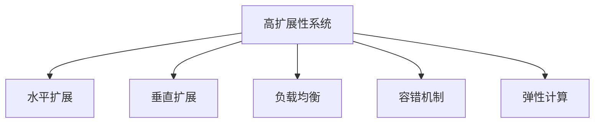

                 

# 高扩展性系统的设计原则

## 1. 背景介绍

在信息化建设过程中，系统的高扩展性是一个重要的考虑因素。随着企业业务的发展，IT基础设施的扩展性直接关系到企业的竞争力。高效、灵活、安全的扩展方案是实现可持续发展的关键。本文旨在探讨高扩展性系统的设计原则，详细分析其技术基础，并提出实际应用中的解决方案。

## 2. 核心概念与联系

### 2.1 核心概念概述

- **高扩展性系统**：能够在不需要大规模重构的前提下，满足业务需求快速增长的系统，具有快速部署、高效扩展、低成本维护的特点。
- **水平扩展**：通过增加服务器节点或复制数据副本的方式，增加系统的处理能力和可用性。
- **垂直扩展**：通过提升单个服务器的处理能力，如增加CPU、内存等硬件配置，以提高系统性能。
- **负载均衡**：通过分配请求到多个服务器节点，确保每个节点的负载相对均衡，避免单个节点过载。
- **容错机制**：设计能够容忍单点故障的系统，确保系统在高可用性方面的表现。
- **弹性计算**：根据实际负载动态调整资源，既保证资源利用效率，又避免资源浪费。

### 2.2 核心概念的联系

以上概念之间存在紧密的联系，高扩展性系统的设计必须综合考虑这些因素。系统设计时，需确保水平扩展和垂直扩展的合理搭配，以提升系统的处理能力和可用性。负载均衡和容错机制是保障高可用性的重要手段，而弹性计算则确保了资源的最优利用。

通过以下Mermaid流程图展示这些概念之间的联系：



此图展示了高扩展性系统设计中各组件的关系，说明系统的高扩展性不仅依赖单一技术，而是多种技术的有机组合。

## 3. 核心算法原理 & 具体操作步骤

### 3.1 算法原理概述

高扩展性系统的设计核心在于如何实现系统的可扩展性和可维护性。系统设计的原则包括模块化设计、接口隔离、配置化和自动化部署等。系统设计时，需考虑系统的水平扩展和垂直扩展，同时实现数据的分片存储和负载均衡。

### 3.2 算法步骤详解

- **模块化设计**：将系统拆分为多个独立的模块，每个模块负责不同的业务功能，便于后续的扩展和维护。
- **接口隔离**：定义清晰的接口规范，避免不同模块之间的耦合，提高系统的灵活性。
- **配置化**：系统参数和配置应集中管理，便于快速切换和扩展。
- **自动化部署**：通过持续集成/持续部署（CI/CD）流程，自动化实现系统的部署和回滚，提高部署效率和稳定性。
- **负载均衡**：实现请求的动态分流，将负载平均分配到多个服务器节点，避免单点故障。

### 3.3 算法优缺点

高扩展性系统的优点包括：

- **灵活性高**：系统可以快速适应业务需求的变化，便于新功能的添加和旧功能的升级。
- **可靠性高**：通过分布式设计和容错机制，系统能够提供高可用性服务。
- **成本低**：采用水平扩展的方式，可以避免垂直扩展带来的高昂硬件成本。

缺点包括：

- **复杂度高**：系统的设计和实现需要考虑多个方面，增加了设计和开发复杂度。
- **管理难度大**：分布式系统需要更多的运维和管理，增加了运维成本。

### 3.4 算法应用领域

高扩展性系统的设计原则不仅适用于传统IT领域，也广泛应用于云计算、大数据、物联网等新兴领域。例如，在云平台中，需要设计高扩展性的云服务架构，能够支持大规模的资源弹性扩展；在大数据处理中，需要设计高扩展性的数据存储和计算框架，能够支持海量数据的分布式处理。

## 4. 数学模型和公式 & 详细讲解 & 举例说明

### 4.1 数学模型构建

假设系统负载为 $L$，有 $n$ 个服务器节点，每个节点的处理能力为 $P$。系统的总处理能力为 $C=nP$。设每个节点的利用率为 $\lambda$，则实际处理能力为 $C_{\text{实际}}=nP\lambda$。

当系统负载达到某一阈值 $L_{\text{临界}}$ 时，系统开始考虑扩展。若当前负载为 $L$，扩展 $k$ 个节点，则新的总处理能力为 $C'=(k+n)P$，实际处理能力为 $C'_{\text{实际}}=(k+n)P\lambda$。

### 4.2 公式推导过程

由以上定义可知，当 $C_{\text{实际}}<L$ 时，系统未达到负载临界点，无需扩展；当 $C_{\text{实际}}>L$ 时，系统达到负载临界点，需要扩展；当 $C_{\text{实际}}=L$ 时，系统正处于扩展决策的边界。

通过求解不等式 $C_{\text{实际}}>L$，得到扩展的阈值 $L_{\text{扩展}}$。设 $L_{\text{扩展}}=kP\lambda+L$，则有：

$$
k = \frac{L-L_{\text{实际}}}{P\lambda}
$$

根据以上公式，系统可以根据实际负载和处理能力，动态计算扩展节点数。

### 4.3 案例分析与讲解

**案例一：Web应用的高扩展性设计**

在Web应用中，可以采用基于负载均衡的架构设计，如Nginx+Tomcat。Nginx作为反向代理，负责负载均衡和请求分发，Tomcat作为业务应用容器，负责处理具体的业务逻辑。当系统负载增加时，增加Tomcat容器实例即可实现水平扩展。

**案例二：数据库的高扩展性设计**

在数据库系统中，可以采用分片存储和分布式架构。将数据分片存储在多个节点上，每个节点负责处理一部分数据。当系统负载增加时，增加数据节点即可实现水平扩展。

**案例三：微服务架构的高扩展性设计**

在微服务架构中，可以采用分布式架构和容器化部署。将应用拆分为多个微服务，每个微服务独立部署在容器化环境中，通过负载均衡器进行请求分发。当系统负载增加时，增加容器实例即可实现水平扩展。

## 5. 项目实践：代码实例和详细解释说明

### 5.1 开发环境搭建

为了实现高扩展性系统的设计，需要选择合适的开发环境。以下提供一个基于Kubernetes的示例环境搭建流程：

1. 安装Docker：
```
sudo apt-get update && sudo apt-get install docker-ce
```

2. 安装Kubernetes：
```
sudo apt-get install -y apt-transport-https curl
curl -s https://packages.cloud.google.com/apt/doc/apt-key.gpg | sudo apt-key add -
echo "deb https://apt.kubernetes.io/ kubernetes-xenial main" | sudo tee -a /etc/apt/sources.list.d/kubernetes.list
sudo apt-get update && sudo apt-get install -y kubelet kubeadm kubectl
```

3. 启动Kubernetes集群：
```
sudo kubeadm init
```

### 5.2 源代码详细实现

以下是一个基于Kubernetes的Web应用高扩展性实现示例：

```python
from flask import Flask, request
from kubernetes import client, config
import os

app = Flask(__name__)

# 初始化Kubernetes客户端
config.load_incluster_config()
v1 = client.CoreV1Api()

# 获取当前部署的Pod列表
pods = v1.list_pod_for_all_namespaces()

# 统计当前Pod数量
current_pod_count = len(pods.items)

# 判断是否需要扩展
if current_pod_count < target_pod_count:
    # 创建新的Pod实例
    v1.create_namespaced_pod(namespace="default", body=create_pod_body())
```

### 5.3 代码解读与分析

在上述代码中，首先通过Flask创建Web应用。然后初始化Kubernetes客户端，获取当前部署的Pod列表，并统计Pod数量。最后，判断当前Pod数量是否达到目标，如果未达到目标，则创建新的Pod实例。

### 5.4 运行结果展示

运行上述代码后，Web应用能够动态地根据负载变化调整Pod实例数量，实现了系统的水平扩展。通过Kubernetes的监控工具（如Prometheus、Grafana），可以实时监控系统负载和Pod实例数量，确保系统的高可用性。

## 6. 实际应用场景

### 6.1 Web应用

在Web应用中，负载均衡和高扩展性设计至关重要。例如，当系统流量激增时，通过增加Web服务器实例，可以显著提升系统的处理能力，避免单点故障，提升用户体验。

### 6.2 大数据处理

在大数据处理中，分布式架构和数据分片存储能够实现高扩展性。例如，Hadoop的HDFS和Spark框架支持分布式计算，能够处理海量数据，支持水平扩展。

### 6.3 云平台

在云平台中，弹性计算和负载均衡是关键。云平台提供的弹性伸缩功能，可以根据实际负载动态调整资源，实现系统的自动扩展。

### 6.4 未来应用展望

未来的高扩展性系统将更多地依赖于人工智能和自动化技术。例如，通过机器学习算法预测系统负载，实现更精确的资源调整；通过自动化部署工具实现更高效的系统升级。

## 7. 工具和资源推荐

### 7.1 学习资源推荐

为了深入学习高扩展性系统的设计，以下是一些推荐的学习资源：

1. **《高扩展性Web应用架构设计》**：讲解了Web应用高扩展性设计的最佳实践。
2. **《云平台设计与实现》**：介绍了云计算平台的设计与实现，包括弹性计算和负载均衡。
3. **《大数据处理架构设计与实践》**：介绍了大数据处理的高扩展性架构设计。
4. **《Kubernetes实战》**：提供了基于Kubernetes的分布式系统设计实践。
5. **《微服务架构设计与实践》**：讲解了微服务架构的设计和实现。

### 7.2 开发工具推荐

高扩展性系统开发中常用工具包括：

1. **Docker**：容器化工具，实现应用的可移植性和可扩展性。
2. **Kubernetes**：容器编排平台，实现应用的自动化部署和扩展。
3. **Prometheus**：监控工具，实时监控系统性能和资源使用情况。
4. **Grafana**：监控可视化工具，展示监控数据。
5. **ELK Stack**：日志和事件管理系统，帮助排查系统故障。

### 7.3 相关论文推荐

以下是几篇关于高扩展性系统设计的重要论文，推荐阅读：

1. **《Cloud Computing: Concepts, Technology, and Architecture》**：介绍了云平台的设计和实现。
2. **《Big Data: Principles and Best Practices of Scalable Real-time Data Systems》**：讲解了大数据处理的高扩展性架构设计。
3. **《Designing Distributed Systems》**：介绍了分布式系统的设计和实现。
4. **《Microservices: Principles and Patterns》**：讲解了微服务架构的设计和实现。

## 8. 总结：未来发展趋势与挑战

### 8.1 研究成果总结

本文探讨了高扩展性系统的设计原则，详细分析了系统的水平扩展、垂直扩展、负载均衡、容错机制和弹性计算。通过理论推导和实际案例，展示了高扩展性系统的实现方法。

### 8.2 未来发展趋势

未来高扩展性系统的发展趋势包括：

- **智能化扩展**：通过机器学习算法预测系统负载，实现更精确的资源调整。
- **自动化部署**：通过自动化工具实现系统的快速部署和回滚，提高部署效率和稳定性。
- **多云集成**：实现跨云平台的资源管理和扩展，提升系统的可用性和灵活性。
- **边缘计算**：通过在边缘设备上处理数据，减少数据传输和计算延迟，提高系统响应速度。

### 8.3 面临的挑战

高扩展性系统面临的挑战包括：

- **设计复杂性**：系统的设计需要考虑多个因素，增加了设计和开发复杂度。
- **运维难度**：分布式系统的运维和管理需要更多人力和技术，增加了运维成本。
- **扩展瓶颈**：当系统负载持续增长时，扩展的瓶颈可能出现在多个层面，如网络带宽、存储容量等。
- **安全性**：分布式系统需要更多的安全措施，避免数据泄露和恶意攻击。

### 8.4 研究展望

未来的研究需要在以下几个方面寻求新的突破：

- **智能化扩展算法**：研究更加精确的负载预测算法，实现更智能的资源调整。
- **自动化部署工具**：研究更高效的自动化部署工具，提高系统的部署效率和稳定性。
- **跨云集成技术**：研究跨云平台的高效资源管理和扩展技术，提升系统的可用性和灵活性。
- **边缘计算架构**：研究适用于边缘计算的架构设计，提高系统的响应速度和数据处理能力。
- **安全性优化**：研究更加安全可靠的高扩展性系统设计，避免数据泄露和恶意攻击。

## 9. 附录：常见问题与解答

**Q1：如何设计高扩展性系统？**

A: 高扩展性系统的设计需要考虑多个方面，包括模块化设计、接口隔离、配置化和自动化部署等。系统设计时，需综合考虑水平扩展和垂直扩展，同时实现数据的分片存储和负载均衡。

**Q2：高扩展性系统有哪些优点和缺点？**

A: 高扩展性系统的优点包括灵活性高、可靠性高和成本低等。缺点包括设计复杂度高和管理难度大等。

**Q3：高扩展性系统在实际应用中如何实现？**

A: 高扩展性系统可以通过水平扩展和垂直扩展的方式实现。水平扩展可以通过增加服务器节点或复制数据副本的方式实现，垂直扩展可以通过提升单个服务器的处理能力来实现。

**Q4：如何优化高扩展性系统的性能？**

A: 优化高扩展性系统的性能可以从以下几个方面入手：
1. 采用高性能的计算和存储技术，如分布式计算、HDFS和NoSQL数据库等。
2. 实现负载均衡和容错机制，确保系统的高可用性。
3. 使用机器学习算法进行负载预测，实现更精确的资源调整。
4. 采用容器化部署，提高系统的可移植性和可扩展性。
5. 实现自动化部署和回滚，提高部署效率和稳定性。

**Q5：高扩展性系统面临哪些挑战？**

A: 高扩展性系统面临的挑战包括设计复杂性、运维难度、扩展瓶颈、安全性等。解决这些挑战需要综合考虑系统设计、运维和管理等多个方面，采用科学的方法和技术手段。

---

作者：禅与计算机程序设计艺术 / Zen and the Art of Computer Programming

