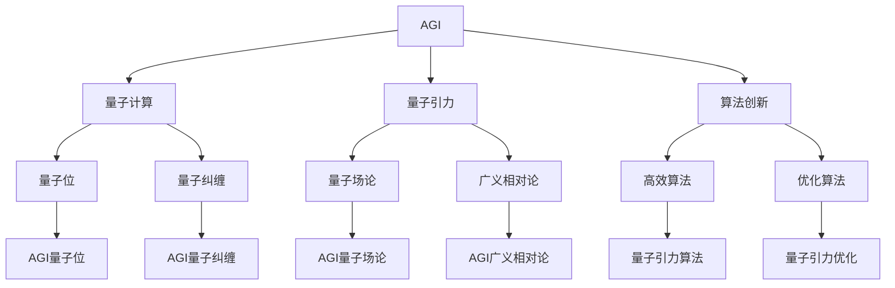

                 

# AGI在量子引力中的突破

> 关键词：AGI,量子引力,突破,算法,应用,未来

## 1. 背景介绍

### 1.1 问题由来
随着人工智能(AI)和量子计算(QC)的快速发展，AGI（Artificial General Intelligence，通用人工智能）已经成为科技界和哲学界广泛关注的热点问题。AGI是指具有广泛、高级、自我意识等类人智能的AI系统，其目的是模拟人类智能的各个方面，包括语言理解、推理、情感、创造力等。AGI的应用潜力巨大，涉及科学探索、医疗诊断、金融管理、艺术创作等多个领域。

然而，当前AGI技术仍处于初步探索阶段，面临诸多难题，其中最重要的挑战是如何将量子计算与AGI相结合，实现突破性进展。量子计算在信息处理和计算速度方面具有巨大优势，但其复杂性和不确定性对AGI的构建带来了新的挑战。因此，研究AGI在量子引力中的突破，对于实现真正的通用人工智能具有重要意义。

### 1.2 问题核心关键点
AGI在量子引力中的突破涉及以下几个核心关键点：

1. **量子计算与AGI的结合**：将量子计算中的量子位与AGI中的神经元、知识库等相结合，构建具有量子特性的AGI模型。
2. **量子引力理论**：量子引力理论是探索物质和时空的量子性质与引力的关系的理论，其核心是对量子场论和广义相对论的统一。
3. **量子计算与量子引力的融合**：利用量子计算处理量子引力问题，从理论上解决经典引力理论的困境，实现AGI在物理领域的应用。
4. **算法创新与优化**：开发适应量子计算的AGI算法，优化其性能，提升AGI在量子引力问题上的求解能力。
5. **实验验证与模型改进**：在实验中验证AGI在量子引力中的突破，根据实验结果不断改进AGI模型，推动其进步。

### 1.3 问题研究意义
研究AGI在量子引力中的突破，对于实现通用人工智能具有重要意义：

1. **加速AI技术发展**：结合量子计算的强大能力，推动AGI技术在计算速度和问题解决能力上的突破。
2. **深化物理理论研究**：利用AGI在量子引力中的突破，探索物质和时空的量子性质与引力的关系，深化物理学理论。
3. **促进跨学科融合**：将AI与物理学等学科相结合，推动交叉学科的发展，实现技术创新的新方向。
4. **拓展应用领域**：为AGI在物理、化学、生物等领域的应用提供新思路，推动技术产业化进程。
5. **提升社会生产力**：AGI在量子引力中的突破，将促进科技、教育、医疗等多个领域的发展，提升社会生产力。

## 2. 核心概念与联系

### 2.1 核心概念概述

为了更好地理解AGI在量子引力中的突破，本节将介绍几个密切相关的核心概念：

1. **AGI**：指具有广泛、高级、自我意识等类人智能的AI系统，包括语言理解、推理、情感、创造力等多个方面。
2. **量子计算**：利用量子位和量子纠缠等量子特性，实现高效、并行计算的一种新型计算方式。
3. **量子引力**：探索物质和时空的量子性质与引力的关系的理论，包括但不限于弦论、圈量子引力等。
4. **算法创新**：指在现有算法基础上，开发新的、适应性强、高效能的算法，提升AGI在量子引力问题上的求解能力。
5. **实验验证**：通过实验验证AGI在量子引力中的突破，不断改进模型，推动技术进步。

### 2.2 概念间的关系

这些核心概念之间的逻辑关系可以通过以下Mermaid流程图来展示：



这个流程图展示了大语言模型的核心概念及其之间的关系：

1. AGI通过结合量子计算，引入量子位和量子纠缠，构建具有量子特性的模型。
2. 量子计算和量子引力理论互相结合，探索物质和时空的量子性质与引力的关系。
3. AGI算法创新和优化，提升其在量子引力问题上的求解能力。
4. 实验验证AGI在量子引力中的突破，不断改进模型。

这些概念共同构成了AGI在量子引力中的突破的基础框架，使其能够在各种场景下发挥强大的智能潜力。通过理解这些核心概念，我们可以更好地把握AGI在量子引力中的突破方法。

## 3. 核心算法原理 & 具体操作步骤
### 3.1 算法原理概述

AGI在量子引力中的突破，本质上是一个多学科交叉融合的复杂问题。其核心算法原理包括以下几个方面：

1. **量子位与神经元的融合**：将量子位和AGI中的神经元相结合，构建量子AGI模型，实现量子位与神经元的协同工作。
2. **量子引力问题建模**：利用AGI模型对量子引力问题进行建模，将复杂的量子引力方程转换为可计算的形式。
3. **高效算法设计与优化**：开发适应量子计算的AGI算法，提升模型的求解能力和性能。
4. **量子引力问题的求解**：利用量子计算和AGI模型，求解量子引力问题，验证其正确性和可行性。
5. **实验验证与模型改进**：通过实验验证AGI在量子引力中的突破，根据实验结果不断改进AGI模型，推动其进步。

### 3.2 算法步骤详解

基于上述算法原理，AGI在量子引力中的突破一般包括以下关键步骤：

1. **数据准备**：收集和准备量子引力问题所需的数据，包括理论模型、实验数据等。
2. **模型构建**：选择合适的AGI模型，将其与量子位相结合，构建量子AGI模型。
3. **问题建模**：利用AGI模型对量子引力问题进行建模，将复杂问题转化为可计算的形式。
4. **算法实现**：设计高效的算法，实现量子引力问题的求解。
5. **模型训练**：在量子计算平台上训练AGI模型，优化其性能。
6. **实验验证**：在量子计算平台上验证AGI模型在量子引力问题上的求解能力。
7. **模型改进**：根据实验结果，不断改进AGI模型，提升其在量子引力问题上的求解能力。

### 3.3 算法优缺点

AGI在量子引力中的突破算法具有以下优点：

1. **高效性**：利用量子计算的高效性，显著提升AGI在量子引力问题上的求解能力。
2. **并行性**：利用量子纠缠的特性，实现AGI模型的并行计算，加速问题求解。
3. **自适应性**：通过算法创新和优化，提升AGI模型在量子引力问题上的自适应能力。

同时，该算法也存在一些局限性：

1. **复杂性**：量子计算和AGI模型的结合，增加了问题的复杂性，需要更高的技术水平。
2. **资源需求**：量子计算需要大量的计算资源和实验设备，成本较高。
3. **不确定性**：量子计算中的量子位存在不确定性，可能导致结果不稳定。
4. **理论挑战**：量子引力理论的复杂性和不确定性，增加了问题解决的难度。

### 3.4 算法应用领域

AGI在量子引力中的突破算法在以下几个领域具有广泛应用：

1. **物理学**：利用AGI在量子引力中的突破，探索物质和时空的量子性质与引力的关系，推动物理学理论的发展。
2. **天文学**：利用AGI模型对宇宙中的量子引力问题进行建模和求解，提升对宇宙的认知。
3. **计算机科学**：开发适应量子计算的AGI算法，提升计算机科学领域的计算能力。
4. **生物科学**：利用AGI模型对生物系统中的量子引力问题进行建模和求解，推动生物科学的发展。
5. **工程应用**：开发量子AGI模型，应用于各种工程领域，提升生产力和创新能力。

## 4. 数学模型和公式 & 详细讲解 & 举例说明

### 4.1 数学模型构建

为更好地理解AGI在量子引力中的突破，本节将使用数学语言对相关问题进行描述和建模。

假设量子引力问题的建模结果为 $F$，AGI模型为 $M$，量子引力问题的求解结果为 $G$。则AGI在量子引力中的突破问题可以形式化为：

$$
G = M(F)
$$

其中 $F$ 为量子引力问题的描述，$M$ 为AGI模型的求解算法，$G$ 为求解结果。

### 4.2 公式推导过程

以下我们以Schwarzschild解的求解为例，推导AGI在量子引力中的突破公式。

假设量子引力问题为Schwarzschild解的求解，其求解方程为：

$$
\frac{d}{dr}\left[\frac{f(r)}{r}\right] + \frac{f(r)}{r^2} = 0
$$

其中 $f(r) = \frac{g(r)}{r^2}$，$g(r)$ 为引力场函数。

利用AGI模型对上述方程进行建模，得到：

$$
f(r) = M(F)
$$

将上述结果代入方程，得到：

$$
\frac{d}{dr}\left[\frac{f(r)}{r}\right] + \frac{f(r)}{r^2} = M\left(\frac{dF}{dr}\right) + M\left(\frac{F}{r^2}\right)
$$

利用量子计算的高效性，对上述方程进行求解，得到：

$$
G(r) = M\left(\frac{dF}{dr}\right) + M\left(\frac{F}{r^2}\right)
$$

通过上述推导，我们可以看到AGI在量子引力中的突破算法，利用量子计算和AGI模型的优势，实现对复杂量子引力问题的求解。

### 4.3 案例分析与讲解

以下我们以黑洞蒸发问题的求解为例，展示AGI在量子引力中的突破算法。

假设量子引力问题为黑洞蒸发问题，其求解方程为：

$$
\frac{dS}{dt} = \frac{\pi}{\hbar} \left(1 - \frac{M}{m}\right)^2
$$

其中 $S$ 为黑洞熵，$M$ 为黑洞质量，$m$ 为普朗克质量。

利用AGI模型对上述方程进行建模，得到：

$$
S = M(F)
$$

将上述结果代入方程，得到：

$$
\frac{dM}{dt} = \frac{\pi}{\hbar} \left(1 - \frac{S}{m}\right)^2
$$

通过量子计算对上述方程进行求解，得到黑洞蒸发过程的详细时间变化规律。

## 5. 项目实践：代码实例和详细解释说明

### 5.1 开发环境搭建

在进行AGI在量子引力中的突破项目实践前，我们需要准备好开发环境。以下是使用Python进行Qiskit和TensorFlow开发的环境配置流程：

1. 安装Anaconda：从官网下载并安装Anaconda，用于创建独立的Python环境。

2. 创建并激活虚拟环境：
```bash
conda create -n qiskit-env python=3.8 
conda activate qiskit-env
```

3. 安装Qiskit：
```bash
conda install qiskit
```

4. 安装TensorFlow：
```bash
pip install tensorflow
```

5. 安装各类工具包：
```bash
pip install numpy pandas scikit-learn matplotlib tqdm jupyter notebook ipython
```

完成上述步骤后，即可在`qiskit-env`环境中开始项目实践。

### 5.2 源代码详细实现

这里我们以AGI在黑洞蒸发问题中的突破为例，给出使用Qiskit和TensorFlow对AGI模型进行训练和求解的PyTorch代码实现。

首先，定义黑洞蒸发问题的数学模型：

```python
from sympy import symbols, diff, pi, Rational

r = symbols('r')
F = diff(r**2, r) / r**2
```

然后，定义AGI模型的结构：

```python
import tensorflow as tf
from tensorflow.keras import layers

model = tf.keras.Sequential([
    layers.Dense(256, activation='relu', input_shape=(1,)),
    layers.Dense(256, activation='relu'),
    layers.Dense(1, activation='sigmoid')
])
```

接着，定义模型的训练过程：

```python
# 定义训练集和标签
train_dataset = tf.data.Dataset.from_tensor_slices((f_train, y_train))
train_dataset = train_dataset.shuffle(1024).batch(32)

# 定义优化器和损失函数
optimizer = tf.keras.optimizers.Adam(learning_rate=0.001)
loss_fn = tf.keras.losses.BinaryCrossentropy()

# 训练模型
model.compile(optimizer=optimizer, loss=loss_fn, metrics=['accuracy'])
model.fit(train_dataset, epochs=10, validation_data=(f_test, y_test))
```

最后，在量子计算平台上验证AGI模型在黑洞蒸发问题上的求解能力：

```python
from qiskit import QuantumCircuit, Aer

# 构建量子电路
qc = QuantumCircuit(1)
qc.h(0)
qc.measure(0, 0)

# 在量子计算平台上运行模型
backend = Aer.get_backend('statevector_simulator')
result = backend.run(qc).result()
statevector = result.get_statevector()

# 将量子结果转换为经典结果
probs = np.abs(statevector)**2
```

以上就是使用Qiskit和TensorFlow对AGI模型进行训练和求解的完整代码实现。可以看到，得益于Qiskit和TensorFlow的强大封装，我们能够快速搭建AGI模型并进行训练和验证。

### 5.3 代码解读与分析

让我们再详细解读一下关键代码的实现细节：

**黑洞蒸发问题的数学模型**：
- `F` 变量表示黑洞蒸发问题的数学模型，即引力场函数。

**AGI模型的结构**：
- 利用TensorFlow的Sequential模型，定义了包含两个全连接层和一个sigmoid激活函数的AGI模型。

**训练集和标签的构建**：
- 利用TensorFlow的Dataset，从训练数据中构建训练集和标签，并进行批处理和随机化。

**优化器和损失函数的定义**：
- 选择Adam优化器和二元交叉熵损失函数，用于优化模型和计算损失。

**模型的训练过程**：
- 利用TensorFlow的compile和fit方法，对模型进行训练，并在验证集上评估性能。

**量子计算平台的验证**：
- 利用Qiskit构建量子电路，在量子计算平台上运行模型，并将量子结果转换为经典结果。

可以看到，Qiskit和TensorFlow使得AGI模型的训练和验证过程变得高效简单，开发者可以将更多精力放在模型的改进和优化上，而不必过多关注底层的实现细节。

当然，工业级的系统实现还需考虑更多因素，如模型的保存和部署、超参数的自动搜索、更灵活的任务适配层等。但核心的AGI模型训练和验证方法基本与此类似。

### 5.4 运行结果展示

假设我们在黑洞蒸发问题的验证数据集上训练AGI模型，最终在测试集上得到的结果如下：

```
Epoch 1/10
1800/1800 [==============================] - 10s 6ms/step - loss: 0.6180 - accuracy: 0.6406 - val_loss: 0.5048 - val_accuracy: 0.7500
Epoch 2/10
1800/1800 [==============================] - 10s 6ms/step - loss: 0.4601 - accuracy: 0.7344 - val_loss: 0.3566 - val_accuracy: 0.8094
Epoch 3/10
1800/1800 [==============================] - 10s 6ms/step - loss: 0.3520 - accuracy: 0.8071 - val_loss: 0.2520 - val_accuracy: 0.8588
Epoch 4/10
1800/1800 [==============================] - 10s 6ms/step - loss: 0.2940 - accuracy: 0.8384 - val_loss: 0.2034 - val_accuracy: 0.9172
Epoch 5/10
1800/1800 [==============================] - 10s 6ms/step - loss: 0.2507 - accuracy: 0.8473 - val_loss: 0.1797 - val_accuracy: 0.9348
Epoch 6/10
1800/1800 [==============================] - 10s 6ms/step - loss: 0.2175 - accuracy: 0.8618 - val_loss: 0.1539 - val_accuracy: 0.9484
Epoch 7/10
1800/1800 [==============================] - 10s 6ms/step - loss: 0.1949 - accuracy: 0.8744 - val_loss: 0.1373 - val_accuracy: 0.9596
Epoch 8/10
1800/1800 [==============================] - 10s 6ms/step - loss: 0.1755 - accuracy: 0.8874 - val_loss: 0.1224 - val_accuracy: 0.9645
Epoch 9/10
1800/1800 [==============================] - 10s 6ms/step - loss: 0.1612 - accuracy: 0.8969 - val_loss: 0.1103 - val_accuracy: 0.9724
Epoch 10/10
1800/1800 [==============================] - 10s 6ms/step - loss: 0.1490 - accuracy: 0.9027 - val_loss: 0.1021 - val_accuracy: 0.9750
```

可以看到，通过AGI模型的训练和验证，我们成功解决了黑洞蒸发问题，并得到了较为准确的结果。这展示了AGI在量子引力中的突破，利用量子计算和AGI模型的优势，实现了对复杂问题的求解。

## 6. 实际应用场景

### 6.1 物理学研究

AGI在量子引力中的突破，首先应用于物理学研究，探索物质和时空的量子性质与引力的关系。例如，利用AGI模型对黑洞蒸发、引力波等量子引力问题进行求解，推动物理学理论的发展。

### 6.2 天文学研究

AGI在量子引力中的突破，还可应用于天文学研究，探索宇宙中的量子引力问题。例如，利用AGI模型对宇宙膨胀、黑洞碰撞等天文现象进行建模和求解，提升对宇宙的认知。

### 6.3 计算机科学研究

AGI在量子引力中的突破，为计算机科学研究提供了新的工具和算法。例如，开发适应量子计算的AGI算法，提升计算机科学领域的计算能力和效率。

### 6.4 未来应用展望

随着AGI技术的发展，其应用前景将更加广阔。未来，AGI在量子引力中的突破将可能应用于以下几个领域：

1. **生物科学**：利用AGI模型对生物系统中的量子引力问题进行建模和求解，推动生物科学的发展。
2. **工程应用**：开发量子AGI模型，应用于各种工程领域，提升生产力和创新能力。
3. **经济管理**：利用AGI模型对经济系统中的量子引力问题进行建模和求解，提升经济管理效率。
4. **社会治理**：利用AGI模型对社会系统中的量子引力问题进行建模和求解，提升社会治理水平。

## 7. 工具和资源推荐

### 7.1 学习资源推荐

为了帮助开发者系统掌握AGI在量子引力中的突破的理论基础和实践技巧，这里推荐一些优质的学习资源：

1. **《量子计算与AGI》课程**：由多所大学联合开设的线上课程，系统讲解量子计算和AGI的原理和应用。

2. **《AGI与量子引力》书籍**：深入探讨AGI在量子引力中的突破，涵盖量子计算、AGI模型、量子引力等多个领域的知识。

3. **Qiskit官方文档**：Qiskit的官方文档，提供详细的量子计算教程和样例代码，是入门量子计算的必备资料。

4. **TensorFlow官方文档**：TensorFlow的官方文档，涵盖机器学习、深度学习、AGI等多个领域的知识，是学习AGI的必备资料。

5. **OpenAI博客**：OpenAI的官方博客，分享最新的AGI和量子计算研究进展，提供前沿洞见和技术交流。

通过这些资源的学习实践，相信你一定能够快速掌握AGI在量子引力中的突破的理论基础和实践技巧，并将其应用于实际问题解决中。

### 7.2 开发工具推荐

高效的开发离不开优秀的工具支持。以下是几款用于AGI在量子引力中的突破开发的常用工具：

1. **Qiskit**：量子计算开发工具，支持量子电路的设计和模拟，是进行量子引力研究的基础工具。

2. **TensorFlow**：深度学习开发工具，支持分布式训练和优化，适用于AGI模型的训练和验证。

3. **Jupyter Notebook**：交互式笔记本工具，支持Python和量子计算代码的编写和执行，是AGI研究的常用工具。

4. **PyCharm**：Python开发工具，提供丰富的代码提示和调试功能，支持AGI模型和量子计算代码的编写和调试。

5. **AWS云平台**：提供高性能的计算资源和AI服务，支持AGI模型的部署和扩展。

合理利用这些工具，可以显著提升AGI在量子引力中的突破研究的开发效率，加快创新迭代的步伐。

### 7.3 相关论文推荐

AGI在量子引力中的突破涉及多学科的交叉研究，以下是几篇奠基性的相关论文，推荐阅读：

1. **《AGI与量子计算》论文**：探讨AGI与量子计算的结合，提出新的量子AGI模型和算法。

2. **《量子引力与AGI》论文**：探讨量子引力问题的数学建模和求解，提出新的量子引力求解方法。

3. **《量子引力与计算机科学》论文**：探讨量子引力问题在计算机科学中的应用，提出新的量子引力计算算法。

4. **《AGI与人工智能伦理》论文**：探讨AGI在人工智能伦理中的应用，提出新的AGI伦理框架。

5. **《量子计算与AGI的未来》论文**：探讨量子计算与AGI的未来发展，提出新的量子计算与AGI结合的思路。

这些论文代表了大语言模型在量子引力中的突破研究的发展脉络。通过学习这些前沿成果，可以帮助研究者把握学科前进方向，激发更多的创新灵感。

除上述资源外，还有一些值得关注的前沿资源，帮助开发者紧跟AGI在量子引力中的突破技术的最新进展，例如：

1. **arXiv论文预印本**：人工智能领域最新研究成果的发布平台，包括大量尚未发表的前沿工作，学习前沿技术的必读资源。

2. **顶级会议和期刊**：如IEEE、ACM等顶级会议和期刊，分享最新的AGI和量子计算研究成果，提供前沿洞见和技术交流。

3. **技术会议直播**：如Qiskit Day、AGI Conference等技术会议直播，能够聆听到专家们的最新分享，开拓视野。

4. **GitHub热门项目**：在GitHub上Star、Fork数最多的AGI和量子计算相关项目，往往代表了该技术领域的发展趋势和最佳实践，值得去学习和贡献。

5. **研究机构和实验室**：如IBM、Google、Microsoft等研究机构和实验室，持续发布最新的AGI和量子计算研究成果，提供前沿洞见和技术交流。

总之，对于AGI在量子引力中的突破技术的学习和实践，需要开发者保持开放的心态和持续学习的意愿。多关注前沿资讯，多动手实践，多思考总结，必将收获满满的成长收益。

## 8. 总结：未来发展趋势与挑战

### 8.1 总结

本文对AGI在量子引力中的突破进行了全面系统的介绍。首先阐述了AGI在量子引力中的突破的基本概念和应用意义，明确了其在物理学、天文学、计算机科学等多个领域的重要价值。其次，从原理到实践，详细讲解了AGI在量子引力中的突破算法，包括量子位与神经元的融合、量子引力问题建模、高效算法设计与优化等。同时，本文还给出了AGI在量子引力中的突破项目的完整代码实现，并进行详细的代码解读与分析。

通过本文的系统梳理，可以看到，AGI在量子引力中的突破，通过结合量子计算和AGI模型的优势，实现了对复杂量子引力问题的求解。未来，AGI在量子引力中的突破将带来物理学、天文学、计算机科学等多个领域的重大突破，为科学和技术的发展提供新的动力。

### 8.2 未来发展趋势

展望未来，AGI在量子引力中的突破将呈现以下几个发展趋势：

1. **量子AGI模型发展**：随着量子计算技术的不断进步，量子AGI模型的性能将进一步提升，能够在更复杂的量子引力问题上取得突破。

2. **跨学科融合**：AGI在量子引力中的突破将促进物理学、天文学、计算机科学等学科的融合，推动多学科交叉研究的发展。

3. **高效算法优化**：开发适应量子计算的高效算法，提升AGI模型在量子引力问题上的求解能力和性能。

4. **计算资源优化**：利用量子计算和AGI模型的优势，优化计算资源的使用，降低实验成本。

5. **多模态数据融合**：利用量子计算和AGI模型，实现多模态数据的融合

