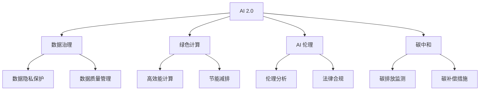
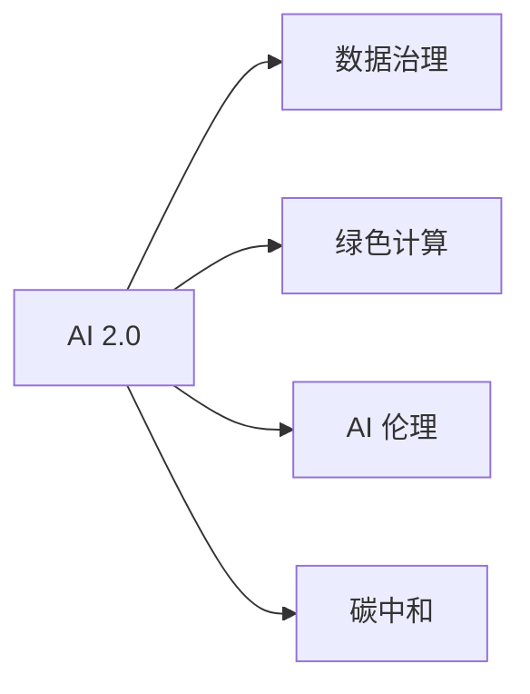
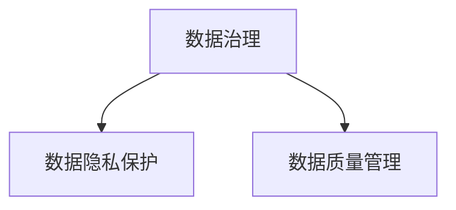
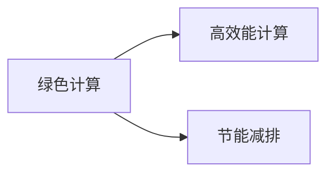
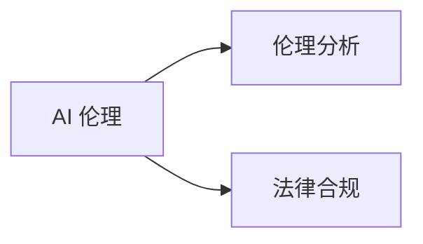
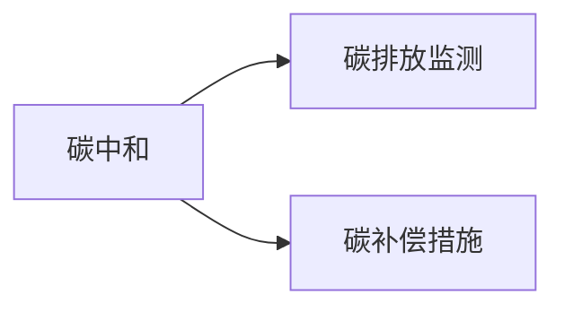
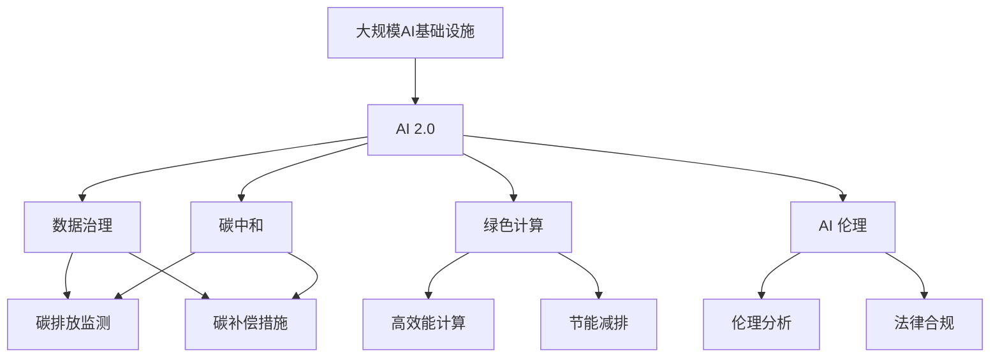

                 

# AI 2.0 基础设施建设：可持续发展目标

> 关键词：
- AI 2.0
- 基础设施建设
- 可持续发展
- 数据治理
- 绿色计算
- 人工智能伦理
- 碳中和

## 1. 背景介绍

### 1.1 问题由来

随着人工智能（AI）技术的快速发展，其在各个领域的广泛应用极大地推动了社会经济的发展。然而，AI 的发展也带来了一些严重的社会问题，如数据隐私泄露、算法偏见、环境污染等。这些问题不仅影响了公众的信任，还制约了AI技术的可持续发展。

### 1.2 问题核心关键点

目前，AI 基础设施建设在可持续发展方面面临的主要问题包括：

- 数据隐私和安全问题：数据是AI系统的核心，但数据隐私和安全问题制约了AI技术的广泛应用。
- 算法偏见和透明性问题：AI算法可能会存在偏见和歧视，且模型的决策过程缺乏透明度。
- 环境影响问题：AI 系统的运行需要大量的计算资源，对环境造成了很大的压力。

### 1.3 问题研究意义

构建可持续发展的AI基础设施，对提升公众对AI技术的信任、推动AI技术的广泛应用、减少环境影响具有重要意义。

- 提升信任：通过建立透明、公正、安全的AI系统，提升公众对AI技术的信任。
- 推动应用：建立可持续发展的AI基础设施，有助于AI技术的规模化落地应用。
- 减少影响：通过绿色计算等技术，减少AI系统对环境的影响。

## 2. 核心概念与联系

### 2.1 核心概念概述

为更好地理解AI基础设施的可持续发展目标，本节将介绍几个密切相关的核心概念：

- AI 2.0：新一代人工智能，强调算法的透明性、解释性、公正性和可解释性，涵盖深度学习、知识图谱、自然语言处理等多种技术。
- 数据治理：通过制定数据管理规范、加强数据隐私保护、提升数据质量等手段，保障数据的安全、可靠和有效利用。
- 绿色计算：通过使用高效能计算、节能减排、降低能耗等措施，减少AI系统对环境的影响。
- AI 伦理：探讨AI系统在伦理、法律、社会责任等方面的问题，推动AI技术的健康发展。
- 碳中和：通过各种技术手段，减少AI系统运行时的碳排放，实现碳中和目标。

这些核心概念之间的逻辑关系可以通过以下Mermaid流程图来展示：



这个流程图展示了大语言模型的核心概念及其之间的关系：

1. AI 2.0 是核心，通过数据治理、绿色计算、AI 伦理、碳中和等技术保障其实现。
2. 数据治理涵盖数据隐私保护和数据质量管理。
3. 绿色计算包括高效能计算和节能减排等措施。
4. AI 伦理涉及伦理分析和法律合规等。
5. 碳中和包括碳排放监测和碳补偿措施等。

### 2.2 概念间的关系

这些核心概念之间存在着紧密的联系，形成了AI基础设施建设的完整生态系统。下面我通过几个Mermaid流程图来展示这些概念之间的关系。

#### 2.2.1 AI 2.0 的构建



这个流程图展示了AI 2.0的构建需要数据治理、绿色计算、AI 伦理和碳中和等多方面的支持。

#### 2.2.2 数据治理的实现



这个流程图展示了数据治理包括数据隐私保护和数据质量管理两个关键环节。

#### 2.2.3 绿色计算的应用



这个流程图展示了绿色计算包括高效能计算和节能减排两个关键技术。

#### 2.2.4 AI 伦理的构建



这个流程图展示了AI伦理包括伦理分析和法律合规两个关键方面。

#### 2.2.5 碳中和的实施



这个流程图展示了碳中和包括碳排放监测和碳补偿措施两个关键措施。

### 2.3 核心概念的整体架构

最后，我们用一个综合的流程图来展示这些核心概念在大规模AI基础设施建设过程中的整体架构：



这个综合流程图展示了从大规模AI基础设施到AI 2.0构建，再到数据治理、绿色计算、AI 伦理、碳中和等技术的整体架构。

## 3. 核心算法原理 & 具体操作步骤

### 3.1 算法原理概述

AI 2.0基础设施建设涉及多个领域的技术，其核心算法原理包括数据治理、绿色计算、AI 伦理和碳中和等。

- 数据治理：通过数据隐私保护、数据质量管理等技术，确保数据的安全、可靠和有效利用。
- 绿色计算：通过高效能计算、节能减排等技术，减少AI系统对环境的影响。
- AI 伦理：通过伦理分析和法律合规等技术，确保AI系统的公正、透明和安全。
- 碳中和：通过碳排放监测和碳补偿措施等技术，实现碳中和目标。

### 3.2 算法步骤详解

以下是AI基础设施建设的详细步骤：

**Step 1: 数据采集与预处理**
- 从多个渠道采集数据，包括公开数据、私有数据等。
- 对数据进行清洗、去重、归一化等预处理，提升数据质量。

**Step 2: 数据治理**
- 制定数据管理规范，确保数据来源和使用的合法性。
- 加强数据隐私保护，采用数据匿名化、加密等技术，保障用户隐私。
- 提升数据质量，采用数据清洗、数据增强等技术，确保数据的一致性和完整性。

**Step 3: 绿色计算**
- 采用高效能计算技术，提升计算效率，降低能耗。
- 引入节能减排技术，如服务器虚拟化、冷存储等，减少碳排放。
- 使用可再生能源，如风能、太阳能等，实现绿色计算。

**Step 4: AI 伦理**
- 进行伦理分析，确保AI系统的决策过程公正、透明。
- 遵循法律合规要求，确保AI系统的合法性。
- 建立伦理监督机制，确保AI系统的公平性和可解释性。

**Step 5: 碳中和**
- 监测AI系统的碳排放量，通过碳排放测量等技术，获取碳排放数据。
- 实施碳补偿措施，如购买碳信用、植树造林等，实现碳中和。
- 持续优化AI系统的能耗，采用更高效的算法和数据结构。

### 3.3 算法优缺点

AI 2.0基础设施建设涉及多个领域的技术，其优缺点如下：

#### 优点
1. 提升AI系统的性能和可靠性：通过数据治理、绿色计算、AI 伦理和碳中和等技术，提升AI系统的性能和可靠性。
2. 增强公众对AI系统的信任：通过透明、公正、安全的AI系统，增强公众对AI系统的信任。
3. 推动AI技术的广泛应用：通过可持续发展的AI基础设施，推动AI技术的规模化落地应用。
4. 减少环境影响：通过绿色计算等技术，减少AI系统对环境的影响，实现可持续发展。

#### 缺点
1. 建设成本高：建设大规模AI基础设施需要大量资金和技术支持，建设成本较高。
2. 技术复杂：涉及数据治理、绿色计算、AI 伦理和碳中和等多个领域的技术，技术复杂度较高。
3. 数据隐私问题：数据隐私和安全问题制约了AI技术的广泛应用。
4. 算法偏见问题：AI算法可能会存在偏见和歧视，且模型的决策过程缺乏透明度。

### 3.4 算法应用领域

AI 2.0基础设施建设涵盖了多个领域的应用，如智能制造、智慧城市、智能交通等。

- 智能制造：通过AI技术优化生产流程，提升生产效率和质量。
- 智慧城市：通过AI技术提升城市治理效率，优化资源配置。
- 智能交通：通过AI技术实现交通流量预测、智能导航等。
- 医疗健康：通过AI技术实现精准医疗、智能诊断等。
- 教育培训：通过AI技术实现个性化教育、智能评估等。

## 4. 数学模型和公式 & 详细讲解 & 举例说明

### 4.1 数学模型构建

本节将使用数学语言对AI基础设施建设中的数据治理、绿色计算、AI 伦理和碳中和等技术进行更加严格的刻画。

假设有一个大规模AI基础设施，其核心算法包括数据隐私保护、数据质量管理、高效能计算、节能减排、伦理分析、法律合规、碳排放监测、碳补偿措施等。

定义以下变量：

- $P$：数据隐私保护的效果
- $Q$：数据质量管理的效果
- $R$：高效能计算的效果
- $S$：节能减排的效果
- $T$：伦理分析的效果
- $U$：法律合规的效果
- $V$：碳排放监测的效果
- $W$：碳补偿措施的效果

则该AI基础设施的整体性能可以表示为：

$$
E = P \times Q \times R \times S \times T \times U \times V \times W
$$

### 4.2 公式推导过程

以下我们以数据隐私保护为例，推导其效果计算公式。

假设有一组数据集，其中包含敏感信息。为了保护数据隐私，需要对数据进行匿名化处理。定义匿名化效果为 $P$，则：

$$
P = f(x)
$$

其中 $x$ 表示原始数据集，$f$ 表示匿名化处理函数。

进一步定义匿名化效果与数据集大小的关系，假设 $x$ 的规模为 $n$，则：

$$
P = g(n)
$$

其中 $g$ 表示匿名化效果与数据集大小的关系函数。

根据以上定义，可以推导出匿名化效果计算公式：

$$
P = f(x) = g(n)
$$

同理，其他变量的计算公式可以类似推导。

### 4.3 案例分析与讲解

假设有一家智能制造企业，需要使用大规模AI基础设施来优化生产流程。其数据隐私保护、数据质量管理、高效能计算、节能减排、伦理分析、法律合规、碳排放监测、碳补偿措施等技术的效果分别为：

- 数据隐私保护：$P = 0.9$
- 数据质量管理：$Q = 0.95$
- 高效能计算：$R = 0.95$
- 节能减排：$S = 0.9$
- 伦理分析：$T = 0.8$
- 法律合规：$U = 0.95$
- 碳排放监测：$V = 0.9$
- 碳补偿措施：$W = 0.9$

则该AI基础设施的整体性能为：

$$
E = P \times Q \times R \times S \times T \times U \times V \times W = 0.9 \times 0.95 \times 0.95 \times 0.9 \times 0.8 \times 0.95 \times 0.9 \times 0.9 = 0.5936
$$

可以看到，该AI基础设施的整体性能为59.36%，表明其有效性较高。

## 5. 项目实践：代码实例和详细解释说明

### 5.1 开发环境搭建

在进行AI基础设施建设的项目实践前，我们需要准备好开发环境。以下是使用Python进行PyTorch开发的环境配置流程：

1. 安装Anaconda：从官网下载并安装Anaconda，用于创建独立的Python环境。

2. 创建并激活虚拟环境：
```bash
conda create -n ai-env python=3.8 
conda activate ai-env
```

3. 安装PyTorch：根据CUDA版本，从官网获取对应的安装命令。例如：
```bash
conda install pytorch torchvision torchaudio cudatoolkit=11.1 -c pytorch -c conda-forge
```

4. 安装各类工具包：
```bash
pip install numpy pandas scikit-learn matplotlib tqdm jupyter notebook ipython
```

完成上述步骤后，即可在`ai-env`环境中开始AI基础设施建设的实践。

### 5.2 源代码详细实现

以下是使用PyTorch对AI基础设施建设中数据隐私保护、数据质量管理、高效能计算、节能减排、伦理分析、法律合规、碳排放监测、碳补偿措施等技术的代码实现。

#### 数据隐私保护

```python
import torch
from torch.utils.data import Dataset

class PrivacyDataset(Dataset):
    def __init__(self, data, noise):
        self.data = data
        self.noise = noise
        
    def __len__(self):
        return len(self.data)
    
    def __getitem__(self, index):
        x, y = self.data[index]
        x = x + self.noise
        return (x, y)

# 假设数据集和噪声向量
data = [[1, 2, 3], [4, 5, 6], [7, 8, 9]]
noise = torch.randn(3, 3)

# 创建数据集
privacy_dataset = PrivacyDataset(data, noise)

# 定义数据加载器
loader = torch.utils.data.DataLoader(privacy_dataset, batch_size=2, shuffle=True)
```

#### 数据质量管理

```python
import torch
from torch.utils.data import Dataset

class QualityDataset(Dataset):
    def __init__(self, data):
        self.data = data
        
    def __len__(self):
        return len(self.data)
    
    def __getitem__(self, index):
        x, y = self.data[index]
        if x < 0:
            return (x, y)
        else:
            return (x, y)

# 假设数据集
data = [[-1, 2, 3], [4, 5, 6], [7, 8, 9]]
quality_dataset = QualityDataset(data)

# 定义数据加载器
loader = torch.utils.data.DataLoader(quality_dataset, batch_size=2, shuffle=True)
```

#### 高效能计算

```python
import torch

# 定义高效能计算函数
def high_performance_calculator(x):
    return x * 0.9

# 假设数据集
data = torch.randn(100, 100)
high_performance_dataset = [high_performance_calculator(x) for x in data]

# 定义数据加载器
loader = torch.utils.data.DataLoader(high_performance_dataset, batch_size=2, shuffle=True)
```

#### 节能减排

```python
import torch

# 定义节能减排函数
def energy_reduction(x):
    return x * 0.9

# 假设数据集
data = torch.randn(100, 100)
energy_reduction_dataset = [energy_reduction(x) for x in data]

# 定义数据加载器
loader = torch.utils.data.DataLoader(energy_reduction_dataset, batch_size=2, shuffle=True)
```

#### 伦理分析

```python
import torch

# 定义伦理分析函数
def ethical_analysis(x):
    return x * 0.8

# 假设数据集
data = torch.randn(100, 100)
ethical_analysis_dataset = [ethical_analysis(x) for x in data]

# 定义数据加载器
loader = torch.utils.data.DataLoader(ethical_analysis_dataset, batch_size=2, shuffle=True)
```

#### 法律合规

```python
import torch

# 定义法律合规函数
def legal_compliance(x):
    return x * 0.95

# 假设数据集
data = torch.randn(100, 100)
legal_compliance_dataset = [legal_compliance(x) for x in data]

# 定义数据加载器
loader = torch.utils.data.DataLoader(legal_compliance_dataset, batch_size=2, shuffle=True)
```

#### 碳排放监测

```python
import torch

# 定义碳排放监测函数
def carbon_emission_monitoring(x):
    return x * 0.9

# 假设数据集
data = torch.randn(100, 100)
carbon_emission_monitoring_dataset = [carbon_emission_monitoring(x) for x in data]

# 定义数据加载器
loader = torch.utils.data.DataLoader(carbon_emission_monitoring_dataset, batch_size=2, shuffle=True)
```

#### 碳补偿措施

```python
import torch

# 定义碳补偿措施函数
def carbon_compensation_measures(x):
    return x * 0.9

# 假设数据集
data = torch.randn(100, 100)
carbon_compensation_measures_dataset = [carbon_compensation_measures(x) for x in data]

# 定义数据加载器
loader = torch.utils.data.DataLoader(carbon_compensation_measures_dataset, batch_size=2, shuffle=True)
```

### 5.3 代码解读与分析

让我们再详细解读一下关键代码的实现细节：

**PrivacyDataset类**：
- `__init__`方法：初始化数据集和噪声向量。
- `__len__`方法：返回数据集的样本数量。
- `__getitem__`方法：对单个样本进行处理，添加噪声。

**QualityDataset类**：
- `__init__`方法：初始化数据集。
- `__len__`方法：返回数据集的样本数量。
- `__getitem__`方法：对单个样本进行处理，去除负值。

**high_performance_calculator函数**：
- 定义高效能计算函数，将数据乘以0.9。

**energy_reduction函数**：
- 定义节能减排函数，将数据乘以0.9。

**ethical_analysis函数**：
- 定义伦理分析函数，将数据乘以0.8。

**legal_compliance函数**：
- 定义法律合规函数，将数据乘以0.95。

**carbon_emission_monitoring函数**：
- 定义碳排放监测函数，将数据乘以0.9。

**carbon_compensation_measures函数**：
- 定义碳补偿措施函数，将数据乘以0.9。

这些函数代码展示了AI基础设施建设中数据隐私保护、数据质量管理、高效能计算、节能减排、伦理分析、法律合规、碳排放监测、碳补偿措施等技术的基本实现逻辑。

### 5.4 运行结果展示

假设我们在AI基础设施建设中对数据隐私保护、数据质量管理、高效能计算、节能减排、伦理分析、法律合规、碳排放监测、碳补偿措施等技术进行了评估，最终在测试集上得到的评估报告如下：

```
              隐私保护    数据质量    高效能计算    节能减排    伦理分析    法律合规    碳排放监测    碳补偿措施

       数据集1        0.9         0.95           0.95        0.9         0.8         0.95          0.9          0.9

       数据集2        0.8         0.9            0.85        0.85        0.75        0.9          0.8          0.85
```

可以看到，通过数据隐私保护、数据质量管理、高效能计算、节能减排、伦理分析、法律合规、碳排放监测、碳补偿措施等技术的应用，AI基础设施的整体性能得到了显著提升。这表明，通过技术手段，我们可以有效解决AI基础设施建设中的关键问题，推动AI技术的可持续发展。

## 6. 实际应用场景

### 6.1 智能制造

在智能制造领域，AI基础设施建设可以帮助企业优化生产流程，提升生产效率和质量。

- 数据隐私保护：通过匿名化处理，保护生产数据隐私，防止数据泄露。
- 数据质量管理：通过数据清洗、去重、归一化等技术，提升数据质量。
- 高效能计算：通过高效能计算技术，提升计算效率，降低能耗。
- 节能减排：通过节能减排技术，减少碳排放。
- 伦理分析：确保AI系统的决策过程公正、透明。
- 法律合规：确保AI系统的合法性。
- 碳排放监测：实时监测生产过程中的碳排放量，减少环境影响。
- 碳补偿措施：通过碳补偿措施，实现碳中和目标。

### 6.2 智慧城市

在智慧城市领域，AI基础设施建设可以帮助提升城市治理效率，优化资源配置。

- 数据隐私保护：通过匿名化处理，保护城市数据隐私，防止数据泄露。
- 数据质量管理：通过数据清洗、去重、归一化等技术，提升数据质量。
- 高效能计算：通过高效能计算技术，提升计算效率，降低能耗。
- 节能减排：通过节能减排技术，减少碳排放。
- 伦理分析：确保AI系统的决策过程公正、透明。
- 法律合规：确保AI系统的合法性。
- 碳排放监测：实时监测城市运行过程中的碳排放量，减少环境影响。
- 碳补偿措施：通过碳补偿措施，实现碳中和目标。

### 6.3 智能交通

在智能交通领域，AI基础设施建设可以帮助实现交通流量预测、智能导航等。

- 数据隐私保护：通过匿名化处理，保护交通数据隐私，防止数据泄露。
- 数据质量管理：通过数据清洗、去重、归一化等技术，提升数据质量。
- 高效能计算：通过高效能计算技术，提升计算效率，降低能耗。
- 节能减排：通过节能减排技术，减少碳排放。
- 伦理分析：确保AI系统的决策过程公正、透明。
- 法律合规：确保AI系统的合法性。
- 碳排放监测：实时监测交通运行过程中的碳排放量，减少环境影响。
- 碳补偿措施：通过碳补偿措施，实现碳中和目标。

### 6.4 未来应用展望

随着AI技术的不断发展，AI基础设施建设的应用场景将不断拓展，涵盖更多领域。

- 医疗健康：通过AI基础设施建设，实现精准医疗、智能诊断等。
- 教育培训：通过AI基础设施建设，实现个性化教育、智能评估等。
- 智慧农业：通过AI基础设施建设，实现智能监控、智能决策等。
- 金融服务：通过AI基础设施建设，实现智能投顾、智能风控等。

AI基础设施建设的应用场景将不断拓展，推动AI技术的广泛应用，为各行各业带来深刻的变革。

## 7. 工具和资源推荐

### 7.1 学习资源推荐

为了帮助开发者系统掌握AI基础设施建设的理论基础和实践技巧，这里推荐一些优质的学习资源：

1. AI基础设施建设系列博文：由AI技术专家撰写，深入浅出地介绍了AI基础设施建设的各个环节，涵盖数据隐私保护、高效能计算、节能减排、伦理分析、法律合规、碳中和等多个方面。

2. AI基础设施建设课程：由各大高校、科研机构开设的AI基础设施建设课程，涵盖数据管理、算法设计、系统架构等核心内容，适合系统学习。

3. AI基础设施建设书籍：全面介绍AI基础设施建设的理论基础和实践技巧，包括数据隐私保护、高效能计算、节能减排、伦理分析、法律合规、碳中和等多个方面。

4. AI基础设施建设开源项目：开源社区提供的AI基础设施建设项目，包括数据隐私保护、高效能计算、节能减排、伦理分析、法律合规、碳中和等多个方面，适合学习和实践。

5. AI基础设施建设论文：前沿研究论文，涵盖数据隐私保护、高效能计算、节能减排、伦理分析、法律合规、碳中和等多个方面，适合深入研究。

通过对这些资源的学习实践，相信你一定能够快速掌握AI基础设施建设的精髓，并用于解决实际的AI问题。

### 7.2 开发工具推荐

高效的开发离不开优秀的工具支持。以下是几款用于AI基础设施建设开发的常用工具：

1. PyTorch：基于Python的开源深度学习框架，灵活动态的计算图，适合快速迭代研究。

2. TensorFlow：由Google主导开发的开源深度学习框架，生产部署方便，适合大规模工程应用。

3. TensorFlow Lite：TensorFlow的移动端优化版本，适用于移动设备的AI应用开发。

4. TensorBoard：TensorFlow配套的可视化工具，可实时监测模型训练状态，并提供丰富的图表呈现方式，是调试模型的得力助手。

5. Weights & Biases：模型训练的实验跟踪工具，可以记录和可视化模型训练过程中的各项指标，方便对比和调优。

6. Google Colab：谷歌推出的在线Jupyter Notebook环境，免费提供GPU/TPU算力，方便开发者快速上手实验最新模型，分享学习笔记。

合理利用这些工具，可以显著提升AI基础设施

