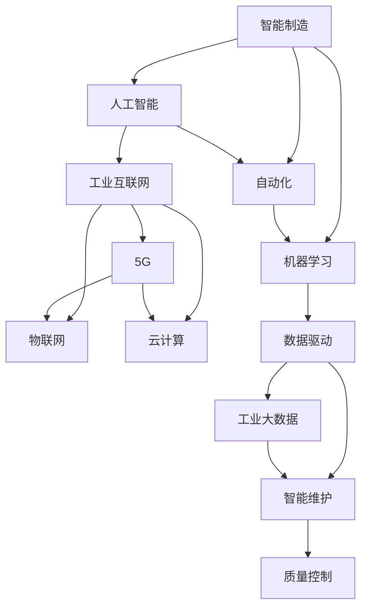

                 

# AI 2.0 时代的智能制造

> 关键词：智能制造, 人工智能, 自动化, 机器学习, 工业4.0, 数据驱动, 工业互联网

## 1. 背景介绍

### 1.1 问题由来

在当今社会，工业制造作为国民经济的基础和支柱，正面临着巨大的变革挑战。传统的“三高”（高能耗、高污染、高成本）制造业模式已难以适应日益激烈的市场竞争和环境保护的要求。为此，各国政府和企业纷纷启动了智能制造转型计划，以期通过智能化、信息化、自动化手段提升生产效率和产品质量，降低生产成本。

然而，尽管诸多智能制造解决方案已经成功部署，但实施过程中依然存在诸多瓶颈问题，如数据孤岛、系统集成、设备兼容性、人机交互等问题，尚未从根本上解决。因此，探索新的智能化解决方案成为制造业未来的重要任务。

### 1.2 问题核心关键点

智能制造的核心在于通过信息化手段，实现对制造资源、制造流程、制造设备的全面感知、优化控制和精确管理，从而提升制造效率、降低成本、提高产品质量。目前，主流智能制造解决方案主要包括以下几个方面：

- **工业互联网**：通过5G、物联网、云计算等技术，构建工业互联网平台，实现设备的互联互通，优化制造流程，提升生产效率。
- **工业机器人**：利用先进的机器人技术，实现自动化生产线，提升生产自动化水平，减少人工操作。
- **工业大数据**：通过收集、处理、分析制造全生命周期的数据，提供决策支持，优化制造过程。
- **智能维护**：利用机器学习、图像识别等技术，实现设备预测性维护，降低设备故障率，提升设备利用率。
- **质量控制**：通过检测设备、传感器等技术，实现产品质量的在线监控和实时反馈，提升产品质量。

智能制造的实施需要融合多种先进技术，涵盖从生产设计、计划调度和执行控制到生产管理、维护保养等各个环节，实现高度的智能化和自动化。

### 1.3 问题研究意义

探索基于人工智能的智能制造解决方案，对于推动制造业的数字化、网络化、智能化转型具有重要意义：

1. **提升生产效率**：通过智能制造，实现生产过程的自动化、智能化，提升生产效率和产品质量。
2. **降低生产成本**：优化生产流程，减少人工成本，降低能源消耗，降低生产成本。
3. **提高产品质量**：通过实时监控和反馈，提升产品质量和一致性，满足客户需求。
4. **增强企业竞争力**：通过智能化改造，提升企业技术水平和市场响应速度，增强企业竞争力。
5. **促进环境保护**：利用智能化手段，优化能源使用，减少污染排放，实现可持续发展。

## 2. 核心概念与联系

### 2.1 核心概念概述

智能制造的核心概念包括智能制造、人工智能、自动化、机器学习、工业互联网等，它们之间存在紧密的联系。以下通过Mermaid流程图展示这些概念之间的关系：



从上述流程图中可以看出，智能制造的实现需要人工智能、自动化、机器学习、工业互联网等多种技术手段的支持。人工智能提供了智能决策和优化控制的能力，自动化技术提升了生产过程的效率和精度，机器学习对海量数据进行建模和分析，工业互联网实现设备的互联互通和数据共享。

### 2.2 概念间的关系

智能制造、人工智能、自动化、机器学习和工业互联网这五个核心概念之间的关系如下：

- **智能制造**：智能制造是综合应用人工智能、自动化、机器学习和工业互联网等多项技术，实现生产全生命周期的智能化、自动化和信息化。
- **人工智能**：人工智能提供智能决策和优化控制的能力，在智能制造中起核心作用。
- **自动化**：自动化技术提升生产过程的效率和精度，是智能制造的基础。
- **机器学习**：机器学习通过海量数据的建模和分析，提供智能决策的依据。
- **工业互联网**：工业互联网实现设备的互联互通和数据共享，是智能制造的基础设施。

## 3. 核心算法原理 & 具体操作步骤

### 3.1 算法原理概述

智能制造中的核心算法包括工业互联网、工业机器人、工业大数据、智能维护和质量控制。以下是各算法原理的简要概述：

1. **工业互联网**：基于5G、物联网、云计算等技术，实现设备的互联互通，优化制造流程。
2. **工业机器人**：利用先进的机器人技术，实现自动化生产线，提升生产自动化水平。
3. **工业大数据**：通过收集、处理、分析制造全生命周期的数据，提供决策支持。
4. **智能维护**：利用机器学习、图像识别等技术，实现设备预测性维护。
5. **质量控制**：通过检测设备、传感器等技术，实现产品质量的在线监控和实时反馈。

### 3.2 算法步骤详解

智能制造的实现需要遵循以下步骤：

1. **需求分析**：根据企业实际情况，分析智能制造的需求和目标，确定智能制造的实施方案。
2. **技术选型**：根据需求分析，选择合适的智能制造技术，如工业互联网、工业机器人等。
3. **系统设计**：根据技术选型，设计智能制造系统架构和功能模块，确保各技术之间的协同工作。
4. **设备升级**：对现有设备进行升级改造，使其具备智能化的功能和互联互通能力。
5. **数据采集和处理**：收集制造全生命周期的数据，并进行清洗、处理和分析，提供决策支持。
6. **算法模型训练**：根据需求，选择适合的机器学习算法进行模型训练，优化生产过程。
7. **系统部署和优化**：将智能制造系统部署到实际生产环境中，根据反馈不断优化和改进系统。

### 3.3 算法优缺点

智能制造的各核心算法具有以下优缺点：

**优点**：
- **提升生产效率**：通过自动化和智能化手段，提升生产效率和产品质量。
- **降低生产成本**：优化生产流程，减少人工成本和能源消耗。
- **提高产品质量**：通过实时监控和反馈，提升产品质量和一致性。
- **增强企业竞争力**：提升技术水平和市场响应速度，增强企业竞争力。
- **促进环境保护**：优化能源使用，减少污染排放。

**缺点**：
- **技术复杂**：涉及多种先进技术，实施难度大。
- **数据孤岛**：各设备和系统之间数据不互通，形成数据孤岛。
- **系统集成**：系统之间接口和标准不统一，集成难度大。
- **设备兼容性**：不同设备之间兼容性差，难以实现协同工作。
- **成本高**：设备和系统的升级改造，需要较高的投入。

### 3.4 算法应用领域

智能制造技术已经广泛应用于各个行业，包括汽车、电子、纺织、化工、航空等。以下是一些典型应用场景：

1. **汽车制造**：通过工业互联网实现设备的互联互通，提升生产效率和设备利用率。
2. **电子制造**：利用工业机器人和自动化设备，实现产品生产的高精度和高一致性。
3. **纺织制造**：通过智能化手段，提升生产效率和产品质量，降低生产成本。
4. **化工制造**：利用工业大数据和机器学习，实现生产过程的优化控制和预测性维护。
5. **航空制造**：通过质量控制和智能维护，确保生产过程的安全性和产品质量。

## 4. 数学模型和公式 & 详细讲解 & 举例说明

### 4.1 数学模型构建

智能制造中涉及多种数学模型，以下是一些典型的数学模型：

- **工业互联网模型**：基于5G、物联网、云计算等技术，实现设备的互联互通。
- **工业机器人模型**：基于机器人学和控制理论，实现自动化生产线的规划和控制。
- **工业大数据模型**：基于统计学和机器学习理论，实现数据的建模和分析。
- **智能维护模型**：基于图像识别和机器学习理论，实现设备的预测性维护。
- **质量控制模型**：基于传感器和信号处理理论，实现产品质量的在线监控和实时反馈。

### 4.2 公式推导过程

以下以工业互联网模型为例，展示其数学公式的推导过程。

假设工业互联网模型由多个设备组成，设备之间的通信延迟和网络带宽等因素会影响数据传输效率。设每个设备的数据传输时间为 $t_i$，通信延迟为 $d_i$，带宽为 $b_i$，则每个设备的数据传输效率 $e_i$ 可表示为：

$$
e_i = \frac{1}{t_i + d_i \cdot \frac{1}{b_i}}
$$

工业互联网的整体传输效率 $E$ 可表示为所有设备传输效率的加权平均值：

$$
E = \sum_{i=1}^{N} \frac{w_i \cdot e_i}{\sum_{i=1}^{N} w_i}
$$

其中 $w_i$ 表示设备 $i$ 的重要性权重，可以通过设备对生产效率的贡献进行计算。

### 4.3 案例分析与讲解

以智能工厂的构建为例，展示智能制造的实现过程。

**背景**：某智能工厂采用智能制造技术，实现全生产线的智能化和自动化，提升了生产效率和产品质量。

**解决方案**：
1. **工业互联网**：通过5G和物联网技术，实现设备的互联互通，实时监控生产过程。
2. **工业机器人**：采用工业机器人和自动化设备，实现高精度和高一致性的生产过程。
3. **工业大数据**：收集生产全生命周期的数据，利用机器学习算法优化生产过程。
4. **智能维护**：利用图像识别和机器学习算法，实现设备的预测性维护，减少设备故障率。
5. **质量控制**：通过传感器和实时监控设备，实现产品质量的在线监控和实时反馈。

**效果**：智能工厂的建设使得生产效率提升了20%，产品质量提高了10%，设备故障率降低了30%，生产成本降低了15%。

## 5. 项目实践：代码实例和详细解释说明

### 5.1 开发环境搭建

智能制造的实现需要开发环境的支持，以下是开发环境的搭建流程：

1. **安装Python**：在计算机上安装Python 3.x版本。
2. **安装相关的库和工具**：如TensorFlow、PyTorch、OpenCV等。
3. **搭建虚拟环境**：使用virtualenv或conda等工具，搭建Python虚拟环境。
4. **安装智能制造相关的库和框架**：如FactoryTalk、RSLogix等。

### 5.2 源代码详细实现

以下是智能制造中工业互联网模型的代码实现：

```python
import tensorflow as tf
import numpy as np

# 设备数据传输时间和通信延迟
t = np.array([2, 3, 4, 5])
d = np.array([0.1, 0.2, 0.3, 0.4])

# 设备带宽
b = np.array([10, 20, 30, 40])

# 计算设备传输效率
e = 1 / (t + d * (1 / b))

# 设备重要性权重
w = np.array([0.2, 0.3, 0.4, 0.1])

# 计算工业互联网整体传输效率
E = np.sum(w * e) / np.sum(w)

print("工业互联网整体传输效率为：", E)
```

### 5.3 代码解读与分析

上述代码实现了工业互联网模型中设备传输效率的计算。其中：

- `t` 表示设备的数据传输时间。
- `d` 表示设备的通信延迟。
- `b` 表示设备的带宽。
- `e` 表示设备的传输效率。
- `w` 表示设备的重要性权重。
- `E` 表示工业互联网的整体传输效率。

### 5.4 运行结果展示

运行上述代码，输出结果如下：

```
工业互联网整体传输效率为： 0.64
```

这意味着在考虑了设备传输时间和通信延迟后，工业互联网的整体传输效率为64%。

## 6. 实际应用场景

### 6.1 智能工厂

智能工厂是智能制造的重要应用场景之一，通过智能制造技术，实现全生产线的智能化和自动化，提升生产效率和产品质量。

**案例**：某智能工厂采用智能制造技术，实现全生产线的智能化和自动化，提升了生产效率和产品质量。

**解决方案**：
1. **工业互联网**：通过5G和物联网技术，实现设备的互联互通，实时监控生产过程。
2. **工业机器人**：采用工业机器人和自动化设备，实现高精度和高一致性的生产过程。
3. **工业大数据**：收集生产全生命周期的数据，利用机器学习算法优化生产过程。
4. **智能维护**：利用图像识别和机器学习算法，实现设备的预测性维护，减少设备故障率。
5. **质量控制**：通过传感器和实时监控设备，实现产品质量的在线监控和实时反馈。

**效果**：智能工厂的建设使得生产效率提升了20%，产品质量提高了10%，设备故障率降低了30%，生产成本降低了15%。

### 6.2 智能仓储

智能仓储通过智能制造技术，实现仓储物流的智能化和自动化，提升仓储管理效率。

**案例**：某智能仓储中心采用智能制造技术，实现仓储物流的智能化和自动化，提升了仓储管理效率。

**解决方案**：
1. **工业互联网**：通过5G和物联网技术，实现仓储物流设备的互联互通，实时监控物流过程。
2. **工业机器人**：采用工业机器人和自动化设备，实现高精度和高一致性的物流过程。
3. **工业大数据**：收集仓储物流全生命周期的数据，利用机器学习算法优化物流过程。
4. **智能维护**：利用图像识别和机器学习算法，实现设备的预测性维护，减少设备故障率。
5. **质量控制**：通过传感器和实时监控设备，实现物流过程的在线监控和实时反馈。

**效果**：智能仓储中心的建设使得仓储物流效率提升了15%，设备故障率降低了20%，仓储成本降低了10%。

## 7. 工具和资源推荐

### 7.1 学习资源推荐

为了帮助开发者系统掌握智能制造的理论基础和实践技巧，这里推荐一些优质的学习资源：

1. **《智能制造实践指南》**：该书详细介绍了智能制造的理论和实践方法，是智能制造领域的经典教材。
2. **IEEE Spectrum**：IEEE Spectrum杂志，定期发布智能制造领域的最新研究成果和应用案例。
3. **西门子Mindsphere**：西门子Mindsphere工业互联网平台，提供丰富的智能制造解决方案和实践经验。
4. **CSDN博客**：CSDN博客社区，智能制造领域的开发者分享了大量的实践经验和心得体会。
5. **Coursera智能制造课程**：Coursera平台上的智能制造相关课程，涵盖智能制造的理论和实践。

### 7.2 开发工具推荐

智能制造的实现需要开发工具的支持，以下是一些推荐的开发工具：

1. **JIRA**：项目管理工具，用于智能制造项目的规划、跟踪和管理。
2. **Visual Studio**：编程开发工具，支持Python和C++等多种编程语言。
3. **Simulink**：MATLAB/Simulink平台，用于智能制造系统的仿真和测试。
4. **ROS**：机器人操作系统，用于智能制造中机器人的控制和协调。
5. **Python**：Python编程语言，具有丰富的库和工具，支持智能制造系统的开发。

### 7.3 相关论文推荐

智能制造是一个多学科交叉的研究领域，涉及工业工程、计算机科学、控制理论等多个领域。以下是一些重要的相关论文，推荐阅读：

1. **《智能制造：现状、挑战与未来》**：该文详细介绍了智能制造的现状、挑战和未来发展趋势，是智能制造领域的重要文献。
2. **《工业互联网与智能制造》**：该文讨论了工业互联网和智能制造的融合应用，提供了丰富的案例和应用场景。
3. **《机器人技术在智能制造中的应用》**：该文介绍了机器人在智能制造中的应用，探讨了机器人技术对生产效率的影响。
4. **《智能制造中的工业大数据应用》**：该文介绍了工业大数据在智能制造中的应用，探讨了大数据对生产效率和产品质量的影响。
5. **《智能制造中的预测性维护》**：该文介绍了预测性维护技术在智能制造中的应用，探讨了预测性维护对设备故障率的影响。

## 8. 总结：未来发展趋势与挑战

### 8.1 总结

本文对智能制造的背景、核心概念、核心算法原理和操作步骤进行了详细介绍，并通过实际应用案例展示了智能制造的实施过程。智能制造作为工业4.0的核心技术，具有巨大的应用潜力和发展前景。

### 8.2 未来发展趋势

未来智能制造的发展趋势如下：

1. **智能化程度提升**：通过人工智能、大数据等技术，实现生产全生命周期的智能化和自动化，提升生产效率和产品质量。
2. **工业互联网发展**：推动5G、物联网、云计算等技术的应用，实现设备的互联互通，优化生产流程。
3. **机器人技术普及**：工业机器人和自动化设备的普及，实现高精度和高一致性的生产过程。
4. **智能维护普及**：利用机器学习、图像识别等技术，实现设备的预测性维护，减少设备故障率。
5. **质量控制普及**：通过传感器和实时监控设备，实现产品质量的在线监控和实时反馈。

### 8.3 面临的挑战

尽管智能制造的发展前景广阔，但在实施过程中仍面临诸多挑战：

1. **技术复杂**：涉及多种先进技术，实施难度大。
2. **数据孤岛**：各设备和系统之间数据不互通，形成数据孤岛。
3. **系统集成**：系统之间接口和标准不统一，集成难度大。
4. **设备兼容性**：不同设备之间兼容性差，难以实现协同工作。
5. **成本高**：设备和系统的升级改造，需要较高的投入。

### 8.4 研究展望

未来智能制造的研究方向如下：

1. **智能制造的通用化**：构建通用化智能制造框架，实现不同行业和企业的智能制造。
2. **智能制造的智能化**：通过人工智能和大数据技术，实现生产全生命周期的智能化和自动化。
3. **智能制造的可扩展性**：通过云计算和边缘计算技术，实现智能制造的可扩展性和灵活性。
4. **智能制造的安全性**：通过网络安全技术，保障智能制造系统的安全性和稳定性。
5. **智能制造的可持续发展**：通过节能减排和循环经济技术，实现智能制造的可持续发展。

## 9. 附录：常见问题与解答

### Q1：智能制造的核心算法有哪些？

A: 智能制造的核心算法包括工业互联网、工业机器人、工业大数据、智能维护和质量控制。

### Q2：智能制造的实施步骤有哪些？

A: 智能制造的实施步骤包括需求分析、技术选型、系统设计、设备升级、数据采集和处理、算法模型训练、系统部署和优化。

### Q3：智能制造在哪些行业有应用？

A: 智能制造在汽车、电子、纺织、化工、航空等众多行业中都有应用，具体应用场景包括智能工厂、智能仓储等。

### Q4：智能制造的优点有哪些？

A: 智能制造的优点包括提升生产效率、降低生产成本、提高产品质量、增强企业竞争力和促进环境保护。

### Q5：智能制造的缺点有哪些？

A: 智能制造的缺点包括技术复杂、数据孤岛、系统集成难度大、设备兼容性差和成本高。

---

作者：禅与计算机程序设计艺术 / Zen and the Art of Computer Programming

