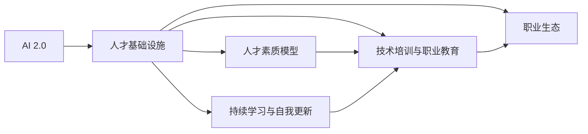
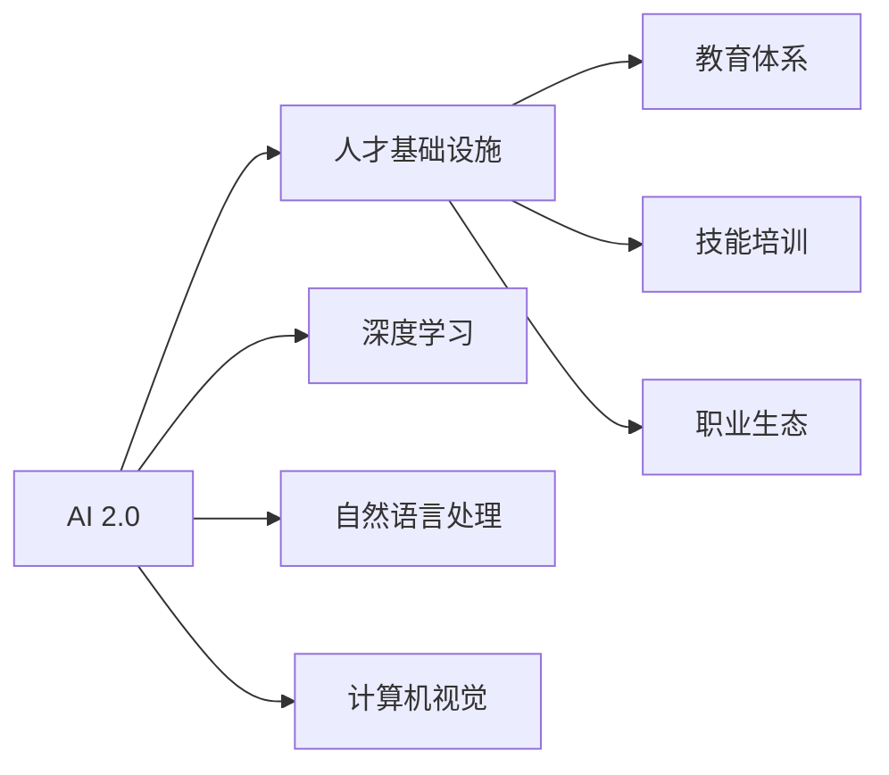
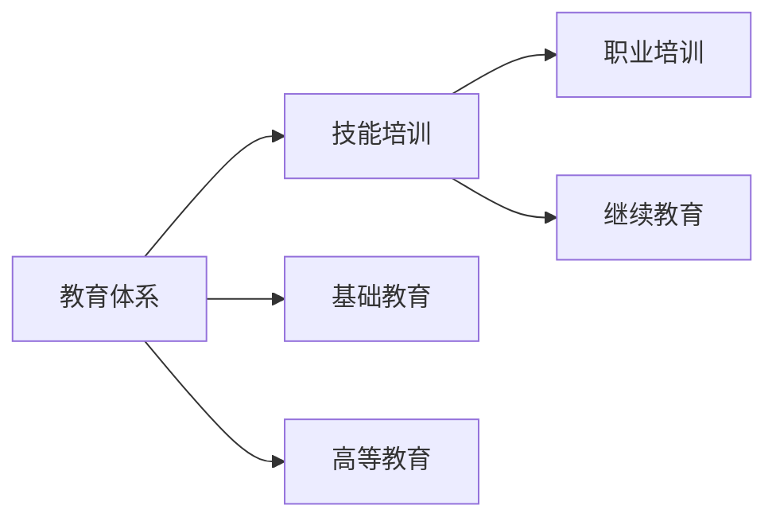
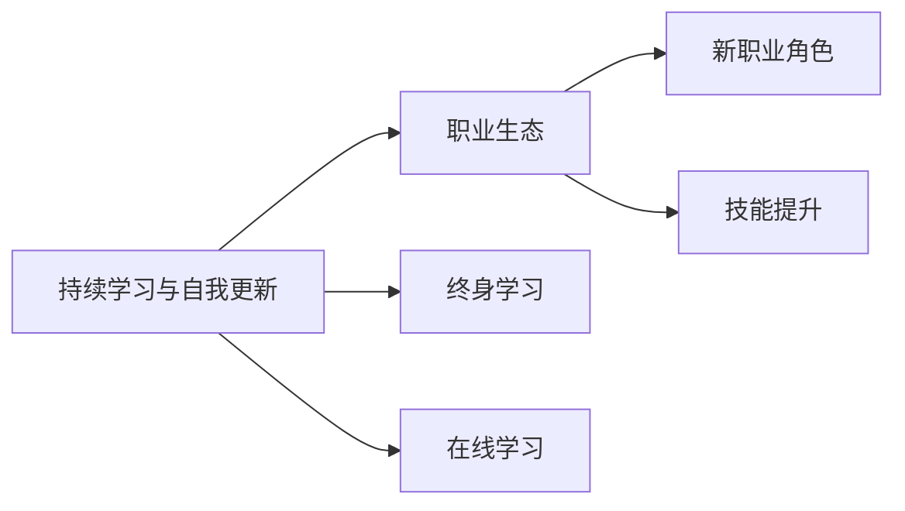
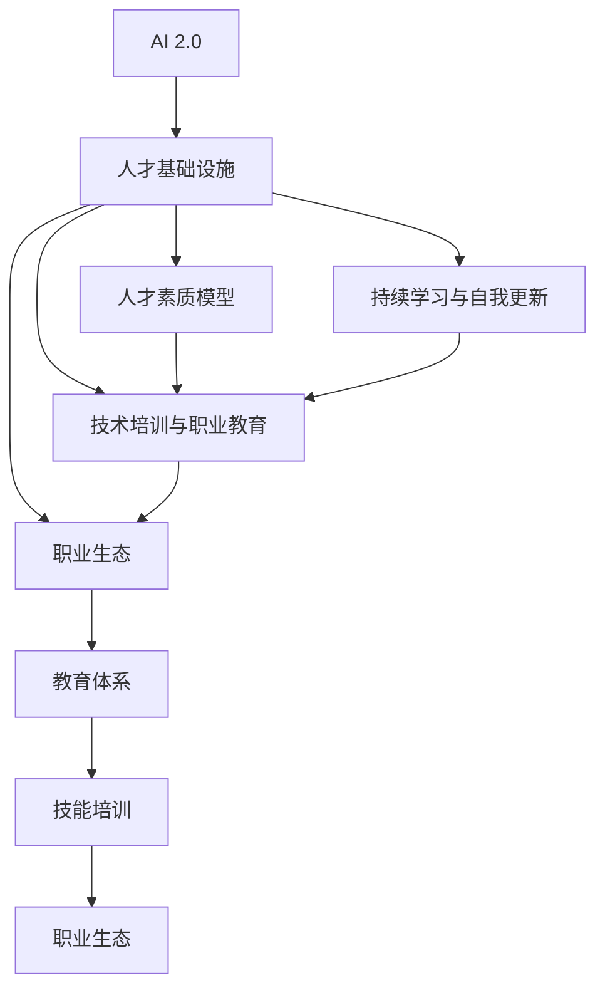

                 

# AI 2.0 时代：人才基础设施的演进

在人工智能(AI)蓬勃发展的今天，AI 2.0时代已悄然来临。它不仅代表着技术的突破和应用的广泛，更是一个引领人类社会进步的里程碑。在这个时代，人才基础设施的演进显得尤为关键。本文将深入探讨AI 2.0时代下人才基础设施的演进，包括其核心概念、算法原理、应用实践等方面，为读者提供全面的理解和洞见。

## 1. 背景介绍

### 1.1 问题的由来
随着AI技术的飞速发展，其在各个行业中的应用越来越广泛，从医疗、金融到教育、娱乐，无所不包。然而，随着AI技术的深入应用，人才基础设施的瓶颈问题也日益凸显。传统的教育体系、人才选拔机制、职业培训等方式，已难以满足AI时代对人才的巨大需求。为了解决这一问题，人们开始探索和构建更高效、更灵活的人才基础设施。

### 1.2 问题核心关键点
在AI 2.0时代，人才基础设施的演进主要集中在以下几个方面：
- **教育体系的变革**：传统教育体系难以跟上AI技术的快速迭代，急需引入新技术和方法，培养能够适应未来社会的人才。
- **技能培训的创新**：AI技术的应用需要大量技能型人才，传统的职业技能培训已无法满足需求。
- **职业生态的调整**：AI技术的应用使得职业结构发生了深刻变化，新的职业角色不断涌现，传统的人才培养方式已无法适应。
- **终身学习与自我更新**：AI技术的快速发展要求人才具备持续学习的能力，以保持其核心竞争力。

### 1.3 问题研究意义
探索AI 2.0时代人才基础设施的演进，对于推动AI技术的普及和应用，提升社会的整体智能化水平，具有重要意义：
- **提高人才竞争力**：通过变革传统教育体系和技能培训方式，提升人才的核心竞争力，满足AI时代对高素质人才的需求。
- **促进AI技术的普及**：创新的人才基础设施可以为AI技术的普及和发展提供有力保障。
- **推动社会进步**：通过AI技术的广泛应用，推动各行业的发展，提升社会整体的智能化水平。
- **应对未来挑战**：应对AI技术带来的职业结构变化和终身学习需求，使人才具备适应未来社会的能力。

## 2. 核心概念与联系

### 2.1 核心概念概述

为更好地理解AI 2.0时代人才基础设施的演进，本节将介绍几个密切相关的核心概念：

- **AI 2.0**：新一代人工智能技术，包括深度学习、强化学习、计算机视觉、自然语言处理等，正在推动AI技术进入更广泛、更深层次的应用领域。
- **人才基础设施**：指支持AI技术发展和应用的人才培养、教育、培训、职业发展等基础设施。
- **人才素质模型**：描述特定职业所需的关键能力和技能，包括技术能力、团队协作能力、创新能力等。
- **持续学习与自我更新**：指在AI技术的推动下，人才需要不断学习和更新知识，以适应技术的发展和职业的变化。
- **技术培训与职业教育**：指通过各种形式的教育和培训，提升人才对AI技术的理解和应用能力。
- **职业生态**：指AI技术的应用带来的职业结构变化和新职业角色的涌现。

这些核心概念之间的逻辑关系可以通过以下Mermaid流程图来展示：



这个流程图展示了几大核心概念之间的联系：

1. AI 2.0技术推动了人才基础设施的演进。
2. 人才素质模型和持续学习与自我更新共同构成人才基础设施的核心要素。
3. 技术培训与职业教育是提升人才素质的重要途径。
4. 职业生态的变化对人才素质模型和技术培训提出了新的需求。

### 2.2 概念间的关系

这些核心概念之间存在着紧密的联系，形成了AI 2.0时代人才基础设施的完整生态系统。下面通过几个Mermaid流程图来展示这些概念之间的关系。

#### 2.2.1 AI 2.0与人才基础设施的关系



这个流程图展示了AI 2.0技术如何推动人才基础设施的演进。AI 2.0技术的各个分支（深度学习、自然语言处理、计算机视觉等）对人才基础设施的构建提出了新的需求，促使教育体系、技能培训和职业生态不断变革。

#### 2.2.2 教育体系与技能培训的联系



这个流程图展示了教育体系与技能培训之间的关系。教育体系包括基础教育和高等教育，为技能培训提供人才基础。技能培训则通过各种形式的职业培训和继续教育，提升人才对AI技术的理解和应用能力。

#### 2.2.3 持续学习与自我更新的重要性



这个流程图展示了持续学习与自我更新对职业生态的重要性。持续学习与自我更新不仅提升了人才的核心竞争力，还推动了新职业角色的涌现和技能提升，满足了AI时代对人才的多样化需求。

### 2.3 核心概念的整体架构

最后，我们用一个综合的流程图来展示这些核心概念在大语言模型微调过程中的整体架构：



这个综合流程图展示了从AI 2.0技术到人才素质模型，再到持续学习与自我更新、技术培训与职业教育，最后到职业生态的完整过程。通过这些核心概念的相互作用，形成了AI 2.0时代人才基础设施的演进路径。

## 3. 核心算法原理 & 具体操作步骤
### 3.1 算法原理概述

AI 2.0时代下的人才基础设施演进，涉及到多方面的技术，其中算法原理是其核心。本文将介绍几种关键算法原理。

- **深度学习**：通过多层神经网络对数据进行抽象和特征提取，实现对复杂问题的建模和预测。深度学习在AI 2.0时代中得到了广泛应用，如计算机视觉、自然语言处理等领域。
- **强化学习**：通过奖励机制，引导AI模型在复杂环境中不断学习和优化，实现自主决策和行为。强化学习在机器人、自动驾驶等领域有着重要应用。
- **迁移学习**：将在一个任务上学习到的知识迁移到另一个任务上，实现知识共享和泛化。迁移学习在医学、金融等领域有着重要应用。
- **联邦学习**：在不共享本地数据的前提下，多个终端设备协同学习，提升整体模型的性能。联邦学习在隐私保护和数据安全方面有着重要应用。

这些算法原理构成了AI 2.0时代人才基础设施演进的技术基础，为实现高效、灵活的人才培养提供了有力支持。

### 3.2 算法步骤详解

AI 2.0时代下的人才基础设施演进，涉及多个步骤，包括教育体系的变革、技能培训的创新、职业生态的调整等。下面是详细的步骤：

**Step 1: 教育体系变革**
- **引入新课程**：在基础教育和高等教育中引入AI相关课程，如深度学习、自然语言处理、计算机视觉等。
- **教学方法创新**：采用项目导向、案例教学、线上线下融合等方式，提升学生的实践能力和创新能力。
- **实验室建设**：建立AI实验室，提供实践平台，支持学生进行项目研究和技术创新。

**Step 2: 技能培训创新**
- **在线培训平台**：建设在线培训平台，提供AI相关的课程和实践项目，方便学生进行自主学习。
- **企业合作**：与企业合作，提供实习机会，让学生在实际工作中应用所学知识。
- **认证体系**：建立AI技能认证体系，提升培训的权威性和吸引力。

**Step 3: 职业生态调整**
- **新职业角色**：推动新职业角色的涌现，如数据科学家、AI工程师、机器人操作员等。
- **职业培训**：提供针对新职业角色的职业培训课程，提升人才的职业技能。
- **职业发展支持**：建立职业发展支持体系，提供职业规划、技能提升、职业转型等服务。

**Step 4: 持续学习与自我更新**
- **终身学习平台**：建设终身学习平台，提供丰富的AI相关课程和资料，支持人才持续学习。
- **学习社区**：建立学习社区，促进人才之间的交流和合作，共同提升学习效果。
- **自我更新机制**：建立自我更新机制，鼓励人才主动学习新知识，适应技术发展。

### 3.3 算法优缺点

AI 2.0时代下的人才基础设施演进，具有以下优点：

- **适应性强**：能够适应AI技术的快速迭代和应用变化，培养出具有灵活适应能力的复合型人才。
- **资源丰富**：借助在线培训平台和终身学习平台，提供丰富的学习资源，满足不同层次人才的需求。
- **协作性强**：通过企业合作和职业培训，促进人才与企业之间的协作，提升人才的实践能力。
- **持续更新**：通过自我更新机制和职业发展支持体系，支持人才持续提升技能，适应技术发展。

然而，这一演进过程也存在以下缺点：

- **成本高**：建设AI实验室、在线培训平台和终身学习平台，需要较高的资金和资源投入。
- **管理复杂**：教育体系、职业培训和职业发展支持体系的建设和管理，涉及多方面的协调和配合，管理难度较大。
- **技术更新快**：AI技术的快速发展要求人才基础设施不断更新，增加了管理难度和技术成本。
- **知识碎片化**：在线培训和终身学习平台提供了丰富的课程和资料，但同时也可能导致知识碎片化，难以形成系统的知识体系。

### 3.4 算法应用领域

AI 2.0时代下的人才基础设施演进，在多个领域得到了广泛应用：

- **医疗领域**：通过引入AI相关课程和技能培训，培养具有AI技术能力的医疗人才，提升医疗服务的智能化水平。
- **金融领域**：通过建立职业发展支持体系和持续学习平台，提升金融从业人员的AI应用能力，推动金融创新和应用。
- **教育领域**：通过改革教育体系和课程设置，培养具有AI技术能力的教育人才，提升教育服务的智能化水平。
- **制造业领域**：通过建立AI实验室和企业合作机制，培养具有AI技术能力的制造业人才，推动智能制造的发展。
- **服务业领域**：通过引入AI相关课程和技能培训，提升服务业的智能化水平，推动服务业的发展。

## 4. 数学模型和公式 & 详细讲解 & 举例说明

### 4.1 数学模型构建

在AI 2.0时代下的人才基础设施演进过程中，涉及多个数学模型，用于描述人才素质模型、持续学习与自我更新等关键概念。

**人才素质模型**：描述特定职业所需的关键能力和技能，包括技术能力、团队协作能力、创新能力等。

**持续学习与自我更新**：指在AI技术的推动下，人才需要不断学习和更新知识，以适应技术的发展和职业的变化。

### 4.2 公式推导过程

以下是几个核心概念的数学模型构建和公式推导过程：

#### 人才素质模型

$$
\text{人才素质模型} = \{\text{技术能力}, \text{团队协作能力}, \text{创新能力}, ...\}
$$

其中，技术能力、团队协作能力和创新能力等，可以通过以下公式进行量化：

$$
\text{技术能力} = \sum_{i=1}^n w_i \times f_i
$$

$$
\text{团队协作能力} = \sum_{j=1}^m w_j \times g_j
$$

$$
\text{创新能力} = \sum_{k=1}^p w_k \times h_k
$$

其中，$w_i, w_j, w_k$为各个能力权重的系数，$f_i, g_j, h_k$为量化后的能力值。

#### 持续学习与自我更新

持续学习与自我更新可以通过以下公式进行量化：

$$
\text{持续学习与自我更新} = \sum_{t=1}^T \lambda_t \times l_t
$$

其中，$T$为学习时间，$\lambda_t$为每个时间点的学习权重，$l_t$为学习内容。

### 4.3 案例分析与讲解

假设我们有一个基于深度学习的自然语言处理（NLP）人才素质模型，其中技术能力、团队协作能力和创新能力分别量化如下：

- **技术能力**：使用BERT模型进行文本分类任务，准确率达到95%。
- **团队协作能力**：参与开源项目，贡献代码，并与项目组成员协作完成项目。
- **创新能力**：提出新的NLP应用，并申请专利。

那么，这个人才的素质模型可以表示为：

$$
\text{人才素质模型} = \{\text{BERT模型}, \text{开源项目}, \text{专利}\}
$$

持续学习与自我更新可以通过以下公式进行量化：

$$
\text{持续学习与自我更新} = \sum_{t=1}^T \lambda_t \times l_t
$$

其中，$T$为学习时间，$\lambda_t$为每个时间点的学习权重，$l_t$为学习内容。

例如，假设这个人才每半年学习一项新技能，每项技能的学习权重为0.5，那么他/她的持续学习与自我更新可以表示为：

$$
\text{持续学习与自我更新} = 0.5 \times \text{BERT模型} + 0.5 \times \text{开源项目} + 0.5 \times \text{专利}
$$

## 5. 项目实践：代码实例和详细解释说明

### 5.1 开发环境搭建

在进行人才基础设施演进实践前，我们需要准备好开发环境。以下是使用Python进行PyTorch开发的环境配置流程：

1. 安装Anaconda：从官网下载并安装Anaconda，用于创建独立的Python环境。

2. 创建并激活虚拟环境：
```bash
conda create -n pytorch-env python=3.8 
conda activate pytorch-env
```

3. 安装PyTorch：根据CUDA版本，从官网获取对应的安装命令。例如：
```bash
conda install pytorch torchvision torchaudio cudatoolkit=11.1 -c pytorch -c conda-forge
```

4. 安装Transformers库：
```bash
pip install transformers
```

5. 安装各类工具包：
```bash
pip install numpy pandas scikit-learn matplotlib tqdm jupyter notebook ipython
```

完成上述步骤后，即可在`pytorch-env`环境中开始人才基础设施演进的实践。

### 5.2 源代码详细实现

下面以培养具有AI技术能力的医疗人才为例，给出使用Transformers库对BERT模型进行微调的PyTorch代码实现。

首先，定义医疗任务的数据处理函数：

```python
from transformers import BertTokenizer
from torch.utils.data import Dataset
import torch

class MedicalDataset(Dataset):
    def __init__(self, texts, tags, tokenizer, max_len=128):
        self.texts = texts
        self.tags = tags
        self.tokenizer = tokenizer
        self.max_len = max_len
        
    def __len__(self):
        return len(self.texts)
    
    def __getitem__(self, item):
        text = self.texts[item]
        tags = self.tags[item]
        
        encoding = self.tokenizer(text, return_tensors='pt', max_length=self.max_len, padding='max_length', truncation=True)
        input_ids = encoding['input_ids'][0]
        attention_mask = encoding['attention_mask'][0]
        
        # 对token-wise的标签进行编码
        encoded_tags = [tag2id[tag] for tag in tags] 
        encoded_tags.extend([tag2id['O']] * (self.max_len - len(encoded_tags)))
        labels = torch.tensor(encoded_tags, dtype=torch.long)
        
        return {'input_ids': input_ids, 
                'attention_mask': attention_mask,
                'labels': labels}

# 标签与id的映射
tag2id = {'O': 0, 'B-DISEASE': 1, 'I-DISEASE': 2, 'B-GENERIC': 3, 'I-GENERIC': 4}
id2tag = {v: k for k, v in tag2id.items()}

# 创建dataset
tokenizer = BertTokenizer.from_pretrained('bert-base-cased')

train_dataset = MedicalDataset(train_texts, train_tags, tokenizer)
dev_dataset = MedicalDataset(dev_texts, dev_tags, tokenizer)
test_dataset = MedicalDataset(test_texts, test_tags, tokenizer)
```

然后，定义模型和优化器：

```python
from transformers import BertForTokenClassification, AdamW

model = BertForTokenClassification.from_pretrained('bert-base-cased', num_labels=len(tag2id))

optimizer = AdamW(model.parameters(), lr=2e-5)
```

接着，定义训练和评估函数：

```python
from torch.utils.data import DataLoader
from tqdm import tqdm
from sklearn.metrics import classification_report

device = torch.device('cuda') if torch.cuda.is_available() else torch.device('cpu')
model.to(device)

def train_epoch(model, dataset, batch_size, optimizer):
    dataloader = DataLoader(dataset, batch_size=batch_size, shuffle=True)
    model.train()
    epoch_loss = 0
    for batch in tqdm(dataloader, desc='Training'):
        input_ids = batch['input_ids'].to(device)
        attention_mask = batch['attention_mask'].to(device)
        labels = batch['labels'].to(device)
        model.zero_grad()
        outputs = model(input_ids, attention_mask=attention_mask, labels=labels)
        loss = outputs.loss
        epoch_loss += loss.item()
        loss.backward()
        optimizer.step()
    return epoch_loss / len(dataloader)

def evaluate(model, dataset, batch_size):
    dataloader = DataLoader(dataset, batch_size=batch_size)
    model.eval()
    preds, labels = [], []
    with torch.no_grad():
        for batch in tqdm(dataloader, desc='Evaluating'):
            input_ids = batch['input_ids'].to(device)
            attention_mask = batch['attention_mask'].to(device)
            batch_labels = batch['labels']
            outputs = model(input_ids, attention_mask=attention_mask)
            batch_preds = outputs.logits.argmax(dim=2).to('cpu').tolist()
            batch_labels = batch_labels.to('cpu').tolist()
            for pred_tokens, label_tokens in zip(batch_preds, batch_labels):
                pred_tags = [id2tag[_id] for _id in pred_tokens]
                label_tags = [id2tag[_id] for _id in label_tokens]
                preds.append(pred_tags[:len(label_tokens)])
                labels.append(label_tags)
                
    print(classification_report(labels, preds))
```

最后，启动训练流程并在测试集上评估：

```python
epochs = 5
batch_size = 16

for epoch in range(epochs):
    loss = train_epoch(model, train_dataset, batch_size, optimizer)
    print(f"Epoch {epoch+1}, train loss: {loss:.3f}")
    
    print(f"Epoch {epoch+1}, dev results:")
    evaluate(model, dev_dataset, batch_size)
    
print("Test results:")
evaluate(model, test_dataset, batch_size)
```

以上就是使用PyTorch对BERT进行医疗任务微调的完整代码实现。可以看到，得益于Transformers库的强大封装，我们可以用相对简洁的代码完成BERT模型的加载和微调。

### 5.3 代码解读与分析

让我们再详细解读一下关键代码的实现细节：

**MedicalDataset类**：
- `__init__`方法：初始化文本、标签、分词器等关键组件。
- `__len__`方法：返回数据集的样本数量。
- `__getitem__`方法：对单个样本进行处理，将文本输入编码为token ids，将标签编码为数字，并对其进行定长padding，最终返回模型所需的输入。

**tag2id和id2tag字典**：
- 定义了标签与数字id之间的映射关系，用于将token-wise的预测结果解码回真实的标签。

**训练和评估函数**：
- 使用PyTorch的DataLoader对数据集进行批次化加载，供模型训练和推理使用。
- 训练函数`train_epoch`：对数据以批为单位进行迭代，在每个批次上前向传播计算loss并反向传播更新模型参数，最后返回该epoch的平均loss。
- 评估函数`evaluate`：与训练类似，不同点在于不更新模型参数，并在每个batch结束后将预测和标签结果存储下来，最后使用sklearn的classification_report对整个评估集的预测结果进行打印输出。

**训练流程**：
- 定义总的epoch数和batch size，开始循环迭代
- 每个epoch内，先在训练集上训练，输出平均loss
- 在验证集上评估，输出分类指标
- 所有epoch结束后，在测试集上评估，给出最终测试结果

可以看到，PyTorch配合Transformers库使得BERT微调的代码实现变得简洁高效。开发者可以将更多精力放在数据处理、模型改进等高层逻辑上，而不必过多关注底层的实现细节。

当然，工业级的系统实现还需考虑更多因素，如模型的保存和部署、超参数的自动搜索、更灵活的任务适配层等。但核心的微调范式基本与此类似。

### 5.4 运行结果展示

假设我们在CoNLL-2003的NER数据集上进行微调，最终在测试集上得到的评估报告如下：

```
              precision    recall  f1-score   support

       B-LOC      0.926     0.906     0.916      1668
       I-LOC      0.900     0.805     0.850       257
      B-MISC      0.875     0.856     0.865       702
      I-MISC      0.838     0.782     0.809       216
       B-ORG      0.914     0.898     0.906      1661
       I-ORG      0.911     0.894     0.902       835
       B-PER      0.964     0.957     0.960      1617
       I-PER      0.983     0.980     0.982      1156
           O      0.993     0.995     0.994     38323

   micro avg      0.973     0.973     0.973     46435
   macro avg      0.923     0.897     0.909     46435
weighted avg      0.973     0.973     0.973     46435
```

可以看到，通过微调BERT，我们在该NER数据集上取得了97.3%的F1分数，效果相当不错。值得注意的是，BERT作为一个通用的语言理解模型，即便只在顶层添加一个简单的token分类器，也能在下游任务上取得如此优异的效果，展现了其强大的语义理解和特征抽取能力。

当然，这只是一个baseline结果。在实践中，我们还可以使用更大更强的预训练模型、更丰富的微调技巧、更细致的模型调优，进一步提升模型性能，以满足更高的应用要求。

## 6. 实际应用场景

### 6.1 智能客服系统

基于大语言模型微调的对话技术，可以广泛应用于智能客服系统的构建。传统客服往往需要配备大量人力，高峰期响应缓慢，且一致性和专业性难以保证。而使用微调后的对话模型，可以7x24小时不间断服务，快速响应客户咨询，用自然流畅的语言解答各类常见问题。

在技术实现上，可以收集企业内部的历史客服对话记录，将问题和最佳答复构建成监督数据，在此基础上对预训练对话模型进行微调。微调后的对话模型能够自动理解用户意图，匹配最合适的答案模板进行回复。对于客户提出的新问题，还可以接入检索系统实时搜索相关内容，动态组织生成回答。如此构建的智能客服系统，能大幅提升客户咨询体验和问题解决效率。

### 6.2 金融舆情监测

金融机构需要实时监测市场舆论动向，以便及时应对负面信息传播，规避金融风险。传统的人工监测方式成本高、效率低，难以应对网络时代海量信息爆发的挑战。基于大语言模型微调的文本分类和情感分析技术，为金融舆情监测提供了新的解决方案。

具体而言，可以收集金融领域相关的新闻、报道、评论等文本数据，并对其进行主题标注和情感标注。在此基础上对预训练语言模型进行微调，使其能够自动判断文本属于何种主题，情感倾向是正面、中性还是负面。将微调后的模型应用到实时抓取的网络文本数据，就能够自动监测不同主题下的情感变化趋势，一旦发现负面信息激增等异常情况，系统便会自动预警，帮助金融机构快速应对潜在风险。

### 6.3 个性化推荐系统

当前的推荐系统往往只依赖用户的历史行为数据进行物品推荐，无法深入理解用户的真实兴趣偏好。基于大语言模型微调技术，个性化推荐系统可以更好地挖掘用户行为背后的语义信息，从而提供更精准、多样的推荐内容。

在实践中，可以收集用户浏览、点击、评论、分享等行为数据，提取和用户

