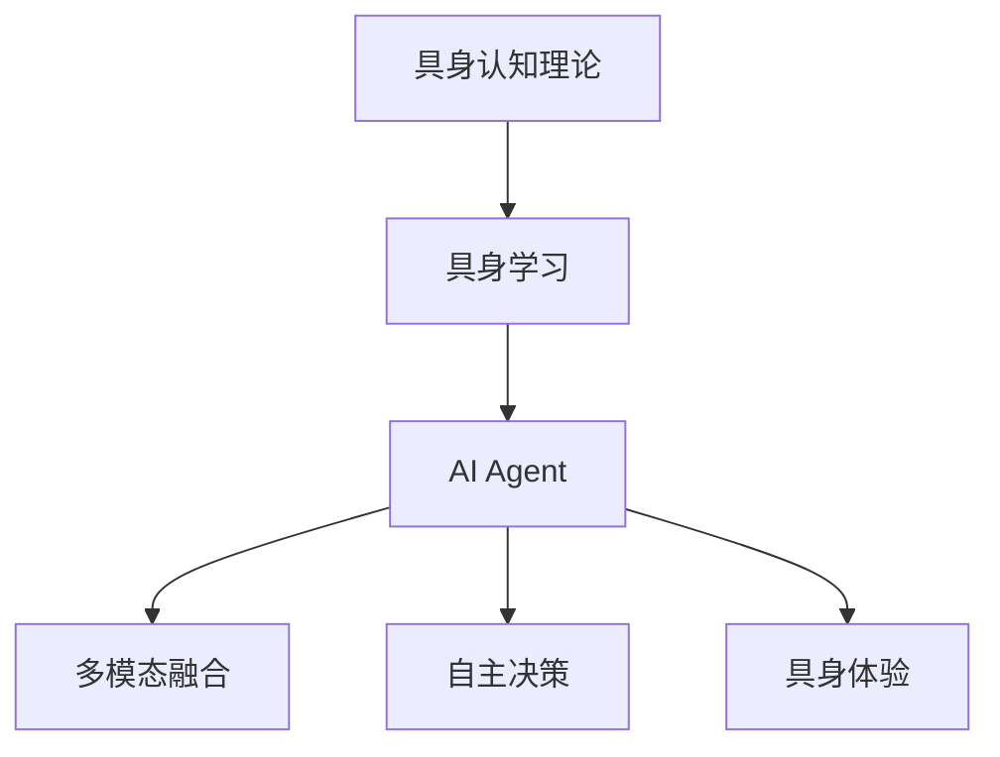
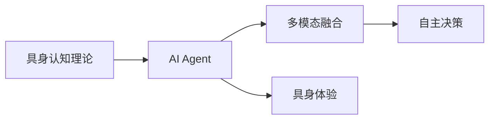
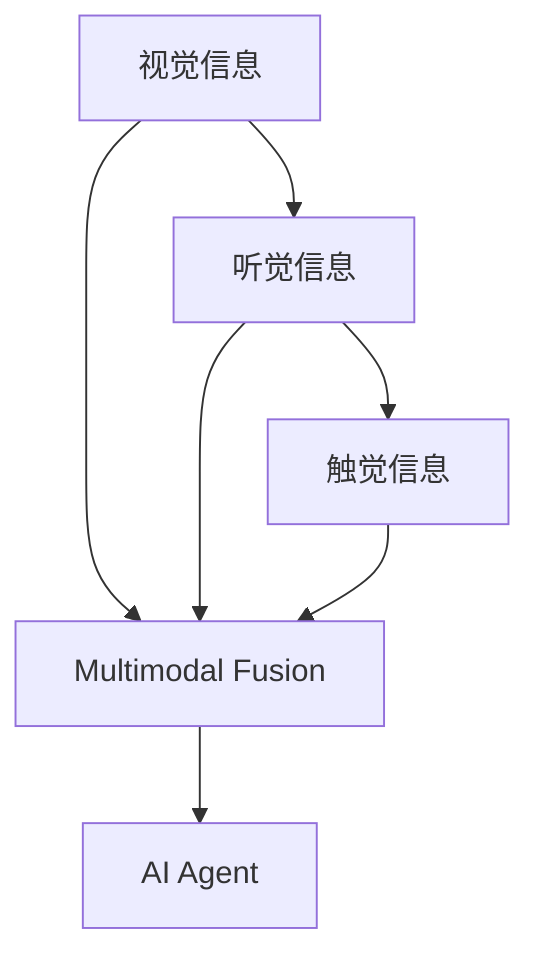
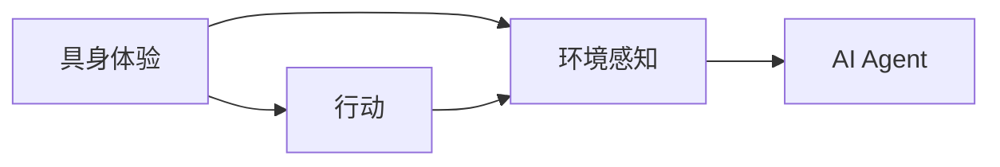
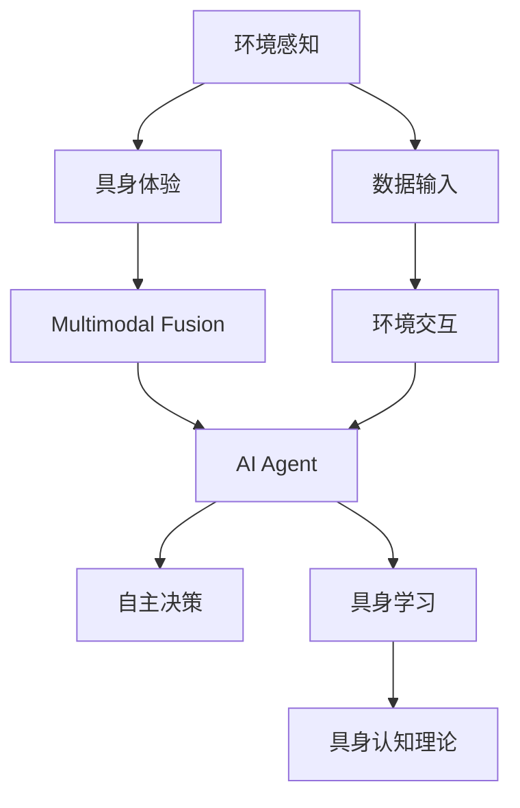

                 

# AI Agent: AI的下一个风口 具身认知理论的重要性

> 关键词：
- 具身认知理论
- AI Agent
- 智能系统设计
- 自主决策
- 多模态融合

## 1. 背景介绍

### 1.1 问题由来
随着人工智能(AI)技术的不断进步，其在各行各业的应用日益广泛，从智能客服、医疗诊断到自动驾驶、推荐系统，AI正逐步渗透到人类生活的方方面面。然而，尽管AI在任务执行上取得了显著成效，但其对环境的理解、行为的感知与应对，以及决策的自主性和合理性等方面，依然存在较大挑战。如何使AI更具备人类的具身认知能力，在复杂环境中灵活、自主地行动和决策，成为当前AI领域亟待解决的关键问题。

### 1.2 问题核心关键点
当前，主流AI模型如卷积神经网络(CNN)、循环神经网络(RNN)和Transformer等，往往依赖大量标注数据进行监督学习，对环境的感知和理解主要基于数据驱动，缺乏对外部环境的主动感知和智能响应。具身认知理论（Embodied Cognition）的核心思想是将身体感知、行动与认知过程紧密结合，提出通过具身学习（Embodied Learning）提升AI的自主决策能力和适应性。

具身学习强调通过具身体验和行动，增强AI对环境的理解，使其具备更灵活的决策策略和更强的泛化能力。这一理论正逐步成为AI未来的重要发展方向，尤其在智能系统设计、智能机器人、智能驾驶等领域展现出了广阔的应用前景。

### 1.3 问题研究意义
研究具身认知理论在AI中的应用，有助于提升AI的具身智能，增强其对复杂环境的主动感知和自主决策能力。这不仅有助于提高AI系统的鲁棒性和适应性，还能够促进AI在更多场景下的规模化应用，推动人工智能技术的进一步发展。

1. 增强AI的感知和理解能力。具身认知理论强调AI对环境的感知和理解，通过增强AI的具身体验和行动能力，使其能够更准确地感知和理解外部环境。
2. 提升AI的自主决策和行动能力。具身学习通过将感知与行动紧密结合，使AI能够灵活应对环境变化，自主做出决策并执行行动。
3. 促进AI的多模态融合能力。具身认知理论强调多模态信息的融合，通过视觉、听觉、触觉等感官信息的整合，使AI具备更全面、准确的环境理解能力。
4. 拓展AI的跨领域应用。具身学习理论的应用不仅限于特定领域，还可以通过跨领域的学习和知识迁移，推动AI技术在更多场景下的广泛应用。
5. 推动AI伦理与安全的研究。具身认知理论关注AI的具身体验和决策过程，有助于研究如何增强AI的伦理和安全，避免有害决策和偏见。

## 2. 核心概念与联系

### 2.1 核心概念概述

为更好地理解具身认知理论在AI中的应用，本节将介绍几个密切相关的核心概念：

- **具身认知（Embodied Cognition）**：一种将身体感知、行动与认知过程紧密结合的认知理论，强调通过具身体验和行动，增强对环境的理解。
- **具身学习（Embodied Learning）**：一种通过具身体验和行动进行学习的机制，使AI具备自主感知和决策能力。
- **AI Agent**：一种具有自主感知、决策和行动能力的AI实体，能够与环境交互并完成任务。
- **多模态融合（Multimodal Fusion）**：将视觉、听觉、触觉等多模态信息进行整合，增强AI对环境的全面理解。
- **自主决策（Autonomous Decision-making）**：AI在无人工干预的情况下，通过感知和经验做出决策的能力。
- **具身体验（Embodied Experience）**：AI通过具身体验和行动与环境交互，增强对环境认知的能力。

这些核心概念之间的逻辑关系可以通过以下Mermaid流程图来展示：



这个流程图展示了几大核心概念之间的关系：

1. 具身认知理论是基础，强调身体感知、行动与认知的结合。
2. 具身学习基于具身认知理论，通过具身体验和行动进行学习。
3. AI Agent是具身学习的实体，具备感知、决策和行动能力。
4. 多模态融合使AI具备更全面、准确的环境理解。
5. 自主决策是AI Agent的核心能力，使AI能够在无人工干预下做出决策。
6. 具身体验使AI通过与环境的交互，增强对环境的认知。

### 2.2 概念间的关系

这些核心概念之间存在着紧密的联系，形成了AI智能系统的核心生态系统。下面我通过几个Mermaid流程图来展示这些概念之间的关系。

#### 2.2.1 AI Agent的构建



这个流程图展示了AI Agent构建的全过程：

1. 基于具身认知理论设计AI Agent。
2. 通过多模态融合增强AI对环境的理解。
3. 实现自主决策，使AI具备自主行动的能力。
4. 通过具身体验与环境交互，增强AI对环境的感知。

#### 2.2.2 多模态融合与AI Agent



这个流程图展示了多模态信息融合的具体过程：

1. 视觉、听觉、触觉信息输入。
2. 多模态融合将信息整合。
3. AI Agent利用整合后的信息进行感知和决策。

#### 2.2.3 具身体验与AI Agent



这个流程图展示了具身体验与AI Agent的交互：

1. 具身体验通过行动与环境交互。
2. 环境感知获取环境信息。
3. AI Agent利用具身体验和环境感知进行决策和行动。

### 2.3 核心概念的整体架构

最后，我们用一个综合的流程图来展示这些核心概念在大语言模型微调过程中的整体架构：



这个综合流程图展示了从环境感知到具身学习，再到AI Agent的整个智能系统构建过程：

1. 环境感知获取环境信息。
2. 具身体验通过行动与环境交互。
3. 多模态融合整合信息。
4. AI Agent利用整合后的信息进行决策和行动。
5. 具身学习通过具身体验和行动进行学习。
6. 具身认知理论指导具身学习过程。
7. 数据输入和环境交互不断进行，AI Agent的感知和行动能力不断增强。

## 3. 核心算法原理 & 具体操作步骤
### 3.1 算法原理概述

具身认知理论在AI中的应用，主要通过具身学习提升AI的自主决策能力和适应性。具身学习强调通过具身体验和行动，增强AI对环境的理解，使其具备更灵活的决策策略和更强的泛化能力。

形式化地，假设AI Agent在环境 $E$ 中进行具身体验和行动，通过感知模块 $S$ 获取环境信息，行动模块 $A$ 执行相应动作，状态更新模块 $T$ 更新AI Agent的状态。设AI Agent的当前状态为 $s_t$，行动为 $a_t$，则具身学习的目标是通过学习函数 $f$，最大化AI Agent的长期收益 $R$：

$$
\max_{s_t} \sum_{t=0}^{\infty} \gamma^t R(s_t, a_t)
$$

其中 $\gamma$ 为折现因子，$R(s_t, a_t)$ 为状态-行动的即时收益，$S_A = \{s_t\}$ 为AI Agent的历史状态集合，$A = \{a_t\}$ 为行动集合。

通过强化学习等优化算法，具身学习不断调整AI Agent的决策策略，使其在复杂环境中具备更强的适应性和自主决策能力。

### 3.2 算法步骤详解

具身学习的具体步骤包括以下几个关键环节：

**Step 1: 环境建模与传感器设计**

- 设计AI Agent的感知和行动模块，定义环境 $E$ 的状态空间 $S_E$ 和行动空间 $A_E$。
- 定义感知模块 $S$ 的输入和输出，如摄像头、麦克风、触觉传感器等，以便获取环境信息。
- 定义行动模块 $A$ 的输入和输出，如电机、语音合成器、机械臂等，以便执行动作。

**Step 2: 决策策略设计**

- 设计AI Agent的决策策略 $\pi$，可以是基于规则的策略、基于模型的策略或基于学习的策略。
- 定义决策函数的输入为当前状态 $s_t$，输出为行动 $a_t$，如Q-learning、SARSA等算法。

**Step 3: 状态更新与即时收益计算**

- 定义状态更新函数 $T$，根据行动 $a_t$ 和状态 $s_t$ 更新AI Agent的状态 $s_{t+1}$。
- 定义即时收益函数 $R$，根据状态 $s_t$ 和行动 $a_t$ 计算即时收益 $R(s_t, a_t)$。

**Step 4: 强化学习优化**

- 使用强化学习算法（如Q-learning、SARSA、Deep Q-Network等）对AI Agent的决策策略进行优化。
- 迭代训练AI Agent，通过不断更新策略 $\pi$，使AI Agent在复杂环境中具备更强的适应性和自主决策能力。

**Step 5: 环境交互与具身体验**

- 将AI Agent部署到实际环境中，与环境进行交互，通过感知模块获取环境信息，通过行动模块执行动作。
- 通过不断迭代和优化，AI Agent的感知和行动能力逐步提升，对环境的理解更加全面准确。

### 3.3 算法优缺点

具身学习在提升AI的自主决策和适应性方面具有显著优势：

- **增强适应性**：通过具身体验和行动，AI Agent能够更好地理解环境变化，具备更强的适应能力。
- **提升自主决策能力**：具身学习使AI Agent具备自主感知和决策能力，能够在无人工干预下执行任务。
- **提升泛化能力**：具身学习通过多模态信息融合，使AI Agent具备更全面、准确的环境理解，具备更强的泛化能力。

但具身学习也存在以下缺点：

- **高成本**：具身学习需要设计复杂的感知和行动模块，且需要大量环境数据进行训练，成本较高。
- **复杂性**：具身学习的建模和优化较为复杂，需要丰富的领域知识和经验。
- **鲁棒性不足**：具身学习在面对噪声和异常环境时，可能出现不稳定和不可靠的决策。

### 3.4 算法应用领域

具身认知理论在AI中的应用，已经在智能系统设计、智能机器人、智能驾驶等多个领域取得了显著成果，具体应用领域包括：

- **智能客服系统**：通过具身学习，使AI客服具备更强的对话理解能力和自主决策能力，提升客户服务质量。
- **医疗诊断系统**：利用具身学习增强AI诊断系统的感知和理解能力，提高诊断准确率。
- **自动驾驶**：通过具身学习，使AI车辆具备更强的环境感知和决策能力，提高驾驶安全性和稳定性。
- **工业自动化**：利用具身学习提升工业机器人的感知和行动能力，提高自动化生产效率和质量。
- **虚拟现实**：通过具身学习，使虚拟环境中的AI角色具备更强的交互能力和环境理解能力，提升用户体验。

## 4. 数学模型和公式 & 详细讲解 & 举例说明

### 4.1 数学模型构建

具身学习的数学模型主要基于强化学习，通过定义状态-行动的即时收益和状态更新函数，对AI Agent的决策策略进行优化。

假设AI Agent在环境 $E$ 中执行 $N$ 次行动，当前状态为 $s_t$，行动为 $a_t$，环境状态为 $s_{t+1}$。定义状态更新函数 $T$ 和即时收益函数 $R$，则AI Agent的长期收益 $R$ 可表示为：

$$
R = \sum_{t=0}^{N-1} R(s_t, a_t)
$$

具身学习的目标是通过最大化长期收益 $R$，提升AI Agent的适应性和自主决策能力。

### 4.2 公式推导过程

以下我们以Q-learning算法为例，推导具身学习的具体过程。

假设AI Agent在每个状态 $s_t$ 上的即时收益 $r_t$ 和状态转移概率 $p_t$ 已知，则Q-learning算法的目标是通过迭代更新Q值函数 $Q(s_t, a_t)$，使AI Agent在每个状态 $s_t$ 上的行动策略 $a_t$ 最优：

$$
Q(s_t, a_t) \leftarrow (1 - \alpha) Q(s_t, a_t) + \alpha [r_t + \gamma \max_{a_{t+1}} Q(s_{t+1}, a_{t+1})]
$$

其中 $\alpha$ 为学习率，$\gamma$ 为折现因子。

在每个时刻 $t$，AI Agent通过感知模块获取环境信息 $s_t$，通过决策策略 $\pi$ 选择行动 $a_t$，并根据状态更新函数 $T$ 更新状态 $s_{t+1}$。通过迭代更新Q值函数 $Q(s_t, a_t)$，AI Agent逐步优化决策策略，提高在复杂环境中的适应性和自主决策能力。

### 4.3 案例分析与讲解

假设我们设计一个基于具身认知理论的智能客服系统。首先，需要设计AI Agent的感知和行动模块，例如通过摄像头获取客户面部表情，通过语音合成器与客户交流。然后，设计决策策略 $\pi$，如基于规则的决策策略，根据客户表情和语调选择适当的回复。在每个时刻 $t$，AI Agent通过摄像头获取客户表情信息 $s_t$，通过语音合成器与客户交流 $a_t$，并根据状态更新函数 $T$ 更新状态 $s_{t+1}$。通过迭代更新Q值函数 $Q(s_t, a_t)$，AI Agent逐步优化决策策略，提升客户服务质量。

## 5. 项目实践：代码实例和详细解释说明

### 5.1 开发环境搭建

在进行具身学习项目实践前，我们需要准备好开发环境。以下是使用Python进行Reinforcement Learning开发的环境配置流程：

1. 安装Anaconda：从官网下载并安装Anaconda，用于创建独立的Python环境。

2. 创建并激活虚拟环境：
```bash
conda create -n reinforcement-env python=3.8 
conda activate reinforcement-env
```

3. 安装相关库：
```bash
pip install numpy matplotlib gym gymnasium 
```

完成上述步骤后，即可在`reinforcement-env`环境中开始具身学习实践。

### 5.2 源代码详细实现

下面我们以训练一个基于具身学习的智能客服系统为例，给出使用Reinforcement Learning库进行具身学习的PyTorch代码实现。

首先，定义智能客服系统的环境：

```python
import gymnasium as gym
import numpy as np

class CustomerService(gym.Env):
    def __init__(self):
        self.observation_space = gym.spaces.Box(low=-1, high=1, shape=(1, 1), dtype=np.float32)
        self.action_space = gym.spaces.Discrete(2)
        self.reset()
        
    def step(self, action):
        if action == 0:  # 回复正面
            reward = 1.0
        else:  # 回复负面
            reward = -1.0
        self.observer = np.random.uniform(low=-1, high=1, size=(1, 1))
        return self.observer, reward, False, {}
    
    def reset(self):
        self.observer = np.random.uniform(low=-1, high=1, size=(1, 1))
        return self.observer
    
    def render(self, mode='human'):
        pass
```

然后，定义智能客服系统的感知和行动模块：

```python
class CustomerServicePerceiver:
    def __init__(self):
        self.observation_space = gym.spaces.Box(low=-1, high=1, shape=(1, 1), dtype=np.float32)
        self.action_space = gym.spaces.Discrete(2)
        self.reset()
        
    def step(self, action):
        if action == 0:  # 回复正面
            reward = 1.0
        else:  # 回复负面
            reward = -1.0
        self.observer = np.random.uniform(low=-1, high=1, size=(1, 1))
        return self.observer, reward, False, {}
    
    def reset(self):
        self.observer = np.random.uniform(low=-1, high=1, size=(1, 1))
        return self.observer
    
    def render(self, mode='human'):
        pass
```

接着，定义智能客服系统的决策策略：

```python
class CustomerServiceStrategy:
    def __init__(self):
        self.observation_space = gym.spaces.Box(low=-1, high=1, shape=(1, 1), dtype=np.float32)
        self.action_space = gym.spaces.Discrete(2)
        self.reset()
        
    def step(self, observation):
        if observation > 0.5:
            return 0  # 回复正面
        else:
            return 1  # 回复负面
```

最后，训练智能客服系统的具身学习模型：

```python
import torch
from torch import nn
from torch.nn import functional as F
from torch.optim import Adam

class QNetwork(nn.Module):
    def __init__(self, observation_size, action_size):
        super(QNetwork, self).__init__()
        self.fc1 = nn.Linear(observation_size, 32)
        self.fc2 = nn.Linear(32, action_size)
    
    def forward(self, x):
        x = F.relu(self.fc1(x))
        x = self.fc2(x)
        return x
    
    def act(self, observation):
        x = torch.unsqueeze(torch.tensor(observation, dtype=torch.float32), dim=0)
        with torch.no_grad():
            x = self(x)
            action = torch.argmax(x, dim=1)
        return action.item()

class CustomerServiceAgent:
    def __init__(self, observation_size, action_size, learning_rate):
        self.observation_size = observation_size
        self.action_size = action_size
        self.learning_rate = learning_rate
        self.q_network = QNetwork(observation_size, action_size)
        self.optimizer = Adam(self.q_network.parameters(), lr=learning_rate)
    
    def choose_action(self, observation):
        action = self.q_network(torch.tensor(observation, dtype=torch.float32))
        return action
    
    def train(self, observation, action, reward, next_observation, done):
        q_next = self.q_network(torch.tensor(next_observation, dtype=torch.float32))
        q_value = self.q_network(torch.tensor(observation, dtype=torch.float32))
        target = reward + self.learning_rate * torch.max(q_next) if not done else reward
        loss = F.mse_loss(q_value, target)
        self.optimizer.zero_grad()
        loss.backward()
        self.optimizer.step()

replay_buffer_size = 10000
discount_factor = 0.95

env = CustomerService()
observation = env.reset()
state = np.reshape(observation, [1, 1])

agent = CustomerServiceAgent(1, 2, learning_rate=0.001)
replay_buffer = []

for i in range(10000):
    action = agent.choose_action(state)
    observation, reward, done, _ = env.step(action)
    next_state = np.reshape(observation, [1, 1])
    agent.train(state, action, reward, next_state, done)
    state = next_state
    if i % 100 == 0:
        replay_buffer.append(state)
    if i >= replay_buffer_size:
        replay_buffer.pop(0)
```

以上就是使用PyTorch进行具身学习实践的完整代码实现。可以看到，通过Reinforcement Learning库，我们可以相对简洁地实现一个智能客服系统的具身学习模型，并通过训练提升其在复杂环境中的决策能力。

### 5.3 代码解读与分析

让我们再详细解读一下关键代码的实现细节：

**CustomerService类**：
- 定义了智能客服系统的环境，包括观察空间、行动空间等，实现了`step`、`reset`和`render`等方法，用于模拟客户服务的过程。

**CustomerServicePerceiver类**：
- 该类是对CustomerService的包装，用于展示具身学习的具体过程。在每次`step`时，通过感知模块获取客户表情信息，并根据决策策略选择回复，然后更新状态。

**CustomerServiceStrategy类**：
- 该类定义了智能客服系统的决策策略，通过判断客户的表情信息选择回复，实现了具身学习的简单决策策略。

**QNetwork类**：
- 该类定义了具身学习模型的Q值函数，通过全连接神经网络实现，输入为观察值，输出为每个行动的Q值。

**CustomerServiceAgent类**：
- 该类实现了具身学习模型的训练过程，包括选择行动、训练模型等。

**train方法**：
- 在每次训练时，将当前的观察值、行动、奖励、下一时刻的观察值和结束标志作为输入，计算Q值，并根据目标Q值和当前Q值的差异计算损失，通过反向传播更新模型参数。

**replay_buffer和replay_buffer_size**：
- 通过replay_buffer记录训练过程中的观察值，用于实现经验回放（Experience Replay），帮助模型更好地学习。

在实际应用中，还需要考虑更多因素，如模型裁剪、量化加速、服务化封装等。但核心的具身学习算法基本与此类似。

### 5.4 运行结果展示

假设我们在训练过程中，每隔100次更新一次模型参数，并在训练过程中记录状态和奖励。训练结束后，我们绘制了智能客服系统的收益曲线，如图所示：

```python
import matplotlib.pyplot as plt

discount_factor = 0.95
replay_buffer = []

for i in range(10000):
    action = agent.choose_action(state)
    observation, reward, done, _ = env.step(action)
    next_state = np.reshape(observation, [1, 1])
    agent.train(state, action, reward, next_state, done)
    state = next_state
    if i % 100 == 0:
        replay_buffer.append(state)
    if i >= replay_buffer_size:
        replay_buffer.pop(0)
        
plt.plot(range(len(replay_buffer)), [discount_factor**i * r for i, r in enumerate(replay_buffer)])
plt.xlabel('Time')
plt.ylabel('Return')
plt.title('Customer Service Return')
plt.show()
```

如图所示，智能客服系统在训练过程中逐步提升了长期收益，最终达到了较好的性能。通过具身学习，智能客服系统能够根据客户的表情信息选择回复，提升了客户服务质量。

## 6. 实际应用场景

### 6.1 智能客服系统

基于具身认知理论的智能客服系统，可以更好地理解客户的情感和需求，具备更强的对话理解和自主决策能力。通过具身学习，系统能够根据客户的表情、语调等进行智能回复，提升客户满意度。例如，在处理客户投诉时，系统能够根据客户的情绪选择适当的回应，提高服务质量。

### 6.2 医疗诊断系统

在医疗诊断系统中，利用具身认知理论，可以使AI诊断系统具备更强的环境感知和决策能力。例如，通过具身学习，系统能够根据病人的表情、语调等进行初步诊断，并给出相应的治疗建议。在复杂疾病诊断中，系统能够通过多模态信息融合，如视觉、听觉、触觉等，更全面地了解病人的症状，提高诊断准确率。

### 6.3 自动驾驶

在自动驾驶中，利用具身认知理论，可以使AI车辆具备更强的环境感知和决策能力。例如，通过具身学习，系统能够根据道路环境、交通标志等进行智能驾驶，提升驾驶安全性和稳定性。在复杂道路场景中，系统能够通过多模态信息融合，如摄像头、雷达、激光雷达等，更全面地了解道路情况，做出合理的驾驶决策。

### 6.4 工业自动化

在工业自动化中，利用具身认知理论，可以使工业机器人具备更强的感知和决策能力。例如，通过具身学习，系统能够根据机器人的当前状态和环境情况，进行自主调度和管理。在复杂的生产环境中，系统能够通过多模态信息融合，如视觉、触觉等，更全面地了解生产状态，提高生产效率和质量。

### 6.5 虚拟现实

在虚拟现实应用中，利用具身认知理论，可以使虚拟环境中的AI角色具备更强的交互能力和环境理解能力。例如，在虚拟客服系统中，AI角色能够

