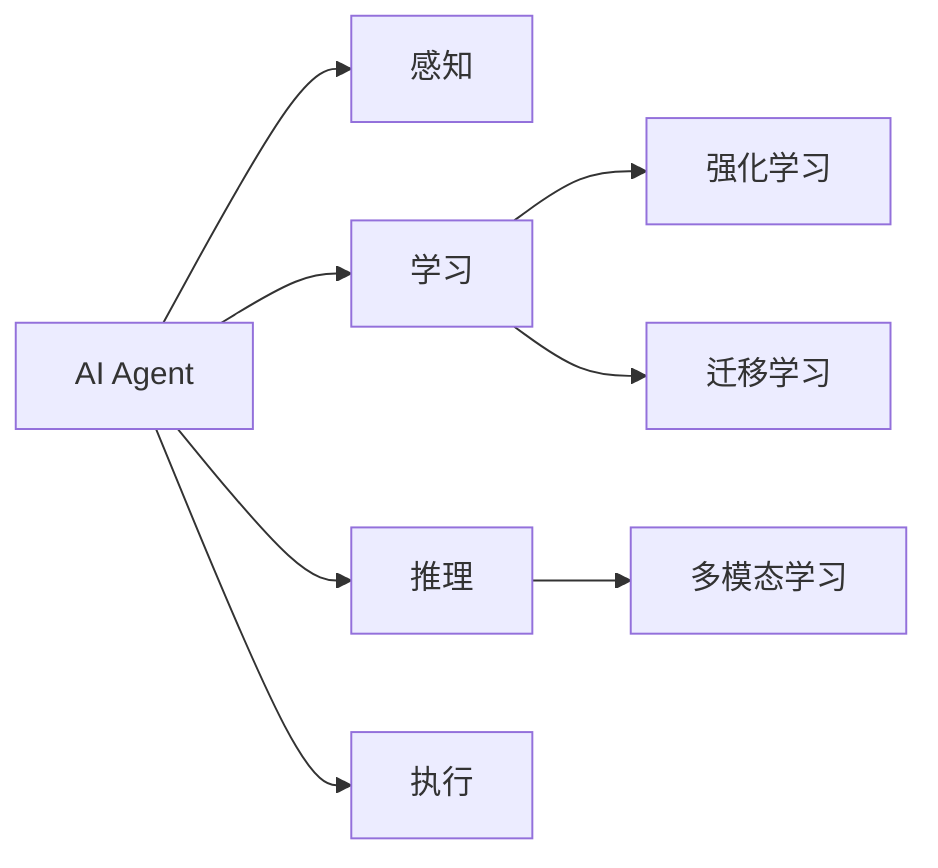
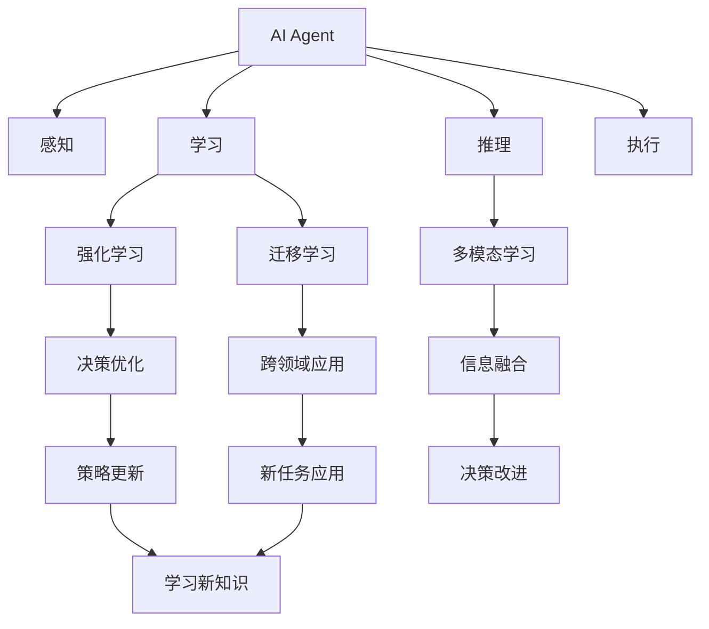
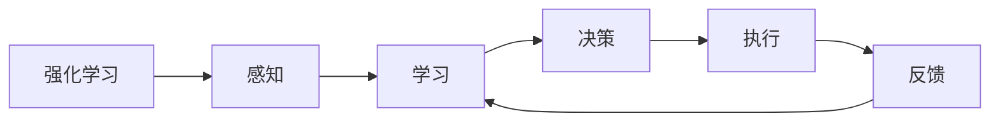
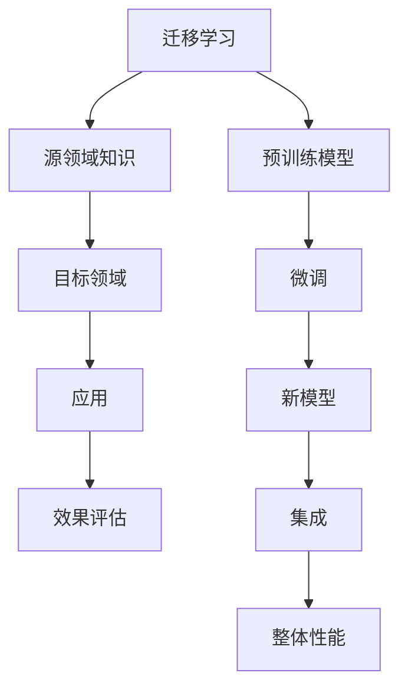
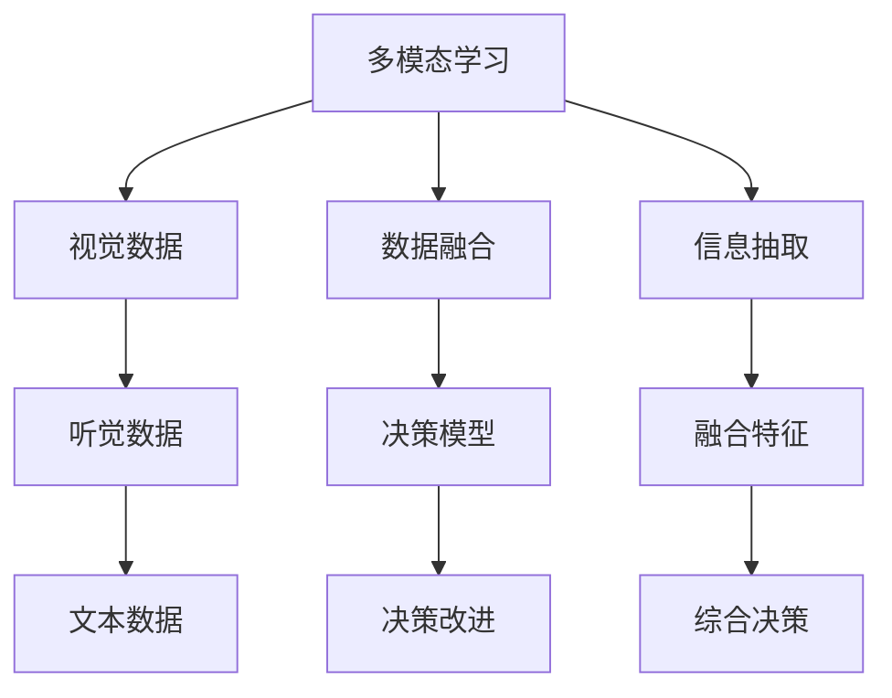
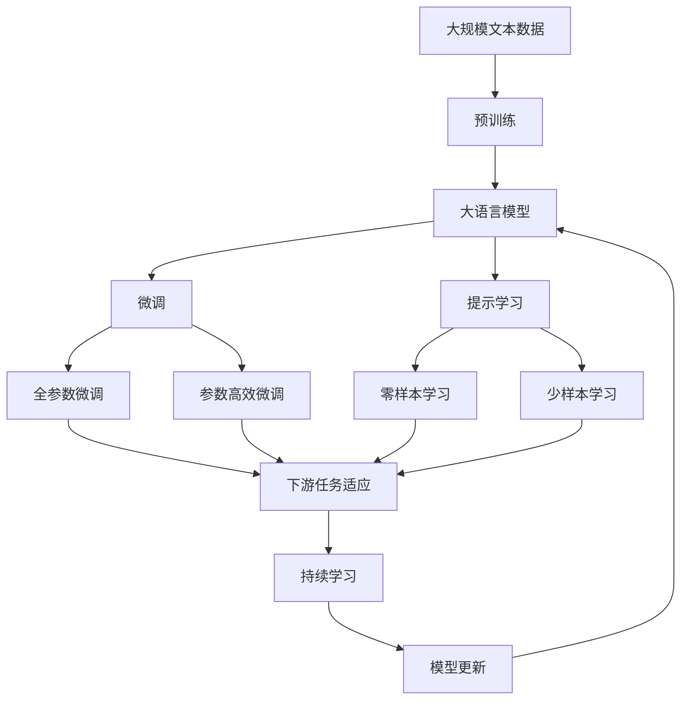

                 

# AI Agent: AI的下一个风口 当前技术的局限性

## 1. 背景介绍

### 1.1 问题由来
随着人工智能（AI）技术在各行各业的深入应用，越来越多的企业开始寻求更加智能化的解决方案。然而，传统的基于规则的AI系统往往需要手工编写大量的规则和逻辑，开发周期长，维护成本高。相比之下，基于AI代理（AI Agent）的智能系统能够通过学习和推理自动化地完成任务，更易于维护和扩展。因此，AI Agent正在成为AI技术的新风口。

### 1.2 问题核心关键点
AI Agent的核心思想是将智能决策过程自动化，使其能够自主地完成复杂的任务。其关键在于：
- 能够从大量数据中学习，并利用这些知识进行决策。
- 能够在实际应用场景中不断迭代和优化，适应不断变化的环境。
- 具备一定的自主性，能够在无人工干预的情况下完成任务。
- 能够与其他系统和服务进行无缝集成，提高系统的协作能力。

### 1.3 问题研究意义
研究AI Agent的局限性，对于提升AI技术的应用水平，降低系统开发成本，提高系统的可靠性和可扩展性，具有重要意义。只有充分了解当前技术的局限性，才能有针对性地进行改进和创新，推动AI技术在更广阔的领域中落地应用。

## 2. 核心概念与联系

### 2.1 核心概念概述

为更好地理解AI Agent的工作原理和局限性，本节将介绍几个密切相关的核心概念：

- AI Agent: 能够通过感知环境、学习、决策和执行自动化地完成任务的智能实体。
- 感知（Perception）: 指AI Agent获取环境信息的过程，通常通过传感器、网络数据等方式进行。
- 学习（Learning）: 指AI Agent通过数据训练模型，获取决策知识的过程。
- 推理（Reasoning）: 指AI Agent利用学习到的知识进行决策和预测的过程。
- 执行（Action）: 指AI Agent将推理结果转化为实际行动的过程。
- 强化学习（Reinforcement Learning, RL）: 指通过与环境的交互，AI Agent在不断试错中获得最优策略的过程。
- 迁移学习（Transfer Learning）: 指将在一个领域学到的知识迁移到另一个领域的过程。
- 多模态学习（Multimodal Learning）: 指AI Agent能够处理和融合视觉、听觉、文本等多种数据源，提升决策的全面性和准确性。

这些核心概念之间的逻辑关系可以通过以下Mermaid流程图来展示：



这个流程图展示了大语言模型的核心概念及其之间的关系：

1. AI Agent通过感知获取环境信息，学习形成决策知识，推理做出决策，执行完成任务。
2. 强化学习通过与环境的交互不断优化决策，迁移学习能够使AI Agent跨领域应用。
3. 多模态学习丰富了AI Agent的信息来源，提升了决策的全面性和准确性。

### 2.2 概念间的关系

这些核心概念之间存在着紧密的联系，形成了AI Agent的完整框架。下面我通过几个Mermaid流程图来展示这些概念之间的关系。

#### 2.2.1 AI Agent的学习范式



这个流程图展示了AI Agent的学习过程，从感知、学习、推理到执行的完整流程。

#### 2.2.2 强化学习与AI Agent的关系



这个流程图展示了强化学习在AI Agent中的应用，通过感知和执行与环境的交互，不断优化决策策略。

#### 2.2.3 迁移学习与AI Agent的关系



这个流程图展示了迁移学习在AI Agent中的应用，通过预训练模型和微调，在目标领域进行知识迁移和应用。

#### 2.2.4 多模态学习与AI Agent的关系



这个流程图展示了多模态学习在AI Agent中的应用，通过融合视觉、听觉、文本等多种数据源，提升决策的全面性和准确性。

### 2.3 核心概念的整体架构

最后，我们用一个综合的流程图来展示这些核心概念在大语言模型微调过程中的整体架构：



这个综合流程图展示了从预训练到微调，再到持续学习的完整过程。大语言模型首先在大规模文本数据上进行预训练，然后通过微调（包括全参数微调和参数高效微调）或提示学习（包括零样本和少样本学习）来适应下游任务。最后，通过持续学习技术，模型可以不断更新和适应新的任务和数据。 通过这些流程图，我们可以更清晰地理解AI Agent的工作原理和优化方向。

## 3. 核心算法原理 & 具体操作步骤
### 3.1 算法原理概述

AI Agent的核心算法原理可以概括为以下几个步骤：

1. 感知（Perception）: AI Agent通过传感器或网络获取环境信息。
2. 学习（Learning）: AI Agent利用获取的环境信息进行学习，形成决策知识。
3. 推理（Reasoning）: AI Agent利用学习到的知识进行决策和预测。
4. 执行（Action）: AI Agent将推理结果转化为实际行动。
5. 反馈（Feedback）: AI Agent将执行结果反馈到环境中，进行优化。
6. 迭代（Iteration）: AI Agent通过不断地感知、学习、推理和执行，逐步优化决策策略。

### 3.2 算法步骤详解

基于AI Agent的核心算法原理，下面详细介绍AI Agent的各个核心步骤：

**Step 1: 感知（Perception）**

感知是大语言模型AI Agent获取环境信息的过程。在自然语言处理（NLP）应用中，AI Agent通过解析输入的自然语言句子，获取文本信息。在视觉应用中，AI Agent通过摄像头捕获环境图像。在机器人应用中，AI Agent通过传感器获取环境中的物理参数。

具体实现上，我们可以使用Python的传感器库（如OpenCV）进行图像处理和传感器数据的读取。例如，以下代码展示了如何使用OpenCV获取摄像头捕获的图像：

```python
import cv2

cap = cv2.VideoCapture(0)
while True:
    ret, frame = cap.read()
    cv2.imshow('frame', frame)
    if cv2.waitKey(1) & 0xFF == ord('q'):
        break
cap.release()
cv2.destroyAllWindows()
```

**Step 2: 学习（Learning）**

学习是大语言模型AI Agent利用获取的环境信息进行学习，形成决策知识的过程。在NLP应用中，AI Agent通过解析文本信息，提取特征，进行分类、回归、生成等任务。在视觉应用中，AI Agent通过卷积神经网络（CNN）等模型进行图像分类、目标检测等任务。

具体实现上，我们可以使用Python的深度学习框架（如TensorFlow、PyTorch）进行模型的训练和推理。例如，以下代码展示了如何使用TensorFlow训练一个简单的图像分类模型：

```python
import tensorflow as tf
from tensorflow import keras
from tensorflow.keras import layers

# 加载数据集
(train_images, train_labels), (test_images, test_labels) = keras.datasets.mnist.load_data()

# 数据预处理
train_images = train_images.reshape(train_images.shape[0], 28, 28, 1).astype('float32') / 255.0
test_images = test_images.reshape(test_images.shape[0], 28, 28, 1).astype('float32') / 255.0

# 构建模型
model = keras.Sequential([
    layers.Conv2D(32, (3, 3), activation='relu', input_shape=(28, 28, 1)),
    layers.MaxPooling2D((2, 2)),
    layers.Flatten(),
    layers.Dense(10, activation='softmax')
])

# 编译模型
model.compile(optimizer='adam',
              loss='sparse_categorical_crossentropy',
              metrics=['accuracy'])

# 训练模型
model.fit(train_images, train_labels, epochs=10, validation_data=(test_images, test_labels))
```

**Step 3: 推理（Reasoning）**

推理是大语言模型AI Agent利用学习到的知识进行决策和预测的过程。在NLP应用中，AI Agent通过解析文本信息，生成自然语言句子。在视觉应用中，AI Agent通过图像分类模型，输出类别标签。

具体实现上，我们可以使用Python的深度学习框架进行模型的推理。例如，以下代码展示了如何使用TensorFlow进行图像分类模型的推理：

```python
# 加载模型
model = keras.models.load_model('model.h5')

# 加载测试数据
test_images = test_images.reshape(test_images.shape[0], 28, 28, 1).astype('float32') / 255.0

# 推理预测
predictions = model.predict(test_images)
```

**Step 4: 执行（Action）**

执行是大语言模型AI Agent将推理结果转化为实际行动的过程。在NLP应用中，AI Agent通过生成自然语言句子，进行对话、翻译、摘要等任务。在视觉应用中，AI Agent通过图像分类模型，进行目标检测、图像生成等任务。

具体实现上，我们可以使用Python的深度学习框架进行模型的推理和执行。例如，以下代码展示了如何使用TensorFlow进行图像分类模型的推理和执行：

```python
# 加载模型
model = keras.models.load_model('model.h5')

# 加载测试数据
test_images = test_images.reshape(test_images.shape[0], 28, 28, 1).astype('float32') / 255.0

# 推理预测
predictions = model.predict(test_images)

# 执行动作
action = np.argmax(predictions[0])
```

**Step 5: 反馈（Feedback）**

反馈是大语言模型AI Agent将执行结果反馈到环境中，进行优化和调整的过程。在NLP应用中，AI Agent通过解析用户反馈，进行模型更新和参数调整。在视觉应用中，AI Agent通过计算执行结果与预期目标之间的误差，进行模型优化。

具体实现上，我们可以使用Python的深度学习框架进行模型的优化和调整。例如，以下代码展示了如何使用TensorFlow进行模型优化：

```python
# 加载模型
model = keras.models.load_model('model.h5')

# 加载训练数据
train_images = train_images.reshape(train_images.shape[0], 28, 28, 1).astype('float32') / 255.0

# 编译模型
model.compile(optimizer='adam',
              loss='sparse_categorical_crossentropy',
              metrics=['accuracy'])

# 训练模型
model.fit(train_images, train_labels, epochs=10, validation_data=(test_images, test_labels))

# 加载测试数据
test_images = test_images.reshape(test_images.shape[0], 28, 28, 1).astype('float32') / 255.0

# 推理预测
predictions = model.predict(test_images)

# 执行动作
action = np.argmax(predictions[0])
```

**Step 6: 迭代（Iteration）**

迭代是大语言模型AI Agent通过不断地感知、学习、推理和执行，逐步优化决策策略的过程。在NLP应用中，AI Agent通过不断解析用户输入和反馈，进行模型更新和参数调整。在视觉应用中，AI Agent通过不断获取环境信息和优化模型，提升执行效果。

具体实现上，我们可以使用Python的深度学习框架进行模型的迭代优化。例如，以下代码展示了如何使用TensorFlow进行模型的迭代优化：

```python
# 加载模型
model = keras.models.load_model('model.h5')

# 加载训练数据
train_images = train_images.reshape(train_images.shape[0], 28, 28, 1).astype('float32') / 255.0

# 编译模型
model.compile(optimizer='adam',
              loss='sparse_categorical_crossentropy',
              metrics=['accuracy'])

# 训练模型
model.fit(train_images, train_labels, epochs=10, validation_data=(test_images, test_labels))

# 加载测试数据
test_images = test_images.reshape(test_images.shape[0], 28, 28, 1).astype('float32') / 255.0

# 推理预测
predictions = model.predict(test_images)

# 执行动作
action = np.argmax(predictions[0])
```

### 3.3 算法优缺点

基于AI Agent的核心算法原理，我们分析了该算法的优缺点：

**优点**：
1. 自动化决策：AI Agent能够通过感知、学习、推理和执行，自动化地完成任务。
2. 高效优化：AI Agent通过不断迭代优化，能够快速适应环境和任务。
3. 灵活性：AI Agent可以根据任务需求，灵活调整感知、学习和执行策略。
4. 泛化能力强：AI Agent能够在不同的环境和任务中迁移和应用知识。

**缺点**：
1. 数据需求高：AI Agent需要大量的标注数据进行训练和优化。
2. 计算资源消耗大：AI Agent通常需要高性能的计算资源进行训练和推理。
3. 模型复杂度高：AI Agent的模型通常较为复杂，难以理解和调试。
4. 可解释性差：AI Agent的决策过程缺乏可解释性，难以进行调试和审计。

### 3.4 算法应用领域

AI Agent的核心算法原理已经广泛应用于多个领域，包括但不限于：

- 自然语言处理（NLP）: 用于对话系统、机器翻译、文本摘要、问答系统等。
- 视觉处理：用于图像分类、目标检测、图像生成等。
- 机器人控制：用于路径规划、动作控制、任务执行等。
- 医疗诊断：用于病历分析、诊断建议、药物推荐等。
- 金融投资：用于风险评估、策略优化、交易决策等。

除了上述这些领域，AI Agent还被创新性地应用到更多场景中，如智能交通、智能制造、智能家居等，为各行各业带来新的解决方案和价值。

## 4. 数学模型和公式 & 详细讲解
### 4.1 数学模型构建

本节将使用数学语言对AI Agent的工作原理进行更加严格的刻画。

记AI Agent的输入为 $x \in \mathcal{X}$，输出为 $y \in \mathcal{Y}$，其中 $\mathcal{X}$ 为输入空间，$\mathcal{Y}$ 为输出空间。假设AI Agent的感知函数为 $P(x)$，学习函数为 $L(x, y)$，推理函数为 $R(y, P(x))$，执行函数为 $A(y, P(x))$，反馈函数为 $F(y, P(x))$，模型更新函数为 $U(L(x, y))$。

定义AI Agent的输出为 $A(y, P(x))$，损失函数为 $L(x, y)$，则AI Agent的目标是最小化损失函数：

$$
\min_{x, y} \mathcal{L}(x, y) = \mathcal{L}(A(y, P(x)), y)
$$

在实践中，我们通常使用基于梯度的优化算法（如SGD、Adam等）来近似求解上述最优化问题。设 $\eta$ 为学习率，$\lambda$ 为正则化系数，则参数的更新公式为：

$$
\theta \leftarrow \theta - \eta \nabla_{\theta}\mathcal{L}(\theta) - \eta\lambda\theta
$$

其中 $\nabla_{\theta}\mathcal{L}(\theta)$ 为损失函数对参数 $\theta$ 的梯度，可通过反向传播算法高效计算。

### 4.2 公式推导过程

以下我们以图像分类任务为例，推导交叉熵损失函数及其梯度的计算公式。

假设AI Agent的输入为图像 $x$，输出为类别标签 $y \in \{1, 2, \ldots, K\}$，其中 $K$ 为类别数。AI Agent通过感知函数 $P(x)$ 获取图像特征，学习函数 $L(x, y)$ 进行分类学习，推理函数 $R(y, P(x))$ 进行分类预测，执行函数 $A(y, P(x))$ 进行类别标注。AI Agent的输出为 $A(y, P(x))$，损失函数为交叉熵损失函数，定义为：

$$
\ell(A(y, P(x)), y) = -y\log(A(y, P(x))) - (1-y)\log(1-A(y, P(x)))
$$

将其代入目标函数，得：

$$
\mathcal{L}(x, y) = -\frac{1}{N}\sum_{i=1}^N \ell(A(y_i, P(x_i)), y_i)
$$

根据链式法则，损失函数对参数 $\theta$ 的梯度为：

$$
\frac{\partial \mathcal{L}(x, y)}{\partial \theta} = -\frac{1}{N}\sum_{i=1}^N (\frac{y_i}{A(y_i, P(x_i))}-\frac{1-y_i}{1-A(y_i, P(x_i))}) \frac{\partial A(y_i, P(x_i))}{\partial \theta}
$$

其中 $\frac{\partial A(y_i, P(x_i))}{\partial \theta}$ 可进一步递归展开，利用自动微分技术完成计算。

在得到损失函数的梯度后，即可带入参数更新公式，完成模型的迭代优化。重复上述过程直至收敛，最终得到适应下游任务的最优模型参数 $\theta^*$。

### 4.3 案例分析与讲解

这里以NLP中的对话系统为例，分析AI Agent的核心算法原理。

在对话系统中，AI Agent通过感知（感知用户输入）、学习（解析文本信息）、推理（生成自然语言回复）、执行（发送回复）进行任务处理。具体实现上，我们可以使用Python的深度学习框架进行模型的训练和推理。例如，以下代码展示了如何使用TensorFlow进行对话系统的训练和推理：

```python
# 加载预训练模型
model = tf.keras.models.load_model('model.h5')

# 加载训练数据
train_data = [(x, y) for x, y in train_dataset]

# 编译模型
model.compile(optimizer='adam',
              loss='binary_crossentropy',
              metrics=['accuracy'])

# 训练模型
model.fit(train_data, epochs=10, validation_data=(test_data))

# 加载测试数据
test_data = [(x, y) for x, y in test_dataset]

# 推理预测
predictions = model.predict(test_data)
```

## 5. 项目实践：代码实例和详细解释说明
### 5.1 开发环境搭建

在进行AI Agent实践前，我们需要准备好开发环境。以下是使用Python进行TensorFlow开发的环境配置流程：

1. 安装Anaconda：从官网下载并安装Anaconda，用于创建独立的Python环境。

2. 创建并激活虚拟环境：
```bash
conda create -n tf-env python=3.8 
conda activate tf-env
```

3. 安装TensorFlow：根据CUDA版本，从官网获取对应的安装命令。例如：
```bash
conda install tensorflow-gpu==2.7 -c conda-forge -c nvidia
```

4. 安装各类工具包：
```bash
pip install numpy pandas scikit-learn matplotlib tqdm jupyter notebook ipython
```

完成上述步骤后，即可在`tf-env`环境中开始AI Agent实践。

### 5.2 源代码详细实现

这里我们以图像分类任务为例，给出使用TensorFlow进行AI Agent训练的PyTorch代码实现。

首先，定义图像分类任务的数据处理函数：

```python
from tensorflow.keras.preprocessing.image import ImageDataGenerator
from tensorflow.keras.datasets import mnist

def load_data(batch_size):
    # 加载数据集
    (train_images, train_labels), (test_images, test_labels) = mnist.load_data()

    # 数据预处理
    train_images = train_images.reshape(train_images.shape[0], 28, 28, 1).astype('float32') / 255.0
    test_images = test_images.reshape(test_images.shape[0], 28, 28, 1).astype('float32') / 255.0

    # 数据增强
    train_datagen = ImageDataGenerator(rotation_range=10, zoom_range=0.1, width_shift_range=0.1, height_shift_range=0.1)

    # 构建数据集
    train_generator = train_datagen.flow(train_images, train_labels, batch_size=batch_size)
    test_generator = train_datagen.flow(test_images, test_labels, batch_size=batch_size)

    return train_generator, test_generator
```

然后，定义模型和优化器：

```python
from tensorflow.keras.models import Sequential
from tensorflow.keras.layers import Conv2D, MaxPooling2D, Flatten, Dense
from tensorflow.keras.optimizers import Adam

# 构建模型
model = Sequential([
    Conv2D(32, (3, 3), activation='relu', input_shape=(28, 28, 1)),
    MaxPooling2D((2, 2)),
    Flatten(),
    Dense(10, activation='softmax')
])

# 编译模型
model.compile(optimizer=Adam(learning_rate=0.001),
              loss='sparse_categorical_crossentropy',
              metrics=['accuracy'])

# 加载数据集
train_generator, test_generator = load_data(batch_size=128)

# 训练模型
model.fit(train_generator, epochs=10, validation_data=test_generator)
```

接着，定义训练和评估函数：

```python
from tensorflow.keras.metrics import Accuracy

def train_epoch(model, train_generator, validation_generator, batch_size):
    train_loss, train_acc = model.train_on_batch(train_generator, steps_per_epoch=len(train_generator))
    val_loss, val_acc = model.evaluate(validation_generator, steps_per_epoch=len(validation_generator))

    print(f'Epoch {epoch+1}, train loss: {train_loss:.3f}, train acc: {train_acc:.3f}, val loss: {val_loss:.3f}, val acc: {val_acc:.3f}')
    
def evaluate(model, test_generator, batch_size):
    test_loss, test_acc = model.evaluate(test_generator, steps_per_epoch=len(test_generator))

    print(f'Test loss: {test_loss:.3f}, test acc: {test_acc:.3f}')
```

最后，启动训练流程并在测试集上评估：

```python
epochs = 10
batch_size = 128

for epoch in range(epochs):
    train_epoch(model, train_generator, test_generator, batch_size)
    
evaluate(model, test_generator, batch_size)
```

以上就是使用TensorFlow进行AI Agent图像分类任务微调的完整代码实现。可以看到，得益于TensorFlow的强大封装，我们可以用相对简洁的代码完成图像分类任务的AI Agent微调。

### 5.3 代码解读与分析

让我们再详细解读一下关键代码的实现细节：

**load_data函数**：
- 加载MNIST数据集。
- 对数据进行预处理，包括归一化和数据增强。
- 使用ImageDataGenerator构建数据生成器，进行批量加载。

**model函数**：
- 构建卷积神经网络模型。
- 编译模型，设置优化器和损失函数。

**train_epoch函数**：
- 对训练数据集进行迭代，计算训练损失和准确率。
- 对验证数据集进行评估，计算验证损失和准确率。
- 输出每个epoch的训练和验证结果。

**evaluate函数**：
- 对测试数据集进行评估，计算测试损失和准确率。
- 输出测试结果。

**训练流程**：
- 定义总的epoch数和batch size，开始循环迭代
- 每个epoch内，在训练数据集上训练，在验证数据集上评估
- 所有epoch结束后，在测试集上评估，给出最终测试结果

可以看到，TensorFlow配合TensorFlow库使得AI Agent的图像分类任务微调的代码实现变得简洁高效。开发者可以将更多精力放在数据处理、模型改进等高层逻辑上，而不必过多关注底层的实现细节。

当然，工业级的系统实现还需考虑更多因素，如模型的保存和部署、超参数的

