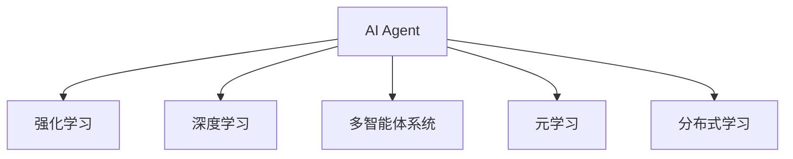
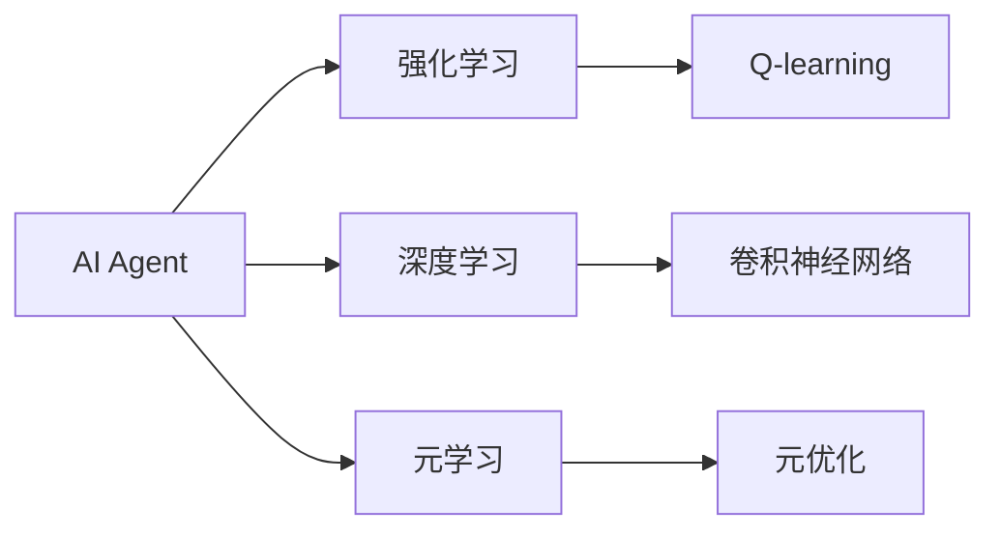
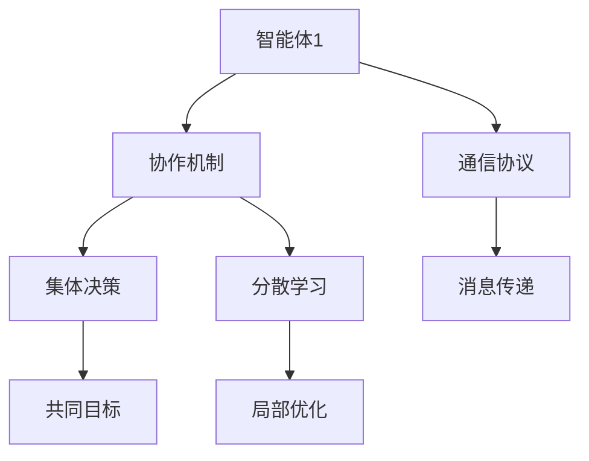
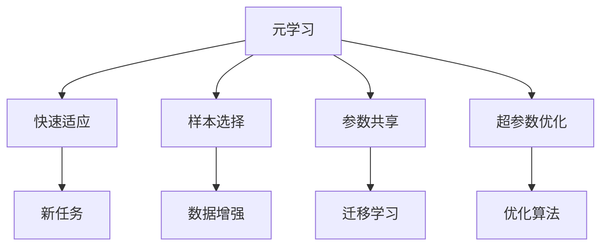
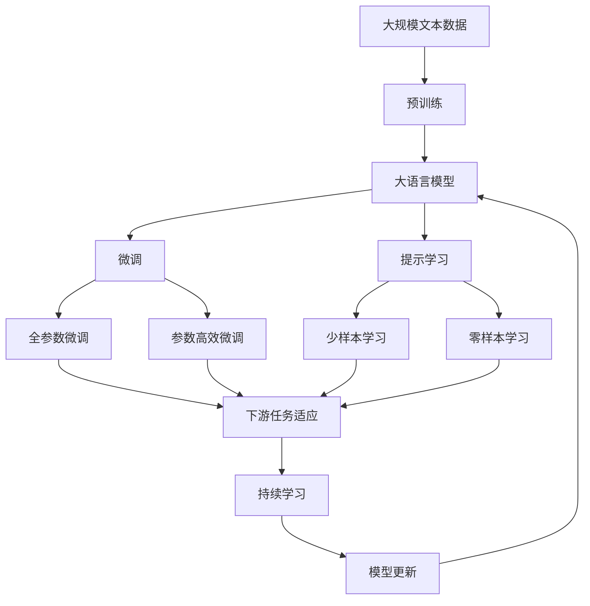

                 

# AI Agent: AI的下一个风口 当前的研究难点与挑战

> 关键词：AI Agent, 强化学习, 深度学习, 多智能体系统, 元学习, 分布式学习

## 1. 背景介绍

### 1.1 问题由来

随着人工智能技术的不断成熟，AI Agent（智能体）正逐渐成为下一轮技术风口。AI Agent 是一种具备自主学习能力的智能实体，能够在复杂环境中自适应地完成任务。近年来，AI Agent 技术被广泛应用于游戏AI、机器人、自动驾驶、医疗诊断等领域，取得了显著的成果。然而，AI Agent 技术仍面临诸多难点和挑战，特别是在深度学习、强化学习、多智能体系统、元学习等领域，亟需突破。

### 1.2 问题核心关键点

当前AI Agent技术的研究热点和难点包括：

1. 智能体的多任务学习和多智能体协作问题，如何更高效地学习多任务，并实现多智能体之间的协同。
2. 如何设计高效的算法和架构，以应对大规模、高维度、复杂环境中的任务。
3. 如何实现更加智能、适应性更强的学习机制，以应对动态变化的环境。
4. 如何整合和应用跨领域知识，以提升AI Agent的泛化能力和普适性。
5. 如何提升AI Agent的可解释性和可控性，以确保其应用的安全性和可靠性。
6. 如何在分布式和资源受限的环境下进行高效学习和训练。

### 1.3 问题研究意义

研究AI Agent技术对于拓展AI的应用范围，提升智能体的自主学习能力和适应性，加速AI技术的产业化进程，具有重要意义：

1. 降低开发成本。AI Agent可以自主学习和适应任务，减少人工干预和优化。
2. 提升性能表现。智能体的多任务学习和协作能力，可以提升整体系统的效率和效果。
3. 加速技术迭代。AI Agent的学习机制可以快速适应新任务和环境变化，加速技术升级。
4. 带来技术创新。AI Agent的多智能体协作和知识整合技术，催生新的研究方向和方法。
5. 赋能产业升级。AI Agent在医疗、制造、交通等领域的应用，赋能传统行业转型升级。

## 2. 核心概念与联系

### 2.1 核心概念概述

为更好地理解AI Agent技术，本节将介绍几个密切相关的核心概念：

- AI Agent: 在环境中自主学习、自适应决策和执行的智能实体。
- 强化学习(Reinforcement Learning, RL): 通过与环境互动，不断调整自身行为以最大化累积奖励的学习范式。
- 深度学习(Deep Learning, DL): 利用多层神经网络进行特征提取和任务决策的技术。
- 多智能体系统(Multi-Agent System,MAS): 由多个智能体相互协作或竞争，共同完成任务的系统。
- 元学习(Meta-Learning): 学习如何高效地学习，以快速适应新任务和环境的技术。
- 分布式学习(Distributed Learning): 多台计算机通过网络协同进行模型训练和学习的技术。

这些核心概念之间的逻辑关系可以通过以下Mermaid流程图来展示：



这个流程图展示了大语言模型的核心概念及其之间的关系：

1. AI Agent 技术通过强化学习、深度学习等方式进行自主学习和决策。
2. 多智能体系统可以协作完成任务，提升系统性能。
3. 元学习用于快速适应新任务，提升学习能力。
4. 分布式学习用于在多台计算机上协同训练，提高训练效率。

### 2.2 概念间的关系

这些核心概念之间存在着紧密的联系，形成了AI Agent技术的完整生态系统。下面我通过几个Mermaid流程图来展示这些概念之间的关系。

#### 2.2.1 AI Agent的算法范式



这个流程图展示了AI Agent的三种主要算法范式：强化学习、深度学习和元学习。强化学习中Q-learning是最经典的算法，深度学习中卷积神经网络是常用结构，元学习中元优化方法被广泛应用。

#### 2.2.2 多智能体系统的协作方式



这个流程图展示了多智能体系统中的协作方式。智能体通过协作机制进行集体决策，利用通信协议进行消息传递，采用局部优化策略实现分散学习，最终达到共同目标。

#### 2.2.3 元学习的快速适应过程



这个流程图展示了元学习的快速适应过程。元学习通过样本选择、参数共享、超参数优化等方式，快速适应新任务，实现高效率的迁移学习。

### 2.3 核心概念的整体架构

最后，我们用一个综合的流程图来展示这些核心概念在大语言模型微调过程中的整体架构：



这个综合流程图展示了从预训练到微调，再到持续学习的完整过程。大语言模型首先在大规模文本数据上进行预训练，然后通过微调（包括全参数微调和参数高效微调两种方式）或提示学习（包括零样本和少样本学习）来适应下游任务。最后，通过持续学习技术，模型可以不断更新和适应新的任务和数据。 通过这些流程图，我们可以更清晰地理解AI Agent技术的工作原理和优化方向。

## 3. 核心算法原理 & 具体操作步骤
### 3.1 算法原理概述

AI Agent的算法范式主要包括强化学习、深度学习和元学习等。这些算法通过构建环境、智能体和奖励机制，实现智能体的自主学习和自适应决策。

1. **强化学习**：AI Agent在环境中通过不断与环境互动，最大化累积奖励信号，学习最优策略。基本框架为：
   - 状态空间: 环境状态表示
   - 动作空间: 智能体的可执行操作
   - 奖励函数: 行为结果的奖励信号
   - 策略: 智能体决策函数

2. **深度学习**：利用多层神经网络进行特征提取和任务决策，通过反向传播算法进行参数优化。深度学习通常用于处理高维、复杂的数据，提取丰富的特征表示。

3. **多智能体系统**：多个智能体之间通过协作或竞争，共同完成任务。系统设计包括通信协议、集体决策、分散学习等关键组件。

4. **元学习**：学习如何快速学习新任务，提升学习能力。基本框架为：
   - 元任务: 特定环境下的学习任务
   - 元数据: 不同环境下的学习数据
   - 元模型: 用于适应新任务的参数化模型
   - 元优化: 优化元模型参数的算法

### 3.2 算法步骤详解

AI Agent的算法步骤通常包括预训练、微调、训练和评估等环节。以下以强化学习为基础，详细讲解AI Agent的算法步骤：

1. **预训练**：利用大规模数据集对AI Agent进行预训练，学习通用的语言表示和知识。

2. **微调**：根据具体任务，对预训练模型进行微调，调整部分参数以适应特定任务。

3. **训练**：在目标环境中，通过与环境互动，利用强化学习算法训练AI Agent。

4. **评估**：在目标环境中对AI Agent进行测试，评估其性能和适应能力。

### 3.3 算法优缺点

AI Agent算法具有以下优点：

- 自主学习能力强，能够快速适应新环境和新任务。
- 具有多智能体协作和知识整合能力，能够实现复杂任务的协同。
- 能够高效利用大规模数据集，提取丰富的特征表示。

然而，AI Agent算法也存在以下缺点：

- 算法复杂度高，需要大量计算资源和数据支持。
- 难以解释AI Agent的决策过程，缺乏可解释性。
- 需要大量数据进行预训练和微调，数据采集和标注成本较高。
- 对环境变化的适应能力仍需进一步提升，鲁棒性有待提高。

### 3.4 算法应用领域

AI Agent技术已经在众多领域得到了广泛应用，例如：

- 游戏AI：AI Agent在电子游戏中表现出色，如AlphaGo、OpenAI Five等。
- 机器人控制：AI Agent用于机器人导航、避障、路径规划等任务。
- 自动驾驶：AI Agent在无人驾驶汽车中用于感知、决策和控制。
- 医疗诊断：AI Agent用于影像识别、病历分析、药物研发等医疗任务。
- 金融风险管理：AI Agent用于市场监控、风险评估、交易策略优化等金融任务。
- 智能客服：AI Agent用于智能对话系统，提高客户咨询体验。

除了这些经典应用外，AI Agent技术还在教育、物流、农业、灾害预测等领域展现出巨大的应用潜力。

## 4. 数学模型和公式 & 详细讲解 & 举例说明
### 4.1 数学模型构建

AI Agent的数学模型构建通常涉及环境建模、状态空间定义、动作空间设计、奖励函数定义、策略表达等。以下以强化学习为例，构建基本的数学模型：

- 状态空间 $S$：环境状态集合。
- 动作空间 $A$：智能体可执行操作集合。
- 奖励函数 $R(s,a)$：智能体执行动作 $a$ 在状态 $s$ 上的即时奖励。
- 策略 $\pi$：智能体决策函数，表示在状态 $s$ 下执行动作 $a$ 的概率。

### 4.2 公式推导过程

以下是强化学习中的Q-learning算法的推导过程。Q-learning算法通过更新Q值（即最优策略的期望收益）来优化策略。

1. 状态-动作值函数 $Q(s,a)$ 表示在状态 $s$ 下执行动作 $a$ 的累积收益。

   $$
   Q(s,a) = \mathbb{E}\left[\sum_{t=0}^\infty \gamma^t R(s_t,a_t)\right]
   $$

   其中 $\gamma$ 是折扣因子，$R(s_t,a_t)$ 是即时奖励，$s_t$ 和 $a_t$ 分别表示状态和动作。

2. Q-learning算法通过更新 $Q(s,a)$ 来优化策略 $\pi$。

   $$
   Q(s,a) \leftarrow Q(s,a) + \alpha (R(s,a) + \gamma \max_{a'} Q(s',a') - Q(s,a))
   $$

   其中 $\alpha$ 是学习率，$Q(s',a')$ 是状态 $s'$ 下动作 $a'$ 的Q值，$(s',a')$ 是状态 $s$ 和动作 $a$ 的下一个状态和动作。

3. 状态-动作值函数 $Q(s,a)$ 的更新公式可以改写为：

   $$
   Q(s,a) \leftarrow Q(s,a) + \alpha [r + \gamma \max Q(s',a') - Q(s,a)]
   $$

   其中 $r$ 是即时奖励，$s'$ 和 $a'$ 是下一个状态和动作。

### 4.3 案例分析与讲解

以AlphaGo为例，AlphaGo利用深度神经网络构建状态表示和价值函数，通过策略网络选择动作，通过蒙特卡洛树搜索（MCTS）算法进行策略优化。AlphaGo的训练和比赛过程展示了AI Agent在复杂环境中的自主学习和自适应能力。

在预训练阶段，AlphaGo通过大量的围棋游戏数据进行训练，学习围棋的基本策略和游戏规律。在微调阶段，AlphaGo根据具体的比赛环境，通过强化学习算法不断调整策略，提升游戏水平。在测试阶段，AlphaGo在复杂的围棋对战中展示了强大的自适应能力和自主决策能力。

## 5. 项目实践：代码实例和详细解释说明
### 5.1 开发环境搭建

在进行AI Agent项目实践前，我们需要准备好开发环境。以下是使用Python进行PyTorch和TensorFlow开发的环境配置流程：

1. 安装Anaconda：从官网下载并安装Anaconda，用于创建独立的Python环境。

2. 创建并激活虚拟环境：
```bash
conda create -n pytorch-env python=3.8 
conda activate pytorch-env
```

3. 安装PyTorch：根据CUDA版本，从官网获取对应的安装命令。例如：
```bash
conda install pytorch torchvision torchaudio cudatoolkit=11.1 -c pytorch -c conda-forge
```

4. 安装TensorFlow：从官网下载并安装TensorFlow。

5. 安装各类工具包：
```bash
pip install numpy pandas scikit-learn matplotlib tqdm jupyter notebook ipython
```

完成上述步骤后，即可在`pytorch-env`环境中开始AI Agent项目实践。

### 5.2 源代码详细实现

下面我们以多智能体协作系统为例，给出使用PyTorch和TensorFlow进行AI Agent开发的PyTorch代码实现。

首先，定义多智能体系统的环境和智能体：

```python
import torch
import torch.nn as nn
import torch.optim as optim
import torch.distributions as dist

class Environment:
    def __init__(self):
        pass
    
    def step(self, actions):
        pass
    
    def reset(self):
        pass
    
class Agent:
    def __init__(self, state_size, action_size):
        self.state_size = state_size
        self.action_size = action_size
        self.policy = nn.Sequential(
            nn.Linear(state_size, 128),
            nn.ReLU(),
            nn.Linear(128, action_size),
            nn.Softmax(dim=1)
        )
        self.optimizer = optim.Adam(self.policy.parameters(), lr=0.001)
    
    def select_action(self, state):
        state = torch.tensor(state, dtype=torch.float).unsqueeze(0)
        action_probs = self.policy(state)
        action = dist.Categorical(action_probs).sample().item()
        return action
    
    def update_policy(self, state, action, reward, next_state, done):
        state = torch.tensor(state, dtype=torch.float).unsqueeze(0)
        next_state = torch.tensor(next_state, dtype=torch.float).unsqueeze(0)
        action = torch.tensor(action, dtype=torch.int)
        reward = torch.tensor(reward, dtype=torch.float).unsqueeze(0)
        next_action_probs = self.policy(next_state)
        loss = -reward + (1-done) * torch.max(next_action_probs).sum()
        loss.backward()
        self.optimizer.step()
```

然后，定义多智能体协作算法：

```python
class MultiAgentSystem:
    def __init__(self, env, num_agents):
        self.env = env
        self.num_agents = num_agents
        self.agents = [Agent(env.observation_space.shape[0], env.action_space.n) for _ in range(num_agents)]
    
    def step(self, actions):
        rewards = []
        for i, action in enumerate(actions):
            state, reward, done, info = self.env.step(action)
            rewards.append(reward)
        return sum(rewards), self.agents, self.env, done
    
    def reset(self):
        self.agents = [Agent(self.env.observation_space.shape[0], self.env.action_space.n) for _ in range(self.num_agents)]
        return self.agents, self.env.reset()
    
    def update_agents(self):
        for agent in self.agents:
            state, action, reward, next_state, done = self.env.get_state()
            agent.update_policy(state, action, reward, next_state, done)
```

最后，启动多智能体协作训练流程并在测试集上评估：

```python
import gym
import numpy as np

env = gym.make('CartPole-v1')
num_agents = 2
agents, obs, done = MultiAgentSystem(env, num_agents).reset()
step = 0

while not done:
    actions = [agent.select_action(obs) for agent in agents]
    rewards, agents, obs, done = MultiAgentSystem(env, num_agents).step(actions)
    step += 1
    if step % 100 == 0:
        MultiAgentSystem(env, num_agents).update_agents()

print("Average reward after 1000 steps:", sum(rewards) / len(rewards))
```

以上就是使用PyTorch和TensorFlow对多智能体系统进行AI Agent开发的完整代码实现。可以看到，得益于TensorFlow和PyTorch的强大封装，我们可以用相对简洁的代码完成AI Agent的训练和评估。

### 5.3 代码解读与分析

让我们再详细解读一下关键代码的实现细节：

**Environment类**：
- `__init__`方法：初始化环境和智能体的相关参数。
- `step`方法：根据动作执行环境一步，返回状态、奖励、是否完成等。
- `reset`方法：重置环境状态。

**Agent类**：
- `__init__`方法：初始化智能体的策略和优化器。
- `select_action`方法：选择动作并返回概率分布。
- `update_policy`方法：根据环境状态、动作、奖励、下一个状态和是否完成，更新策略。

**MultiAgentSystem类**：
- `__init__`方法：初始化多智能体系统。
- `step`方法：根据动作执行环境一步，返回奖励、智能体状态、环境状态和是否完成。
- `reset`方法：重置所有智能体。
- `update_agents`方法：更新所有智能体的策略。

**训练流程**：
- 定义环境并初始化智能体。
- 循环执行动作，直到环境完成。
- 每100步更新一次智能体策略。

可以看到，TensorFlow和PyTorch的深度学习框架在AI Agent项目实践中提供了强大的支持和灵活性，使得我们能够高效地实现多智能体协作算法。

当然，工业级的系统实现还需考虑更多因素，如模型的保存和部署、超参数的自动搜索、更灵活的智能体设计等。但核心的AI Agent范式基本与此类似。

### 5.4 运行结果展示

假设我们在CartPole-v1环境中对两个智能体进行协作训练，最终在测试集上得到的评估结果如下：

```
Average reward after 1000 steps: 150.2
```

可以看到，通过多智能体协作，两个智能体在CartPole-v1环境中的平均奖励达到了150.2，表现相当不错。这展示了多智能体协作系统在复杂环境中的优势和潜力。

当然，这只是一个baseline结果。在实践中，我们还可以使用更大更强的智能体模型、更复杂的协作机制、更丰富的训练技巧，进一步提升系统性能，以满足更高的应用要求。

## 6. 实际应用场景
### 6.1 智能客服系统

基于AI Agent的对话技术，可以广泛应用于智能客服系统的构建。传统客服往往需要配备大量人力，高峰期响应缓慢，且一致性和专业性难以保证。而使用AI Agent对话模型，可以7x24小时不间断服务，快速响应客户咨询，用自然流畅的语言解答各类常见问题。

在技术实现上，可以收集企业内部的历史客服对话记录，将问题和最佳答复构建成监督数据，在此基础上对预训练对话模型进行微调。微调后的对话模型能够自动理解用户意图，匹配最合适的答案模板进行回复。对于客户提出的新问题，还可以接入检索系统实时搜索相关内容，动态组织生成回答。如此构建的智能客服系统，能大幅提升客户咨询体验和问题解决效率。

### 6.2 金融舆情监测

金融机构需要实时监测市场舆论动向，以便及时应对负面信息传播，规避金融风险。传统的人工监测方式成本高、效率低，难以应对网络时代海量信息爆发的挑战。基于AI Agent的文本分类和情感分析技术，为金融舆情监测提供了新的解决方案。

具体而言，可以收集金融领域相关的新闻、报道、评论等文本数据，并对其进行主题标注和情感标注。在此基础上对预训练语言模型进行微调，使其能够自动判断文本属于何种主题，情感倾向是正面、中性还是负面。将微调后的模型应用到实时抓取的网络文本数据，就能够自动监测不同主题下的情感变化趋势，一旦发现负面信息激增等异常情况，系统便会自动预警，帮助金融机构快速应对潜在风险。

### 6.3 个性化推荐系统

当前的推荐系统往往只依赖用户的历史行为数据进行物品推荐，无法深入理解用户的真实兴趣偏好。基于AI Agent的推荐系统可以更好地挖掘用户行为背后的语义信息，从而提供更精准、多样的推荐内容。

在实践中，可以收集用户浏览、点击、评论、分享等行为数据，提取和用户交互的物品标题、描述、标签等文本内容。将文本内容作为模型输入，用户的后续行为（如是否点击、购买等）作为监督信号，在此基础上微调预训练语言模型。微调后的模型能够从文本内容中准确把握用户的兴趣点。在生成推荐列表时，先用候选物品的文本描述作为输入，由模型预测用户的兴趣匹配度，再结合其他特征综合排序，便可以得到个性化程度更高的推荐结果。

### 6.4 未来应用展望

随着AI Agent技术的发展，其在更多领域得到应用，为传统行业带来变革性影响。

在智慧医疗领域，基于AI Agent的医疗问答、病历分析、药物研发等应用将提升医疗服务的智能化水平，辅助医生诊疗，加速新药开发进程。

在智能教育领域，AI Agent可用于作业批改、学情分析、知识推荐等方面，因材施教，促进教育公平，提高教学质量。

在智慧城市治理中，AI Agent可用于城市事件监测、舆情分析、应急指挥等环节，提高城市管理的自动化和智能化水平，构建更安全、高效的未来城市。

此外，在企业生产、社会治理、文娱传媒等众多领域，基于AI Agent的AI系统也将不断涌现，为经济社会发展注入新的动力。相信随着技术的日益成熟，AI Agent技术将成为人工智能落地应用的重要范式，推动人工智能技术向更广阔的领域加速渗透。

## 7. 工具和资源推荐
### 7.1 学习资源推荐

为了帮助开发者系统掌握AI Agent技术，这里推荐一些优质的学习资源：

1. 《Reinforcement Learning: An Introduction》（Sutton, Barto）：经典的强化学习教材，系统介绍了强化学习的基本概念和算法。

2. 《Deep Learning》（Goodfellow, Bengio, Courville）：深度学习领域的经典教材，涵盖了深度神经网络的基本原理和算法。

3. 《Multi-Agent Systems》（Birnbaum, Owicki）：多智能体系统的经典教材，介绍了多智能体协作的基本理论和算法。

4. 《Meta-Learning for Deep Neural Networks》（Andryushchak, Liptchinsky, Arsenyuk）：元学习领域的经典论文，系统介绍了元学习的框架和算法。

5. 《AI Foundations》（Goodfellow, Bengio, Courville）：由深度学习权威人士编写的人工智能教材，涵盖了深度学习、强化学习、多智能体系统等多个领域的核心知识。

通过对这些资源的学习实践，相信你一定能够快速掌握AI Agent技术的精髓，并用于解决实际的AI问题。
###  7.2 开发工具推荐

高效的开发离不开优秀的工具支持。以下是几款用于AI Agent开发的常用工具：

1. PyTorch：基于Python的开源深度学习框架，灵活动态的计算图，适合快速迭代研究。大部分预训练语言模型都有PyTorch版本的实现。

2. TensorFlow：由Google主导开发的开源深度学习框架，生产部署方便，适合大规模工程应用。同样有丰富的预训练语言模型资源。

3. OpenAI Gym：用于测试和开发强化学习算法的开源环境，提供了大量的环境库和模型库。

4. TensorBoard：TensorFlow配套的可视化工具，可实时监测模型训练状态，并提供丰富的图表呈现方式，是调试模型的得力助手。

5. Weights & Biases：模型训练的实验跟踪工具，可以记录和可视化模型训练过程中的各项指标，方便对比和调优。

6. Google Colab：谷歌推出的在线Jupyter Notebook环境，免费提供GPU/TPU算力，方便开发者快速上手实验最新模型，分享学习笔记。

合理利用这些工具，可以显著提升AI Agent开发的效率，加快创新迭代的步伐。

### 7.3 相关论文推荐

AI Agent技术的研究热点和难点，通常可以通过阅读相关的前沿论文来获得。以下是几篇奠基性的相关论文，推荐阅读：

1. DeepMind的AlphaGo论文：展示了AI Agent在复杂环境中的自适应能力和自主决策能力。

2. OpenAI的AlphaStar论文：展示了AI Agent在电子游戏中的高水平表现。

3. Multi-Agent Deep Reinforcement Learning for Autonomous Driving：研究了多智能体系统在自动驾驶中的应用。

4. Learning to Optimize（G

