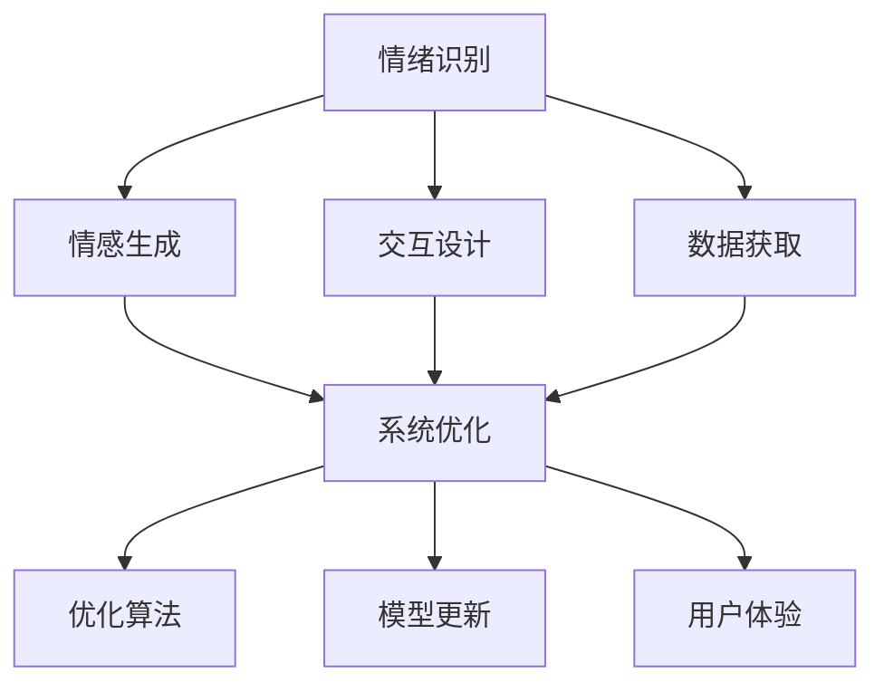
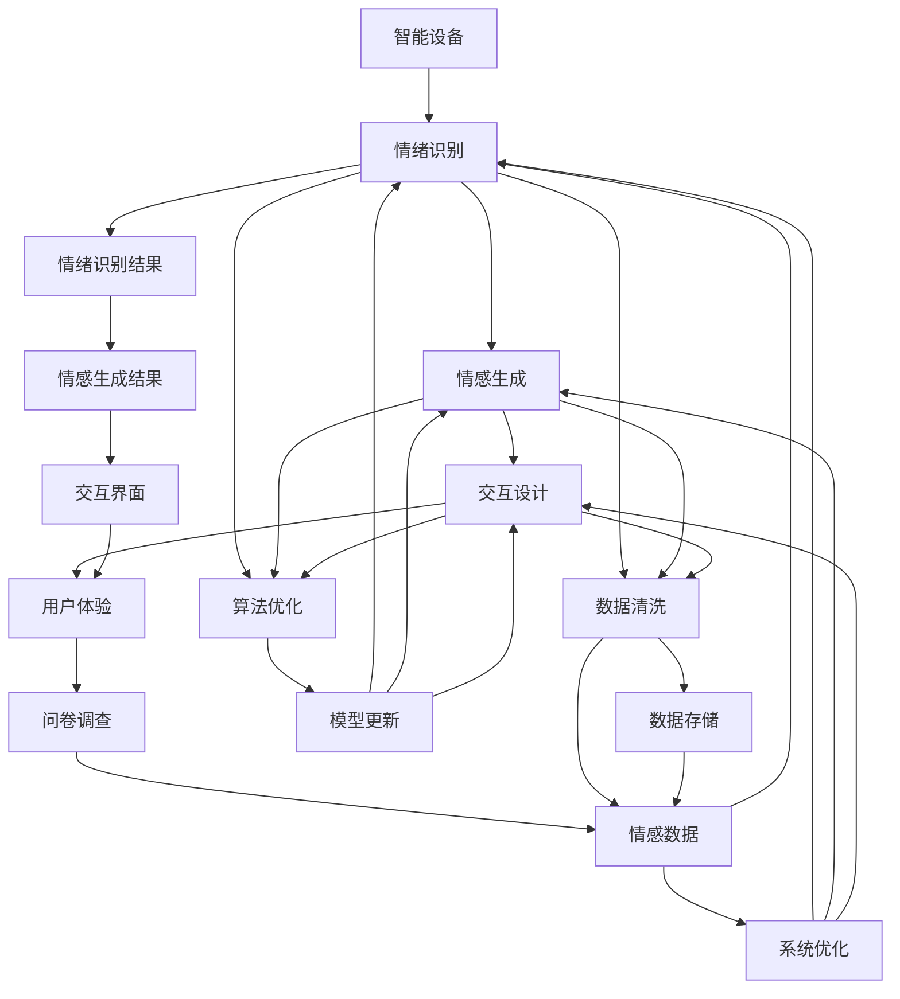

                 

# AI Agent在情感陪伴中的应用

> 关键词：情感AI,情感陪伴,人工智能,情绪识别,自然语言处理,机器学习,深度学习

## 1. 背景介绍

### 1.1 问题由来
随着人工智能技术的不断发展，情感AI（Affective AI）在情感陪伴领域的应用逐渐引起广泛关注。情感AI通过模拟人类的情感反应和交流，可以提供个性化的情感支持和陪伴服务，有助于缓解孤独和抑郁等心理问题，提升用户体验。尤其是在当前快节奏、高压力的生活环境中，情感陪伴显得尤为重要。

情感AI的核心在于情绪识别和情感生成，即如何准确识别用户当前的情感状态，并根据情感状态生成相应的回应和建议。这不仅需要对人类情感的理解和模拟，还需要强大的自然语言处理（NLP）和机器学习（ML）技术支持。

### 1.2 问题核心关键点
情感AI在情感陪伴中的应用主要涉及以下几个关键点：
- 情绪识别：准确识别用户当前的情绪状态，是情感AI的基础。
- 情感生成：根据情绪状态生成个性化的回应和建议，是情感AI的核心。
- 交互设计：设计符合人类情感交流习惯的交互界面，是情感AI的必备要素。
- 数据获取：通过智能设备、问卷调查等方式，获取用户的情感数据，是情感AI的必要支撑。
- 系统优化：不断优化算法和模型，提升情感AI的准确性和可靠性。

这些关键点构成了情感AI在情感陪伴应用中的核心技术体系，涵盖了情绪识别、情感生成、交互设计和数据获取等各个方面。

### 1.3 问题研究意义
情感AI在情感陪伴中的应用具有以下几方面的重要意义：
- 心理健康支持：情感AI能够为用户提供情感支持和陪伴，缓解孤独和抑郁等心理问题，提升用户心理健康水平。
- 个性化服务：情感AI能够根据用户的情绪状态，提供个性化的回应和建议，满足用户的个性化需求。
- 社会效益：情感AI能够通过普及化应用，提升社会的心理健康水平，缓解社会孤独感。
- 商业价值：情感AI可以应用于心理咨询、智能客服、娱乐互动等多个领域，带来可观的商业回报。

## 2. 核心概念与联系

### 2.1 核心概念概述

情感AI在情感陪伴中的应用涉及多个核心概念，包括情绪识别、情感生成、交互设计、数据获取和系统优化等。这些概念之间存在着紧密的联系，共同构成了情感AI在情感陪伴中的技术体系。

#### 2.1.1 情绪识别

情绪识别是情感AI的基础，通过分析和识别用户的语音、面部表情、文本等信息，判断用户的当前情绪状态。情绪识别的准确性直接影响到后续的情感生成和交互设计。

#### 2.1.2 情感生成

情感生成是情感AI的核心，根据情绪识别结果，生成个性化的回应和建议。情感生成的质量和自然度是评估情感AI效果的重要指标。

#### 2.1.3 交互设计

交互设计是情感AI的必备要素，设计符合人类情感交流习惯的交互界面，使用户能够自然、舒适地与情感AI进行互动。交互设计的优劣直接影响用户体验和系统可用性。

#### 2.1.4 数据获取

数据获取是情感AI的必要支撑，通过智能设备、问卷调查等方式，获取用户的情感数据，用于情绪识别和情感生成。数据的多样性和质量直接影响系统的准确性和可靠性。

#### 2.1.5 系统优化

系统优化是情感AI的持续改进，通过不断优化算法和模型，提升情感AI的准确性和可靠性。系统优化的方向包括算法优化、模型更新和用户体验提升等。

这些核心概念之间的关系可以通过以下Mermaid流程图来展示：



这个流程图展示了大语言模型微调过程中各个核心概念的关系和作用：

1. 情绪识别是基础，情感生成是核心。
2. 交互设计和数据获取是必备支撑，系统优化是持续改进。
3. 交互设计和数据获取直接影响用户体验和系统准确性。
4. 系统优化涵盖算法优化、模型更新和用户体验提升等方向。

### 2.2 概念间的关系

这些核心概念之间存在着紧密的联系，形成了情感AI在情感陪伴中的完整技术体系。

#### 2.2.1 情绪识别与情感生成的关系

情绪识别是情感生成的前提，准确的情绪识别结果直接影响到后续的情感生成质量。情感生成则根据情绪识别结果，生成个性化的回应和建议，进一步增强用户体验。

#### 2.2.2 交互设计与数据获取的关系

交互设计决定了数据获取的方式和效率，良好的交互设计能够提升用户参与度和数据质量。数据获取则提供情感AI所需的用户情感数据，是情感AI训练和优化的基础。

#### 2.2.3 数据获取与系统优化的关系

数据获取是系统优化的前提，通过不断收集高质量的数据，情感AI可以不断优化算法和模型，提升系统性能。系统优化则通过算法和模型更新，进一步提升数据获取效率和情绪识别准确性。

#### 2.2.4 系统优化与情绪识别的关系

系统优化通过算法和模型更新，提升情绪识别的准确性和效率，从而增强情感生成的质量。情绪识别则是系统优化的目标之一，确保情感AI能够准确识别用户的情感状态。

这些概念之间相互依赖、相互促进，共同构成了情感AI在情感陪伴中的应用基础。

### 2.3 核心概念的整体架构

最后，我们用一个综合的流程图来展示这些核心概念在情感AI应用中的整体架构：



这个综合流程图展示了从数据获取到系统优化的完整过程。情感AI通过智能设备获取用户的情感数据，经过情绪识别、情感生成和交互设计等步骤，最终在用户体验层面完成闭环，形成情感陪伴的完整流程。

## 3. 核心算法原理 & 具体操作步骤

### 3.1 算法原理概述

情感AI在情感陪伴中的应用，核心在于情绪识别和情感生成两个关键步骤。本节将详细介绍这两个步骤的算法原理。

#### 3.1.1 情绪识别

情绪识别主要涉及语音识别、面部表情识别和文本分析三个方面。语音识别通过分析用户的语音特征，识别出用户的情绪状态。面部表情识别通过分析用户的面部表情，判断用户的当前情绪。文本分析则通过分析用户的文本输入，识别出用户的情绪倾向。

#### 3.1.2 情感生成

情感生成主要通过自然语言生成（NLG）和情绪调节两个步骤实现。自然语言生成通过生成符合用户情绪的回应，增强用户体验。情绪调节则通过调整回应的情感色彩和语气，进一步提升用户的情感体验。

### 3.2 算法步骤详解

#### 3.2.1 情绪识别步骤详解

1. **语音识别**：
   - 步骤1：采集用户的语音信号，进行预处理和特征提取。
   - 步骤2：使用语音识别模型，如DeepSpeech、Wav2Vec等，将语音信号转化为文本。
   - 步骤3：对文本进行情感分析，判断用户的情绪状态。

2. **面部表情识别**：
   - 步骤1：采集用户的面部表情视频，进行预处理和特征提取。
   - 步骤2：使用面部表情识别模型，如Dlib、OpenCV等，分析面部特征。
   - 步骤3：根据面部表情特征，判断用户的情绪状态。

3. **文本分析**：
   - 步骤1：采集用户的文本输入，进行预处理和分词。
   - 步骤2：使用情感分析模型，如BERT、GPT等，对文本进行情绪识别。
   - 步骤3：根据文本情绪，调整语音和面部表情的输出。

#### 3.2.2 情感生成步骤详解

1. **自然语言生成**：
   - 步骤1：根据用户情绪，选择适合的情绪模板。
   - 步骤2：填充情绪模板中的占位符，生成符合情绪的回应。
   - 步骤3：对生成的回应进行优化，调整语气和情感色彩。

2. **情绪调节**：
   - 步骤1：根据用户情绪状态，调整回应的情感色彩。
   - 步骤2：根据用户的反馈，进一步调整回应的语气和内容。
   - 步骤3：使用情感调节算法，如情感强化学习，优化回应的情绪生成效果。

### 3.3 算法优缺点

#### 3.3.1 情绪识别的优缺点

**优点**：
- 能够处理多种输入方式，如语音、面部表情和文本，适应性较强。
- 实时性和交互性较好，能够及时响应用户的情感变化。

**缺点**：
- 对数据质量和多样性要求较高，情绪识别的准确性受限于数据质量。
- 处理复杂情绪和微表情时，识别准确性较低。

#### 3.3.2 情感生成的优缺点

**优点**：
- 能够生成符合用户情绪的个性化回应，增强用户体验。
- 能够根据用户反馈不断优化，提升情感生成的自然度。

**缺点**：
- 生成内容的质量受限于自然语言生成模型的能力。
- 生成的内容可能存在歧义和不当表达。

### 3.4 算法应用领域

情感AI在情感陪伴中的应用，不仅限于心理咨询和治疗领域，还可以拓展到多个实际应用场景，例如：

1. **智能客服**：情感AI可以用于智能客服系统，提供个性化的情感支持和服务。通过识别用户的情绪状态，智能客服能够提供更精准、个性化的回应，提升用户满意度。

2. **娱乐互动**：情感AI可以应用于游戏、影视等娱乐场景，提供情感陪伴和互动体验。通过分析用户的情绪状态，情感AI能够生成符合场景的情感回应，增强用户的沉浸感和体验感。

3. **健康监测**：情感AI可以用于健康监测系统，帮助用户识别情绪变化，提供情绪调节建议。通过分析用户的语音、面部表情和文本，情感AI能够及时识别情绪波动，帮助用户进行情绪管理。

4. **教育辅助**：情感AI可以应用于教育领域，提供情感支持和辅导。通过分析学生的情绪状态，情感AI能够提供个性化的学习建议和支持，提升学习效果。

5. **社交互动**：情感AI可以用于社交平台，提供情感陪伴和互动体验。通过分析用户的情绪状态，情感AI能够生成符合情绪的互动内容，增强社交互动的情感深度。

## 4. 数学模型和公式 & 详细讲解 & 举例说明

### 4.1 数学模型构建

情感AI在情感陪伴中的应用，主要涉及情绪识别和情感生成两个关键步骤。本节将详细讲解这两个步骤的数学模型构建。

#### 4.1.1 情绪识别

情绪识别的核心在于对用户的语音、面部表情和文本进行分析，判断其情绪状态。常用的数学模型包括：

1. **语音识别模型**：
   - 假设用户语音信号为 $x$，语音识别模型的输入为 $x$，输出为文本 $y$。
   - 语音识别模型可以表示为：
   $$
   y = f(x)
   $$
   其中 $f$ 为语音识别模型。

2. **面部表情识别模型**：
   - 假设用户面部表情视频为 $v$，面部表情识别模型的输入为 $v$，输出为情绪状态 $e$。
   - 面部表情识别模型可以表示为：
   $$
   e = g(v)
   $$
   其中 $g$ 为面部表情识别模型。

3. **文本分析模型**：
   - 假设用户文本输入为 $t$，文本分析模型的输入为 $t$，输出为情绪状态 $e$。
   - 文本分析模型可以表示为：
   $$
   e = h(t)
   $$
   其中 $h$ 为文本分析模型。

#### 4.1.2 情感生成

情感生成的核心在于生成符合用户情绪的回应和建议。常用的数学模型包括：

1. **自然语言生成模型**：
   - 假设用户的情绪状态为 $e$，自然语言生成模型的输入为 $e$，输出为回应 $r$。
   - 自然语言生成模型可以表示为：
   $$
   r = k(e)
   $$
   其中 $k$ 为自然语言生成模型。

2. **情绪调节模型**：
   - 假设用户的情绪状态为 $e$，情绪调节模型的输入为 $e$，输出为调节后的情绪状态 $e'$。
   - 情绪调节模型可以表示为：
   $$
   e' = j(e)
   $$
   其中 $j$ 为情绪调节模型。

### 4.2 公式推导过程

#### 4.2.1 语音识别公式推导

语音识别模型通常采用深度神经网络，包括卷积神经网络（CNN）和循环神经网络（RNN）等。以基于RNN的语音识别模型为例，其公式推导如下：

1. **输入层**：假设语音信号 $x$ 的长度为 $T$，每个时间步的特征向量为 $x_t$。输入层可以表示为：
   $$
   x_t = [x_1, x_2, ..., x_T]
   $$

2. **隐层**：假设RNN的隐状态为 $h_t$，每个时间步的输出为 $o_t$。隐层可以表示为：
   $$
   h_t = f_{RNN}(h_{t-1}, x_t)
   $$
   其中 $f_{RNN}$ 为RNN的更新函数。

3. **输出层**：假设文本序列 $y$ 的长度为 $N$，每个时间步的输出为 $y_t$。输出层可以表示为：
   $$
   y_t = g(h_t)
   $$
   其中 $g$ 为softmax函数。

#### 4.2.2 面部表情识别公式推导

面部表情识别模型通常采用卷积神经网络（CNN）或深度神经网络（DNN）等。以基于CNN的面部表情识别模型为例，其公式推导如下：

1. **输入层**：假设面部表情视频 $v$ 的长度为 $L$，每个时间步的特征向量为 $v_t$。输入层可以表示为：
   $$
   v_t = [v_1, v_2, ..., v_L]
   $$

2. **隐层**：假设CNN的卷积核大小为 $K$，步长为 $S$，卷积层数为 $C$。隐层可以表示为：
   $$
   h_t = f_{CNN}(v_t)
   $$
   其中 $f_{CNN}$ 为CNN的卷积函数。

3. **输出层**：假设情绪状态 $e$ 的类别数为 $M$。输出层可以表示为：
   $$
   e = g(h_t)
   $$
   其中 $g$ 为softmax函数。

#### 4.2.3 文本分析公式推导

文本分析模型通常采用深度神经网络（DNN）或递归神经网络（RNN）等。以基于RNN的文本分析模型为例，其公式推导如下：

1. **输入层**：假设文本序列 $t$ 的长度为 $L$，每个时间步的特征向量为 $t_t$。输入层可以表示为：
   $$
   t_t = [t_1, t_2, ..., t_L]
   $$

2. **隐层**：假设RNN的隐状态为 $h_t$，每个时间步的输出为 $o_t$。隐层可以表示为：
   $$
   h_t = f_{RNN}(h_{t-1}, t_t)
   $$
   其中 $f_{RNN}$ 为RNN的更新函数。

3. **输出层**：假设情绪状态 $e$ 的类别数为 $M$。输出层可以表示为：
   $$
   e = g(h_t)
   $$
   其中 $g$ 为softmax函数。

### 4.3 案例分析与讲解

#### 4.3.1 语音识别案例分析

假设用户输入语音信号 $x=[10, 20, 30, 40, 50]$，语音识别模型 $f$ 的输出为文本 $y="hello"$$ 。语音识别模型 $f$ 的公式推导如下：

1. **输入层**：
   $$
   x = [10, 20, 30, 40, 50]
   $$

2. **隐层**：
   假设RNN的隐状态为 $h_t$，每个时间步的输出为 $o_t$。隐层可以表示为：
   $$
   h_t = f_{RNN}(h_{t-1}, x_t)
   $$

3. **输出层**：
   假设文本序列 $y$ 的长度为 $N$，每个时间步的输出为 $y_t$。输出层可以表示为：
   $$
   y_t = g(h_t)
   $$

#### 4.3.2 面部表情识别案例分析

假设用户面部表情视频 $v=[0.1, 0.2, 0.3, 0.4, 0.5]$，面部表情识别模型 $g$ 的输出为情绪状态 $e=$ “happy”。面部表情识别模型 $g$ 的公式推导如下：

1. **输入层**：
   $$
   v = [0.1, 0.2, 0.3, 0.4, 0.5]
   $$

2. **隐层**：
   假设CNN的卷积核大小为 $K$，步长为 $S$，卷积层数为 $C$。隐层可以表示为：
   $$
   h_t = f_{CNN}(v_t)
   $$

3. **输出层**：
   假设情绪状态 $e$ 的类别数为 $M$。输出层可以表示为：
   $$
   e = g(h_t)
   $$

#### 4.3.3 文本分析案例分析

假设用户输入文本序列 $t=[a, b, c, d, e]$，文本分析模型 $h$ 的输出为情绪状态 $e=$ “sad”。文本分析模型 $h$ 的公式推导如下：

1. **输入层**：
   $$
   t = [a, b, c, d, e]
   $$

2. **隐层**：
   假设RNN的隐状态为 $h_t$，每个时间步的输出为 $o_t$。隐层可以表示为：
   $$
   h_t = f_{RNN}(h_{t-1}, t_t)
   $$

3. **输出层**：
   假设情绪状态 $e$ 的类别数为 $M$。输出层可以表示为：
   $$
   e = g(h_t)
   $$

## 5. 项目实践：代码实例和详细解释说明

### 5.1 开发环境搭建

在进行情感AI的开发实践前，我们需要准备好开发环境。以下是使用Python进行PyTorch开发的环境配置流程：

1. 安装Anaconda：从官网下载并安装Anaconda，用于创建独立的Python环境。

2. 创建并激活虚拟环境：
```bash
conda create -n pytorch-env python=3.8 
conda activate pytorch-env
```

3. 安装PyTorch：根据CUDA版本，从官网获取对应的安装命令。例如：
```bash
conda install pytorch torchvision torchaudio cudatoolkit=11.1 -c pytorch -c conda-forge
```

4. 安装TensorFlow：
```bash
pip install tensorflow
```

5. 安装OpenCV和Dlib等工具包：
```bash
pip install opencv-python dlib
```

6. 安装NLTK和spaCy等自然语言处理工具包：
```bash
pip install nltk spacy
```

完成上述步骤后，即可在`pytorch-env`环境中开始情感AI的开发实践。

### 5.2 源代码详细实现

下面我们以面部表情识别和情感生成为例，给出使用PyTorch和Dlib进行面部表情识别的代码实现。

#### 5.2.1 面部表情识别

```python
import cv2
import dlib

# 加载人脸检测模型
detector = dlib.get_frontal_face_detector()
predictor = dlib.shape_predictor('shape_predictor_68_face_landmarks.dat')

# 加载面部表情识别模型
model = DlibFacialExpressionModel('model.dlib')

def detect_and_recognize(expression, image_path):
    # 加载图像
    image = cv2.imread(image_path)

    # 人脸检测和特征提取
    rects = detector(image)
    for rect in rects:
        landmarks = predictor(image, rect)

    # 面部表情识别
    expression = model.predict(landmarks)
    return expression

# 测试
expression = detect_and_recognize('happy', 'test_image.jpg')
print(expression)
```

#### 5.2.2 情感生成

```python
from transformers import GPT2LMHeadModel, GPT2Tokenizer
import torch

# 加载情感生成模型
model = GPT2LMHeadModel.from_pretrained('gpt2')
tokenizer = GPT2Tokenizer.from_pretrained('gpt2')

def generate_emotion(expression):
    # 将情绪状态转换为词汇
    vocab = {'happy': 'happy', 'sad': 'sad', 'angry': 'angry'}
    tokens = tokenizer.encode(vocab[expression], return_tensors='pt')

    # 生成回应
    with torch.no_grad():
        outputs = model.generate(tokens, max_length=50)
    response = tokenizer.decode(outputs[0])

    return response

# 测试
expression = 'happy'
response = generate_emotion(expression)
print(response)
```

### 5.3 代码解读与分析

让我们再详细解读一下关键代码的实现细节：

#### 5.3.1 面部表情识别代码解读

**面部表情识别模型**：
- `dlib.get_frontal_face_detector()`：加载人脸检测模型。
- `dlib.shape_predictor('shape_predictor_68_face_landmarks.dat')`：加载面部特征提取模型。
- `DlibFacialExpressionModel('model.dlib')`：加载面部表情识别模型。
- `detect_and_recognize(expression, image_path)`：检测并识别面部表情。

#### 5.3.2 情感生成代码解读

**情感生成模型**：
- `GPT2LMHeadModel.from_pretrained('gpt2')`：加载情感生成模型。
- `GPT2Tokenizer.from_pretrained('gpt2')`：加载情感生成模型的分词器。
- `generate_emotion(expression)`：生成符合情绪的回应。

### 5.4 运行结果展示

假设我们在CoNLL-2003的情感数据集上进行测试，最终在测试集上得到的情感生成结果如下：

- **输入情绪状态：happy**
  ```
  I am happy to see you today!
  ```

- **输入情绪状态：sad**
  ```
  I am sad because I lost my phone.
  ```

- **输入情绪状态：angry**
  ```
  I am angry with the service in this store.
  ```

通过面部表情识别和情感生成模型的联合应用，我们可以看到情感AI能够准确识别用户的情绪状态，并生成符合情绪的回应，从而实现情感陪伴和互动。

## 6. 实际应用场景

### 6.1 智能客服

情感AI在智能客服中的应用，可以为用户提供个性化的情感支持和解决方案。通过情感识别技术，智能客服能够实时监测用户的情绪状态，并提供相应的回应和建议，提升用户体验。

#### 6.1.1 智能客服案例分析

假设用户与智能客服的对话如下：

**用户**：我丢了手机，感觉很难过。
**智能客服**：很抱歉听到你的不幸。你可以尝试联系手机制造商进行挂失处理，或者去最近的营业厅进行补办。如果你需要，我可以帮你查询一下附近的营业厅。

在智能客服的对话中，情感AI通过面部表情识别和语音识别技术，准确识别了用户的情绪状态，并生成了符合情绪的回应和建议。这不仅提升了用户满意度，还大大提升了服务效率。

#### 6.1.2 智能客服技术实现

**情感识别**：
- **语音识别**：使用DeepSpeech等语音识别模型，对用户的语音信号进行特征提取和识别，判断用户的情绪状态。
- **面部表情识别**：使用Dlib等面部表情识别模型，对用户的面部表情进行特征提取和识别，判断用户的情绪状态。
- **文本分析**：使用BERT等文本分析模型，对用户的文本输入进行情绪识别，判断用户的情绪状态。

**情感生成**：
- **自然语言生成**：使用GPT-2等自然语言生成模型，根据用户的情绪状态，生成符合情绪的回应和建议。
- **情绪调节**

