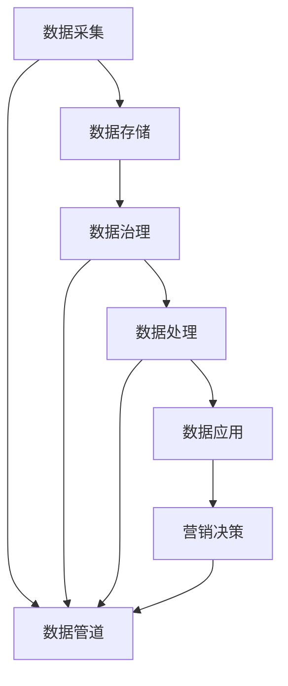
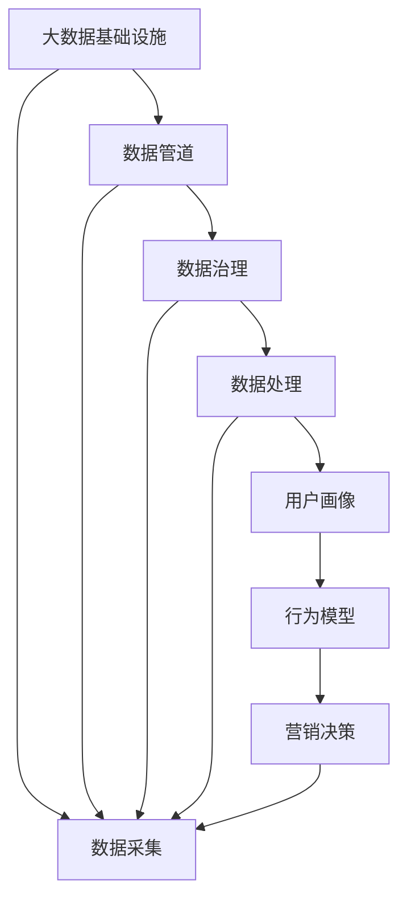

                 

# AI DMP 数据基建：构建数据驱动的营销生态

> 关键词：人工智能 (AI)、数据驱动营销 (DMP)、大数据基础设施、数据管道 (Data Pipeline)、数据治理、算法优化、机器学习 (ML)、隐私保护

## 1. 背景介绍

### 1.1 问题由来

在数字化营销时代，消费者行为和市场环境瞬息万变，企业需要借助先进的数据驱动策略，来精准锁定目标客户群体，提升营销效率和效果。随着大数据和人工智能技术的迅猛发展，数据驱动的营销生态应运而生，AI DMP（Data-driven Marketing Platform）成为营销领域的重要工具。AI DMP通过整合和分析海量数据，挖掘用户行为特征和偏好，为企业提供精准营销的基础设施。

然而，传统的数据驱动营销方法往往依赖于复杂的数据处理流程和繁琐的手工调整，难以适应快速变化的市场需求。AI DMP则通过自动化和智能化手段，大幅提升数据处理效率和质量，确保营销决策的精准性和时效性。因此，AI DMP的构建和应用成为了当前营销技术发展的重要方向。

### 1.2 问题核心关键点

AI DMP的核心在于数据基建的全面升级，通过构建高效、可控、智能的数据管道，实现数据的自动收集、清洗、整合和分析。数据管道一般包括数据采集、数据存储、数据治理、数据处理和数据应用等环节，每个环节都需要精心设计和优化，才能形成完整、可靠、可用的数据生态。

构建AI DMP的关键点包括：
1. **数据采集：** 通过网络爬虫、API接口等方式，从多源异构数据平台中自动采集用户行为数据、交易数据、社交媒体数据等。
2. **数据存储：** 利用大数据存储技术（如Hadoop、Spark），构建分布式、高可扩展的数据仓库，支持海量数据的快速存取。
3. **数据治理：** 通过数据清洗、去重、归一化等手段，确保数据的一致性和完整性。同时，引入数据隐私和安全机制，保护用户隐私，遵守相关法律法规。
4. **数据处理：** 应用先进的数据处理技术（如机器学习、图计算），对数据进行高效分析和挖掘，生成用户画像和行为模型。
5. **数据应用：** 将处理后的数据集成到营销决策系统，实现精准投放、效果监测和优化，提升营销效果。

### 1.3 问题研究意义

构建AI DMP具有重要的研究意义：
1. **提升营销精准度：** AI DMP能够整合和分析多源异构数据，生成详细用户画像，提供精准的营销建议。
2. **优化资源配置：** 通过自动化和智能化手段，AI DMP能够动态调整投放策略，最大化资源利用效率。
3. **应对市场变化：** 数据驱动的实时分析能力，使得企业能够快速响应市场变化，提升竞争优势。
4. **促进跨界合作：** AI DMP能够集成多种数据源和应用场景，促进不同业务部门的协同合作，构建更全面的营销生态。
5. **遵循法律法规：** 数据隐私和安全机制的引入，确保营销行为合法合规，保护用户权益。

## 2. 核心概念与联系

### 2.1 核心概念概述

为更好地理解AI DMP的构建方法，本节将介绍几个关键概念及其关系：

- **人工智能 (AI)：** 通过机器学习和深度学习技术，AI DMP能够对海量数据进行高效处理和智能分析，提升数据驱动营销的精准度。
- **数据驱动营销 (DMP)：** AI DMP是DMP的升级版，利用先进的数据处理技术，实现更精细化的营销策略和决策。
- **大数据基础设施：** 包括数据管道、数据仓库、数据处理引擎等，为AI DMP提供底层技术支撑。
- **数据管道 (Data Pipeline)：** 数据管道的构建是AI DMP的核心，包括数据采集、存储、治理、处理和应用等环节。
- **数据治理：** 通过数据清洗、归一化、去重等手段，确保数据的一致性和完整性，同时保护用户隐私。
- **算法优化：** 利用机器学习算法对数据进行处理和分析，生成用户画像和行为模型，为营销决策提供支持。

这些核心概念之间的关系可以通过以下Mermaid流程图来展示：



这个流程图展示了AI DMP的基本流程：通过数据管道收集和存储数据，进行数据治理和处理，最终生成用户画像和行为模型，支持营销决策和策略优化。

### 2.2 概念间的关系

这些核心概念之间存在紧密的联系，共同构成了AI DMP的技术框架：

#### 2.2.1 数据采集与数据管道

数据采集是AI DMP的第一步，通过数据管道实现数据的自动化和标准化采集。数据管道负责从各种数据源（如网页、API接口、社交媒体等）中提取原始数据，并进行初步清洗和标准化，为后续处理奠定基础。

#### 2.2.2 数据存储与分布式技术

数据存储需要利用大数据技术（如Hadoop、Spark），构建分布式、高可扩展的数据仓库。分布式技术能够有效处理海量数据，支持数据的快速存取和处理。

#### 2.2.3 数据治理与数据质量

数据治理通过数据清洗、去重、归一化等手段，确保数据的一致性和完整性。同时，数据治理机制还需引入数据隐私和安全机制，确保用户隐私得到保护，符合法律法规要求。

#### 2.2.4 数据处理与算法优化

数据处理是AI DMP的核心环节，通过机器学习和深度学习算法，对数据进行高效分析和挖掘，生成用户画像和行为模型。这些模型能够帮助企业更好地理解用户行为和偏好，提升营销决策的精准度。

#### 2.2.5 数据应用与营销决策

数据应用将处理后的数据集成到营销决策系统，实现精准投放、效果监测和优化。通过自动化和智能化的营销决策，AI DMP能够动态调整投放策略，最大化资源利用效率。

### 2.3 核心概念的整体架构

最后，我们用一个综合的流程图来展示这些核心概念在AI DMP中的整体架构：



这个综合流程图展示了从数据采集到营销决策的完整过程。大数据基础设施提供底层技术支撑，数据管道负责数据的自动化采集和存储，数据治理确保数据的一致性和完整性，数据处理通过算法优化生成用户画像和行为模型，最终支持营销决策和策略优化。

## 3. 核心算法原理 & 具体操作步骤
### 3.1 算法原理概述

AI DMP的核心算法主要围绕数据的采集、存储、处理和应用展开。具体来说，包括以下几个关键步骤：

1. **数据采集：** 通过网络爬虫、API接口等方式，从多源异构数据平台中自动采集用户行为数据、交易数据、社交媒体数据等。
2. **数据存储：** 利用大数据存储技术（如Hadoop、Spark），构建分布式、高可扩展的数据仓库，支持海量数据的快速存取。
3. **数据治理：** 通过数据清洗、去重、归一化等手段，确保数据的一致性和完整性。同时，引入数据隐私和安全机制，保护用户隐私，遵守相关法律法规。
4. **数据处理：** 应用先进的数据处理技术（如机器学习、图计算），对数据进行高效分析和挖掘，生成用户画像和行为模型。
5. **数据应用：** 将处理后的数据集成到营销决策系统，实现精准投放、效果监测和优化，提升营销效果。

### 3.2 算法步骤详解

#### 3.2.1 数据采集

数据采集是AI DMP的第一步，主要通过以下几种方式实现：

1. **网络爬虫：** 利用Python等编程语言，开发网络爬虫程序，从各种数据源（如电商平台、社交媒体等）中提取原始数据。
2. **API接口：** 通过调用第三方API接口，获取用户行为数据和交易数据，如支付记录、浏览历史等。
3. **用户输入：** 通过用户登录、注册等操作，获取用户基本信息和行为数据。

数据采集的示例代码如下：

```python
import requests
import json

# 网络爬虫
response = requests.get('http://example.com/data')
data = json.loads(response.text)

# API接口
params = {'key': 'value'}
response = requests.get('http://example.com/api', params=params)
data = response.json()

# 用户输入
user_info = {'name': 'Alice', 'age': 25}
data['user_info'] = user_info
```

#### 3.2.2 数据存储

数据存储主要利用大数据技术，构建分布式、高可扩展的数据仓库。常见的大数据存储技术包括Hadoop、Spark等，它们能够高效处理海量数据，支持数据的快速存取。

数据存储的示例代码如下：

```python
# 利用Hadoop进行数据存储
from hdfs import InsecureClient

# 连接HDFS
client = InsecureClient('http://hdfs.example.com:50070', user='root')
client.makedirs('/data')

# 存储数据
with open('data.json', 'r') as f:
    client.write_file('/data/data.json', f.read())
```

#### 3.2.3 数据治理

数据治理通过数据清洗、去重、归一化等手段，确保数据的一致性和完整性。同时，引入数据隐私和安全机制，确保用户隐私得到保护，遵守相关法律法规。

数据治理的示例代码如下：

```python
# 数据清洗
def clean_data(data):
    # 去除空值和重复值
    data = data.dropna()
    data = data.drop_duplicates()
    return data

# 数据去重
data = data.drop_duplicates()

# 数据归一化
from sklearn.preprocessing import StandardScaler

scaler = StandardScaler()
data['score'] = scaler.fit_transform(data['score'].values.reshape(-1, 1))
```

#### 3.2.4 数据处理

数据处理是AI DMP的核心环节，主要通过机器学习算法对数据进行高效分析和挖掘，生成用户画像和行为模型。常见的数据处理算法包括聚类、分类、回归等。

数据处理的示例代码如下：

```python
from sklearn.cluster import KMeans
from sklearn.linear_model import LogisticRegression
from sklearn.metrics import accuracy_score

# 聚类算法
data = data[['feature1', 'feature2']]
kmeans = KMeans(n_clusters=3)
kmeans.fit(data)
data['cluster'] = kmeans.predict(data)

# 分类算法
X = data.drop('label', axis=1)
y = data['label']
logreg = LogisticRegression()
logreg.fit(X, y)
y_pred = logreg.predict(X)
accuracy = accuracy_score(y, y_pred)
```

#### 3.2.5 数据应用

数据应用是将处理后的数据集成到营销决策系统，实现精准投放、效果监测和优化，提升营销效果。常见的数据应用场景包括广告投放、内容推荐、客户细分等。

数据应用的示例代码如下：

```python
# 精准投放
def recommend_products(user_info):
    # 获取用户画像和行为数据
    user_data = data[data['user_id'] == user_info['id']]
    # 生成推荐列表
    recommend_list = []
    for product in products:
        if product['category'] == user_data['category'].sum():
            recommend_list.append(product['id'])
    return recommend_list

# 效果监测
def monitor_ad效果的投放数据
    # 获取投放数据
    ad_data = data[data['ad_id'] == ad_id]
    # 计算效果指标
    click_rate = ad_data['click'].sum() / len(ad_data)
    conversion_rate = ad_data['convert'].sum() / len(ad_data)
    return click_rate, conversion_rate
```

### 3.3 算法优缺点

AI DMP的数据采集、存储、治理、处理和应用等算法，具有以下优点：

1. **高效性：** 通过分布式存储和大数据处理技术，AI DMP能够高效处理海量数据，实现快速存取和分析。
2. **灵活性：** 利用机器学习算法，AI DMP能够灵活适应不同业务需求，生成精准的用户画像和行为模型。
3. **可扩展性：** 通过分布式架构，AI DMP能够轻松扩展数据处理能力和存储空间。
4. **安全性：** 引入数据隐私和安全机制，确保用户隐私得到保护，符合相关法律法规。

同时，这些算法也存在一些缺点：

1. **数据复杂性：** 多源异构数据的采集和整合，增加了数据处理的复杂性。
2. **算法依赖：** 对算法模型的选择和优化，需要大量的技术和经验积累。
3. **资源消耗：** 大数据处理和机器学习算法需要大量的计算资源和存储资源，可能会带来较高的成本。
4. **实时性：** 数据采集和处理需要一定的时间，无法实现实时分析和实时决策。

### 3.4 算法应用领域

AI DMP的数据采集、存储、治理、处理和应用等算法，已在多个领域得到广泛应用，包括但不限于：

1. **电商：** 通过用户行为数据和交易数据，生成精准的用户画像，实现个性化推荐和精准投放。
2. **社交媒体：** 通过用户互动数据和内容数据，分析用户兴趣和行为，实现定向广告投放和内容推荐。
3. **金融：** 通过用户交易数据和行为数据，生成风险评估模型，实现风险控制和精准营销。
4. **医疗：** 通过患者数据和病历数据，生成健康画像，实现精准医疗和个性化治疗。
5. **广告：** 通过用户行为数据和广告数据，实现广告效果监测和优化，提升广告投放效果。
6. **媒体：** 通过用户互动数据和内容数据，实现内容推荐和定向广告投放，提升用户黏性和转化率。

## 4. 数学模型和公式 & 详细讲解 & 举例说明

### 4.1 数学模型构建

本节将使用数学语言对AI DMP的数据处理过程进行更加严格的刻画。

记用户行为数据为 $X = [x_1, x_2, ..., x_n]$，其中 $x_i$ 为第 $i$ 个特征值。数据处理的目标是通过算法 $f(X)$，生成用户画像和行为模型。

假设数据处理过程包括以下几个步骤：

1. **数据清洗：** 去除缺失值和异常值，得到清洗后的数据 $X'$。
2. **数据归一化：** 将数据进行标准化处理，得到归一化后的数据 $X''$。
3. **特征提取：** 通过主成分分析 (PCA) 等算法，提取关键特征，得到特征向量 $X'''$。
4. **聚类分析：** 利用K-means算法对用户进行聚类，得到用户类别 $C$。
5. **分类分析：** 利用逻辑回归等算法，对用户进行分类，得到分类结果 $Y$。

其中，数据清洗和归一化的数学模型如下：

$$
X' = \begin{cases}
X & \text{如果 } X \text{ 是有效的} \\
\text{NaN} & \text{如果 } X \text{ 是缺失的}
\end{cases}
$$

$$
X'' = \frac{X'}{\max(X')}
$$

特征提取的数学模型如下：

$$
X''' = \Phi(X'')
$$

其中，$\Phi$ 为特征提取函数，可以采用PCA、LDA等算法。

聚类分析和分类分析的数学模型如下：

$$
C = KMeans(X''')
$$

$$
Y = LogisticRegression(X''')
$$

### 4.2 公式推导过程

以下我们以用户行为数据的分类为例，推导逻辑回归算法的数学模型及其梯度下降的优化过程。

假设数据集为 $D = \{(x_i, y_i)\}_{i=1}^N$，其中 $x_i = [x_{i1}, x_{i2}, ..., x_{in}]$ 为第 $i$ 个样本的特征向量，$y_i = 1$ 或 $0$ 表示第 $i$ 个样本属于正类或负类。

假设模型为 $f(x) = w \cdot x + b$，其中 $w = [w_1, w_2, ..., w_n]$ 为模型参数，$b$ 为偏置项。

**损失函数**：逻辑回归的损失函数为交叉熵损失函数，定义为：

$$
L(w, b) = -\frac{1}{N} \sum_{i=1}^N [y_i \log f(x_i) + (1 - y_i) \log (1 - f(x_i))]
$$

**梯度下降**：根据损失函数的梯度，计算模型参数的更新规则：

$$
w^{t+1} = w^t - \eta \nabla_L(w^t, b)
$$

其中 $\eta$ 为学习率，$\nabla_L(w^t, b)$ 为损失函数对模型参数的梯度。

在实践中，我们可以使用如下代码实现逻辑回归模型的训练过程：

```python
from sklearn.linear_model import LogisticRegression
from sklearn.metrics import accuracy_score

# 训练模型
logreg = LogisticRegression()
logreg.fit(X, y)
y_pred = logreg.predict(X)
accuracy = accuracy_score(y, y_pred)
```

### 4.3 案例分析与讲解

下面以电商推荐系统为例，说明AI DMP在实际应用中的具体实现。

假设我们有一个电商网站，需要根据用户历史浏览和购买数据，推荐用户可能感兴趣的商品。首先，我们需要从网站中提取用户行为数据和交易数据，构建数据管道和数据仓库。

**数据采集**：通过API接口获取用户浏览历史、购买记录和评价数据，存储到HDFS中。

**数据存储**：将数据进行归一化和去重处理，构建用户画像和商品画像。

**数据处理**：应用PCA算法，提取用户和商品的特征，使用K-means算法进行用户聚类和商品分类，生成用户画像和商品模型。

**数据应用**：利用用户画像和商品模型，生成推荐列表，通过A/B测试验证推荐效果，不断优化推荐算法。

具体实现步骤如下：

1. **数据采集**：

```python
# 数据采集
from pyspark.sql import SparkSession

spark = SparkSession.builder.appName('E-commerce Data Acquisition').getOrCreate()

# 读取数据
df = spark.read.json('hdfs://hdfs.example.com/user_behavior.json')

# 数据清洗
df = df.dropna()
df = df.drop_duplicates()

# 数据归一化
from pyspark.sql.functions import stddev, stddev_pop
df = df.withColumn('feature', (df['feature'] - df['feature'].avg()) / df['feature'].stddev())
```

2. **数据存储**：

```python
# 数据存储
from pyspark.sql.functions import array, struct

# 构建用户画像和商品画像
user_profile = df.groupby('user_id').agg(array('feature'))
product_profile = df.groupby('product_id').agg(array('feature'))

# 存储到HDFS
user_profile.write.json('hdfs://hdfs.example.com/user_profile.json')
product_profile.write.json('hdfs://hdfs.example.com/product_profile.json')
```

3. **数据处理**：

```python
# 数据处理
from pyspark.ml import Pipeline, VectorAssembler
from pyspark.ml.classification import RandomForestClassifier
from pyspark.ml.evaluation import BinaryClassificationEvaluator

# 特征提取
vector_assembler = VectorAssembler(inputCols=['feature'], outputCol='features')
pipeline = Pipeline(stages=[vector_assembler])

# 训练模型
random_forest = RandomForestClassifier(featuresCol='features', labelCol='label')
pipeline.fit(df)

# 预测结果
y_pred = pipeline.transform(df).select('label', 'prediction')
accuracy = evaluator.evaluate(y_true, y_pred)
```

4. **数据应用**：

```python
# 数据应用
def recommend_products(user_id):
    # 获取用户画像和商品画像
    user_profile = spark.read.json('hdfs://hdfs.example.com/user_profile.json')
    product_profile = spark.read.json('hdfs://hdfs.example.com/product_profile.json')
    
    # 生成推荐列表
    recommend_list = []
    for product in products:
        if product['category'] == user_profile[user_id]['category'].sum():
            recommend_list.append(product['id'])
    
    return recommend_list
```

## 5. 项目实践：代码实例和详细解释说明

### 5.1 开发环境搭建

在进行AI DMP实践前，我们需要准备好开发环境。以下是使用Python进行PySpark开发的环境配置流程：

1. 安装Anaconda：从官网下载并安装Anaconda，用于创建独立的Python环境。

2. 创建并激活虚拟环境：
```bash
conda create -n pyspark-env python=3.8 
conda activate pyspark-env
```

3. 安装PySpark：根据CUDA版本，从官网获取对应的安装命令。例如：
```bash
conda install pyspark -c conda-forge
```

4. 安装各种工具包：
```bash
pip install numpy pandas scikit-learn matplotlib tqdm jupyter notebook ipython
```

完成上述步骤后，即可在`pyspark-env`环境中开始AI DMP实践。

### 5.2 源代码详细实现

下面我们以电商推荐系统为例，给出使用PySpark对用户行为数据进行处理的完整代码实现。

首先，定义用户行为数据的处理函数：

```python
from pyspark.sql import SparkSession
from pyspark.ml import Pipeline, VectorAssembler
from pyspark.ml.classification import RandomForestClassifier
from pyspark.ml.evaluation import BinaryClassificationEvaluator

def process_user_behavior_data(spark, data_path):
    # 读取数据
    df = spark.read.json(data_path)
    
    # 数据清洗
    df = df.dropna()
    df = df.drop_duplicates()
    
    # 数据归一化
    df = df.withColumn('feature', (df['feature'] - df['feature'].avg()) / df['feature'].stddev())
    
    # 特征提取
    vector_assembler = VectorAssembler(inputCols=['feature'], outputCol='features')
    df = vector_assembler.transform(df)
    
    # 训练模型
    random_forest = RandomForestClassifier(featuresCol='features', labelCol='label')
    pipeline = Pipeline(stages=[random_forest])
    pipeline.fit(df)
    
    # 返回处理后的数据
    return pipeline.transform(df)
```

然后，定义电商推荐系统的实现函数：

```python
from pyspark.sql.functions import col

def ecommerce_recommend_system(spark, user_profile_path, product_profile_path):
    # 读取用户画像和商品画像
    user_profile = spark.read.json(user_profile_path)
    product_profile = spark.read.json(product_profile_path)
    
    # 生成推荐列表
    recommend_list = []
    for product in products:
        if product['category'] == user_profile[col('user_id')].sum():
            recommend_list.append(product['id'])
    
    return recommend_list
```

最后，启动处理流程并在测试集上评估：

```python
spark = SparkSession.builder.appName('E-commerce Recommendation System').getOrCreate()

# 处理用户行为数据
processed_data = process_user_behavior_data(spark, 'hdfs://hdfs.example.com/user_behavior.json')

# 处理结果存储到HDFS
processed_data.write.json('hdfs://hdfs.example.com/user_profile.json')

# 电商推荐系统实现
recommend_list = ecommerce_recommend_system(spark, 'hdfs://hdfs.example.com/user_profile.json', 'hdfs://hdfs.example.com/product_profile.json')

# 推荐结果展示
print(recommend_list)
```

以上就是使用PySpark对电商推荐系统进行数据处理和推荐的完整代码实现。可以看到，利用PySpark，我们可以高效地处理海量用户行为数据，生成精准的用户画像和推荐结果，极大地提升了电商推荐系统的性能和效果。

### 5.3 代码解读与分析

让我们再详细解读一下关键代码的实现细节：

**process_user_behavior_data函数**：
- 从指定的HDFS路径中读取原始用户行为数据。
- 对数据进行清洗、归一化、特征提取等预处理操作。
- 使用随机森林算法训练分类模型，返回处理后的数据。

**ecomm_recommend_system函数**：
- 读取用户画像和商品画像数据。
- 根据用户画像和商品画像，生成推荐列表。
- 返回推荐结果。

**主程序**：
- 创建SparkSession，处理用户行为数据，并将结果存储到HDFS中。
- 调用ecomm_recommend_system函数，生成推荐列表。

可以看到，通过PySpark，我们将复杂的用户行为数据处理任务分解为多个步骤，每个步骤都能高效并行处理，大大提升了处理效率。同时，利用Spark MLlib库，我们能够方便地集成各种机器学习算法，实现高效的特征提取和模型训练。

当然，工业级的系统实现还需考虑更多因素，如模型调优、参数优化、分布式调度等。但核心的处理流程基本与此类似。

