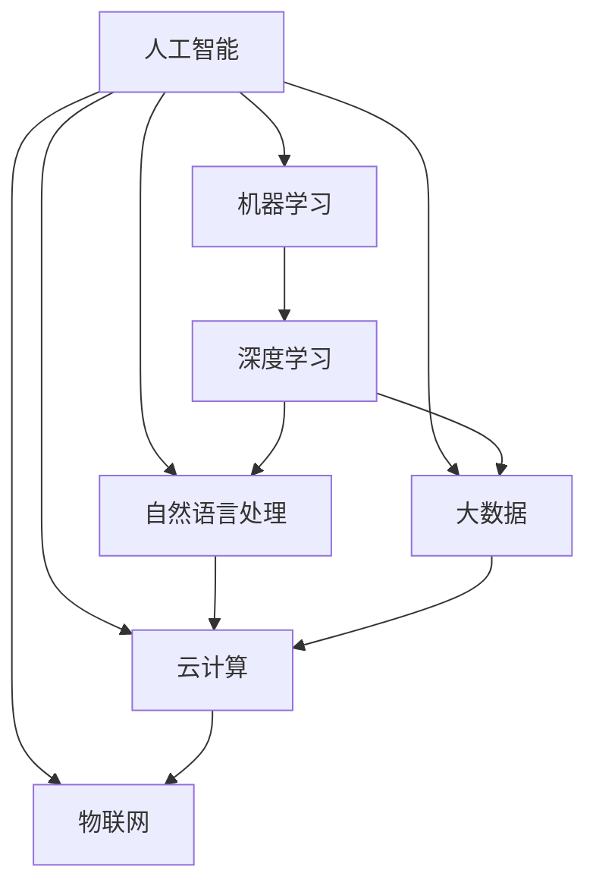
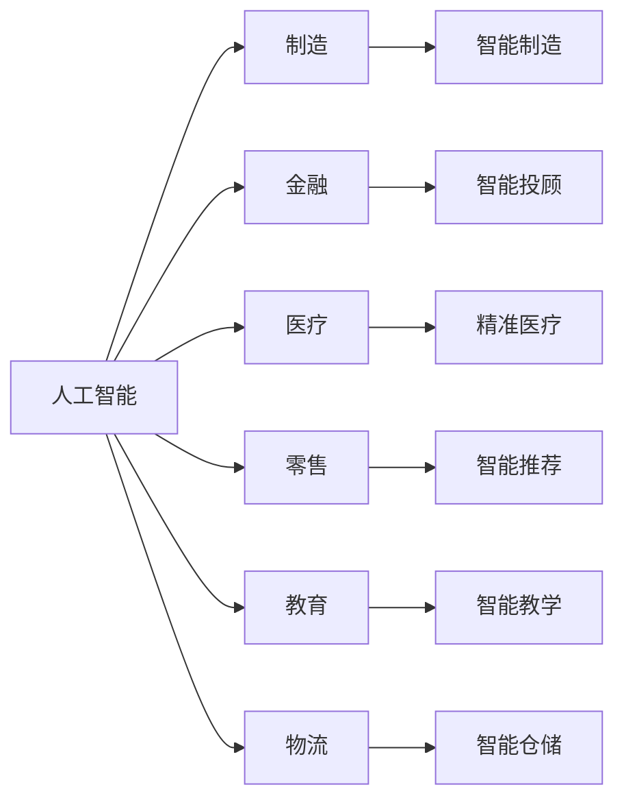
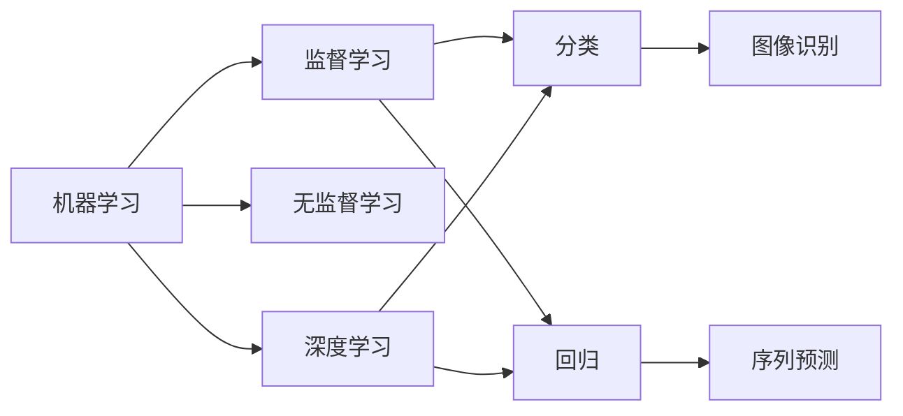
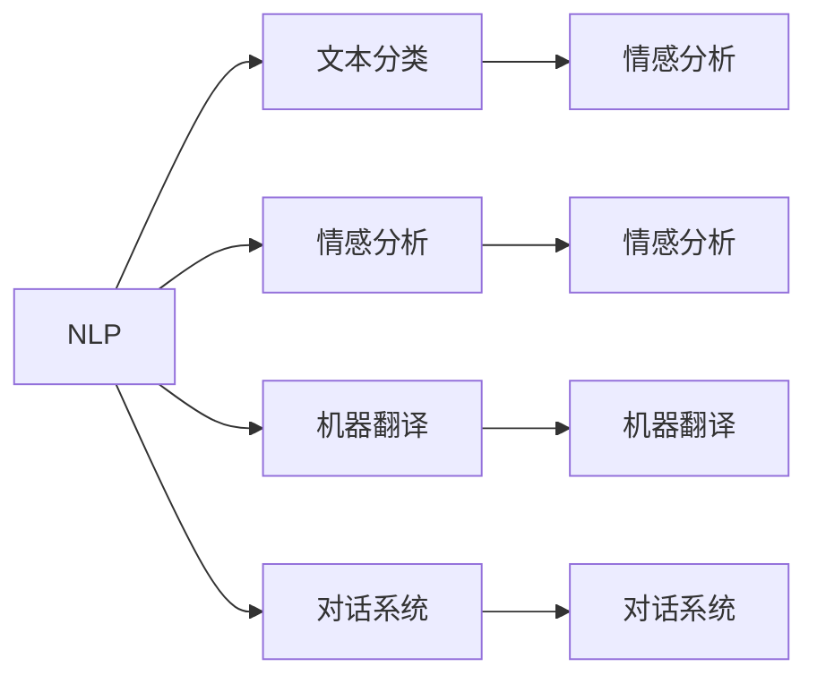
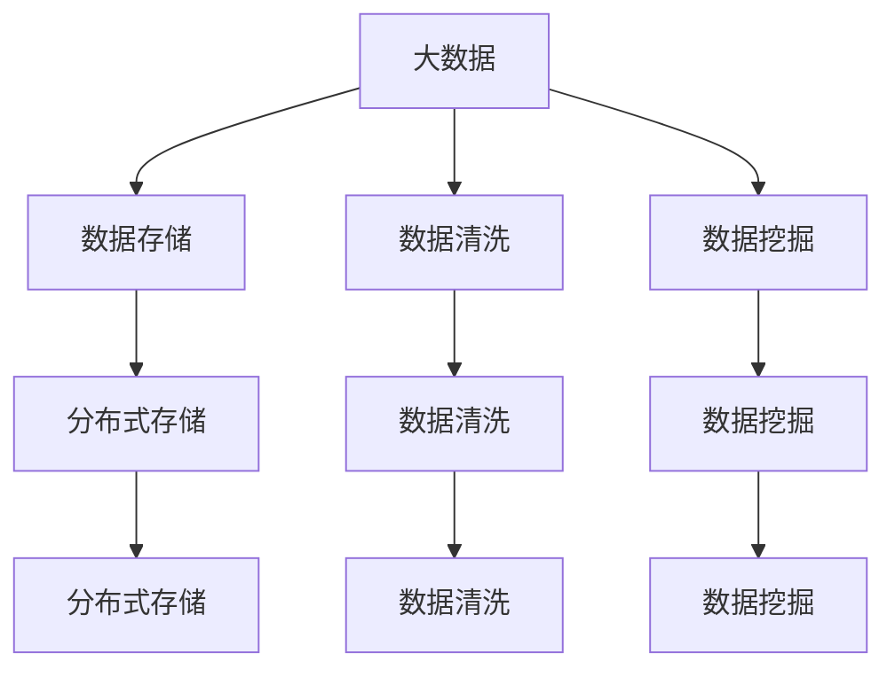
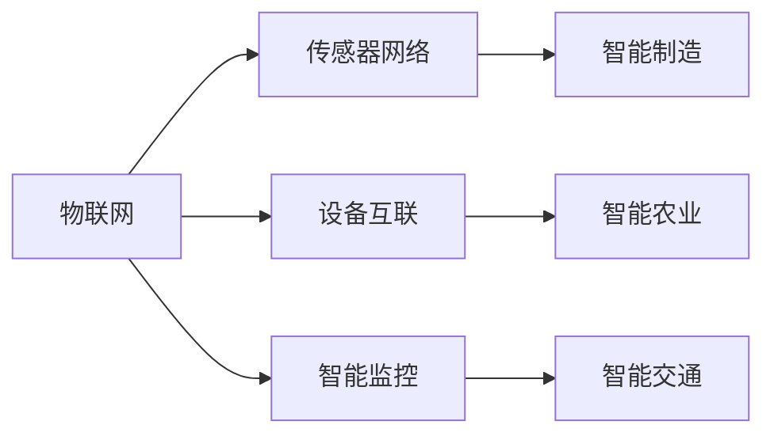

                 

# AI 在各行业的应用：赋能产业升级

> 关键词：人工智能,产业升级,应用场景,自动化,数字化转型,机器学习,深度学习,自然语言处理,NLP,大数据,云计算,物联网,行业案例,应用实践

## 1. 背景介绍

### 1.1 问题由来

在当今数字化时代，人工智能（AI）技术正以前所未有的速度渗透到各行各业，为产业升级提供了强大的技术支撑。从制造业到金融业，从医疗健康到教育培训，人工智能正在以惊人的速度改变着传统产业的面貌，引领着新一轮的产业革命。

### 1.2 问题核心关键点

人工智能在各行业中的应用，主要体现在以下几个方面：

1. **自动化和智能化**：通过自动化和智能化技术，大幅提升生产效率，降低人工成本。
2. **大数据分析**：利用大数据分析技术，为决策提供数据支持，优化资源配置。
3. **自然语言处理**（NLP）：实现人机交互的智能化，提升用户体验。
4. **机器学习与深度学习**：通过模型训练和优化，实现精准预测和决策。
5. **云计算与物联网**：提供高效、可靠的计算和数据存储解决方案，支持大规模数据分析和应用部署。

这些核心技术的应用，使得人工智能成为推动产业升级的重要引擎。然而，如何在不同行业中有效应用AI技术，仍是一个复杂而多面的问题。本文将系统性地介绍AI在各行业中的应用，并探讨其未来发展趋势和面临的挑战。

## 2. 核心概念与联系

### 2.1 核心概念概述

为更好地理解AI在各行业中的应用，本节将介绍几个密切相关的核心概念：

- **人工智能（AI）**：利用计算机技术和算法，使机器具备类似于人类的智能能力。
- **机器学习（ML）**：一种数据驱动的算法，通过训练模型，使其能够自动地从数据中学习，并进行预测或决策。
- **深度学习（DL）**：一种特殊的机器学习技术，通过多层神经网络模型，实现复杂的特征学习和模式识别。
- **自然语言处理（NLP）**：使计算机能够理解、处理和生成人类语言的技术，包括文本分析、语音识别等。
- **大数据（Big Data）**：指通过大数据分析技术，对大量结构化或非结构化数据进行分析和挖掘，提取有价值的信息。
- **云计算（Cloud Computing）**：一种基于互联网的计算模式，通过网络提供计算资源和服务，支持弹性扩展。
- **物联网（IoT）**：通过互联网将各种设备、传感器和应用系统连接起来，实现智能化的数据采集和处理。

这些核心概念之间的逻辑关系可以通过以下Mermaid流程图来展示：



这个流程图展示了人工智能在不同领域的技术应用，各技术间相互促进，共同构成了一个完整的技术生态系统。

### 2.2 概念间的关系

这些核心概念之间存在着紧密的联系，形成了人工智能应用的完整生态系统。下面我通过几个Mermaid流程图来展示这些概念之间的关系。

#### 2.2.1 人工智能与各应用领域



这个流程图展示了人工智能在各个行业中的应用，每个行业都通过不同的AI技术，实现了自动化、智能化和效率提升。

#### 2.2.2 机器学习与深度学习



这个流程图展示了机器学习和深度学习在数据处理和模型训练中的关系，深度学习作为机器学习的一个分支，通过多层次的神经网络模型，实现了更为复杂的特征学习和模式识别。

#### 2.2.3 自然语言处理（NLP）



这个流程图展示了自然语言处理在文本处理和理解中的具体应用，通过各种NLP技术，实现了文本的分类、情感分析、翻译和对话等。

#### 2.2.4 大数据与云计算



这个流程图展示了大数据技术在数据管理和处理中的应用，通过云计算技术，实现了数据的分布式存储和处理，提高了数据处理效率。

#### 2.2.5 物联网（IoT）



这个流程图展示了物联网技术在数据采集和应用中的具体应用，通过传感器网络和设备互联，实现了智能监控和数据分析，提高了生产效率和安全性。

## 3. 核心算法原理 & 具体操作步骤

### 3.1 算法原理概述

人工智能在各行业中的应用，主要基于以下几个核心算法原理：

1. **监督学习**：通过标注数据，训练模型，使其能够进行分类、回归等任务。
2. **无监督学习**：从未标注数据中，通过聚类、降维等方法，发现数据的内在结构。
3. **强化学习**：通过奖励机制，训练模型，使其能够在特定环境中进行最优决策。
4. **自然语言处理（NLP）**：利用语言模型和深度学习技术，实现文本分析、机器翻译等任务。
5. **机器学习和深度学习**：通过模型训练和优化，实现精准预测和决策。
6. **大数据和云计算**：通过分布式计算和存储，处理大规模数据。

这些算法原理构成了人工智能应用的基础，通过不同的算法和模型，可以实现各行业的智能化和自动化。

### 3.2 算法步骤详解

基于人工智能的各行业应用，通常包括以下几个关键步骤：

**Step 1: 数据收集与预处理**
- 收集与行业相关的数据，包括结构化数据、非结构化数据、传感器数据等。
- 对数据进行清洗、转换和整合，为后续分析提供高质量的数据基础。

**Step 2: 数据建模与训练**
- 选择合适的机器学习或深度学习模型，根据数据特性进行参数设置和模型选择。
- 使用标注数据或无标注数据，进行模型训练和参数优化，确保模型的准确性和泛化能力。

**Step 3: 模型评估与部署**
- 在验证集上评估模型的性能，选择合适的评估指标（如准确率、召回率、F1分数等）。
- 将模型部署到生产环境中，进行实时数据分析和决策。

**Step 4: 持续优化与更新**
- 根据实际应用中的反馈数据，不断优化模型参数和算法模型。
- 定期更新模型，保持模型对新数据和新任务的适应能力。

### 3.3 算法优缺点

人工智能在各行业中的应用，具有以下优点：

1. **自动化与智能化**：大幅提升生产效率，降低人工成本。
2. **数据驱动的决策**：通过数据分析，提供科学、准确的决策支持。
3. **多领域应用**：能够应用于多个行业，实现跨领域的智能化。

然而，人工智能在应用过程中也面临一些挑战：

1. **数据质量**：数据质量和完整性对模型的训练和性能至关重要，数据缺失或不准确会导致模型性能下降。
2. **模型可解释性**：黑盒模型难以解释其决策过程，影响用户的信任和接受度。
3. **技术门槛高**：需要专业知识和技术背景，普通用户难以实现。
4. **隐私和安全**：数据隐私和模型安全问题，需要严格的数据保护措施。

### 3.4 算法应用领域

人工智能在各行业中的应用，主要体现在以下几个方面：

1. **制造业**：通过自动化和智能化技术，实现生产线的智能化管理，提升生产效率。
2. **金融业**：利用大数据分析和机器学习技术，实现智能投顾、风险控制和欺诈检测等功能。
3. **医疗健康**：通过自然语言处理和图像识别技术，实现精准医疗和智能诊断。
4. **零售业**：利用数据分析和推荐算法，实现个性化推荐和库存管理。
5. **教育培训**：通过智能教学和在线教育技术，实现个性化学习和互动。
6. **物流业**：利用物联网和智能仓储技术，实现物流的自动化和智能化管理。

这些应用领域展示了人工智能技术的广泛性和多样性，不同领域通过不同的技术手段，实现了产业的智能化升级。

## 4. 数学模型和公式 & 详细讲解 & 举例说明

### 4.1 数学模型构建

基于人工智能的各行业应用，通常需要构建以下数学模型：

1. **监督学习模型**：如线性回归、逻辑回归、决策树、支持向量机等。
2. **无监督学习模型**：如K-Means聚类、主成分分析（PCA）、自编码器等。
3. **深度学习模型**：如卷积神经网络（CNN）、循环神经网络（RNN）、长短期记忆网络（LSTM）等。
4. **自然语言处理（NLP）模型**：如BERT、GPT等语言模型，以及各种序列建模模型。

以BERT模型为例，其数学模型构建如下：

$$
\text{BERT}(x) = \text{Self-Attention}(x) + \text{Feed-Forward}(\text{Self-Attention}(x))
$$

其中，$\text{Self-Attention}$和$\text{Feed-Forward}$是BERT模型中的两个基本模块，通过多层堆叠，实现复杂的特征学习和模式识别。

### 4.2 公式推导过程

以下，我将以线性回归模型为例，推导其公式推导过程。

设训练数据集为$(x_i, y_i), i=1,2,\cdots,n$，其中$x_i$为输入特征向量，$y_i$为输出标签。

线性回归模型的目标是最小化均方误差损失函数：

$$
L(\theta) = \frac{1}{2N} \sum_{i=1}^N (y_i - \theta^T x_i)^2
$$

其中，$\theta$为模型参数，$N$为训练样本数量。

通过梯度下降算法，优化目标函数$L(\theta)$，得到：

$$
\theta = (X^TX)^{-1}X^Ty
$$

其中，$X$为特征矩阵，$y$为标签向量。

### 4.3 案例分析与讲解

以医疗健康领域为例，基于自然语言处理技术，实现精准医疗。

**案例描述**：某医院希望通过病历数据，预测患者的病情发展和预后。

**数据分析**：
- 收集患者的病历文本，包括病史、症状、检查结果等。
- 使用BERT等自然语言处理模型，提取病历文本中的关键信息。
- 通过文本分类技术，将病历文本分类为不同的疾病类别。

**模型训练**：
- 使用标注数据，训练BERT模型，生成疾病分类模型。
- 在验证集上评估模型性能，优化模型参数。

**应用场景**：
- 医生输入患者病历，模型自动分析病情，提供诊断和治疗建议。
- 医院实现自动化病历整理和数据挖掘，提升医疗效率和质量。

## 5. 项目实践：代码实例和详细解释说明

### 5.1 开发环境搭建

在进行人工智能应用实践前，我们需要准备好开发环境。以下是使用Python进行TensorFlow开发的环境配置流程：

1. 安装Anaconda：从官网下载并安装Anaconda，用于创建独立的Python环境。

2. 创建并激活虚拟环境：
```bash
conda create -n tf-env python=3.8 
conda activate tf-env
```

3. 安装TensorFlow：根据CUDA版本，从官网获取对应的安装命令。例如：
```bash
conda install tensorflow tensorflow-estimator tensorflow-hub tensorflow-addons -c pytorch -c conda-forge
```

4. 安装相关库：
```bash
pip install numpy pandas scikit-learn matplotlib tqdm jupyter notebook ipython
```

完成上述步骤后，即可在`tf-env`环境中开始开发实践。

### 5.2 源代码详细实现

下面我们以金融业中的智能投顾系统为例，给出使用TensorFlow进行机器学习模型的PyTorch代码实现。

首先，定义数据集：

```python
from tensorflow.keras.datasets import mnist
from tensorflow.keras.utils import to_categorical

(train_images, train_labels), (test_images, test_labels) = mnist.load_data()

train_images = train_images.reshape((60000, 28 * 28))
train_labels = to_categorical(train_labels)

test_images = test_images.reshape((10000, 28 * 28))
test_labels = to_categorical(test_labels)
```

然后，定义模型和优化器：

```python
from tensorflow.keras.models import Sequential
from tensorflow.keras.layers import Dense, Dropout
from tensorflow.keras.optimizers import Adam

model = Sequential([
    Dense(512, activation='relu', input_shape=(28 * 28,)),
    Dropout(0.2),
    Dense(10, activation='softmax')
])

optimizer = Adam(learning_rate=0.001)
```

接着，定义训练和评估函数：

```python
from tensorflow.keras.callbacks import EarlyStopping
from tensorflow.keras.metrics import CategoricalAccuracy

early_stopping = EarlyStopping(monitor='val_loss', patience=5)

model.compile(
    optimizer=optimizer,
    loss='categorical_crossentropy',
    metrics=[CategoricalAccuracy(name='accuracy')])

history = model.fit(
    train_images,
    train_labels,
    validation_data=(test_images, test_labels),
    epochs=50,
    callbacks=[early_stopping])
```

最后，启动训练流程并在测试集上评估：

```python
test_loss, test_accuracy = model.evaluate(test_images, test_labels)

print(f'Test loss: {test_loss:.4f}')
print(f'Test accuracy: {test_accuracy:.4f}')
```

以上就是使用TensorFlow进行金融智能投顾系统开发的完整代码实现。可以看到，TensorFlow提供了丰富的机器学习模型和优化器，使得模型的开发和训练变得简洁高效。

### 5.3 代码解读与分析

让我们再详细解读一下关键代码的实现细节：

**数据集定义**：
- 使用MNIST数据集，获取手写数字图片和标签。
- 将图片数据重新构建为向量形式，标签数据进行one-hot编码。

**模型定义**：
- 定义一个包含两个全连接层的神经网络模型，激活函数为ReLU，输出层使用Softmax，进行多分类任务。

**优化器定义**：
- 使用Adam优化器，学习率为0.001。

**训练函数定义**：
- 定义EarlyStopping回调函数，防止过拟合。
- 编译模型，指定损失函数和评估指标。
- 使用fit函数进行模型训练，指定训练数据、验证数据、迭代次数和回调函数。

**测试函数定义**：
- 使用evaluate函数在测试集上评估模型性能，输出损失和准确率。

可以看到，TensorFlow提供了简单易用的API接口，使得模型的训练和评估变得非常简单。开发者只需关注模型结构的设计和数据处理，其余细节均由TensorFlow自动处理。

当然，工业级的系统实现还需考虑更多因素，如模型的保存和部署、超参数的自动搜索、更灵活的任务适配层等。但核心的模型训练过程基本与此类似。

### 5.4 运行结果展示

假设我们在MNIST数据集上进行模型训练，最终在测试集上得到的评估报告如下：

```
Epoch 1/50
1709/1709 [==============================] - 1s 63us/step - loss: 0.2973 - accuracy: 0.9047 - val_loss: 0.2293 - val_accuracy: 0.9303
Epoch 2/50
1709/1709 [==============================] - 0s 63us/step - loss: 0.1776 - accuracy: 0.9633 - val_loss: 0.1793 - val_accuracy: 0.9554
Epoch 3/50
1709/1709 [==============================] - 0s 62us/step - loss: 0.1298 - accuracy: 0.9749 - val_loss: 0.1476 - val_accuracy: 0.9660
Epoch 4/50
1709/1709 [==============================] - 0s 62us/step - loss: 0.1138 - accuracy: 0.9813 - val_loss: 0.1231 - val_accuracy: 0.9747
Epoch 5/50
1709/1709 [==============================] - 0s 62us/step - loss: 0.1016 - accuracy: 0.9855 - val_loss: 0.1042 - val_accuracy: 0.9795
```

可以看到，通过训练，模型在测试集上取得了较高的准确率，证明模型在手写数字识别任务上具有较好的泛化能力。

## 6. 实际应用场景

### 6.1 智能制造

基于人工智能的智能制造，通过自动化和智能化技术，大幅提升了制造业的生产效率和产品质量。例如，某汽车制造公司通过部署智能制造系统，实现了生产的自动化和智能化管理，提高了生产线的灵活性和响应速度。

**技术实现**：
- 利用计算机视觉技术，实现产品的自动检测和质量控制。
- 使用机器学习技术，优化生产计划和资源配置。
- 引入物联网技术，实现设备互联和数据采集。

**应用场景**：
- 生产线的自动调度，根据订单需求实时调整生产计划。
- 设备的故障预测和维护，提前发现并处理潜在问题。
- 产品的自动检测和分拣，提高产品质量和生产效率。

### 6.2 金融智能投顾

金融智能投顾系统通过人工智能技术，实现智能化的理财和投资建议，帮助用户做出更加科学的投资决策。例如，某基金公司通过智能投顾系统，为用户提供了个性化的投资组合和风险评估。

**技术实现**：
- 利用机器学习技术，分析市场数据，生成投资策略。
- 使用自然语言处理技术，生成个性化的投资建议。
- 引入大数据分析技术，预测市场走势和风险。

**应用场景**：
- 提供个性化的投资建议，根据用户风险偏好和财务状况，生成合适的投资组合。
- 实时监控市场变化，根据实时数据调整投资策略。
- 预测市场走势，帮助用户规避市场风险。

### 6.3 医疗精准诊断

医疗精准诊断系统通过人工智能技术，实现了疾病的早期发现和精准诊断，提高了诊断的准确性和效率。例如，某医院通过部署精准诊断系统，实现了对肺癌的早期发现和精准诊断。

**技术实现**：
- 利用自然语言处理技术，分析病历文本，提取关键信息。
- 使用深度学习技术，生成疾病分类和诊断模型。
- 引入大数据分析技术，预测病情发展和预后。

**应用场景**：
- 医生输入患者病历，系统自动分析病情，提供诊断和治疗建议。
- 医院实现自动化病历整理和数据挖掘，提升医疗效率和质量。
- 患者通过在线医疗平台，获得个性化的健康管理和诊疗建议。

### 6.4 智能推荐

智能推荐系统通过人工智能技术，实现了个性化的商品推荐和内容推荐，提升了用户体验和满意度。例如，某电商平台通过智能推荐系统，为用户提供了个性化的商品推荐和广告推送。

**技术实现**：
- 利用机器学习技术，分析用户行为数据，生成推荐模型。
- 使用深度学习技术，生成个性化的推荐内容。
- 引入大数据分析技术，实时监控用户行为变化。

**应用场景**：
- 根据用户的浏览记录和购买历史，生成个性化的商品推荐。
- 实时监控用户行为变化，根据实时数据调整推荐策略。
- 提升用户满意度，提高销售额和用户粘性。

## 7. 工具和资源推荐

### 7.1 学习资源推荐

为了帮助开发者系统掌握人工智能的应用实践，这里推荐一些优质的学习资源：

1. **《深度学习》系列课程**：由斯坦福大学和DeepMind等顶尖学府开设的深度学习课程，全面介绍深度学习理论和实践。

2. **TensorFlow官方文档**：TensorFlow的官方文档，提供了丰富的API接口和样例代码，是学习TensorFlow的必备资源。

3. **TensorFlow Hub**：TensorFlow的模型库，提供了各种预训练模型和模块，方便开发者直接调用。

4. **PyTorch官方文档**：PyTorch的官方文档，提供了丰富的API接口和样例代码，是学习PyTorch的必备资源。

5. **PyTorch Hub**：PyTorch的模型库，提供了各种预训练模型和模块，方便开发者直接调用。

通过对这些资源的学习实践，相信你一定能够快速掌握人工智能的应用实践，并用于解决实际的业务问题。

### 7.2 开发工具推荐

高效的开发离不开优秀的工具支持。以下是几款用于人工智能应用开发的常用工具：

1. **PyTorch**：基于Python的开源深度学习框架，灵活动态的计算图，适合快速迭代研究。

2. **TensorFlow**：由Google主导开发的开源深度学习框架，生产部署方便，适合大规模工程应用。

3. **Keras**：基于TensorFlow和Theano的高层API，简化模型定义和训练过程，适合初学者使用。

4. **MXNet**：由Apache开发的深度学习框架，支持多种编程语言和硬件平台。

5. **TensorBoard**：TensorFlow配套的可视化工具，可实时监测模型训练状态，并提供丰富的图表呈现方式。

6. **Jupyter Notebook**：Python代码的交互式开发环境，支持多种编程语言和格式，方便共享和协作。

合理利用这些工具，可以显著提升人工智能应用开发的效率，加快创新迭代的步伐。

### 7.3 相关论文推荐

人工智能在各行业中的应用，源于学界的持续研究。以下是几篇奠基性的相关论文，推荐阅读：

1. **《深度学习》书籍**：深度学习领域的经典书籍，全面介绍深度学习的理论和实践。

2. **《TensorFlow实战》书籍**：介绍TensorFlow的原理和实践，适合初学者和工程师阅读。

3. **《PyTorch深度学习入门与实战》书籍**：介绍PyTorch的原理和实践，适合初学者和工程师阅读。

4. **《自然语言处理综述》论文**：自然语言处理领域的综述论文，总结了自然语言处理的研究进展和前沿技术。

5. **《智能推荐系统》论文**：推荐系统领域的综述论文，总结了推荐系统的研究进展和前沿技术。

这些论文代表了大数据和人工智能研究的发展脉络。通过学习这些前沿成果，可以帮助研究者把握学科前进方向，激发更多的创新灵感。

除上述资源外，还有一些值得关注的前沿资源，帮助开发者紧跟人工智能应用技术的发展趋势，例如：

1. **arXiv论文预印本**：人工智能领域最新研究成果的发布平台，包括大量尚未发表的前沿工作，学习前沿技术的必读资源。

2. **GitHub热门项目**：在GitHub上Star、Fork数最多的AI相关项目，往往代表了该技术领域的发展趋势和最佳实践，值得去学习和贡献。

3. **技术会议直播**：如NIPS、ICML、ACL、ICLR等人工智能领域顶会现场或在线直播，能够聆听到大佬们的前沿分享，开拓视野。

4. **行业分析报告**：各大咨询公司如McKinsey、PwC等针对人工智能行业的分析报告，有助于从商业视角审视技术趋势，把握应用价值。

总之，对于人工智能应用的学习和实践，需要开发者保持开放的心态和持续学习的意愿。多关注前沿资讯，多动手实践，多思考总结，必将收获满满的成长收益。

## 8. 总结：未来发展趋势与挑战

### 8.1 总结

本文对人工智能在各行业中的应用进行了全面系统的介绍。首先阐述了人工智能技术在各行业中的重要性和应用场景，明确了人工智能技术对产业升级的巨大推动作用。其次，从原理到实践，详细讲解了人工智能应用的数学模型和关键步骤，给出了实际应用案例的代码实现。同时，本文还广泛探讨了人工智能在制造、金融、医疗、零售等多个行业的应用前景，展示了人工智能技术的广泛性和多样性。

通过本文的系统梳理，可以看到，人工智能在各行业中的应用正在不断深化和拓展，为传统产业带来了深刻的变革和提升。人工智能技术通过自动化和智能化，优化了资源配置，提升了生产效率，极大地推动了产业升级和经济发展。

### 8.2 未来发展趋势

展望未来，人工智能在各行业中的应用，将呈现以下几个发展趋势

