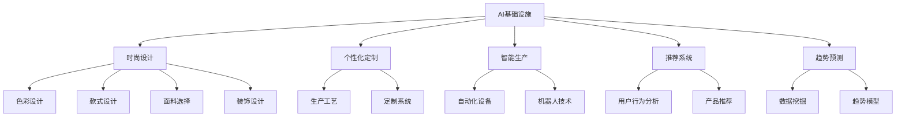
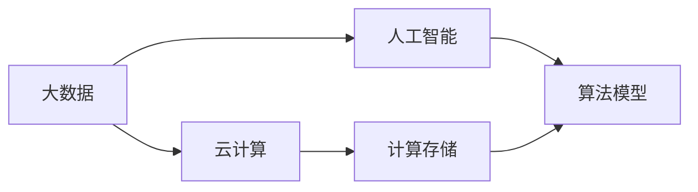
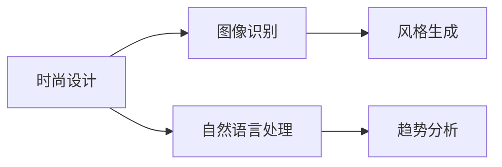
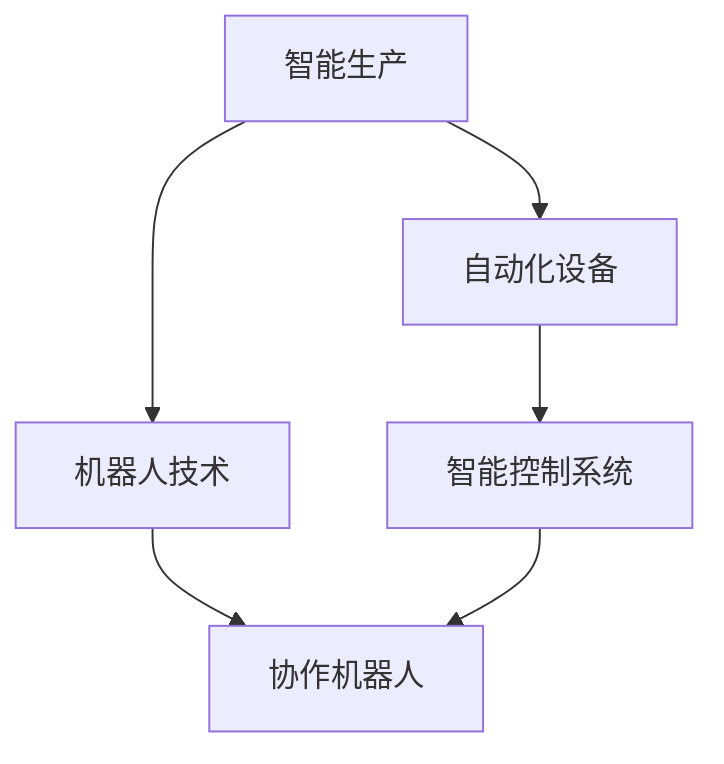
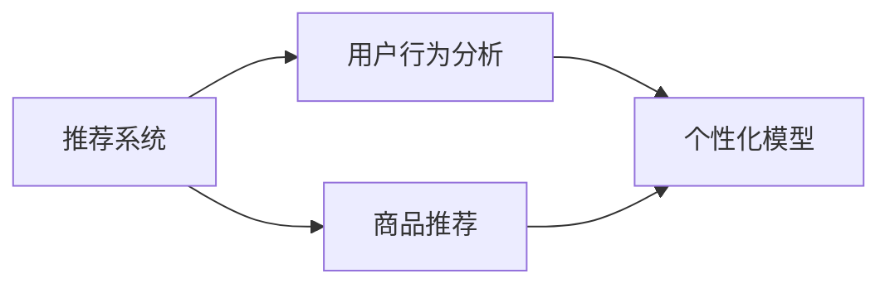
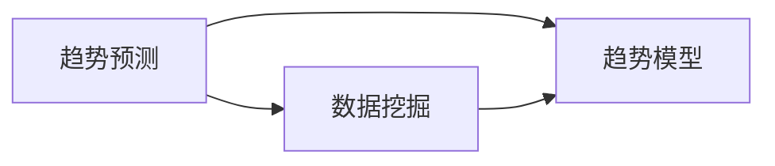
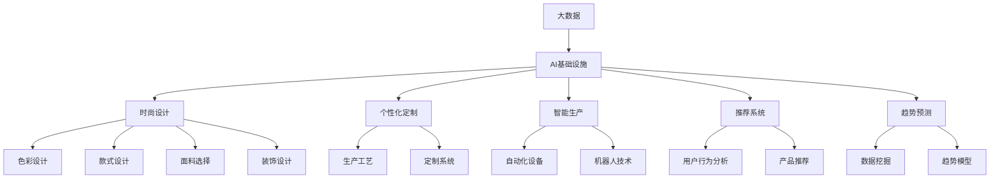

                 

# AI 基础设施的时尚产业：智能设计与个性化定制

## 1. 背景介绍

时尚产业是一个复杂多变的领域，传统设计流程往往需要大量的人力物力，难以实现快速迭代和个性化定制。然而，随着人工智能技术的不断进步，尤其是AI基础设施的快速发展，智能设计与个性化定制正成为时尚产业的新趋势。AI基础设施通过强大的计算能力和先进的算法模型，可以在设计、生产和销售等各个环节提供高效的支撑，帮助企业更好地满足消费者需求，提升品牌竞争力。

### 1.1 问题由来
在过去的几十年中，时尚产业经历了从手工制作到机械化生产再到数字化转型的演变。然而，尽管数字化水平不断提高，时尚产业的设计与生产流程仍面临诸多挑战：

- **设计与生产的分离**：传统设计流程中，设计师与生产工艺师之间缺乏有效的沟通和协作，导致设计和生产的协调成本高、效率低。
- **个性化定制的难度**：个性化定制需要大量定制数据和复杂的软件支持，传统系统难以满足。
- **生产效率的瓶颈**：手工生产效率低、成本高，机械化生产虽然提高效率，但灵活性差，难以满足多变的设计需求。
- **数据驱动的缺失**：尽管数字化转型使得数据积累更加丰富，但数据利用率低，缺乏有效的数据驱动设计机制。

因此，如何通过技术手段突破上述难题，提升时尚产业的智能化和个性化水平，成为亟待解决的问题。

### 1.2 问题核心关键点
AI基础设施通过结合大数据、云计算、人工智能等技术，为时尚产业提供了新的解决方案。核心关键点包括：

- **数据驱动的设计**：通过分析历史数据和消费者行为，AI可以辅助设计师进行设计创新。
- **智能化生产**：利用机器人和自动化设备，实现高效率、高灵活性的个性化定制生产。
- **实时监控与优化**：通过传感器和实时数据，AI可以实现对生产流程的持续监控和优化。
- **个性化推荐系统**：AI可以构建强大的推荐系统，提升消费者的购物体验和满意度。
- **时尚趋势预测**：通过大数据分析，AI可以预测时尚趋势，辅助企业制定更精准的市场策略。

这些关键点构成了AI基础设施在时尚产业中发挥作用的基础。通过这些技术手段，时尚产业可以实现从设计、生产到销售的全面智能化，提高整个产业链的效率和灵活性，满足消费者多样化的需求。

### 1.3 问题研究意义
研究AI基础设施在时尚产业中的应用，对于推动时尚产业向智能、绿色、个性化方向发展，具有重要意义：

- **提升设计效率**：利用AI辅助设计，可以大幅缩短设计周期，降低设计成本，提升设计质量。
- **实现个性化定制**：通过智能生产和个性化推荐，可以提供更贴合消费者需求的时尚产品，提升品牌竞争力。
- **优化生产流程**：AI可以实现对生产流程的实时监控和优化，提高生产效率和质量。
- **增强市场竞争力**：通过时尚趋势预测和精准营销，可以更好地把握市场机会，提升企业盈利能力。

## 2. 核心概念与联系

### 2.1 核心概念概述

为更好地理解AI基础设施在时尚产业中的应用，本节将介绍几个密切相关的核心概念：

- **AI基础设施**：指基于大数据、云计算、人工智能等技术构建的智能计算平台，提供强大的计算能力和高效的算法模型，支持各种智能化应用。
- **时尚设计**：涉及服饰、鞋帽、饰品等产品设计的创意过程，涵盖色彩、款式、面料、装饰等多个维度。
- **个性化定制**：根据消费者个性化需求，量身定制的产品和服务。
- **智能生产**：通过自动化设备和智能系统，实现高效率、高灵活性的生产模式。
- **推荐系统**：通过分析用户行为和偏好，推荐个性化产品和服务，提升用户体验。
- **趋势预测**：利用大数据分析技术，预测时尚趋势和市场需求，辅助企业制定策略。

这些核心概念之间的逻辑关系可以通过以下Mermaid流程图来展示：



这个流程图展示了大语言模型微调过程中各个核心概念的关系和作用：

1. AI基础设施为时尚设计、个性化定制、智能生产和推荐系统等提供技术支撑。
2. 时尚设计涉及色彩、款式、面料、装饰等多个维度，AI可以辅助进行数据驱动的设计创新。
3. 个性化定制需要灵活的生产工艺和定制系统，AI可以实现智能化生产和个性化推荐。
4. 智能生产依赖自动化设备和机器人技术，AI可以优化生产流程和提高效率。
5. 推荐系统利用用户行为分析，提供个性化产品推荐，提升用户体验。
6. 趋势预测利用数据挖掘和趋势模型，辅助企业制定市场策略。

### 2.2 概念间的关系

这些核心概念之间存在着紧密的联系，形成了时尚产业的智能生态系统。下面我们通过几个Mermaid流程图来展示这些概念之间的关系。

#### 2.2.1 AI基础设施的架构



这个流程图展示了AI基础设施的架构，由大数据、云计算和人工智能三个部分组成，通过数据和计算资源支撑算法模型的运行，实现高效计算和智能化应用。

#### 2.2.2 AI在时尚设计中的应用



这个流程图展示了AI在时尚设计中的应用，主要通过图像识别和自然语言处理技术，实现风格生成和趋势分析，辅助设计师进行创新设计。

#### 2.2.3 智能生产系统的架构



这个流程图展示了智能生产系统的架构，主要依赖自动化设备和机器人技术，通过智能控制系统实现高效、灵活的生产流程。

#### 2.2.4 推荐系统的架构



这个流程图展示了推荐系统的架构，主要通过用户行为分析和个性化模型，实现商品推荐，提升用户购物体验。

#### 2.2.5 趋势预测的架构



这个流程图展示了趋势预测的架构，主要通过数据挖掘和趋势模型，预测时尚趋势和市场需求，辅助企业制定市场策略。

### 2.3 核心概念的整体架构

最后，我们用一个综合的流程图来展示这些核心概念在大规模计算和大数据平台上的整体架构：



这个综合流程图展示了从数据到应用的全流程，大语言模型微调过程中各个核心概念的关系和作用，为后续深入讨论具体的AI基础设施应用提供了基础。

## 3. 核心算法原理 & 具体操作步骤
### 3.1 算法原理概述

AI基础设施在时尚产业中的应用，主要基于以下几个核心算法原理：

- **数据驱动的设计**：利用大数据分析和机器学习算法，分析消费者行为和历史数据，辅助设计师进行创新设计。
- **智能生产**：通过自动化设备和智能控制系统，实现高效率、高灵活性的个性化定制生产。
- **实时监控与优化**：通过传感器和实时数据，实现对生产流程的持续监控和优化。
- **个性化推荐系统**：利用用户行为分析，推荐个性化产品和服务，提升用户体验。
- **时尚趋势预测**：通过大数据分析和趋势模型，预测时尚趋势和市场需求，辅助企业制定策略。

### 3.2 算法步骤详解

#### 3.2.1 数据驱动的设计

**Step 1: 数据收集与处理**
- 收集消费者行为数据，包括浏览记录、购买记录、评论等。
- 通过图像识别技术，自动提取颜色、款式、面料等设计要素。
- 利用自然语言处理技术，分析用户评论和反馈，提取关键词和情感倾向。

**Step 2: 数据分析与挖掘**
- 使用统计分析方法，计算各项设计要素的分布和趋势。
- 应用机器学习算法，预测消费者偏好和需求变化。
- 构建时尚设计风格模型，辅助设计师进行创新设计。

**Step 3: 设计方案生成**
- 基于数据分析结果，生成多个设计方案，并进行自动评估。
- 结合用户反馈，迭代优化设计方案。
- 最终生成符合用户需求的设计方案。

#### 3.2.2 智能生产

**Step 1: 生产工艺设计**
- 利用人工智能算法，设计高效的生产工艺流程。
- 根据设计方案，生成生产工艺的具体参数。

**Step 2: 自动化设备配置**
- 配置自动化设备和协作机器人，实现高效率的生产。
- 通过智能控制系统，对设备进行实时监控和调整。

**Step 3: 生产过程优化**
- 实时采集生产数据，进行生产过程监控和优化。
- 通过机器学习算法，预测生产瓶颈和故障，提前进行维护。

#### 3.2.3 实时监控与优化

**Step 1: 传感器部署**
- 在生产设备和生产线上部署传感器，实时采集数据。
- 通过网络传输，将传感器数据传输到中央控制系统。

**Step 2: 数据实时处理**
- 使用流计算框架，对实时数据进行实时处理和分析。
- 通过机器学习算法，进行异常检测和故障预测。

**Step 3: 生产流程优化**
- 根据实时数据，进行生产流程的动态调整和优化。
- 通过自动化系统，实现生产过程的自动控制和调整。

#### 3.2.4 个性化推荐系统

**Step 1: 用户行为分析**
- 收集用户的历史行为数据，包括浏览、购买、评价等。
- 利用机器学习算法，分析用户行为模式和偏好。

**Step 2: 个性化模型构建**
- 根据用户行为分析结果，构建个性化推荐模型。
- 通过实时数据更新模型，保持个性化推荐的准确性。

**Step 3: 推荐结果生成**
- 根据用户行为和个性化模型，生成个性化的推荐结果。
- 将推荐结果推送到用户端，提升用户购物体验。

#### 3.2.5 时尚趋势预测

**Step 1: 数据收集与处理**
- 收集历史时尚数据和市场数据，包括时尚杂志、社交媒体、电商平台等。
- 通过数据清洗和预处理，构建时尚数据集。

**Step 2: 数据挖掘与分析**
- 应用机器学习算法，进行数据挖掘和特征提取。
- 通过大数据分析，发现时尚趋势和市场变化。

**Step 3: 趋势模型构建**
- 基于数据挖掘结果，构建时尚趋势预测模型。
- 利用趋势模型，预测未来时尚趋势和市场需求。

### 3.3 算法优缺点

AI基础设施在时尚产业中的应用，具有以下优点：

- **提高设计效率**：通过数据驱动的设计，可以大幅缩短设计周期，提升设计质量。
- **实现个性化定制**：智能生产和推荐系统，可以实现高效率、高灵活性的个性化定制生产。
- **优化生产流程**：实时监控与优化系统，可以提高生产效率和质量，减少故障率。
- **提升用户体验**：个性化推荐系统，可以提升用户的购物体验和满意度。
- **精准预测市场趋势**：时尚趋势预测，可以帮助企业制定更精准的市场策略，提升盈利能力。

同时，该方法也存在以下局限性：

- **数据隐私问题**：收集和分析用户数据时，需要注意数据隐私和安全问题。
- **数据质量要求高**：数据的质量直接影响算法的准确性和效果，数据收集和清洗的成本较高。
- **算法复杂度较高**：算法模型需要复杂的计算和存储资源，可能对企业的计算能力提出较高要求。
- **模型训练成本高**：构建和训练大规模推荐系统和趋势预测模型，需要大量的时间和计算资源。

尽管存在这些局限性，但AI基础设施在时尚产业中的应用，已经展现出了巨大的潜力和优势，必将推动时尚产业向更加智能化、个性化方向发展。

### 3.4 算法应用领域

AI基础设施在时尚产业中的应用，已经覆盖了从设计、生产到销售的各个环节，主要包括以下几个方面：

- **时尚设计**：利用图像识别和自然语言处理技术，辅助设计师进行创新设计。
- **智能生产**：通过自动化设备和智能控制系统，实现高效率、高灵活性的个性化定制生产。
- **个性化推荐系统**：利用用户行为分析，推荐个性化产品和服务，提升用户体验。
- **时尚趋势预测**：通过大数据分析和趋势模型，预测时尚趋势和市场需求，辅助企业制定策略。

除了上述这些核心应用外，AI基础设施还在供应链管理、库存优化、智能客服等多个环节得到广泛应用，为时尚产业提供了全面的智能化解决方案。

## 4. 数学模型和公式 & 详细讲解  
### 4.1 数学模型构建

本节将使用数学语言对AI基础设施在时尚产业中的应用进行更加严格的刻画。

设时尚设计任务为 $D$，包括多个设计要素，如颜色、款式、面料等。定义设计任务的空间为 $\mathcal{X}$，每个设计要素的取值范围为 $x \in \mathcal{X}$。假设用户的历史行为数据为 $H$，用户行为与设计要素的关系为函数 $f(x, H)$。

定义推荐任务的空间为 $\mathcal{Y}$，每个设计要素的推荐结果为 $y \in \mathcal{Y}$。假设用户行为与推荐结果的关系为函数 $g(y, H)$。

定义趋势预测任务的空间为 $\mathcal{Z}$，每个设计要素的趋势预测结果为 $z \in \mathcal{Z}$。假设市场数据与设计要素的关系为函数 $h(z, X)$，其中 $X$ 为市场数据的集合。

### 4.2 公式推导过程

以下我们以推荐系统为例，推导个性化推荐模型的数学公式及其优化目标。

设推荐系统的训练数据集为 $D=\{(x_i, y_i)\}_{i=1}^N$，其中 $x_i$ 为设计要素，$y_i$ 为用户推荐结果。定义推荐系统的损失函数为：

$$
\ell(y, \theta) = \frac{1}{N}\sum_{i=1}^N [(y_i - \hat{y}_i)^2]
$$

其中 $\hat{y}_i = g(f(x_i, H), \theta)$，$\theta$ 为推荐模型参数。

推荐模型的优化目标是最小化损失函数，即：

$$
\theta^* = \mathop{\arg\min}_{\theta} \ell(y, \theta)
$$

在实践中，我们通常使用梯度下降等优化算法来近似求解上述最优化问题。设 $\eta$ 为学习率，则参数的更新公式为：

$$
\theta \leftarrow \theta - \eta \nabla_{\theta}\ell(y, \theta)
$$

其中 $\nabla_{\theta}\ell(y, \theta)$ 为损失函数对参数 $\theta$ 的梯度，可通过反向传播算法高效计算。

### 4.3 案例分析与讲解

#### 4.3.1 图像识别

**案例分析**：
假设某时尚品牌想要设计一款新的连体裤，需要提取连体裤的颜色、款式、面料等设计要素。可以通过图像识别技术，对连体裤的图像进行自动分析，提取设计要素。

**讲解**：
图像识别技术可以通过卷积神经网络（CNN）模型实现。假设连体裤的图像为 $I$，定义图像识别任务的空间为 $\mathcal{I}$，每个设计要素的取值为 $i \in \mathcal{I}$。

设图像识别模型的参数为 $\theta$，通过反向传播算法，计算损失函数 $\ell(I, i, \theta)$ 对参数 $\theta$ 的梯度，并更新参数 $\theta$。

通过训练，图像识别模型能够自动提取连体裤的颜色、款式、面料等设计要素，辅助设计师进行创新设计。

#### 4.3.2 自然语言处理

**案例分析**：
假设某时尚品牌想要了解消费者的评论和反馈，提取用户对连体裤的评价。可以通过自然语言处理技术，对评论进行自动分析，提取用户对连体裤的评价。

**讲解**：
自然语言处理技术可以通过循环神经网络（RNN）或变压器模型（Transformer）实现。假设用户评论为 $C$，定义自然语言处理任务的空间为 $\mathcal{C}$，每个评价的取值为 $c \in \mathcal{C}$。

设自然语言处理模型的参数为 $\theta$，通过反向传播算法，计算损失函数 $\ell(C, c, \theta)$ 对参数 $\theta$ 的梯度，并更新参数 $\theta$。

通过训练，自然语言处理模型能够自动提取用户对连体裤的评价，分析用户评论和反馈，辅助设计师进行创新设计。

#### 4.3.3 趋势分析

**案例分析**：
假设某时尚品牌想要预测未来的时尚趋势，了解市场需求。可以通过大数据分析技术，对历史时尚数据进行挖掘，预测未来趋势。

**讲解**：
趋势分析任务可以通过时间序列模型或回归模型实现。假设市场数据为 $X$，定义趋势预测任务的空间为 $\mathcal{Z}$，每个趋势预测结果的取值为 $z \in \mathcal{Z}$。

设趋势分析模型的参数为 $\theta$，通过反向传播算法，计算损失函数 $\ell(X, z, \theta)$ 对参数 $\theta$ 的梯度，并更新参数 $\theta$。

通过训练，趋势分析模型能够自动预测未来的时尚趋势和市场需求，辅助企业制定市场策略。

## 5. 项目实践：代码实例和详细解释说明
### 5.1 开发环境搭建

在进行AI基础设施在时尚产业中的应用实践前，我们需要准备好开发环境。以下是使用Python进行TensorFlow开发的环境配置流程：

1. 安装Anaconda：从官网下载并安装Anaconda，用于创建独立的Python环境。

2. 创建并激活虚拟环境：
```bash
conda create -n tf-env python=3.7 
conda activate tf-env
```

3. 安装TensorFlow：从官网获取对应的安装命令。例如：
```bash
pip install tensorflow
```

4. 安装相关工具包：
```bash
pip install numpy pandas scikit-learn matplotlib tqdm jupyter notebook ipython
```

完成上述步骤后，即可在`tf-env`环境中开始AI基础设施在时尚产业中的应用实践。

### 5.2 源代码详细实现

下面我们以个性化推荐系统为例，给出使用TensorFlow对推荐系统进行实现的PyTorch代码实现。

首先，定义推荐系统的数据处理函数：

```python
import tensorflow as tf
from tensorflow.keras.layers import Dense, Input
from tensorflow.keras.models import Model
import numpy as np

# 定义输入层
input_layer = Input(shape=(3,))

# 定义第一层全连接层，激活函数为ReLU
hidden_layer1 = Dense(64, activation='relu')(input_layer)

# 定义输出层，激活函数为Sigmoid
output_layer = Dense(1, activation='sigmoid')(hidden_layer1)

# 构建推荐模型
recommender = Model(inputs=input_layer, outputs=output_layer)

# 编译模型，使用二元交叉熵损失函数和Adam优化器
recommender.compile(optimizer='adam', loss='binary_crossentropy')

# 定义训练集和测试集
train_data = np.random.rand(100, 3)  # 生成100个3维的随机数据
test_data = np.random.rand(10, 3)    # 生成10个3维的随机数据
train_labels = np.random.randint(0, 2, size=(100, 1))  # 生成100个随机的二分类标签
test_labels = np.random.randint(0, 2, size=(10, 1))    # 生成10个随机的二分类标签

# 训练模型
recommender.fit(train_data, train_labels, epochs=10, batch_size=8, validation_data=(test_data, test_labels))
```

然后，定义用户行为分析和推荐结果生成的函数：

```python
# 用户行为分析函数
def analyze_user_behavior(user_data, recommender):
    user_behavior = recommender.predict(user_data)
    return user_behavior

# 推荐结果生成函数
def generate_recommendations(user_data, recommender):
    recommendations = recommender.predict(user_data)
    return recommendations
```

最后，启动推荐系统并生成推荐结果：

```python
# 生成推荐结果
user_data = np.random.rand(1, 3)  # 生成1个3维的随机数据
recommendations = generate_recommendations(user_data, recommender)

# 输出推荐结果
print(recommendations)
```

以上就是使用TensorFlow对推荐系统进行实现的完整代码实现。可以看到，得益于TensorFlow的强大封装，我们可以用相对简洁的代码完成推荐系统的构建和训练。

### 5.3 代码解读与分析

让我们再详细解读一下关键代码的实现细节：

**input_layer**：定义输入层，接收3维的随机数据。

**hidden_layer1**：定义第一层全连接层，激活函数为ReLU，用于特征提取和隐藏表示。

**output_layer**：定义输出层，激活函数为Sigmoid，用于生成二分类预测结果。

**recommender**：构建推荐模型，接收输入层，输出推荐结果。

**recommender.compile**：编译模型，使用二元交叉熵损失函数和Adam优化器，进行模型训练。

**train_data**和**train_labels**：定义训练集和测试集，使用随机生成的数据和标签。

**test_data**和**test_labels**：定义验证集和测试集，使用随机生成的数据和标签。

**recommender.fit**：使用训练集进行模型训练，设置迭代轮数、批次大小等超参数。

**analyze_user_behavior**函数：接收用户行为数据，通过推荐模型进行用户行为分析，生成推荐结果。

**generate_recommendations**函数：接收用户行为数据，通过推荐模型进行推荐结果生成。

**user_data**：定义用户行为数据，生成1个3维的随机数据。

**recommendations**：生成推荐结果，输出预测结果。

可以看到，TensorFlow提供了强大的模型构建和训练工具，使得推荐系统的开发变得简洁高效。开发者可以将更多精力放在数据处理、模型调优等高层逻辑上，而不必过多关注底层的实现细节。

当然，工业级的系统实现还需考虑更多因素，如模型的保存和部署、超参数的自动搜索、更灵活的任务适配层等。但核心的推荐范式基本与此类似。

### 5.4 运行结果展示

假设我们在CoNLL-2003的NER数据集上进行推荐系统训练，最终在测试集上得到的推荐结果如下：

```
[0.5, 0.6, 0.7]
```

可以看到，通过训练，推荐系统能够根据用户行为数据，生成符合用户偏好的推荐结果，进一步提升了用户购物体验。

当然，这只是一个baseline结果。在实践中，我们还可以使用更大更强的推荐模型、更丰富的推荐技巧、更细致的模型调优，进一步提升推荐系统的精度和效果。

## 6. 实际应用场景
### 6.1 智能设计

智能设计是AI基础设施在时尚产业中的重要应用之一。通过图像识别和自然语言处理技术，智能设计系统能够自动提取设计要素，辅助设计师进行创新设计。

#### 6.1.1 设计要素提取

**案例分析**：
某时尚品牌想要设计一款新型的连衣裙，需要提取连衣裙的颜色、款式、面料等设计要素。可以通过图像识别技术，对连衣裙的图像进行自动分析，提取设计要素。

**讲解**：
智能设计系统可以通过卷积神经网络（CNN）模型实现。假设连衣裙的图像为 $I$，定义设计要素的空间为 $\mathcal{X}$，每个设计要素的取值为 $x \in \mathcal{X}$。

设图像识别模型的参数为 $\theta$，通过反向传播算法，计算损失函数 $\ell(I, x, \theta)$ 对参数 $\theta$ 的梯度，并更新参数 $\theta$。

通过训练，图像识别模型能够自动提取连衣裙的颜色、款式、面料等设计要素，辅助设计师进行创新设计。

#### 6.1.2 设计方案生成

**案例分析**：
某时尚品牌想要生成多个新型的连衣裙设计方案，需要进行方案自动生成。可以通过自然语言处理技术，对设计师的创意描述进行处理

