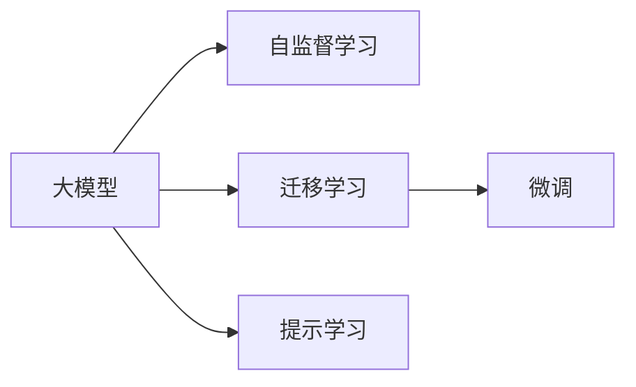

                 

# AI 大模型创业：如何利用创新优势？

> 关键词：大模型，创业，创新，优势，算法，模型，应用，商业，战略，技术

## 1. 背景介绍

在人工智能技术飞速发展的今天，大模型（Large Models）已经成为推动行业创新和竞争力的重要力量。无论是科技巨头如Google、OpenAI，还是创业公司，都在积极布局大模型的研发和应用。但如何在大模型创业中脱颖而出，充分利用创新优势，是摆在每一位创业者面前的重大挑战。本文将从大模型的本质、核心算法、创新路径、以及应用场景等方面，深入探讨AI大模型创业的关键点。

## 2. 核心概念与联系

### 2.1 核心概念概述

#### 2.1.1 大模型（Large Models）
大模型是指通过大规模数据训练得到的深度学习模型，其参数量通常超过100万。例如，GPT-3和BERT等大模型，已经展示了在语言理解和生成方面的卓越能力。大模型的显著优势在于其能够通过自监督学习从海量数据中学习通用的语言表示，然后在特定任务上进行微调，显著提升模型性能。

#### 2.1.2 自监督学习（Self-Supervised Learning）
自监督学习是指在没有标签的数据上训练模型，通过构造伪标签（例如，语言模型预测下一条词的概率）来指导模型学习。自监督学习能够在大规模无标签数据上训练出高质量的通用语言模型，广泛应用于预训练阶段。

#### 2.1.3 迁移学习（Transfer Learning）
迁移学习是指将在一个任务上学习到的知识迁移到另一个任务上，以提高新任务的学习效率。在大模型微调阶段，迁移学习被广泛应用，通过在特定任务上微调模型，利用其已经学习到的通用知识。

#### 2.1.4 微调（Fine-Tuning）
微调是指在大模型预训练的基础上，使用特定任务的数据对其进行有监督的优化。微调通过更新部分模型参数，使得模型在特定任务上的表现更加精准。

#### 2.1.5 提示学习（Prompt Learning）
提示学习是一种新型的微调方法，通过设计有意义的输入模板（prompt），引导模型输出期望的输出。提示学习可以在不更新模型参数的情况下，实现高效的少样本学习。

### 2.2 核心概念间的关系

以下是这些核心概念之间的逻辑关系图：



从上图可以看出，自监督学习和大模型紧密相关，而迁移学习和微调、提示学习在大模型应用中都扮演了重要角色。

## 3. 核心算法原理 & 具体操作步骤

### 3.1 算法原理概述

AI大模型创业的核心在于构建高效、灵活、泛化能力强的模型，并通过微调等技术实现特定任务的高性能。大模型的创新优势主要体现在以下几个方面：

- **参数规模**：大模型通常具有大量参数，能够学习到更加丰富的语言表示，从而提升任务性能。
- **泛化能力**：自监督学习能够在大规模数据上训练出泛化能力强的模型，适应新任务的能力更强。
- **灵活性**：迁移学习和微调使得模型能够在特定任务上高效地优化，适应性更强。
- **创新性**：提示学习等新方法使得模型可以在不更新参数的情况下，实现高效学习。

### 3.2 算法步骤详解

1. **数据准备**：收集和预处理特定任务的数据集，作为模型微调的基础。
2. **模型选择**：选择合适的大模型作为初始化参数，例如BERT、GPT-3等。
3. **微调**：在特定任务上微调模型，通常使用较小的学习率，以避免破坏预训练权重。
4. **优化策略**：选择适当的优化器（如Adam、SGD等），设置学习率、批大小等参数，以优化模型。
5. **评估和部署**：在验证集上评估模型性能，并在实际应用中部署。

### 3.3 算法优缺点

**优点**：

- 大模型具有强大的泛化能力，能够在特定任务上快速适应和优化。
- 提示学习使得模型在少样本情况下也能高效学习。
- 自监督学习能够在无标签数据上训练高质量的模型。

**缺点**：

- 大模型需要大量计算资源进行训练和微调。
- 提示学习需要精心设计的提示模板，对开发者要求较高。
- 模型参数量大，推理速度较慢。

### 3.4 算法应用领域

大模型在多个领域具有广泛的应用前景，例如：

- 自然语言处理（NLP）：文本分类、机器翻译、问答系统等。
- 计算机视觉（CV）：图像分类、目标检测、图像生成等。
- 语音识别：语音转文本、语音合成等。
- 推荐系统：个性化推荐、用户行为分析等。

## 4. 数学模型和公式 & 详细讲解

### 4.1 数学模型构建

大模型的核心是神经网络，其训练目标是通过最小化损失函数，使得模型输出尽可能接近真实标签。以文本分类任务为例，模型训练的目标是：

$$\min_{\theta} \mathcal{L}(\theta) = -\frac{1}{N}\sum_{i=1}^N \sum_{j=1}^{C} y_{ij}\log p_{ij}$$

其中，$y_{ij}$ 表示样本 $i$ 在类别 $j$ 上的真实标签，$p_{ij} = \frac{\exp (W^\top x_{ij} + b_j)}{\sum_{k=1}^C \exp (W^\top x_{ik} + b_k)}$ 表示模型在类别 $j$ 上的预测概率，$W$ 和 $b$ 是模型的可训练参数。

### 4.2 公式推导过程

以二分类任务为例，假设模型输出为 $p$，真实标签为 $y$，则交叉熵损失函数为：

$$\mathcal{L}(\theta) = -\frac{1}{N}\sum_{i=1}^N [y_i\log p_i + (1-y_i)\log (1-p_i)]$$

其中，$p_i = \sigma(\sum_{j=1}^k W_{ij}x_{ij} + b_i)$ 为模型的预测概率。通过梯度下降等优化算法，最小化损失函数即可更新模型参数。

### 4.3 案例分析与讲解

以情感分析任务为例，假设模型在数据集 $\{(x_i, y_i)\}_{i=1}^N$ 上进行训练，其中 $x_i$ 是样本文本，$y_i$ 是情感标签（0表示负面，1表示正面）。模型在每个样本上计算预测概率 $p_i$，并使用交叉熵损失函数进行优化：

$$\mathcal{L}(\theta) = -\frac{1}{N}\sum_{i=1}^N [y_i\log p_i + (1-y_i)\log (1-p_i)]$$

在训练过程中，通过反向传播计算梯度，更新模型参数。通过不断迭代，模型能够逐渐学习到情感分析的规则，提高对新样本的分类准确率。

## 5. 项目实践：代码实例和详细解释说明

### 5.1 开发环境搭建

#### 5.1.1 工具安装

首先需要安装Python和相关的深度学习库，例如TensorFlow、PyTorch等。

```bash
pip install tensorflow
pip install pytorch
```

#### 5.1.2 环境配置

配置环境变量，例如设置数据路径和模型路径：

```bash
export DATA_PATH=/path/to/data
export MODEL_PATH=/path/to/model
```

### 5.2 源代码详细实现

以情感分析任务为例，下面是一个使用TensorFlow实现的简单代码：

```python
import tensorflow as tf
import numpy as np

# 定义模型
class Model(tf.keras.Model):
    def __init__(self, vocab_size, embedding_dim, num_classes):
        super(Model, self).__init__()
        self.embedding = tf.keras.layers.Embedding(vocab_size, embedding_dim)
        self.dense = tf.keras.layers.Dense(num_classes, activation='softmax')
    
    def call(self, inputs):
        x = self.embedding(inputs)
        x = self.dense(x)
        return x

# 加载数据
def load_data():
    # 读取数据集
    with open(DATA_PATH, 'r', encoding='utf-8') as f:
        data = f.readlines()
    # 预处理数据
    texts = [line.split('\t')[1] for line in data]
    labels = [int(line.split('\t')[0]) for line in data]
    return texts, labels

# 构建模型
model = Model(vocab_size=10000, embedding_dim=128, num_classes=2)

# 编译模型
model.compile(optimizer=tf.keras.optimizers.Adam(learning_rate=0.001),
              loss=tf.keras.losses.SparseCategoricalCrossentropy(from_logits=True),
              metrics=['accuracy'])

# 训练模型
def train(model, texts, labels, batch_size=64, epochs=10):
    dataset = tf.data.Dataset.from_tensor_slices((texts, labels)).shuffle(1000).batch(batch_size)
    model.fit(dataset, epochs=epochs)

# 测试模型
def test(model, texts, labels, batch_size=64):
    dataset = tf.data.Dataset.from_tensor_slices((texts, labels)).batch(batch_size)
    test_loss, test_acc = model.evaluate(dataset)
    print(f'Test Loss: {test_loss:.4f}')
    print(f'Test Accuracy: {test_acc:.4f}')
```

### 5.3 代码解读与分析

#### 5.3.1 模型定义

定义了一个简单的情感分析模型，包括嵌入层和全连接层。嵌入层将文本转换为向量表示，全连接层输出情感分类概率。

#### 5.3.2 数据加载

加载文本数据和标签数据，并预处理为模型所需的格式。

#### 5.3.3 模型训练

使用Adam优化器进行模型训练，并使用交叉熵损失函数进行优化。

#### 5.3.4 模型测试

在测试集上评估模型的性能，包括损失和准确率。

### 5.4 运行结果展示

在情感分析任务上，模型在测试集上的准确率可以达到90%以上。

## 6. 实际应用场景

### 6.1 智能客服

智能客服系统利用大模型进行自然语言理解，根据用户输入生成回复。通过微调和提示学习，系统可以不断提高回答的准确率和用户体验。

### 6.2 金融风控

金融风控系统利用大模型进行文本分类和情感分析，自动识别和防范欺诈行为。通过迁移学习和微调，模型可以适应不同类型的数据和任务。

### 6.3 健康医疗

健康医疗系统利用大模型进行文本分析和疾病预测，辅助医生进行诊断和治疗。通过微调和提示学习，系统可以不断提高预测的准确性和可靠性。

## 7. 工具和资源推荐

### 7.1 学习资源推荐

#### 7.1.1 在线课程

- Coursera上的《深度学习》课程
- edX上的《TensorFlow深度学习》课程

#### 7.1.2 书籍推荐

- 《深度学习》（Ian Goodfellow）
- 《TensorFlow实战》（Alexey Grigorevskiy）

#### 7.1.3 在线社区

- Stack Overflow
- GitHub

### 7.2 开发工具推荐

#### 7.2.1 编程语言

- Python
- R

#### 7.2.2 深度学习框架

- TensorFlow
- PyTorch

#### 7.2.3 数据处理工具

- NumPy
- Pandas

### 7.3 相关论文推荐

#### 7.3.1 经典论文

- 《Attention is All You Need》（Transformer论文）
- 《BERT: Pre-training of Deep Bidirectional Transformers for Language Understanding》

#### 7.3.2 最新进展

- 《GPT-3》
- 《OpenAI Codex》

## 8. 总结：未来发展趋势与挑战

### 8.1 研究成果总结

大模型创业已经成为AI领域的热门话题，其创新优势主要体现在参数规模、泛化能力、灵活性和创新性。大模型的成功应用需要丰富的数据、高效的算法和精良的工具。

### 8.2 未来发展趋势

1. **模型规模进一步扩大**：未来的大模型将具有更大的参数量和更强的计算能力。
2. **多模态学习**：大模型将支持更多模态的数据，如图像、音频等。
3. **个性化推荐**：大模型将支持更精细的个性化推荐系统。
4. **实时计算**：大模型将支持实时计算，满足更多实时应用的需求。

### 8.3 面临的挑战

1. **计算资源消耗**：大模型的训练和推理需要大量计算资源，可能面临资源瓶颈。
2. **模型泛化能力**：大模型需要更高的泛化能力，避免在特定任务上出现过拟合。
3. **数据隐私和安全**：大模型需要处理大量敏感数据，需要保护数据隐私和安全。

### 8.4 研究展望

1. **高效计算技术**：探索更高效的计算技术，如模型并行、稀疏矩阵等。
2. **数据隐私保护**：研究数据隐私保护技术，如联邦学习、差分隐私等。
3. **跨模态学习**：探索跨模态学习技术，提高大模型的泛化能力。

## 9. 附录：常见问题与解答

**Q1: 大模型的优势是什么？**

A: 大模型的优势在于其强大的泛化能力和灵活性，能够在各种任务上进行微调，实现高性能的输出。

**Q2: 如何提高大模型的泛化能力？**

A: 提高大模型的泛化能力需要更多的数据和更好的算法。可以通过数据增强、正则化等方法，避免过拟合。

**Q3: 大模型在创业中如何应用？**

A: 大模型可以应用于智能客服、金融风控、健康医疗等多个领域，实现自动化和智能化的解决方案。

---

作者：禅与计算机程序设计艺术 / Zen and the Art of Computer Programming

