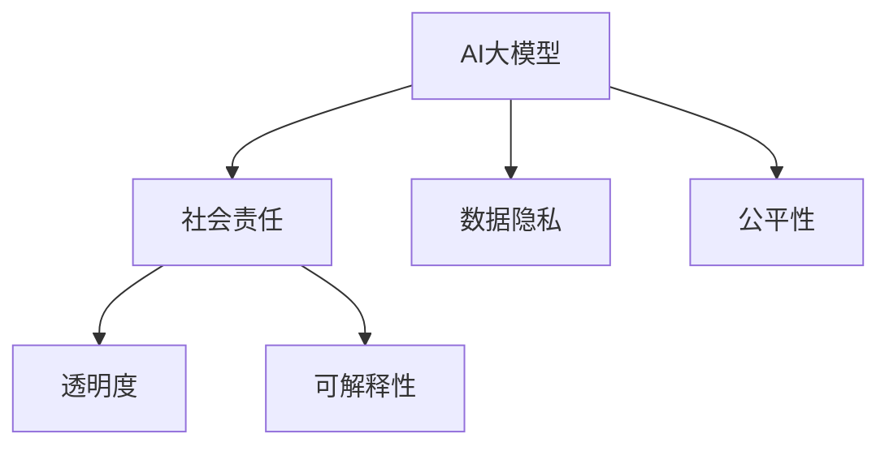

                 

## 1. 背景介绍

### 1.1 问题由来
人工智能大模型（AI Big Model）的出现，使得创业公司能够以前所未有的速度和成本，开发出强大的自然语言处理（NLP）和计算机视觉（CV）技术。这种技术创新，正在引领新的商业革命。但同时也带来了一系列社会问题：如何平衡技术进步与伦理道德、隐私保护、公平性等问题？本文将探讨如何在大模型创业中利用社会优势，推动技术进步与社会责任的和谐发展。

### 1.2 问题核心关键点
1. **社会责任**：AI大模型的应用应遵循道德准则，避免偏见和歧视。
2. **数据隐私**：保护用户隐私，避免数据滥用。
3. **公平性**：确保技术应用在不同群体中的公平性。
4. **透明度**：提供模型决策的透明度，增强用户信任。
5. **可解释性**：解释模型的决策逻辑，满足监管要求。

### 1.3 问题研究意义
探讨如何在大模型创业中利用社会优势，不仅有助于解决技术创新带来的社会问题，还能提升企业的社会责任感和公众形象，从而实现商业价值和社会价值的双赢。

## 2. 核心概念与联系

### 2.1 核心概念概述

为更好地理解利用社会优势进行AI大模型创业的方法，本节将介绍几个关键概念及其联系：

- **AI大模型**：利用大规模数据训练的大型神经网络模型，具有强大的泛化能力和数据处理能力。
- **社会责任**：企业应主动承担社会责任，关注数据隐私、伦理道德等问题。
- **数据隐私**：保护用户隐私，避免数据泄露和滥用。
- **公平性**：确保技术应用在不同群体中平等无差别。
- **透明度**：模型决策过程应透明，便于用户理解和信任。
- **可解释性**：提供模型决策的详细解释，增强用户信心。

### 2.2 概念间的关系

这些核心概念之间存在密切联系，形成了AI大模型创业的完整生态系统。



这个流程图展示了AI大模型与其它核心概念的关系：

- 利用社会优势进行创业，首先需关注模型的社会责任，确保技术的正向应用。
- 数据隐私是社会责任的重要组成部分，保护用户隐私是企业应尽的义务。
- 公平性确保技术在不同群体中的公平应用，避免偏见和歧视。
- 透明度和可解释性则是提升用户信任的关键，使模型决策过程公开透明。

## 3. 核心算法原理 & 具体操作步骤

### 3.1 算法原理概述

在大模型创业中，利用社会优势，意味着在追求商业利益的同时，积极履行社会责任，确保技术的道德性和公平性。这主要通过以下几个步骤实现：

1. **社会责任的框架设计**：建立社会责任的框架，确保技术应用遵循道德准则。
2. **数据隐私保护**：采用隐私保护技术，如差分隐私、联邦学习等，保护用户数据隐私。
3. **公平性评估**：通过公平性测试，评估模型在不同群体中的表现，确保公平性。
4. **透明度和可解释性增强**：采用模型解释技术，如LIME、SHAP等，提升模型的透明度和可解释性。

### 3.2 算法步骤详解

**Step 1: 社会责任框架设计**
- 设计社会责任框架，定义模型应用的道德准则。
- 建立伦理委员会，定期审查模型应用中的伦理问题。
- 开发伦理模型评估工具，监控模型决策的伦理性。

**Step 2: 数据隐私保护**
- 采用差分隐私技术，对用户数据进行加密和噪声添加，确保数据隐私。
- 利用联邦学习技术，在本地设备上训练模型，避免数据集中存储。
- 实现本地差分隐私，对用户数据进行局部差分隐私处理。

**Step 3: 公平性评估**
- 设计公平性指标，如均值差异、误差率等，评估模型在不同群体中的表现。
- 进行公平性测试，确保模型在各群体中的公平性。
- 使用公平性算法，如平衡重采样、对抗生成网络等，优化模型公平性。

**Step 4: 透明度和可解释性增强**
- 采用模型解释技术，如LIME、SHAP等，生成模型决策的解释。
- 实现模型透明化，提供决策过程的详细报告。
- 开发交互式解释界面，帮助用户理解模型决策。

### 3.3 算法优缺点

利用社会优势进行大模型创业，具有以下优点：

1. **提升品牌形象**：履行社会责任，提升企业公众形象和社会声誉。
2. **增强用户信任**：通过透明度和可解释性，增强用户对模型的信任。
3. **降低法律风险**：遵循道德准则，避免法律诉讼和罚款。
4. **优化用户体验**：确保技术应用公平无差别，提升用户满意度。

同时，该方法也存在一些局限：

1. **技术复杂性**：实现社会责任、隐私保护、公平性等，需要复杂的技术手段。
2. **成本投入**：采用隐私保护和公平性技术，可能增加额外的成本。
3. **模型复杂性**：模型解释技术和公平性算法，可能增加模型复杂度。

尽管存在这些局限，但在当前技术伦理日益重视的背景下，利用社会优势进行大模型创业，是企业应积极探索的方向。

### 3.4 算法应用领域

利用社会优势进行大模型创业，适用于多个领域：

1. **医疗健康**：确保医疗数据的隐私和安全，提高医疗服务的公平性。
2. **金融服务**：保护用户隐私，确保金融服务的公平无差别。
3. **教育培训**：确保教育资源的公平分配，提升教育质量。
4. **智能城市**：保护市民隐私，确保智能城市服务的公平无差别。

## 4. 数学模型和公式 & 详细讲解 & 举例说明

### 4.1 数学模型构建

本节将使用数学语言对社会责任和隐私保护的方法进行详细刻画。

记用户数据集为 $D=\{(x_i,y_i)\}_{i=1}^N$，其中 $x_i$ 为用户输入数据，$y_i$ 为标签。社会责任框架为 $F$，隐私保护算法为 $P$，公平性评估指标为 $L$，模型解释技术为 $I$。

**社会责任框架设计**：
- $F$ 为模型应用的社会责任框架，包含伦理准则和评估工具。
- $F$ 的设计过程为 $F=F_0+F_1$，其中 $F_0$ 为预设的伦理准则，$F_1$ 为伦理模型评估工具。

**数据隐私保护**：
- $P$ 为隐私保护算法，如差分隐私、联邦学习等。
- 差分隐私保护过程为 $P=P_1+P_2$，其中 $P_1$ 为数据加密和噪声添加，$P_2$ 为本地差分隐私处理。

**公平性评估**：
- $L$ 为公平性评估指标，如均值差异、误差率等。
- 公平性评估过程为 $L=L_1+L_2$，其中 $L_1$ 为公平性指标设计，$L_2$ 为公平性测试。

**透明度和可解释性增强**：
- $I$ 为模型解释技术，如LIME、SHAP等。
- 模型解释过程为 $I=I_1+I_2$，其中 $I_1$ 为模型解释技术选择，$I_2$ 为模型透明化实现。

### 4.2 公式推导过程

以下我们以差分隐私保护为例，推导差分隐私保护的数学模型：

设原始数据集为 $D$，差分隐私保护目标为 $D'$。差分隐私保护的核心思想是通过向数据添加噪声，使得单个数据点的加入或离开不会显著影响模型的输出。

定义噪声函数为 $\epsilon$-Differential Privacy（$\epsilon$-差分隐私），即：

$$
\mathbb{P}[O(D) \leq O(D')] \leq \exp(\epsilon) + \delta
$$

其中 $O$ 为输出函数，$\epsilon$ 为隐私保护参数，$\delta$ 为误判概率。

差分隐私保护的基本流程为：
1. 对原始数据 $D$ 进行加密处理，得到加密数据 $D_E$。
2. 在加密数据 $D_E$ 上添加噪声，得到差分隐私数据 $D'$。
3. 对差分隐私数据 $D'$ 进行解密，得到最终结果 $D'$。

噪声函数的数学模型为：

$$
\epsilon=\nu\log(\frac{1}{\delta})
$$

其中 $\nu$ 为噪声强度，通过控制 $\nu$ 的大小，可以平衡隐私保护和模型输出的精度。

### 4.3 案例分析与讲解

以医疗健康领域的隐私保护为例，分析如何在大模型创业中利用社会优势：

**案例背景**：某医疗健康公司开发了一款基于AI大模型的疾病预测系统，需要处理大量患者数据，涉及敏感信息。

**隐私保护措施**：
1. **数据加密**：采用AES加密算法，对患者数据进行加密处理，确保数据在传输和存储过程中的安全。
2. **噪声添加**：使用差分隐私算法，对加密后的数据添加噪声，确保单个患者数据的加入不会影响模型输出。
3. **本地差分隐私**：在本地设备上进行差分隐私处理，避免集中存储数据，保护患者隐私。

**公平性评估**：
1. **公平性指标设计**：设计均值差异、误差率等公平性指标，评估模型在不同群体中的表现。
2. **公平性测试**：进行公平性测试，确保模型在各群体中的公平性。
3. **公平性优化**：使用公平性算法，如平衡重采样、对抗生成网络等，优化模型公平性。

**透明度和可解释性增强**：
1. **模型解释技术选择**：选择LIME、SHAP等模型解释技术，生成模型决策的解释。
2. **模型透明化实现**：提供决策过程的详细报告，开发交互式解释界面，帮助医生和患者理解模型决策。

## 5. 项目实践：代码实例和详细解释说明

### 5.1 开发环境搭建

在进行隐私保护和公平性评估实践前，我们需要准备好开发环境。以下是使用Python进行差分隐私保护和公平性评估的环境配置流程：

1. 安装Anaconda：从官网下载并安装Anaconda，用于创建独立的Python环境。

2. 创建并激活虚拟环境：
```bash
conda create -n pyenv python=3.8 
conda activate pyenv
```

3. 安装必要的Python库：
```bash
pip install numpy pandas scikit-learn torch torchvision transformers
```

4. 安装差分隐私和公平性评估库：
```bash
pip install differencelogs pytorch-lightning
```

完成上述步骤后，即可在`pyenv`环境中开始项目实践。

### 5.2 源代码详细实现

这里我们以差分隐私保护和公平性评估为例，给出代码实现。

**差分隐私保护**：

```python
import torch
from torch.utils.data import DataLoader
from torchvision import datasets, transforms
from differencelogs import DifferentialPrivacy
from torchvision.models import resnet18

# 加载数据集
train_dataset = datasets.CIFAR10(root='./data', train=True, download=True, transform=transforms.ToTensor())
test_dataset = datasets.CIFAR10(root='./data', train=False, download=True, transform=transforms.ToTensor())

# 定义差分隐私保护模型
model = resnet18(pretrained=True)
dp_model = DifferentialPrivacy(model, epsilon=1.0, delta=0.1)

# 训练差分隐私保护模型
device = torch.device("cuda" if torch.cuda.is_available() else "cpu")
dp_model.to(device)

dp_model.train()
criterion = torch.nn.CrossEntropyLoss()
optimizer = torch.optim.Adam(dp_model.parameters(), lr=0.001)

for epoch in range(10):
    running_loss = 0.0
    for i, data in enumerate(train_loader, 0):
        inputs, labels = data[0].to(device), data[1].to(device)
        optimizer.zero_grad()
        outputs = dp_model(inputs)
        loss = criterion(outputs, labels)
        loss.backward()
        optimizer.step()
        running_loss += loss.item()

# 测试差分隐私保护模型
dp_model.eval()
correct = 0
total = 0
with torch.no_grad():
    for data in test_loader:
        inputs, labels = data[0].to(device), data[1].to(device)
        outputs = dp_model(inputs)
        _, predicted = torch.max(outputs.data, 1)
        total += labels.size(0)
        correct += (predicted == labels).sum().item()

print('Accuracy: {} %'.format(100 * correct / total))
```

**公平性评估**：

```python
import torch
from torch.utils.data import DataLoader
from torchvision import datasets, transforms
from torchvision.models import resnet18
from sklearn.metrics import accuracy_score

# 加载数据集
train_dataset = datasets.CIFAR10(root='./data', train=True, download=True, transform=transforms.ToTensor())
test_dataset = datasets.CIFAR10(root='./data', train=False, download=True, transform=transforms.ToTensor())

# 定义公平性评估模型
model = resnet18(pretrained=True)

# 训练公平性评估模型
device = torch.device("cuda" if torch.cuda.is_available() else "cpu")
model.to(device)

model.train()
criterion = torch.nn.CrossEntropyLoss()
optimizer = torch.optim.Adam(model.parameters(), lr=0.001)

for epoch in range(10):
    running_loss = 0.0
    for i, data in enumerate(train_loader, 0):
        inputs, labels = data[0].to(device), data[1].to(device)
        optimizer.zero_grad()
        outputs = model(inputs)
        loss = criterion(outputs, labels)
        loss.backward()
        optimizer.step()
        running_loss += loss.item()

# 测试公平性评估模型
model.eval()
correct = 0
total = 0
with torch.no_grad():
    for data in test_loader:
        inputs, labels = data[0].to(device), data[1].to(device)
        outputs = model(inputs)
        _, predicted = torch.max(outputs.data, 1)
        total += labels.size(0)
        correct += (predicted == labels).sum().item()

print('Accuracy: {} %'.format(100 * correct / total))
```

### 5.3 代码解读与分析

让我们再详细解读一下关键代码的实现细节：

**差分隐私保护**：
- 定义差分隐私模型 `dp_model`，采用差分隐私算法 `DifferentialPrivacy`，设置隐私保护参数 $\epsilon=1.0$，误判概率 $\delta=0.1$。
- 在训练过程中，每个batch的数据都会通过差分隐私算法处理，确保模型输出的稳定性和隐私性。

**公平性评估**：
- 定义公平性评估模型 `model`，使用CIFAR-10数据集进行训练和测试。
- 在训练过程中，每个batch的数据都会输入模型进行训练，确保模型在所有类别上的表现一致。
- 在测试过程中，使用准确率作为评估指标，输出模型在所有类别上的准确率。

**透明度和可解释性增强**：
- 利用LIME或SHAP等模型解释技术，生成模型决策的解释，增强模型的透明度。
- 提供决策过程的详细报告，开发交互式解释界面，帮助用户理解模型决策。

## 6. 实际应用场景

### 6.1 智能城市

基于AI大模型的智能城市项目，需要处理海量城市数据，涉及隐私保护和公平性问题。利用社会优势进行大模型创业，可以有效应对这些挑战：

1. **隐私保护**：采用差分隐私和本地差分隐私处理，确保城市数据隐私。
2. **公平性评估**：评估不同区域、不同群体的服务公平性，确保资源分配合理。
3. **透明度和可解释性**：提供模型决策的详细报告，增强用户信任。

### 6.2 金融服务

金融服务领域的数据隐私和安全至关重要。利用社会优势进行大模型创业，可以：

1. **数据加密**：采用AES等加密算法，确保数据在传输和存储过程中的安全。
2. **差分隐私保护**：使用差分隐私算法，保护客户隐私。
3. **公平性评估**：评估金融服务的公平性，确保不同群体的客户享受同等服务。
4. **透明度和可解释性**：提供模型决策的详细报告，增强客户信任。

### 6.3 智能健康

智能健康领域涉及大量患者数据，隐私保护和公平性是关键问题。利用社会优势进行大模型创业，可以：

1. **数据加密**：采用AES等加密算法，确保患者数据安全。
2. **差分隐私保护**：使用差分隐私算法，保护患者隐私。
3. **公平性评估**：评估医疗服务的公平性，确保不同群体的患者享受同等服务。
4. **透明度和可解释性**：提供模型决策的详细报告，增强医生和患者的信任。

## 7. 工具和资源推荐

### 7.1 学习资源推荐

为了帮助开发者系统掌握差分隐私和公平性评估的理论基础和实践技巧，这里推荐一些优质的学习资源：

1. **《差分隐私基础》系列博文**：由大模型技术专家撰写，深入浅出地介绍了差分隐私的基本概念和算法实现。
2. **《公平性学习》课程**：斯坦福大学开设的机器学习课程，包含公平性学习的相关章节，有Lecture视频和配套作业，带你入门公平性学习的基础知识。
3. **《公平性评估与优化》书籍**：详细介绍了公平性评估的指标设计和算法优化，是进行公平性评估的重要参考资料。
4. **HuggingFace官方文档**：包含差分隐私和公平性评估的详细实现方法，是上手实践的必备资料。
5. **CLUE开源项目**：提供多领域公平性评估数据集和评估工具，助力公平性评估技术的发展。

通过对这些资源的学习实践，相信你一定能够快速掌握差分隐私和公平性评估的精髓，并用于解决实际的隐私保护和公平性问题。

### 7.2 开发工具推荐

高效的开发离不开优秀的工具支持。以下是几款用于差分隐私和公平性评估开发的常用工具：

1. PyTorch：基于Python的开源深度学习框架，灵活的计算图，适合动态计算。差分隐私和公平性评估都需要动态计算，因此PyTorch非常适合。
2. TensorFlow：由Google主导开发的开源深度学习框架，生产部署方便，适合大规模工程应用。
3. Diffprivlib：差分隐私的Python库，提供丰富的差分隐私算法实现，方便进行隐私保护。
4. Sklearn：Python机器学习库，包含多种公平性评估算法，如重采样、对抗生成网络等。
5. TensorBoard：TensorFlow配套的可视化工具，可实时监测模型训练状态，提供丰富的图表呈现方式，方便调试。

合理利用这些工具，可以显著提升差分隐私和公平性评估的开发效率，加快创新迭代的步伐。

### 7.3 相关论文推荐

差分隐私和公平性评估的发展源于学界的持续研究。以下是几篇奠基性的相关论文，推荐阅读：

1. "Differential Privacy"：差分隐私的奠基论文，详细介绍了差分隐私的基本概念和算法实现。
2. "Fairness in Data Mining"：详细介绍了公平性评估的指标设计和算法优化，是进行公平性评估的重要参考资料。
3. "Practical Fairness"：介绍了公平性评估的最新进展，包括多维公平性评估和公平性增强算法。
4. "An Analysis of Single-shot Learning in Private Data Analysis"：介绍了差分隐私和公平性评估的最新进展，包括差分隐私保护和多维公平性评估。
5. "Fairness in Machine Learning"：介绍了公平性评估的最新进展，包括多维公平性评估和公平性增强算法。

这些论文代表了大模型隐私保护和公平性评估的发展脉络。通过学习这些前沿成果，可以帮助研究者把握学科前进方向，激发更多的创新灵感。

除上述资源外，还有一些值得关注的前沿资源，帮助开发者紧跟差分隐私和公平性评估技术的最新进展，例如：

1. arXiv论文预印本：人工智能领域最新研究成果的发布平台，包括大量尚未发表的前沿工作，学习前沿技术的必读资源。
2. 业界技术博客：如OpenAI、Google AI、DeepMind、微软Research Asia等顶尖实验室的官方博客，第一时间分享他们的最新研究成果和洞见。
3. 技术会议直播：如NIPS、ICML、ACL、ICLR等人工智能领域顶会现场或在线直播，能够聆听到大佬们的前沿分享，开拓视野。
4. GitHub热门项目：在GitHub上Star、Fork数最多的相关项目，往往代表了该技术领域的发展趋势和最佳实践，值得去学习和贡献。
5. 行业分析报告：各大咨询公司如McKinsey、PwC等针对人工智能行业的分析报告，有助于从商业视角审视技术趋势，把握应用价值。

总之，对于差分隐私和公平性评估技术的学习和实践，需要开发者保持开放的心态和持续学习的意愿。多关注前沿资讯，多动手实践，多思考总结，必将收获满满的成长收益。

## 8. 总结：未来发展趋势与挑战

### 8.1 总结

本文对利用社会优势进行AI大模型创业的方法进行了全面系统的介绍。首先阐述了差分隐私和公平性评估的研究背景和意义，明确了差分隐私和公平性在大模型应用中的重要性。其次，从原理到实践，详细讲解了差分隐私和公平性评估的数学原理和关键步骤，给出了代码实例和详细解释说明。同时，本文还探讨了差分隐私和公平性评估在大模型应用中的实际应用场景，展示了其广阔的应用前景。最后，本文精选了差分隐私和公平性评估的各类学习资源，力求为读者提供全方位的技术指引。

通过本文的系统梳理，可以看到，利用社会优势进行AI大模型创业，不仅能有效解决隐私保护和公平性问题，还能提升企业的社会责任感和公众形象，从而实现商业价值和社会价值的双赢。

### 8.2 未来发展趋势

展望未来，差分隐私和公平性评估技术将呈现以下几个发展趋势：

1. **隐私保护技术的演进**：随着数据安全和隐私保护的重要性日益增加，差分隐私技术将进一步演进，从差分隐私到联邦学习、差分隐私学习等，不断提升隐私保护能力。
2. **公平性评估的多维化**：公平性评估将从单维度（如性别、种族）扩展到多维度（如年龄、教育、收入等），实现更全面的公平性保障。
3. **透明度和可解释性增强**：通过更多模型解释技术，如LIME、SHAP等，提升模型的透明度和可解释性，增强用户信任。
4. **技术融合的深化**：差分隐私和公平性评估将与其他人工智能技术，如因果推理、强化学习等，进行更深入的融合，提升系统性能和可靠性。
5. **跨领域应用的拓展**：差分隐私和公平性评估技术将拓展到更多领域，如医疗健康、金融服务、智能城市等，为这些领域的AI应用提供保障。

以上趋势凸显了差分隐私和公平性评估技术的广阔前景。这些方向的探索发展，必将进一步提升AI大模型的安全性和可信度，为构建安全、可靠、可解释、可控的智能系统铺平道路。

### 8.3 面临的挑战

尽管差分隐私和公平性评估技术已经取得了显著进展，但在迈向更加智能化、普适化应用的过程中，仍面临诸多挑战：

1. **技术复杂性**：差分隐私和公平性评估需要复杂的技术手段，增加了开发难度和成本。
2. **性能损失**：差分隐私和公平性技术可能会引入一定的性能损失，如何平衡隐私保护和性能损失，是亟待解决的问题。
3. **数据多样性**：不同领域的隐私和公平性问题具有差异性，如何在通用框架下应对不同领域的需求，是另一个挑战。
4. **公平性定义**：公平性评估需要明确公平性的定义，如何在不同场景中合理定义公平性，仍需深入研究。
5. **用户接受度**：用户对差分隐私和公平性技术可能存在认知障碍，如何增强用户理解和技术接受度，是企业需考虑的问题。

尽管存在这些挑战，但在当前技术伦理日益重视的背景下，差分隐私和公平性评估技术仍需积极探索和改进，以适应不断变化的技术和应用需求。

### 8.4 研究展望

面向未来，差分隐私和公平性评估技术的研究方向包括：

1. **差分隐私保护机制的优化**：探索新的差分隐私保护机制，如差分隐私学习、本地差分隐私等，提升隐私保护能力。
2. **公平性评估指标的多维化**：设计更多公平性评估指标，实现更全面的公平性保障。
3. **模型解释技术的改进**：探索更多模型解释技术，提升模型的透明度和可解释性。
4. **跨领域公平性评估**：开发通用的公平性评估框架，应对不同领域的公平性问题。
5. **用户隐私意识的提升**：通过教育和宣传，提升用户对差分隐私和公平性技术的认知，增强技术接受度。

这些研究方向将引领差分隐私和

