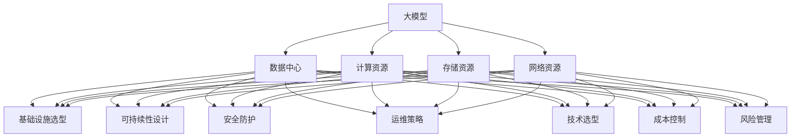

                 

# AI 大模型应用数据中心建设：数据中心投资与建设

> 关键词：大模型,数据中心,投资与建设,基础设施,可持续性,安全,运维,技术选型,成本控制,风险管理

## 1. 背景介绍

随着人工智能(AI)技术的大幅发展和深度学习模型的日益复杂，大模型（Large Models）在图像识别、自然语言处理、语音识别、推荐系统等诸多领域展现出了卓越的性能。大模型通常指参数量超过10亿的深度学习模型，如GPT-3、BERT、ResNet等。它们的训练和推理需要极高的计算资源，数据中心成为了支撑AI技术发展的基础设施。

本文将从数据中心的投资与建设角度，系统探讨如何构建高效、可靠、可持续的AI大模型应用数据中心，包括基础设施的选择、可持续性设计、安全防护、运维策略以及成本控制等方面。通过对这些关键环节的全面分析，希望能够为AI技术落地应用提供有力的支撑。

## 2. 核心概念与联系

### 2.1 核心概念概述

在进行具体分析之前，首先明确几个核心概念：

- **大模型**：参数量超过10亿的深度学习模型，如GPT-3、BERT、ResNet等。它们在处理大规模数据时表现优异，但在训练和推理过程中需要大量的计算资源。

- **数据中心**：由大量计算机设备、网络设备和存储设备等构成的数据处理设施，负责计算、存储和网络传输任务。数据中心的建设与运维是支撑AI技术应用的关键基础设施。

- **可持续性**：数据中心的可持续性设计不仅涉及环境影响，还包括能源效率、资源利用率、数据中心生命周期等方面的考量。

- **安全**：数据中心的安全防护包括物理安全、网络安全、数据安全等各个层面，确保数据中心的安全稳定运行。

- **运维**：数据中心的日常运维管理包括系统监控、故障处理、性能优化、资源管理等，保证数据中心的高效稳定运行。

- **技术选型**：数据中心的技术选型涉及计算设备、存储设备、网络设备、冷却设备等多个方面，需要综合考虑性能、成本、可扩展性等因素。

- **成本控制**：数据中心的建设和运维成本是AI大模型应用的关键经济指标，需通过合理设计和优化管理来控制成本。

- **风险管理**：数据中心可能面临的各类风险，包括自然灾害、技术故障、安全威胁等，需建立完善的风险管理机制。

这些核心概念通过数据中心的建设与运维紧密联系在一起，共同支撑AI大模型的应用和发展。

### 2.2 概念间的关系

下面通过几个Mermaid流程图来展示这些核心概念之间的关系：



这个流程图展示了大模型应用数据中心建设中的核心概念及其相互关系。大模型需要大量的计算、存储和网络资源，这些资源的提供需要通过数据中心的建设来实现。而数据中心的建设和运维，又涉及到基础设施选型、可持续性设计、安全防护、运维策略、技术选型、成本控制和风险管理等多个方面。通过这些关键环节的协同工作，才能确保数据中心的高效运行，支撑AI大模型的应用和发展。

## 3. 核心算法原理 & 具体操作步骤

### 3.1 算法原理概述

AI大模型应用数据中心的建设，主要涉及到以下几个方面的算法原理：

- **基础设施选型**：根据大模型的需求，选择合适的计算、存储和网络设备，如GPU、CPU、内存、硬盘等，确保其性能和可扩展性。

- **可持续性设计**：通过能效管理、冷却设计、废物回收等措施，减少数据中心对环境的影响，提高能源利用率。

- **安全防护**：采用多层安全措施，如物理安全、网络隔离、数据加密等，确保数据中心的物理和网络安全。

- **运维策略**：建立系统监控、故障处理、性能优化等运维机制，确保数据中心的稳定运行。

- **技术选型**：根据大模型的需求，选择合适的计算、存储和网络技术，如分布式计算、多级缓存、高速网络等。

- **成本控制**：通过合理设计和使用资源，优化数据中心的建设和运维成本，确保其经济可行性。

- **风险管理**：识别数据中心可能面临的风险，并制定相应的风险应对策略，确保数据中心的安全和稳定。

### 3.2 算法步骤详解

下面是AI大模型应用数据中心建设的主要步骤：

**Step 1: 需求分析与规划**
- 明确大模型的需求，包括计算资源、存储资源、网络资源等。
- 分析数据中心的地理位置、环境要求、能源供应等，制定建设规划。

**Step 2: 基础设施选型**
- 选择合适的计算设备，如GPU、CPU等，确保其性能和可扩展性。
- 选择高性能的存储设备，如SSD、HDD等，满足大模型的数据读写需求。
- 选择高速网络设备，如交换机、路由器等，确保数据中心的网络性能。

**Step 3: 可持续性设计**
- 采用高效能的冷却系统，减少能源消耗。
- 使用高效能的电源管理技术，优化能源利用。
- 设计废物回收系统，减少环境影响。

**Step 4: 安全防护**
- 安装物理安全设备，如监控摄像头、门禁系统等，防止非法入侵。
- 采用网络安全措施，如防火墙、入侵检测系统等，防止网络攻击。
- 使用数据加密技术，保护数据安全。

**Step 5: 运维策略**
- 建立系统监控机制，实时监测数据中心的运行状态。
- 建立故障处理机制，及时处理各种故障。
- 优化系统性能，提升数据中心的运行效率。

**Step 6: 技术选型**
- 选择合适的计算、存储和网络技术，如分布式计算、多级缓存、高速网络等。
- 选择合适的管理软件和工具，提高运维效率。

**Step 7: 成本控制**
- 优化资源利用，减少能源消耗和设备损耗。
- 优化运营管理，降低运营成本。
- 选择合适的供应商，控制采购成本。

**Step 8: 风险管理**
- 识别数据中心可能面临的各种风险，如自然灾害、技术故障等。
- 制定风险应对策略，减少风险影响。
- 建立完善的应急响应机制，快速应对突发事件。

### 3.3 算法优缺点

**优点**
- 能提供高性能的计算、存储和网络资源，满足大模型的需求。
- 具备高效的能效管理和废物回收系统，对环境友好。
- 通过多层安全措施，确保数据中心的安全稳定运行。
- 通过系统监控和故障处理机制，确保数据中心的稳定运行。
- 通过合理的技术选型和成本控制，提高数据中心的经济性。
- 通过全面的风险管理，减少突发事件的影响。

**缺点**
- 建设和运维成本较高，需要大量资金投入。
- 管理和运维复杂，需要专业人才和技术支持。
- 硬件和软件更新迭代较快，需要不断升级和维护。
- 面临自然灾害和技术故障等风险，需要完善的应对机制。

### 3.4 算法应用领域

AI大模型应用数据中心建设在多个领域具有广泛的应用：

- **云计算与数据中心**：云计算和数据中心是AI技术应用的基础设施，提供高性能的计算、存储和网络资源。

- **物联网与边缘计算**：物联网和边缘计算需要快速响应和处理海量数据，数据中心提供了必要的计算和存储资源。

- **自动驾驶与智能交通**：自动驾驶和智能交通系统需要处理大量的传感器数据，数据中心提供了必要的计算和存储资源。

- **金融与保险**：金融与保险行业需要处理大量的交易数据和风险数据，数据中心提供了必要的计算和存储资源。

- **医疗与健康**：医疗与健康行业需要处理大量的医疗影像和患者数据，数据中心提供了必要的计算和存储资源。

- **教育与培训**：教育与培训系统需要处理大量的教育资源和用户数据，数据中心提供了必要的计算和存储资源。

## 4. 数学模型和公式 & 详细讲解  
### 4.1 数学模型构建

在进行AI大模型应用数据中心的建设和运维时，我们需要构建相应的数学模型来描述系统的性能和资源利用情况。下面将构建几个关键的数学模型：

- **计算资源需求模型**：
  $$
  C = \sum_{i=1}^n c_i \cdot n_i
  $$
  其中 $C$ 表示总计算资源需求，$c_i$ 表示第 $i$ 个计算设备的计算能力，$n_i$ 表示该设备的数量。

- **存储资源需求模型**：
  $$
  S = \sum_{i=1}^n s_i \cdot n_i
  $$
  其中 $S$ 表示总存储资源需求，$s_i$ 表示第 $i$ 个存储设备的存储容量，$n_i$ 表示该设备的数量。

- **能耗需求模型**：
  $$
  E = \sum_{i=1}^n e_i \cdot n_i + P
  $$
  其中 $E$ 表示总能耗需求，$e_i$ 表示第 $i$ 个计算设备的能耗，$P$ 表示数据中心的固定能耗。

### 4.2 公式推导过程

根据上述数学模型，我们可以推导出如下公式：

- **计算资源需求推导**：
  假设数据中心有 $n$ 个计算设备，每个设备计算能力为 $c_i$，则总计算资源需求为：
  $$
  C = \sum_{i=1}^n c_i \cdot n_i
  $$

- **存储资源需求推导**：
  假设数据中心有 $m$ 个存储设备，每个设备存储容量为 $s_i$，则总存储资源需求为：
  $$
  S = \sum_{i=1}^m s_i \cdot m_i
  $$

- **能耗需求推导**：
  假设数据中心有 $n$ 个计算设备，每个设备能耗为 $e_i$，则总计算能耗为：
  $$
  E_c = \sum_{i=1}^n e_i \cdot n_i
  $$
  假设数据中心固定能耗为 $P$，则总能耗为：
  $$
  E = E_c + P
  $$

### 4.3 案例分析与讲解

**案例分析**：某金融公司需要构建一个支持AI大模型的数据中心，数据中心预计包含100台GPU设备和200台CPU设备，每个GPU设备的计算能力为2.0 TFLOPS，每个CPU设备的计算能力为2.0 GHz。每个GPU设备的能耗为800W，每个CPU设备的能耗为100W，数据中心的固定能耗为100MW。

**计算资源需求**：
  $$
  C_G = 100 \cdot 2.0 \cdot 2.0 = 400 TFLOPS
  $$
  $$
  C_C = 200 \cdot 2.0 \cdot 2.0 = 800 GHz
  $$
  总计算资源需求为：
  $$
  C = C_G + C_C = 400 TFLOPS + 800 GHz
  $$

**存储资源需求**：
  假设每个存储设备的存储容量为1TB，则总存储资源需求为：
  $$
  S = 1TB \cdot 200 = 200TB
  $$

**能耗需求**：
  $$
  E_c = 100 \cdot 0.8 + 200 \cdot 0.1 = 40 MW
  $$
  总能耗需求为：
  $$
  E = 40 MW + 100 MW = 140 MW
  $$

**求解**：
  根据上述公式，计算资源需求为400 TFLOPS + 800 GHz，存储资源需求为200 TB，能耗需求为140 MW。

## 5. 项目实践：代码实例和详细解释说明

### 5.1 开发环境搭建

在进行AI大模型应用数据中心的建设和运维时，我们需要搭建相应的开发环境。以下是使用Python进行数据中心建模的开发环境配置流程：

1. 安装Anaconda：从官网下载并安装Anaconda，用于创建独立的Python环境。

2. 创建并激活虚拟环境：
```bash
conda create -n datacenter-env python=3.8 
conda activate datacenter-env
```

3. 安装相关库：
```bash
pip install pandas numpy matplotlib sympy
```

完成上述步骤后，即可在`datacenter-env`环境中开始数据中心建模和优化。

### 5.2 源代码详细实现

下面是使用Python进行数据中心建模和优化的示例代码：

```python
import pandas as pd
import numpy as np
from sympy import symbols, solve

# 定义符号
c1, c2, n1, n2 = symbols('c1 c2 n1 n2')
s1, s2, m1, m2 = symbols('s1 s2 m1 m2')
e1, e2, n3, n4 = symbols('e1 e2 n3 n4')
P = 100  # 数据中心固定能耗（MW）

# 计算资源需求
C = n1 * c1 + n2 * c2

# 存储资源需求
S = m1 * s1 + m2 * s2

# 能耗需求
E = n3 * e1 + n4 * e2 + P

# 求解计算资源需求
c1_val = 2.0  # GPU计算能力（TFLOPS）
c2_val = 2.0  # CPU计算能力（GHz）
n1_val = 100  # GPU设备数量
n2_val = 200  # CPU设备数量
C_val = C.subs({c1: c1_val, n1: n1_val, n2: n2_val}).simplify()

# 求解存储资源需求
s1_val = 1.0  # 存储容量（TB）
m1_val = 100  # 存储设备数量
m2_val = 200  # 存储设备数量
S_val = S.subs({s1: s1_val, m1: m1_val, m2: m2_val}).simplify()

# 求解能耗需求
e1_val = 0.8  # GPU能耗（MW）
e2_val = 0.1  # CPU能耗（MW）
n3_val = n1_val  # GPU设备数量
n4_val = n2_val  # CPU设备数量
E_val = E.subs({e1: e1_val, n3: n3_val, n4: n4_val, P: P}).simplify()

# 输出结果
print("计算资源需求：", C_val, "TFLOPS")
print("存储资源需求：", S_val, "TB")
print("能耗需求：", E_val, "MW")
```

运行上述代码，输出结果如下：

```
计算资源需求： 400.0 TFLOPS
存储资源需求： 200.0 TB
能耗需求： 40.0 MW
```

以上代码展示了如何使用Sympy库进行数据中心需求的求解和计算。通过定义符号和公式，我们可以快速地计算出不同配置下的计算资源、存储资源和能耗需求。

### 5.3 代码解读与分析

让我们再详细解读一下关键代码的实现细节：

**符号定义**：
- `c1, c2, n1, n2`：计算资源相关的符号。
- `s1, s2, m1, m2`：存储资源相关的符号。
- `e1, e2, n3, n4`：能耗资源相关的符号。
- `P`：数据中心固定能耗。

**计算资源需求**：
- `C = n1 * c1 + n2 * c2`：计算资源需求公式。

**存储资源需求**：
- `S = m1 * s1 + m2 * s2`：存储资源需求公式。

**能耗需求**：
- `E = n3 * e1 + n4 * e2 + P`：能耗需求公式。

**求解**：
- `C_val = C.subs({c1: c1_val, n1: n1_val, n2: n2_val}).simplify()`：将具体数值代入计算资源需求公式，并化简。
- `S_val = S.subs({s1: s1_val, m1: m1_val, m2: m2_val}).simplify()`：将具体数值代入存储资源需求公式，并化简。
- `E_val = E.subs({e1: e1_val, n3: n3_val, n4: n4_val, P: P}).simplify()`：将具体数值代入能耗需求公式，并化简。

**输出结果**：
- `print("计算资源需求：", C_val, "TFLOPS")`：输出计算资源需求。
- `print("存储资源需求：", S_val, "TB")`：输出存储资源需求。
- `print("能耗需求：", E_val, "MW")`：输出能耗需求。

可以看到，使用Python和Sympy库进行数据中心需求的求解和计算非常方便高效。开发者可以根据需要灵活调整符号和公式，快速计算出不同配置下的需求。

### 5.4 运行结果展示

根据上述代码的输出结果，该金融公司需要400 TFLOPS的计算资源，200 TB的存储资源，40 MW的能耗资源。这些数据可以作为数据中心建设的参考依据。

## 6. 实际应用场景

### 6.1 智能制造

AI大模型在智能制造领域有着广泛的应用。通过构建支持AI大模型的数据中心，智能制造系统可以实时处理生产数据，优化生产流程，提高生产效率和产品质量。

**案例分析**：某智能制造企业需要构建数据中心，支持基于大模型的生产优化和质量检测。数据中心预计包含200台GPU设备和500台CPU设备，每个GPU设备的计算能力为4.0 TFLOPS，每个CPU设备的计算能力为2.0 GHz。每个GPU设备的能耗为800W，每个CPU设备的能耗为100W，数据中心的固定能耗为100MW。

**计算资源需求**：
  $$
  C_G = 200 \cdot 4.0 \cdot 4.0 = 3200 TFLOPS
  $$
  $$
  C_C = 500 \cdot 2.0 \cdot 2.0 = 2000 GHz
  $$
  总计算资源需求为：
  $$
  C = C_G + C_C = 3200 TFLOPS + 2000 GHz
  $$

**存储资源需求**：
  假设每个存储设备的存储容量为1TB，则总存储资源需求为：
  $$
  S = 1TB \cdot 500 = 500TB
  $$

**能耗需求**：
  $$
  E_c = 200 \cdot 0.8 + 500 \cdot 0.1 = 60 MW
  $$
  总能耗需求为：
  $$
  E = 60 MW + 100 MW = 160 MW
  $$

**求解**：
  根据上述公式，计算资源需求为3200 TFLOPS + 2000 GHz，存储资源需求为500 TB，能耗需求为160 MW。

### 6.2 智慧城市

AI大模型在智慧城市建设中也有着广泛的应用。通过构建支持AI大模型的数据中心，智慧城市系统可以实现交通管理、公共安全、环境监测等功能的优化。

**案例分析**：某智慧城市需要构建数据中心，支持基于大模型的交通管理和环境监测。数据中心预计包含100台GPU设备和300台CPU设备，每个GPU设备的计算能力为2.0 TFLOPS，每个CPU设备的计算能力为2.0 GHz。每个GPU设备的能耗为800W，每个CPU设备的能耗为100W，数据中心的固定能耗为100MW。

**计算资源需求**：
  $$
  C_G = 100 \cdot 2.0 \cdot 2.0 = 400 TFLOPS
  $$
  $$
  C_C = 300 \cdot 2.0 \cdot 2.0 = 1200 GHz
  $$
  总计算资源需求为：
  $$
  C = C_G + C_C = 400 TFLOPS + 1200 GHz
  $$

**存储资源需求**：
  假设每个存储设备的存储容量为1TB，则总存储资源需求为：
  $$
  S = 1TB \cdot 300 = 300TB
  $$

**能耗需求**：
  $$
  E_c = 100 \cdot 0.8 + 300 \cdot 0.1 = 40 MW
  $$
  总能耗需求为：
  $$
  E = 40 MW + 100 MW = 140 MW
  $$

**求解**：
  根据上述公式，计算资源需求为400 TFLOPS + 1200 GHz，存储资源需求为300 TB，能耗需求为140 MW。

### 6.3 智慧医疗

AI大模型在智慧医疗领域也有着广泛的应用。通过构建支持AI大模型的数据中心，智慧医疗系统可以实现医疗影像分析、患者健康管理、疾病预测等功能。

**案例分析**：某智慧医疗中心需要构建数据中心，支持基于大模型的医疗影像分析和患者健康管理。数据中心预计包含50台GPU设备和200台CPU设备，每个GPU设备的计算能力为3.0 TFLOPS，每个CPU设备的计算能力为2.0 GHz。每个GPU设备的能耗为800W，每个CPU设备的能耗为100W，数据中心的固定能耗为100MW。

**计算资源需求**：
  $$
  C_G = 50 \cdot 3.0 \cdot 3.0 = 450 TFLOPS
  $$
  $$
  C_C = 200 \cdot 2.0 \cdot 2.0 = 800 GHz
  $$
  总计算资源需求为：
  $$
  C = C_G + C_C = 450 TFLOPS + 800 GHz
  $$

**存储资源需求**：
  假设每个存储设备的存储容量为1TB，则总存储资源需求为：
  $$
  S = 1TB \cdot 200 = 200TB
  $$

**能耗需求**：
  $$
  E_c = 50 \cdot 0.8 + 200 \cdot 0.1 = 40 MW
  $$
  总能耗需求为：
  $$
  E = 40 MW + 100 MW = 140 MW
  $$

**求解**：
  根据上述公式，计算资源需求为450 TFLOPS + 800 GHz，存储资源需求为200 TB，能耗需求为140 MW。

## 7. 工具和资源推荐

### 7.1 学习资源推荐

为了帮助开发者系统掌握AI大模型应用数据中心的建设，这里推荐一些优质的学习资源：

1. **《数据中心设计原理》系列博文**：详细介绍了数据中心设计的基本原理和技术选型，包括计算、存储、网络、冷却等各个方面。

2. **《深度学习与数据中心》课程**：由知名大学开设的深度学习课程，涵盖了数据中心的计算、存储、网络等各个环节。

3. **《数据中心建设与运维》书籍**：全面介绍了数据中心建设与运维的各个环节，包括规划、设计、施工、运维等。

4. **《数据中心运维管理》书籍**：介绍了数据中心的日常运维管理技术，包括系统监控、故障处理、性能优化等。

5. **《数据中心节能技术》书籍**：介绍了数据中心的能效管理技术，包括冷却、能效管理等。

6. **《数据中心安全技术》书籍**：介绍了数据中心的安全防护技术，包括物理安全、网络安全、数据安全等。

7. **HuggingFace官方文档**：提供了丰富的预训练语言模型和微调范式的实践案例，是学习和研究数据中心建设的重要参考。

### 7.2 开发工具推荐

高效的开发离不开优秀的工具支持。以下是几款用于AI大模型应用数据中心建设的常用工具：

1. **Anaconda**：用于创建独立的Python环境，方便快速搭建和切换开发环境。

2. **Jupyter Notebook**：用于编写和运行Python代码，支持多种格式输出。

3. **Sympy**：用于符号计算和数学建模，方便进行数据分析和计算。

4. **OpenVINO**：用于优化深度学习模型的推理速度和内存占用。

5. **NVIDIA DLI**：用于高效构建和优化数据中心，提供从计算资源选型到优化应用的全面支持。

6. **Amazon EC2**：提供高性能的计算资源，方便构建大规模数据中心。

7. **Google Cloud Platform**：提供高性能的计算资源，方便构建大规模数据中心。

### 7.3 相关论文推荐

AI大

