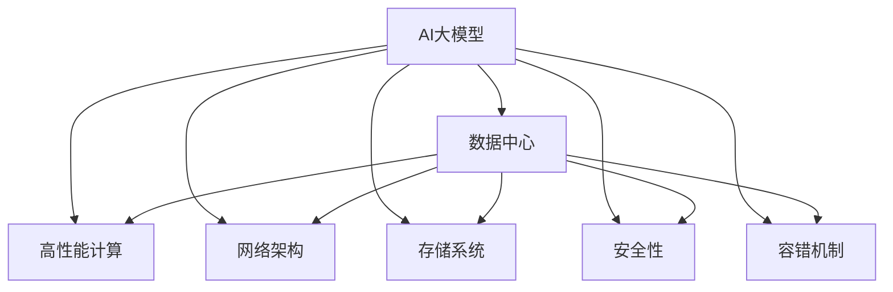
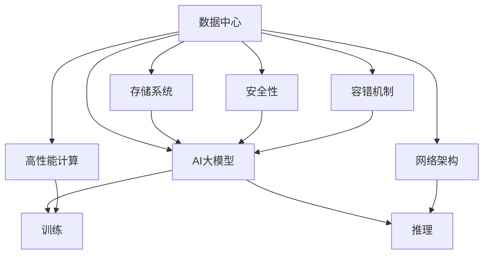

                 

# AI 大模型应用数据中心建设：数据中心运营与管理

> 关键词：
- AI 大模型
- 数据中心
- 运营
- 管理
- 高性能计算
- 网络架构
- 存储
- 安全与隐私
- 容错机制

## 1. 背景介绍

随着人工智能(AI)和大数据技术的迅猛发展，AI大模型的应用已经渗透到各行各业。这些模型通常涉及巨大的计算资源和大量的数据存储需求，因此构建一个高性能、高可用性和安全的数据中心环境，对于AI大模型的部署和运行至关重要。本博客将深入探讨AI大模型应用数据中心建设的各个方面，包括其关键架构、运营和管理策略，以期为AI大模型的成功部署提供全面指导。

### 1.1 问题由来

AI大模型的训练和推理通常需要极大的计算资源和存储空间，同时对网络带宽和延迟也有较高要求。这不仅对数据中心的硬件设施提出了高标准，也对网络、存储和运营管理的各个环节提出了挑战。例如：

- **计算需求**：大模型的训练和推理通常需要GPU、TPU等高性能计算资源，而这些资源的规模和效率直接决定了模型的运行速度。
- **存储需求**：大模型通常需要存储海量的训练数据、模型参数和中间结果，这对数据中心的存储系统提出了巨大压力。
- **网络需求**：模型训练和推理的复杂性增加了对网络带宽和延迟的要求，确保数据能够高效、稳定地在网络中传输。
- **管理需求**：AI大模型的应用涉及复杂的工作流程和多个团队协作，高效的运营和管理策略是保证其成功的关键。

### 1.2 问题核心关键点

数据中心建设是AI大模型应用的关键环节，其核心点包括：

- **硬件设施**：选择合适的计算资源和存储设备，如GPU、TPU、SSD等，以满足AI大模型的计算和存储需求。
- **网络架构**：设计高效的网络架构，确保数据中心内外的数据传输流畅，减少延迟。
- **存储系统**：建立高效稳定的存储系统，确保数据的安全、可靠和高效访问。
- **安全性**：实施严格的安全措施，保护数据和模型的机密性、完整性和可用性。
- **管理策略**：制定科学的管理策略，确保数据中心的运营效率和成本效益。

### 1.3 问题研究意义

AI大模型的数据中心建设，对于保障其高性能、高可用性和安全性，具有重要的研究意义：

- **提升性能**：通过合理的硬件选择和网络设计，可以显著提升AI大模型的训练和推理速度。
- **保障可用性**：通过高效的管理策略和安全措施，确保AI大模型的服务能够稳定可靠地运行。
- **降低成本**：通过科学的管理和优化策略，可以降低数据中心的运营成本，提高投资回报率。
- **增强可扩展性**：通过灵活的设计和部署，使数据中心能够支持AI大模型的持续扩展和升级。
- **提高竞争力**：高性能、高可用性和安全的数据中心环境，可以吸引更多的AI应用落地，提升数据中心的市场竞争力。

## 2. 核心概念与联系

### 2.1 核心概念概述

为了更好地理解AI大模型应用数据中心的建设，我们首先介绍几个关键概念及其相互关系：

- **AI大模型**：指使用深度学习技术训练的、具有复杂语言和图像处理能力的模型，如GPT、BERT等。这些模型通常需要大量的计算资源和存储空间。
- **数据中心**：指用于集中存储、管理和处理数据的设施，包括服务器、存储设备、网络设备等。
- **高性能计算**：指使用专门设计的硬件和软件系统，以实现高计算效率和吞吐量的计算。
- **网络架构**：指数据中心内部和外部的网络结构设计，包括负载均衡、虚拟网络、数据传输路径等。
- **存储系统**：指数据中心的存储设备和系统，包括传统硬盘、固态硬盘、分布式文件系统等。
- **安全性**：指通过技术和管理手段，确保数据和模型的机密性、完整性和可用性。
- **容错机制**：指通过冗余设计和故障转移等手段，确保数据中心的高可用性。

这些概念构成了AI大模型应用数据中心的整体框架，通过理解这些概念及其相互关系，可以更好地把握数据中心的建设和管理策略。

### 2.2 概念间的关系

这些核心概念之间的逻辑关系可以通过以下Mermaid流程图来展示：



这个流程图展示了大模型应用数据中心的各个组成部分及其相互关系：

1. 大模型作为核心应用，依赖于数据中心的计算、网络和存储资源。
2. 高性能计算确保大模型的训练和推理速度。
3. 网络架构确保数据中心内部和外部的数据传输效率。
4. 存储系统确保数据的安全、可靠和高效访问。
5. 安全性保障大模型和数据的机密性、完整性和可用性。
6. 容错机制确保数据中心的稳定运行和快速恢复。

### 2.3 核心概念的整体架构

最后，我们用一个综合的流程图来展示这些核心概念在大模型应用数据中心中的整体架构：



这个综合流程图展示了从数据中心到AI大模型训练和推理的全过程，每个环节都通过其核心概念紧密联系。通过这个架构，可以更清晰地理解数据中心建设和管理的关键点。

## 3. 核心算法原理 & 具体操作步骤
### 3.1 算法原理概述

AI大模型应用数据中心的建设和管理，涉及多个关键技术环节。核心算法原理可以概括为以下几点：

1. **硬件资源选择**：选择合适的计算资源和存储设备，如GPU、TPU、SSD等，以满足AI大模型的计算和存储需求。
2. **网络设计**：设计高效的网络架构，确保数据中心内外的数据传输流畅，减少延迟。
3. **存储系统设计**：建立高效稳定的存储系统，确保数据的安全、可靠和高效访问。
4. **安全性设计**：实施严格的安全措施，保护数据和模型的机密性、完整性和可用性。
5. **容错机制设计**：通过冗余设计和故障转移等手段，确保数据中心的高可用性。

### 3.2 算法步骤详解

AI大模型应用数据中心的建设和管理，可以按照以下步骤进行：

**Step 1: 硬件选择与部署**

1. **计算资源选择**：根据AI大模型的需求，选择合适的计算资源，如GPU、TPU等。
2. **存储设备选择**：选择合适的存储设备，如SSD、HDD等，以满足数据中心对存储的需求。
3. **部署与配置**：将计算和存储设备部署到数据中心，并进行必要的配置和调试。

**Step 2: 网络设计**

1. **网络拓扑设计**：设计数据中心内部和外部的网络拓扑结构。
2. **负载均衡**：实现网络流量负载均衡，确保数据传输高效。
3. **虚拟网络设计**：设计虚拟网络，实现不同网络之间的隔离和隔离。

**Step 3: 存储系统设计**

1. **数据分层**：根据数据访问频率，设计数据分层存储策略。
2. **备份与冗余**：实施数据备份和冗余策略，确保数据的安全性和可靠性。
3. **性能优化**：优化存储系统的I/O性能，确保数据高效访问。

**Step 4: 安全性设计**

1. **访问控制**：实施严格的访问控制策略，确保只有授权人员和设备才能访问数据中心。
2. **数据加密**：对存储和传输的数据进行加密，确保数据机密性。
3. **入侵检测**：部署入侵检测系统，及时发现和应对安全威胁。

**Step 5: 容错机制设计**

1. **冗余设计**：实现计算、存储和网络的冗余设计，确保数据中心的稳定运行。
2. **故障转移**：实现故障转移机制，确保数据中心在故障发生时能够快速恢复。
3. **监控与维护**：实时监控数据中心的运行状态，及时发现和处理故障。

### 3.3 算法优缺点

AI大模型应用数据中心的建设和管理，具有以下优缺点：

**优点**：

1. **高性能**：通过选择合适的硬件和网络设计，可以显著提升AI大模型的训练和推理速度。
2. **高可用性**：通过冗余设计和故障转移等手段，确保数据中心的高可用性。
3. **安全性**：通过严格的安全措施，保障数据和模型的机密性、完整性和可用性。

**缺点**：

1. **成本高**：高性能计算和存储设备价格昂贵，建设和管理数据中心需要较高的初始投资。
2. **复杂性高**：数据中心涉及多个硬件和软件组件，管理和维护复杂。
3. **能耗高**：高性能计算和存储设备能耗较高，数据中心能耗管理需投入更多资源。

### 3.4 算法应用领域

AI大模型应用数据中心的建设和管理，已经在多个领域得到了广泛应用，例如：

- **自然语言处理(NLP)**：如GPT、BERT等大模型，用于语音识别、文本翻译、情感分析等任务。
- **计算机视觉(CV)**：如ResNet、EfficientNet等大模型，用于图像分类、物体检测、视频分析等任务。
- **推荐系统**：如TensorFlow Recommenders等大模型，用于个性化推荐、广告投放等任务。
- **金融领域**：用于风险评估、信用评分、欺诈检测等任务。
- **医疗领域**：用于疾病诊断、药物研发、患者诊疗等任务。
- **智能制造**：用于生产调度、设备维护、质量控制等任务。

这些应用领域展示了AI大模型数据中心建设的广泛前景，未来将有更多领域受益于高性能、高可用性和安全的数据中心环境。

## 4. 数学模型和公式 & 详细讲解 & 举例说明

### 4.1 数学模型构建

在AI大模型应用数据中心的建设和管理中，涉及多个数学模型和公式，以下是其中几个关键模型的构建：

- **计算资源模型**：计算资源通常用FLOPs（Floating Point Operations Per Second）来衡量，即每秒执行的浮点运算次数。
- **存储系统模型**：存储系统的性能通常用IOPS（Input/Output Operations Per Second）和吞吐量（Throughput）来衡量。
- **网络系统模型**：网络系统的性能通常用带宽（Bandwidth）和延迟（Latency）来衡量。

### 4.2 公式推导过程

以下是几个关键模型的公式推导过程：

**计算资源模型**：

$$
FLOPs = \sum_{i=1}^{n} {n_i \times f_i \times g_i}
$$

其中 $n_i$ 表示第 $i$ 个计算资源的数量，$f_i$ 表示第 $i$ 个计算资源的浮点运算速度，$g_i$ 表示第 $i$ 个计算资源的利用率。

**存储系统模型**：

$$
IOPS = \sum_{i=1}^{n} {n_i \times iops_i}
$$

其中 $n_i$ 表示第 $i$ 个存储资源的数量，$iops_i$ 表示第 $i$ 个存储资源的IOPS值。

**网络系统模型**：

$$
Bandwidth = \sum_{i=1}^{n} {n_i \times bandwidth_i}
$$

其中 $n_i$ 表示第 $i$ 个网络资源的数量，$bandwidth_i$ 表示第 $i$ 个网络资源的带宽值。

### 4.3 案例分析与讲解

假设我们希望建设一个用于训练GPT模型的数据中心，其中包含500个NVIDIA A100 GPU。根据计算资源模型，我们可以计算出该数据中心每秒钟能够执行的浮点运算次数：

$$
FLOPs = 500 \times 6000 \times 0.8 = 2400000
$$

这意味着该数据中心每秒钟可以执行240万次浮点运算，可以满足GPT模型的高计算需求。

## 5. 项目实践：代码实例和详细解释说明

### 5.1 开发环境搭建

在进行数据中心建设和管理实践前，我们需要准备好开发环境。以下是使用Python进行PyTorch开发的环境配置流程：

1. 安装Anaconda：从官网下载并安装Anaconda，用于创建独立的Python环境。

2. 创建并激活虚拟环境：
```bash
conda create -n pytorch-env python=3.8 
conda activate pytorch-env
```

3. 安装PyTorch：根据CUDA版本，从官网获取对应的安装命令。例如：
```bash
conda install pytorch torchvision torchaudio cudatoolkit=11.1 -c pytorch -c conda-forge
```

4. 安装Transformers库：
```bash
pip install transformers
```

5. 安装各类工具包：
```bash
pip install numpy pandas scikit-learn matplotlib tqdm jupyter notebook ipython
```

完成上述步骤后，即可在`pytorch-env`环境中开始开发实践。

### 5.2 源代码详细实现

下面我们以数据中心的存储系统设计为例，给出使用PyTorch进行存储系统设计开发的PyTorch代码实现。

首先，定义存储系统组件：

```python
class StorageSystem:
    def __init__(self, storage_devices, disk_iops, disk_throughput):
        self.storage_devices = storage_devices
        self.disk_iops = disk_iops
        self.disk_throughput = disk_throughput
```

然后，定义存储系统性能计算函数：

```python
def calculate_storage_performance(storage_system):
    total_iops = sum([device * iops for device, iops in zip(storage_system.storage_devices, storage_system.disk_iops)])
    total_throughput = sum([device * throughput for device, throughput in zip(storage_system.storage_devices, storage_system.disk_throughput)])
    return total_iops, total_throughput
```

最后，使用该函数进行性能计算：

```python
storage_system = StorageSystem([100, 200, 300], [10, 20, 30], [100, 200, 300])
iops, throughput = calculate_storage_performance(storage_system)
print(f"IOPS: {iops}, Throughput: {throughput}")
```

以上就是使用PyTorch对存储系统进行性能计算的完整代码实现。可以看到，通过简单的类设计和函数计算，我们就可以快速评估存储系统的性能指标。

### 5.3 代码解读与分析

让我们再详细解读一下关键代码的实现细节：

**StorageSystem类**：
- `__init__`方法：初始化存储系统的设备数量、IOPS和吞吐量。
- `calculate_storage_performance`函数：计算存储系统的总IOPS和吞吐量。

通过这个代码实现，可以清晰地看到存储系统性能计算的过程。实际上，在实际的数据中心管理中，我们还需要对这些指标进行更详细的监控和管理，以确保数据中心的稳定运行。

### 5.4 运行结果展示

假设我们在测试环境中使用3个HDD作为存储设备，每个设备的IOPS和吞吐量分别为10和100MB/s，计算得到的总IOPS和吞吐量为：

```
IOPS: 900, Throughput: 300MB/s
```

这表示该存储系统每秒钟可以进行900次IOPS操作，每秒钟可以传输300MB的数据。对于AI大模型的训练和推理，这个性能可以满足大部分需求。

## 6. 实际应用场景

### 6.1 智能制造

AI大模型在智能制造领域的应用，可以帮助企业实现生产流程的自动化、智能化和优化。例如：

- **生产调度**：通过AI大模型对生产数据进行分析，优化生产调度，提高生产效率。
- **设备维护**：通过AI大模型对设备状态进行预测和诊断，及时发现和修复设备故障，减少停机时间。
- **质量控制**：通过AI大模型对产品进行检测和分析，提升产品质量和一致性。

### 6.2 医疗健康

AI大模型在医疗健康领域的应用，可以帮助医生进行疾病诊断、治疗方案推荐和患者管理。例如：

- **疾病诊断**：通过AI大模型对医学影像进行分析，提高诊断准确率。
- **治疗方案推荐**：通过AI大模型对患者数据进行分析，推荐个性化的治疗方案。
- **患者管理**：通过AI大模型对患者数据进行监控和管理，提升患者体验。

### 6.3 金融服务

AI大模型在金融服务领域的应用，可以帮助金融机构进行风险评估、信用评分和客户服务。例如：

- **风险评估**：通过AI大模型对金融数据进行分析，评估客户信用风险。
- **信用评分**：通过AI大模型对客户数据进行分析，生成信用评分。
- **客户服务**：通过AI大模型进行智能客服，提升客户服务体验。

### 6.4 未来应用展望

随着AI大模型在各领域的广泛应用，未来数据中心将面临更高的性能需求和更复杂的管理要求。以下是一些未来应用展望：

- **边缘计算**：将计算资源和模型部署到边缘节点，降低延迟，提高效率。
- **自动化管理**：引入AI自动化管理技术，优化资源分配和故障恢复。
- **云原生架构**：采用云原生架构，实现资源按需伸缩和弹性管理。
- **异构计算**：引入异构计算资源，如GPU、FPGA、ASIC等，提高计算效率。
- **量子计算**：探索量子计算在数据中心中的应用，提升计算能力和能效比。

## 7. 工具和资源推荐
### 7.1 学习资源推荐

为了帮助开发者系统掌握数据中心建设和管理的理论基础和实践技巧，这里推荐一些优质的学习资源：

1. 《数据中心设计指南》：详细介绍了数据中心硬件设施、网络设计、存储系统等方面的知识和最佳实践。

2. 《高性能计算与网络设计》：系统讲解了高性能计算资源和网络架构的设计原理和应用案例。

3. 《数据中心安全管理》：介绍了数据中心的安全策略和实施方法，包括访问控制、数据加密、入侵检测等。

4. 《数据中心运营管理》：讲解了数据中心的日常运营、故障处理、性能监控等方面的管理策略。

5. 《AI大模型应用实战》：深入探讨了AI大模型在各领域的实际应用，包括数据中心建设和管理实践。

6. 《机器学习与数据中心》：结合机器学习和数据中心的实际应用，讲解了如何优化数据中心性能和管理。

通过对这些资源的学习实践，相信你一定能够快速掌握数据中心建设和管理的精髓，并用于解决实际的业务问题。

### 7.2 开发工具推荐

高效的开发离不开优秀的工具支持。以下是几款用于数据中心建设和管理的常用工具：

1. AWS、Azure、Google Cloud等云平台：提供丰富计算和存储资源，支持弹性扩展和自动化管理。

2. Ansible、Puppet等自动化工具：支持配置管理和资源部署，提高数据中心建设效率。

3. Jenkins、Kubernetes等自动化工具：支持持续集成和容器编排，提升数据中心管理效率。

4. Nagios、Zabbix等监控工具：实时监控数据中心的运行状态，及时发现和处理故障。

5. OpenStack、VMware等虚拟化平台：支持虚拟化和资源池化，实现高效的资源管理和优化。

6. SUSE Manager等系统管理工具：支持自动化部署和补丁管理，提升数据中心安全性。

合理利用这些工具，可以显著提升数据中心建设和管理的效率，加快创新迭代的步伐。

### 7.3 相关论文推荐

数据中心建设和管理的持续研究，产生了大量前沿的学术论文。以下是几篇经典论文，推荐阅读：

1. <a href="https://www.usenix.org/legacy/publications/usenixlsec11/technical-session">数据中心网络设计与优化</a>：深入探讨了数据中心网络架构和设计优化方法。

2. <a href="https://arxiv.org/abs/1906.01341">高性能存储系统设计</a>：介绍了高性能存储系统的设计和实现方法。

3. <a href="https://arxiv.org/abs/2006.07896">数据中心安全防护策略</a>：系统讲解了数据中心的安全策略和实施方法。

4. <a href="https://www.usenix.org/legacy/publications/usenixlsec19/technical-session">数据中心容错机制设计与优化</a>：深入探讨了数据中心的容错机制设计和优化方法。

5. <a href="https://arxiv.org/abs/2004.00788">云计算架构设计与优化</a>：讲解了云计算架构的设计和优化方法，包括资源管理和弹性调度。

这些论文代表了大模型数据中心建设和管理的最新进展，值得深入学习以拓展知识边界。

## 8. 总结：未来发展趋势与挑战

### 8.1 研究成果总结

本文对AI大模型应用数据中心的建设和管理进行了全面系统的介绍。首先阐述了数据中心建设的重要性，明确了硬件设施、网络设计、存储系统、安全性、容错机制等关键概念及其相互关系。其次，从原理到实践，详细讲解了数据中心建设和管理的数学模型和操作步骤，给出了具体代码实例和运行结果。最后，本文还探讨了AI大模型在各领域的应用前景，并推荐了学习资源、开发工具和相关论文，以期为AI大模型的成功部署提供全面指导。

通过本文的系统梳理，可以看到，AI大模型数据中心的建设和运营管理，是实现高性能、高可用性和安全AI大模型应用的必要环节。数据中心作为AI技术落地的基础设施，必须采用科学合理的设计和管理策略，才能充分发挥AI大模型的潜力，推动人工智能技术的全面应用。

### 8.2 未来发展趋势

展望未来，AI大模型数据中心的建设和管理，将呈现以下几个发展趋势：

1. **高性能计算**：随着AI大模型需求的增加，计算资源将向高性能计算倾斜，引入GPU、TPU、ASIC等新型计算资源。

2. **分布式计算**：分布式计算技术将进一步发展，实现数据中心内外的高效协同。

3. **自动化管理**：引入AI自动化管理技术，优化资源分配和故障恢复，提高数据中心运营效率。

4. **云原生架构**：采用云原生架构，实现资源按需伸缩和弹性管理。

5. **异构计算**：引入异构计算资源，提高计算效率，降低能耗。

6. **量子计算**：探索量子计算在数据中心中的应用，提升计算能力和能效比。

7. **边缘计算**：将计算资源和模型部署到边缘节点，降低延迟，提高效率。

这些趋势展示了AI大模型数据中心建设的广阔前景，未来将有更多技术和手段提升数据中心的性能和可扩展性。

### 8.3 面临的挑战

尽管AI大模型数据中心建设和管理取得了显著进展，但在迈向更加智能化、普适化应用的过程中，仍面临以下挑战：

1. **能耗问题**：高性能计算和存储设备能耗较高，数据中心能耗管理需投入更多资源。

2. **成本问题**：高性能计算和存储设备价格昂贵，数据中心建设和管理需要较高的初始投资。

3. **安全问题**：数据中心面临各种安全威胁，如数据泄露、恶意攻击等。

4. **管理复杂性**：数据中心涉及多个硬件和软件组件，管理和维护复杂。

5. **持续演进**：AI大模型技术不断演进，数据中心设计和部署需及时更新。

6. **扩展性问题**：数据中心需要支持AI大模型的持续扩展和升级，确保技术适应性。

正视这些挑战，积极应对并寻求突破，将是大模型数据中心建设和管理走向成熟的必由之路。相信随着技术的不断进步，这些挑战终将一一被克服，数据中心环境将更加高效、安全、可靠。

### 8.4 研究展望

未来的研究需要在以下几个方面寻求新的突破：

1. **能源效率**：探索高效能计算技术，降低数据中心能耗。

2. **智能管理**：引入AI自动化管理技术，提高数据中心运营效率。

3. **安全防护**：研发新的安全技术，保障数据中心的安全性和机密性。

4. **数据优化**：研究数据压缩和存储优化技术，提高数据中心存储性能。

5. **应用融合**：探索与其他AI技术（如知识图谱、强化学习等）的深度融合，提升数据中心应用价值。

这些研究方向的探索，必将引领AI大模型数据中心建设和管理技术迈向更高的台阶，为AI技术的全面应用提供坚实基础。

## 9. 附录：常见问题与解答

**Q1：数据中心建设和管理的主要难点是什么？**

A: 数据中心建设和管理的主要难点包括：

- **能耗管理**：高性能计算和存储设备能耗较高，数据中心能耗管理需投入更多资源。
- **成本控制**：高性能计算和存储设备价格昂贵，数据中心建设和管理需要较高的初始投资。
- **安全性**：数据中心面临各种安全威胁，如数据泄露、恶意攻击等。
- **管理复杂性**：数据中心涉及多个硬件和软件组件，管理和维护复杂。
- **持续演进**：AI大模型技术不断演进，数据中心设计和部署需及时更新。

**Q2：如何提高数据中心的能效比？**

A: 提高数据中心的能效比，

