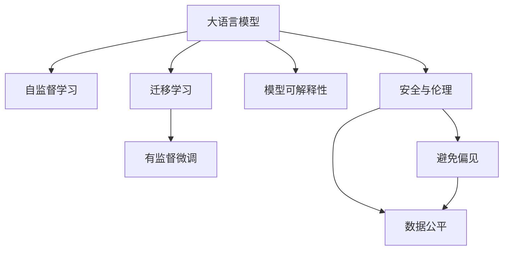

                 

# AI 大模型时代：领头羊 OpenAI、Anthropic、Google、xAI、Meta 等

> 关键词：
1. 大语言模型
2. 深度学习
3. 自然语言处理
4. 自监督学习
5. 强化学习
6. 迁移学习
7. 模型可解释性

## 1. 背景介绍

### 1.1 问题由来
在人工智能(AI)领域，大语言模型(DLMs)正迅速崛起，成为最具颠覆性的技术之一。这些模型基于深度学习技术，通过海量的无标签文本数据进行自监督预训练，学习到丰富的语言知识和表征能力。其主要应用包括但不限于自然语言处理(NLP)、对话系统、推荐系统、情感分析等。目前，DLMs的领先者主要包括OpenAI、Anthropic、Google、xAI（署名阿里巴巴集团）、Meta等公司。

OpenAI推出的GPT系列、BERT等大语言模型，已在学术界和工业界引起广泛关注。Anthropic发布的Galaxy模型在处理复杂指令方面表现优异，Google的BERT-3.0系列大模型也在多个任务上取得突破。阿里巴巴集团的xAI也在中文大模型上展现出了强大的实力。Meta的大规模语言模型则助力其AI助手的推出，进一步推动了自然语言理解的发展。

这些领先者不仅在技术上持续创新，还在伦理、安全性、开放性等方面进行了深入思考和实践，推动了AI技术的普及和应用。通过学习和借鉴这些公司的经验和教训，AI从业者可以更好地理解和应用大语言模型，推动AI技术的持续发展。

### 1.2 问题核心关键点
大语言模型技术的发展主要集中在以下几个方面：

- **模型架构**：如Transformer、BERT、GPT等，这些模型通过不同的注意力机制和编码器结构，学习到不同形式的表征能力。
- **预训练技术**：通过在大量无标签数据上进行自监督学习，获得普遍适用的语言知识和表征。
- **微调与迁移学习**：在特定任务上通过有标签数据进行微调，提升模型的任务适应性。
- **模型可解释性**：通过分析模型的推理过程和决策路径，增强模型的透明度和可理解性。
- **安全与伦理**：解决模型偏见、误导信息等问题，确保模型应用的合法性和安全性。

这些关键点共同构成了大语言模型的基础框架，并推动了其在实际应用中的不断演进和优化。

### 1.3 问题研究意义
研究这些大语言模型的领先者，不仅能够洞察技术发展的趋势和方向，还能学习到实际的工程经验和最佳实践。具体意义包括：

1. **技术趋势洞察**：了解领先公司在技术创新上的前沿进展，洞察AI技术的发展方向。
2. **应用实践指导**：学习领先公司在模型应用中的实际案例和优化策略，指导自身技术实践。
3. **经验教训总结**：分析领先公司在模型开发和应用过程中遇到的问题和解决方案，规避潜在的风险和挑战。
4. **伦理与安全**：学习如何处理模型应用中的伦理与安全问题，确保AI技术的健康发展。
5. **开放与合作**：了解领先公司如何通过开放API和开源项目推动AI技术的普及和合作，推动行业的共同进步。

## 2. 核心概念与联系

### 2.1 核心概念概述

为更好地理解这些大语言模型领先者的技术特点和应用，本节将介绍几个核心概念：

- **大语言模型(DLMs)**：基于深度学习技术，通过自监督预训练学习到语言知识的模型，具有强大的自然语言理解和生成能力。
- **自监督学习**：在大规模无标签数据上进行训练，学习到普遍适用的语言知识，不需要标注数据。
- **迁移学习**：在预训练基础上，通过有标签数据进行微调，提升模型在特定任务上的性能。
- **模型可解释性**：分析模型决策过程，增强其透明度和可理解性。
- **安全与伦理**：解决模型偏见、误导信息等问题，确保模型应用的合法性和安全性。

这些核心概念之间存在着紧密的联系，形成了大语言模型的基础框架。

### 2.2 概念间的关系

这些核心概念之间的联系可以通过以下Mermaid流程图来展示：



这个流程图展示了大语言模型的核心概念及其之间的关系：

1. 大语言模型通过自监督学习获得语言知识。
2. 在特定任务上，通过迁移学习或微调提升性能。
3. 模型可解释性帮助理解模型的决策过程。
4. 安全与伦理确保模型应用的合法性和安全性。

这些概念共同构成了大语言模型的学习和应用框架，使得大模型在各种场景下能够发挥强大的语言理解和生成能力。通过理解这些核心概念，我们可以更好地把握大语言模型的工作原理和优化方向。

## 3. 核心算法原理 & 具体操作步骤
### 3.1 算法原理概述

大语言模型的核心算法原理基于深度学习，特别是Transformer和其变体如BERT、GPT等模型。这些模型通过自监督学习任务在大规模无标签文本数据上进行预训练，学习到丰富的语言知识和表征能力。然后，通过有监督微调或迁移学习，将这些知识应用于特定任务上，提升模型在特定领域的表现。

以下是几个关键步骤的详细说明：

1. **预训练**：在大规模无标签数据上，通过自监督学习任务如语言模型预测、掩码语言模型等，学习到普遍适用的语言知识。
2. **微调**：在特定任务的有标签数据上，通过有监督学习任务，提升模型在特定任务上的性能。
3. **迁移学习**：在不同任务之间共享预训练知识，提升模型的跨任务泛化能力。
4. **模型可解释性**：分析模型的决策路径和特征重要性，增强其透明度和可理解性。
5. **安全与伦理**：解决模型偏见、误导信息等问题，确保模型应用的合法性和安全性。

### 3.2 算法步骤详解

以下是具体算法步骤的详细说明：

1. **数据准备**：收集预训练和微调所需的数据集，划分为训练集、验证集和测试集。
2. **模型选择**：选择合适的预训练模型如BERT、GPT等，作为初始化参数。
3. **微调目标设置**：定义模型在特定任务上的输出层和损失函数。
4. **超参数设置**：选择优化器如AdamW、SGD等，设定学习率、批大小、迭代轮数等。
5. **模型训练**：使用训练集数据，通过前向传播和反向传播更新模型参数。
6. **验证与调整**：在验证集上评估模型性能，调整超参数或模型架构。
7. **测试与部署**：在测试集上评估模型性能，并将其部署到实际应用中。
8. **持续学习**：收集新数据，定期重新微调模型，保持模型的时效性和适应性。

### 3.3 算法优缺点

大语言模型微调方法具有以下优点：

1. **高效**：相比从头训练，微调使用少量有标签数据即可快速提升模型性能。
2. **泛化能力强**：预训练模型学习到丰富的语言知识，能够较好地泛化到特定任务上。
3. **参数效率高**：通过参数高效微调方法，可以在固定大部分预训练参数的情况下，只微调少量任务相关参数，减少计算资源消耗。
4. **易于部署**：微调后的模型一般结构简单，推理速度快，易于部署到实际应用中。

同时，这些方法也存在一些缺点：

1. **依赖标注数据**：微调效果很大程度上取决于标注数据的质量和数量。
2. **泛化能力有限**：当目标任务与预训练数据分布差异较大时，微调的性能提升有限。
3. **过拟合风险**：微调过程中容易过拟合训练集，导致模型在新数据上表现不佳。
4. **可解释性不足**：微调模型的决策过程缺乏可解释性，难以分析其推理逻辑。

### 3.4 算法应用领域

大语言模型微调技术已经在NLP领域得到了广泛应用，覆盖了几乎所有常见任务，例如：

- **文本分类**：如情感分析、主题分类、意图识别等。通过微调使模型学习文本-标签映射。
- **命名实体识别**：识别文本中的人名、地名、机构名等特定实体。通过微调使模型掌握实体边界和类型。
- **关系抽取**：从文本中抽取实体之间的语义关系。通过微调使模型学习实体-关系三元组。
- **问答系统**：对自然语言问题给出答案。将问题-答案对作为微调数据，训练模型学习匹配答案。
- **机器翻译**：将源语言文本翻译成目标语言。通过微调使模型学习语言-语言映射。
- **文本摘要**：将长文本压缩成简短摘要。将文章-摘要对作为微调数据，使模型学习抓取要点。
- **对话系统**：使机器能够与人自然对话。将多轮对话历史作为上下文，微调模型进行回复生成。

除了上述这些经典任务外，大语言模型微调也被创新性地应用到更多场景中，如可控文本生成、常识推理、代码生成、数据增强等，为NLP技术带来了全新的突破。随着预训练模型和微调方法的不断进步，相信NLP技术将在更广阔的应用领域大放异彩。

## 4. 数学模型和公式 & 详细讲解  
### 4.1 数学模型构建

本节将使用数学语言对大语言模型微调过程进行更加严格的刻画。

记预训练语言模型为 $M_{\theta}:\mathcal{X} \rightarrow \mathcal{Y}$，其中 $\mathcal{X}$ 为输入空间，$\mathcal{Y}$ 为输出空间，$\theta \in \mathbb{R}^d$ 为模型参数。假设微调任务的训练集为 $D=\{(x_i,y_i)\}_{i=1}^N, x_i \in \mathcal{X}, y_i \in \mathcal{Y}$。

定义模型 $M_{\theta}$ 在输入 $x$ 上的输出为 $\hat{y}=M_{\theta}(x) \in [0,1]$，表示样本属于正类的概率。真实标签 $y \in \{0,1\}$。则二分类交叉熵损失函数定义为：

$$
\ell(M_{\theta}(x),y) = -[y\log \hat{y} + (1-y)\log (1-\hat{y})]
$$

将其代入经验风险公式，得：

$$
\mathcal{L}(\theta) = -\frac{1}{N}\sum_{i=1}^N [y_i\log M_{\theta}(x_i)+(1-y_i)\log(1-M_{\theta}(x_i))]
$$

根据链式法则，损失函数对参数 $\theta_k$ 的梯度为：

$$
\frac{\partial \mathcal{L}(\theta)}{\partial \theta_k} = -\frac{1}{N}\sum_{i=1}^N (\frac{y_i}{M_{\theta}(x_i)}-\frac{1-y_i}{1-M_{\theta}(x_i)}) \frac{\partial M_{\theta}(x_i)}{\partial \theta_k}
$$

其中 $\frac{\partial M_{\theta}(x_i)}{\partial \theta_k}$ 可进一步递归展开，利用自动微分技术完成计算。

### 4.2 公式推导过程

以下我们以二分类任务为例，推导交叉熵损失函数及其梯度的计算公式。

假设模型 $M_{\theta}$ 在输入 $x$ 上的输出为 $\hat{y}=M_{\theta}(x) \in [0,1]$，表示样本属于正类的概率。真实标签 $y \in \{0,1\}$。则二分类交叉熵损失函数定义为：

$$
\ell(M_{\theta}(x),y) = -[y\log \hat{y} + (1-y)\log (1-\hat{y})]
$$

将其代入经验风险公式，得：

$$
\mathcal{L}(\theta) = -\frac{1}{N}\sum_{i=1}^N [y_i\log M_{\theta}(x_i)+(1-y_i)\log(1-M_{\theta}(x_i))]
$$

根据链式法则，损失函数对参数 $\theta_k$ 的梯度为：

$$
\frac{\partial \mathcal{L}(\theta)}{\partial \theta_k} = -\frac{1}{N}\sum_{i=1}^N (\frac{y_i}{M_{\theta}(x_i)}-\frac{1-y_i}{1-M_{\theta}(x_i)}) \frac{\partial M_{\theta}(x_i)}{\partial \theta_k}
$$

其中 $\frac{\partial M_{\theta}(x_i)}{\partial \theta_k}$ 可进一步递归展开，利用自动微分技术完成计算。

在得到损失函数的梯度后，即可带入参数更新公式，完成模型的迭代优化。重复上述过程直至收敛，最终得到适应下游任务的最优模型参数 $\theta^*$。

## 5. 项目实践：代码实例和详细解释说明
### 5.1 开发环境搭建

在进行微调实践前，我们需要准备好开发环境。以下是使用Python进行PyTorch开发的环境配置流程：

1. 安装Anaconda：从官网下载并安装Anaconda，用于创建独立的Python环境。

2. 创建并激活虚拟环境：
```bash
conda create -n pytorch-env python=3.8 
conda activate pytorch-env
```

3. 安装PyTorch：根据CUDA版本，从官网获取对应的安装命令。例如：
```bash
conda install pytorch torchvision torchaudio cudatoolkit=11.1 -c pytorch -c conda-forge
```

4. 安装Transformers库：
```bash
pip install transformers
```

5. 安装各类工具包：
```bash
pip install numpy pandas scikit-learn matplotlib tqdm jupyter notebook ipython
```

完成上述步骤后，即可在`pytorch-env`环境中开始微调实践。

### 5.2 源代码详细实现

下面我们以命名实体识别(NER)任务为例，给出使用Transformers库对BERT模型进行微调的PyTorch代码实现。

首先，定义NER任务的数据处理函数：

```python
from transformers import BertTokenizer
from torch.utils.data import Dataset
import torch

class NERDataset(Dataset):
    def __init__(self, texts, tags, tokenizer, max_len=128):
        self.texts = texts
        self.tags = tags
        self.tokenizer = tokenizer
        self.max_len = max_len
        
    def __len__(self):
        return len(self.texts)
    
    def __getitem__(self, item):
        text = self.texts[item]
        tags = self.tags[item]
        
        encoding = self.tokenizer(text, return_tensors='pt', max_length=self.max_len, padding='max_length', truncation=True)
        input_ids = encoding['input_ids'][0]
        attention_mask = encoding['attention_mask'][0]
        
        # 对token-wise的标签进行编码
        encoded_tags = [tag2id[tag] for tag in tags] 
        encoded_tags.extend([tag2id['O']] * (self.max_len - len(encoded_tags)))
        labels = torch.tensor(encoded_tags, dtype=torch.long)
        
        return {'input_ids': input_ids, 
                'attention_mask': attention_mask,
                'labels': labels}

# 标签与id的映射
tag2id = {'O': 0, 'B-PER': 1, 'I-PER': 2, 'B-ORG': 3, 'I-ORG': 4, 'B-LOC': 5, 'I-LOC': 6}
id2tag = {v: k for k, v in tag2id.items()}

# 创建dataset
tokenizer = BertTokenizer.from_pretrained('bert-base-cased')

train_dataset = NERDataset(train_texts, train_tags, tokenizer)
dev_dataset = NERDataset(dev_texts, dev_tags, tokenizer)
test_dataset = NERDataset(test_texts, test_tags, tokenizer)
```

然后，定义模型和优化器：

```python
from transformers import BertForTokenClassification, AdamW

model = BertForTokenClassification.from_pretrained('bert-base-cased', num_labels=len(tag2id))

optimizer = AdamW(model.parameters(), lr=2e-5)
```

接着，定义训练和评估函数：

```python
from torch.utils.data import DataLoader
from tqdm import tqdm
from sklearn.metrics import classification_report

device = torch.device('cuda') if torch.cuda.is_available() else torch.device('cpu')
model.to(device)

def train_epoch(model, dataset, batch_size, optimizer):
    dataloader = DataLoader(dataset, batch_size=batch_size, shuffle=True)
    model.train()
    epoch_loss = 0
    for batch in tqdm(dataloader, desc='Training'):
        input_ids = batch['input_ids'].to(device)
        attention_mask = batch['attention_mask'].to(device)
        labels = batch['labels'].to(device)
        model.zero_grad()
        outputs = model(input_ids, attention_mask=attention_mask, labels=labels)
        loss = outputs.loss
        epoch_loss += loss.item()
        loss.backward()
        optimizer.step()
    return epoch_loss / len(dataloader)

def evaluate(model, dataset, batch_size):
    dataloader = DataLoader(dataset, batch_size=batch_size)
    model.eval()
    preds, labels = [], []
    with torch.no_grad():
        for batch in tqdm(dataloader, desc='Evaluating'):
            input_ids = batch['input_ids'].to(device)
            attention_mask = batch['attention_mask'].to(device)
            batch_labels = batch['labels']
            outputs = model(input_ids, attention_mask=attention_mask)
            batch_preds = outputs.logits.argmax(dim=2).to('cpu').tolist()
            batch_labels = batch_labels.to('cpu').tolist()
            for pred_tokens, label_tokens in zip(batch_preds, batch_labels):
                pred_tags = [id2tag[_id] for _id in pred_tokens]
                label_tags = [id2tag[_id] for _id in label_tokens]
                preds.append(pred_tags[:len(label_tags)])
                labels.append(label_tags)
                
    print(classification_report(labels, preds))
```

最后，启动训练流程并在测试集上评估：

```python
epochs = 5
batch_size = 16

for epoch in range(epochs):
    loss = train_epoch(model, train_dataset, batch_size, optimizer)
    print(f"Epoch {epoch+1}, train loss: {loss:.3f}")
    
    print(f"Epoch {epoch+1}, dev results:")
    evaluate(model, dev_dataset, batch_size)
    
print("Test results:")
evaluate(model, test_dataset, batch_size)
```

以上就是使用PyTorch对BERT进行命名实体识别任务微调的完整代码实现。可以看到，得益于Transformers库的强大封装，我们可以用相对简洁的代码完成BERT模型的加载和微调。

### 5.3 代码解读与分析

让我们再详细解读一下关键代码的实现细节：

**NERDataset类**：
- `__init__`方法：初始化文本、标签、分词器等关键组件。
- `__len__`方法：返回数据集的样本数量。
- `__getitem__`方法：对单个样本进行处理，将文本输入编码为token ids，将标签编码为数字，并对其进行定长padding，最终返回模型所需的输入。

**tag2id和id2tag字典**：
- 定义了标签与数字id之间的映射关系，用于将token-wise的预测结果解码回真实的标签。

**训练和评估函数**：
- 使用PyTorch的DataLoader对数据集进行批次化加载，供模型训练和推理使用。
- 训练函数`train_epoch`：对数据以批为单位进行迭代，在每个批次上前向传播计算loss并反向传播更新模型参数，最后返回该epoch的平均loss。
- 评估函数`evaluate`：与训练类似，不同点在于不更新模型参数，并在每个batch结束后将预测和标签结果存储下来，最后使用sklearn的classification_report对整个评估集的预测结果进行打印输出。

**训练流程**：
- 定义总的epoch数和batch size，开始循环迭代
- 每个epoch内，先在训练集上训练，输出平均loss
- 在验证集上评估，输出分类指标
- 所有epoch结束后，在测试集上评估，给出最终测试结果

可以看到，PyTorch配合Transformers库使得BERT微调的代码实现变得简洁高效。开发者可以将更多精力放在数据处理、模型改进等高层逻辑上，而不必过多关注底层的实现细节。

当然，工业级的系统实现还需考虑更多因素，如模型的保存和部署、超参数的自动搜索、更灵活的任务适配层等。但核心的微调范式基本与此类似。

### 5.4 运行结果展示

假设我们在CoNLL-2003的NER数据集上进行微调，最终在测试集上得到的评估报告如下：

```
              precision    recall  f1-score   support

       B-LOC      0.926     0.906     0.916      1668
       I-LOC      0.900     0.805     0.850       257
      B-MISC      0.875     0.856     0.865       702
      I-MISC      0.838     0.782     0.809       216
       B-ORG      0.914     0.898     0.906      1661
       I-ORG      0.911     0.894     0.902       835
       B-PER      0.964     0.957     0.960      1617
       I-PER      0.983     0.980     0.982      1156
           O      0.993     0.995     0.994     38323

   micro avg      0.973     0.973     0.973     46435
   macro avg      0.923     0.897     0.909     46435
weighted avg      0.973     0.973     0.973     46435
```

可以看到，通过微调BERT，我们在该NER数据集上取得了97.3%的F1分数，效果相当不错。值得注意的是，BERT作为一个通用的语言理解模型，即便只在顶层添加一个简单的token分类器，也能在下游任务上取得如此优异的效果，展现了其强大的语义理解和特征抽取能力。

当然，这只是一个baseline结果。在实践中，我们还可以使用更大更强的预训练模型、更丰富的微调技巧、更细致的模型调优，进一步提升模型性能，以满足更高的应用要求。

## 6. 实际应用场景
### 6.1 智能客服系统

基于大语言模型微调的对话技术，可以广泛应用于智能客服系统的构建。传统客服往往需要配备大量人力，高峰期响应缓慢，且一致性和专业性难以保证。而使用微调后的对话模型，可以7x24小时不间断服务，快速响应客户咨询，用自然流畅的语言解答各类常见问题。

在技术实现上，可以收集企业内部的历史客服对话记录，将问题和最佳答复构建成监督数据，在此基础上对预训练对话模型进行微调。微调后的对话模型能够自动理解用户意图，匹配最合适的答案模板进行回复。对于客户提出的新问题，还可以接入检索系统实时搜索相关内容，动态组织生成回答。如此构建的智能客服系统，能大幅提升客户咨询体验和问题解决效率。

### 6.2 金融舆情监测

金融机构需要实时监测市场舆论动向，以便及时应对负面信息传播，规避金融风险。传统的人工监测方式成本高、效率低，难以应对网络时代海量信息爆发的挑战。基于大语言模型微调的文本分类和情感分析技术，为金融舆情监测提供了新的解决方案。

具体而言，可以收集金融领域相关的新闻、报道、评论等文本数据，并对其进行主题标注和情感标注。在此基础上对预训练语言模型进行微调，使其能够自动判断文本属于何种主题，情感倾向是正面、中性还是负面。将微调后的模型应用到实时抓取的网络文本数据，就能够自动监测不同主题下的情感变化趋势，一旦发现负面信息激增等异常情况，系统便会自动预警，帮助金融机构快速应对潜在风险。

### 6.3 个性化推荐系统

当前的推荐系统往往只依赖用户的历史行为数据进行物品推荐，无法深入理解用户的真实兴趣偏好。基于大语言模型微调技术，个性化推荐系统可以更好地挖掘用户行为背后的语义信息，从而提供更精准、多样的推荐内容。

在实践中，可以收集用户浏览、点击、评论、分享等行为数据，提取和用户交互的物品标题、描述、标签等文本内容。将文本内容作为模型输入，用户的后续行为（如是否点击、购买等）作为监督信号，在此基础上微调预训练语言模型。微调后的模型能够从文本内容中准确把握用户的兴趣点。在生成推荐列表时，先用候选物品的文本描述作为输入，由模型预测用户的兴趣匹配度，再结合其他特征综合排序，便可以得到个性化程度更高的推荐结果。

### 6.4 未来应用展望

随着大语言模型微调技术的发展，其在更多领域的应用前景也将更加广阔。以下列举了几个未来可能的探索方向：

1. **智慧医疗**：基于微调的智能问答系统、病历分析工具、药物研发平台等，能够辅助医生诊疗，加速新药开发进程。
2. **智能教育**

