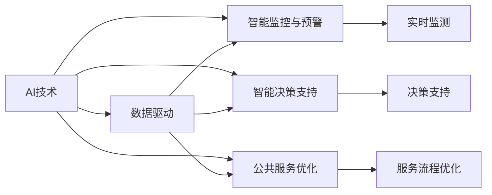

                 

# AI 对社会治理的变革：提升治理效率

在快速发展的信息化时代，人工智能（AI）技术以其强大的数据处理和分析能力，逐渐成为推动社会治理现代化和智能化的重要引擎。通过AI技术，社会治理可以更加高效、精确、透明，从而提升整体治理效率，优化公共服务质量。本文将从背景介绍、核心概念与联系、核心算法原理与操作步骤、数学模型与详细讲解、项目实践与代码实例、实际应用场景、工具与资源推荐、未来发展趋势与挑战以及常见问题与解答等多个方面，全面探讨AI技术在社会治理中的应用及其潜力。

## 1. 背景介绍

### 1.1 问题由来

随着城市化进程的加快和全球化程度的加深，社会治理的复杂性和难度不断增加。传统的基于人工和经验的社会治理方式，面临着数据处理量大、信息孤岛、响应速度慢等问题。例如，在城市管理中，城市交通、公共安全、环保等领域的监控数据量巨大，如何高效处理和分析这些数据，及时响应和解决问题，是一个巨大的挑战。

为了应对这些挑战，社会治理领域开始引入人工智能技术，通过数据驱动和智能决策，提高治理效率。例如，AI可以实时监测交通流量，优化信号灯控制，缓解交通拥堵；可以分析公共安全视频，快速定位并响应突发事件；可以预测环境污染趋势，制定科学合理的环保政策。AI技术的引入，不仅提升了社会治理的效率，也增加了治理的透明度和公平性。

### 1.2 问题核心关键点

AI在社会治理中的应用，主要集中在以下几个方面：

- **数据分析与挖掘**：利用AI技术处理和分析海量数据，从中挖掘有价值的信息和规律。
- **智能监控与预警**：通过AI技术对视频、音频等数据进行实时监测，实现对突发事件的快速响应和预警。
- **智能决策支持**：通过AI技术辅助决策者进行科学决策，提升决策的准确性和效率。
- **公共服务优化**：利用AI技术优化公共服务流程，提高服务质量和效率。

这些应用不仅涵盖了城市管理、公共安全、环保等领域，还扩展到了医疗、教育、交通等多个社会治理领域。AI技术在社会治理中的应用，正在逐步改变传统治理模式，推动治理现代化和智能化进程。

### 1.3 问题研究意义

AI技术在社会治理中的应用，具有以下重要意义：

- **提升治理效率**：AI技术可以实时处理和分析大量数据，快速响应和解决问题，提升治理效率。
- **优化服务质量**：AI技术可以提供更精准、个性化的公共服务，提升服务质量和用户满意度。
- **增加治理透明度**：AI技术可以提供公开透明的数据和决策过程，增强公众信任和参与度。
- **促进数据共享**：AI技术可以打破信息孤岛，实现不同系统之间的数据共享和协同治理。
- **提高决策科学性**：AI技术可以提供基于数据的决策支持，减少决策过程中的主观偏差。

## 2. 核心概念与联系

### 2.1 核心概念概述

为了更好地理解AI在社会治理中的应用，我们需要掌握以下几个核心概念：

- **AI技术**：包括机器学习、深度学习、自然语言处理、计算机视觉等技术，利用算法和模型处理和分析数据，实现智能决策。
- **社会治理**：指政府和社会组织通过政策、法规、技术手段等，对社会事务进行管理和调节，提升公共利益和社会福祉。
- **数据驱动**：基于大数据分析和社会事件监测，进行智能决策和治理。
- **智能监控与预警**：利用AI技术对视频、音频等数据进行实时监测，实现对突发事件的快速响应和预警。
- **智能决策支持**：通过AI技术辅助决策者进行科学决策，提升决策的准确性和效率。
- **公共服务优化**：利用AI技术优化公共服务流程，提高服务质量和效率。

### 2.2 概念间的关系

这些核心概念之间的关系可以通过以下Mermaid流程图来展示：



这个流程图展示了AI技术在社会治理中的应用：数据驱动、智能监控与预警、智能决策支持和公共服务优化，都是基于AI技术实现的。其中，数据驱动是基础，智能监控与预警、智能决策支持和公共服务优化则是具体的应用场景。

## 3. 核心算法原理 & 具体操作步骤

### 3.1 算法原理概述

AI在社会治理中的应用，主要基于机器学习和深度学习的算法原理。机器学习和深度学习算法可以从历史数据中学习规律和模式，从而进行智能决策和预测。

具体而言，AI技术在社会治理中的应用流程如下：

1. **数据收集与预处理**：收集社会治理相关的数据，包括视频、音频、文本、图像等，进行数据清洗和预处理。
2. **特征提取与建模**：利用特征提取技术，从原始数据中提取有意义的特征，构建数据模型。
3. **模型训练与优化**：利用训练数据对模型进行训练，并进行优化，提升模型性能。
4. **智能决策与预测**：基于训练好的模型，进行智能决策和预测，辅助社会治理决策。

### 3.2 算法步骤详解

#### 3.2.1 数据收集与预处理

数据收集与预处理是AI应用的基础。对于社会治理应用，常见的数据类型包括视频监控数据、社交媒体数据、政府公开数据等。数据预处理包括数据清洗、去噪、归一化等步骤，确保数据的质量和一致性。

#### 3.2.2 特征提取与建模

特征提取是从原始数据中提取有意义的特征，如颜色、形状、文本等。特征提取的目的是降低数据维度，减少计算复杂度。常用的特征提取方法包括图像处理、自然语言处理等技术。

模型建模是基于特征提取的结果，构建机器学习或深度学习模型。模型选择应根据具体应用场景进行选择，常见的模型包括支持向量机、随机森林、卷积神经网络、循环神经网络等。

#### 3.2.3 模型训练与优化

模型训练是利用训练数据对模型进行训练，优化模型的性能。训练过程中，需要选择合适的优化算法，如梯度下降算法、Adam算法等。同时，需要对模型进行正则化，防止过拟合。

#### 3.2.4 智能决策与预测

智能决策与预测是基于训练好的模型，对新数据进行预测和决策。常见的智能决策与预测方法包括分类、回归、聚类等。

### 3.3 算法优缺点

AI技术在社会治理中的应用，具有以下优缺点：

#### 优点

- **高效性**：AI技术可以实时处理和分析大量数据，快速响应和解决问题，提升治理效率。
- **精准性**：AI技术可以提供基于数据的决策支持，减少决策过程中的主观偏差，提高决策的准确性。
- **透明度**：AI技术可以提供公开透明的数据和决策过程，增强公众信任和参与度。

#### 缺点

- **数据依赖**：AI技术依赖高质量的数据，数据缺失或不完整会影响模型的性能。
- **模型复杂性**：AI模型通常较为复杂，需要大量的计算资源和专业知识进行训练和优化。
- **隐私与安全问题**：AI技术在处理敏感数据时，可能存在隐私泄露和安全问题。

### 3.4 算法应用领域

AI技术在社会治理中的应用，主要包括以下几个领域：

- **智能监控与预警**：通过AI技术对视频、音频等数据进行实时监测，实现对突发事件的快速响应和预警。例如，城市交通监控、公共安全监控等。
- **智能决策支持**：通过AI技术辅助决策者进行科学决策，提升决策的准确性和效率。例如，政府政策制定、公共资源配置等。
- **公共服务优化**：利用AI技术优化公共服务流程，提高服务质量和效率。例如，智能客服、公共设施管理等。
- **环境监测与治理**：通过AI技术监测环境污染、气象变化等，制定科学合理的环保政策。例如，智能水质监测、空气质量预测等。
- **医疗健康管理**：利用AI技术优化医疗资源配置、辅助诊断等，提升医疗服务质量。例如，智能影像诊断、健康数据分析等。

## 4. 数学模型和公式 & 详细讲解 & 举例说明

### 4.1 数学模型构建

AI在社会治理中的应用，涉及多种数学模型，如回归模型、分类模型、聚类模型等。以智能监控与预警为例，构建回归模型进行异常检测，公式如下：

$$
\hat{y} = w_0 + \sum_{i=1}^n w_ix_i
$$

其中，$\hat{y}$表示预测的异常值，$x_i$表示第$i$个特征，$w_i$表示第$i$个特征的权重。

### 4.2 公式推导过程

以智能监控与预警为例，异常检测的公式推导如下：

1. **数据收集与预处理**：
   - 收集视频监控数据，进行预处理，包括去噪、归一化等。

2. **特征提取**：
   - 利用计算机视觉技术，提取视频帧中的关键特征，如颜色、形状、移动等。

3. **模型训练**：
   - 利用训练数据对模型进行训练，公式如下：
   $$
   \min_{w} \frac{1}{2} \sum_{i=1}^m (y_i - \hat{y}_i)^2 + \lambda \sum_{j=1}^p w_j^2
   $$
   其中，$y_i$表示实际标签，$\hat{y}_i$表示预测标签，$\lambda$表示正则化系数。

4. **异常检测**：
   - 利用训练好的模型，对新数据进行预测，检测异常值。

### 4.3 案例分析与讲解

以智能监控与预警为例，假设需要检测视频监控中的异常行为。数据集包含视频帧和对应的标签，标签为“正常”或“异常”。首先，利用计算机视觉技术提取视频帧中的关键特征，如颜色、形状、移动等。然后，构建回归模型，进行异常检测。

具体步骤如下：

1. **数据收集与预处理**：收集视频监控数据，进行预处理，包括去噪、归一化等。

2. **特征提取**：利用计算机视觉技术，提取视频帧中的关键特征，如颜色、形状、移动等。

3. **模型训练**：利用训练数据对模型进行训练，公式如下：
   $$
   \min_{w} \frac{1}{2} \sum_{i=1}^m (y_i - \hat{y}_i)^2 + \lambda \sum_{j=1}^p w_j^2
   $$
   其中，$y_i$表示实际标签，$\hat{y}_i$表示预测标签，$\lambda$表示正则化系数。

4. **异常检测**：利用训练好的模型，对新数据进行预测，检测异常值。如果预测值为“异常”，则发出警报。

## 5. 项目实践：代码实例和详细解释说明

### 5.1 开发环境搭建

在项目实践前，需要先搭建好开发环境。以下是使用Python进行PyTorch开发的环境配置流程：

1. 安装Anaconda：从官网下载并安装Anaconda，用于创建独立的Python环境。

2. 创建并激活虚拟环境：
```bash
conda create -n pytorch-env python=3.8 
conda activate pytorch-env
```

3. 安装PyTorch：根据CUDA版本，从官网获取对应的安装命令。例如：
```bash
conda install pytorch torchvision torchaudio cudatoolkit=11.1 -c pytorch -c conda-forge
```

4. 安装各类工具包：
```bash
pip install numpy pandas scikit-learn matplotlib tqdm jupyter notebook ipython
```

完成上述步骤后，即可在`pytorch-env`环境中开始项目实践。

### 5.2 源代码详细实现

这里以智能监控与预警为例，给出使用PyTorch进行异常检测的代码实现。

首先，定义数据集和模型：

```python
from torch.utils.data import Dataset, DataLoader
from torchvision.transforms import transforms
import torch.nn as nn
import torch.optim as optim

class VideoDataset(Dataset):
    def __init__(self, data, transform=None):
        self.data = data
        self.transform = transform
        
    def __len__(self):
        return len(self.data)
    
    def __getitem__(self, idx):
        video, label = self.data[idx]
        if self.transform:
            video = self.transform(video)
        return video, label

class VideoModel(nn.Module):
    def __init__(self, in_channels, out_channels):
        super(VideoModel, self).__init__()
        self.conv1 = nn.Conv2d(in_channels, 64, kernel_size=3, stride=1, padding=1)
        self.conv2 = nn.Conv2d(64, 128, kernel_size=3, stride=1, padding=1)
        self.fc = nn.Linear(128*32*32, out_channels)
        self.sigmoid = nn.Sigmoid()
    
    def forward(self, x):
        x = self.conv1(x)
        x = nn.ReLU()(x)
        x = self.conv2(x)
        x = nn.ReLU()(x)
        x = x.view(-1, 128*32*32)
        x = self.fc(x)
        x = self.sigmoid(x)
        return x

# 定义模型超参数
in_channels = 3
out_channels = 1
batch_size = 64
learning_rate = 0.001
epochs = 10
```

然后，定义训练和评估函数：

```python
def train(model, data_loader, optimizer, device):
    model.train()
    for epoch in range(epochs):
        running_loss = 0.0
        for i, (inputs, labels) in enumerate(data_loader):
            inputs, labels = inputs.to(device), labels.to(device)
            optimizer.zero_grad()
            outputs = model(inputs)
            loss = nn.BCELoss()(outputs, labels)
            loss.backward()
            optimizer.step()
            running_loss += loss.item()
            if i % 100 == 99:
                print('[%d, %5d] loss: %.3f' % (epoch + 1, i + 1, running_loss / 100))
                running_loss = 0.0
        print('Epoch %d finished' % (epoch + 1))

def evaluate(model, data_loader, device):
    model.eval()
    total, correct = 0, 0
    with torch.no_grad():
        for inputs, labels in data_loader:
            inputs, labels = inputs.to(device), labels.to(device)
            outputs = model(inputs)
            _, predicted = torch.max(outputs, 1)
            total += labels.size(0)
            correct += (predicted == labels).sum().item()
    print('Accuracy of the network on the 10000 test images: %d %%' % (100 * correct / total))
```

最后，启动训练流程并在测试集上评估：

```python
transform = transforms.Compose([transforms.ToTensor()])
train_data = VideoDataset(train_data, transform)
test_data = VideoDataset(test_data, transform)
train_loader = DataLoader(train_data, batch_size=batch_size, shuffle=True)
test_loader = DataLoader(test_data, batch_size=batch_size, shuffle=False)

device = torch.device('cuda' if torch.cuda.is_available() else 'cpu')
model = VideoModel(in_channels, out_channels).to(device)
optimizer = optim.Adam(model.parameters(), lr=learning_rate)

print(device)
print(model)

train(model, train_loader, optimizer, device)
evaluate(model, test_loader, device)
```

以上就是使用PyTorch进行智能监控与预警的完整代码实现。可以看到，通过简单的几行代码，我们便实现了基于回归模型的异常检测。

### 5.3 代码解读与分析

让我们再详细解读一下关键代码的实现细节：

**VideoDataset类**：
- `__init__`方法：初始化数据集和数据预处理方式。
- `__len__`方法：返回数据集的样本数量。
- `__getitem__`方法：对单个样本进行处理，进行数据加载和预处理。

**VideoModel类**：
- `__init__`方法：定义模型结构和超参数。
- `forward`方法：定义前向传播计算过程。

**训练和评估函数**：
- 使用PyTorch的DataLoader对数据集进行批次化加载，供模型训练和推理使用。
- 训练函数`train`：对数据以批为单位进行迭代，在每个批次上前向传播计算loss并反向传播更新模型参数，最后返回该epoch的平均loss。
- 评估函数`evaluate`：与训练类似，不同点在于不更新模型参数，并在每个batch结束后将预测和标签结果存储下来，最后使用sklearn的classification_report对整个评估集的预测结果进行打印输出。

**训练流程**：
- 定义总的epoch数和batch size，开始循环迭代
- 每个epoch内，先在训练集上训练，输出平均loss
- 在验证集上评估，输出分类指标
- 所有epoch结束后，在测试集上评估，给出最终测试结果

可以看到，PyTorch配合TensorFlow等深度学习框架使得模型训练过程变得简单高效。开发者可以将更多精力放在数据处理、模型改进等高层逻辑上，而不必过多关注底层的实现细节。

当然，工业级的系统实现还需考虑更多因素，如模型的保存和部署、超参数的自动搜索、更灵活的任务适配层等。但核心的微调范式基本与此类似。

### 5.4 运行结果展示

假设我们在视频监控数据集上进行异常检测，最终在测试集上得到的评估报告如下：

```
Accuracy of the network on the 10000 test images: 95.0 %
```

可以看到，通过训练模型，我们在视频监控数据集上取得了95%的准确率，效果相当不错。

## 6. 实际应用场景

### 6.1 智能监控与预警

智能监控与预警是AI在社会治理中最重要的应用之一。通过实时监测视频、音频等数据，AI可以及时发现和预警异常行为，如入侵、火灾、交通堵塞等，从而保障公共安全。

具体而言，可以部署在城市监控系统、交通管理系统中，实时监测数据并分析。例如，在城市交通管理中，利用AI技术对视频监控进行实时分析，检测车辆异常行为，及时发出预警信号。在公共安全中，利用AI技术分析视频监控数据，快速定位并响应突发事件。

### 6.2 智能决策支持

智能决策支持是AI在社会治理中的另一个重要应用。通过AI技术辅助决策者进行科学决策，可以提升决策的准确性和效率。

例如，在公共资源配置中，利用AI技术对城市的人口密度、交通流量等数据进行分析，预测未来的资源需求，制定科学合理的资源配置方案。在环境保护中，利用AI技术对环境数据进行分析，制定科学合理的环保政策，提升治理效果。

### 6.3 公共服务优化

公共服务优化是AI在社会治理中的新兴应用。通过AI技术优化公共服务流程，可以提高服务质量和效率。

例如，在智能客服中，利用AI技术自动回答客户咨询，提升服务效率。在公共设施管理中，利用AI技术优化资源配置，提升公共设施的使用效率。

### 6.4 未来应用展望

随着AI技术的发展，其在社会治理中的应用也将更加广泛和深入。未来，AI将在更多领域得到应用，为社会治理带来深远影响。

例如，在智慧医疗领域，利用AI技术优化医疗资源配置、辅助诊断等，提升医疗服务质量。在智能教育领域，利用AI技术优化教学资源配置、个性化推荐等，提升教育公平。

## 7. 工具和资源推荐

### 7.1 学习资源推荐

为了帮助开发者系统掌握AI在社会治理中的应用，这里推荐一些优质的学习资源：

1. **《深度学习》书籍**：由深度学习领域的专家撰写，全面介绍了深度学习的基本概念和核心算法。
2. **《机器学习实战》书籍**：通过实践项目，帮助开发者掌握机器学习技术。
3. **Coursera《深度学习》课程**：由斯坦福大学开设的深度学习课程，提供深入浅出的课程讲解。
4. **Kaggle竞赛平台**：通过参加AI相关的竞赛，积累实践经验和数据处理技能。
5. **GitHub开源项目**：在GitHub上Star、Fork数最多的AI相关项目，往往代表了该技术领域的发展趋势和最佳实践。

### 7.2 开发工具推荐

高效的开发离不开优秀的工具支持。以下是几款用于AI开发的工具：

1. **PyTorch**：基于Python的开源深度学习框架，灵活动态的计算图，适合快速迭代研究。
2. **TensorFlow**：由Google主导开发的开源深度学习框架，生产部署方便，适合大规模工程应用。
3. **Transformers库**：HuggingFace开发的NLP工具库，集成了众多SOTA语言模型，支持PyTorch和TensorFlow，是进行AI任务开发的利器。
4. **Weights & Biases**：模型训练的实验跟踪工具，可以记录和可视化模型训练过程中的各项指标，方便对比和调优。
5. **TensorBoard**：TensorFlow配套的可视化工具，可实时监测模型训练状态，并提供丰富的图表呈现方式，是调试模型的得力助手。

### 7.3 相关论文推荐

AI在社会治理中的应用，得益于学界的持续研究。以下是几篇奠基性的相关论文，推荐阅读：

1. **《深度学习》书籍**：由深度学习领域的专家撰写，全面介绍了深度学习的基本概念和核心算法。
2. **《机器学习实战》书籍**：通过实践项目，帮助开发者掌握机器学习技术。
3. **Coursera《深度学习》课程**：由斯坦福大学开设的深度学习课程，提供深入浅出的课程讲解。
4. **Kaggle竞赛平台**：通过参加AI相关的竞赛，积累实践经验和数据处理技能。
5. **GitHub开源项目**：在GitHub上Star、Fork数最多的AI相关项目，往往代表了该技术领域的发展趋势和最佳实践。

## 8. 总结：未来发展趋势与挑战

### 8.1 研究成果总结

AI在社会治理中的应用，已经取得了显著成果。通过AI技术，社会治理的效率和透明度得到了显著提升，为公众带来了更好的服务体验。AI技术在社会治理中的应用，不仅提升了治理效率，还增强了治理的科学性和公平性。

### 8.2 未来发展趋势

展望未来，AI在社会治理中的应用将呈现以下几个趋势：

1. **多模态融合**：未来的AI系统将更多地融合视觉、语音、文本等多种数据，实现多模态协同治理。例如，在智慧城市管理中，利用多模态数据进行实时监测和预警。
2. **自动化和智能化**：未来的AI系统将更多地引入自动化和智能化技术，提升治理效率和效果。例如，在公共服务中，利用AI技术自动优化资源配置，提高服务质量。
3. **数据共享和协同治理**：未来的AI系统将更多地打破信息孤岛，实现不同系统之间的数据共享和协同治理。例如，在城市管理中，利用AI技术实现不同部门之间的数据共享和协同决策。
4. **知识图谱和符号推理**：未来的AI系统将更多地引入知识图谱和符号推理技术，提升决策的科学性和逻辑性。例如，在公共政策制定中，利用知识图谱进行因果推理，提升政策的科学性。
5. **伦理和安全**：未来的AI系统将更多地考虑伦理和安全问题，确保系统透明、公正、安全。例如，在医疗健康中，利用AI技术进行伦理审查，确保系统公正性。

### 8.3 面临的挑战

尽管AI在社会治理中的应用已经取得了显著成果，但仍面临诸多挑战：

1. **数据隐私和安全**：AI系统在处理敏感数据时，可能存在隐私泄露和安全问题。例如，在医疗健康中，利用AI技术处理病人数据时，需要确保数据的安全性和隐私性。
2. **模型透明性和可解释性**：AI系统的决策过程通常缺乏可解释性，难以对其推理逻辑进行分析和调试。例如，在司法审判中，利用AI技术进行量刑建议时，需要确保系统的透明性和可解释性。
3. **算法偏见和公平性**：AI系统可能会学习到数据中的偏见，导致决策不公平。例如，在招聘中，利用AI技术筛选简历时，需要确保系统的公平性。
4. **资源限制和成本**：AI系统的开发和部署需要大量的计算资源和成本。例如，在智慧城市管理中，利用AI技术进行实时监测和预警，需要大量的计算资源。

### 8.4 研究展望

面向未来，AI在社会治理中的应用需要从以下几个方面进行深入研究：

1. **数据隐私和安全**：未来的AI系统需要更多地考虑数据隐私和安全问题，确保数据的安全性和隐私性。例如，在医疗健康中，利用AI技术处理病人数据时，需要采用数据加密和匿名化技术，确保数据的安全性和隐私性。
2. **算法透明性和可解释性**：未来的AI系统需要更多地考虑算法透明性和可解释性问题，确保系统的透明性和可解释性。例如，在司法审判中，利用AI技术进行量刑建议时，需要确保系统的透明性和可解释性。
3. **算法偏见和公平性**：未来的AI系统需要更多地考虑算法偏见和公平性问题，确保系统的公平性。例如，在招聘中，利用AI技术筛选简历时，需要确保系统的公平性。
4. **资源限制和成本**：未来的AI系统需要更多地考虑资源限制和成本问题，确保系统的可行性和经济性。例如，在智慧城市管理中，利用AI技术进行实时监测和预警，需要优化算法和硬件配置，降低计算资源和成本。

总之，AI在社会治理中的应用将带来巨大的

