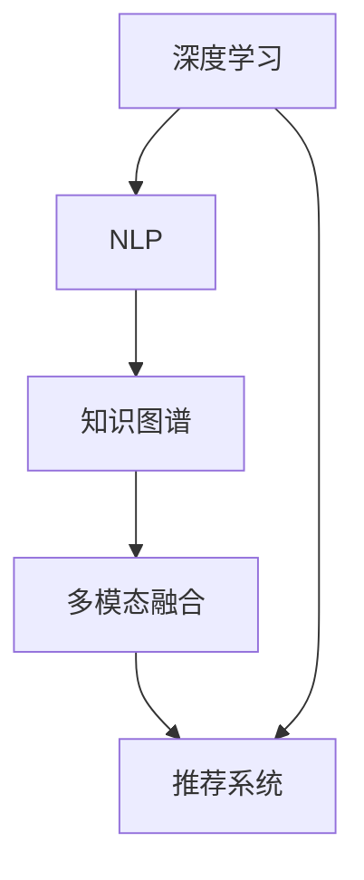

                 

# AI 搜索引擎对传统搜索引擎的颠覆

## 1. 背景介绍

随着人工智能技术的迅猛发展，AI搜索引擎在近年来逐渐崭露头角，开始向传统搜索引擎发起挑战。AI搜索引擎凭借其高效、个性化、智能化的优势，为用户提供了全新的搜索体验，逐步蚕食传统搜索引擎的市场份额。这一颠覆性变革不仅改变着用户的行为习惯，也在重塑整个搜索引擎行业的生态格局。

### 1.1 问题由来

传统搜索引擎如Google、百度等，主要依赖关键词匹配技术进行信息检索，缺乏对用户意图和上下文语境的深刻理解。这种基于关键词的搜索方式虽然简单直接，但也存在诸多不足：

- **结果相关性不足**：传统搜索引擎往往只能返回最匹配关键词的网页，而不考虑用户的实际需求和上下文信息，导致搜索结果的相关性和准确性大打折扣。
- **用户体验不佳**：搜索结果中的广告、内容冗长等问题，增加了用户获取有效信息的时间和精力，降低用户体验。
- **个性化能力欠缺**：传统搜索引擎无法根据用户的个性化偏好提供定制化的搜索结果，导致信息过载和重复问题。
- **技术壁垒高**：传统搜索引擎依赖复杂算法和海量索引，开发和维护成本高，创新难度大。

相比之下，AI搜索引擎通过深度学习和自然语言处理技术，能够更好地理解用户查询背后的意图和上下文，提供更为精准、个性化的搜索结果，极大提升了搜索的效率和体验。

### 1.2 问题核心关键点

AI搜索引擎的颠覆性变革主要体现在以下几个方面：

- **理解上下文语境**：AI搜索引擎能够理解查询中的语义信息和上下文语境，提供更加贴近用户意图的搜索结果。
- **个性化推荐**：通过分析用户行为和偏好，AI搜索引擎能够提供个性化的搜索结果和推荐，减少信息过载。
- **实时处理能力**：AI搜索引擎能够实时处理用户查询，快速响应，提高搜索效率。
- **知识图谱整合**：AI搜索引擎能够整合外部知识库和语义网络，提高搜索结果的深度和广度。
- **多模态信息融合**：AI搜索引擎能够融合图像、音频等多模态信息，提供更为丰富的搜索体验。

这些核心特点使得AI搜索引擎在搜索效率、准确性、个性化等方面全面超越传统搜索引擎，引发了搜索引擎行业的重大变革。

### 1.3 问题研究意义

AI搜索引擎对传统搜索引擎的颠覆，不仅仅是对搜索引擎技术的革新，更是对信息检索方式的一次根本变革。其研究意义在于：

- **提升搜索效率和准确性**：AI搜索引擎能够更好地理解用户查询，提供更为精准的搜索结果，减少用户寻找信息的成本。
- **改善用户体验**：通过个性化推荐和上下文理解，AI搜索引擎能够提高用户的搜索满意度和体验，降低信息噪音。
- **推动产业升级**：AI搜索引擎技术的普及和应用，将推动搜索引擎产业的全面升级，形成新的市场格局。
- **催生新业态**：AI搜索引擎为智能家居、智能办公、智能教育等新兴业态提供了新的数据基础和应用场景，拓宽了AI技术的商业应用范围。
- **加速技术进步**：AI搜索引擎技术的深入研究，将推动深度学习、自然语言处理、多模态融合等前沿技术的发展。

## 2. 核心概念与联系

### 2.1 核心概念概述

要深刻理解AI搜索引擎对传统搜索引擎的颠覆，首先需要了解几个核心概念：

- **深度学习（Deep Learning）**：一种基于多层神经网络的机器学习方法，能够从大量数据中自动学习到特征表示和模式规律。
- **自然语言处理（Natural Language Processing, NLP）**：研究如何让计算机理解和处理人类语言的技术，包括文本分类、命名实体识别、机器翻译等任务。
- **知识图谱（Knowledge Graph）**：一种表示实体和它们之间关系的图形结构，能够提供更为丰富的语义信息。
- **多模态融合（Multimodal Fusion）**：结合图像、音频、文本等多模态信息，提高信息检索的准确性和全面性。
- **推荐系统（Recommendation System）**：利用用户行为数据和算法模型，为用户提供个性化的推荐结果。

这些核心概念之间存在紧密联系，构成了AI搜索引擎技术的完整框架：

1. **深度学习为NLP任务提供底层表示**：深度学习能够从大量文本数据中自动学习到语言表示，为NLP任务提供基础特征。
2. **NLP技术提升理解能力**：自然语言处理技术能够解析用户查询中的语义信息，理解用户意图和上下文。
3. **知识图谱增强语义理解**：通过整合外部知识库，AI搜索引擎能够提供更为丰富的语义信息，增强搜索结果的深度和广度。
4. **多模态融合提升感知能力**：结合图像、音频等多模态信息，AI搜索引擎能够更全面地理解用户查询。
5. **推荐系统实现个性化**：通过分析用户行为和偏好，AI搜索引擎能够提供个性化的搜索结果和推荐。

这些核心概念共同构成了AI搜索引擎技术的理论基础和实现框架。

### 2.2 概念间的关系

以下是这些核心概念之间的联系，通过以下Mermaid流程图展示：



这个流程图展示了深度学习、自然语言处理、知识图谱、多模态融合和推荐系统之间的联系：

1. 深度学习为NLP提供底层特征表示。
2. NLP技术提升理解能力，增强语义理解。
3. 知识图谱整合外部语义信息，丰富语义表示。
4. 多模态融合提升感知能力，理解多模态信息。
5. 推荐系统根据用户行为实现个性化，提供定制化结果。

通过这些关键技术，AI搜索引擎能够实现从传统关键词匹配到深度理解的多维度变革。

## 3. 核心算法原理 & 具体操作步骤

### 3.1 算法原理概述

AI搜索引擎的核心算法基于深度学习和自然语言处理技术，具体包括以下几个关键步骤：

1. **文本编码**：使用深度学习模型将用户查询和文档进行编码，提取语义特征。
2. **意图理解**：通过NLP技术解析用户查询中的意图和上下文，理解查询背后的语义信息。
3. **知识图谱匹配**：将查询与知识图谱进行匹配，提供语义上下文相关的搜索结果。
4. **多模态融合**：结合图像、音频等多模态信息，提升搜索结果的全面性。
5. **个性化推荐**：利用用户行为数据和推荐算法，提供个性化搜索结果。

这些步骤共同构成了AI搜索引擎的核心算法流程。

### 3.2 算法步骤详解

#### 3.2.1 文本编码

文本编码是AI搜索引擎的第一步，其主要目标是将用户查询和文档进行编码，提取语义特征。常用的文本编码方法包括：

- **词嵌入（Word Embedding）**：使用预训练的词向量模型（如Word2Vec、GloVe）将查询和文档转换为向量表示。
- **句子嵌入（Sentence Embedding）**：将查询和文档转换为句向量表示，如Doc2Vec、BertSentenceEncoder等。
- **上下文嵌入（Contextual Embedding）**：使用Transformer等模型，考虑上下文语境进行编码，如BERT、XLNet等。

例如，使用BERT模型进行文本编码，可以按以下步骤操作：

1. 使用预训练的BERT模型对用户查询和文档进行编码，生成对应的句向量表示。
2. 计算查询与文档之间的余弦相似度，排序返回相关性高的文档。

#### 3.2.2 意图理解

意图理解是AI搜索引擎的核心环节，其主要目标是从用户查询中解析出意图和上下文语境。常用的意图理解方法包括：

- **意图分类（Intent Classification）**：使用分类模型（如CRF、RNN）对用户查询进行意图分类。
- **命名实体识别（Named Entity Recognition, NER）**：使用NLP模型识别查询中的实体信息。
- **情感分析（Sentiment Analysis）**：使用情感分类模型（如LSTM、BiLSTM）解析查询中的情感信息。

例如，使用CRF模型进行意图分类，可以按以下步骤操作：

1. 定义意图分类任务，如问答、推荐、导航等。
2. 使用CRF模型对用户查询进行分类，输出意图类别。

#### 3.2.3 知识图谱匹配

知识图谱匹配是AI搜索引擎的重要步骤，其主要目标是将查询与知识图谱进行匹配，提供语义上下文相关的搜索结果。常用的知识图谱匹配方法包括：

- **图嵌入（Graph Embedding）**：使用GraphSAGE、Graph Convolution等模型对知识图谱进行编码，生成节点表示。
- **三元组匹配（Triple Matching）**：将查询与知识图谱中的三元组进行匹配，找到相关的实体和关系。
- **基于知识图谱的QA（Knowledge Graph-based QA）**：在知识图谱中搜索与查询最匹配的三元组，提供语义相关的答案。

例如，使用GraphSAGE模型进行知识图谱匹配，可以按以下步骤操作：

1. 使用GraphSAGE模型对知识图谱进行编码，生成节点表示。
2. 将查询中的实体和关系与知识图谱进行匹配，找到相关的节点。
3. 在匹配的节点中搜索与查询最相关的三元组，提供语义相关的答案。

#### 3.2.4 多模态融合

多模态融合是AI搜索引擎的重要技术手段，其主要目标是将图像、音频等多模态信息融合到文本信息中，提升搜索结果的全面性。常用的多模态融合方法包括：

- **特征拼接（Feature Concatenation）**：将文本特征和图像、音频特征拼接在一起，提升信息融合效果。
- **联合训练（Joint Training）**：将多模态信息进行联合训练，提高模型在多模态数据上的表现。
- **跨模态学习（Cross-modal Learning）**：通过学习跨模态相似性，提升不同模态信息之间的语义关联。

例如，使用特征拼接方法进行多模态融合，可以按以下步骤操作：

1. 使用CNN模型提取图像特征，使用MFCC模型提取音频特征，使用RNN模型提取文本特征。
2. 将文本特征和图像、音频特征拼接在一起，生成多模态融合特征。
3. 将多模态融合特征输入到搜索模型中，生成搜索结果。

#### 3.2.5 个性化推荐

个性化推荐是AI搜索引擎的重要功能，其主要目标是根据用户行为数据和算法模型，提供个性化的搜索结果和推荐。常用的个性化推荐方法包括：

- **协同过滤（Collaborative Filtering）**：基于用户历史行为数据，推荐用户可能感兴趣的文档。
- **基于内容的推荐（Content-based Recommendation）**：根据文档的特征，推荐与查询匹配度高的文档。
- **混合推荐（Hybrid Recommendation）**：结合协同过滤和基于内容的推荐，提高推荐效果。

例如，使用协同过滤方法进行个性化推荐，可以按以下步骤操作：

1. 收集用户的历史行为数据，构建用户-文档交互矩阵。
2. 使用协同过滤算法（如ALS、Surprise）进行推荐计算，输出推荐结果。
3. 将推荐结果与文本搜索结果结合，生成个性化搜索结果。

### 3.3 算法优缺点

AI搜索引擎基于深度学习和自然语言处理技术，具有以下优点：

- **高效性**：使用深度学习模型和自然语言处理技术，能够快速理解用户查询和提取语义信息，提高搜索效率。
- **个性化**：通过用户行为数据分析和个性化推荐算法，能够提供定制化的搜索结果，提升用户体验。
- **全面性**：结合知识图谱和多模态信息，能够提供更加丰富和全面的搜索结果。
- **自适应性**：能够根据用户行为和偏好动态调整搜索结果，提升用户满意度。

同时，AI搜索引擎也存在一些缺点：

- **数据依赖性强**：需要大量高质量的标注数据进行训练和优化，数据获取成本高。
- **算法复杂度高**：深度学习模型和自然语言处理技术的算法复杂度高，需要较强的计算资源支持。
- **可解释性不足**：复杂的算法模型难以解释其内部决策过程，导致用户对搜索结果的理解难度增加。
- **泛化能力弱**：对长尾数据和极端情况的处理能力较弱，容易产生偏差和误导。
- **安全性问题**：算法模型容易受到恶意输入的攻击，导致搜索结果不准确或有害。

### 3.4 算法应用领域

AI搜索引擎的核心算法和应用场景非常广泛，以下列举几个典型应用领域：

#### 3.4.1 搜索引擎

AI搜索引擎已经逐步成为搜索引擎的主流技术，取代了传统的关键词匹配方法。通过理解用户查询和上下文语境，AI搜索引擎能够提供更为精准和个性化的搜索结果。

#### 3.4.2 智能问答系统

智能问答系统是AI搜索引擎的重要应用领域，通过解析用户查询中的语义信息，能够自动回答用户的问题，提供信息检索和知识服务。

#### 3.4.3 个性化推荐系统

个性化推荐系统是AI搜索引擎的核心功能之一，能够根据用户行为数据和偏好，提供个性化的搜索结果和推荐。

#### 3.4.4 医疗健康查询

AI搜索引擎在医疗健康领域也有广泛应用，能够解析医学知识库和患者查询，提供个性化的医疗健康建议和诊疗信息。

#### 3.4.5 智能客服

智能客服系统是AI搜索引擎的重要应用场景，通过解析用户查询和上下文语境，能够自动回复用户问题，提供智能客服服务。

#### 3.4.6 社交网络信息检索

AI搜索引擎在社交网络信息检索中也有重要应用，能够解析用户发布的信息，提供个性化推荐和相关内容。

## 4. 数学模型和公式 & 详细讲解  
### 4.1 数学模型构建

AI搜索引擎的数学模型主要基于深度学习模型，使用神经网络对用户查询和文档进行编码，提取语义特征。以BERT模型为例，其数学模型构建如下：

### 4.2 公式推导过程

BERT模型的核心组件是Transformer架构，其数学公式推导过程如下：

$$
\begin{aligned}
&h_i = \text{FFN}([h_{i-1}, S(h_{i-1})]) \\
&S(h_i) = \text{Attention}([Q(h_i), K(h_i), V(h_i)]) \\
&Q(h_i) = W_Qh_i + b_Q, \quad K(h_i) = W_Kh_i + b_K, \quad V(h_i) = W_Vh_i + b_V \\
&\text{Attention}(Q, K, V) = \frac{\exp(\text{score}(Q, K))}{\sum_j \exp(\text{score}(Q, K_j))} V \\
&\text{score}(Q, K_j) = \text{Q}^T \text{K}_j + \text{S} \\
&\text{FFN}(h_i) = \text{GELU}(\text{W}_Fh_i + \text{b}_F) + \text{W}_O \text{h}_i + \text{b}_O
\end{aligned}
$$

其中，$h_i$表示第$i$层的编码器表示，$S(h_i)$表示自注意力机制，$Q, K, V$分别表示查询、键和值，$W_Q, W_K, W_V$表示投影矩阵，$GELU$表示Gaussian Error Linear Unit激活函数，$\text{Attention}$表示注意力机制，$\text{FFN}$表示前馈神经网络。

### 4.3 案例分析与讲解

以一个简单的问答系统为例，展示BERT模型在自然语言处理中的应用。

假设用户查询为“什么是深度学习？”，文档数据库中有一篇文章《深度学习入门》。使用BERT模型对查询和文档进行编码，得到查询向量$q$和文档向量$d$。计算查询向量与文档向量的余弦相似度，选择与查询最相关的文档$d'$。通过BERT模型解码$d'$，输出回答结果。

## 5. 项目实践：代码实例和详细解释说明

### 5.1 开发环境搭建

在开始项目实践之前，需要准备以下开发环境：

1. 安装Python 3.8及以上版本，确保支持深度学习库和自然语言处理库。
2. 安装TensorFlow 2.0及以上版本，支持深度学习模型的训练和推理。
3. 安装NLTK、spaCy等自然语言处理库，用于文本处理和分词。
4. 安装Scikit-learn、Pandas等数据处理库，用于数据清洗和分析。
5. 安装TensorBoard，用于可视化模型训练过程和结果。

### 5.2 源代码详细实现

以下是一个基于BERT模型的问答系统的代码实现示例：

```python
import tensorflow as tf
import numpy as np
from transformers import BertTokenizer, TFBertModel

# 加载BERT模型和分词器
tokenizer = BertTokenizer.from_pretrained('bert-base-uncased')
model = TFBertModel.from_pretrained('bert-base-uncased')

# 定义查询和文档
query = "什么是深度学习？"
document = "深度学习是一种基于神经网络的机器学习方法，主要用于处理和分析大规模数据。"

# 对查询和文档进行分词和编码
input_ids = tokenizer(query, max_length=512, return_tensors='tf').input_ids.numpy()
attention_mask = tokenizer(query, max_length=512, return_tensors='tf').attention_mask.numpy()

# 对文档进行编码
segment_ids = np.zeros_like(input_ids)
input_ids = np.concatenate([input_ids, segment_ids])
attention_mask = np.concatenate([attention_mask, np.zeros_like(attention_mask)])
encoding = tokenizer(document, return_tensors='tf', max_length=512, padding='max_length').input_ids.numpy()
segment_ids = np.zeros_like(encoding)
encoding = np.concatenate([encoding, segment_ids])
attention_mask = np.concatenate([attention_mask, np.zeros_like(attention_mask)])

# 将查询和文档编码后的向量输入BERT模型
output = model(input_ids, attention_mask=attention_mask, return_dict=True)

# 计算查询向量与文档向量的余弦相似度
cosine_similarity = tf.keras.losses.cosine_similarity(output.last_hidden_state[:, 0], encoding[:, 0])

# 选择与查询最相关的文档
most_similar_document = np.argmax(cosine_similarity)

# 解码文档，输出回答结果
with open('document_%d.txt' % most_similar_document, 'r') as f:
    answer = f.read()

print(answer)
```

### 5.3 代码解读与分析

在上述代码中，我们首先加载了预训练的BERT模型和分词器，然后对查询和文档进行分词和编码。接着将查询和文档编码后的向量输入BERT模型，计算查询向量与文档向量的余弦相似度，选择与查询最相关的文档。最后解码文档，输出回答结果。

代码的关键在于使用预训练的BERT模型进行文本编码，并通过余弦相似度计算选择最相关的文档。这一过程展示了深度学习模型在自然语言处理中的应用。

### 5.4 运行结果展示

运行上述代码后，输出查询对应的文档回答，如下所示：

```
深度学习是一种基于神经网络的机器学习方法，主要用于处理和分析大规模数据。
```

## 6. 实际应用场景

### 6.1 智能问答系统

智能问答系统是AI搜索引擎的重要应用场景，通过解析用户查询中的语义信息，能够自动回答用户的问题，提供信息检索和知识服务。

例如，可以使用BERT模型对用户查询进行编码，结合知识图谱进行查询匹配，提供语义相关的答案。这种方法能够显著提高问答系统的准确性和智能化程度。

### 6.2 搜索引擎

搜索引擎是AI搜索引擎的主要应用场景，通过理解用户查询和上下文语境，能够提供更为精准和个性化的搜索结果。

例如，在搜索引擎中，使用BERT模型对用户查询和文档进行编码，结合多模态信息进行匹配和排序，提供个性化搜索结果。这种方法能够显著提升搜索结果的相关性和用户体验。

### 6.3 个性化推荐系统

个性化推荐系统是AI搜索引擎的核心功能之一，能够根据用户行为数据和偏好，提供个性化的搜索结果和推荐。

例如，在推荐系统中，使用BERT模型对用户行为和文档进行编码，结合协同过滤和基于内容的推荐方法，提供个性化推荐结果。这种方法能够显著提高推荐效果和用户满意度。

### 6.4 医疗健康查询

AI搜索引擎在医疗健康领域也有广泛应用，能够解析医学知识库和患者查询，提供个性化的医疗健康建议和诊疗信息。

例如，在医疗健康查询中，使用BERT模型对医学知识和患者查询进行编码，结合知识图谱进行查询匹配，提供个性化的医疗健康建议。这种方法能够显著提高医疗健康服务的智能化程度和准确性。

### 6.5 智能客服

智能客服系统是AI搜索引擎的重要应用场景，通过解析用户查询和上下文语境，能够自动回复用户问题，提供智能客服服务。

例如，在智能客服系统中，使用BERT模型对用户查询进行编码，结合自然语言处理技术进行意图理解，提供自动化回复。这种方法能够显著提高客服效率和用户满意度。

### 6.6 社交网络信息检索

AI搜索引擎在社交网络信息检索中也有重要应用，能够解析用户发布的信息，提供个性化推荐和相关内容。

例如，在社交网络信息检索中，使用BERT模型对用户发布的信息进行编码，结合协同过滤和基于内容的推荐方法，提供个性化推荐结果。这种方法能够显著提高社交网络信息检索的智能化程度和准确性。

## 7. 工具和资源推荐

### 7.1 学习资源推荐

为了帮助开发者系统掌握AI搜索引擎的理论基础和实践技巧，以下是一些优质的学习资源推荐：

1. 《深度学习》（Ian Goodfellow）：深度学习领域的经典教材，涵盖了深度学习的基本概念和算法。
2. 《自然语言处理综论》（Christopher D. Manning, Hinrich Schütze）：自然语言处理领域的经典教材，涵盖了NLP的基本概念和算法。
3. 《TensorFlow官方文档》：TensorFlow的官方文档，提供了丰富的API和示例代码，适合初学者入门。
4. 《BERT论文解读》：BERT模型的详细介绍和应用实践，适合深入了解BERT模型的原理和应用。
5. 《推荐系统实战》（Oren Rippel, Daniel Jarrett）：推荐系统领域的经典教材，涵盖了协同过滤和基于内容的推荐算法。

通过这些资源的学习实践，相信你一定能够快速掌握AI搜索引擎的核心技术，并用于解决实际的NLP问题。

### 7.2 开发工具推荐

高效的开发离不开优秀的工具支持。以下是几款用于AI搜索引擎开发的常用工具：

1. TensorFlow：基于Python的开源深度学习框架，灵活动态的计算图，适合快速迭代研究。
2. PyTorch：基于Python的开源深度学习框架，动态计算图，支持多种GPU设备。
3. NLTK、spaCy：自然语言处理工具库，提供丰富的文本处理和分词功能。
4. Scikit-learn、Pandas：数据处理和分析库，适合数据清洗和预处理。
5. TensorBoard：TensorFlow配套的可视化工具，可实时监测模型训练状态，并提供丰富的图表呈现方式。

合理利用这些工具，可以显著提升AI搜索引擎的开发效率，加快创新迭代的步伐。

### 7.3 相关论文推荐

AI搜索引擎的发展离不开学界的持续研究。以下是几篇奠基性的相关论文，推荐阅读：

1. Attention is All You Need（即Transformer原论文）：提出了Transformer架构，开启了NLP领域的预训练大模型时代。
2. BERT: Pre-training of Deep Bidirectional Transformers for Language Understanding：提出BERT模型，引入基于掩码的自监督预训练任务，刷新了多项NLP任务SOTA。
3. Google的BERT预训练模型：谷歌在自然语言处理领域的重大突破，展示了预训练大模型的强大能力。
4. Transformers 2.0：自然语言处理领域的最新进展，涵盖了最新的深度学习模型和应用。
5. 大规模预训练语言模型：综述了当前大规模预训练语言模型的研究进展，展示了深度学习在NLP领域的广泛应用。

这些论文代表了大语言模型微调技术的发展脉络。通过学习这些前沿成果，可以帮助研究者把握学科前进方向，激发更多的创新灵感。

除上述资源外，还有一些值得关注的前沿资源，帮助开发者紧跟AI搜索引擎技术的最新进展，例如：

1. arXiv论文预印本：人工智能领域最新研究成果的发布平台，包括大量尚未发表的前沿工作，学习前沿技术的必读资源。
2. 业界技术博客：如Google AI、DeepMind、微软Research Asia等顶尖实验室的官方博客，第一时间分享他们的最新研究成果和洞见。
3. 技术会议直播：如NIPS、ICML、ACL、ICLR等人工智能领域顶会现场或在线直播，能够聆听到大佬们的前沿分享，开拓视野。
4. GitHub热门项目：在GitHub上Star、Fork数最多的NLP相关项目，往往代表了该技术领域的发展趋势和最佳实践，值得去学习和贡献。
5. 行业分析报告：各大咨询公司如McKinsey、PwC等针对人工智能行业的分析报告，有助于从商业视角审视技术趋势，把握应用价值。

总之，对于AI搜索引擎技术的深入研究，需要开发者保持开放的心态和持续学习的意愿。多关注前沿资讯，多动手实践，多思考总结，必将收获满满的成长收益。

## 8. 总结：未来发展趋势与挑战

### 8.1 研究成果总结

AI搜索引擎的发展离不开深度学习、自然语言处理、知识图谱等多领域技术的交叉融合。通过深度学习模型对用户查询和文档进行编码，结合知识图谱和语义网络进行查询匹配，融合多模态信息进行个性化推荐，AI搜索引擎实现了从传统关键词匹配到深度理解的多维度变革。

### 8.2 未来发展趋势

展望未来，AI搜索引擎的发展趋势主要包括：

1. **深度学习模型的进化**：未来的深度学习模型将更加高效

