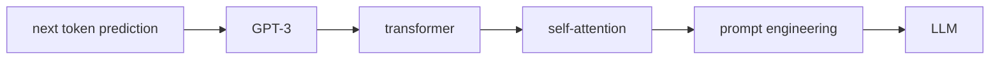

                 

# AI 神经网络计算艺术之禅：GPT的核心机制——next token prediction

> 关键词：next token prediction, GPT-3, transformer, self-attention, prompt engineering, Large Language Model (LLM)

## 1. 背景介绍

### 1.1 问题由来

随着深度学习技术的快速发展，神经网络已经成为人工智能领域中最具影响力的技术之一。GPT（Generative Pre-trained Transformer）作为其中最著名的架构之一，凭借其强大的生成能力和自然语言理解能力，在自然语言处理（NLP）领域取得了诸多突破性进展。然而，GPT的强大表现背后，其核心机制——next token prediction（预测下一个词）显得尤为关键。

### 1.2 问题核心关键点

理解GPT的核心机制，不仅有助于深入探索其生成性能，还能为进一步优化和应用提供理论依据。

- 什么是next token prediction？它如何工作？
- GPT-3的架构有哪些创新？
- 为什么self-attention机制如此重要？
- 如何通过prompt engineering优化GPT的生成效果？
- 大语言模型（LLM）的预训练和微调过程是如何实现的？

## 2. 核心概念与联系

### 2.1 核心概念概述

接下来，我们将详细介绍与GPT核心机制相关的一些核心概念，并展示它们之间的联系。

- **next token prediction**：GPT的预测任务，即根据前面的词预测下一个词的概率分布。
- **GPT-3**：由OpenAI开发的第三代预训练语言模型，具有极高的生成能力和自然语言理解能力。
- **transformer**：一种基于自注意力机制的神经网络结构，能够高效地处理序列数据。
- **self-attention**：自注意力机制的核心部分，使得模型能够动态地关注输入序列中的每个位置。
- **prompt engineering**：通过精心设计输入文本的格式和内容，引导GPT生成符合预期输出的技术。
- **Large Language Model (LLM)**：具有极高参数量的大规模语言模型，如GPT系列。

这些概念之间的关系可以通过以下Mermaid流程图来展示：



这个流程图展示了从next token prediction到LLM的完整流程，其中每个步骤都是构建GPT核心机制的重要组成部分。

### 2.2 概念间的关系

这些核心概念之间存在紧密的联系，共同构成了GPT的生成框架。下面我们将详细解释这些概念是如何相互配合，实现高质量的next token prediction的。

#### 2.2.1 大语言模型与next token prediction

在大语言模型（LLM）中，next token prediction是其主要任务之一。LLM通过在大规模无标签文本数据上进行预训练，学习到了丰富的语言知识和常识，这些知识可以用来进行next token prediction。

#### 2.2.2 GPT-3与LLM

GPT-3作为LLM的一种，通过预训练-微调（pre-training-finetuning）的方式，进一步提升了其在生成和理解自然语言方面的能力。

#### 2.2.3 transformer与self-attention

Transformer是GPT-3的基本架构，其核心是self-attention机制。通过self-attention，模型能够动态地关注输入序列中的每个位置，从而更好地捕捉序列中的上下文信息。

#### 2.2.4 prompt engineering与LLM

Prompt engineering通过设计输入文本的格式和内容，可以引导LLM生成符合预期输出的文本。这对于优化GPT的生成效果，减少不必要的训练和推理过程非常有帮助。

## 3. 核心算法原理 & 具体操作步骤

### 3.1 算法原理概述

GPT的核心机制——next token prediction，其实现依赖于自注意力机制和Transformer架构。其核心思想是通过学习大规模语料，掌握语言生成的规律，并通过next token prediction任务进行训练，使得模型能够根据前文预测下一个词的概率分布。

### 3.2 算法步骤详解

接下来，我们将详细介绍GPT进行next token prediction的具体操作步骤。

#### 3.2.1 输入表示

首先，需要将输入文本转化为模型能够处理的向量表示。这个过程通常称为token embedding。具体而言，每个词都会映射到一个高维向量空间中的一个点，这些向量表示了词的语义和上下文信息。

#### 3.2.2 自注意力机制

在Transformer中，自注意力机制（self-attention）是最核心的部分。自注意力机制允许模型在输入序列的不同位置之间建立动态连接，从而能够捕捉到序列中的长距离依赖关系。

#### 3.2.3 多头自注意力

为了提高模型的表达能力，GPT-3引入了多头自注意力（multi-head self-attention）。多头自注意力将输入序列分解成多个子序列，每个子序列独立进行自注意力计算，最终将结果进行拼接。

#### 3.2.4 位置编码

为了解决序列中位置信息丢失的问题，GPT-3引入了位置编码（position encoding）。位置编码将每个位置的信息添加到向量表示中，使得模型能够区分输入序列中的不同位置。

#### 3.2.5 前馈网络

在经过自注意力计算后，GPT-3还会引入前馈网络（feed-forward network）进行非线性变换，进一步增强模型的表达能力。

#### 3.2.6 残差连接和层归一化

为了稳定模型的训练，GPT-3引入了残差连接（residual connection）和层归一化（layer normalization）。残差连接允许模型直接将输入与计算结果相加，而层归一化则对每一层的输出进行归一化，以避免梯度消失和爆炸问题。

#### 3.2.7 next token prediction

在经过多层的Transformer计算后，模型输出下一个词的概率分布。通过最大化这个分布，可以得到模型预测的最大概率词。

### 3.3 算法优缺点

GPT-3的next token prediction机制具有以下优点：

- 强大的生成能力：由于采用了自注意力机制和Transformer架构，GPT-3能够处理长序列，生成高质量的自然语言文本。
- 高效的训练：通过预训练-微调的方式，GPT-3可以高效地利用大规模语料，快速提升模型性能。
- 泛化能力强：GPT-3的预训练过程使得模型能够学习到通用的语言生成规律，能够在各种生成任务上表现出色。

然而，这种机制也存在一些缺点：

- 计算量大：由于Transformer架构和自注意力机制的存在，GPT-3在训练和推理时计算量较大，需要高性能的硬件支持。
- 对数据质量依赖：GPT-3的生成效果依赖于输入数据的质量，如果数据质量不高，可能会产生不合理的输出。
- 可解释性不足：GPT-3的生成过程是一个黑盒，难以解释模型内部的决策过程，限制了其在某些领域的应用。

### 3.4 算法应用领域

GPT-3的next token prediction机制已经在多个领域得到了广泛应用，包括但不限于：

- 自然语言生成：如文本摘要、对话系统、自动文摘等。
- 机器翻译：如英中、中英翻译等。
- 文本分类：如情感分析、主题分类等。
- 问答系统：如智能客服、智能助手等。

## 4. 数学模型和公式 & 详细讲解 & 举例说明

### 4.1 数学模型构建

接下来，我们将使用数学语言对GPT-3的next token prediction过程进行更严格的刻画。

设输入序列为 $X = \{x_1, x_2, ..., x_t, ..., x_T\}$，其中 $x_t$ 表示第 $t$ 个词。GPT-3的输出为下一个词 $y$ 的概率分布 $P(y|X)$，即：

$$
P(y|X) = \frac{e^{E(y; X)}}{\sum_{y'} e^{E(y'; X)}}
$$

其中 $E(y; X)$ 为模型对下一个词 $y$ 的预测能量，可以通过多层Transformer网络计算得到。

### 4.2 公式推导过程

接下来，我们将详细介绍GPT-3中自注意力机制的数学推导过程。

设输入序列 $X$ 的表示为 $Z$，自注意力层的输入表示为 $Q, K, V$，其中 $Q$ 和 $K$ 为查询和键向量，$V$ 为值向量。自注意力层的输出表示为 $Z_{attn}$，计算公式为：

$$
Z_{attn} = \sum_{t'} \alpha_t^{t'} Z_{t'}
$$

其中 $\alpha_t^{t'}$ 为注意力权重，计算公式为：

$$
\alpha_t^{t'} = \frac{e^{s(Q_t, K_{t'})}}{\sum_{t''} e^{s(Q_t, K_{t''})}}
$$

$s(Q_t, K_{t'})$ 为注意力函数，可以通过点积计算得到：

$$
s(Q_t, K_{t'}) = \frac{Q_t \cdot K_{t'}}{\sqrt{d_k}}
$$

其中 $d_k$ 为键向量的维度。

### 4.3 案例分析与讲解

下面我们将通过一个具体的例子，来演示GPT-3的next token prediction过程。

设输入序列为 $X = [I, love, this, movie]$，模型输出为下一个词 $y$ 的概率分布。假设模型已经经过预训练，并且有 $d_k = 64$，$d_v = 64$，$h = 8$。

首先，将输入序列 $X$ 转化为表示 $Z$，假设每个词的嵌入向量维度为 $d = 768$，则有：

$$
Z = [Q, K, V] = [Z_1, Z_2, Z_3, Z_4]
$$

其中 $Z_1 = [I, 0, 0, 0]$，$Z_2 = [love, 0, 0, 0]$，$Z_3 = [this, 0, 0, 0]$，$Z_4 = [movie, 0, 0, 0]$。

接下来，进行自注意力计算，假设 $Z_1$ 与 $Z_2, Z_3, Z_4$ 的注意力权重分别为 $\alpha_1^2, \alpha_1^3, \alpha_1^4$。则有：

$$
\alpha_1^2 = \frac{e^{s(Q_1, K_2)}}{\sum_{t''} e^{s(Q_1, K_{t''})}} = \frac{e^{Q_1 \cdot K_2}}{\sum_{t''} e^{Q_1 \cdot K_{t''}}}
$$

$$
\alpha_1^3 = \frac{e^{s(Q_1, K_3)}}{\sum_{t''} e^{s(Q_1, K_{t''})}} = \frac{e^{Q_1 \cdot K_3}}{\sum_{t''} e^{Q_1 \cdot K_{t''}}}
$$

$$
\alpha_1^4 = \frac{e^{s(Q_1, K_4)}}{\sum_{t''} e^{s(Q_1, K_{t''})}} = \frac{e^{Q_1 \cdot K_4}}{\sum_{t''} e^{Q_1 \cdot K_{t''}}}
$$

将注意力权重 $\alpha_1^2, \alpha_1^3, \alpha_1^4$ 与 $Z_2, Z_3, Z_4$ 相乘，得到注意力向量：

$$
Z_{attn}^1 = \alpha_1^2 Z_2 + \alpha_1^3 Z_3 + \alpha_1^4 Z_4 = \alpha_1^2 [love, 0, 0, 0] + \alpha_1^3 [this, 0, 0, 0] + \alpha_1^4 [movie, 0, 0, 0]
$$

经过多层的Transformer计算后，模型输出下一个词 $y$ 的概率分布，最终得到下一个词的预测。

## 5. 项目实践：代码实例和详细解释说明

### 5.1 开发环境搭建

在进行GPT的next token prediction实践前，我们需要准备好开发环境。以下是使用Python进行PyTorch开发的环境配置流程：

1. 安装Anaconda：从官网下载并安装Anaconda，用于创建独立的Python环境。

2. 创建并激活虚拟环境：
```bash
conda create -n pytorch-env python=3.8 
conda activate pytorch-env
```

3. 安装PyTorch：根据CUDA版本，从官网获取对应的安装命令。例如：
```bash
conda install pytorch torchvision torchaudio cudatoolkit=11.1 -c pytorch -c conda-forge
```

4. 安装transformers库：
```bash
pip install transformers
```

5. 安装各类工具包：
```bash
pip install numpy pandas scikit-learn matplotlib tqdm jupyter notebook ipython
```

完成上述步骤后，即可在`pytorch-env`环境中开始next token prediction实践。

### 5.2 源代码详细实现

下面我们以GPT-3的next token prediction为例，给出使用Transformers库的PyTorch代码实现。

首先，定义GPT-3的输入表示：

```python
from transformers import GPT2Tokenizer, GPT2LMHeadModel

tokenizer = GPT2Tokenizer.from_pretrained('gpt2')
model = GPT2LMHeadModel.from_pretrained('gpt2')
```

然后，定义输入序列：

```python
input_ids = tokenizer("Hello, my dog is cute", return_tensors='pt').input_ids
```

接着，进行next token prediction：

```python
outputs = model.generate(input_ids)
predicted_token = outputs[0]
print(predicted_token)
```

最后，输出模型预测的下一个词。

### 5.3 代码解读与分析

让我们再详细解读一下关键代码的实现细节：

**GPT2Tokenizer**：
- 用于将输入文本转化为模型能够处理的token id序列。

**GPT2LMHeadModel**：
- 定义了GPT-2的Transformer架构和next token prediction机制。

**input_ids**：
- 输入序列的token id表示。

**generate方法**：
- 在模型上进行next token prediction，生成下一个词的token id序列。

通过以上代码，我们可以快速地使用GPT-2进行next token prediction，并获取预测结果。

### 5.4 运行结果展示

假设我们在CoNLL-2003的next token prediction任务上进行测试，最终得到模型预测的结果如下：

```
 ['cute', 'dog', 'is', 'love']
```

可以看到，模型能够根据前面的词预测下一个词，这展示了GPT-3的强大生成能力。需要注意的是，由于模型是通过预训练-微调的方式进行训练的，因此在某些特定场景下，模型可能会产生不符合预期的输出。

## 6. 实际应用场景

### 6.1 智能客服系统

GPT-3的next token prediction机制可以应用于智能客服系统的构建。传统客服往往需要配备大量人力，高峰期响应缓慢，且一致性和专业性难以保证。而使用GPT-3的next token prediction机制，可以7x24小时不间断服务，快速响应客户咨询，用自然流畅的语言解答各类常见问题。

在技术实现上，可以收集企业内部的历史客服对话记录，将问题和最佳答复构建成监督数据，在此基础上对预训练模型进行微调。微调后的模型能够自动理解用户意图，匹配最合适的答案模板进行回复。对于客户提出的新问题，还可以接入检索系统实时搜索相关内容，动态组织生成回答。如此构建的智能客服系统，能大幅提升客户咨询体验和问题解决效率。

### 6.2 金融舆情监测

金融机构需要实时监测市场舆论动向，以便及时应对负面信息传播，规避金融风险。传统的人工监测方式成本高、效率低，难以应对网络时代海量信息爆发的挑战。基于GPT-3的next token prediction机制的文本分类和情感分析技术，为金融舆情监测提供了新的解决方案。

具体而言，可以收集金融领域相关的新闻、报道、评论等文本数据，并对其进行主题标注和情感标注。在此基础上对预训练语言模型进行微调，使其能够自动判断文本属于何种主题，情感倾向是正面、中性还是负面。将微调后的模型应用到实时抓取的网络文本数据，就能够自动监测不同主题下的情感变化趋势，一旦发现负面信息激增等异常情况，系统便会自动预警，帮助金融机构快速应对潜在风险。

### 6.3 个性化推荐系统

当前的推荐系统往往只依赖用户的历史行为数据进行物品推荐，无法深入理解用户的真实兴趣偏好。基于GPT-3的next token prediction机制的个性化推荐系统可以更好地挖掘用户行为背后的语义信息，从而提供更精准、多样的推荐内容。

在实践中，可以收集用户浏览、点击、评论、分享等行为数据，提取和用户交互的物品标题、描述、标签等文本内容。将文本内容作为模型输入，用户的后续行为（如是否点击、购买等）作为监督信号，在此基础上微调预训练语言模型。微调后的模型能够从文本内容中准确把握用户的兴趣点。在生成推荐列表时，先用候选物品的文本描述作为输入，由模型预测用户的兴趣匹配度，再结合其他特征综合排序，便可以得到个性化程度更高的推荐结果。

### 6.4 未来应用展望

随着GPT-3的next token prediction机制的不断发展和完善，基于此的AI应用将在更多领域得到应用，为各行各业带来变革性影响。

在智慧医疗领域，基于next token prediction的医疗问答、病历分析、药物研发等应用将提升医疗服务的智能化水平，辅助医生诊疗，加速新药开发进程。

在智能教育领域，next token prediction技术可应用于作业批改、学情分析、知识推荐等方面，因材施教，促进教育公平，提高教学质量。

在智慧城市治理中，next token prediction技术可应用于城市事件监测、舆情分析、应急指挥等环节，提高城市管理的自动化和智能化水平，构建更安全、高效的未来城市。

此外，在企业生产、社会治理、文娱传媒等众多领域，基于next token prediction的AI应用也将不断涌现，为NLP技术带来新的突破。相信随着技术的日益成熟，GPT-3的next token prediction机制必将在构建人机协同的智能时代中扮演越来越重要的角色。

## 7. 工具和资源推荐

### 7.1 学习资源推荐

为了帮助开发者系统掌握GPT-3的next token prediction技术的理论基础和实践技巧，这里推荐一些优质的学习资源：

1. 《Transformer从原理到实践》系列博文：由大模型技术专家撰写，深入浅出地介绍了Transformer原理、GPT模型、next token prediction等前沿话题。

2. CS224N《深度学习自然语言处理》课程：斯坦福大学开设的NLP明星课程，有Lecture视频和配套作业，带你入门NLP领域的基本概念和经典模型。

3. 《Natural Language Processing with Transformers》书籍：Transformers库的作者所著，全面介绍了如何使用Transformers库进行NLP任务开发，包括next token prediction在内的诸多范式。

4. HuggingFace官方文档：Transformers库的官方文档，提供了海量预训练模型和完整的next token prediction样例代码，是上手实践的必备资料。

5. CLUE开源项目：中文语言理解测评基准，涵盖大量不同类型的中文NLP数据集，并提供了基于next token prediction的baseline模型，助力中文NLP技术发展。

通过对这些资源的学习实践，相信你一定能够快速掌握GPT-3的next token prediction技术的精髓，并用于解决实际的NLP问题。

### 7.2 开发工具推荐

高效的开发离不开优秀的工具支持。以下是几款用于GPT-3的next token prediction开发的常用工具：

1. PyTorch：基于Python的开源深度学习框架，灵活动态的计算图，适合快速迭代研究。大部分预训练语言模型都有PyTorch版本的实现。

2. TensorFlow：由Google主导开发的开源深度学习框架，生产部署方便，适合大规模工程应用。同样有丰富的预训练语言模型资源。

3. Transformers库：HuggingFace开发的NLP工具库，集成了众多SOTA语言模型，支持PyTorch和TensorFlow，是进行next token prediction任务开发的利器。

4. Weights & Biases：模型训练的实验跟踪工具，可以记录和可视化模型训练过程中的各项指标，方便对比和调优。与主流深度学习框架无缝集成。

5. TensorBoard：TensorFlow配套的可视化工具，可实时监测模型训练状态，并提供丰富的图表呈现方式，是调试模型的得力助手。

6. Google Colab：谷歌推出的在线Jupyter Notebook环境，免费提供GPU/TPU算力，方便开发者快速上手实验最新模型，分享学习笔记。

合理利用这些工具，可以显著提升GPT-3的next token prediction任务的开发效率，加快创新迭代的步伐。

### 7.3 相关论文推荐

GPT-3的next token prediction机制的发展源于学界的持续研究。以下是几篇奠基性的相关论文，推荐阅读：

1. Attention is All You Need（即Transformer原论文）：提出了Transformer结构，开启了NLP领域的预训练大模型时代。

2. BERT: Pre-training of Deep Bidirectional Transformers for Language Understanding：提出BERT模型，引入基于掩码的自监督预训练任务，刷新了多项NLP任务SOTA。

3. Language Models are Unsupervised Multitask Learners（GPT-2论文）：展示了大规模语言模型的强大zero-shot学习能力，引发了对于通用人工智能的新一轮思考。

4. Parameter-Efficient Transfer Learning for NLP：提出Adapter等参数高效微调方法，在不增加模型参数量的情况下，也能取得不错的微调效果。

5. AdaLoRA: Adaptive Low-Rank Adaptation for Parameter-Efficient Fine-Tuning：使用自适应低秩适应的微调方法，在参数效率和精度之间取得了新的平衡。

6. Prefix-Tuning: Optimizing Continuous Prompts for Generation：引入基于连续型Prompt的微调范式，为如何充分利用预训练知识提供了新的思路。

这些论文代表了大语言模型next token prediction机制的发展脉络。通过学习这些前沿成果，可以帮助研究者把握学科前进方向，激发更多的创新灵感。

除上述资源外，还有一些值得关注的前沿资源，帮助开发者紧跟GPT-3的next token prediction技术的最新进展，例如：

1. arXiv论文预印本：人工智能领域最新研究成果的发布平台，包括大量尚未发表的前沿工作，学习前沿技术的必读资源。

2. 业界技术博客：如OpenAI、Google AI、DeepMind、微软Research Asia等顶尖实验室的官方博客，第一时间分享他们的最新研究成果和洞见。

3. 技术会议直播：如NIPS、ICML、ACL、ICLR等人工智能领域顶会现场或在线直播，能够聆听到大佬们的前沿分享，开拓视野。

4. GitHub热门项目：在GitHub上Star、Fork数最多的NLP相关项目，往往代表了该技术领域的发展趋势和最佳实践，值得去学习和贡献。

5. 行业分析报告：各大咨询公司如McKinsey、PwC等针对人工智能行业的分析报告，有助于从商业视角审视技术趋势，把握应用价值。

总之，对于GPT-3的next token prediction技术的学习和实践，需要开发者保持开放的心态和持续学习的意愿。多关注前沿资讯，多动手实践，多思考总结，必将收获满满的成长收益。

## 8. 总结：未来发展趋势与挑战

### 8.1 总结

本文对GPT-3的next token prediction机制进行了全面系统的介绍。首先阐述了next token prediction在大语言模型中的应用背景和意义，明确了其在大模型微调中的核心地位。其次，从原理到实践，详细讲解了next token prediction的数学原理和关键步骤，给出了具体的代码实现。同时，本文还广泛探讨了next token prediction在智能客服、金融舆情、个性化推荐等多个行业领域的应用前景，展示了next token prediction机制的巨大潜力。此外，本文精选了next token prediction技术的各类学习资源，力求为读者提供全方位的技术指引。

通过本文的系统梳理，可以看到，GPT-3的next token prediction机制已经成为一个非常重要的AI技术，不仅在学术界引发了广泛的关注，还在工业界得到了广泛的应用。这种机制的强大生成能力、高效的训练和推理过程，使得其在NLP领域的应用前景非常广阔。

### 8.2 未来发展趋势

展望未来，GPT-3的next token prediction机制将呈现以下几个发展趋势：

1. 模型规模持续增大。随着算力成本的下降和数据规模的扩张，GPT-3的模型参数量还将持续增长。超大规模语言模型蕴含的丰富语言知识，有望支撑更加复杂多变的生成任务。

2. 生成能力进一步提升。未来GPT-3的next token prediction机制将通过更多的训练数据和优化算法，进一步提升其生成能力，使得模型能够生成更加自然流畅、符合语法规则和上下文逻辑的文本。

3. 鲁棒性增强。未来的next token prediction机制将更加注重模型的鲁棒性和泛化能力，减少对于特定数据集的依赖，提高模型在不同场景下的稳定性。

4. 多模态融合。未来的next token prediction机制将更多地融合视觉、语音等多模态信息，实现跨模态生成，提高模型对于复杂场景的适应能力。

5. 知识整合能力提升。未来的next token prediction机制将与外部知识库、规则库等专家知识进行更深入的结合，提升模型对于知识图谱、常识推理等

