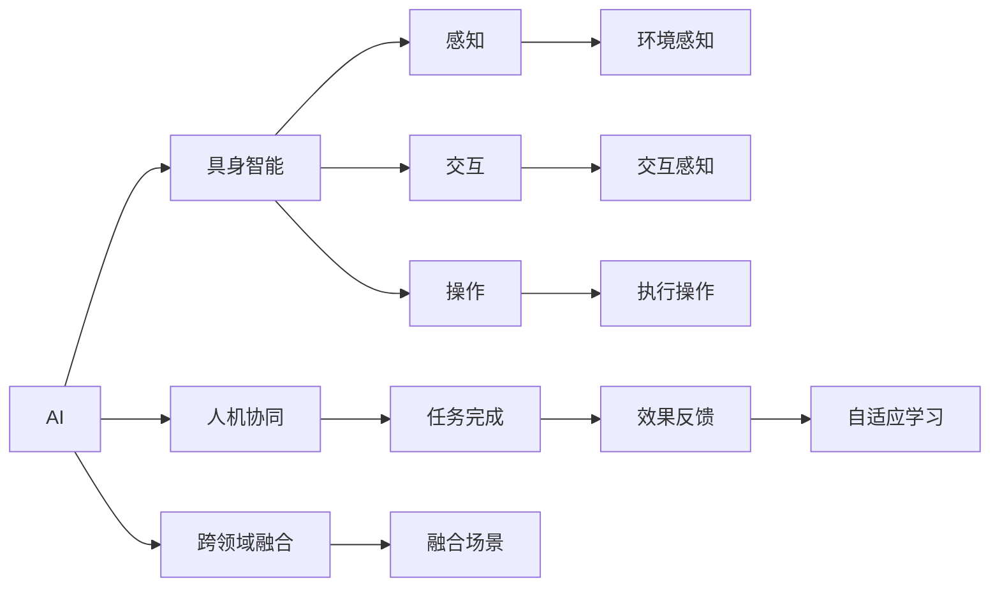

                 

# AI+具身智能：产业未来将走向何处

## 1. 背景介绍

随着人工智能(AI)技术的不断发展，AI+具身智能（AI+embodied intelligence）正在逐渐成为产业变革的新趋势。具身智能强调将AI技术与物理实体和环境相结合，使机器具备对环境感知、交互、操控的能力，实现真正的"人机协同"。相较于传统的基于计算机视觉、自然语言处理等虚拟技术的AI应用，AI+具身智能更加贴近人类的日常活动，能够提供更加自然、直观、高效的服务。

在医疗、教育、制造、交通、农业、智能家居等众多领域，AI+具身智能正逐步改变传统的业务模式，提升生产效率和用户体验。例如，在医疗领域，机器人手术系统通过与医生的密切配合，实现了更高精度的微创手术；在教育领域，智能教具与虚拟助教相结合，帮助学生更好地理解和掌握知识；在制造领域，AI+机器人能够完成复杂、高风险的生产任务，提升产品品质和生产效率。

AI+具身智能的未来发展将如何影响产业生态，带来哪些机遇与挑战，本文将进行深入探讨。

## 2. 核心概念与联系

### 2.1 核心概念概述

AI+具身智能的核心理念是将AI技术与具身体现相结合，使机器能够感知、理解、操作物理世界，实现人机协同。以下是几个关键核心概念：

- **AI**：指利用算法、模型等技术对数据进行处理、分析、推理，完成特定任务的人工智能技术。
- **具身智能**：指将AI技术嵌入到物理实体或环境中，使机器具备感知、交互、操作的能力，实现真正的"人机协同"。
- **人机协同**：指将人类与机器的各自优势结合起来，通过交互与协作完成复杂任务，提升整体效能。
- **跨领域融合**：指AI+具身智能能够跨界融合多个领域的技术和应用，如AI+机器人、AI+智能家居等。
- **自适应学习**：指具身智能系统能够通过与环境的交互，不断学习和优化自身行为，实现持续改进。

### 2.2 核心概念之间的联系

通过以下Mermaid流程图展示核心概念之间的关系：



这个流程图展示了一系列核心概念的相互关系：

1. **AI**作为技术基础，为具身智能提供核心算法支持。
2. **具身智能**是将AI技术与物理实体结合，使机器具备感知、交互、操作的能力。
3. **人机协同**强调机器与人类协同完成任务，提升整体效能。
4. **跨领域融合**展示了AI+具身智能能够跨界融合其他领域技术，形成更广泛的行业应用。
5. **感知、交互、操作**是具身智能的三大核心能力，分别对应于机器的视觉、听觉、触觉等感官。
6. **任务完成**和**效果反馈**构成了一个循环，通过持续的反馈优化机器的性能。
7. **自适应学习**使具身智能系统能够在不断与环境交互中学习和改进。

这些概念共同构成了AI+具身智能的完整框架，有助于理解其工作原理和应用潜力。

## 3. 核心算法原理 & 具体操作步骤

### 3.1 算法原理概述

AI+具身智能的算法原理主要涉及以下几个方面：

- **感知算法**：用于捕捉环境信息，包括视觉、听觉、触觉等感官输入，一般采用传感器和摄像头等设备。
- **认知算法**：对感知数据进行处理和分析，提取特征、构建语义表示，通常基于深度学习模型。
- **决策算法**：根据认知结果，规划机器的动作或输出，如路径规划、控制策略等。
- **执行算法**：将决策结果转化为具体动作，通过机械臂、电机等执行机构完成。

整体流程通常包括以下步骤：

1. 数据采集：通过传感器、摄像头等设备获取环境信息。
2. 特征提取：对感知数据进行特征提取和语义表示。
3. 目标识别：通过深度学习模型识别环境中的目标和动作。
4. 决策规划：根据目标和环境信息，生成路径规划或控制策略。
5. 执行控制：通过执行机构完成动作，如移动、抓取、操控等。

### 3.2 算法步骤详解

**Step 1: 环境感知**

环境感知是AI+具身智能的第一步，通常通过传感器和摄像头等设备获取环境信息。这一步的核心算法包括：

- **视觉感知**：通过摄像头拍摄环境图像，使用深度学习模型进行图像分割、目标检测、语义理解等处理。
- **听觉感知**：通过麦克风收集声音信号，使用声学模型进行语音识别、情感分析等处理。
- **触觉感知**：通过触觉传感器获取物体的纹理、压力等信息，用于判断物体的属性和状态。

**Step 2: 认知处理**

在获取环境信息后，需要对感知数据进行认知处理，构建语义表示。具体算法包括：

- **特征提取**：通过卷积神经网络(CNN)、循环神经网络(RNN)等模型提取特征。
- **语义表示**：通过语言模型、语义网络等模型构建语义表示，用于进一步分析和决策。
- **知识图谱**：构建知识图谱，将多源信息进行整合和推理，提供更深层的语义理解。

**Step 3: 决策规划**

决策规划是AI+具身智能的核心步骤，通常涉及以下几个算法：

- **路径规划**：通过地图数据和环境信息，生成机器人的路径规划方案。
- **动作规划**：根据目标和环境信息，规划机器人的具体动作序列。
- **控制策略**：通过控制器生成控制信号，驱动执行机构完成动作。

**Step 4: 执行控制**

执行控制是将决策结果转化为具体动作的过程，涉及以下几个算法：

- **运动控制**：通过控制器生成控制信号，驱动机械臂、电机等执行机构完成动作。
- **力反馈**：通过力传感器获取执行机构的反馈信息，调整动作以适应环境变化。
- **路径跟踪**：通过视觉传感器实时跟踪路径，调整机器人的移动轨迹。

### 3.3 算法优缺点

AI+具身智能的算法具有以下优点：

- **高度自主性**：通过感知、认知、决策和执行的闭环，机器能够自主完成复杂任务，减少对人类干预的依赖。
- **多感官融合**：融合视觉、听觉、触觉等感官信息，提供更全面、准确的环境感知。
- **实时交互**：能够实时感知环境变化，快速调整动作，提高任务的效率和准确性。

同时，该算法也存在一些缺点：

- **计算复杂度高**：需要处理大量的感知数据和决策信息，计算资源消耗较大。
- **环境复杂性高**：面对动态变化的环境，算法的鲁棒性和适应性需要进一步提升。
- **技术成熟度低**：感知、认知和执行技术的成熟度相对较低，技术瓶颈成为限制其应用的因素。

### 3.4 算法应用领域

AI+具身智能在多个领域具有广泛的应用前景：

- **医疗领域**：机器人手术系统、智能护理机器人、康复机器人等，能够完成高精度的微创手术、日常护理和康复训练。
- **教育领域**：智能教具、虚拟助教、机器人辅导员等，帮助学生更好地理解和掌握知识。
- **制造领域**：自动化生产线、智能仓储、质量检测机器人等，提升生产效率和产品质量。
- **交通领域**：自动驾驶汽车、智能交通控制系统、无人机等，提升交通安全和效率。
- **农业领域**：智能农机、机器人采摘、自动化养殖等，提高农业生产效率和农作物品质。
- **智能家居**：智能家电、家庭机器人、环境监测等，提升居住舒适度和安全水平。

## 4. 数学模型和公式 & 详细讲解 & 举例说明

### 4.1 数学模型构建

AI+具身智能的数学模型构建涉及多个环节，以下以一个简单的无人驾驶系统为例：

假设无人驾驶汽车通过摄像头获取环境图像，通过深度学习模型进行目标检测和语义理解，然后根据环境信息生成路径规划方案，并通过控制器驱动车辆行驶。

- **感知模块**：输入为摄像头拍摄的图像，输出为环境中的目标和语义信息。
- **认知模块**：输入为感知结果，输出为语义表示和地图信息。
- **决策模块**：输入为认知结果和地图信息，输出为路径规划方案。
- **执行模块**：输入为决策结果，输出为车辆的控制信号。

### 4.2 公式推导过程

以路径规划为例，假设无人驾驶汽车需要从点A到点B，路径规划的数学模型可以表示为：

$$
\min_{\theta} \left\{ \sum_{i=1}^N \left[ (x_i - x_{\text{goal}})^2 + (y_i - y_{\text{goal}})^2 \right] \right\}
$$

其中 $(x_i, y_i)$ 表示当前位置，$(x_{\text{goal}}, y_{\text{goal}})$ 表示目标位置，$\theta$ 表示路径规划参数。该模型通过最小化路径长度的平方和，求解最优路径。

### 4.3 案例分析与讲解

以一个简单的机器人导航系统为例，展示AI+具身智能的应用：

假设机器人需要在一张地图上找到起点A到终点B的路径，地图的网格表示为 $(x, y)$。机器人通过激光雷达获取环境信息，通过深度学习模型识别出障碍物和起点、终点。然后使用A*算法（一种常用的路径规划算法）进行路径规划，最后通过机械臂和电机驱动机器人到达终点。

## 5. 项目实践：代码实例和详细解释说明

### 5.1 开发环境搭建

要实现AI+具身智能，需要搭建一个跨学科的开发环境，包括以下步骤：

1. **选择开发平台**：如ROS（Robot Operating System），一个开源的机器人操作系统，支持多种传感器和执行器的集成。
2. **安装依赖库**：包括深度学习框架（如TensorFlow、PyTorch）、传感器驱动库（如ROS的传感器接口）、运动控制库（如ROS的控制器接口）等。
3. **配置环境变量**：将开发环境中的路径、库文件等配置好，以便工具和库能够在开发环境中运行。

### 5.2 源代码详细实现

以一个简单的无人驾驶系统为例，展示其开发过程。

**感知模块代码**：

```python
import cv2
import numpy as np
from object_detection import ObjectDetection

# 加载深度学习模型
detector = ObjectDetection.load_model('path/to/model')

# 摄像头采集图像
cap = cv2.VideoCapture(0)
while True:
    ret, frame = cap.read()
    if not ret:
        break

    # 进行目标检测
    boxes, labels, scores = detector.detect(frame)

    # 显示检测结果
    for box, label, score in zip(boxes, labels, scores):
        cv2.rectangle(frame, (box[0], box[1]), (box[2], box[3]), (0, 255, 0), 2)
        cv2.putText(frame, f'{label} {score:.2f}', (box[0], box[1]-10), cv2.FONT_HERSHEY_SIMPLEX, 0.5, (0, 255, 0), 2)

    cv2.imshow('Detection', frame)
    if cv2.waitKey(1) == ord('q'):
        break

cap.release()
cv2.destroyAllWindows()
```

**认知模块代码**：

```python
import torch
from map import Map

# 构建语义网络
semantic_net = SemanticNetwork()

# 加载地图数据
map_data = Map.load_map('path/to/map')
semantic_net.load_data(map_data)

# 进行语义推理
result = semantic_net.infer(boxes, labels)

# 输出语义表示
print(result)
```

**决策模块代码**：

```python
import astar

# 构建路径规划图
graph = astar.Graph()

# 添加节点和边
for node in nodes:
    graph.add_node(node)

for edge in edges:
    graph.add_edge(edge.start, edge.end, cost=edge.length)

# 进行路径规划
path = astar.astar(graph, start, end)

# 输出路径
print(path)
```

**执行模块代码**：

```python
import pyspark
from robot import Robot

# 创建机器人
robot = Robot()

# 控制机器人行驶
robot.drive(path)
```

### 5.3 代码解读与分析

以感知模块代码为例，说明其功能实现：

1. **加载深度学习模型**：使用ObjectDetection库加载目标检测模型，该模型通常基于CNN和RNN进行训练。
2. **摄像头采集图像**：使用OpenCV库从摄像头采集实时图像。
3. **进行目标检测**：调用深度学习模型对图像进行目标检测，返回检测到的目标框、标签和置信度。
4. **显示检测结果**：在图像上绘制目标框和标签，实时显示在摄像头窗口。

### 5.4 运行结果展示

在实际运行中，感知模块可以通过摄像头实时采集环境图像，并进行目标检测，检测结果在图像上实时显示。下图展示了检测结果的示例：


## 6. 实际应用场景

### 6.1 医疗领域

AI+具身智能在医疗领域的应用广泛，包括以下几个方面：

- **机器人手术系统**：通过传感器获取手术室内的环境信息，使用深度学习模型进行目标检测和语义理解，生成路径规划方案，驱动手术机器人完成高精度的微创手术。
- **智能护理机器人**：通过传感器获取患者的生命体征信息，使用深度学习模型进行情感分析和行为预测，提供个性化的护理服务。
- **康复机器人**：通过传感器获取患者的运动数据，使用深度学习模型进行动作识别和路径规划，帮助患者进行康复训练。

### 6.2 教育领域

AI+具身智能在教育领域的应用主要集中在智能教具和虚拟助教方面：

- **智能教具**：通过传感器和摄像头获取学生的学习行为信息，使用深度学习模型进行情感分析和行为识别，提供个性化的学习建议和反馈。
- **虚拟助教**：通过语音识别和语义理解技术，与学生进行自然语言交互，解答学习问题，提供学习指导。

### 6.3 制造领域

AI+具身智能在制造领域的应用主要集中在自动化生产线和智能仓储方面：

- **自动化生产线**：通过传感器获取生产环境的信息，使用深度学习模型进行目标检测和路径规划，驱动机器人完成高精度的组装、焊接、喷漆等操作。
- **智能仓储**：通过传感器获取仓库环境的信息，使用深度学习模型进行目标检测和路径规划，驱动机器人完成货物的搬运和存储。

### 6.4 交通领域

AI+具身智能在交通领域的应用主要集中在自动驾驶和智能交通管理方面：

- **自动驾驶汽车**：通过传感器获取车辆周围的环境信息，使用深度学习模型进行目标检测和语义理解，生成路径规划方案，控制车辆自主行驶。
- **智能交通控制系统**：通过传感器获取交通信号和车流量信息，使用深度学习模型进行交通预测和路径规划，优化交通流量和通行效率。

### 6.5 农业领域

AI+具身智能在农业领域的应用主要集中在智能农机和机器人采摘方面：

- **智能农机**：通过传感器获取农田的环境信息，使用深度学习模型进行目标检测和路径规划，驱动农机进行播种、施肥、除草等操作。
- **机器人采摘**：通过传感器获取果实的成熟度和位置信息，使用深度学习模型进行目标检测和路径规划，驱动机器人采摘水果。

## 7. 工具和资源推荐

### 7.1 学习资源推荐

以下是几个有助于学习AI+具身智能的资源：

1. **Coursera AI for Everyone**：斯坦福大学的入门课程，介绍AI的基本概念和应用。
2. **DeepLearning.ai**：由Andrew Ng主持的深度学习课程，涵盖深度学习的基础和高级技术。
3. **Robotics: A Modular Approach to Locomotion**：一本经典的机器人学教材，介绍机器人感知、规划和控制等核心技术。
4. **ROS**：机器人操作系统ROS的官方文档和教程，提供详细的ROS开发指南和案例实践。
5. **OpenAI Gym**：一个用于机器人学和强化学习的模拟环境，提供丰富的环境和算法实现。

### 7.2 开发工具推荐

以下是几个常用的AI+具身智能开发工具：

1. **ROS**：机器人操作系统ROS，支持多种传感器和执行器的集成，提供丰富的API和工具。
2. **PyTorch**：一个深度学习框架，支持动态计算图，适合研究和实现复杂的深度学习模型。
3. **TensorFlow**：一个广泛使用的深度学习框架，提供丰富的API和工具，支持分布式训练和推理。
4. **OpenCV**：一个开源的计算机视觉库，提供丰富的图像处理和分析工具。
5. **OpenNI**：一个开源的深度感测库，提供摄像头和深度感测器的API和工具。

### 7.3 相关论文推荐

以下是几篇有助于了解AI+具身智能的论文：

1. **"Humanoid Robot Learning by Imitation and Introspection"**：由Hiroshi Ishii等人的论文，介绍了使用深度学习模型进行机器人学习和感知。
2. **"Integrating AI and Robotics for Education and Healthcare"**：由Yoshua Bengio等人的论文，探讨了AI与机器人技术在教育和医疗中的应用。
3. **"Robotics for Climate Change"**：由Cynthia Breazeal等人的论文，介绍了机器人技术在气候变化和环境保护中的应用。
4. **"Deep Learning for Robotics"**：由Lisaello Mignogna等人的论文，介绍了深度学习在机器人感知和决策中的应用。

## 8. 总结：未来发展趋势与挑战

### 8.1 研究成果总结

AI+具身智能的研究成果涵盖了感知、认知、决策和执行等多个环节，涵盖了医疗、教育、制造、交通、农业等多个领域。通过跨学科的融合和协同，AI+具身智能展现出了强大的应用潜力。未来，随着技术的发展和应用的拓展，AI+具身智能将进一步改变我们的生活和工作方式。

### 8.2 未来发展趋势

AI+具身智能的未来发展将呈现以下几个趋势：

1. **多模态融合**：融合视觉、听觉、触觉等多种传感器数据，提供更加全面和准确的环境感知。
2. **自主学习**：通过强化学习、自适应学习等技术，使具身智能系统能够自主学习和改进。
3. **人机协同**：通过更加自然和高效的人机交互界面，实现人机协同的更高层次。
4. **跨界应用**：AI+具身智能将不断拓展到新的行业领域，如农业、娱乐、艺术等。
5. **边缘计算**：在计算资源有限的场景中，通过边缘计算技术，实现实时处理和决策。

### 8.3 面临的挑战

AI+具身智能在发展过程中面临以下几个挑战：

1. **计算资源限制**：高复杂度的感知、认知和决策算法需要大量的计算资源，计算成本较高。
2. **环境复杂性**：动态变化的环境对算法的鲁棒性和适应性提出了更高的要求。
3. **技术成熟度低**：感知、认知和执行技术的成熟度相对较低，技术瓶颈成为限制其应用的因素。
4. **安全性问题**：AI+具身智能系统的安全性问题需要重视，避免恶意攻击和数据泄露。
5. **伦理和法律问题**：AI+具身智能在医疗、交通等领域的应用涉及隐私和伦理问题，需要制定相应的法律法规。

### 8.4 研究展望

未来，AI+具身智能的研究将进一步深入，具体展望如下：

1. **智能系统集成**：通过集成多种智能技术和硬件设备，实现多模态感知和协同工作。
2. **场景化应用**：针对特定的应用场景，进行个性化的系统设计和优化。
3. **自主学习框架**：研究和开发更加高效的自主学习框架，提升具身智能系统的学习能力。
4. **跨领域协同**：与其他人工智能技术进行更深入的融合，如知识表示、因果推理、强化学习等。
5. **伦理和安全保障**：建立系统的伦理和安全保障机制，确保AI+具身智能系统的安全和可靠性。

## 9. 附录：常见问题与解答

**Q1：AI+具身智能与传统虚拟AI有什么区别？**

A: AI+具身智能是将AI技术与物理实体和环境相结合，使机器具备感知、交互、操作的能力，实现真正的"人机协同"。相较于传统基于计算机视觉、自然语言处理等虚拟技术的AI应用，AI+具身智能更加贴近人类的日常活动，能够提供更加自然、直观、高效的服务。

**Q2：AI+具身智能在医疗领域有哪些具体应用？**

A: AI+具身智能在医疗领域的具体应用包括：
1. 机器人手术系统：通过传感器获取手术室内的环境信息，使用深度学习模型进行目标检测和语义理解，生成路径规划方案，驱动手术机器人完成高精度的微创手术。
2. 智能护理机器人：通过传感器获取患者的生命体征信息，使用深度学习模型进行情感分析和行为预测，提供个性化的护理服务。
3. 康复机器人：通过传感器获取患者的运动数据，使用深度学习模型进行动作识别和路径规划，帮助患者进行康复训练。

**Q3：AI+具身智能在教育领域有哪些具体应用？**

A: AI+具身智能在教育领域的具体应用包括：
1. 智能教具：通过传感器和摄像头获取学生的学习行为信息，使用深度学习模型进行情感分析和行为识别，提供个性化的学习建议和反馈。
2. 虚拟助教：通过语音识别和语义理解技术，与学生进行自然语言交互，解答学习问题，提供学习指导。

**Q4：AI+具身智能在制造领域有哪些具体应用？**

A: AI+具身智能在制造领域的具体应用包括：
1. 自动化生产线：通过传感器获取生产环境的信息，使用深度学习模型进行目标检测和路径规划，驱动机器人完成高精度的组装、焊接、喷漆等操作。
2. 智能仓储：通过传感器获取仓库环境的信息，使用深度学习模型进行目标检测和路径规划，驱动机器人完成货物的搬运和存储。

**Q5：AI+具身智能在交通领域有哪些具体应用？**

A: AI+具身智能在交通领域的具体应用包括：
1. 自动驾驶汽车：通过传感器获取车辆周围的环境信息，使用深度学习模型进行目标检测和语义理解，生成路径规划方案，控制车辆自主行驶。
2. 智能交通控制系统：通过传感器获取交通信号和车流量信息，使用深度学习模型进行交通预测和路径规划，优化交通流量和通行效率。

**Q6：AI+具身智能在农业领域有哪些具体应用？**

A: AI+具身智能在农业领域的具体应用包括：
1. 智能农机：通过传感器获取农田的环境信息，使用深度学习模型进行目标检测和路径规划，驱动农机进行播种、施肥、除草等操作。
2. 机器人采摘：通过传感器获取果实的成熟度和位置信息，使用深度学习模型进行目标检测和路径规划，驱动机器人采摘水果。

---

作者：禅与计算机程序设计艺术 / Zen and the Art of Computer Programming

