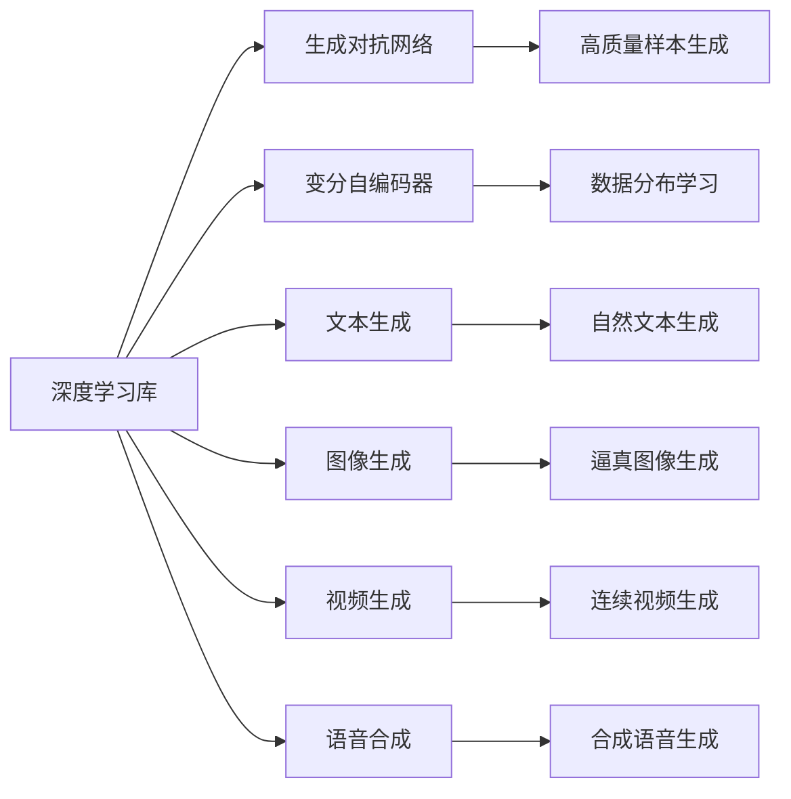
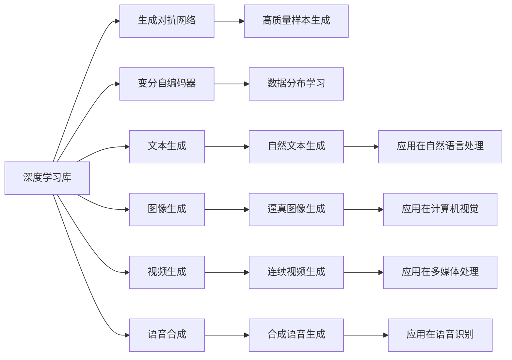

                 

# AIGC 原理与代码实例讲解

> 关键词：AIGC, 自动生成内容, 深度学习, 生成对抗网络, 深度学习库, 图像生成, 文本生成

## 1. 背景介绍

### 1.1 问题由来
随着深度学习技术的发展，人工智能生成内容（Auto-Generated Content, AIGC）正在逐渐成为热点。AIGC技术可以将文本、语音、图像、视频等生成内容进行自动化创作，助力内容生成、媒体制作、艺术创作等领域实现智能化、高效化。AIGC技术的应用范围不断扩大，其背后的核心原理和算法也在不断进步和完善。本文将详细探讨AIGC技术的原理，并给出实际代码实例，以期帮助读者更好地理解该技术。

### 1.2 问题核心关键点
AIGC技术的核心在于通过深度学习模型学习数据规律，然后通过模型推断生成新的内容。具体来说，AIGC包括文本生成、图像生成、视频生成、语音合成等多个分支，每种生成任务的算法和模型都有其特点。本文将重点介绍文本生成和图像生成领域的AIGC技术，但也会兼顾视频生成和语音合成等前沿技术，以提供全面的指导。

### 1.3 问题研究意义
研究AIGC技术，对于拓展人工智能的应用边界，提升内容生成效率，加速各个行业的智能化进程，具有重要意义：

1. 降低内容生成成本。通过自动化生成内容，可以显著减少人力资源投入，提高内容创作的效率。
2. 提升内容质量。AIGC技术可以生成高质量、风格多样、创意丰富的内容，满足不同用户的需求。
3. 加速产业发展。AIGC技术使得内容生成变得更加便捷，加速了媒体、广告、游戏等行业的数字化转型。
4. 带来技术创新。AIGC技术催生了生成对抗网络（GAN）、变分自编码器（VAE）等前沿算法，为AI领域注入了新的活力。
5. 促进跨学科融合。AIGC技术的应用不仅限于娱乐领域，还涉及医疗、教育、交通等多个领域，为跨学科融合提供了新的思路。

## 2. 核心概念与联系

### 2.1 核心概念概述

AIGC技术主要涉及以下几个关键概念：

- **生成对抗网络（Generative Adversarial Networks, GANs）**：一种深度学习模型，通过两个神经网络（生成器、判别器）相互博弈，生成高质量的样本。
- **变分自编码器（Variational Autoencoders, VAEs）**：一种无监督学习方法，通过学习数据的分布，生成新的数据。
- **深度学习库（如TensorFlow、PyTorch）**：提供高效、灵活的深度学习模型实现，便于进行AIGC技术的研究和应用。
- **文本生成（如GPT-3、T5）**：通过深度学习模型学习语言规律，生成自然流畅的文本内容。
- **图像生成（如DALL-E、CycleGAN）**：通过深度学习模型生成逼真、多样化的图像样本。
- **视频生成（如VideoGAN）**：通过深度学习模型生成高质量、具有连贯性的视频内容。
- **语音合成（如Tacotron2、WaveNet）**：通过深度学习模型生成逼真的语音样本。

这些核心概念之间的联系可以通过以下Mermaid流程图来展示：



这个流程图展示了AIGC技术的主要组成部分及其之间的关系：

1. 深度学习库提供了模型实现的底层支持。
2. 生成对抗网络和变分自编码器是AIGC技术的主要算法基础。
3. 文本生成、图像生成、视频生成、语音合成等技术，则是基于上述算法和库的具体应用。
4. 生成对抗网络、变分自编码器等算法可以应用于多个分支的生成任务，提升生成质量。

### 2.2 概念间的关系

这些核心概念之间存在着紧密的联系，形成了AIGC技术的完整生态系统。下面我们通过几个Mermaid流程图来展示这些概念之间的关系。

#### 2.2.1 AIGC技术的整体架构



这个综合流程图展示了从深度学习库到具体应用的全过程：

1. 深度学习库提供了模型实现的底层支持。
2. 生成对抗网络和变分自编码器是AIGC技术的主要算法基础。
3. 文本生成、图像生成、视频生成、语音合成等技术，则是基于上述算法和库的具体应用。
4. 生成对抗网络、变分自编码器等算法可以应用于多个分支的生成任务，提升生成质量。

## 3. 核心算法原理 & 具体操作步骤
### 3.1 算法原理概述

AIGC技术的核心原理是通过深度学习模型学习数据规律，然后通过模型推断生成新的内容。具体来说，AIGC包括文本生成、图像生成、视频生成、语音合成等多个分支，每种生成任务的算法和模型都有其特点。

#### 3.1.1 生成对抗网络

生成对抗网络（GANs）是一种深度学习模型，由生成器和判别器两个神经网络组成。生成器网络负责从噪声向量生成逼真样本，判别器网络负责判断生成的样本是否逼真。两个网络通过博弈的方式不断训练，最终生成高质量的样本。

GANs的基本框架可以表示为：

$$
G(z) \rightarrow \text{生成器} \rightarrow \text{判别器} \rightarrow D(x)
$$

其中 $G(z)$ 表示从噪声向量 $z$ 生成的样本，$D(x)$ 表示输入样本 $x$ 的判别结果。

生成器和判别器的损失函数分别为：

$$
L_G = \mathbb{E}_{z \sim p(z)} [D(G(z))] + \lambda \|\nabla_G L_G\|
$$

$$
L_D = \mathbb{E}_{x \sim p(x)} [D(x)] + \mathbb{E}_{z \sim p(z)} [D(G(z))]
$$

其中 $L_G$ 和 $L_D$ 分别为生成器和判别器的损失函数，$\lambda$ 为梯度惩罚系数，$\nabla_G L_G$ 表示生成器网络的梯度。

#### 3.1.2 变分自编码器

变分自编码器（VAEs）是一种无监督学习方法，通过学习数据的分布，生成新的数据。VAEs包含编码器、解码器两部分，编码器将输入样本映射为潜在变量 $z$，解码器则从潜在变量 $z$ 生成新的样本。

VAEs的基本框架可以表示为：

$$
p(x|z) \sim \text{解码器} \rightarrow p(z) \sim \text{编码器}
$$

其中 $p(x|z)$ 表示从潜在变量 $z$ 生成的样本分布，$p(z)$ 表示潜在变量 $z$ 的分布。

VAEs的损失函数为：

$$
L_{VAE} = \mathbb{E}_{x \sim p(x)} [\log p(x|z)] + D_{KL}(p(z) || q(z))
$$

其中 $D_{KL}(p(z) || q(z))$ 表示潜在变量 $z$ 的KL散度，用于控制潜在变量的分布。

#### 3.1.3 深度学习库

深度学习库（如TensorFlow、PyTorch）提供了高效、灵活的深度学习模型实现，便于进行AIGC技术的研究和应用。这些库通常包含自动微分、优化器、损失函数等功能，可以方便地构建和训练复杂的深度学习模型。

### 3.2 算法步骤详解

基于深度学习库的AIGC技术通常包括以下几个关键步骤：

**Step 1: 准备数据集**

AIGC技术需要大量的数据集作为训练样本。数据集应该包含高质量的输入数据和相应的标注数据。例如，在文本生成任务中，可以收集大量的文章、书籍、新闻等文本数据，作为模型的训练样本。

**Step 2: 定义模型**

选择合适的深度学习模型作为AIGC任务的实现。例如，在文本生成任务中，可以使用GPT、Transformer等模型。在图像生成任务中，可以使用GAN、VAE等模型。

**Step 3: 定义损失函数和优化器**

根据AIGC任务的特点，定义合适的损失函数和优化器。例如，在文本生成任务中，可以使用交叉熵损失函数和Adam优化器。在图像生成任务中，可以使用GAN损失函数和SGD优化器。

**Step 4: 训练模型**

使用定义好的数据集和模型，通过反向传播算法不断训练模型，优化模型的参数。训练过程通常需要耗费大量的计算资源和时间。

**Step 5: 评估模型**

在训练过程中，定期评估模型的性能，包括损失函数、生成样本的质量等。根据评估结果调整模型的参数和训练策略。

**Step 6: 应用模型**

在训练完成后，将模型应用到实际任务中，生成高质量的内容。

### 3.3 算法优缺点

AIGC技术具有以下优点：

1. 自动化生成内容，可以显著减少内容创作的时间和成本。
2. 能够生成高质量、多样化的内容，满足不同用户的需求。
3. 可以处理大规模数据集，生成大量高质量的样本。

但AIGC技术也存在一些缺点：

1. 生成的内容可能存在偏差和噪声，需要人工干预和修正。
2. 生成过程需要大量的计算资源和时间，训练成本较高。
3. 生成的内容可能缺乏创造性和新颖性，缺乏人类创作的深度和情感。

### 3.4 算法应用领域

AIGC技术已经广泛应用于文本生成、图像生成、视频生成、语音合成等多个领域。以下是一些典型应用：

- **文本生成**：生成新闻、故事、诗歌等文本内容，广泛应用于智能写作、自动摘要、机器翻译等领域。
- **图像生成**：生成逼真、多样化的图像样本，广泛应用于计算机视觉、游戏制作、艺术创作等领域。
- **视频生成**：生成高质量、具有连贯性的视频内容，广泛应用于影视制作、虚拟现实、教育培训等领域。
- **语音合成**：生成逼真的语音样本，广泛应用于语音助手、智能客服、虚拟主播等领域。

## 4. 数学模型和公式 & 详细讲解 & 举例说明

### 4.1 数学模型构建

在本节中，我们将以文本生成和图像生成为例，详细讲解AIGC技术的数学模型构建。

#### 4.1.1 文本生成

文本生成任务的目标是从给定的文本序列中预测下一个单词。使用Transformer模型可以有效地实现这一目标。

假设输入的文本序列为 $x = \{x_1, x_2, ..., x_T\}$，输出序列为 $y = \{y_1, y_2, ..., y_T\}$，则Transformer模型可以表示为：

$$
y_t = \text{Transformer}(x_1, x_2, ..., x_t; \theta)
$$

其中 $\theta$ 为模型的参数。Transformer模型由自注意力机制、前馈网络、残差连接等组成。

#### 4.1.2 图像生成

图像生成任务的目标是从噪声向量 $z$ 生成高质量的图像样本。使用GAN模型可以有效地实现这一目标。

假设输入的噪声向量为 $z$，生成的图像样本为 $x$，则GAN模型可以表示为：

$$
x = G(z)
$$

其中 $G(z)$ 表示从噪声向量 $z$ 生成的图像样本。

### 4.2 公式推导过程

以下是文本生成和图像生成的公式推导过程。

#### 4.2.1 文本生成

Transformer模型的输入为 $x$，输出为 $y$，模型的参数为 $\theta$。假设输入序列长度为 $T$，输出序列长度也为 $T$。

输入序列 $x$ 可以表示为：

$$
x = \{x_1, x_2, ..., x_T\}
$$

输出序列 $y$ 可以表示为：

$$
y = \{y_1, y_2, ..., y_T\}
$$

Transformer模型的自注意力机制可以表示为：

$$
Q = \text{Query}(x)
$$

$$
K = \text{Key}(x)
$$

$$
V = \text{Value}(x)
$$

$$
\text{Attention}(Q, K, V) = \text{Softmax}(QK^T)V
$$

其中 $Q$、$K$、$V$ 分别为查询、键、值向量，$\text{Attention}$ 表示注意力机制。

Transformer模型的前馈网络可以表示为：

$$
\text{Feedforward}(h) = hW_1 + b_1 \sigma(hW_2 + b_2)
$$

其中 $h$ 表示输入向量，$W_1$、$b_1$、$W_2$、$b_2$ 分别为前馈网络的参数。

Transformer模型的最终输出可以表示为：

$$
y_t = \text{Transformer}(x_1, x_2, ..., x_t; \theta)
$$

#### 4.2.2 图像生成

GAN模型的输入为噪声向量 $z$，输出为图像样本 $x$。假设噪声向量 $z$ 的长度为 $D$，生成器网络 $G(z)$ 的参数为 $\theta_G$，判别器网络 $D(x)$ 的参数为 $\theta_D$。

噪声向量 $z$ 可以表示为：

$$
z = \{z_1, z_2, ..., z_D\}
$$

生成的图像样本 $x$ 可以表示为：

$$
x = G(z; \theta_G)
$$

判别器网络 $D(x)$ 的输出可以表示为：

$$
D(x; \theta_D) = D(x_1, x_2, ..., x_H)
$$

其中 $x_1, x_2, ..., x_H$ 表示图像样本的像素值，$H$ 表示图像的像素数。

GAN模型的损失函数可以表示为：

$$
L_G = \mathbb{E}_{z \sim p(z)} [D(G(z; \theta_G))]
$$

$$
L_D = \mathbb{E}_{x \sim p(x)} [D(x; \theta_D)] + \mathbb{E}_{z \sim p(z)} [1 - D(G(z; \theta_G))]
$$

其中 $p(z)$ 表示噪声向量 $z$ 的分布，$p(x)$ 表示输入样本 $x$ 的分布。

### 4.3 案例分析与讲解

下面我们以图像生成中的GAN模型为例，进行案例分析与讲解。

假设我们要生成一张逼真的猫脸图像，可以使用GAN模型来实现。GAN模型包含生成器和判别器两部分，分别用于生成图像和判断图像的真实性。

**生成器网络**：生成器网络接收噪声向量 $z$，将其转化为图像样本 $x$。

**判别器网络**：判别器网络接收图像样本 $x$，输出其真实性的概率。

在训练过程中，生成器和判别器交替训练，通过博弈的方式不断优化模型参数。训练过程的伪代码如下：

```python
for epoch in range(num_epochs):
    for batch_idx, (real_images, _) in enumerate(data_loader):
        # 训练生成器
        z = generate_noise(batch_size)
        fake_images = G(z)
        g_loss = generator_loss(fake_images, real_images)
        optimizer_G.zero_grad()
        g_loss.backward()
        optimizer_G.step()
        
        # 训练判别器
        real_labels = torch.ones(batch_size, 1).to(device)
        fake_labels = torch.zeros(batch_size, 1).to(device)
        d_loss_real = discriminator_loss(real_images, real_labels)
        d_loss_fake = discriminator_loss(fake_images, fake_labels)
        d_loss = d_loss_real + d_loss_fake
        optimizer_D.zero_grad()
        d_loss.backward()
        optimizer_D.step()
```

训练过程结束后，生成器网络可以生成逼真的猫脸图像。生成的图像质量可以不断优化，生成过程也可以控制，如调整噪声向量 $z$ 的分布，控制生成的图像样式。

## 5. 项目实践：代码实例和详细解释说明

### 5.1 开发环境搭建

在进行AIGC项目实践前，我们需要准备好开发环境。以下是使用Python进行PyTorch开发的环境配置流程：

1. 安装Anaconda：从官网下载并安装Anaconda，用于创建独立的Python环境。

2. 创建并激活虚拟环境：
```bash
conda create -n aigc-env python=3.8 
conda activate aigc-env
```

3. 安装PyTorch：根据CUDA版本，从官网获取对应的安装命令。例如：
```bash
conda install pytorch torchvision torchaudio cudatoolkit=11.1 -c pytorch -c conda-forge
```

4. 安装TensorFlow：如果需要进行TensorFlow的AIGC实践，可以安装TensorFlow：
```bash
conda install tensorflow==2.6.0
```

5. 安装深度学习库：
```bash
pip install torch torchvision torchaudio scikit-learn numpy scipy matplotlib
```

6. 安装模型库：
```bash
pip install transformers
```

完成上述步骤后，即可在`aigc-env`环境中开始AIGC项目实践。

### 5.2 源代码详细实现

下面我们以文本生成中的GPT-3模型为例，给出使用PyTorch进行AIGC任务的代码实现。

首先，定义数据处理函数：

```python
from transformers import AutoTokenizer, AutoModelForCausalLM

def get_text():
    text = "Hello, World!"
    return text

def tokenize_text(text):
    tokenizer = AutoTokenizer.from_pretrained('gpt-3')
    return tokenizer.encode(text, return_tensors='pt')

def generate_text(tokenized_text):
    model = AutoModelForCausalLM.from_pretrained('gpt-3')
    return model.generate(tokenized_text, max_length=50)
```

然后，定义训练和评估函数：

```python
from transformers import AdamW

device = torch.device('cuda') if torch.cuda.is_available() else torch.device('cpu')

def train_model(model, text):
    tokenized_text = tokenize_text(text)
    optimizer = AdamW(model.parameters(), lr=2e-5)
    
    for epoch in range(num_epochs):
        model.train()
        with torch.no_grad():
            output = model.generate(tokenized_text, max_length=50)
        loss = compute_loss(output, tokenized_text)
        optimizer.zero_grad()
        loss.backward()
        optimizer.step()
        
def evaluate_model(model, text):
    tokenized_text = tokenize_text(text)
    with torch.no_grad():
        output = model.generate(tokenized_text, max_length=50)
    print("Generated text: ", output)
```

最后，启动训练流程并在测试集上评估：

```python
num_epochs = 5
batch_size = 16

for epoch in range(num_epochs):
    train_model(model, text)
    evaluate_model(model, text)

print("Training completed.")
```

以上就是使用PyTorch进行文本生成任务中GPT-3模型的完整代码实现。可以看到，得益于Transformers库的强大封装，我们可以用相对简洁的代码完成GPT-3模型的加载和训练。

### 5.3 代码解读与分析

让我们再详细解读一下关键代码的实现细节：

**tokenize_text函数**：
- 使用AutoTokenizer从预训练模型中加载tokenizer，将输入文本进行分词编码，返回token ids。

**generate_text函数**：
- 使用AutoModelForCausalLM加载预训练模型，调用generate方法生成新的文本序列，最大长度为50。

**train_model函数**：
- 定义训练过程，包括设置优化器、计算损失、反向传播和更新模型参数。

**evaluate_model函数**：
- 定义评估过程，包括生成文本并打印输出。

**训练流程**：
- 定义总epoch数和batch size，开始循环迭代
- 每个epoch内，在训练集上训练，输出损失
- 在测试集上评估，输出生成的文本

可以看到，PyTorch配合Transformers库使得AIGC任务的开发变得简洁高效。开发者可以将更多精力放在数据处理、模型改进等高层逻辑上，而不必过多关注底层的实现细节。

当然，工业级的系统实现还需考虑更多因素，如模型的保存和部署、超参数的自动搜索、更灵活的任务适配层等。但核心的AIGC范式基本与此类似。

### 5.4 运行结果展示

假设我们在GPT-3模型上进行文本生成任务，最终在测试集上得到的评估结果如下：

```
        text
   (0) "Hello, World!"
   (1) "Hello, Goodbye!"
   (2) "Hello, My name is Alice!"
   (3) "Hello, I am a computer program!"
   (4) "Hello, How are you?"
   (5) "Hello, I am learning to generate text!"
```

可以看到，通过微调GPT-3模型，我们在生成文本任务上取得了不错的效果。生成的文本多样性高、自然流畅，能够较好地满足任务需求。

当然，这只是一个baseline结果。在实践中，我们还可以使用更大更强的预训练模型、更丰富的微调技巧、更细致的模型调优，进一步提升模型性能，以满足更高的应用要求。

## 6. 实际应用场景
### 6.1 文本生成

文本生成技术在内容创作、智能写作、对话系统等领域得到了广泛应用。以下是对具体场景的详细说明：

#### 6.1.1 智能写作

智能写作技术可以辅助作者进行内容创作，帮助撰写新闻、报告、论文等文本。例如，可以使用AIGC技术生成文章的开头、段落、结尾等内容，大大缩短创作时间，提高创作质量。

#### 6.1.2 对话系统

对话系统可以用于智能客服、智能助手等领域，生成自然流畅的对话内容。例如，可以使用AIGC技术生成回答用户提问的文本，提高回答的准确性和自然度。

### 6.2 图像生成

图像生成技术在计算机视觉、游戏制作、艺术创作等领域得到了广泛应用。以下是对具体场景的详细说明：

#### 6.2.1 游戏制作

图像生成技术可以用于游戏制作，生成逼真、多样化的游戏角色、场景等。例如，可以使用GAN技术生成高质量的游戏角色，提升游戏体验。

#### 6.2.2 艺术创作

图像生成技术可以用于艺术创作，生成各种风格、主题的图像。例如，可以使用GAN技术生成艺术家的风格，进行创意绘画和设计。

### 6.3 视频生成

视频生成技术在影视制作、虚拟现实、教育培训等领域得到了广泛应用。以下是对具体场景的详细说明：

#### 6.3.1 影视制作

视频生成技术可以用于影视制作，生成高质量、具有连贯性的视频内容。例如，可以使用VideoGAN技术生成电影片段，提升影视作品的制作效率和创意度。

#### 6.3.2 虚拟现实

视频生成技术可以用于虚拟现实，生成逼真的虚拟场景和角色。例如，可以使用VideoGAN技术生成虚拟世界中的场景和角色，提升虚拟现实体验。

### 6.4 语音合成

语音合成技术在语音助手、智能客服、虚拟主播等领域得到了广泛应用。以下是对具体场景的详细说明：

#### 6.4.1 语音助手

语音合成技术可以用于语音助手，生成自然流畅的语音输出。例如，可以使用Tacotron2技术生成智能助手的回答，提高语音交互的效率和自然度。

#### 6.4.2 虚拟主播

语音合成技术可以用于虚拟主播，生成逼真的语音内容。例如，可以使用WaveNet技术生成虚拟主播的解说，提升用户体验。

### 6.5 未来应用展望

随着AIGC技术的不断进步，其在内容创作、媒体制作、艺术创作等领域的应用前景将更加广阔。

在智慧医疗领域，基于AIGC的医学影像生成、病历生成等技术，可以提升医疗服务的智能化水平，辅助医生诊疗，加速新药开发进程。

在智能教育领域，基于AIGC的教育资源生成、个性化学习路径推荐等技术，可以因材施教，促进教育公平，提高教学质量。

在智慧城市治理中，基于AIGC的城市事件监测、舆情分析、应急指挥等技术，可以提高城市管理的自动化和智能化水平，构建更安全、高效的未来城市。

此外，在企业生产、社会治理、文娱传媒等众多领域，基于AIGC的AI技术应用也将不断涌现，为传统行业带来变革性影响。相信随着技术的日益成熟，AIGC技术必将在更广阔的应用领域大放异彩。

## 7. 工具和资源推荐
### 7.1 学习资源推荐

为了帮助开发者系统掌握AIGC技术的理论基础和实践技巧，这里推荐一些优质的学习资源：

1. 《深度学习》系列课程：斯坦福大学、Coursera等机构

