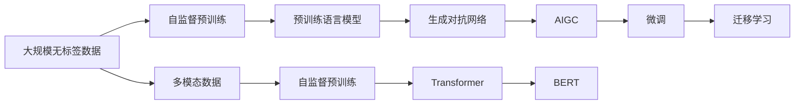
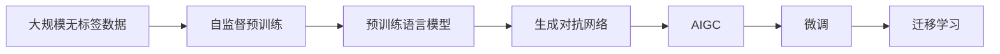
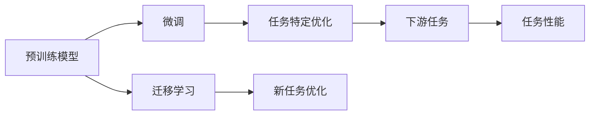
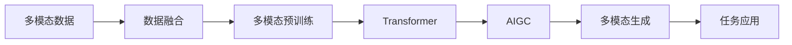

                 

# AIGC与企业任务的细化

> 关键词：AIGC,自然语言处理(NLP),深度学习,企业应用,计算机视觉,增强现实(AR),虚拟现实(VR)

## 1. 背景介绍

### 1.1 问题由来

近年来，人工智能(AI)技术的迅猛发展在多个领域中掀起了新的浪潮。其中，生成对抗网络(GAN)、变分自编码器(VAE)等生成模型，以及Transformer、BERT等大模型在大规模无标签数据上的自监督预训练，极大地推动了AI技术的进步。这些模型通过学习语言的潜在语义和语法结构，能够生成高度逼真、语义丰富的内容，引领了自然语言生成(NLG)领域的革命。

在大规模预训练语言模型的基础上，人工智能语言模型(AIGC)技术迅速崛起。AIGC利用深度学习和大数据技术，通过训练模型生成高质量的自然语言文本，极大地提高了内容生成、自动化处理、人机交互等任务的效率。目前，AIGC技术已经在新闻媒体、广告营销、娱乐产业、教育培训、医疗健康、金融保险等多个领域展现出广阔的应用前景。

### 1.2 问题核心关键点

AIGC技术的核心在于其高效且灵活的语言生成能力。通过预训练语言模型的泛化迁移和微调优化，AIGC能够适应不同的企业任务需求，生成高质量的文本、图像、语音等数据，辅助企业进行运营管理、客户服务、市场推广等工作，实现智能化的高效运作。AIGC技术的应用，不仅降低了企业的运营成本，还提升了产品和服务质量，增强了企业的市场竞争力。

然而，AIGC技术在实际应用中，仍面临着诸如模型泛化能力、生成内容质量、生成速度、用户隐私保护等诸多挑战。这些问题的存在，使得企业在引入AIGC技术时，需要仔细评估其适用性，并针对性地进行技术改造和优化。本文将从AIGC技术的工作原理、核心概念、具体实现以及实际应用等方面，对AIGC在企业任务中的应用进行全面探讨。

### 1.3 问题研究意义

AIGC技术的快速发展，为企业的智能化转型提供了强有力的技术支持。通过应用AIGC技术，企业能够实现内容自动化生成、客户服务智能化、业务流程自动化等诸多功能的提升，从而在竞争激烈的市场环境中占据有利位置。然而，AIGC技术的全面应用，需要克服技术复杂性、数据质量和隐私保护等方面的挑战。

本文旨在从AIGC技术的工作原理、核心概念、实现方式和实际应用等多个角度，系统介绍AIGC在企业任务中的应用。通过对AIGC技术的深入研究，希望能够帮助企业更好地理解AIGC的价值，掌握AIGC技术的核心技能，推动企业智能化转型，提升企业市场竞争力。

## 2. 核心概念与联系

### 2.1 核心概念概述

为了更好地理解AIGC技术在企业任务中的应用，本节将介绍几个关键概念，并探讨它们之间的联系。

- **生成对抗网络(GAN)：**一种生成模型，通过生成器和判别器的对抗训练，生成高质量的样本。
- **自监督预训练：**利用无标签数据，通过自监督学习任务训练模型，学习语言的潜在语义和语法结构。
- **AIGC：**一种基于深度学习和生成模型的AI技术，可以生成高质量的自然语言文本、图像、音频等多模态内容。
- **Transformer：**一种高效的深度学习模型架构，特别适用于自然语言处理任务，如机器翻译、文本生成等。
- **BERT：**一种预训练语言模型，通过双向的自监督学习任务，学习语言的潜在语义和语法结构，被广泛应用于各种自然语言处理任务。
- **微调(Fine-tuning)：**通过有监督学习，在预训练模型的基础上，针对特定任务进行优化，提升模型在该任务上的性能。
- **迁移学习：**将一个领域学习到的知识，迁移应用到另一个不同但相关的领域。

这些概念之间的逻辑关系可以通过以下Mermaid流程图来展示：



这个流程图展示了AIGC技术的工作流程。首先利用大规模无标签数据进行自监督预训练，生成预训练语言模型。接着，利用生成对抗网络，生成高质量的自然语言文本、图像、音频等多模态内容。然后，通过微调和迁移学习，使模型适应特定任务需求，提升模型性能。最后，多模态数据输入到模型中，进行进一步的生成和处理。

### 2.2 概念间的关系

这些核心概念之间存在紧密的联系，形成了AIGC技术在企业任务中的应用框架。下面我们通过几个Mermaid流程图来展示这些概念之间的关系。

#### 2.2.1 AIGC技术的基本架构



这个流程图展示了AIGC技术的基本架构。从大规模无标签数据开始，通过自监督预训练生成预训练语言模型。然后，利用生成对抗网络，生成高质量的自然语言文本、图像、音频等多模态内容。通过微调和迁移学习，使模型适应特定任务需求，生成高质量的内容，辅助企业任务。

#### 2.2.2 微调与迁移学习的关系



这个流程图展示了微调与迁移学习的关系。预训练模型通过微调进行特定任务优化，生成高质量的内容。迁移学习则是将预训练模型应用于新任务，进一步优化模型性能。

#### 2.2.3 多模态数据的处理



这个流程图展示了多模态数据的处理流程。多模态数据输入到模型中，进行数据融合和多模态预训练。然后，利用Transformer和AIGC技术，生成高质量的自然语言文本、图像、音频等多模态内容。最后，生成的内容应用于具体任务，实现企业智能化转型。

## 3. 核心算法原理 & 具体操作步骤
### 3.1 算法原理概述

AIGC技术的核心在于其高质量的自然语言生成能力。通过预训练语言模型的泛化迁移和微调优化，AIGC能够适应不同的企业任务需求，生成高质量的文本、图像、语音等数据，辅助企业进行运营管理、客户服务、市场推广等工作，实现智能化的高效运作。

AIGC技术在企业任务中的应用，主要分为以下几个步骤：

1. **数据准备**：收集和清洗企业任务所需的文本、图像、音频等多模态数据。
2. **预训练模型选择**：选择适合的预训练语言模型或生成模型，作为AIGC技术的基础。
3. **多模态融合**：将文本、图像、音频等不同模态的数据进行融合，形成输入数据。
4. **微调和迁移学习**：在预训练模型的基础上，针对特定任务进行微调和迁移学习，提升模型性能。
5. **内容生成**：利用优化后的模型，生成高质量的自然语言文本、图像、音频等多模态内容。
6. **应用部署**：将生成的内容应用于企业任务中，实现智能化的高效运作。

### 3.2 算法步骤详解

#### 3.2.1 数据准备

在AIGC技术的应用中，数据准备是关键的一步。高质量的数据可以显著提升模型的生成效果。

1. **数据收集**：收集企业任务所需的文本、图像、音频等多模态数据。文本数据可以从客户服务记录、销售记录、社交媒体等渠道获取；图像数据可以从产品图片、监控视频、用户界面截图等渠道获取；音频数据可以从电话录音、视频转录等渠道获取。

2. **数据清洗**：对收集到的数据进行清洗，去除噪声、不完整的数据，确保数据的质量。数据清洗可以包括去除重复数据、处理缺失值、修正错误等。

3. **数据标注**：对数据进行标注，使其成为有监督学习任务。例如，文本数据可以标注成情感分析、命名实体识别等任务；图像数据可以标注成图像分类、目标检测等任务；音频数据可以标注成语音识别、情感分析等任务。

4. **数据增强**：通过数据增强技术，扩充训练集，增强模型的泛化能力。例如，文本数据可以通过回译、近义词替换等方式增强；图像数据可以通过旋转、缩放、裁剪等方式增强；音频数据可以通过变速、降噪等方式增强。

#### 3.2.2 预训练模型选择

在选择预训练模型时，需要考虑模型的大小、性能、泛化能力等因素。目前，常用的预训练模型包括BERT、GPT、XLNet等。

1. **BERT模型**：BERT模型是一种基于Transformer的双向自监督预训练模型，通过预测掩码词和下一句预测等任务进行训练。BERT模型在文本生成、语言理解等任务上表现优异。

2. **GPT模型**：GPT模型是一种基于Transformer的单向自回归模型，通过预测下一个词的方式进行训练。GPT模型在自然语言生成、对话生成等任务上表现出色。

3. **XLNet模型**：XLNet模型是一种基于自回归-自编码器混合训练的无监督预训练模型，能够学习更为精确的语言表示。XLNet模型在语言理解、文本分类等任务上取得了不错的效果。

#### 3.2.3 多模态融合

在AIGC技术的应用中，多模态数据的融合是不可或缺的一步。将文本、图像、音频等不同模态的数据进行融合，可以提升模型的生成效果。

1. **文本数据**：文本数据通常采用分词、嵌入等技术进行处理。文本数据的处理可以包括分词、词向量嵌入、BERT等预训练模型等。

2. **图像数据**：图像数据通常采用卷积神经网络(CNN)进行处理。图像数据的处理可以包括卷积层、池化层、全连接层等。

3. **音频数据**：音频数据通常采用循环神经网络(RNN)进行处理。音频数据的处理可以包括卷积层、池化层、全连接层等。

4. **数据融合**：将文本、图像、音频等不同模态的数据进行融合，可以采用Transformer、AIGC等模型进行处理。多模态融合的目标是生成高质量的自然语言文本、图像、音频等多模态内容。

#### 3.2.4 微调和迁移学习

在预训练模型的基础上，针对特定任务进行微调和迁移学习，可以显著提升模型在该任务上的性能。

1. **微调**：通过有监督学习，在预训练模型的基础上进行微调。微调的目标是优化模型在该任务上的性能，生成高质量的内容。微调的具体步骤如下：
   - 选择合适的损失函数，如交叉熵损失、均方误差损失等。
   - 选择合适的优化算法，如AdamW、SGD等。
   - 设置合适的学习率、批大小、迭代轮数等超参数。
   - 设置正则化技术，如L2正则、Dropout等。
   - 设置Early Stopping，避免过拟合。
   - 进行梯度下降等优化算法，更新模型参数。

2. **迁移学习**：将预训练模型应用于新任务，进一步优化模型性能。迁移学习的具体步骤如下：
   - 选择合适的预训练模型。
   - 在预训练模型的基础上，添加任务适配层，如线性分类器、解码器等。
   - 通过微调优化任务适配层的参数。
   - 在验证集上评估模型性能，选择最优模型。

#### 3.2.5 内容生成

利用优化后的模型，生成高质量的自然语言文本、图像、音频等多模态内容，可以辅助企业任务。

1. **文本生成**：利用预训练语言模型或生成对抗网络，生成高质量的自然语言文本。文本生成的目标是根据输入数据生成符合语法和语义规范的文本。

2. **图像生成**：利用生成对抗网络，生成高质量的图像。图像生成的目标是根据输入数据生成符合视觉规范的图像。

3. **音频生成**：利用生成对抗网络，生成高质量的音频。音频生成的目标是根据输入数据生成符合音频规范的音频。

#### 3.2.6 应用部署

将生成的内容应用于企业任务中，可以显著提升企业的智能化水平。

1. **客户服务**：利用AIGC技术生成自动回复，提高客户服务效率。例如，在客服机器人中应用AIGC技术，生成自动回复，解决客户问题。

2. **市场推广**：利用AIGC技术生成广告文案、社交媒体内容等，提升市场推广效果。例如，在社交媒体平台中应用AIGC技术，生成广告文案和社交媒体内容，吸引客户关注。

3. **运营管理**：利用AIGC技术生成业务报告、市场分析等，提升运营管理水平。例如，在企业运营分析中应用AIGC技术，生成业务报告和市场分析，辅助企业决策。

4. **内容创作**：利用AIGC技术生成文章、视频、音频等多模态内容，提升内容创作效率。例如，在内容创作中应用AIGC技术，生成文章、视频、音频等多模态内容，提升内容创作效率。

### 3.3 算法优缺点

AIGC技术的优点包括：

1. **高效生成内容**：AIGC技术能够高效生成高质量的自然语言文本、图像、音频等多模态内容，辅助企业任务。

2. **智能决策支持**：AIGC技术可以生成业务报告、市场分析等，辅助企业进行决策。

3. **灵活应用**：AIGC技术可以应用于客户服务、市场推广、运营管理等多个企业任务中，灵活性较高。

4. **节省成本**：AIGC技术可以自动生成内容，减少人力成本，提高企业运营效率。

5. **提升客户体验**：AIGC技术可以生成自动回复、社交媒体内容等，提升客户体验。

AIGC技术的缺点包括：

1. **数据质量要求高**：AIGC技术对数据质量要求较高，需要高质量的标注数据和清洗数据。

2. **模型泛化能力有限**：AIGC技术的模型泛化能力有限，需要针对特定任务进行微调和迁移学习。

3. **生成内容质量不稳定**：AIGC技术的生成内容质量不稳定，需要不断优化模型。

4. **隐私和安全风险**：AIGC技术涉及敏感数据的生成和处理，存在隐私和安全风险。

5. **技术复杂性高**：AIGC技术的技术复杂性较高，需要一定的技术积累和团队支持。

### 3.4 算法应用领域

AIGC技术在多个领域中得到了广泛应用，以下是几个典型的应用场景：

#### 3.4.1 客户服务

客户服务是企业运营的重要环节，AIGC技术可以辅助客户服务，提升客户体验。例如，在客服机器人中应用AIGC技术，生成自动回复，解决客户问题。AIGC技术可以生成情感分析、命名实体识别等任务，帮助客服人员更好地理解客户需求，提供个性化服务。

#### 3.4.2 市场推广

市场推广是企业营销的重要环节，AIGC技术可以辅助市场推广，提升营销效果。例如，在社交媒体平台中应用AIGC技术，生成广告文案和社交媒体内容，吸引客户关注。AIGC技术可以生成文本、图像、音频等多模态内容，提高营销内容的多样性和吸引力。

#### 3.4.3 运营管理

运营管理是企业运营的重要环节，AIGC技术可以辅助运营管理，提升运营效率。例如，在企业运营分析中应用AIGC技术，生成业务报告和市场分析，辅助企业决策。AIGC技术可以生成自然语言文本、图像、音频等多模态内容，提供运营管理数据支持。

#### 3.4.4 内容创作

内容创作是企业运营的重要环节，AIGC技术可以辅助内容创作，提升创作效率。例如，在内容创作中应用AIGC技术，生成文章、视频、音频等多模态内容，提升创作效率。AIGC技术可以生成高质量的内容，辅助企业进行内容创作和传播。

#### 3.4.5 教育培训

教育培训是企业发展的重要环节，AIGC技术可以辅助教育培训，提升培训效果。例如，在教育培训中应用AIGC技术，生成培训材料、模拟对话等内容，提升培训效果。AIGC技术可以生成自然语言文本、图像、音频等多模态内容，提供教育培训数据支持。

#### 3.4.6 医疗健康

医疗健康是企业运营的重要环节，AIGC技术可以辅助医疗健康，提升医疗服务水平。例如，在医疗健康中应用AIGC技术，生成医疗报告、健康建议等内容，提升医疗服务水平。AIGC技术可以生成自然语言文本、图像、音频等多模态内容，提供医疗健康数据支持。

#### 3.4.7 金融保险

金融保险是企业运营的重要环节，AIGC技术可以辅助金融保险，提升服务水平。例如，在金融保险中应用AIGC技术，生成金融报告、保险合同等内容，提升服务水平。AIGC技术可以生成自然语言文本、图像、音频等多模态内容，提供金融保险数据支持。

## 4. 数学模型和公式 & 详细讲解  
### 4.1 数学模型构建

AIGC技术在企业任务中的应用，涉及多模态数据的融合、模型的优化等数学模型。以下将详细构建AIGC技术在企业任务中的数学模型。

假设输入数据为 $\mathcal{X}$，包括文本、图像、音频等不同模态的数据。模型输出为 $\mathcal{Y}$，包括自然语言文本、图像、音频等不同模态的内容。模型的目标是最小化损失函数 $\mathcal{L}$，生成高质量的内容。

模型的训练过程如下：

1. **输入数据准备**：将输入数据 $\mathcal{X}$ 进行预处理，如分词、嵌入、卷积等。
2. **模型前向传播**：将预处理后的输入数据 $\mathcal{X}$ 输入到模型中，进行前向传播计算，得到输出 $\hat{\mathcal{Y}}$。
3. **损失函数计算**：根据任务目标，计算输出 $\hat{\mathcal{Y}}$ 与真实标签 $\mathcal{Y}$ 之间的差异，得到损失函数 $\mathcal{L}$。
4. **模型优化**：通过优化算法，如AdamW、SGD等，更新模型参数，最小化损失函数 $\mathcal{L}$。

### 4.2 公式推导过程

以下将以文本生成任务为例，推导AIGC技术的损失函数和优化算法。

假设文本生成任务的输入为文本序列 $x_1,...,x_T$，输出为生成的文本序列 $y_1,...,y_T$。模型的目标是最小化交叉熵损失函数，生成高质量的文本。

损失函数 $\mathcal{L}$ 定义为：

$$
\mathcal{L} = -\frac{1}{T}\sum_{t=1}^{T}y_t\log p(y_t|x_1,...,x_t)
$$

其中，$y_t$ 为真实标签，$p(y_t|x_1,...,x_t)$ 为模型在给定上下文 $x_1,...,x_t$ 下的预测概率。

优化算法的目标是最小化损失函数 $\mathcal{L}$，更新模型参数 $\theta$。假设优化算法为AdamW，学习率为 $\eta$，则参数更新公式为：

$$
\theta \leftarrow \theta - \eta \nabla_{\theta}\mathcal{L}(\theta)
$$

其中，$\nabla_{\theta}\mathcal{L}(\theta)$ 为损失函数对参数 $\theta$ 的梯度。

### 4.3 案例分析与讲解

#### 4.3.1 文本生成案例

假设我们利用BERT模型进行文本生成任务。首先，将输入文本序列 $x_1,...,x_T$ 进行分词和嵌入，得到输入矩阵 $X$。然后，将输入矩阵 $X$ 输入到BERT模型中，得到隐藏状态 $H$。最后，利用全连接层，将隐藏状态 $H$ 映射到输出矩阵 $Y$，输出生成文本序列 $y_1,...,y_T$。

模型训练过程如下：

1. **输入数据准备**：将输入文本序列 $x_1,...,x_T$ 进行分词和嵌入，得到输入矩阵 $X$。
2. **模型前向传播**：将输入矩阵 $X$ 输入到BERT模型中，得到隐藏状态 $H$。
3. **损失函数计算**：根据交叉熵损失函数，计算输出矩阵 $Y$ 与真实标签序列 $y_1,...,y_T$ 之间的差异，得到损失函数 $\mathcal{L}$。
4. **模型优化**：通过AdamW优化算法，更新BERT模型的参数 $\theta$，最小化损失函数 $\mathcal{L}$。

#### 4.3.2 图像生成案例

假设我们利用生成对抗网络(GAN)进行图像生成任务。首先，将输入文本序列 $x_1,...,x_T$ 进行编码，得到编码向量 $z$。然后，将编码向量 $z$ 输入到生成器网络中，生成图像 $G(z)$。最后，将生成图像 $G(z)$ 输入到判别器网络中，得到判别器的判断结果 $D(G(z))$。

模型训练过程如下：

1. **输入数据准备**：将输入文本序列 $x_1,...,x_T$ 进行编码，得到编码向量 $z$。
2. **生成器前向传播**：将编码向量 $z$ 输入到生成器网络中，生成图像 $G(z)$。
3. **判别器前向传播**：将生成图像 $G(z)$ 输入到判别器网络中，得到判别器的判断结果 $D(G(z))$。
4. **损失函数计算**：根据GAN损失函数，计算生成器网络 $G$ 和判别器网络 $D$ 的损失函数 $\mathcal{L}_G$ 和 $\mathcal{L}_D$。
5. **模型优化**：通过AdamW优化算法，更新生成器网络 $G$ 和判别器网络 $D$ 的参数，最小化损失函数 $\mathcal{L}_G$ 和 $\mathcal{L}_D$。

## 5. 项目实践：代码实例和详细解释说明
### 5.1 开发环境搭建

在进行AIGC项目实践前，我们需要准备好开发环境。以下是使用Python进行PyTorch开发的环境配置流程：

1. 安装Anaconda：从官网下载并安装Anaconda，用于创建独立的Python环境。

2. 创建并激活虚拟环境：
```bash
conda create -n pytorch-env python=3.8 
conda activate pytorch-env
```

3. 安装PyTorch：根据CUDA版本，从官网获取对应的安装命令。例如：
```bash
conda install pytorch torchvision torchaudio cudatoolkit=11.1 -c pytorch -c conda-forge
```

4. 安装Transformers库：
```bash
pip install transformers
```

5. 安装各类工具包：
```bash
pip install numpy pandas scikit-learn matplotlib tqdm jupyter notebook ipython
```

完成上述步骤后，即可在`pytorch-env`环境中开始AIGC项目实践。

### 5.2 源代码详细实现

下面我以文本生成任务为例，给出使用Transformers库对GPT-2模型进行文本生成任务的PyTorch代码实现。

首先，定义模型和优化器：

```python
from transformers import GPT2Tokenizer, GPT2LMHeadModel, AdamW
from torch.utils.data import DataLoader
from tqdm import tqdm
import torch

device = torch.device('cuda') if torch.cuda.is_available() else torch.device('cpu')

tokenizer = GPT2Tokenizer.from_pretrained('gpt2')

model = GPT2LMHeadModel.from_pretrained('gpt2', pad_token_id=tokenizer.eos_token_id)
optimizer = AdamW(model.parameters(), lr=2e-5)
```

然后，定义训练和评估函数：

```python
def train_epoch(model, dataloader, optimizer):
    model.train()
    epoch_loss = 0
    for batch in dataloader:
        input_ids = batch['input_ids'].to(device)
        attention_mask = batch['attention_mask'].to(device)
        labels = batch['labels'].to(device)
        model.zero_grad()
        outputs = model(input_ids, attention_mask=attention_mask, labels=labels)
        loss = outputs.loss
        epoch_loss += loss.item()
        loss.backward()
        optimizer.step()
    return epoch_loss / len(dataloader)

def evaluate(model, dataloader):
    model.eval()
    preds, labels = [], []
    with torch.no_grad():
        for batch in dataloader:
            input_ids = batch['input_ids'].to(device)
            attention_mask = batch['attention_mask'].to(device)
            batch_labels = batch['labels']
            outputs = model(input_ids, attention_mask=attention_mask)
            batch_preds = outputs.logits.argmax(dim=2).to('cpu').tolist()
            batch_labels = batch_labels.to('cpu').tolist()
            for pred_tokens, label_tokens in zip(batch_preds, batch_labels):
                pred

