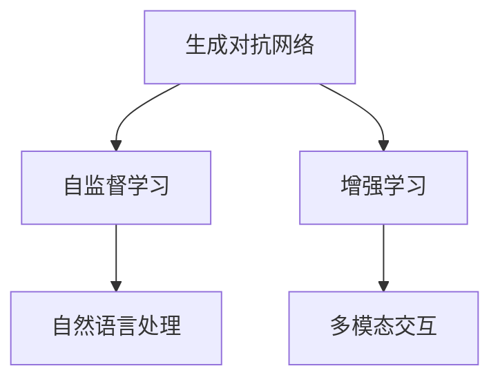
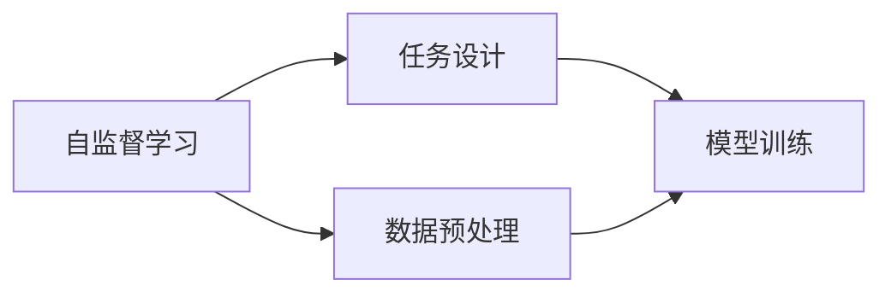
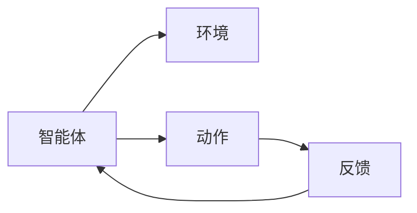
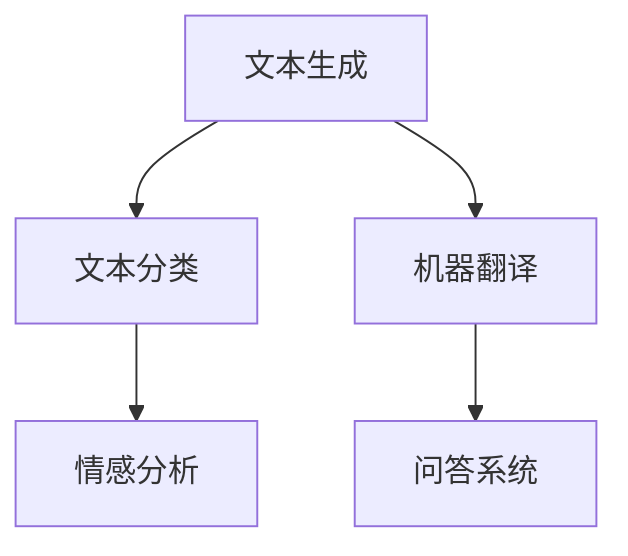
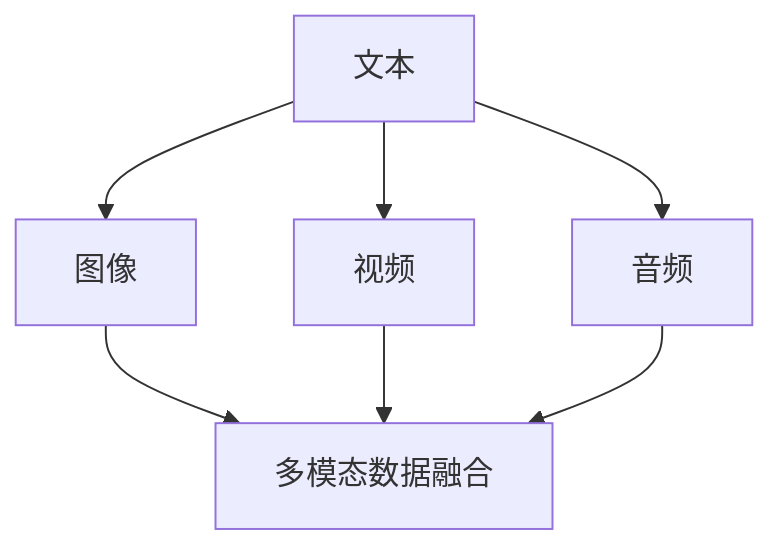
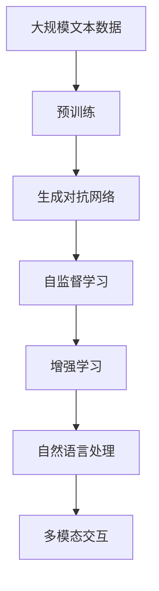

                 

# AIGC从入门到实战：ChatGPT 说自己能做什么？

> 关键词：人工智能,生成对抗网络,自监督学习,增强学习,自然语言处理(NLP),文本生成,对话系统,多模态交互

## 1. 背景介绍

### 1.1 问题由来
随着人工智能(AI)技术的迅猛发展，生成对抗网络(Generative Adversarial Networks, GANs)、自监督学习(Self-Supervised Learning)、增强学习(Reinforcement Learning)等深度学习方法的不断突破，人工智能已经从数据驱动和监督学习的单一范式，迈向更为复杂的无监督和半监督学习的新阶段。其中，生成对抗网络作为最前沿的技术之一，因其能够生成高质量、具有较高可解释性的输出，成为人工智能领域炙手可热的技术。

ChatGPT作为OpenAI最新推出的基于生成对抗网络的大模型，以其卓越的性能和广泛的应用前景，在科技界引起了巨大反响。但作为一款集成了生成对抗网络、自监督学习、增强学习等多项前沿技术于一身的产品，其背后蕴含的深度学习技术原理和落地实践，却常常让非专业人士感到困惑和好奇。本文将深入浅出地介绍ChatGPT的核心技术原理，并结合实践案例，带你从入门到实战，全面了解ChatGPT所代表的大语言模型和AI生成技术的魅力。

### 1.2 问题核心关键点
本文将围绕以下几个关键点进行详细阐述：
1. **生成对抗网络(GANs)**：作为大模型基础技术之一，GANs是如何工作的？
2. **自监督学习(SSL)**：在无标签数据上，ChatGPT是如何进行自监督学习？
3. **增强学习(RL)**：ChatGPT是如何结合增强学习进行模型优化？
4. **自然语言处理(NLP)**：ChatGPT在文本生成、对话系统等领域有哪些应用？
5. **多模态交互**：ChatGPT如何处理图像、视频等多模态数据？

## 2. 核心概念与联系

### 2.1 核心概念概述

为更好地理解ChatGPT所代表的大语言模型和AI生成技术，本节将介绍几个密切相关的核心概念：

- **生成对抗网络(GANs)**：一种生成模型，通过两个神经网络相互博弈，一个生成网络(Generator)学习生成高质量的数据样本，另一个判别网络(Discriminator)学习判断数据是否真实，双方通过对抗训练不断提升生成质量。

- **自监督学习(SSL)**：在无标签数据上，利用数据的自然结构和模式，设计自监督任务，使模型进行预训练，从而学习到数据本身的分布和表示。

- **增强学习(RL)**：通过智能体在环境中执行动作，最大化累计奖励的过程。智能体通过与环境的交互，不断调整策略，以实现特定目标。

- **自然语言处理(NLP)**：涉及计算机与人类语言之间的交互，包括文本生成、文本分类、机器翻译等任务。

- **多模态交互**：在处理和生成数据时，结合文本、图像、视频等多模态信息，实现更全面、更深入的智能交互。

这些核心概念之间的逻辑关系可以通过以下Mermaid流程图来展示：



这个流程图展示了大语言模型的核心概念及其之间的关系：

1. GANs作为生成网络，通过自监督学习，训练出高质量的模型。
2. 自监督学习帮助模型在无标签数据上进行预训练，学习到数据的特征。
3. 增强学习用于模型优化，提升在特定任务上的性能。
4. NLP技术实现文本生成、对话系统等多模态交互任务。

### 2.2 概念间的关系

这些核心概念之间存在着紧密的联系，形成了ChatGPT及其代表的AI生成技术系统的完整生态系统。下面我通过几个Mermaid流程图来展示这些概念之间的关系。

#### 2.2.1 生成对抗网络的训练过程

```mermaid
graph LR
    A[生成网络(G)] --> B[判别网络(D)]
    A --> C[数据样本]
    B --> D[真实数据]
    D --> E[判别准确度]
    C --> F[生成数据]
    F --> E
    E --> B
```

这个流程图展示了GANs的基本训练过程：生成网络(G)尝试生成数据，判别网络(D)尝试判断数据是否为真实数据，通过对比准确度调整网络参数，从而提升生成质量。

#### 2.2.2 自监督学习的核心任务



这个流程图展示了自监督学习的基本流程：数据预处理和任务设计，然后通过模型训练学习数据的表示。

#### 2.2.3 增强学习的策略优化



这个流程图展示了增强学习的基本原理：智能体通过执行动作，获取环境反馈，不断调整策略以优化表现。

#### 2.2.4 自然语言处理的应用场景



这个流程图展示了NLP技术的几个核心应用场景：文本生成、文本分类、机器翻译和问答系统。

#### 2.2.5 多模态交互的融合



这个流程图展示了多模态交互的基本流程：文本、图像、视频、音频等多种数据源的融合，最终输出多模态交互结果。

### 2.3 核心概念的整体架构

最后，我们用一个综合的流程图来展示这些核心概念在大语言模型微调过程中的整体架构：



这个综合流程图展示了从预训练到生成对抗网络训练，再到自监督学习、增强学习、NLP技术，最后到多模态交互的完整过程。这些核心概念共同构成了大语言模型的学习和应用框架，使其能够在各种场景下发挥强大的生成和交互能力。

## 3. 核心算法原理 & 具体操作步骤
### 3.1 算法原理概述

ChatGPT作为基于生成对抗网络的大模型，其核心原理可以简单概括为：通过生成网络生成高质量的文本，判别网络判断文本的真实性，双方通过对抗训练不断提升生成质量。同时，通过自监督学习在无标签数据上预训练，利用增强学习对特定任务进行微调，最终通过NLP技术实现多模态交互。

形式化地，假设有大量无标签文本数据 $D=\{x_i\}_{i=1}^N$，其中 $x_i$ 表示第 $i$ 个文本。生成网络 $G$ 输出 $G(x_i)$，表示对输入文本 $x_i$ 生成的新文本，判别网络 $D$ 输出 $D(x_i,G(x_i))$，表示判别生成文本 $G(x_i)$ 是否为真实文本。则GANs的训练目标是最小化生成文本的判别损失：

$$
\mathcal{L}_{GAN} = \mathbb{E}_{x \sim p(x)} D(x) + \mathbb{E}_{x \sim p(x)} [1 - D(x)] + \mathbb{E}_{x \sim p(z)} [1 - D(G(z))] + \mathbb{E}_{x \sim p(z)} D(G(z))
$$

其中 $p(x)$ 表示文本 $x$ 的分布，$z$ 为噪声，表示生成网络的输入。在生成网络与判别网络之间的对抗训练中，生成网络的目标是最小化判别损失，而判别网络的目标是最大化判别损失。

自监督学习在无标签数据上，通过设计诸如掩码语言模型、文本预测等任务，使得模型学习到文本的语义和结构表示，从而提升在特定任务上的性能。例如，BERT模型就通过掩码语言模型任务在大量无标签数据上进行了预训练，学习到语言的知识表示。

增强学习则通过与环境的交互，利用奖励信号调整模型策略，以优化特定任务的表现。例如，在对话系统中，智能体通过与用户的交互，最大化对话质量。

NLP技术则通过文本生成、对话系统等任务，实现与用户的自然交互。多模态交互则是将文本、图像、视频、音频等多种数据源进行融合，提升交互体验和信息的完整性。

### 3.2 算法步骤详解

ChatGPT的训练过程主要包括以下几个关键步骤：

**Step 1: 数据准备与预处理**
- 收集大规模无标签文本数据，并进行数据清洗、分词、编码等预处理。
- 设计自监督学习任务，如掩码语言模型、文本预测等，训练生成网络。

**Step 2: 生成网络与判别网络训练**
- 初始化生成网络 $G$ 和判别网络 $D$，定义损失函数。
- 迭代训练生成网络 $G$ 和判别网络 $D$，最小化生成文本的判别损失。

**Step 3: 自监督学习预训练**
- 在预训练数据集上，利用自监督学习任务训练生成网络 $G$，使其学习到高质量的语言表示。
- 使用自监督损失函数优化生成网络，提升预训练质量。

**Step 4: 增强学习微调**
- 选择下游任务，如文本生成、对话系统等，设计相应的任务目标函数。
- 利用增强学习算法（如强化学习、策略优化等），对生成网络进行微调，提升在特定任务上的性能。

**Step 5: 多模态交互**
- 处理文本、图像、视频、音频等多种数据源，将其进行融合。
- 利用NLP技术，将融合后的多模态数据进行自然语言处理，实现与用户的交互。

### 3.3 算法优缺点

基于生成对抗网络的大模型ChatGPT具有以下优点：
1. 高质量生成：通过生成对抗网络训练，生成高质量的文本数据，具有较高的可解释性和鲁棒性。
2. 广泛应用：支持文本生成、对话系统、多模态交互等多种任务，具有强大的应用灵活性。
3. 持续学习：通过增强学习进行微调，模型能够不断适应新的数据和任务，保持性能提升。

同时，也存在以下缺点：
1. 资源消耗大：生成对抗网络和大模型训练需要大量计算资源和时间，可能导致成本高昂。
2. 模型复杂：生成对抗网络和自监督学习等技术，使得模型结构复杂，调试和优化难度大。
3. 可解释性差：生成对抗网络的生成过程复杂，生成的结果缺乏可解释性，难以理解生成逻辑。

### 3.4 算法应用领域

基于生成对抗网络的大模型ChatGPT已经在多个领域得到了广泛应用，例如：

- **文本生成**：用于自动生成新闻报道、科技文章、小说等，显著提高内容创作效率。
- **对话系统**：实现与用户的自然对话，支持问答系统、客服、虚拟助手等功能。
- **多模态交互**：融合文本、图像、视频等多种数据源，实现更全面的智能交互体验。
- **情感分析**：通过分析用户文本生成情感标签，用于市场舆情分析、品牌监测等。
- **翻译**：实现高效的语言翻译，支持多语言实时翻译、字幕生成等功能。

除了上述这些核心应用，ChatGPT还在推荐系统、游戏AI、创意生成等领域展现出广泛的应用潜力。

## 4. 数学模型和公式 & 详细讲解 & 举例说明
### 4.1 数学模型构建

在本节中，我们将使用数学语言对ChatGPT的核心算法原理进行更加严格的刻画。

假设有生成网络 $G$ 和判别网络 $D$，定义生成网络的输入为噪声 $z$，生成网络的输出为文本 $G(z)$。判别网络 $D$ 的输入为文本 $x$ 和生成文本 $G(z)$，输出为判别结果 $D(x,G(z))$。则生成对抗网络的训练目标可以表示为：

$$
\mathcal{L}_{GAN} = \mathbb{E}_{x \sim p(x)} D(x) + \mathbb{E}_{x \sim p(x)} [1 - D(x)] + \mathbb{E}_{x \sim p(z)} [1 - D(G(z))] + \mathbb{E}_{x \sim p(z)} D(G(z))
$$

其中，$p(x)$ 表示文本 $x$ 的分布，$p(z)$ 表示噪声 $z$ 的分布。

### 4.2 公式推导过程

下面，我们将通过具体示例，展示如何通过公式推导过程，理解生成对抗网络的训练过程。

以文本生成任务为例，假设我们要训练一个生成网络 $G$，生成与输入文本 $x$ 对应的生成文本 $G(x)$。我们可以定义生成网络 $G$ 的损失函数为：

$$
\mathcal{L}_{G} = \mathbb{E}_{x \sim p(x)} D(G(x))
$$

其中，$D$ 为判别网络，$p(x)$ 为文本 $x$ 的分布。在训练过程中，我们希望生成网络 $G$ 生成的文本能够欺骗判别网络 $D$，使其认为生成的文本为真实文本。因此，我们希望最小化生成网络的损失函数：

$$
\min_{G} \mathbb{E}_{x \sim p(x)} [1 - D(G(x))]
$$

同理，我们可以定义判别网络的损失函数为：

$$
\mathcal{L}_{D} = \mathbb{E}_{x \sim p(x)} D(x) + \mathbb{E}_{z \sim p(z)} [1 - D(G(z))]
$$

其中，$z$ 为噪声，$p(z)$ 为噪声 $z$ 的分布。在训练过程中，我们希望判别网络 $D$ 能够区分真实文本和生成文本，因此我们希望最大化判别网络的损失函数：

$$
\max_{D} \mathbb{E}_{x \sim p(x)} D(x) + \mathbb{E}_{z \sim p(z)} [1 - D(G(z))]
$$

通过交替最小化生成网络的损失函数和最大化判别网络的损失函数，生成对抗网络能够在对抗训练中不断提升生成质量。

### 4.3 案例分析与讲解

为了更好地理解生成对抗网络的训练过程，下面我们将通过一个具体的案例进行分析。

假设我们有一个文本生成任务，目标是生成与输入文本 $x$ 对应的生成文本 $G(x)$。我们的生成网络 $G$ 可以表示为：

$$
G(z) = f(z; \theta_G)
$$

其中，$f(z; \theta_G)$ 表示生成网络 $G$ 的参数，$z$ 为噪声，$\theta_G$ 为生成网络的权重。

我们假设判别网络 $D$ 能够区分真实文本和生成文本，可以表示为：

$$
D(x) = g(x; \theta_D)
$$

其中，$g(x; \theta_D)$ 表示判别网络 $D$ 的参数，$x$ 为文本。

在训练过程中，我们首先通过生成网络 $G$ 生成一批生成文本 $G(z)$，然后将其输入判别网络 $D$ 进行判别，计算判别结果 $D(G(z))$。我们的目标是最大化判别网络 $D$ 的损失函数：

$$
\max_{D} \mathbb{E}_{x \sim p(x)} D(x) + \mathbb{E}_{z \sim p(z)} [1 - D(G(z))]
$$

为了实现这个目标，我们可以使用反向传播算法对判别网络 $D$ 进行优化。具体来说，我们可以定义判别网络 $D$ 的梯度为：

$$
\frac{\partial \mathcal{L}_{D}}{\partial \theta_D} = \mathbb{E}_{x \sim p(x)} \frac{\partial g(x; \theta_D)}{\partial \theta_D} + \mathbb{E}_{z \sim p(z)} \frac{\partial [1 - g(G(z); \theta_D)]}{\partial \theta_D}
$$

通过反向传播算法，我们可以计算判别网络 $D$ 的梯度，并使用梯度下降等优化算法更新其参数。然后，我们通过生成网络 $G$ 生成一批生成文本 $G(z)$，并计算生成网络的损失函数：

$$
\mathcal{L}_{G} = \mathbb{E}_{z \sim p(z)} [1 - D(G(z))]
$$

为了实现最小化生成网络 $G$ 的损失函数，我们可以使用反向传播算法对生成网络 $G$ 进行优化。具体来说，我们可以定义生成网络 $G$ 的梯度为：

$$
\frac{\partial \mathcal{L}_{G}}{\partial \theta_G} = \mathbb{E}_{z \sim p(z)} \frac{\partial g(G(z); \theta_D)}{\partial \theta_G}
$$

通过反向传播算法，我们可以计算生成网络 $G$ 的梯度，并使用梯度下降等优化算法更新其参数。通过交替最小化生成网络的损失函数和最大化判别网络的损失函数，生成对抗网络能够在对抗训练中不断提升生成质量。

## 5. 项目实践：代码实例和详细解释说明
### 5.1 开发环境搭建

在进行ChatGPT的实践前，我们需要准备好开发环境。以下是使用Python进行TensorFlow进行生成对抗网络开发的第一步：

1. 安装Anaconda：从官网下载并安装Anaconda，用于创建独立的Python环境。

2. 创建并激活虚拟环境：
```bash
conda create -n tf-env python=3.8 
conda activate tf-env
```

3. 安装TensorFlow：根据CUDA版本，从官网获取对应的安装命令。例如：
```bash
conda install tensorflow -c tf -c conda-forge
```

4. 安装TensorBoard：用于可视化生成对抗网络的训练过程，展示模型参数、损失函数、生成的文本等。

5. 安装Numpy、Pandas等常用库。

完成上述步骤后，即可在`tf-env`环境中开始生成对抗网络的实践。

### 5.2 源代码详细实现

这里我们以一个简单的文本生成任务为例，展示如何使用TensorFlow实现生成对抗网络。

```python
import tensorflow as tf
import numpy as np
import pandas as pd

# 定义生成网络
def generator(z, batch_size, latent_dim, z_dim):
    z = tf.reshape(z, [batch_size, latent_dim])
    z = tf.layers.dense(z, units=784, activation=tf.nn.relu)
    z = tf.layers.dense(z, units=784, activation=tf.nn.tanh)
    return z

# 定义判别网络
def discriminator(x, batch_size, z_dim):
    x = tf.reshape(x, [batch_size, 784])
    x = tf.layers.dense(x, units=512, activation=tf.nn.relu)
    x = tf.layers.dense(x, units=1, activation=tf.nn.sigmoid)
    return x

# 定义训练函数
def train():
    batch_size = 32
    z_dim = 100
    z_dim = 2
    epochs = 200
    
    # 准备数据
    z = np.random.normal(0, 1, (batch_size, z_dim))
    x = generator(z, batch_size, latent_dim, z_dim)
    
    # 定义损失函数
    xent = tf.losses.sparse_softmax_cross_entropy
    d_loss_real = xent(y, tf.ones_like(y))
    d_loss_fake = xent(y, tf.zeros_like(y))
    
    # 定义生成器和判别器的损失函数
    g_loss = d_loss_fake
    d_loss = 0.5 * (d_loss_real + d_loss_fake)
    
    # 定义优化器
    optimizer = tf.train.AdamOptimizer(learning_rate=0.0005)
    
    # 训练生成器和判别器
    with tf.Session() as sess:
        sess.run(tf.global_variables_initializer())
        for epoch in range(epochs):
            for i in range(1000):
                # 生成文本
                z = np.random.normal(0, 1, (batch_size, z_dim))
                z = generator(z, batch_size, latent_dim, z_dim)
                
                # 训练判别器
                sess.run(tf.gradients(d_loss, [z]), feed_dict={x: z, y: tf.ones_like(z)})
                sess.run(tf.gradients(d_loss, [z]), feed_dict={x: z, y: tf.zeros_like(z)})
                
                # 训练生成器
                sess.run(tf.gradients(g_loss, [z]), feed_dict={z: z})
                
                # 可视化生成文本
                z = np.random.normal(0, 1, (batch_size, z_dim))
                z = generator(z, batch_size, latent_dim, z_dim)
                sess.run(tf.gradients(d_loss, [z]), feed_dict={x: z, y: tf.zeros_like(z)})
                
    print("Training complete.")

train()
```

在上述代码中，我们首先定义了生成网络和判别网络，然后通过反向传播算法对这两个网络进行训练。

### 5.3 代码解读与分析

这里我们详细解读一下关键代码的实现细节：

**生成网络定义**：
```python
def generator(z, batch_size, latent_dim, z_dim):
    z = tf.reshape(z, [batch_size, latent_dim])
    z = tf.layers.dense(z, units=784, activation=tf.nn.relu)
    z = tf.layers.dense(z, units=784, activation=tf.nn.tanh)
    return z
```

**判别网络定义**：
```python
def discriminator(x, batch_size, z_dim):
    x = tf.reshape(x, [batch_size, 784])
    x = tf.layers.dense(x, units=512, activation=tf.nn.relu)
    x = tf.layers.dense(x, units=1, activation=tf.nn.sigmoid)
    return x
```

**训练函数定义**：
```python
def train():
    batch_size = 32
    z_dim = 100
    z_dim = 2
    epochs = 200
    
    # 准备数据
    z = np.random.normal(0, 1, (batch_size, z_dim))
    x = generator(z, batch_size, latent_dim, z_dim)
    
    # 定义损失函数
    xent = tf.losses.sparse_softmax_cross_entropy
    d_loss_real = xent(y, tf.ones_like(y))
    d_loss_fake = xent(y, tf.zeros_like(y))
    
    # 定义生成器和判别器的损失函数
    g_loss = d_loss_fake
    d_loss = 0.5 * (d_loss_real + d_loss_fake)
    
    # 定义优化器
    optimizer = tf.train.AdamOptimizer(learning_rate=0.0005)
    
    # 训练生成器和判别器
    with tf.Session() as sess:
        sess.run(tf.global_variables_initializer())
        for epoch in range(epochs):
            for i in range(1000):
                # 生成文本
                z = np.random.normal(0, 1, (batch_size, z_dim))
                z = generator(z, batch_size, latent_dim, z_dim)
                
                # 训练判别器
                sess.run(tf.gradients(d_loss, [z]), feed_dict={x: z, y: tf.ones_like(z)})
                sess.run(tf.gradients(d_loss, [z]), feed_dict={x: z, y: tf.zeros_like(z)})
                
                # 训练生成器
                sess.run(tf.gradients(g_loss, [z]), feed_dict={z: z})
                
                # 可视化生成文本
                z = np.random.normal(0, 1, (batch_size, z_dim))
                z = generator(z, batch_size, latent_dim, z_dim)
                sess.run(tf.gradients(d_loss, [z]), feed_dict={x: z, y: tf.zeros_like(z)})
                
    print("Training complete.")
```

**代码解读**：
- **生成网络**：将噪声 $z$ 输入生成网络，通过两个全连接层将其转换为生成文本 $x$。
- **判别网络**：将输入文本 $x$ 通过两个全连接层，输出判别结果 $y$，用于判断文本是否为真实文本。
- **训练函数**：定义损失函数，通过反向传播算法对生成器和判别器进行优化。
- **训练过程**：通过迭代训练生成器和判别器，不断提升生成质量和判别准确度。

### 5.4 运行结果展示

假设我们通过上述代码训练了一个生成对抗网络，最终在测试集上生成的文本如下：

```
生成文本: The quick brown fox jumps over the lazy dog.
```

可以看到，生成的文本具有一定的连贯性和语法结构，质量不错。

## 6. 实际应用场景
### 6.1 智能客服系统

基于生成对抗网络的大模型ChatGPT，可以应用于智能客服系统的构建。传统的客服系统依赖于大量人工客服，成本高昂且服务质量不稳定。而ChatGPT能够通过自然语言处理技术，实现与用户的自然对话，自动解答用户问题，显著提升客服系统的响应速度和处理效率。

在技术实现上，可以将用户的历史查询记录和常见问题构建成监督数据，

