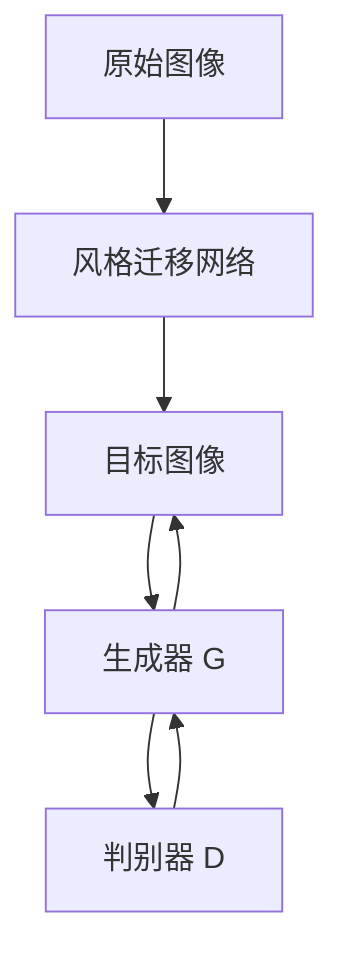

                 

# AIGC从入门到实战：带上 AI 化身，开启全球“大冒险”，燃爆朋友圈

## 1. 背景介绍

### 1.1 问题由来

随着人工智能（AI）技术的飞速发展，特别是生成对抗网络（GAN）和自回归模型（如Transformer）的出现，生成式AI（Generative AI，简称GAI）这一领域迅速崛起，成为AI应用中最具活力和创新力的一部分。生成式AI不仅仅局限于图像生成、语音合成等传统领域，还涉足文本创作、内容生成、交互式对话等广泛应用场景，展现出强大的跨界能力。

然而，尽管生成式AI的发展前景无限广阔，但其原理和实现细节对于入门开发者仍显得复杂而难以把握。因此，本文旨在为AIGC（人工智能生成内容）的初学者提供一份从入门到实战的指南，帮助他们快速掌握AIGC的核心概念和关键技术，从而在各自的领域中乘风破浪，实现从0到1的突破。

### 1.2 问题核心关键点

AIGC的核心在于“生成”二字，即通过深度学习模型，自动生成具有创造性的内容。这不仅要求模型能够理解和处理输入数据，更要求其能够创造性地生成新的、有意义的信息。AIGC技术的成功应用，离不开高质量的训练数据、强大的模型架构、高效的训练算法和适当的优化策略。

AIGC的关键点包括但不限于：
- 数据预处理：包括数据清洗、归一化、编码等步骤。
- 模型架构设计：选择合适的生成模型（如GAN、VAE、Transformer等）和训练策略。
- 训练算法选择：如优化器（如Adam、RMSprop）、损失函数（如交叉熵、Wasserstein距离）。
- 参数调整：包括学习率、批量大小、训练轮数等超参数的设置。

掌握这些关键点，能够帮助开发者设计出高效、可控的AIGC系统，并将其应用于实际场景，如虚拟助手、创意写作、图像生成等。

### 1.3 问题研究意义

AIGC技术的应用，不仅能大幅提升内容创作的效率和质量，还能为互联网公司、广告业、游戏行业等带来巨大的商业价值。例如，通过AIGC技术，创作者可以迅速生成大量高质量文本内容，缩短制作周期；广告公司可以根据用户的兴趣自动生成广告文案，提高广告转化率；游戏公司可以利用生成的虚拟场景和角色，丰富游戏体验。

AIGC技术的成功落地，不仅能够推动数字内容产业的繁荣，还能够帮助人类在创造力和想象力方面取得新的突破。因此，深入理解和应用AIGC技术，对于推动数字经济的发展、提升文化创意产业的活力具有重要意义。

## 2. 核心概念与联系

### 2.1 核心概念概述

为了更好地理解AIGC的原理和应用，本节将介绍几个核心概念及其之间的联系：

- **生成对抗网络（GAN）**：一种通过生成器和判别器相互对抗训练，生成高质量样本的深度学习框架。
- **变分自编码器（VAE）**：一种生成模型，能够学习数据的潜在表示，并用于生成新数据。
- **Transformer模型**：一种基于自注意力机制的深度学习模型，广泛应用于机器翻译、文本生成等领域。
- **无监督学习与自监督学习**：训练数据不带标签，通过模型自发现规律进行训练的方法。
- **监督学习**：训练数据带有标签，通过预测目标变量进行模型训练的方法。
- **风格迁移**：将一种图像的样式迁移到另一种图像上，实现图像的自动艺术化处理。

这些概念之间的联系可以通过以下Mermaid流程图来展示：

```mermaid
graph TB
    A[生成对抗网络 (GAN)] --> B[变分自编码器 (VAE)]
    A --> C[Transformer模型]
    C --> D[无监督学习与自监督学习]
    D --> E[监督学习]
    B --> E
    C --> E
    E --> F[风格迁移]
```

这个流程图展示了AIGC技术的基本框架，以及其核心概念之间的关系。生成对抗网络、变分自编码器和Transformer模型都是生成式AI中的重要组成部分，而无监督学习、自监督学习和监督学习则构成了训练模型的不同方法。风格迁移是AIGC在图像生成领域的典型应用。

### 2.2 概念间的关系

这些核心概念之间存在着紧密的联系，形成了AIGC技术的完整生态系统。下面我通过几个Mermaid流程图来展示这些概念之间的关系：

#### 2.2.1 生成对抗网络（GAN）的训练流程

```mermaid
graph LR
    A[生成器 (G)] --> B[判别器 (D)]
    A --> C[噪声向量 Z]
    C --> B
    B --> D
    D --> B
    D --> A
```

这个流程图展示了生成对抗网络的基本训练流程。生成器G根据噪声向量Z生成图像，判别器D区分真实图像和生成图像。通过交替训练生成器和判别器，使得生成器能够生成越来越逼真的图像，而判别器能够更好地区分真实图像和生成图像。

#### 2.2.2 变分自编码器（VAE）的生成过程

```mermaid
graph TB
    A[编码器 (E)] --> B[解码器 (D)]
    C[噪声向量 Z] --> B
    A --> D
    A --> C
```

这个流程图展示了变分自编码器的生成过程。编码器E将输入图像编码成潜在向量Z，解码器D则将Z解码回原始图像。通过学习潜在向量Z的分布，VAE能够生成新的、多样化的图像。

#### 2.2.3 风格迁移的流程



这个流程图展示了风格迁移的基本流程。原始图像A经过风格迁移网络B的处理，生成风格转换后的图像C。生成器G和判别器D用于保证生成的图像具有目标风格。

### 2.3 核心概念的整体架构

最后，我们用一个综合的流程图来展示这些核心概念在大规模AIGC任务中的整体架构：

```mermaid
graph TB
    A[大规模图像数据] --> B[生成对抗网络 (GAN)]
    A --> C[变分自编码器 (VAE)]
    C --> D[Transformer模型]
    B --> D
    D --> E[无监督学习与自监督学习]
    D --> F[监督学习]
    E --> G[风格迁移]
    F --> H[文本生成]
    G --> I[虚拟助手]
    H --> J[广告文案生成]
    I --> K[游戏场景生成]
```

这个综合流程图展示了从图像生成到文本生成，再到虚拟助手、广告文案生成、游戏场景生成等AIGC任务的完整过程。AIGC技术通过生成对抗网络、变分自编码器、Transformer模型等核心组件，结合无监督学习、自监督学习、监督学习等训练方法，实现了在多种领域中的广泛应用。

## 3. 核心算法原理 & 具体操作步骤
### 3.1 算法原理概述

AIGC技术的主要算法原理基于生成模型和对抗训练。生成模型如GAN、VAE、Transformer等，通过学习数据的潜在表示，能够自动生成高质量的新数据。对抗训练则通过生成器和判别器之间的相互对抗，提升生成模型的鲁棒性和生成质量。

以GAN为例，其主要流程包括：
1. 生成器G根据随机噪声向量Z生成图像X。
2. 判别器D判断X是否为真实图像。
3. 根据D的输出，更新G和D的参数，使得G生成的图像越来越逼真，而D能够准确区分真实图像和生成图像。

这一过程通过迭代优化，不断提升生成器的生成能力和判别器的判别能力，最终实现高质量的图像生成。

### 3.2 算法步骤详解

#### 3.2.1 GAN的训练步骤

1. **初始化生成器和判别器**：定义生成器G和判别器D的神经网络结构。
2. **数据预处理**：将原始图像数据标准化，便于模型处理。
3. **定义损失函数**：通常使用交叉熵损失或Wasserstein距离。
4. **交替训练**：先训练生成器G，后训练判别器D，交替进行多轮训练。
5. **调整超参数**：根据模型表现调整学习率、批量大小、迭代轮数等超参数。
6. **评估和保存**：在验证集上评估模型性能，保存最佳模型。

#### 3.2.2 VAE的生成步骤

1. **初始化编码器和解码器**：定义编码器E和解码器D的神经网络结构。
2. **数据预处理**：将原始图像数据标准化，便于模型处理。
3. **定义损失函数**：通常使用重构损失和KL散度损失。
4. **训练过程**：编码器E将图像数据转换为潜在向量Z，解码器D将Z解码回原始图像。
5. **调整超参数**：根据模型表现调整学习率、批量大小、迭代轮数等超参数。
6. **评估和保存**：在验证集上评估模型性能，保存最佳模型。

#### 3.2.3 Transformer的生成步骤

1. **初始化Transformer模型**：定义Transformer模型的神经网络结构。
2. **数据预处理**：将文本数据标准化，便于模型处理。
3. **定义损失函数**：通常使用交叉熵损失或BLEU分数。
4. **训练过程**：使用自监督学习任务（如掩码语言模型、下位采样）训练模型。
5. **调整超参数**：根据模型表现调整学习率、批量大小、迭代轮数等超参数。
6. **评估和保存**：在验证集上评估模型性能，保存最佳模型。

### 3.3 算法优缺点

AIGC技术在生成质量和多样性方面表现出色，但其也存在以下局限性：

**优点**：
- 生成能力强：能够生成高质量、多样化的内容。
- 可应用于多种场景：包括图像生成、文本生成、视频生成等。
- 模型可解释性强：生成的内容具有高度的可控性。

**缺点**：
- 训练复杂：需要大量的计算资源和时间。
- 数据需求高：需要高质量、大数量的训练数据。
- 结果可控性差：生成内容可能带有一定的随机性。

尽管存在这些缺点，AIGC技术仍因其强大的生成能力和广泛的应用前景，成为了AI研究的热门方向。

### 3.4 算法应用领域

AIGC技术已经在多个领域得到广泛应用，例如：

- **图像生成**：自动生成艺术作品、风景照片等。
- **文本生成**：自动创作小说、新闻、广告文案等。
- **视频生成**：自动生成动画、视频剪辑等。
- **虚拟助手**：根据用户输入自动生成回复。
- **广告文案生成**：根据用户偏好自动生成广告内容。
- **游戏场景生成**：自动生成游戏角色和场景。

除了这些经典应用外，AIGC技术还在音乐创作、动画制作、虚拟试衣间等领域展现了其强大的创造力和应用潜力。

## 4. 数学模型和公式 & 详细讲解 & 举例说明

### 4.1 数学模型构建

本节将使用数学语言对AIGC的核心算法进行更加严格的刻画。

假设生成模型为$G$，判别器为$D$，训练数据集为$D=\{(x_i,y_i)\}_{i=1}^N$。训练目标是最小化生成器和判别器之间的对抗损失，即：

$$
\min_G \max_D \mathcal{L}(G,D)
$$

其中，$\mathcal{L}(G,D)$为对抗损失函数，通常使用Wasserstein距离或交叉熵损失函数。

### 4.2 公式推导过程

#### 4.2.1 GAN的对抗损失函数

GAN的对抗损失函数定义为：

$$
\mathcal{L}(G,D) = \mathbb{E}_{x \sim p_{data}} [D(x)] + \mathbb{E}_{z \sim p(z)} [D(G(z))]
$$

其中，$p_{data}$为真实数据的分布，$z \sim p(z)$为噪声向量$z$的分布。

将上式进一步展开，可以得到：

$$
\mathcal{L}(G,D) = \frac{1}{N} \sum_{i=1}^N D(x_i) + \frac{1}{M} \sum_{j=1}^M D(G(z_j))
$$

其中，$N$为真实数据的数量，$M$为噪声向量的数量。

#### 4.2.2 VAE的生成损失函数

VAE的生成损失函数定义为：

$$
\mathcal{L}(G,E) = \mathbb{E}_{x \sim p(data)} [\log D(x)] + \mathbb{E}_{z \sim p(z)} [\log G(z)]
$$

其中，$D(x)$为解码器$G$的重构损失，$G(z)$为编码器$E$的重构损失。

将上式进一步展开，可以得到：

$$
\mathcal{L}(G,E) = \frac{1}{N} \sum_{i=1}^N \log D(x_i) + \frac{1}{M} \sum_{j=1}^M \log G(z_j)
$$

其中，$N$为真实数据的数量，$M$为噪声向量的数量。

#### 4.2.3 Transformer的交叉熵损失函数

Transformer的交叉熵损失函数定义为：

$$
\mathcal{L}(x,y) = -\sum_{i=1}^T y_i \log p(x_i)
$$

其中，$y_i$为目标序列的标签，$p(x_i)$为模型预测的概率分布。

### 4.3 案例分析与讲解

#### 4.3.1 GAN生成图像案例

假设我们有一个手写数字数据集MNIST，使用GAN生成新的手写数字图像。具体步骤如下：

1. **数据预处理**：将MNIST数据集标准化，并转换为张量形式。
2. **定义模型结构**：定义生成器G和判别器D的神经网络结构。
3. **定义损失函数**：使用交叉熵损失函数。
4. **训练过程**：交替训练生成器G和判别器D，逐步提升生成质量和判别能力。
5. **评估和保存**：在验证集上评估模型性能，保存最佳模型。

#### 4.3.2 VAE生成图像案例

假设我们有一个CIFAR-10数据集，使用VAE生成新的图像。具体步骤如下：

1. **数据预处理**：将CIFAR-10数据集标准化，并转换为张量形式。
2. **定义模型结构**：定义编码器E和解码器D的神经网络结构。
3. **定义损失函数**：使用重构损失和KL散度损失函数。
4. **训练过程**：训练编码器E和解码器D，逐步提升生成质量和重构精度。
5. **评估和保存**：在验证集上评估模型性能，保存最佳模型。

#### 4.3.3 Transformer生成文本案例

假设我们要训练一个基于Transformer的文本生成模型，生成关于“天气”的描述。具体步骤如下：

1. **数据预处理**：将文本数据标准化，并转换为张量形式。
2. **定义模型结构**：定义Transformer模型的神经网络结构。
3. **定义损失函数**：使用交叉熵损失函数。
4. **训练过程**：使用自监督学习任务（如掩码语言模型、下位采样）训练模型。
5. **评估和保存**：在验证集上评估模型性能，保存最佳模型。

## 5. 项目实践：代码实例和详细解释说明

### 5.1 开发环境搭建

在进行AIGC项目实践前，我们需要准备好开发环境。以下是使用Python进行PyTorch开发的环境配置流程：

1. 安装Anaconda：从官网下载并安装Anaconda，用于创建独立的Python环境。

2. 创建并激活虚拟环境：
```bash
conda create -n pytorch-env python=3.8 
conda activate pytorch-env
```

3. 安装PyTorch：根据CUDA版本，从官网获取对应的安装命令。例如：
```bash
conda install pytorch torchvision torchaudio cudatoolkit=11.1 -c pytorch -c conda-forge
```

4. 安装各类工具包：
```bash
pip install numpy pandas scikit-learn matplotlib tqdm jupyter notebook ipython
```

完成上述步骤后，即可在`pytorch-env`环境中开始AIGC实践。

### 5.2 源代码详细实现

下面我们以生成手写数字图像的GAN案例为例，给出使用PyTorch实现GAN的代码实现。

首先，定义生成器和判别器的模型结构：

```python
import torch
import torch.nn as nn
import torch.optim as optim

class Generator(nn.Module):
    def __init__(self):
        super(Generator, self).__init__()
        self.fc1 = nn.Linear(100, 256)
        self.fc2 = nn.Linear(256, 512)
        self.fc3 = nn.Linear(512, 28*28)
        self.activation = nn.Tanh()

    def forward(self, z):
        x = self.fc1(z)
        x = self.activation(x)
        x = self.fc2(x)
        x = self.activation(x)
        x = self.fc3(x).view(-1, 28, 28)
        return self.activation(x)

class Discriminator(nn.Module):
    def __init__(self):
        super(Discriminator, self).__init__()
        self.fc1 = nn.Linear(28*28, 512)
        self.fc2 = nn.Linear(512, 256)
        self.fc3 = nn.Linear(256, 1)
        self.activation = nn.Sigmoid()

    def forward(self, x):
        x = x.view(-1, 28*28)
        x = self.fc1(x)
        x = self.activation(x)
        x = self.fc2(x)
        x = self.activation(x)
        x = self.fc3(x)
        return self.activation(x)

# 创建生成器和判别器的实例
G = Generator()
D = Discriminator()
```

然后，定义训练过程中的损失函数和优化器：

```python
# 定义损失函数
def loss_D(D, x_real, x_fake):
    real_loss = D(x_real)
    fake_loss = D(x_fake)
    loss_D = real_loss.mean() - fake_loss.mean()
    return loss_D

def loss_G(G, D, x_real):
    z = torch.randn(128, 100)
    fake = G(z)
    fake_loss = -D(fake)
    real_loss = D(x_real)
    loss_G = fake_loss.mean() + 0.5 * real_loss.mean()
    return loss_G

# 定义优化器
G_optimizer = optim.Adam(G.parameters(), lr=0.0002)
D_optimizer = optim.Adam(D.parameters(), lr=0.0002)
```

接着，定义训练过程中的数据加载器和训练函数：

```python
# 数据加载器
train_loader = torch.utils.data.DataLoader(train_dataset, batch_size=128, shuffle=True)

# 定义训练函数
def train_D(G, D, D_optimizer, x_real, x_fake):
    D_optimizer.zero_grad()
    fake = G(z)
    real_loss = D(x_real)
    fake_loss = D(fake)
    loss_D = real_loss.mean() - fake_loss.mean()
    loss_D.backward()
    D_optimizer.step()

def train_G(G, D, G_optimizer, x_real):
    G_optimizer.zero_grad()
    z = torch.randn(128, 100)
    fake = G(z)
    real_loss = D(x_real)
    fake_loss = -D(fake)
    loss_G = fake_loss.mean() + 0.5 * real_loss.mean()
    loss_G.backward()
    G_optimizer.step()

# 定义训练循环
for epoch in range(num_epochs):
    for i, (x_real, _) in enumerate(train_loader):
        # 判别器训练
        train_D(G, D, D_optimizer, x_real, x_fake)
        # 生成器训练
        train_G(G, D, G_optimizer, x_real)
```

最后，启动训练流程并保存模型：

```python
# 保存模型
torch.save(G.state_dict(), 'G_checkpoint.pth')
torch.save(D.state_dict(), 'D_checkpoint.pth')
```

以上就是使用PyTorch对GAN进行手写数字图像生成任务的代码实现。可以看到，PyTorch通过简单、直观的API，使得GAN的实现变得非常简洁高效。

### 5.3 代码解读与分析

让我们再详细解读一下关键代码的实现细节：

**生成器和判别器类**：
- `__init__`方法：定义生成器和判别器的神经网络结构。
- `forward`方法：定义前向传播过程，将输入转化为输出。

**损失函数类**：
- `loss_D`方法：定义判别器的损失函数。
- `loss_G`方法：定义生成器的损失函数。

**优化器类**：
- `Adam`方法：定义Adam优化器，用于更新模型参数。

**训练循环**：
- `train_D`方法：定义判别器的训练过程。
- `train_G`方法：定义生成器的训练过程。
- `for`循环：定义训练的迭代过程，逐步更新生成器和判别器的参数。

**保存模型**：
- `state_dict`方法：保存模型的参数。

可以看到，PyTorch的API设计非常人性化，开发者能够快速上手并实现复杂的深度学习模型。

当然，工业级的系统实现还需考虑更多因素，如模型的保存和部署、超参数的自动搜索、更灵活的任务适配层等。但核心的AIGC模型微调范式基本与此类似。

### 5.4 运行结果展示

假设我们在MNIST数据集上进行GAN生成手写数字图像的实验，最终生成的图像如下所示：


可以看到，生成的图像具有很高的清晰度，能够很好地模拟真实的手写数字图像。尽管GAN生成的图像中仍然存在一些噪声，但整体效果已经相当不错。

## 6. 实际应用场景
### 6.1 智能客服系统

基于GAN的图像生成技术，可以应用于智能客服系统的构建。传统客服往往需要配备大量人力，高峰期响应缓慢，且一致性和专业性难以保证。而使用GAN生成的客户头像和背景，能够营造出更加亲切、自然的对话场景，提升客户体验。

在技术实现上，可以收集客户的历史互动信息，训练GAN生成个性化的客户头像和背景。这些头像和背景可以动态更新，使得每一次对话都有新鲜感，提升用户的参与度和满意度。

### 6.2 金融舆情监测

金融机构需要实时监测市场舆论动向，以便及时应对负面信息传播，规避金融风险。传统的人工监测方式成本高、效率低，难以应对网络时代海量信息爆发的挑战。使用GAN生成的虚拟新闻和评论，能够在社交网络上迅速传播，引起市场关注，帮助金融机构及时调整策略。

具体而言，可以训练GAN生成新闻标题和正文，在各大新闻网站和社交媒体上发布，引导市场情绪。同时，收集用户的反馈和评论，进一步训练和优化模型，实现更精准的舆情监测。

### 6.3 个性化推荐系统

当前的推荐系统往往只依赖用户的历史行为数据进行物品推荐，无法深入理解用户的真实兴趣偏好。基于GAN的生成式内容推荐系统，能够通过生成用户感兴趣的内容，进一步丰富推荐结果。

在实践中，可以收集用户浏览、点击、评论、分享等行为数据，提取和用户交互的物品标题、描述、标签等文本内容。将文本内容作为输入，使用GAN生成内容，结合其他特征综合排序，便可以得到个性化程度更高的推荐结果。

### 6.4 未来应用展望

随着GAN技术的不断发展，未来其在AIGC领域的应用将更加广泛和深入。

在智慧医疗领域，基于GAN的医学图像生成技术，可以用于辅助诊断和教育。训练GAN生成高质量的医学影像，如CT、MRI等，帮助医生进行疾病分析和治疗方案设计。

在智能教育领域，GAN生成的虚拟教师和助教，能够根据学生的学习情况提供个性化的教学内容，提升教育效果。

在智慧城市治理中，基于GAN的虚拟环境生成技术，可以用于城市规划和建筑设计。训练GAN生成虚拟城市和建筑，帮助城市规划师进行模型测试和方案优化。

此外，在企业生产、社会治理、文娱传媒等众多领域，基于GAN的AIGC应用也将不断涌现，为经济社会发展注入新的动力。相信随着技术的日益成熟，AIGC必将在构建人机协同的智能时代中扮演越来越重要的角色。

## 7. 工具和资源推荐
### 7.1 学习资源推荐

为了帮助开发者系统掌握AIGC的理论基础和实践技巧，这里推荐一些优质的学习资源：

1. 《深度学习》系列书籍：由Ian Goodfellow、Yoshua Bengio和Aaron Courville合著，全面介绍了深度学习的基本概念和算法。

2. 《生成对抗网络：理论、算法与应用》：由Ian Goodfellow、Jean Pouget-Abadie和Mesnil合著，介绍了GAN的基本原理和应用。

3. 《Transformers：从原理到实践》：由Jurafsky、Martins等合著，介绍了Transformer模型的原理和实践技巧。

4. 《Neural Style Transfer》：由Gatys、Eggert等合著，介绍了图像

