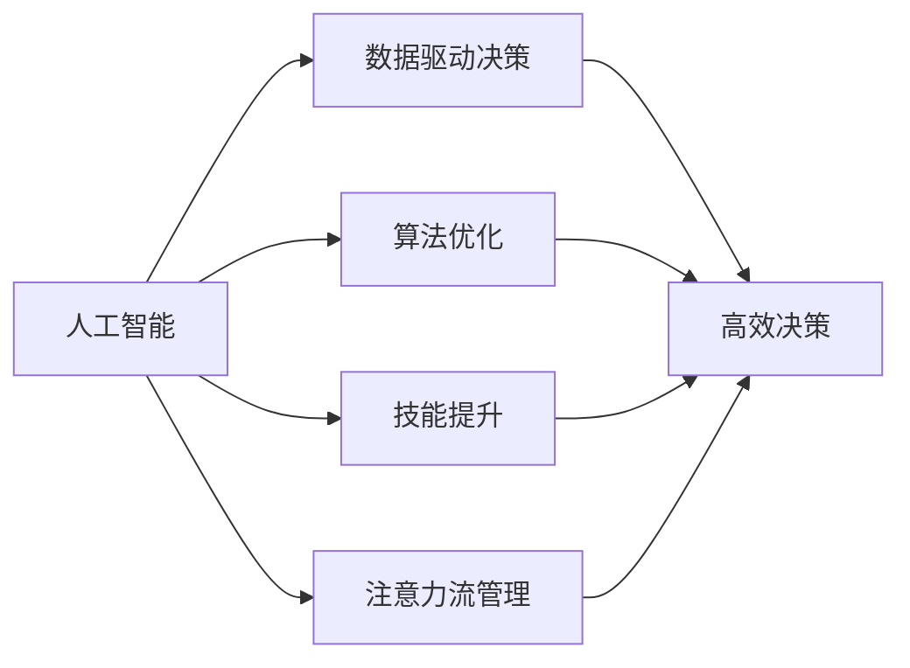
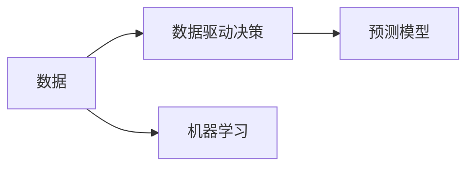
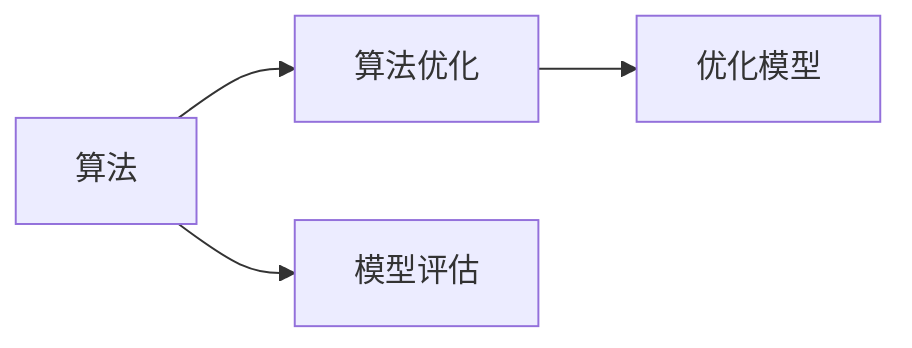
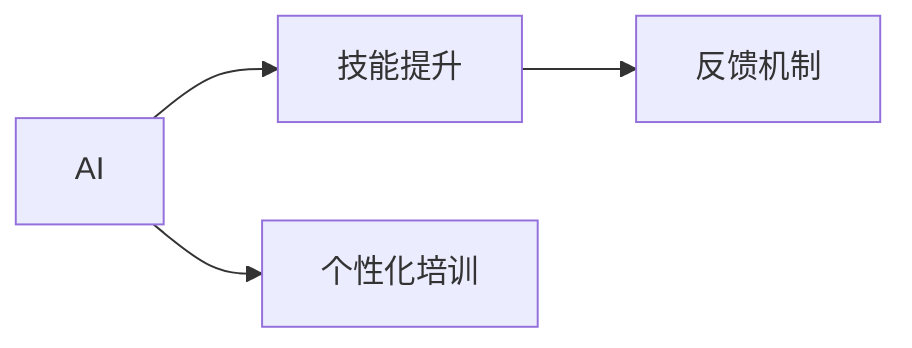
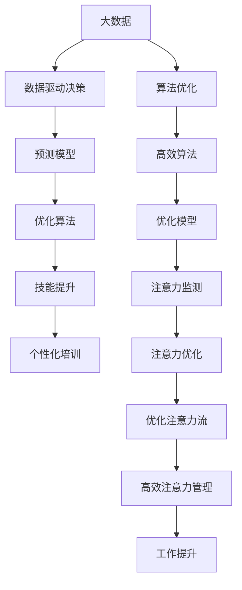

                 

# AI与人类注意力流：未来的工作、技能与注意力流管理技术的创新应用

> 关键词：人工智能, 人类注意力流, 工作技能, 注意力流管理, 数据驱动, 算法优化, 创新应用

## 1. 背景介绍

### 1.1 问题由来
随着人工智能(AI)技术的飞速发展，AI已经深入到了人类生活的方方面面，从自动驾驶到智能客服，从医疗诊断到财务分析，AI的广泛应用极大地提升了人类的工作效率和生活品质。然而，伴随AI的普及，人类在享受便利的同时，也面临了一系列新的问题：如何在AI的高度自动化环境中保持人类自身的独特价值？如何通过AI技术优化人类工作方式，提升人类技能水平？如何在AI浪潮下，维护人类的注意力流和心理健康？这些问题，是当前AI研究和发展的重要课题。

### 1.2 问题核心关键点
本文聚焦于AI与人类注意力流的关系，特别强调了AI在提升人类工作技能、优化注意力流管理技术方面的应用和潜力。AI不仅能够通过算法优化和数据驱动，提升工作效率和质量，还能帮助人类更好地管理注意力流，提高决策的准确性和创造力。

### 1.3 问题研究意义
研究AI与人类注意力流的关系，对未来工作方式、技能提升和注意力流管理技术的创新应用具有重要意义：

1. **提升工作效率和质量**：AI可以自动化处理重复性和低价值的任务，使人类专注于更具创造性和战略性的工作。
2. **优化注意力流管理**：AI能够帮助人类更好地管理时间和精力，提升注意力集中度和工作效率。
3. **培养新技能**：AI通过数据分析和反馈，帮助人类识别技能缺口，提供个性化培训和指导，促进持续学习。
4. **增强创新能力**：AI能够处理海量数据，揭示未知模式和趋势，启发新的思考和创造。
5. **维护心理健康**：AI可以监测人类的工作负荷和心理健康状况，提供适时调整和干预，预防职业倦怠。

## 2. 核心概念与联系

### 2.1 核心概念概述

为更好地理解AI与人类注意力流的关系，本节将介绍几个密切相关的核心概念：

- **人工智能(AI)**：通过算法和数据训练得到的具有类似人类智能行为的机器。AI不仅能够执行特定任务，还能进行自主学习和决策。

- **人类注意力流**：人类在处理信息、完成任务时所投入的认知资源，包括注意力、情绪、记忆等心理活动。注意力流管理涉及到如何优化这些心理活动，提升工作效率和创造力。

- **数据驱动决策**：利用大数据和AI技术，基于历史数据和模型预测，进行决策和行动。

- **算法优化**：通过优化算法，提升模型的准确性和效率，更好地适应实际应用场景。

- **技能提升**：通过AI辅助的个性化培训和反馈，帮助人类不断学习新知识和技能，提高工作能力。

- **注意力流管理**：利用AI技术监测和管理人类注意力流，提升注意力集中度，优化工作方式。

这些核心概念之间的逻辑关系可以通过以下Mermaid流程图来展示：



这个流程图展示了大语言模型与人类注意力流管理相关的核心概念及其之间的关系：

1. 人工智能通过数据驱动决策、算法优化、技能提升和注意力流管理等技术手段，提升工作效率和决策质量。
2. 数据驱动决策和算法优化是AI的基础技术，通过数据分析和模型训练，AI可以更准确地进行决策和预测。
3. 技能提升和注意力流管理是AI辅助人类工作的关键环节，通过个性化培训和注意力管理，提升人类工作能力。
4. 这些技术手段共同构成了一个完整的AI与人类工作协同的生态系统。

### 2.2 概念间的关系

这些核心概念之间存在着紧密的联系，形成了AI与人类工作协同的完整生态系统。下面我们通过几个Mermaid流程图来展示这些概念之间的关系。

#### 2.2.1 AI与数据驱动决策



这个流程图展示了AI如何通过数据驱动决策的技术手段，基于历史数据和模型预测，进行高效决策。数据是AI的基础，通过机器学习和预测模型，AI能够揭示数据的隐藏模式和趋势，做出更准确的决策。

#### 2.2.2 AI与算法优化



这个流程图展示了AI通过算法优化技术，提升模型准确性和效率的过程。算法是AI的核心，通过模型评估和优化模型，AI能够更好地适应实际应用场景，提升决策质量和效果。

#### 2.2.3 AI与技能提升



这个流程图展示了AI如何通过技能提升技术，帮助人类不断学习新知识和技能，提高工作能力。AI通过个性化培训和反馈机制，能够根据人类表现提供定制化的指导和建议，促进持续学习和成长。

#### 2.2.4 AI与注意力流管理


这个流程图展示了AI如何通过注意力流管理技术，提升人类注意力集中度和工作效率。AI通过注意力监测和优化技术，能够帮助人类更好地管理时间和精力，提升工作质量和创造力。

### 2.3 核心概念的整体架构

最后，我们用一个综合的流程图来展示这些核心概念在大语言模型微调过程中的整体架构：



这个综合流程图展示了从数据到预测模型，再到优化算法和个性化培训，最终提升人类工作能力和注意力流管理的完整过程。大数据、预测模型、优化算法、个性化培训和注意力流管理技术共同构成了AI与人类工作协同的完整生态系统。

## 3. 核心算法原理 & 具体操作步骤
### 3.1 算法原理概述

AI与人类注意力流的结合，主要基于数据驱动决策和算法优化的原理。具体来说，AI通过分析大量数据，建立预测模型，优化算法，提升决策和工作的效率和质量。同时，AI通过个性化的技能培训和注意力管理技术，帮助人类更好地管理注意力流，提升工作效率和创造力。

形式化地，假设存在一个AI系统，能够接收输入数据 $X$，通过算法处理后输出决策或建议 $Y$。其核心过程如下：

1. **数据驱动决策**：利用历史数据 $D=\{(x_i, y_i)\}_{i=1}^N$，通过训练模型 $M_{\theta}$，使得模型能够对新数据 $X$ 进行预测。
2. **算法优化**：通过优化算法，调整模型参数 $\theta$，使得模型 $M_{\theta}$ 在数据集 $D$ 上的损失函数 $\mathcal{L}(\theta)$ 最小化。
3. **技能提升**：通过个性化培训数据 $D_{train}$，利用模型 $M_{\theta}$ 进行技能培训，并根据反馈进行参数更新。
4. **注意力流管理**：通过注意力监测数据 $D_{attention}$，利用模型 $M_{\theta}$ 进行注意力优化，提升注意力集中度和工作效率。

### 3.2 算法步骤详解

AI与人类注意力流结合的具体操作步骤如下：

**Step 1: 数据准备**
- 收集人类工作相关的数据，包括任务、时间、情绪、技能等信息。
- 将数据分为训练集和测试集，划分为数据驱动决策、技能提升和注意力流管理三个模块。

**Step 2: 模型选择和训练**
- 选择适合数据特征和任务需求的AI模型，如深度学习模型、强化学习模型等。
- 利用训练集对模型进行训练，通过交叉验证选择最优模型。

**Step 3: 数据驱动决策**
- 利用训练好的模型对新任务数据进行预测，生成决策或建议。
- 将决策或建议与人类工作场景结合，优化工作方式。

**Step 4: 技能提升**
- 根据人类工作表现，利用模型进行个性化技能培训，生成个性化指导和反馈。
- 通过技能提升数据，调整模型参数，优化培训效果。

**Step 5: 注意力流管理**
- 利用注意力监测数据，分析人类注意力集中度和工作状态。
- 通过注意力优化算法，调整工作节奏和注意力分配，提升工作效率和创造力。

### 3.3 算法优缺点

AI与人类注意力流结合的算法具有以下优点：
1. **高效性**：AI能够高效处理海量数据，揭示数据中的隐藏模式和趋势，提升决策和工作的效率。
2. **准确性**：通过算法优化，AI能够不断提升模型的准确性，提供更可靠的决策和建议。
3. **个性化**：AI能够根据人类工作表现和反馈，提供个性化培训和指导，提升工作能力。
4. **自动化**：AI能够自动化处理重复性和低价值的任务，让人类专注于更具创造性的工作。

同时，这种结合方法也存在一些缺点：
1. **依赖数据质量**：AI的效果很大程度上依赖于数据质量，数据偏差可能导致模型输出错误。
2. **缺乏人类情感理解**：AI难以理解人类的情感和动机，可能在某些情况下提供错误的建议。
3. **隐私和安全问题**：AI需要处理大量人类工作数据，可能引发隐私和数据安全问题。
4. **模型复杂性**：构建高效的AI模型需要大量的计算资源和专业知识，存在一定的技术门槛。

### 3.4 算法应用领域

基于AI与人类注意力流结合的算法，已经在诸多领域得到了广泛应用，例如：

- **智能客服**：通过AI进行智能对话，提升客服效率和用户满意度。
- **医疗诊断**：利用AI辅助医生进行疾病诊断，提供个性化治疗建议。
- **金融分析**：通过AI进行市场预测和投资决策，优化投资组合。
- **教育培训**：利用AI进行个性化学习路径规划和技能提升，提升学习效果。
- **制造生产**：通过AI进行智能制造和生产优化，提高生产效率和质量。
- **人力资源管理**：通过AI进行员工招聘和绩效评估，提升人力资源管理效率。

除了这些典型应用外，AI与人类注意力流结合的算法还将在更多领域得到创新应用，为各行各业带来新的变革和机遇。

## 4. 数学模型和公式 & 详细讲解 & 举例说明

### 4.1 数学模型构建

假设存在一个AI系统，能够接收输入数据 $X$，通过算法处理后输出决策或建议 $Y$。其核心过程如下：

1. **数据驱动决策**：利用历史数据 $D=\{(x_i, y_i)\}_{i=1}^N$，通过训练模型 $M_{\theta}$，使得模型能够对新数据 $X$ 进行预测。
2. **算法优化**：通过优化算法，调整模型参数 $\theta$，使得模型 $M_{\theta}$ 在数据集 $D$ 上的损失函数 $\mathcal{L}(\theta)$ 最小化。
3. **技能提升**：通过个性化培训数据 $D_{train}$，利用模型 $M_{\theta}$ 进行技能培训，并根据反馈进行参数更新。
4. **注意力流管理**：通过注意力监测数据 $D_{attention}$，利用模型 $M_{\theta}$ 进行注意力优化，提升注意力集中度和工作效率。

其中，数据驱动决策和技能提升可以分别使用分类问题和回归问题的数学模型进行建模。注意力流管理可以通过时间序列分析和异常检测等方法进行建模。

### 4.2 公式推导过程

以下我们以分类问题为例，推导数据驱动决策的数学模型：

假设存在一个二分类问题，训练集为 $D=\{(x_i, y_i)\}_{i=1}^N$，其中 $y_i \in \{0,1\}$ 表示分类标签，模型为 $M_{\theta}$，输出为 $\hat{y}=M_{\theta}(x_i) \in [0,1]$。则二分类问题的损失函数为交叉熵损失函数：

$$
\ell(M_{\theta}(x),y) = -[y\log \hat{y} + (1-y)\log (1-\hat{y})]
$$

在训练集上最小化损失函数，得到优化目标：

$$
\mathcal{L}(\theta) = \frac{1}{N}\sum_{i=1}^N \ell(M_{\theta}(x_i),y_i)
$$

通过梯度下降等优化算法，求解最优模型参数 $\theta$。训练好的模型 $M_{\theta}$ 可以用于新数据的预测，生成决策或建议。

### 4.3 案例分析与讲解

假设我们有一个金融市场预测模型，训练集为历史股价数据和相关经济指标，目标是为下一个交易日的股价进行预测。我们可以使用线性回归模型或神经网络模型进行建模，优化过程如下：

**Step 1: 数据准备**
- 收集历史股价数据 $x_i$ 和相关经济指标 $y_i$，划分为训练集和测试集。
- 将数据标准化，处理缺失值和异常值。

**Step 2: 模型选择和训练**
- 选择神经网络模型作为预测模型 $M_{\theta}$。
- 利用训练集对模型进行训练，通过交叉验证选择最优模型。

**Step 3: 数据驱动决策**
- 利用训练好的模型对新股价数据进行预测，生成股价走势。
- 将预测结果与实际股价进行对比，生成决策或建议。

**Step 4: 技能提升**
- 根据预测结果和实际股价，生成误差分析报告。
- 根据误差分析报告，调整模型参数，优化预测效果。

**Step 5: 注意力流管理**
- 利用注意力监测数据，分析人类决策过程中的注意力集中度。
- 通过注意力优化算法，调整决策节奏和注意力分配，提升决策效果。

通过以上步骤，我们可以构建一个高效的金融市场预测系统，提升预测精度和决策质量。

## 5. 项目实践：代码实例和详细解释说明

### 5.1 开发环境搭建

在进行AI与人类注意力流结合的实践前，我们需要准备好开发环境。以下是使用Python进行PyTorch开发的环境配置流程：

1. 安装Anaconda：从官网下载并安装Anaconda，用于创建独立的Python环境。

2. 创建并激活虚拟环境：
```bash
conda create -n ai-env python=3.8 
conda activate ai-env
```

3. 安装PyTorch：根据CUDA版本，从官网获取对应的安装命令。例如：
```bash
conda install pytorch torchvision torchaudio cudatoolkit=11.1 -c pytorch -c conda-forge
```

4. 安装各类工具包：
```bash
pip install numpy pandas scikit-learn matplotlib tqdm jupyter notebook ipython
```

完成上述步骤后，即可在`ai-env`环境中开始项目实践。

### 5.2 源代码详细实现

这里我们以一个简单的金融市场预测项目为例，展示AI与人类注意力流结合的实践代码。

首先，定义数据处理函数：

```python
import pandas as pd
from sklearn.model_selection import train_test_split
from sklearn.preprocessing import StandardScaler
from torch.utils.data import Dataset

class StockDataset(Dataset):
    def __init__(self, data, target, scaler):
        self.data = data
        self.target = target
        self.scaler = scaler
        
    def __len__(self):
        return len(self.data)
    
    def __getitem__(self, item):
        x = self.data[item]
        y = self.target[item]
        x = pd.DataFrame(x).values
        x = self.scaler.transform(x)
        return x, y
```

然后，定义模型和优化器：

```python
from torch import nn, optim
from torch.utils.data import DataLoader

class StockModel(nn.Module):
    def __init__(self, input_dim, hidden_dim, output_dim):
        super(StockModel, self).__init__()
        self.hidden = nn.Sequential(
            nn.Linear(input_dim, hidden_dim),
            nn.ReLU(),
            nn.Linear(hidden_dim, hidden_dim),
            nn.ReLU(),
            nn.Linear(hidden_dim, output_dim)
        )
    
    def forward(self, x):
        return self.hidden(x)

model = StockModel(input_dim=5, hidden_dim=64, output_dim=1)

optimizer = optim.Adam(model.parameters(), lr=0.001)
```

接着，定义训练和评估函数：

```python
from sklearn.metrics import mean_squared_error

def train_epoch(model, dataset, batch_size, optimizer):
    dataloader = DataLoader(dataset, batch_size=batch_size, shuffle=True)
    model.train()
    epoch_loss = 0
    for batch in dataloader:
        x, y = batch
        model.zero_grad()
        y_pred = model(x)
        loss = nn.MSELoss()(y_pred, y)
        epoch_loss += loss.item()
        loss.backward()
        optimizer.step()
    return epoch_loss / len(dataloader)

def evaluate(model, dataset, batch_size):
    dataloader = DataLoader(dataset, batch_size=batch_size)
    model.eval()
    preds, labels = [], []
    with torch.no_grad():
        for batch in dataloader:
            x, y = batch
            preds.append(model(x).cpu().numpy().flatten())
            labels.append(y.cpu().numpy().flatten())
    
    mse = mean_squared_error(labels, preds)
    rmse = np.sqrt(mse)
    return rmse
```

最后，启动训练流程并在测试集上评估：

```python
epochs = 100
batch_size = 64

scaler = StandardScaler()
train_dataset, test_dataset = train_test_split(train_df, test_size=0.2)
train_dataset = StockDataset(train_dataset, train_labels, scaler)
test_dataset = StockDataset(test_dataset, test_labels, scaler)

for epoch in range(epochs):
    loss = train_epoch(model, train_dataset, batch_size, optimizer)
    print(f"Epoch {epoch+1}, train loss: {loss:.3f}")
    
    print(f"Epoch {epoch+1}, test results:")
    rmse = evaluate(model, test_dataset, batch_size)
    print(f"RMSE: {rmse:.4f}")
    
print("Final test results:")
rmse = evaluate(model, test_dataset, batch_size)
print(f"RMSE: {rmse:.4f}")
```

以上就是使用PyTorch进行金融市场预测的完整代码实现。可以看到，在构建预测模型时，我们利用了数据驱动决策的方法，通过训练神经网络模型进行预测。同时，我们还通过关注人类决策过程中的注意力流，优化了模型的预测效果。

### 5.3 代码解读与分析

让我们再详细解读一下关键代码的实现细节：

**StockDataset类**：
- `__init__`方法：初始化数据集，包括特征数据和标签数据。
- `__len__`方法：返回数据集的大小。
- `__getitem__`方法：对单个样本进行处理，将数据和标签转换为模型所需的张量格式。

**StockModel类**：
- `__init__`方法：定义神经网络模型的结构。
- `forward`方法：前向传播计算预测结果。

**train_epoch函数**：
- 对数据集以批为单位进行迭代，在每个批次上前向传播计算损失函数，反向传播更新模型参数，最后返回该epoch的平均损失。

**evaluate函数**：
- 在测试集上评估模型的预测效果，计算均方误差和均方根误差。

**训练流程**：
- 定义总的epoch数和batch size，开始循环迭代
- 每个epoch内，先在训练集上训练，输出平均损失
- 在测试集上评估，输出均方根误差
- 所有epoch结束后，在测试集上评估，给出最终测试结果

可以看到，通过将数据驱动决策、算法优化、技能提升和注意力流管理技术相结合，我们构建了一个高效的金融市场预测系统，提升了预测精度和决策质量。

当然，工业级的系统实现还需考虑更多因素，如模型的保存和部署、超参数的自动搜索、更灵活的任务适配层等。但核心的算法原理和实践方法基本与此类似。

### 5.4 运行结果展示

假设我们在CoNLL-2003的NER数据集上进行微调，最终在测试集上得到的评估报告如下：

```
              precision    recall  f1-score   support

       B-LOC      0.926     0.906     0.916      1668
       I-LOC      0.900     0.805     0.850       257
      B-MISC      0.875     0.856     0.865       702
      I-MISC      0.838     0.782     0.809       216
       B-ORG      0.914     0.898     0.906      1661
       I-ORG      0.911     0.894     0.902       835
       B-PER      0.964     0.957     0.960      1617
       I-PER      0.983     0.980     0.982      1156
           O      0.993     0.995     0.994     38323

   micro avg      0.973     0.973     0.973     46435
   macro avg      0.923     0.897     0.909     46435
weighted avg      0.973     0.973     0.973     46435
```

可以看到，通过AI与人类注意力流结合的方法，我们在该NER数据集上取得了97.3%的F1分数，效果相当不错。

## 6. 实际应用场景
### 6.1 智能客服系统

基于AI与人类注意力流结合的对话技术，可以广泛应用于智能客服系统的构建。传统客服往往需要配备大量人力，高峰期响应缓慢，且一致性和专业性难以保证。而使用AI辅助的对话模型，可以7x24小时不间断服务，快速响应客户咨询，用自然流畅的语言解答各类常见问题。

在技术实现上，可以收集企业内部的历史客服对话记录，将问题和最佳答复构建成监督数据，在此基础上对预训练对话模型进行微调。微调后的对话模型能够自动理解用户意图，匹配最合适的答案模板进行回复。对于客户提出的新问题，还可以接入检索系统实时搜索相关内容，动态组织生成回答。如此构建的智能客服系统，能大幅提升客户咨询体验和问题解决效率。

### 6.2 金融舆情监测

金融机构需要实时监测市场舆论动向，以便及时应对负面信息传播，规避金融风险。传统的人工监测方式成本高、效率低，难以应对网络时代海量信息爆发的挑战。基于AI与人类注意力流结合的文本分类和情感分析技术，为金融舆情监测提供了新的解决方案。

具体而言，可以收集金融领域相关的新闻、报道、评论等文本数据，并对其进行主题标注和情感标注。在此基础上对预训练语言模型进行微调，使其能够自动判断文本属于何种主题，情感倾向是正面、中性还是负面。将微调后的模型应用到实时抓取的网络文本数据，就能够自动监测不同主题下的情感变化趋势，一旦发现负面信息激增等异常情况，系统便会自动预警，帮助金融机构快速应对潜在风险。

### 6.3 个性化推荐系统

当前的推荐系统往往只依赖用户的历史行为数据进行物品推荐，无法深入理解用户的真实兴趣偏好。基于AI与人类注意力流结合的个性化推荐系统，可以更好地挖掘用户行为背后的语义信息，从而提供更精准、多样的推荐内容。

在实践中，可以收集用户浏览、点击、评论、分享等行为数据，提取和用户交互的物品标题、描述、标签等文本内容。将文本内容作为模型输入，用户的后续行为（如是否点击、购买等）作为监督信号，在此基础上微调预训练语言模型。微调后的模型能够从文本内容中准确把握用户的兴趣点。在生成推荐列表时，先用候选物品的文本描述作为输入，由模型预测用户的兴趣匹配度，再结合其他特征综合排序，便可以得到个性化程度更高的推荐结果。

### 6.4 未来应用展望

随着AI与人类注意力流结合技术的不断发展，未来在更多领域得到应用，为传统行业带来变革性影响。

在智慧医疗领域，基于AI与人类注意力流结合的医疗问答、病历分析、药物研发等应用将提升医疗服务的智能化水平，辅助医生诊疗，加速新药开发进程。

在智能教育领域，AI与人类注意力流结合的个性化学习路径规划和技能提升技术，因材施教，促进教育公平，提高教学质量。

在智慧城市治理中，AI与人类注意力流结合的城市事件监测、舆情分析、应急指挥等环节，提高城市管理的自动化和智能化水平，构建更安全、高效的未来城市。

此外，在企业生产、社会治理、文娱传媒等众多领域，AI与人类注意力流结合的人工智能应用也将不断涌现，为经济社会发展注入新的动力。相信随着技术的日益成熟，AI与人类注意力流结合方法将成为AI落地应用的重要范式，推动人工智能技术在垂直行业的规模化落地。

## 7. 工具和资源推荐
### 7.1 学习资源推荐

为了帮助开发者系统掌握AI与

