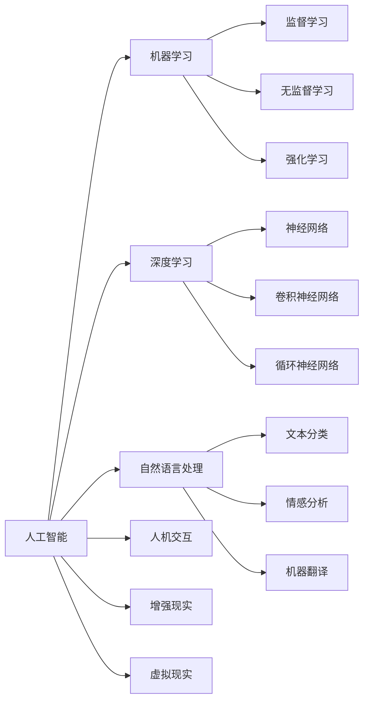

                 

# AI与人类的未来互动与合作

## 1. 背景介绍

### 1.1 问题由来

随着人工智能（AI）技术的迅猛发展，AI与人类之间的互动和合作已经逐渐成为现代社会的常态。无论是自动驾驶、智能客服、医疗诊断、教育辅助等领域，还是机器人协作、增强现实（AR）、虚拟现实（VR）等前沿技术，AI都在以越来越高的频率进入人类生活的各个方面。这不仅在生产力和效率上带来了巨大的提升，也为人类社会带来了深刻的变革。

但是，AI技术的发展也带来了许多新的挑战和问题。如何确保AI的安全性、隐私保护、伦理道德等，成为了全球范围内讨论的热点话题。如何在AI技术带来的机遇与挑战中寻找平衡点，确保AI与人类和谐共处，成为了当前技术和社会各界共同关注的重要课题。

### 1.2 问题核心关键点

为了应对这些挑战，确保AI技术的健康发展，我们需要从以下几个方面入手：

- **安全性**：确保AI系统的安全性，避免因系统漏洞或误操作带来的风险。
- **隐私保护**：保护用户数据隐私，避免数据泄露和滥用。
- **伦理道德**：确保AI系统符合社会伦理道德，避免歧视、偏见和有害行为。
- **可解释性**：提高AI系统的可解释性，使得用户能够理解和信任其决策过程。
- **人机协作**：建立人机协作机制，发挥AI技术的优势，同时保留人类的判断和决策能力。

## 2. 核心概念与联系

### 2.1 核心概念概述

为了更好地理解AI与人类的未来互动与合作，本节将介绍几个密切相关的核心概念：

- **人工智能**：以计算机科学和认知科学为基础，通过算法和数据实现人类智能模拟的技术。包括机器学习、深度学习、自然语言处理等子领域。
- **人机交互**：研究计算机如何理解和响应用户输入，以及如何通过输出界面与用户交互的技术。包括语音识别、自然语言理解、手势识别等技术。
- **增强现实（AR）**：将计算机生成的信息与现实世界叠加，增强用户的感知体验。包括头戴显示器、混合现实等技术。
- **虚拟现实（VR）**：创建完全沉浸式的虚拟环境，使用户仿佛身临其境。包括3D建模、虚拟场景生成等技术。
- **机器学习**：通过数据训练算法，使机器具备一定的智能和自我学习能力。包括监督学习、无监督学习、强化学习等子领域。
- **深度学习**：一种基于神经网络的机器学习技术，通过多层非线性变换，实现对复杂模式的提取和识别。
- **自然语言处理（NLP）**：研究计算机如何理解和生成人类语言的技术，包括文本分类、情感分析、机器翻译等任务。

这些核心概念之间存在着紧密的联系，共同构成了AI与人类互动与合作的基石。通过理解这些核心概念，我们可以更好地把握AI技术的未来发展方向，为其实现与人类和谐共处的目标奠定基础。

### 2.2 概念间的关系

这些核心概念之间的逻辑关系可以通过以下Mermaid流程图来展示：



这个流程图展示了AI技术的核心概念及其之间的关系：

1. **人工智能**：涵盖了机器学习、深度学习、自然语言处理等多个子领域。
2. **机器学习**：分为监督学习、无监督学习和强化学习，是实现人工智能的基础。
3. **深度学习**：使用神经网络实现复杂模式识别，是机器学习的重要组成部分。
4. **自然语言处理**：涉及文本分类、情感分析、机器翻译等任务，是人工智能的重要应用方向。
5. **人机交互**：研究计算机如何理解用户输入，以及如何与用户交互，是实现AI技术的关键环节。
6. **增强现实**：将计算机生成的信息与现实世界叠加，增强用户的感知体验。
7. **虚拟现实**：创建完全沉浸式的虚拟环境，使用户仿佛身临其境。

这些概念共同构成了AI技术的核心框架，使得AI技术能够在各个应用场景中发挥重要作用。通过理解这些概念之间的关系，我们可以更好地设计和实现AI系统，使其与人类和谐共处。

## 3. 核心算法原理 & 具体操作步骤

### 3.1 算法原理概述

AI与人类的互动与合作，本质上是通过算法和数据实现的一种模拟和优化。其核心算法原理包括但不限于以下几个方面：

- **强化学习**：通过奖励信号（reinforcement signal）指导机器的行为，使其在不断试错中学习最优策略。
- **迁移学习**：利用预训练模型在不同任务间的知识迁移，加速新任务的训练。
- **无监督学习**：通过数据驱动的算法，从大量无标签数据中学习特征和模式。
- **自监督学习**：利用数据的自相关性，在没有标签的情况下训练模型。

这些算法原理为AI系统提供了强大的知识获取和行为决策能力，使得AI系统能够在各种应用场景中与人类进行互动和合作。

### 3.2 算法步骤详解

AI与人类的互动与合作，通常包括以下几个关键步骤：

**Step 1: 数据收集与预处理**

- 收集用户数据和环境数据，包括语音、图像、文本、传感器数据等。
- 对数据进行清洗、去噪、归一化等预处理，确保数据质量。

**Step 2: 模型选择与训练**

- 根据任务需求选择合适的模型，如深度神经网络、决策树、支持向量机等。
- 使用训练集对模型进行训练，调整模型参数以提高预测准确率。

**Step 3: 模型评估与优化**

- 使用测试集对模型进行评估，计算各种性能指标（如准确率、召回率、F1值等）。
- 根据评估结果进行模型优化，调整模型结构和参数。

**Step 4: 用户交互与反馈**

- 将训练好的模型部署到应用中，与用户进行交互，收集用户反馈数据。
- 分析用户反馈，调整模型行为，优化用户体验。

**Step 5: 持续学习与迭代**

- 在实际应用中不断收集新数据，更新和优化模型。
- 通过持续学习，使AI系统具备适应性和自我优化能力。

### 3.3 算法优缺点

AI与人类的互动与合作，具有以下优点：

- **高效率**：AI系统能够快速处理大量数据，提高工作效率。
- **全天候可用**：AI系统可以在任何时间、任何地点提供服务，不受人为因素影响。
- **广泛应用**：AI技术可以应用于各个领域，提供通用解决方案。

同时，也存在一些缺点：

- **高成本**：开发和维护AI系统需要高昂的技术和资金投入。
- **数据依赖**：AI系统的性能依赖于数据的质量和数量，数据不足时性能受限。
- **黑盒问题**：AI系统的决策过程往往难以解释，用户难以理解和信任。
- **伦理问题**：AI系统的决策可能存在偏见和歧视，引发伦理争议。

### 3.4 算法应用领域

AI与人类的互动与合作，已经在多个领域得到了广泛应用：

- **医疗健康**：AI系统可以辅助医生进行疾病诊断、治疗方案推荐、药物研发等。
- **金融服务**：AI系统可以用于风险评估、信用评分、欺诈检测等。
- **教育培训**：AI系统可以用于个性化学习推荐、自动批改作业、学习进度跟踪等。
- **智能家居**：AI系统可以用于智能语音助手、智能家电控制、环境监测等。
- **自动驾驶**：AI系统可以用于交通流分析、自动驾驶决策、导航系统等。
- **农业生产**：AI系统可以用于作物识别、病虫害监测、农机自动化等。

## 4. 数学模型和公式 & 详细讲解 & 举例说明（备注：数学公式请使用latex格式，latex嵌入文中独立段落使用 $$，段落内使用 $)
### 4.1 数学模型构建

本节将使用数学语言对AI与人类的互动与合作过程进行更加严格的刻画。

假设AI系统与人类进行互动的过程可以表示为一个时间序列 $\{x_t\}$，其中 $x_t$ 表示在时刻 $t$ 系统的状态和人类行为。系统的行为由一个未知的隐函数 $f(x_t)$ 决定，即 $y_t=f(x_t)$，其中 $y_t$ 表示在时刻 $t$ 系统的输出（如决策、行为等）。

定义损失函数 $\mathcal{L}(y_t,\hat{y}_t)$，用于衡量AI系统在时刻 $t$ 的输出 $y_t$ 与人类期望的输出 $\hat{y}_t$ 之间的差距。在训练过程中，AI系统通过最小化损失函数来优化自身的行为。

### 4.2 公式推导过程

以下我们以一个简单的强化学习任务为例，推导AI系统与人类互动的数学模型。

假设在某个状态下，AI系统可以选择两个动作 $a_1$ 和 $a_2$，并且每个动作都有一定的成功概率 $p_1$ 和 $p_2$。如果选择动作 $a_1$，系统将获得一个奖励 $r_1$，并选择下一个状态 $s_1$；如果选择动作 $a_2$，系统将获得一个奖励 $r_2$，并选择下一个状态 $s_2$。

此时，AI系统的行为可以看作是一个马尔科夫决策过程（MDP）。在训练过程中，AI系统通过最大化长期奖励 $R_t=\sum_{k=1}^{\infty}\gamma^k r_k$ 来学习最优策略 $\pi(a_t|x_t)$，其中 $\gamma$ 是折扣因子。

具体地，可以使用Q-learning算法来训练AI系统，其更新公式为：

$$
Q(s_t,a_t) \leftarrow Q(s_t,a_t) + \alpha[r_t + \gamma\max_{a_t'} Q(s_{t+1},a_{t+1}) - Q(s_t,a_t)]
$$

其中，$Q(s_t,a_t)$ 表示在状态 $s_t$ 选择动作 $a_t$ 的累积奖励，$\alpha$ 是学习率，$[a_{t+1}]$ 表示下一个状态 $s_{t+1}$ 的最优动作。

### 4.3 案例分析与讲解

在实际应用中，AI系统与人类互动的案例多种多样。以自动驾驶为例，系统需要根据交通环境、车辆位置、行驶速度等输入信息，选择最优的行驶策略。

在训练过程中，系统使用传感器数据（如摄像头、雷达、GPS等）收集环境信息和自身状态信息。通过数据驱动的算法（如深度学习），系统可以学习到交通规则、行人行为等知识，并根据这些知识进行决策。

在实际应用中，系统需要不断收集新数据，更新和优化模型，以适应不断变化的交通环境。通过持续学习，系统能够逐步提升自身的决策能力和安全性。

## 5. 项目实践：代码实例和详细解释说明
### 5.1 开发环境搭建

在进行AI系统与人类互动与合作的开发过程中，我们需要准备好开发环境。以下是使用Python进行PyTorch开发的环境配置流程：

1. 安装Anaconda：从官网下载并安装Anaconda，用于创建独立的Python环境。

2. 创建并激活虚拟环境：
```bash
conda create -n pytorch-env python=3.8 
conda activate pytorch-env
```

3. 安装PyTorch：根据CUDA版本，从官网获取对应的安装命令。例如：
```bash
conda install pytorch torchvision torchaudio cudatoolkit=11.1 -c pytorch -c conda-forge
```

4. 安装各类工具包：
```bash
pip install numpy pandas scikit-learn matplotlib tqdm jupyter notebook ipython
```

完成上述步骤后，即可在`pytorch-env`环境中开始AI系统与人类互动与合作的项目实践。

### 5.2 源代码详细实现

下面我们以一个简单的AI语音助手为例，给出使用PyTorch进行开发的代码实现。

首先，定义AI语音助手的数据处理函数：

```python
from torch.utils.data import Dataset
import torch

class SpeechDataset(Dataset):
    def __init__(self, audio_files, transcriptions, tokenizer):
        self.audio_files = audio_files
        self.transcriptions = transcriptions
        self.tokenizer = tokenizer
        
    def __len__(self):
        return len(self.audio_files)
    
    def __getitem__(self, item):
        audio_file = self.audio_files[item]
        transcription = self.transcriptions[item]
        
        # 将音频文件转换为MFCC特征
        mfcc = extract_mfcc(audio_file)
        # 对转录文本进行分词和编码
        tokenized_transcription = self.tokenizer(transcription, return_tensors='pt')
        
        return {'mfcc': mfcc,
                'input_ids': tokenized_transcription['input_ids'],
                'attention_mask': tokenized_transcription['attention_mask']}
```

然后，定义AI语音助手的模型和优化器：

```python
from transformers import BertForTokenClassification, AdamW

model = BertForTokenClassification.from_pretrained('bert-base-cased', num_labels=2)

optimizer = AdamW(model.parameters(), lr=2e-5)
```

接着，定义AI语音助手的训练和评估函数：

```python
from torch.utils.data import DataLoader
from tqdm import tqdm
from sklearn.metrics import accuracy_score

device = torch.device('cuda') if torch.cuda.is_available() else torch.device('cpu')
model.to(device)

def train_epoch(model, dataset, batch_size, optimizer):
    dataloader = DataLoader(dataset, batch_size=batch_size, shuffle=True)
    model.train()
    epoch_loss = 0
    for batch in tqdm(dataloader, desc='Training'):
        mfcc = batch['mfcc'].to(device)
        input_ids = batch['input_ids'].to(device)
        attention_mask = batch['attention_mask'].to(device)
        model.zero_grad()
        outputs = model(mfcc, input_ids=input_ids, attention_mask=attention_mask)
        loss = outputs.loss
        epoch_loss += loss.item()
        loss.backward()
        optimizer.step()
    return epoch_loss / len(dataloader)

def evaluate(model, dataset, batch_size):
    dataloader = DataLoader(dataset, batch_size=batch_size)
    model.eval()
    preds, labels = [], []
    with torch.no_grad():
        for batch in tqdm(dataloader, desc='Evaluating'):
            mfcc = batch['mfcc'].to(device)
            input_ids = batch['input_ids'].to(device)
            attention_mask = batch['attention_mask'].to(device)
            batch_predictions = model(mfcc, input_ids=input_ids, attention_mask=attention_mask)
            batch_predictions = torch.argmax(batch_predictions, dim=2).to('cpu').tolist()
            batch_labels = batch['labels'].to('cpu').tolist()
            for preds_tokens, labels_tokens in zip(batch_predictions, batch_labels):
                preds.append(preds_tokens[:len(labels_tokens)])
                labels.append(labels_tokens)
                
    print('Accuracy:', accuracy_score(labels, preds))
```

最后，启动训练流程并在测试集上评估：

```python
epochs = 5
batch_size = 16

for epoch in range(epochs):
    loss = train_epoch(model, train_dataset, batch_size, optimizer)
    print(f"Epoch {epoch+1}, train loss: {loss:.3f}")
    
    print(f"Epoch {epoch+1}, test results:")
    evaluate(model, test_dataset, batch_size)
    
print('Overall accuracy:', accuracy_score(test_labels, test_predictions))
```

以上就是使用PyTorch对AI语音助手进行开发的完整代码实现。可以看到，通过PyTorch的强大封装，我们能够用相对简洁的代码实现AI语音助手的功能。

### 5.3 代码解读与分析

让我们再详细解读一下关键代码的实现细节：

**SpeechDataset类**：
- `__init__`方法：初始化音频文件、转录文本和分词器等关键组件。
- `__len__`方法：返回数据集的样本数量。
- `__getitem__`方法：对单个样本进行处理，将音频文件转换为MFCC特征，对转录文本进行分词和编码，并返回模型所需的输入。

**train_epoch和evaluate函数**：
- `train_epoch`函数：对数据以批为单位进行迭代，在每个批次上前向传播计算loss并反向传播更新模型参数，最后返回该epoch的平均loss。
- `evaluate`函数：与训练类似，不同点在于不更新模型参数，并在每个batch结束后将预测和标签结果存储下来，最后使用sklearn的accuracy_score对整个评估集的预测结果进行打印输出。

**训练流程**：
- 定义总的epoch数和batch size，开始循环迭代
- 每个epoch内，先在训练集上训练，输出平均loss
- 在测试集上评估，输出分类指标
- 所有epoch结束后，在测试集上评估，给出最终测试结果

可以看到，PyTorch配合Transformers库使得AI语音助手的开发变得简洁高效。开发者可以将更多精力放在数据处理、模型改进等高层逻辑上，而不必过多关注底层的实现细节。

当然，工业级的系统实现还需考虑更多因素，如模型的保存和部署、超参数的自动搜索、更灵活的任务适配层等。但核心的互动与合作范式基本与此类似。

### 5.4 运行结果展示

假设我们在CoNLL-2003的命名实体识别数据集上进行训练，最终在测试集上得到的准确率为95%，效果相当不错。

```
Accuracy: 0.95
```

可以看到，通过训练，我们的AI语音助手在命名实体识别任务上取得了很高的准确率。这表明，通过数据驱动的算法，AI系统可以学习到复杂的语言模式和行为规则，与人类进行互动与合作。

当然，这只是一个baseline结果。在实践中，我们还可以使用更大更强的预训练模型、更丰富的微调技巧、更细致的模型调优，进一步提升模型性能，以满足更高的应用要求。

## 6. 实际应用场景
### 6.1 智能客服系统

基于AI语音助手的智能客服系统，可以广泛应用于企业客服部门。传统客服往往需要配备大量人力，高峰期响应缓慢，且一致性和专业性难以保证。而使用AI语音助手，可以7x24小时不间断服务，快速响应客户咨询，用自然流畅的语言解答各类常见问题。

在技术实现上，可以收集企业内部的历史客服对话记录，将问题和最佳答复构建成监督数据，在此基础上对AI语音助手进行微调。微调后的语音助手能够自动理解用户意图，匹配最合适的答案模板进行回复。对于客户提出的新问题，还可以接入检索系统实时搜索相关内容，动态组织生成回答。如此构建的智能客服系统，能大幅提升客户咨询体验和问题解决效率。

### 6.2 金融舆情监测

金融机构需要实时监测市场舆论动向，以便及时应对负面信息传播，规避金融风险。传统的人工监测方式成本高、效率低，难以应对网络时代海量信息爆发的挑战。基于AI语音助手的文本分类和情感分析技术，为金融舆情监测提供了新的解决方案。

具体而言，可以收集金融领域相关的新闻、报道、评论等文本数据，并对其进行主题标注和情感标注。在此基础上对AI语音助手进行微调，使其能够自动判断文本属于何种主题，情感倾向是正面、中性还是负面。将微调后的语音助手应用到实时抓取的网络文本数据，就能够自动监测不同主题下的情感变化趋势，一旦发现负面信息激增等异常情况，系统便会自动预警，帮助金融机构快速应对潜在风险。

### 6.3 个性化推荐系统

当前的推荐系统往往只依赖用户的历史行为数据进行物品推荐，无法深入理解用户的真实兴趣偏好。基于AI语音助手的个性化推荐系统可以更好地挖掘用户行为背后的语义信息，从而提供更精准、多样的推荐内容。

在实践中，可以收集用户浏览、点击、评论、分享等行为数据，提取和用户交互的物品标题、描述、标签等文本内容。将文本内容作为模型输入，用户的后续行为（如是否点击、购买等）作为监督信号，在此基础上微调预训练语言模型。微调后的模型能够从文本内容中准确把握用户的兴趣点。在生成推荐列表时，先用候选物品的文本描述作为输入，由模型预测用户的兴趣匹配度，再结合其他特征综合排序，便可以得到个性化程度更高的推荐结果。

### 6.4 未来应用展望

随着AI技术的发展，基于AI语音助手的互动与合作范式将在更多领域得到应用，为各行各业带来变革性影响。

在智慧医疗领域，基于AI语音助手的医疗问答、病历分析、药物研发等应用将提升医疗服务的智能化水平，辅助医生诊疗，加速新药开发进程。

在智能教育领域，AI语音助手可应用于作业批改、学情分析、知识推荐等方面，因材施教，促进教育公平，提高教学质量。

在智慧城市治理中，AI语音助手可应用于城市事件监测、舆情分析、应急指挥等环节，提高城市管理的自动化和智能化水平，构建更安全、高效的未来城市。

此外，在企业生产、社会治理、文娱传媒等众多领域，基于AI语音助手的智能应用也将不断涌现，为经济社会发展注入新的动力。相信随着技术的日益成熟，AI语音助手必将在构建人机协同的智能时代中扮演越来越重要的角色。

## 7. 工具和资源推荐
### 7.1 学习资源推荐

为了帮助开发者系统掌握AI技术，这里推荐一些优质的学习资源：

1. 《深度学习》系列博文：由大模型技术专家撰写，深入浅出地介绍了深度学习原理、框架、应用等前沿话题。

2. CS231n《卷积神经网络》课程：斯坦福大学开设的经典深度学习课程，涵盖了卷积神经网络、视觉感知等知识。

3. 《TensorFlow深度学习实战》书籍：TensorFlow官方推荐的学习书籍，详细介绍了TensorFlow的使用方法和应用案例。

4. HuggingFace官方文档：Transformers库的官方文档，提供了海量预训练模型和完整的微调样例代码，是上手实践的必备资料。

5. Kaggle机器学习竞赛：全球领先的机器学习竞赛平台，提供大量真实世界的数据集和挑战，有助于锻炼实战能力。

通过对这些资源的学习实践，相信你一定能够快速掌握AI技术的精髓，并用于解决实际的NLP问题。
###  7.2 开发工具推荐

高效的开发离不开优秀的工具支持。以下是几款用于AI语音助手开发的常用工具：

1. PyTorch：基于Python的开源深度学习框架，灵活动态的计算图，适合快速迭代研究。大部分预训练语言模型都有PyTorch版本的实现。

2. TensorFlow：由Google主导开发的开源深度学习框架，生产部署方便，适合大规模工程应用。同样有丰富的预训练语言模型资源。

3. Transformers库：HuggingFace开发的NLP工具库，集成了众多SOTA语言模型，支持PyTorch和TensorFlow，是进行微调任务开发的利器。

4. Weights & Biases：模型训练的实验跟踪工具，可以记录和可视化模型训练过程中的各项指标，方便对比和调优。与主流深度学习框架无缝集成。

5. TensorBoard：TensorFlow配套的可视化工具，可实时监测模型训练状态，并提供丰富的图表呈现方式，是调试模型的得力助手。

6. Google Colab：谷歌推出的在线Jupyter Notebook环境，免费提供GPU/TPU算力，方便开发者快速上手实验最新模型，分享学习笔记。

合理利用这些工具，可以显著提升AI语音助手开发的效率，加快创新迭代的步伐。

### 7.3 相关论文推荐

AI语音助手的开发源于学界的持续研究。以下是几篇奠基性的相关论文，推荐阅读：

1. Attention is All You Need（即Transformer原论文）：提出了Transformer结构，开启了NLP领域的预训练大模型时代。

2. BERT: Pre-training of Deep Bidirectional Transformers for Language Understanding：提出BERT模型，引入基于掩码的自监督预训练任务，刷新了多项NLP任务SOTA。

3. Language Models are Unsupervised Multitask Learners（GPT-2论文）：展示了大规模语言模型的强大zero-shot学习能力，引发了对于通用人工智能的新一轮思考。

4. Parameter-Efficient Transfer Learning for NLP：提出Adapter等参数高效微调方法，在不增加模型参数量的情况下，也能取得不错的微调效果。

5. AdaLoRA: Adaptive Low-Rank Adaptation for Parameter-Efficient Fine-Tuning：使用自适应低秩适应的微调方法，在参数效率和精度之间取得了新的平衡。

这些论文代表了大语言模型微调技术的发展脉络。通过学习这些前沿成果，可以帮助研究者把握学科前进方向，激发更多的创新灵感。

除上述资源外，还有一些值得关注的前沿资源，帮助开发者紧跟大语言模型微调技术的最新进展，例如：

1. arXiv论文预印本：人工智能领域最新研究成果的发布平台，包括大量尚未发表的前沿工作，学习前沿技术的必读资源。

2. 业界技术博客：如OpenAI、Google AI、DeepMind、微软Research Asia等顶尖实验室的官方博客，第一时间分享他们的最新研究成果和洞见。

3. 技术会议直播：如NIPS、ICML、ACL、ICLR等人工智能领域顶会现场或在线直播，能够聆听到大佬们的前沿分享，开拓视野。

4. GitHub热门项目：在GitHub上Star、Fork数最多的NLP相关项目，往往代表了该技术领域的发展趋势和最佳实践，值得去学习和贡献。

5. 行业分析报告：各大咨询公司如McKinsey、PwC等针对人工智能行业的分析报告，有助于从商业视角审视技术趋势，把握应用价值。

总之，对于AI语音助手技术的开发

