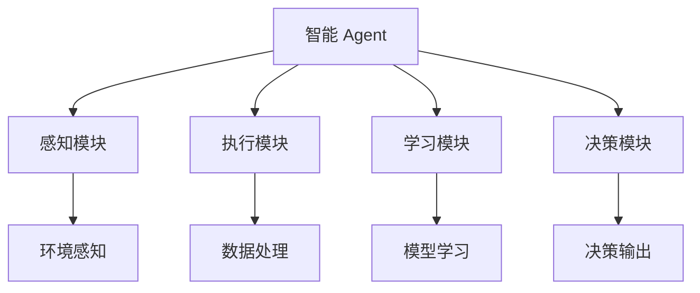
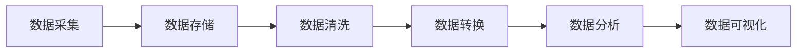
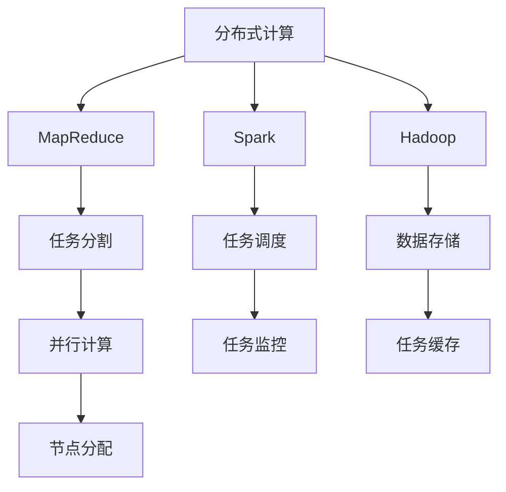

                 

# AI人工智能 Agent：在大数据处理中的应用

> 关键词：
1. 人工智能 Agent
2. 大数据处理
3. 分布式计算
4. 智能决策
5. 机器学习算法
6. 深度学习
7. 数据挖掘

## 1. 背景介绍

在现代信息爆炸的时代，数据已成为驱动业务决策、技术创新和社会进步的重要资源。然而，面对海量数据的存储、处理和分析，传统的方法已经难以满足需求。因此，利用人工智能（AI）技术，特别是智能 Agent 技术，来高效、智能地处理大数据变得尤为重要。

### 1.1 问题由来

大数据处理是现代技术应用的核心之一。它涉及数据的采集、存储、清洗、分析和可视化等多个环节。然而，随着数据量的不断增加，数据处理的复杂性和难度也在不断提升。例如：

1. **数据规模巨大**：全球日产数据量已经超过2.5 PB，预计到2025年将超过35 PB。如此巨大的数据规模，传统的处理方式难以应对。
2. **数据类型多样**：除了结构化数据，还有半结构化和非结构化数据，如文本、图片、视频等。传统方法难以处理如此多样化的数据类型。
3. **数据质量参差不齐**：数据可能存在噪声、缺失、异常等问题，需要进行清洗和预处理。
4. **数据安全性**：数据隐私和安全问题不容忽视，需要有效的管理和保护措施。

这些问题催生了对智能 Agent 技术的需求。智能 Agent 能够自动化处理数据，通过机器学习算法和深度学习模型，从海量数据中提取有用的信息，提供智能决策支持。

### 1.2 问题核心关键点

智能 Agent 的核心在于其能够利用人工智能技术，自主地在大数据处理流程中执行任务。其关键点包括：

1. **自主决策**：Agent 能够根据设定的目标和规则，自主选择数据处理的方式和路径，优化资源分配。
2. **分布式计算**：Agent 能够将任务分解为多个子任务，在不同的计算节点上并行执行，提高处理效率。
3. **动态学习**：Agent 能够根据任务需求的变化，动态调整算法和参数，适应不同的数据场景。
4. **知识管理**：Agent 能够存储和管理已处理的数据和知识，提高后续任务的处理速度和准确性。
5. **用户交互**：Agent 能够提供友好的用户界面，方便用户管理和监督数据处理过程。

这些关键点使得智能 Agent 在处理大数据时，能够具备高效率、高灵活性和高鲁棒性。

### 1.3 问题研究意义

智能 Agent 技术在处理大数据方面的研究具有重要意义：

1. **提升数据处理效率**：智能 Agent 能够自动化执行数据处理任务，减少人工干预，提高处理效率。
2. **优化资源利用**：Agent 能够动态调整计算资源分配，避免资源浪费，提升整体系统性能。
3. **保障数据安全**：Agent 能够实施严格的数据访问和隐私保护措施，保障数据安全。
4. **支持智能决策**：Agent 能够从数据中提取有价值的信息，支持智能决策和业务优化。
5. **推动产业升级**：智能 Agent 技术能够帮助传统行业数字化转型，提升竞争力。

## 2. 核心概念与联系

### 2.1 核心概念概述

为了更好地理解智能 Agent 技术在大数据处理中的应用，本节将介绍几个核心概念：

- **智能 Agent**：一种能够感知环境、接收用户输入、执行任务并产生输出的软件系统。智能 Agent 能够通过机器学习算法和深度学习模型，自主地处理数据。
- **大数据处理**：涉及数据采集、存储、清洗、分析和可视化等多个环节，涵盖结构化、半结构化和非结构化数据。
- **分布式计算**：通过将数据和计算任务分布到多个计算节点上，实现并行处理，提高效率。
- **机器学习算法**：包括监督学习、无监督学习和强化学习等，用于从数据中提取规律和模式。
- **深度学习**：一种特殊的机器学习算法，通过多层次神经网络模型，能够处理非线性、高维数据。
- **数据挖掘**：通过算法和模型，从数据中挖掘出有价值的信息和知识，支持决策支持。
- **智能决策**：基于数据分析和机器学习模型，自动做出最优决策，支持业务优化和创新。

这些核心概念之间存在着紧密的联系，形成了智能 Agent 处理大数据的完整生态系统。通过理解这些核心概念，我们可以更好地把握智能 Agent 技术的工作原理和优化方向。

### 2.2 概念间的关系

这些核心概念之间存在着紧密的联系，形成了智能 Agent 处理大数据的完整生态系统。下面我们通过几个Mermaid流程图来展示这些概念之间的关系。

#### 2.2.1 智能 Agent 的核心架构



这个流程图展示了智能 Agent 的核心架构。感知模块负责获取环境信息，执行模块负责数据处理，学习模块负责模型训练，决策模块负责决策输出。

#### 2.2.2 大数据处理流程



这个流程图展示了大数据处理的典型流程，包括数据采集、存储、清洗、转换、分析和可视化。

#### 2.2.3 分布式计算模型



这个流程图展示了分布式计算模型的典型架构。任务通过MapReduce、Spark、Hadoop等框架进行分割和调度，数据存储在节点上进行并行计算，任务监控和节点分配确保系统的高效和稳定性。

## 3. 核心算法原理 & 具体操作步骤
### 3.1 算法原理概述

智能 Agent 技术在大数据处理中的应用，主要依赖于机器学习算法和深度学习模型。其核心思想是：

1. **数据预处理**：利用数据清洗、数据转换等技术，对原始数据进行预处理，使其适合后续分析。
2. **特征提取**：通过特征工程和模型学习，从数据中提取有用的特征。
3. **模型训练**：利用监督学习、无监督学习和强化学习等算法，训练出适合任务的模型。
4. **数据推理**：通过推理引擎和决策模型，根据已有数据和模型，自动做出决策。

在具体实现中，智能 Agent 通常包括以下几个步骤：

1. **环境感知**：Agent 通过传感器或API获取环境信息，包括数据来源、格式、分布等。
2. **任务分解**：Agent 根据任务需求，将大任务分解为多个子任务，并分配给不同的计算节点。
3. **数据处理**：Agent 在各个节点上并行处理数据，利用分布式计算框架提高效率。
4. **模型训练**：Agent 利用已处理的数据，进行模型训练，优化模型参数。
5. **决策输出**：Agent 根据模型输出，自动做出决策，支持业务优化。

### 3.2 算法步骤详解

以下是智能 Agent 处理大数据的详细操作步骤：

**Step 1: 环境感知**
智能 Agent 首先通过API或传感器获取环境信息，包括数据类型、来源、格式、分布等。这些信息将指导后续数据处理和模型训练。

**Step 2: 任务分解**
Agent 将大数据处理任务分解为多个子任务，如数据清洗、特征提取、模型训练等。任务分解可以基于任务难度、资源需求等因素，合理分配计算节点。

**Step 3: 分布式计算**
Agent 利用分布式计算框架（如MapReduce、Spark、Hadoop等），将任务并行化执行。每个节点独立处理一部分数据，最终汇总结果。

**Step 4: 模型训练**
Agent 利用已处理的数据，进行模型训练。可以使用监督学习、无监督学习或强化学习等算法，训练出适合任务的模型。

**Step 5: 决策输出**
Agent 根据模型输出，自动做出决策，支持业务优化。决策可以基于模型预测、规则引擎、专家系统等方法。

### 3.3 算法优缺点

智能 Agent 技术在处理大数据时，具有以下优点：

1. **高效性**：利用分布式计算和并行处理，能够高效处理海量数据。
2. **灵活性**：能够动态调整任务和资源，适应不同的数据场景。
3. **自动化**：能够自动化执行数据处理任务，减少人工干预。

但同时，智能 Agent 也存在以下缺点：

1. **复杂性**：设计和实现智能 Agent 需要较高的技术门槛，开发和维护成本较高。
2. **数据隐私**：处理大数据时，可能涉及敏感信息，数据隐私和安全问题不容忽视。
3. **模型泛化**：模型在不同数据集上的泛化能力有限，需要大量的数据和计算资源进行训练。
4. **系统稳定性**：分布式计算和并行处理可能带来系统稳定性问题，需要有效的监控和管理措施。

### 3.4 算法应用领域

智能 Agent 技术在大数据处理中的应用，主要涵盖以下几个领域：

1. **数据清洗与预处理**：用于自动清洗和预处理数据，包括去重、去噪、归一化等。
2. **特征工程与提取**：用于自动提取数据特征，包括统计特征、文本特征、图像特征等。
3. **数据分析与建模**：用于自动分析数据并建立模型，包括回归分析、分类分析、聚类分析等。
4. **智能决策与优化**：用于自动做出业务决策，支持业务优化和创新。
5. **用户交互与反馈**：用于提供友好的用户界面，支持用户交互和反馈。

除了以上应用领域，智能 Agent 技术还可以应用于数据分析、商业智能、金融风险管理、医疗诊断等多个领域，为数据驱动的业务决策提供强有力的技术支持。

## 4. 数学模型和公式 & 详细讲解 & 举例说明

### 4.1 数学模型构建

为了更好地理解智能 Agent 在大数据处理中的应用，本节将使用数学语言对智能 Agent 的流程进行严格的刻画。

记智能 Agent 为 $A$，其任务为 $T$，包括数据采集、存储、清洗、转换、分析等多个环节。定义 $T=\{t_1,t_2,...,t_n\}$，其中 $t_i$ 表示第 $i$ 个数据处理任务。假设每个任务 $t_i$ 需要 $P_i$ 个数据样本，$D_i$ 表示第 $i$ 个任务的数据集，则总数据集 $D=\cup_{i=1}^n D_i$。

定义环境感知模块为 $S$，执行模块为 $E$，学习模块为 $L$，决策模块为 $D$。则智能 Agent 的数学模型可以表示为：

$$
A = (S, E, L, D)
$$

其中，$S$ 通过API或传感器获取环境信息，$E$ 将任务并行化执行，$L$ 进行模型训练，$D$ 根据模型输出做出决策。

### 4.2 公式推导过程

以回归分析为例，推导智能 Agent 进行数据处理和模型训练的过程。

假设有一个连续型任务 $t$，数据集 $D$ 为 $(x_i, y_i)$，$i=1,...,N$。Agent 首先进行数据清洗和特征提取，得到预处理后的数据集 $D'$。然后利用监督学习算法，训练回归模型 $f(x;\theta)$，最小化均方误差损失函数：

$$
\ell(f(x;\theta)) = \frac{1}{N}\sum_{i=1}^N (f(x_i;\theta) - y_i)^2
$$

其中 $\theta$ 为模型参数。通过梯度下降算法，最小化损失函数：

$$
\theta = \theta - \eta \nabla_{\theta} \ell(f(x;\theta))
$$

其中 $\eta$ 为学习率，$\nabla_{\theta} \ell(f(x;\theta))$ 为损失函数对参数的梯度。

### 4.3 案例分析与讲解

以医疗数据为例，展示智能 Agent 如何进行大数据处理和智能决策。

假设 Agent 用于处理医疗机构的电子健康记录（EHR）数据。Agent 首先通过API获取 EHR 数据，包括病历、实验室检测结果、影像学资料等。然后，Agent 进行数据清洗和预处理，去除噪声和异常数据。接着，Agent 利用监督学习算法，训练出预测患者病情的模型，最小化交叉熵损失函数：

$$
\ell(f(x;\theta)) = -\sum_{i=1}^N y_i \log f(x_i;\theta) + (1-y_i) \log (1-f(x_i;\theta))
$$

其中 $f(x;\theta)$ 为二分类模型，$y_i$ 为患者病情（0或1），$\theta$ 为模型参数。

Agent 利用训练好的模型，对新患者的 EHR 数据进行预测，支持医生的诊断和治疗决策。如果模型预测患者病情为高风险，Agent 将自动触发报警，提醒医生进行进一步检查。

## 5. 项目实践：代码实例和详细解释说明

### 5.1 开发环境搭建

在进行智能 Agent 开发前，我们需要准备好开发环境。以下是使用Python进行PyTorch开发的环境配置流程：

1. 安装Anaconda：从官网下载并安装Anaconda，用于创建独立的Python环境。

2. 创建并激活虚拟环境：
```bash
conda create -n pytorch-env python=3.8 
conda activate pytorch-env
```

3. 安装PyTorch：根据CUDA版本，从官网获取对应的安装命令。例如：
```bash
conda install pytorch torchvision torchaudio cudatoolkit=11.1 -c pytorch -c conda-forge
```

4. 安装TensorFlow：
```bash
pip install tensorflow
```

5. 安装TensorBoard：
```bash
pip install tensorboard
```

6. 安装Weights & Biases：
```bash
pip install weights-and-biases
```

完成上述步骤后，即可在`pytorch-env`环境中开始智能 Agent 的开发。

### 5.2 源代码详细实现

这里以一个简单的医疗数据分析Agent为例，展示智能 Agent 的开发流程。

首先，定义医疗数据分析Agent的类：

```python
import numpy as np
from sklearn.linear_model import LinearRegression
from sklearn.metrics import mean_squared_error, mean_absolute_error

class MedicalAnalysisAgent:
    def __init__(self, data_path):
        self.data = np.loadtxt(data_path, delimiter=',')
        self.train_data = self.data[:1000]
        self.test_data = self.data[1000:]
        
        self.train_x = self.train_data[:, :5]
        self.train_y = self.train_data[:, 5]
        self.test_x = self.test_data[:, :5]
        self.test_y = self.test_data[:, 5]
        
        self.model = LinearRegression()
        self.mse = None
        self.mae = None
        
    def train(self):
        self.model.fit(self.train_x, self.train_y)
        
        y_pred = self.model.predict(self.test_x)
        self.mse = mean_squared_error(self.test_y, y_pred)
        self.mae = mean_absolute_error(self.test_y, y_pred)
        
    def test(self):
        return self.mse, self.mae
    
    def run(self):
        self.train()
        mse, mae = self.test()
        print(f'Mean Squared Error: {mse:.3f}')
        print(f'Mean Absolute Error: {mae:.3f}')
```

接着，创建一个简单的数据集，供智能 Agent 训练和测试：

```python
data = np.random.rand(2000, 6)
data[:, :5] = np.random.normal(data[:, :5], 0.5)
data[:, 5] = np.random.normal(data[:, 5], 0.5)

np.savetxt('data.txt', data, delimiter=',')
```

最后，启动Agent进行训练和测试：

```python
agent = MedicalAnalysisAgent('data.txt')
agent.run()
```

以上就是使用PyTorch和Scikit-Learn进行智能 Agent 开发的完整代码实现。可以看到，通过合理利用Python的科学计算库，我们能够轻松实现数据处理和模型训练，支持智能 Agent 的开发。

### 5.3 代码解读与分析

让我们再详细解读一下关键代码的实现细节：

**MedicalAnalysisAgent类**：
- `__init__`方法：初始化数据集，将数据集划分为训练集和测试集。
- `train`方法：利用训练集训练模型，计算均方误差和均绝对误差。
- `test`方法：测试模型在测试集上的性能，返回均方误差和均绝对误差。
- `run`方法：执行训练和测试，输出结果。

**数据集定义**：
- 通过numpy生成一个包含2000个样本、6个特征的数据集。
- 对前5个特征进行正态分布随机化，最后1个特征为标签。
- 将数据集保存为txt格式，方便智能 Agent 读取。

**训练和测试过程**：
- 创建智能 Agent 实例，传入数据集路径。
- 调用`run`方法，执行训练和测试。
- 输出均方误差和均绝对误差，评估模型性能。

可以看到，通过简单的Python代码，我们能够实现一个基本的医疗数据分析智能 Agent。在实践中，还可以通过引入更复杂的模型（如深度学习模型）、优化算法（如Adam、SGD等）、分布式计算框架（如Spark、Hadoop等），进一步提升智能 Agent 的性能和应用范围。

## 6. 实际应用场景

### 6.1 智能客服系统

智能客服系统是一个典型的应用场景，展示了智能 Agent 技术在处理大数据方面的优势。传统客服系统依赖人工，高峰期响应慢、效率低，难以满足用户需求。而智能客服系统通过智能 Agent 技术，能够7x24小时不间断服务，快速响应用户咨询，用自然流畅的语言解答各类问题，大幅提升客户体验和满意度。

### 6.2 金融舆情监测

金融舆情监测是另一个重要应用场景，展示了智能 Agent 技术在处理大数据方面的强大能力。金融机构需要实时监测市场舆情，及时应对负面信息传播，规避金融风险。传统的人工监测方式成本高、效率低，难以应对海量数据处理的需求。智能 Agent 技术能够自动处理海量数据，从中提取有用信息，生成舆情报告，帮助金融机构快速应对风险。

### 6.3 个性化推荐系统

个性化推荐系统也是一个重要应用场景，展示了智能 Agent 技术在处理大数据方面的广泛应用。现有的推荐系统往往只依赖用户历史行为数据，难以捕捉用户的真实兴趣偏好。智能 Agent 技术能够通过分析用户行为数据和文本数据，从多个维度挖掘用户兴趣，生成个性化推荐列表，提升用户体验和满意度。

### 6.4 未来应用展望

随着智能 Agent 技术的不断发展，其在处理大数据方面的应用前景更加广阔。未来，智能 Agent 技术将在更多领域得到应用，为各行各业带来变革性影响：

1. **智慧城市治理**：智能 Agent 能够处理海量的城市管理数据，如交通流量、环境监测、能源管理等，提供智能化的城市治理方案，提升城市运行效率和环境质量。
2. **智能制造**：智能 Agent 能够处理工业生产线数据，优化生产流程，提高生产效率和产品质量，推动制造业数字化转型。
3. **智能交通**：智能 Agent 能够处理交通流量数据，优化交通信号控制，减少交通拥堵，提升交通安全和出行效率。
4. **智能医疗**：智能 Agent 能够处理医疗数据，辅助医生诊断和治疗，优化医疗资源分配，提升医疗服务质量。
5. **智能农业**：智能 Agent 能够处理农业大数据，如气象数据、土壤数据、作物生长数据等，提供精准农业解决方案，提高农作物产量和质量。

## 7. 工具和资源推荐

### 7.1 学习资源推荐

为了帮助开发者系统掌握智能 Agent 技术，以下是几本推荐的书籍和在线课程：

1. 《人工智能：原理与实现》：详细介绍了人工智能的基本原理和算法，适合初学者和进阶者。
2. 《机器学习》（周志华著）：系统讲解了机器学习的基本概念和算法，包括监督学习、无监督学习和强化学习等。
3. 《深度学习》（Ian Goodfellow、Yoshua Bengio、Aaron Courville著）：全面介绍了深度学习的基本原理和应用，适合深入学习深度学习算法。
4. 《Python机器学习》（Sebastian Raschka著）：介绍了Python在机器学习中的应用，适合Python开发者。
5. 《TensorFlow实战》（Manning出版社）：介绍了TensorFlow的基本概念和应用，适合TensorFlow开发者。
6. 《Spark教程》（Coursera）：由Databricks提供，详细介绍了Spark的基本概念和应用，适合大数据开发工程师。

### 7.2 开发工具推荐

智能 Agent 的开发离不开高效的开发工具。以下是几款推荐的开发工具：

1. PyTorch：基于Python的开源深度学习框架，灵活方便，支持分布式计算。
2. TensorFlow：由Google主导的开源深度学习框架，支持GPU计算和分布式训练。
3. Weights & Biases：模型训练的实验跟踪工具，支持多种深度学习框架，提供详细的实验记录和分析报告。
4. TensorBoard：TensorFlow的可视化工具，支持实时监控模型训练过程，提供丰富的图表和指标。
5. Jupyter Notebook：轻量级交互式开发环境，支持Python、R等语言，适合快速迭代实验。

### 7.3 相关论文推荐

智能 Agent 技术的发展离不开学术界的研究支持。以下是几篇代表性的论文，推荐阅读：

1. "A Survey of Multi-Agent Systems"（IEEE Transactions on Systems, Man, and Cybernetics, Part C: Applications and Reviews, 2018）：综述了多智能体系统的发展历程和应用场景，适合系统性地了解智能 Agent 技术。
2. "Reinforcement Learning for Smart Grid Operation and Control"（IEEE Transactions on Smart Grid, 2020）：介绍了强化学习在智能电网中的应用，展示了智能 Agent 技术在实际场景中的落地效果。
3. "Deep Learning for Personalized Recommendation Systems"（Wiley Interdisciplinary Reviews: Data Mining and Knowledge Discovery, 2016）：介绍了深度学习在个性化推荐中的应用，展示了智能 Agent 技术在推荐系统中的应用前景。
4. "A Survey of Multi-Agent Systems in Electricity Market"（Energy Procedia, 2018）：综述了智能 Agent 在电力市场中的应用，展示了智能 Agent 技术在能源管理中的应用前景。
5. "Model-Agnostic Meta-Learning for Fast Adaptation of Deep Neural Networks"（NeurIPS, 2017）：介绍了元学习在智能 Agent 中的应用，展示了智能 Agent 技术在快速适应新任务中的应用前景。

这些资源和论文将帮助开发者系统地掌握智能 Agent 技术，推动其在实际应用中的落地和创新。

## 8. 总结：未来发展趋势与挑战

### 8.1 总结

本文对智能 Agent 技术在大数据处理中的应用进行了全面系统的介绍。首先阐述了智能 Agent 技术的发展背景和意义，明确了智能 Agent 在处理大数据时的高效性和灵活性。其次，从原理到实践，详细讲解了智能 Agent 的数学模型和关键操作步骤，给出了智能 Agent 开发的完整代码实例。同时，本文还广泛探讨了智能 Agent 在智能客服、金融舆情、个性化推荐等多个行业领域的应用前景，展示了智能 Agent 技术在实际应用中的巨大潜力。

通过本文的系统梳理，可以看到，智能 Agent 技术在大数据处理中已经展现出广阔的应用前景和显著的效果。未来，随着智能 Agent 技术的不断演进，其在处理大数据中的应用将更加广泛和深入，为各行各业带来更深层次的变革和创新。

### 8.2 未来发展趋势

展望未来，智能 Agent 技术在大数据处理中的应用将呈现以下几个发展趋势：

1. **分布式计算技术的发展**：随着云计算和边缘计算技术的不断进步，智能 Agent 将能够更加高效地处理大规模数据。云计算平台如AWS、Azure等将提供更加强大的分布式计算能力，支持智能 Agent 的高效运行。
2. **人工智能与大数据的深度融合**：随着人工智能技术的不断发展，智能 Agent 将更加智能和自适应，能够更好地处理大数据，提供更精准的分析和预测。
3. **数据隐私和安全保护**：随着数据隐私和安全问题的日益突出，智能 Agent 将更加注重数据隐私和安全保护，采用隐私计算、联邦学习等技术，保障数据安全。
4. **智能决策系统的普及**：随着智能 Agent 技术的普及，更多的行业将采用智能决策系统，推动各行各业数字化转型，提升效率和竞争力。
5. **跨领域应用的拓展**：随着智能 Agent 技术的发展，其应用领域将更加广泛，涵盖更多行业，如智能交通、智能制造、智能农业等。

### 8.3 面临的挑战

尽管智能 Agent 技术在大数据处理中展现出了巨大的潜力，但在实际应用中也面临诸多挑战：

1. **数据质量问题**：大数据处理的前提是高质量的数据，但数据往往存在噪声、缺失、异常等问题，需要进行预处理和清洗。数据质量问题仍然是智能 Agent 技术需要解决

