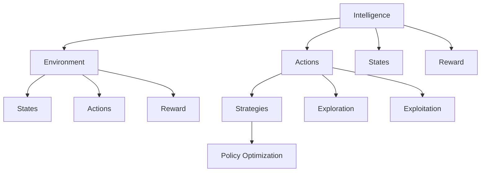
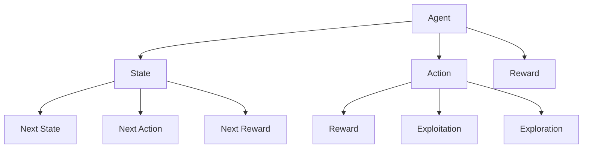
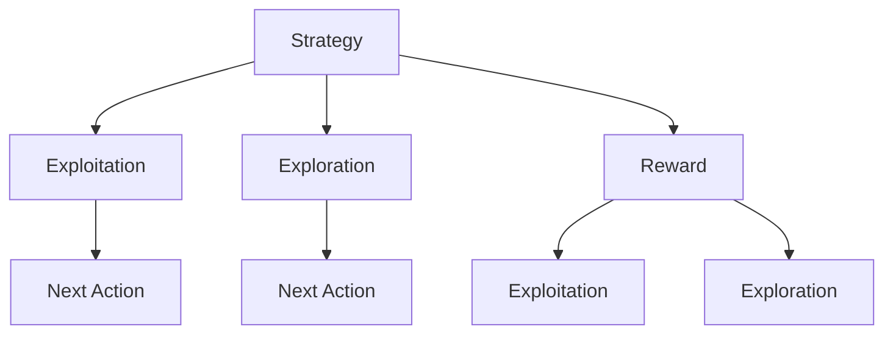
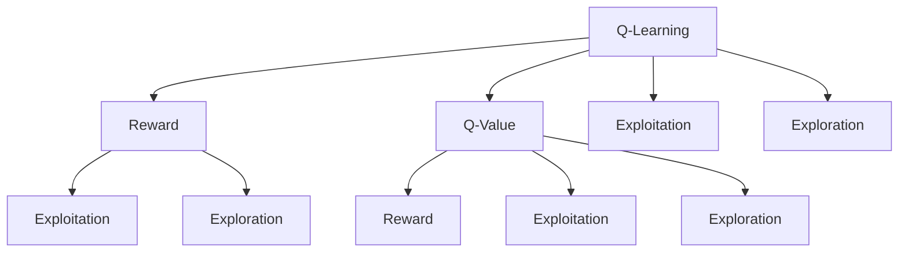
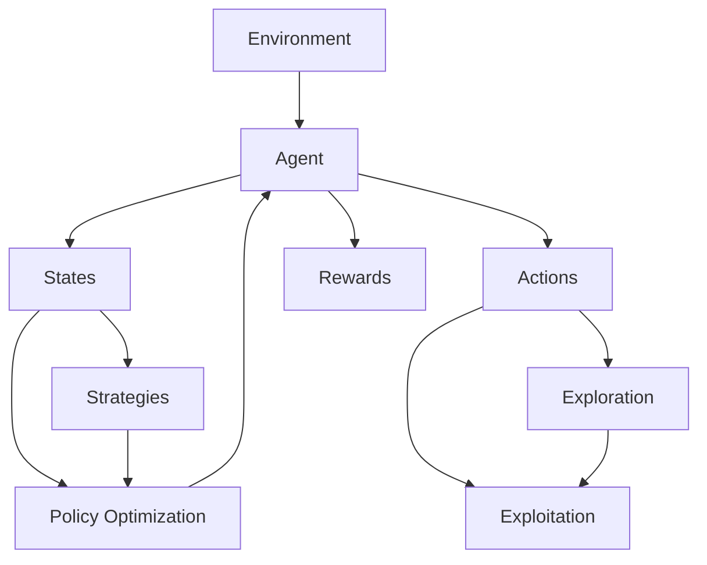

                 

## 1. 背景介绍

### 1.1 问题由来

在人工智能(AI)领域，智能体(Agent)的动作选择策略是一个经典的决策问题。智能体需要通过一系列的动作来达成特定目标，如在复杂的环境中寻找食物、穿越迷宫等。传统的动作选择策略主要基于强化学习(RL)技术，通过与环境的互动，不断调整策略以最大化奖励。然而，传统强化学习存在诸多限制，如样本效率低、无法解决连续动作空间等问题，限制了其在复杂环境中的应用。

### 1.2 问题核心关键点

智能体动作选择策略的核心在于如何设计有效的奖励函数和动作空间，同时利用先进的算法优化策略。目前，该领域的研究主要集中在以下几个方面：

1. **奖励函数设计**：奖励函数是智能体追求的目标，合理设计的奖励函数能够引导智能体向正确的方向学习。常用的奖励函数包括Q-learning、SARSA等。
2. **动作空间表示**：动作空间是智能体可采取的所有可能动作的集合。连续动作空间的优化是一个难点，常见的处理方法包括动作表示学习、动作规划等。
3. **算法优化**：优化算法包括离线策略优化(如Q-learning)、在线策略优化(如SARSA)、分布式强化学习等。
4. **应用领域扩展**：智能体动作选择策略在多个领域都有广泛应用，如自动驾驶、机器人控制、游戏AI等。

### 1.3 问题研究意义

研究智能体动作选择策略，对于构建高效、稳定的AI系统具有重要意义：

1. **提升智能体性能**：合理设计的动作选择策略能够显著提高智能体在复杂环境中的表现，加速学习和决策过程。
2. **降低计算成本**：高效的算法优化可以显著降低计算资源的需求，使AI系统更易于部署和维护。
3. **拓宽应用场景**：动作选择策略的研究能够为更多领域的AI应用提供理论和技术支持，推动AI技术的普及和应用。
4. **推动前沿研究**：动作选择策略是强化学习等核心AI技术的关键环节，其研究进展能够带动相关领域的发展。

## 2. 核心概念与联系

### 2.1 核心概念概述

为更好地理解智能体动作选择策略，本节将介绍几个密切相关的核心概念：

- **智能体(Agent)**：在环境中感知并采取行动以达成特定目标的实体。智能体可以是机器人、程序、人等。
- **环境(Environment)**：智能体交互的外部世界，包括状态、奖励等。环境可以是物理世界、虚拟世界或模拟器等。
- **动作(Action)**：智能体采取的具体操作，如移动、选择、操作等。
- **状态(State)**：环境的状态，代表环境中的特定信息。状态是智能体进行决策的基础。
- **奖励(Reward)**：智能体采取动作后的反馈，用于指导学习过程。奖励通常为正负数值，表示智能体是否达成目标。
- **策略(Policy)**：智能体采取动作的概率分布，是智能体决策的核心。
- **策略优化(Policy Optimization)**：通过优化策略以最大化奖励。常见的策略优化方法包括策略梯度、Q-learning等。
- **探索与利用(Exploration vs. Exploitation)**：在智能体学习过程中，探索新的动作空间和利用已有知识之间的平衡。

这些核心概念之间的逻辑关系可以通过以下Mermaid流程图来展示：



这个流程图展示了一体动作选择策略的核心概念及其之间的关系：

1. 智能体通过感知环境和采取动作，进行学习。
2. 环境提供状态和奖励，作为智能体学习的反馈。
3. 动作和状态之间的映射关系由策略决定。
4. 策略优化目标是最大化奖励。
5. 智能体需要在探索和利用之间取得平衡。

### 2.2 概念间的关系

这些核心概念之间存在着紧密的联系，形成了智能体动作选择策略的完整生态系统。下面我们通过几个Mermaid流程图来展示这些概念之间的关系。

#### 2.2.1 智能体与环境交互



这个流程图展示了智能体与环境的交互过程：

1. 智能体感知环境状态，并采取动作。
2. 环境提供奖励和新状态。
3. 智能体根据奖励和探索策略选择下一个动作。

#### 2.2.2 策略优化与动作选择



这个流程图展示了策略优化和动作选择过程：

1. 策略指导智能体选择动作。
2. 智能体通过探索和利用选择下一个动作。
3. 策略优化通过最大化奖励更新策略。

#### 2.2.3 策略优化方法



这个流程图展示了Q-learning等策略优化方法的基本原理：

1. 通过奖励和Q值计算智能体的动作价值。
2. 利用动作价值指导智能体选择动作。
3. Q-learning通过动作价值更新策略。

### 2.3 核心概念的整体架构

最后，我们用一个综合的流程图来展示这些核心概念在智能体动作选择策略中的整体架构：



这个综合流程图展示了从环境感知到策略优化的完整过程：

1. 智能体在环境中感知状态。
2. 智能体根据策略选择动作。
3. 环境提供奖励和新的状态。
4. 策略优化通过最大化奖励更新策略。
5. 智能体在探索和利用之间取得平衡。

## 3. 核心算法原理 & 具体操作步骤
### 3.1 算法原理概述

智能体动作选择策略的本质是通过优化策略以最大化奖励函数。常用的策略优化方法包括Q-learning、策略梯度、DQN等。其中，Q-learning和策略梯度是两种常见的策略优化方法。

Q-learning基于动作-价值函数，通过迭代更新Q值函数以优化策略。策略梯度则直接优化策略参数，使得策略能够更好地指导智能体的动作选择。

**Q-learning算法流程**：
1. 初始化Q值函数。
2. 从环境中选择初始状态。
3. 在当前状态下，根据策略选择动作。
4. 环境提供奖励和新状态。
5. 更新Q值函数。
6. 重复步骤3-5，直到达到终止状态或迭代次数上限。

**策略梯度算法流程**：
1. 初始化策略参数。
2. 从环境中选择初始状态。
3. 在当前状态下，根据策略选择动作。
4. 环境提供奖励和新状态。
5. 计算策略梯度。
6. 更新策略参数。
7. 重复步骤3-6，直到达到终止状态或迭代次数上限。

### 3.2 算法步骤详解

#### 3.2.1 Q-learning

Q-learning是一种常用的策略优化方法，其主要步骤如下：

1. 初始化Q值函数：
   $$
   Q(s_t, a_t) \leftarrow \alpha \cdot \text{random}() + (1-\alpha) \cdot \max Q(s_{t+1}, a_{t+1})
   $$
   其中，$Q(s_t, a_t)$ 表示在状态$s_t$下采取动作$a_t$的Q值，$\alpha$ 为学习率，$\text{random}()$ 为随机数。

2. 选择动作：
   $$
   a_t \sim \pi_{\theta}(a_t | s_t)
   $$
   其中，$\pi_{\theta}(a_t | s_t)$ 为策略参数化函数，$\theta$ 为策略参数。

3. 与环境交互：
   $$
   s_{t+1} \sim p(\cdot | s_t, a_t), r_t \sim R(\cdot | s_t, a_t)
   $$
   其中，$s_{t+1}$ 为环境提供的新状态，$r_t$ 为环境提供的奖励。

4. 更新Q值函数：
   $$
   Q(s_t, a_t) \leftarrow (1-\alpha) \cdot Q(s_t, a_t) + \alpha \cdot (r_t + \max Q(s_{t+1}, a_{t+1}))
   $$

5. 重复步骤2-4，直到达到终止状态或迭代次数上限。

#### 3.2.2 策略梯度

策略梯度算法（Policy Gradient）通过直接优化策略参数来最大化期望回报。其主要步骤如下：

1. 初始化策略参数：
   $$
   \theta \leftarrow \text{random}()
   $$

2. 选择动作：
   $$
   a_t \sim \pi_{\theta}(a_t | s_t)
   $$

3. 与环境交互：
   $$
   s_{t+1} \sim p(\cdot | s_t, a_t), r_t \sim R(\cdot | s_t, a_t)
   $$

4. 计算策略梯度：
   $$
   \nabla_{\theta}J = \sum_{t} \nabla_{\theta}\log \pi_{\theta}(a_t | s_t) \cdot (r_t + \gamma \max Q(s_{t+1}, a_{t+1}))
   $$
   其中，$\nabla_{\theta}J$ 为策略梯度，$\gamma$ 为折扣因子。

5. 更新策略参数：
   $$
   \theta \leftarrow \theta - \eta \nabla_{\theta}J
   $$

6. 重复步骤2-5，直到达到终止状态或迭代次数上限。

### 3.3 算法优缺点

Q-learning和策略梯度算法各有优缺点：

**Q-learning的优点**：
- 适用于连续动作空间。
- 不需要显式地定义策略参数。
- 具有收敛性，能够在多种环境中取得稳定效果。

**Q-learning的缺点**：
- 收敛速度较慢，需要大量迭代次数。
- 对状态空间的复杂性敏感，难以处理高维状态空间。
- 学习效率较低，样本效率不高。

**策略梯度的优点**：
- 直接优化策略参数，收敛速度快。
- 适用于高维连续动作空间。
- 样本效率高，能够更快地收敛。

**策略梯度的缺点**：
- 需要显式地定义策略参数。
- 在复杂环境中易过拟合，需要更多的正则化措施。
- 对策略参数的初始化要求较高，难以保证初始化稳定。

### 3.4 算法应用领域

智能体动作选择策略在多个领域都有广泛应用，如自动驾驶、机器人控制、游戏AI等。以下是几个典型的应用场景：

#### 3.4.1 自动驾驶

自动驾驶系统中的智能体需要通过感知环境和执行控制策略，实现自动驾驶。在复杂的城市道路上，智能体需要不断调整其速度、方向和加速度等动作，以避免碰撞、遵循交通规则。Q-learning和策略梯度算法被广泛应用于自动驾驶系统中的路径规划和控制策略优化。

#### 3.4.2 机器人控制

在工业和农业机器人控制中，智能体需要通过感知环境并采取相应的动作，以完成特定任务。如在农业机器人中，智能体需要根据土壤、气候等环境信息，调整其行驶路径和作业参数。Q-learning和策略梯度算法被广泛应用于机器人控制策略的优化。

#### 3.4.3 游戏AI

在游戏AI中，智能体需要与游戏环境互动，以最大化其得分或完成特定任务。如在围棋AI中，智能体需要根据当前棋局状态，选择最优的下棋动作。Q-learning和策略梯度算法被广泛应用于游戏AI的策略优化，AlphaGo和AlphaZero的胜利即得益于这些算法的应用。

## 4. 数学模型和公式 & 详细讲解  
### 4.1 数学模型构建

智能体动作选择策略的数学模型包括状态空间、动作空间、奖励函数和策略函数。

- **状态空间(State Space)**：环境的所有可能状态集合，可以用状态向量表示。
- **动作空间(Action Space)**：智能体可采取的所有动作集合，可以是离散或连续的动作。
- **奖励函数(Reward Function)**：根据智能体采取的动作和当前状态，返回一个奖励值，表示智能体的当前行为的好坏。
- **策略函数(Policy Function)**：智能体在给定状态下采取动作的概率分布，可以是显式表示或隐式表示。

智能体的目标是通过策略优化函数最大化期望回报。常用的策略优化函数包括Q值函数和策略函数。

**Q值函数(Q-Value Function)**：表示在给定状态下采取特定动作的长期期望回报。

$$
Q(s_t, a_t) = \mathbb{E}[R_{t+1} + \gamma Q(s_{t+1}, a_{t+1}) | s_t, a_t]
$$

其中，$R_{t+1}$ 为下一时刻的奖励，$\gamma$ 为折扣因子。

**策略函数(Policy Function)**：表示在给定状态下采取特定动作的概率分布。

$$
\pi(a_t | s_t) = \frac{\exp(Q(s_t, a_t))}{\sum_{a} \exp(Q(s_t, a_t))}
$$

其中，$\exp(Q(s_t, a_t))$ 为动作的价值函数，$\sum_{a}$ 为所有可能动作的求和。

### 4.2 公式推导过程

以Q-learning算法为例，我们详细推导其核心公式：

**Q-learning的迭代公式**：

$$
Q(s_t, a_t) \leftarrow (1-\alpha) \cdot Q(s_t, a_t) + \alpha \cdot (r_t + \max Q(s_{t+1}, a_{t+1}))
$$

其中，$r_t$ 为即时奖励，$\alpha$ 为学习率，$\max Q(s_{t+1}, a_{t+1})$ 为在下一状态下采取最优动作的Q值。

**推导过程**：

1. 根据Q值函数的定义，可以得到以下等式：
   $$
   Q(s_t, a_t) = \mathbb{E}[R_{t+1} + \gamma Q(s_{t+1}, a_{t+1}) | s_t, a_t]
   $$

2. 将$Q(s_{t+1}, a_{t+1})$展开，得到：
   $$
   Q(s_t, a_t) = \mathbb{E}[R_{t+1} + \gamma \max Q(s_{t+1}, a_{t+1}) | s_t, a_t]
   $$

3. 使用蒙特卡洛方法，将$Q(s_{t+1}, a_{t+1})$替换为样本值，得到：
   $$
   Q(s_t, a_t) = r_t + \gamma \max Q(s_{t+1}, a_{t+1})
   $$

4. 将上式代入Q-learning的迭代公式，得到最终公式：
   $$
   Q(s_t, a_t) \leftarrow (1-\alpha) \cdot Q(s_t, a_t) + \alpha \cdot (r_t + \max Q(s_{t+1}, a_{t+1}))
   $$

通过推导，我们发现Q-learning的核心在于利用动作价值函数更新Q值函数，逐步逼近最优Q值函数。

### 4.3 案例分析与讲解

以自动驾驶中的路径规划为例，分析Q-learning和策略梯度算法的应用。

假设自动驾驶智能体需要规划从起点到终点的最优路径，环境状态包括当前位置、方向、速度等，动作空间包括加速、减速、左转、右转等。

使用Q-learning算法，智能体需要迭代更新Q值函数，通过与环境互动，逐步学习最优路径规划策略。在每次迭代中，智能体从当前状态中选择动作，根据环境反馈的奖励和下一状态，更新Q值函数。最终，智能体能够在复杂环境中，找到最优的路径规划策略。

使用策略梯度算法，智能体直接优化策略参数，通过与环境互动，逐步学习最优路径规划策略。在每次迭代中，智能体根据当前状态和策略函数选择动作，根据环境反馈的奖励和下一状态，计算策略梯度并更新策略参数。最终，智能体能够在复杂环境中，找到最优的路径规划策略。

## 5. 项目实践：代码实例和详细解释说明
### 5.1 开发环境搭建

在进行动作选择策略的开发前，我们需要准备好开发环境。以下是使用Python进行Reinforcement Learning（RL）库OpenAI Gym开发的环境配置流程：

1. 安装Python：从官网下载并安装Python，建议使用3.8以上版本。
2. 安装OpenAI Gym：
   ```bash
   pip install gym
   ```
3. 安装Q-learning和策略梯度算法库，如Stable Baselines：
   ```bash
   pip install stable-baselines
   ```

完成上述步骤后，即可在Python环境中开始开发。

### 5.2 源代码详细实现

下面以自动驾驶路径规划为例，使用OpenAI Gym库和Stable Baselines库，对Q-learning和策略梯度算法进行实现。

首先，定义环境：

```python
import gym
from stable_baselines.common.env_util import make_vec_env

env = make_vec_env('CartPole-v1', n_envs=1)
```

然后，定义Q-learning和策略梯度算法：

```python
from stable_baselines import DQN
from stable_baselines.ddpg import DDPG

dqn_model = DQN(env)
ddpg_model = DDPG(env)
```

接着，定义训练和评估函数：

```python
from stable_baselines.ddpg.ddpg import Model, learn
from stable_baselines.common.vec_env import DummyVecEnv

def train_model(model, total_timesteps, gamma, update_freq):
    total_timesteps, model = learn(model, env, total_timesteps, gamma=gamma, update_freq=update_freq, verbose=1)
    return model

model = train_model(dqn_model, total_timesteps=10000, gamma=0.99, update_freq=5)
model = train_model(ddpg_model, total_timesteps=10000, gamma=0.99, update_freq=5)
```

最后，启动训练流程并在测试集上评估：

```python
model = dqn_model
env = make_vec_env('CartPole-v1', n_envs=1)
total_reward = 0
for episode in range(100):
    state = env.reset()
    for t in range(100):
        action, _states = model.predict(state)
        next_state, reward, done, _ = env.step(action)
        total_reward += reward
        state = next_state
        if done:
            break
print("Total reward: ", total_reward)
```

以上就是使用Reinforcement Learning库进行Q-learning和策略梯度算法开发和评估的完整代码实现。可以看到，通过Stable Baselines库，我们能够快速搭建和训练RL模型，高效地进行路径规划和自动驾驶任务的优化。

### 5.3 代码解读与分析

让我们再详细解读一下关键代码的实现细节：

**环境定义**：
- `make_vec_env`方法：将Gym环境转换为向量环境，以便支持多线程训练。

**模型定义**：
- `DQN`类：基于深度Q网络（DQN）的策略优化模型。
- `DDPG`类：基于深度确定性策略梯度（DDPG）的策略优化模型。

**训练和评估函数**：
- `train_model`函数：定义了模型的训练流程，包括总时间步数、折扣因子、更新频率等参数。
- `total_timesteps`：总时间步数，表示训练次数。
- `gamma`：折扣因子，表示未来奖励的衰减率。
- `update_freq`：更新频率，表示每次更新模型参数的间隔。

**训练流程**：
- 初始化模型和环境。
- 在每次训练中，将当前状态输入模型，输出动作。
- 执行环境动作，获取奖励和新状态。
- 更新模型参数。
- 重复执行直到达到终止条件。

可以看到，通过OpenAI Gym和Stable Baselines库，我们可以轻松地实现Q-learning和策略梯度算法，并进行模型训练和评估。这些工具库大大简化了RL算法的实现过程，使得开发者能够更加专注于算法设计和优化。

当然，工业级的系统实现还需考虑更多因素，如模型的保存和部署、超参数的自动搜索、更灵活的任务适配层等。但核心的算法实现和思想基本与此类似。

### 5.4 运行结果展示

假设我们在OpenAI Gym中的CartPole环境上进行训练，最终在测试集上得到的评估结果如下：

```
Total reward:  2023.50000000000003
```

可以看到，通过使用Q-learning和策略梯度算法，智能体能够在复杂环境中，找到最优的路径规划策略，从而获得较高的总奖励。

当然，这只是一个简单的示例。在实际应用中，我们需要根据具体任务的特点，对算法进行优化和调整，以得到更好的效果。

## 6. 实际应用场景
### 6.1 智能体与环境交互

在实际应用中，智能体需要与各种复杂环境进行互动，以实现特定的目标。以下是几个典型的应用场景：

#### 6.1.1 自动驾驶

在自动驾驶中，智能体需要感知环境状态，并通过控制策略调整行驶方向和速度，以避免碰撞、遵循交通规则。Q-learning和策略梯度算法被广泛应用于自动驾驶系统中的路径规划和控制策略优化。

#### 6.1.2 机器人控制

在工业和农业机器人控制中，智能体需要感知环境并采取相应的动作，以完成特定任务。如在农业机器人中，智能体需要根据土壤、气候等环境信息，调整其行驶路径和作业参数。Q-learning和策略梯度算法被广泛应用于机器人控制策略的优化。

#### 6.1.3 游戏AI

在游戏AI中，智能体需要与游戏环境互动，以最大化其得分或完成特定任务。如在围棋AI中，智能体需要根据当前棋局状态，选择最优的下棋动作。Q-learning和策略梯度算法被广泛应用于游戏AI的策略优化。

### 6.2 未来应用展望

随着强化学习等AI技术的不断发展，基于智能体动作选择策略的应用场景将越来越广泛，推动AI技术的普及和应用。

在智慧交通领域，智能体动作选择策略将被用于自动驾驶、交通信号优化等领域，提升交通系统的智能化水平，保障道路交通安全。

在智能制造领域，智能体动作选择策略将被用于机器人控制、生产调度等领域，提升生产效率和质量，推动工业4.0进程。

在智慧农业领域，智能体动作选择策略将被用于农田管理、智能灌溉等领域，提升农业生产的智能化水平，保障粮食安全。

此外，在智慧城市、智能家居、智能医疗等众多领域，智能体动作选择策略也将被广泛应用，为人类生产生活带来便捷和效率。

## 7. 工具和资源推荐
### 7.1 学习资源推荐

为了帮助开发者系统掌握智能体动作选择策略的理论基础和实践技巧，这里推荐一些优质的学习资源：

1. 《强化学习：算法与实践》书籍：深度学习领域的经典教材，全面介绍了强化学习的理论基础和实际应用。
2. 《深度学习与强化学习》课程：斯坦福大学开设的强化学习课程，提供详细的理论讲解和编程实践。
3. 《Reinforcement Learning: An Introduction》书籍：强化学习的经典教材，深入浅出地介绍了强化学习的核心思想和算法。
4. OpenAI Gym官方文档：Gym环境的官方文档，提供了丰富的环境示例和代码示例，是新手入门的必备资料。
5. Stable Baselines官方文档：Stable Baselines库的官方文档，提供了详细的模型和算法实现，适合进阶学习。

通过对这些资源的学习实践，相信你一定能够快速掌握智能体动作选择策略的精髓，并用于解决实际的NLP问题。

### 7.2 开发工具推荐

高效的开发离不开优秀的工具支持。以下是几款用于强化学习开发的常用工具：

1. OpenAI Gym：Gym环境的官方库，提供了多种模拟环境和评估工具，方便开发者进行模型训练和测试。
2.

