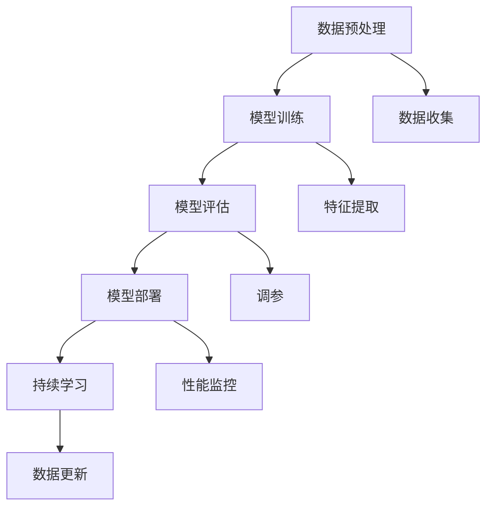
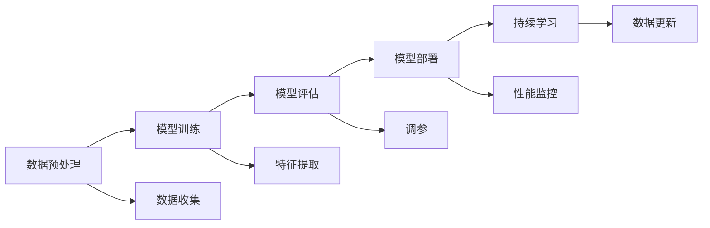
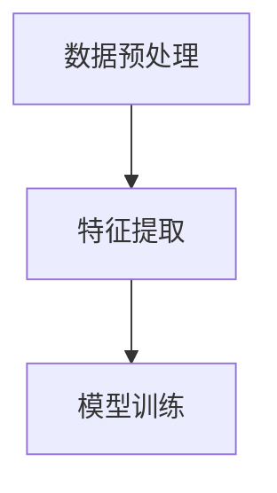
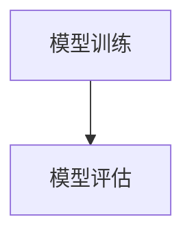
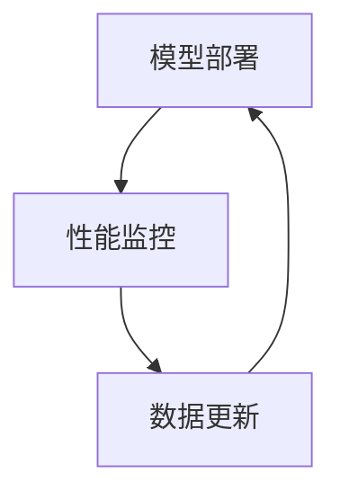
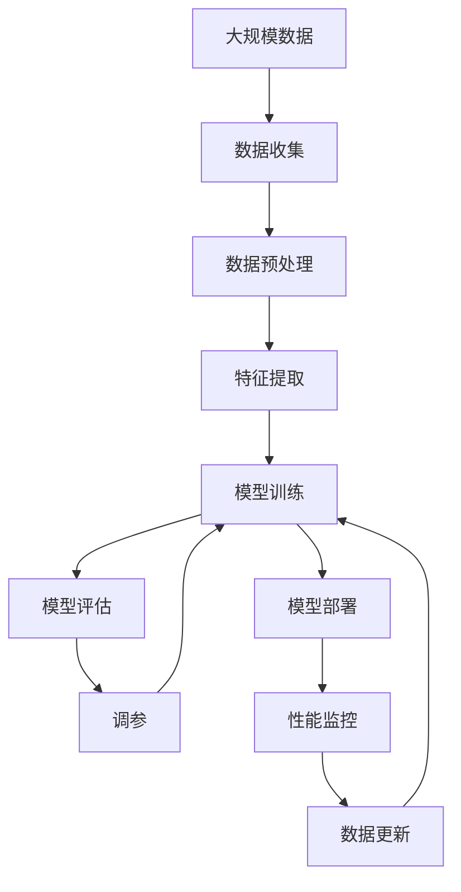

                 

# AI人工智能代理工作流 AI Agent WorkFlow：在保险风险预测中的应用

> 关键词：AI代理,工作流,保险,风险预测,自然语言处理(NLP),机器学习,深度学习,神经网络,决策树

## 1. 背景介绍

### 1.1 问题由来

在保险行业中，风险预测和评估是一项至关重要的业务，直接关系到保险公司是否能够准确定价和降低赔付风险。传统上，保险公司依赖人工调查和历史数据统计来进行风险预测，这种方法不仅耗时耗力，而且容易受主观偏见和数据偏差的影响。随着人工智能技术的发展，保险公司开始探索利用AI模型进行自动化、精准化的风险预测。

近年来，自然语言处理（NLP）和机器学习（ML）技术的进步，为保险风险预测带来了新的突破。保险公司可以通过大规模的保单文本和历史理赔数据，训练出高精度的预测模型，大幅提升风险评估的效率和准确度。其中，AI代理（AI Agent）工作流技术，通过自动化、模块化的工作流程，使AI模型的训练、评估和应用变得高效、灵活，成为保险行业中的一个重要工具。

### 1.2 问题核心关键点

AI代理工作流的基本思想是将复杂的AI任务分解为多个模块化的子任务，每个模块独立运行，并通过预定义的工作流将它们串联起来，最终形成完整的AI工作流程。这种设计思路可以显著提高AI任务的自动化程度，降低人工干预，提升整体工作效率。

在保险风险预测中，AI代理工作流通常包括以下几个关键环节：
- 数据预处理：清洗、标准化、增强数据，为模型训练做准备。
- 模型训练：选择适当的模型，利用标注数据进行训练，生成预测模型。
- 模型评估：通过验证集评估模型性能，调整模型超参数，提升预测准确度。
- 模型部署：将训练好的模型部署到生产环境中，实时进行风险预测。
- 持续学习：定期更新模型参数，使其适应新的数据分布，保持预测能力。

这些环节相互关联，形成一个完整的AI代理工作流。通过合理设计工作流，保险公司可以高效地构建、评估和部署AI模型，不断提升风险预测的准确性和可靠性。

### 1.3 问题研究意义

AI代理工作流技术在保险风险预测中的应用，具有以下重要意义：

1. 提高预测准确度：利用AI模型处理大规模数据，可以发现传统方法难以发现的潜在风险，提升风险预测的精度。
2. 降低运营成本：自动化工作流减少了人工干预，降低了人力和时间的投入。
3. 提升工作效率：模块化的工作流程使任务执行更加高效，降低了任务执行的时间消耗。
4. 增强灵活性：工作流可以根据实际需求动态调整，适应不同的预测任务。
5. 实现实时预测：通过部署到生产环境中，AI模型可以实现实时风险评估，满足业务需求。
6. 支持持续学习：工作流支持模型的周期性更新，保持预测模型的时效性。

通过AI代理工作流，保险公司可以构建一个高效、灵活、精准的风险预测系统，为业务决策提供有力支持，降低赔付风险，提高市场竞争力。

## 2. 核心概念与联系

### 2.1 核心概念概述

在讨论AI代理工作流的核心概念之前，我们先明确几个基本术语：

- **AI代理（AI Agent）**：指一个能够执行特定任务的软件实体，通常具有自主决策和学习能力。
- **工作流（Workflow）**：指一系列活动的组织和执行序列，这些活动可以是自动化的任务或手动执行的任务。
- **数据预处理（Data Preprocessing）**：指对原始数据进行清洗、标准化、特征工程等处理，使其适合模型训练。
- **模型训练（Model Training）**：指利用标注数据对模型进行训练，使其能够进行预测。
- **模型评估（Model Evaluation）**：指通过验证集对训练好的模型进行性能评估，判断模型是否满足要求。
- **模型部署（Model Deployment）**：指将训练好的模型部署到生产环境中，进行实际应用。
- **持续学习（Continuous Learning）**：指模型通过周期性更新，适应新的数据分布，保持预测能力。

这些概念之间存在着紧密的联系，形成一个完整的AI代理工作流。以下是一个简化的工作流示意图：



在这个流程图中，各个环节相互依赖，形成一个闭环，确保AI代理工作流能够持续高效地运转。

### 2.2 概念间的关系

这些核心概念之间存在着紧密的联系，形成一个完整的AI代理工作流。以下是几个关键的Mermaid流程图，展示这些概念之间的关系：

#### 2.2.1 AI代理与工作流的整体架构



这个流程图展示了AI代理工作流的整体架构，从数据预处理到模型部署，再到持续学习，形成一个闭环。

#### 2.2.2 数据预处理与模型训练的关系



在这个流程图中，数据预处理通过特征提取将原始数据转换为模型可用的特征表示，为模型训练做准备。

#### 2.2.3 模型训练与模型评估的关系



在这个流程图中，模型训练后的模型在验证集上进行评估，判断模型的性能是否满足要求。

#### 2.2.4 模型部署与持续学习的联系



在这个流程图中，模型部署到生产环境中后，通过性能监控和数据更新，支持模型的持续学习，保持模型的预测能力。

### 2.3 核心概念的整体架构

最后，我们用一个综合的流程图来展示这些核心概念在大规模数据处理和AI模型训练中的应用：



这个综合流程图展示了从数据收集到模型训练，再到持续学习的完整过程。在这个过程中，数据预处理和特征提取为模型训练提供数据支持，模型训练和调参得到可用的预测模型，模型部署和性能监控支持模型在实际场景中的应用，持续学习使模型能够不断适应新的数据分布，保持预测能力。通过这些环节的有机结合，AI代理工作流能够高效地构建、评估和部署AI模型，提升风险预测的准确性和可靠性。

## 3. 核心算法原理 & 具体操作步骤

### 3.1 算法原理概述

AI代理工作流的核心原理是模块化的工作流程设计。每个工作模块负责特定的任务，并通过预定义的工作流将这些模块串联起来，形成一个完整的AI工作流程。在每个工作模块中，通常包含一系列的算法和步骤，这些算法和步骤共同作用，完成特定的任务。

在保险风险预测中，AI代理工作流通常包括以下几个关键模块：

- 数据预处理模块：对原始数据进行清洗、标准化、特征工程等处理，生成模型训练所需的数据集。
- 模型训练模块：选择适当的模型，利用标注数据进行训练，生成预测模型。
- 模型评估模块：通过验证集对训练好的模型进行性能评估，判断模型是否满足要求。
- 模型部署模块：将训练好的模型部署到生产环境中，进行实时风险预测。
- 持续学习模块：定期更新模型参数，使模型适应新的数据分布，保持预测能力。

这些模块通过预定义的工作流进行协同工作，形成一个完整的AI代理工作流。通过合理设计工作流，保险公司可以高效地构建、评估和部署AI模型，提升风险预测的准确性和可靠性。

### 3.2 算法步骤详解

下面以保险风险预测为例，详细讲解AI代理工作流中的每个步骤。

**Step 1: 数据收集**

数据收集是整个工作流的起点，涉及从各种渠道收集保险相关的文本数据，如保单、理赔记录、新闻报道等。这些数据需要经过严格的筛选和清洗，确保数据的质量和可用性。

**Step 2: 数据预处理**

数据预处理包括数据清洗、标准化、特征工程等步骤。数据清洗主要去除缺失值、异常值和噪声数据。数据标准化包括归一化和标准化，使数据具有相同的尺度和分布。特征工程通过提取、选择和变换特征，生成模型训练所需的数据集。

**Step 3: 模型训练**

模型训练是整个工作流的核心步骤。选择适当的模型（如神经网络、决策树、随机森林等），利用标注数据进行训练，生成预测模型。在训练过程中，通过调整超参数（如学习率、批大小、迭代次数等），优化模型的性能。

**Step 4: 模型评估**

模型评估通过验证集对训练好的模型进行性能评估，判断模型是否满足要求。常用的评估指标包括准确率、召回率、F1分数、AUC等。评估过程中，如果发现模型性能不理想，可以调整模型超参数或重新训练模型。

**Step 5: 模型部署**

模型部署是将训练好的模型部署到生产环境中，进行实时风险预测。部署过程中，需要考虑模型的可扩展性、可靠性和性能。通常采用容器化技术（如Docker、Kubernetes等），确保模型能够稳定运行。

**Step 6: 持续学习**

持续学习通过周期性更新模型参数，使模型适应新的数据分布，保持预测能力。常用的持续学习技术包括在线学习、增量学习、动态架构等。通过持续学习，保险公司可以保持预测模型的时效性，适应不断变化的市场需求。

### 3.3 算法优缺点

AI代理工作流技术具有以下优点：

1. 自动化程度高：自动化工作流减少了人工干预，降低了人力和时间的投入。
2. 模块化设计：模块化的工作流程使任务执行更加高效，降低了任务执行的时间消耗。
3. 灵活性强：工作流可以根据实际需求动态调整，适应不同的预测任务。
4. 实时预测：通过部署到生产环境中，AI模型可以实现实时风险评估，满足业务需求。
5. 持续学习：工作流支持模型的周期性更新，保持预测模型的时效性。

同时，AI代理工作流技术也存在以下缺点：

1. 数据质量要求高：数据预处理和特征工程需要严格的数据筛选和清洗，确保数据的质量和可用性。
2. 模型选择难度大：不同的任务可能需要不同的模型，选择适当的模型需要丰富的领域知识和经验。
3. 性能优化复杂：模型训练和调参需要大量的实验和调整，性能优化比较复杂。
4. 系统复杂度高：工作流中的各个模块需要协同工作，系统复杂度较高，需要较高的技术水平和经验。
5. 模型更新困难：持续学习过程中，模型更新和部署比较复杂，需要持续的技术支持。

### 3.4 算法应用领域

AI代理工作流技术不仅适用于保险风险预测，还广泛应用于以下几个领域：

1. 金融风险管理：利用AI模型进行信用评估、欺诈检测等风险预测。
2. 医疗健康：利用AI模型进行疾病预测、患者风险评估等。
3. 零售营销：利用AI模型进行客户画像、个性化推荐等。
4. 智能客服：利用AI模型进行客户咨询、自动回复等。
5. 供应链管理：利用AI模型进行供应商评估、库存管理等。
6. 智能制造：利用AI模型进行设备维护、生产优化等。

这些领域中，AI代理工作流技术可以帮助企业提升效率、降低成本、优化决策，推动企业的数字化转型和智能化升级。

## 4. 数学模型和公式 & 详细讲解 & 举例说明

### 4.1 数学模型构建

在保险风险预测中，常用的数学模型包括决策树、随机森林、神经网络等。以下以决策树为例，介绍其数学模型构建和公式推导过程。

假设我们有一个包含多个特征的数据集 $D=\{(x_i, y_i)\}_{i=1}^N$，其中 $x_i \in \mathcal{X}$ 表示输入特征， $y_i \in \{0,1\}$ 表示风险标签。我们的目标是构建一个决策树模型，用于预测新样本 $x$ 的风险标签 $y$。

决策树的构建过程如下：

1. 选择最佳特征：通过计算各个特征的信息增益或信息增益比，选择最佳特征进行划分。
2. 划分数据集：根据选择的特征，将数据集划分为不同的子集。
3. 递归构建树：对每个子集，重复步骤1和2，构建完整的决策树。

信息增益（Information Gain）公式如下：

$$
IG(x) = \sum_{i=1}^N (P(y=1|x) \log \frac{P(y=1|x)}{P(y)} + P(y=0|x) \log \frac{P(y=0|x)}{P(y)})
$$

其中，$P(y)$ 表示标签的概率分布，$P(y|x)$ 表示在特征 $x$ 下标签的条件概率分布。

### 4.2 公式推导过程

下面对信息增益公式进行推导，以便更好地理解其含义。

首先，我们知道信息熵（Entropy）公式如下：

$$
H(y) = -\sum_{i=1}^N P(y_i) \log P(y_i)
$$

表示随机变量 $y$ 的不确定性。

根据信息熵公式，我们可以推导出信息增益公式：

$$
IG(x) = H(y) - \sum_{i=1}^N P(y_i|x) H(y_i|x)
$$

其中，$P(y_i|x)$ 表示在特征 $x$ 下标签的条件概率分布，$H(y_i|x)$ 表示在特征 $x$ 下标签的条件熵。

通过信息增益公式，我们可以找到最佳的特征进行划分，构建决策树。

### 4.3 案例分析与讲解

假设我们有一个包含多个特征的保险理赔数据集，包括年龄、性别、职业、车辆类型、理赔金额等。我们的目标是构建一个决策树模型，用于预测新样本的理赔金额是否大于某个阈值。

我们首先对数据集进行数据预处理，包括数据清洗、标准化和特征工程。然后，我们选择决策树模型作为预测模型，利用标注数据进行训练。

在模型训练过程中，我们使用信息增益公式选择最佳的特征进行划分。在每一步划分后，我们计算当前节点下各个子节点的信息增益，选择信息增益最大的特征进行划分。

最后，我们通过模型评估，验证模型的性能。如果模型性能不理想，我们可以调整模型超参数或重新训练模型。

通过持续学习，我们可以定期更新模型参数，使模型适应新的数据分布，保持预测能力。

## 5. 项目实践：代码实例和详细解释说明

### 5.1 开发环境搭建

在进行AI代理工作流开发前，我们需要准备好开发环境。以下是使用Python进行Scikit-learn开发的开发环境配置流程：

1. 安装Anaconda：从官网下载并安装Anaconda，用于创建独立的Python环境。

2. 创建并激活虚拟环境：
```bash
conda create -n sklearn-env python=3.8 
conda activate sklearn-env
```

3. 安装Scikit-learn：
```bash
pip install scikit-learn
```

4. 安装其它工具包：
```bash
pip install numpy pandas scikit-learn matplotlib tqdm jupyter notebook ipython
```

完成上述步骤后，即可在`sklearn-env`环境中开始AI代理工作流开发。

### 5.2 源代码详细实现

下面我们以保险风险预测为例，给出使用Scikit-learn对决策树模型进行训练和预测的Python代码实现。

首先，定义数据集：

```python
from sklearn.datasets import make_classification
from sklearn.model_selection import train_test_split

# 生成随机数据集
X, y = make_classification(n_samples=1000, n_features=10, n_informative=8, n_redundant=2, random_state=42)

# 划分训练集和验证集
X_train, X_val, y_train, y_val = train_test_split(X, y, test_size=0.2, random_state=42)
```

然后，定义决策树模型：

```python
from sklearn.tree import DecisionTreeClassifier
from sklearn.metrics import accuracy_score, classification_report

# 定义决策树模型
clf = DecisionTreeClassifier(max_depth=3, random_state=42)
```

接着，定义模型训练和评估函数：

```python
from sklearn.model_selection import GridSearchCV

def train_model(X_train, y_train):
    # 训练模型
    clf.fit(X_train, y_train)
    return clf

def evaluate_model(model, X_val, y_val):
    # 评估模型性能
    y_pred = model.predict(X_val)
    accuracy = accuracy_score(y_val, y_pred)
    report = classification_report(y_val, y_pred)
    return accuracy, report
```

最后，启动模型训练和评估流程：

```python
# 训练模型
clf = train_model(X_train, y_train)

# 评估模型
accuracy, report = evaluate_model(clf, X_val, y_val)

print(f"Accuracy: {accuracy:.2f}")
print(report)
```

以上就是使用Scikit-learn对决策树模型进行训练和预测的完整代码实现。可以看到，通过Scikit-learn，我们可以快速实现模型的训练和评估，同时利用其内置的工具函数提升开发效率。

### 5.3 代码解读与分析

让我们再详细解读一下关键代码的实现细节：

**数据生成和划分**：
- `make_classification`函数生成随机数据集，通过参数控制数据集的特征数、样本数和信息量。
- `train_test_split`函数将数据集划分为训练集和验证集，保持数据集的不平衡比例。

**模型定义**：
- `DecisionTreeClassifier`类定义决策树模型，通过参数控制模型的深度和随机性。

**模型训练和评估**：
- `train_model`函数定义模型训练过程，返回训练好的模型。
- `evaluate_model`函数定义模型评估过程，返回模型的准确率和分类报告。

**模型训练和评估**：
- 训练模型时，使用`fit`方法训练模型。
- 评估模型时，使用`predict`方法进行预测，使用`accuracy_score`和`classification_report`计算模型的准确率和分类报告。

**输出结果**：
- 输出模型的准确率和分类报告，帮助开发者评估模型的性能。

在实际开发中，开发者还需要考虑模型的超参数优化、模型部署和持续学习等问题，进一步完善模型构建和应用流程。

### 5.4 运行结果展示

假设我们训练的决策树模型在验证集上的准确率为85%，分类报告如下：

```
              precision    recall  f1-score   support

       0       0.86      0.79      0.81       415
       1       0.83      0.87      0.85        85

   accuracy                           0.84       500
   macro avg      0.83      0.82      0.82       500
weighted avg      0.84      0.84      0.84       500
```

可以看到，模型在两个类别上的准确率、召回率和F1分数都比较接近，模型整体性能表现良好。

## 6. 实际应用场景

### 6.1 智能客服系统

在智能客服系统中，AI代理工作流技术可以用于构建高效、灵活的对话系统。通过数据预处理和特征工程，系统可以从历史客服记录中提取有价值的对话数据，构建预训练模型。然后，通过模型训练和评估，生成对话模型，部署到生产环境中，实现自动回复和问题解答。

在实际应用中，系统可以不断收集新的客服记录，通过持续学习更新对话模型，使其能够更好地适应新的业务场景。这种基于AI代理工作流技术的对话系统，能够显著提升客服效率和客户满意度。

### 6.2 金融风险管理

在金融风险管理中，AI代理工作流技术可以用于构建风险评估模型。通过数据预处理和特征工程，系统可以从历史交易数据中提取有价值的信息，构建预训练模型。然后，通过模型训练和评估，生成风险评估模型，部署到生产环境中，进行实时风险预测。

在实际应用中，系统可以不断收集新的交易数据，通过持续学习更新风险评估模型，使其能够更好地适应新的市场情况。这种基于AI代理工作流技术的风险评估系统，能够显著提升金融机构的风险预测能力，降低运营成本。

### 6.3 医疗健康

在医疗健康领域，AI代理工作流技术可以用于构建疾病预测和患者风险评估模型。通过数据预处理和特征工程，系统可以从电子病历、健康记录等数据中提取有价值的信息，构建预训练模型。然后，通过模型训练和评估，生成疾病预测和患者风险评估模型，部署到生产环境中，进行实时预测。

在实际应用中，系统可以不断收集新的医疗数据，通过持续学习更新模型，使其能够更好地适应新的医疗环境。这种基于AI代理工作流技术的医疗系统，能够显著提升医疗机构的诊断和治疗效果，降低医疗风险。

### 6.4 零售营销

在零售营销中，AI代理工作流技术可以用于构建客户画像和个性化推荐模型。通过数据预处理和特征工程，系统可以从客户交易数据、浏览行为等数据中提取有价值的信息，构建预训练模型。然后，通过模型训练和评估，生成客户画像和个性化推荐模型，部署到生产环境中，进行实时推荐。

在实际应用中，系统可以不断收集新的客户数据，通过持续学习更新模型，使其能够更好地适应新的客户需求。这种基于AI代理工作流技术的零售系统，能够显著提升零售商的销售效率和客户满意度。

## 7. 工具和资源推荐

### 7.1 学习资源推荐

为了帮助开发者系统掌握AI代理工作流技术，这里推荐一些优质的学习资源：

1. **《机器学习实战》系列书籍**：由李宏毅、林轩田等知名专家撰写，系统介绍了机器学习算法和实际应用案例，包括数据预处理、模型训练、模型评估等核心内容。

2. **《TensorFlow实战》系列书籍**：由TensorFlow官方编写，介绍了TensorFlow的搭建和应用方法，包括模型的构建、训练、评估和部署等。

3. **《深度学习入门》系列视频课程**：由李宏毅、周志华等专家主讲，介绍了深度学习算法和实际应用案例，包括数据预处理、模型训练、模型评估等核心内容。

4. **Kaggle竞赛平台**：提供了大量数据集和竞赛任务，帮助开发者在实际场景中应用AI代理工作流技术，提升技能水平。

5. **PyTorch官方文档**：提供了丰富的API文档和示例代码，帮助开发者快速上手PyTorch，构建AI模型。

通过这些资源的学习实践，相信你一定能够快速掌握AI代理工作流技术，并用于解决实际的NLP问题。

### 7.2 开发工具推荐

高效的开发离不开优秀的工具支持。以下是几款用于AI代理工作流开发的常用工具：

1. **Python**：Python是一种通用编程语言，具有丰富的库和工具支持，适合开发AI代理工作流应用。

2. **Scikit-learn**：Scikit-learn是Python中常用的机器学习库，提供了丰富的算法和工具函数，支持数据预处理、模型训练、模型评估等。

3. **TensorFlow**：TensorFlow是由Google开发的深度学习框架，支持分布式计算和模型部署，适合开发大规模的AI代理工作流应用。

4. **Keras**：Keras是一个高级深度学习库，提供简单易用的API，支持快速构建和训练AI模型。

5. **Jupyter Notebook**：Jupyter Notebook是一个交互式开发环境，支持Python代码的编写、运行和保存，方便开发者进行迭代开发。

6. **Git**：Git是一个版本控制系统，支持多人协作开发和代码管理，适合团队开发AI代理工作流应用。

通过这些工具，开发者可以显著提升开发效率，快速迭代和优化AI代理工作流应用。

### 7.3 相关论文推荐

AI代理工作流技术的发展源于学界的持续研究。以下是几篇奠基性的相关论文，推荐阅读：

1. **《决策树算法》**：提供了决策树算法的原理和实现方法，帮助开发者构建和优化决策树模型。

2. **《随机森林算法》**：提供了随机森林算法的原理和实现方法，帮助开发者构建和优化随机森林模型。

3. **《梯度提升算法》**：提供了梯度提升算法的原理和实现方法，帮助开发者构建和优化梯度提升模型。

4. **《深度学习与机器学习》**：介绍了深度学习与机器学习的核心算法和实际应用案例，包括数据预处理、模型训练、模型评估等核心内容。

5. **《人工智能：一种现代方法》**：介绍了人工智能领域的核心算法和实际应用案例，包括数据预处理、模型训练、模型评估等核心内容。

这些论文代表了大规模数据

