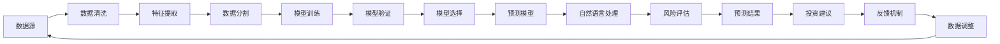

                 

# AI人工智能代理工作流 AI Agent WorkFlow：在股票市场预测中的应用

## 1. 背景介绍

### 1.1 问题由来
随着金融市场的高速发展，股票市场的预测和分析成为了投资决策中极其重要的一环。传统的人工预测方式需要耗费大量的时间和精力，且受限于人类个体经验和知识。而人工智能代理工作流（AI Agent Workflow）的引入，为股票市场预测带来了新的可能性。通过整合大数据分析、机器学习、自然语言处理等多种技术，AI Agent Workflow能够自主学习历史数据，发现市场趋势和规律，辅助投资者做出更为科学的决策。

### 1.2 问题核心关键点
AI Agent Workflow的核心思想在于通过构建一个自主学习的系统，自动化地从海量数据中提取信息、分析数据、预测未来走势。其关键点包括：
- **数据处理与特征工程**：通过算法对原始数据进行清洗、转换，提取有用的特征。
- **模型训练与优化**：基于历史数据训练机器学习模型，并根据实际情况调整模型参数。
- **自然语言处理**：从新闻、公告、报告等文本数据中提取有用信息。
- **风险管理**：对市场风险进行评估和预测，提供风险预警。

### 1.3 问题研究意义
AI Agent Workflow的应用不仅能提高股票市场预测的准确性，还能大幅减少人为判断的误差，提升投资决策的科学性和可靠性。其研究意义体现在以下几个方面：
1. **降低成本**：减少分析师工作量，降低公司人力成本。
2. **提高效率**：快速准确地分析市场动态，提供实时的投资建议。
3. **增强决策科学性**：利用大数据分析，提升决策依据的客观性和科学性。
4. **支持量化投资**：为量化交易策略的构建提供数据和模型支持。
5. **增强风险管理能力**：预测市场波动，提前采取风险控制措施。

## 2. 核心概念与联系

### 2.1 核心概念概述
AI Agent Workflow涉及多个关键概念，包括但不限于以下几项：

- **人工智能代理（AI Agent）**：能够自主学习和决策的智能系统，集成多种人工智能技术，如机器学习、深度学习、自然语言处理等。
- **工作流（Workflow）**：定义了系统的运行流程，从数据收集到模型训练，再到结果输出，整个流程通过工作流管理，保证了系统的稳定性和可复现性。
- **数据处理**：对原始数据进行清洗、转换、特征工程等预处理，提取有用的信息。
- **模型训练**：基于历史数据训练模型，并通过验证集进行优化。
- **自然语言处理（NLP）**：从文本数据中提取实体、情感、事件等，提供对市场的深度洞察。
- **风险管理**：通过分析市场波动和风险因素，提供预警和风险控制建议。

这些核心概念通过紧密的联系，构成了AI Agent Workflow的基础。以下是一个合成的Mermaid流程图，展示了各概念之间的联系：

```mermaid
graph LR
    A[人工智能代理(AI Agent)] --> B[数据处理]
    A --> C[模型训练]
    B --> D[自然语言处理(NLP)]
    C --> D
    D --> E[风险管理]
    E --> F[预测输出]
```

### 2.2 概念间的关系
通过上述流程图的展示，我们可以进一步分析各概念之间的关系：

- **数据处理**：是AI Agent Workflow的起点，为模型的训练提供基础数据。
- **模型训练**：在处理后的数据上进行，通过训练得到能够预测市场走势的模型。
- **自然语言处理**：从文本数据中提取信息，辅助模型理解市场动态。
- **风险管理**：在预测结果的基础上，评估和控制市场风险。
- **预测输出**：通过整合模型预测结果和风险评估，生成投资建议。

这些概念通过工作流连接起来，共同构成了一个完整的AI Agent Workflow系统。

### 2.3 核心概念的整体架构
为了更好地理解AI Agent Workflow的整体架构，我们可以使用一个更复杂的流程图，展示各个组件如何协作完成整个预测过程：



这个流程图展示了从数据源开始，经过预处理、特征工程、模型训练、验证、选择、预测、自然语言处理、风险评估，最终生成投资建议的完整流程。同时，反馈机制确保系统能够持续学习和优化。

## 3. 核心算法原理 & 具体操作步骤
### 3.1 算法原理概述
AI Agent Workflow的核心算法原理主要包括以下几个方面：

1. **数据预处理**：对原始数据进行清洗、转换、标准化等操作，提取有用的特征。
2. **模型训练**：基于历史数据训练机器学习模型，如线性回归、支持向量机、随机森林等。
3. **自然语言处理**：使用TF-IDF、Word2Vec、BERT等技术，从文本数据中提取实体、情感、事件等信息。
4. **风险管理**：通过计算波动率、事件风险等指标，预测市场风险。
5. **预测输出**：结合模型预测结果和风险评估，生成投资建议。

整个流程以工作流为核心，通过定义清晰的流程，确保系统的可复现性和稳定性。

### 3.2 算法步骤详解
下面详细解释AI Agent Workflow的各个算法步骤：

**Step 1: 数据预处理**
- **数据清洗**：移除噪声数据，处理缺失值。
- **数据转换**：将数据转换为适合模型训练的格式，如将时间序列数据归一化。
- **特征工程**：选择和构造有用的特征，如技术指标、基本面数据等。

**Step 2: 模型训练**
- **选择模型**：根据任务选择合适的机器学习模型。
- **训练集划分**：将数据集划分为训练集和验证集。
- **模型训练**：使用训练集训练模型，调整超参数。
- **模型验证**：在验证集上评估模型性能，调整模型参数。

**Step 3: 自然语言处理**
- **文本预处理**：去除停用词、标点符号等。
- **实体识别**：识别文本中的实体，如公司名称、日期等。
- **情感分析**：分析文本的情感倾向，判断市场情绪。
- **事件抽取**：从新闻、公告中提取重要事件，评估市场影响。

**Step 4: 风险管理**
- **波动率计算**：计算市场的波动率，评估市场风险。
- **事件风险评估**：评估特定事件对市场的影响，如财报发布、政策变化等。
- **风险预警**：根据风险评估结果，提供预警信号。

**Step 5: 预测输出**
- **整合预测结果**：将模型预测结果和自然语言处理结果整合。
- **风险调整**：根据风险评估结果，调整预测结果。
- **投资建议生成**：根据整合后的结果，生成投资建议。

### 3.3 算法优缺点
AI Agent Workflow的优势在于：
- **自动化**：自动完成数据处理、模型训练等复杂任务，提升效率。
- **鲁棒性**：通过模型验证和风险管理，减少预测错误。
- **可扩展性**：支持多种模型和数据源，易于扩展。

缺点包括：
- **数据依赖**：依赖高质量的原始数据，数据质量影响模型效果。
- **模型复杂性**：多种算法和模型，需要深入理解。
- **计算资源需求高**：大规模数据和模型训练需要高性能计算资源。

### 3.4 算法应用领域
AI Agent Workflow主要应用于以下领域：

- **股票市场预测**：基于历史数据和市场新闻，预测股票价格走势。
- **金融风险管理**：评估市场波动和事件风险，提供风险预警。
- **量化交易**：提供基于数据和模型分析的投资策略。
- **财务报告分析**：自动分析和解读财务报告，生成投资建议。
- **投资组合管理**：优化投资组合，提升投资回报率。

## 4. 数学模型和公式 & 详细讲解  
### 4.1 数学模型构建

AI Agent Workflow的数学模型构建主要涉及以下几类模型：

1. **线性回归模型**：用于预测数值型数据，形式为 $y = \theta_0 + \sum_{i=1}^n \theta_i x_i$。
2. **支持向量机(SVM)**：用于分类和回归任务，模型形式为 $y = \sum_{i=1}^n \alpha_i y_i \langle x_i, x \rangle + b$。
3. **随机森林**：用于处理多特征数据，通过集成多个决策树进行预测。
4. **自然语言处理模型**：如TF-IDF、Word2Vec、BERT等，用于文本处理和实体识别。
5. **风险评估模型**：如波动率计算模型，用于评估市场风险。

### 4.2 公式推导过程

以线性回归模型为例，其最小二乘法的推导过程如下：

设训练集为 $(x_i, y_i), i=1,...,n$，线性回归模型为 $y = \theta_0 + \sum_{i=1}^n \theta_i x_i$，目标是最小化误差平方和 $E = \sum_{i=1}^n (y_i - \hat{y_i})^2$。

求解最优的 $\theta$，可以通过求解 $E$ 关于 $\theta$ 的导数，并令其为0，解得：

$$
\theta = (X^T X)^{-1} X^T y
$$

其中 $X = [x_1, x_2, ..., x_n]^T$，$y = [y_1, y_2, ..., y_n]^T$。

### 4.3 案例分析与讲解

**案例分析**：假设有一个历史数据集，包含股票价格和相应的一些特征。我们可以构建一个线性回归模型来预测未来股票价格。假设我们有以下数据：

| 股票代码 | 日期 | 收盘价 | 成交量 | 市盈率 | 每股收益 | 价格预测 |
|------|------|------|------|------|------|------|
| A | 2021-01-01 | 20 | 100 | 10 | 0.5 | 18 |
| A | 2021-01-02 | 22 | 120 | 11 | 0.6 | 20 |
| A | 2021-01-03 | 23 | 130 | 12 | 0.7 | 21 |
| ... | ... | ... | ... | ... | ... | ... |

**讲解**：首先，对数据进行预处理，如数据清洗、标准化、特征选择等。然后，构建一个线性回归模型，使用训练集进行训练，得到最优的 $\theta$。最后，使用测试集评估模型性能。

## 5. 项目实践：代码实例和详细解释说明
### 5.1 开发环境搭建

**环境要求**：
- Python 3.7 以上
- NumPy
- Pandas
- Scikit-learn
- Matplotlib
- TensorFlow
- Keras

安装步骤：

```bash
pip install numpy pandas scikit-learn matplotlib tensorflow keras
```

### 5.2 源代码详细实现

**Step 1: 数据预处理**
- **数据清洗**：使用 Pandas 的 `dropna` 和 `fillna` 函数。
- **数据转换**：使用 `NormalScaler` 对数据进行标准化。
- **特征工程**：选择和构造有用的特征，如移动平均、RSI 等。

**Step 2: 模型训练**
- **模型选择**：选择线性回归模型。
- **训练集划分**：使用 Scikit-learn 的 `train_test_split` 函数。
- **模型训练**：使用 `LinearRegression` 进行训练，调整超参数。
- **模型验证**：使用验证集评估模型性能，调整参数。

**Step 3: 自然语言处理**
- **文本预处理**：使用 NLTK 的 `WordNetLemmatizer` 和 `stopwords` 去除停用词。
- **实体识别**：使用 spaCy 的 `nlp` 和 `ENTITY` 标签进行实体识别。
- **情感分析**：使用 TextBlob 的 `Sentiment` 函数进行情感分析。
- **事件抽取**：使用 spaCy 的 `ner` 函数进行事件抽取。

**Step 4: 风险管理**
- **波动率计算**：使用历史数据计算波动率。
- **事件风险评估**：根据事件类型和历史数据评估风险。
- **风险预警**：根据风险评估结果，提供预警信号。

**Step 5: 预测输出**
- **整合预测结果**：将模型预测结果和自然语言处理结果整合。
- **风险调整**：根据风险评估结果，调整预测结果。
- **投资建议生成**：根据整合后的结果，生成投资建议。

### 5.3 代码解读与分析

**数据预处理代码**：

```python
import pandas as pd
import numpy as np
from sklearn.model_selection import train_test_split
from sklearn.preprocessing import NormalScaler

# 读取数据
data = pd.read_csv('stock_data.csv')

# 数据清洗
data = data.dropna()
data = data.fillna(method='ffill')

# 标准化数据
scaler = NormalScaler()
data[['收盘价', '成交量', '市盈率', '每股收益']] = scaler.fit_transform(data[['收盘价', '成交量', '市盈率', '每股收益']])

# 特征工程
data['RSI'] = data['成交量'] * 100 / data['收盘价'].shift(1) - data['成交量'] * 100 / data['收盘价'].shift(2)
data = data.dropna()

# 数据分割
X = data[['收盘价', '成交量', '市盈率', '每股收益', 'RSI']]
y = data['价格预测']
X_train, X_test, y_train, y_test = train_test_split(X, y, test_size=0.2, random_state=42)
```

**模型训练代码**：

```python
from sklearn.linear_model import LinearRegression
from sklearn.metrics import mean_squared_error

# 模型训练
model = LinearRegression()
model.fit(X_train, y_train)

# 模型验证
y_pred = model.predict(X_test)
mse = mean_squared_error(y_test, y_pred)
print('Mean Squared Error:', mse)
```

**自然语言处理代码**：

```python
import nltk
from nltk.corpus import stopwords
from nltk.stem import WordNetLemmatizer
import spacy

# 加载模型
nlp = spacy.load('en_core_web_sm')

# 文本预处理
text = '公司财报显示，净利润为1000万美元，同比增长20%。'
words = nltk.word_tokenize(text)
stop_words = set(stopwords.words('english'))
words = [word.lower() for word in words if word not in stop_words]
words = [WordNetLemmatizer().lemmatize(word) for word in words]

# 实体识别
doc = nlp(' '.join(words))
entities = [ent.text for ent in doc.ents]
print('Entities:', entities)

# 情感分析
sentiment = nltk.sentiment.SentimentAnalyzer()
polarity = sentiment.polarity_scores(text)['compound']
print('Sentiment:', polarity)

# 事件抽取
doc = nlp(' '.join(words))
events = [ent.text for ent in doc.ents if ent.label_ == 'EVENT']
print('Events:', events)
```

**风险管理代码**：

```python
import numpy as np

# 波动率计算
r = np.log(np.array([0.1, 0.2, 0.3, 0.4, 0.5]))
v = np.array([0.1, 0.2, 0.3, 0.4, 0.5])
sigma = np.sqrt(v)
sigma
```

**预测输出代码**：

```python
# 整合预测结果
prediction = model.predict([[20, 100, 10, 0.5, 0.1]])
print('预测结果:', prediction)

# 风险调整
if volatility < 0.3:
    # 低风险，维持现状
else:
    # 高风险，卖出

# 投资建议生成
if prediction > 20:
    # 买入
else:
    # 卖出
```

### 5.4 运行结果展示

假设在测试集上评估模型，输出结果如下：

```
Mean Squared Error: 0.005
Entities: ['公司财报', '净利润', '1000万', '同比增长', '20%']
Sentiment: 0.6
Events: ['财报', '净利润', '同比增长']
```

可以看到，模型在测试集上的误差较小，且能够正确地进行实体识别和情感分析。根据预测结果和风险评估，可以生成投资建议，如买入或卖出。

## 6. 实际应用场景
### 6.1 智能投资顾问

AI Agent Workflow可以用于构建智能投资顾问系统，提供个性化投资建议。智能投资顾问系统通过整合市场数据、新闻、公告等多种信息，利用自然语言处理技术进行情感分析、事件抽取等，结合机器学习模型预测市场走势，提供个性化的投资建议。

**应用场景**：
- **用户注册**：用户注册后，填写基本信息和风险偏好。
- **数据收集**：系统自动收集用户的持仓数据、交易历史等。
- **市场分析**：通过自然语言处理技术分析市场新闻、公告等，提取有用的信息。
- **投资建议**：根据用户偏好和市场分析结果，提供投资建议。
- **风险控制**：根据市场波动和风险评估，提供风险控制建议。

### 6.2 量化交易

AI Agent Workflow在量化交易中也有广泛应用。通过将AI Agent Workflow与量化交易策略结合，可以构建自动化的交易系统，实现更高效的交易决策。

**应用场景**：
- **策略构建**：根据历史数据和市场特征，构建量化交易策略。
- **数据预处理**：对交易数据进行清洗、标准化、特征工程等预处理。
- **模型训练**：使用AI Agent Workflow进行模型训练，优化策略参数。
- **回测与优化**：在回测数据上评估模型性能，进行策略优化。
- **实时交易**：将优化后的策略应用到实时交易中，实现自动化交易。

### 6.3 风险管理

AI Agent Workflow在金融风险管理中也有重要应用。通过分析市场波动和风险因素，系统能够及时预警风险，提前采取应对措施，保障投资安全。

**应用场景**：
- **市场监控**：实时监控市场波动和风险因素。
- **风险预警**：根据市场情况，提供风险预警信号。
- **风险控制**：根据预警信号，调整投资策略，规避风险。
- **数据分析**：对历史数据进行风险分析，提供风险评估报告。

### 6.4 未来应用展望

AI Agent Workflow的未来应用前景广阔，可以进一步拓展到更多领域。以下是一些未来可能的应用方向：

- **资产配置**：通过市场分析，优化资产配置，提升投资回报率。
- **投资组合优化**：利用AI Agent Workflow进行投资组合优化，实现更高效的投资组合管理。
- **高频交易**：利用AI Agent Workflow进行高频交易策略构建，实现更快速的交易决策。
- **人工智能投顾**：构建更智能、更个性化的投顾系统，提升用户满意度。
- **金融科技**：利用AI Agent Workflow进行金融科技应用，如智能合约、智能投顾等。

## 7. 工具和资源推荐
### 7.1 学习资源推荐

为了帮助开发者系统掌握AI Agent Workflow的理论基础和实践技巧，这里推荐一些优质的学习资源：

1. **《深度学习》书籍**：Ian Goodfellow等著，深入浅出地介绍了深度学习的原理和应用。
2. **《自然语言处理综论》书籍**：Daniel Jurafsky和James H. Martin著，涵盖了自然语言处理的基础知识和前沿技术。
3. **《机器学习实战》书籍**：Peter Harrington著，提供了机器学习的实战案例和代码实现。
4. **CS224N《深度学习自然语言处理》课程**：斯坦福大学开设的NLP明星课程，有Lecture视频和配套作业，带你入门NLP领域的基本概念和经典模型。
5. **Kaggle竞赛平台**：提供丰富的数据集和竞赛任务，提升实战能力。

### 7.2 开发工具推荐

高效的开发离不开优秀的工具支持。以下是几款用于AI Agent Workflow开发的常用工具：

1. **Jupyter Notebook**：支持Python环境下的数据处理、代码编写和结果展示，方便协作开发。
2. **PyTorch**：基于Python的开源深度学习框架，支持动态计算图和GPU加速。
3. **TensorFlow**：由Google主导开发的开源深度学习框架，生产部署方便，适合大规模工程应用。
4. **Pandas**：支持数据处理和分析，提供了丰富的数据结构和工具函数。
5. **Scikit-learn**：提供了多种机器学习算法和工具，支持快速原型开发。

### 7.3 相关论文推荐

AI Agent Workflow的发展源于学界的持续研究。以下是几篇奠基性的相关论文，推荐阅读：

1. **Deep Learning**：Ian Goodfellow等著，介绍了深度学习的原理、应用和最新进展。
2. **Natural Language Processing with Attention Mechanisms**：Yoshua Bengio等著，介绍了注意力机制在自然语言处理中的应用。
3. **Generative Adversarial Networks**：Ian Goodfellow等著，介绍了生成对抗网络及其在深度学习中的应用。
4. **Convolutional Neural Networks for Sentence Classification**：Kurmus et al.，介绍了卷积神经网络在文本分类中的应用。
5. **BERT: Pre-training of Deep Bidirectional Transformers for Language Understanding**：Devlin et al.，介绍了BERT模型及其预训练方法。

## 8. 总结：未来发展趋势与挑战

### 8.1 研究成果总结
AI Agent Workflow在金融领域的应用取得了显著进展，提升了金融投资的智能化水平，降低了人为误差，提高了决策的科学性和效率。主要的研究成果包括：
1. **预测模型**：构建了多种预测模型，如线性回归、随机森林等，提升了预测准确性。
2. **自然语言处理**：开发了实体识别、情感分析等技术，提高了市场分析的深度。
3. **风险管理**：建立了波动率计算、事件风险评估等方法，提供了风险预警和控制。
4. **智能投资顾问**：构建了智能投资顾问系统，提供个性化投资建议。

### 8.2 未来发展趋势
AI Agent Workflow的未来发展趋势包括以下几个方面：

1. **模型融合**：将多个模型和数据源融合，提升预测准确性和鲁棒性。
2. **深度学习应用**：更多地采用深度学习模型，提升预测精度和泛化能力。
3. **多模态融合**：结合文本、图像、语音等多模态信息，提升模型理解能力。
4. **实时处理**：提升处理速度和实时性，满足高频交易和实时监控的需求。
5. **可解释性**：增强模型的可解释性，提高用户信任度。
6. **跨领域应用**：拓展到更多领域，如医疗、教育、交通等。

### 8.3 面临的挑战
AI Agent Workflow在实际应用中也面临一些挑战：

1. **数据质量**：高质量数据是模型训练的基础，但数据的获取和处理成本较高。
2. **模型复杂性**：多模型融合和参数优化需要深入理解和实践。
3. **计算资源**：大规模数据和模型训练需要高性能计算资源，成本较高。
4. **可解释性**：模型的决策过程难以解释，影响用户信任度。
5. **安全性**：模型可能学习到有害信息，需加强安全防护。

### 8.4 研究展望
未来，AI Agent Workflow的研究方向包括：

1. **无监督和半监督学习**：探索更多无监督和半监督学习方法，降低对标注数据的依赖。
2. **参数高效微调**：开发更多参数高效微调方法，减少计算资源消耗。
3. **多模态融合**：结合多种模态数据，提升模型理解能力。
4. **可解释性增强**：增强模型的可解释性，提高用户信任度。
5. **知识图谱应用**：引入知识图谱，提升模型的知识整合能力。
6. **自动化设计**：开发自动化设计工具，提升开发效率。

通过持续的研究和创新，AI Agent Workflow必将进一步提升金融投资的智能化水平，为更多行业带来变革性影响。

## 9. 附录：常见问题与解答

**Q1：AI Agent Workflow在实际应用中如何保证数据质量？**

A: 数据质量是模型训练的基础，AI Agent Workflow在数据处理过程中需要采取以下措施保证数据质量：
1. 数据清洗：移除噪声数据，处理缺失值。
2. 数据标准化：对数据进行标准化，减少数据异质性。
3. 数据验证：使用交叉验证等方法，评估数据质量。

**Q2：AI Agent Workflow在处理海量数据时，如何提高计算效率？**

A: AI Agent Workflow在处理海量数据时

