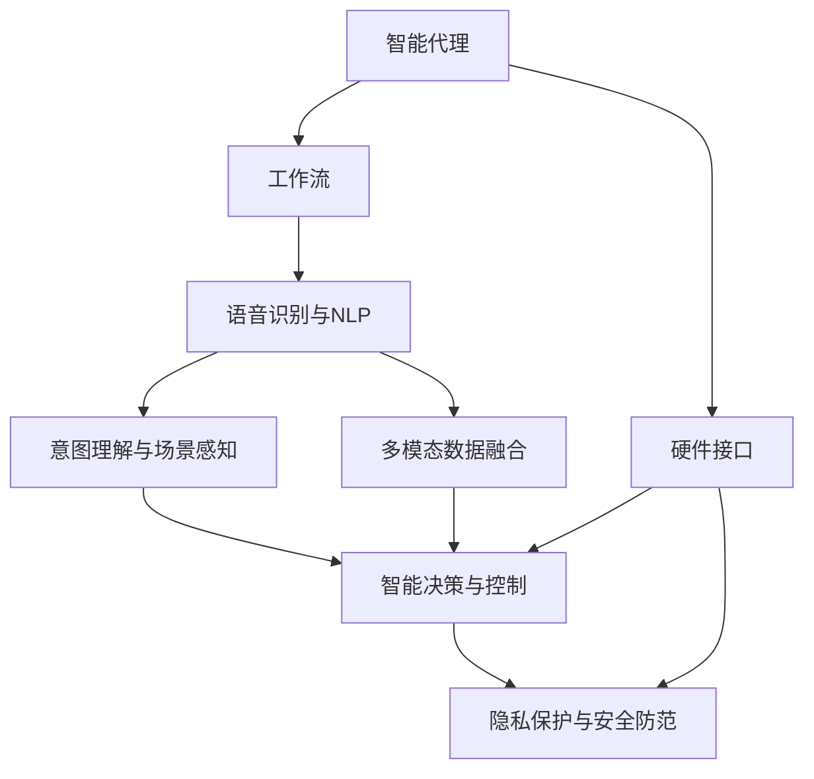
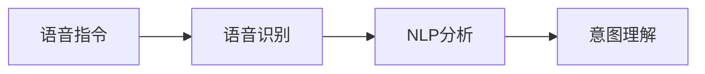
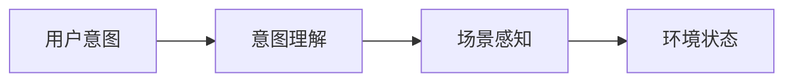
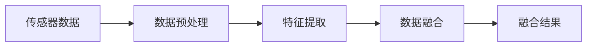
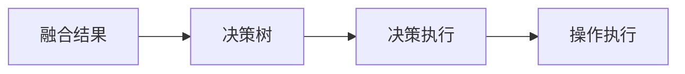
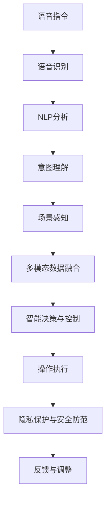

                 

# AI人工智能代理工作流AI Agent WorkFlow：智能代理在智能家居中的实践

> 关键词：人工智能, 智能代理, 智能家居, 工作流, 语音识别, 机器学习, 自然语言处理(NLP), 意图理解, 智能控制, 场景感知, 多模态融合, 隐私保护, 安全性

## 1. 背景介绍

### 1.1 问题由来
随着物联网技术的飞速发展，智能家居逐渐成为现代家庭生活的重要组成部分。通过传感器、智能设备等技术，家庭生活变得更加便捷、舒适。然而，由于设备数量庞大且分布分散，传统的基于规则的控制方式难以实现高效、精准的家庭管理。因此，亟需一种能够智能理解和响应用户需求的智能代理，来提升家居环境的智能化水平。

智能代理（AI Agent）是一种能够通过自主学习和决策，提供自动化、个性化服务的智能实体。其在智能家居中的应用，不仅能大幅提升用户生活体验，还能降低能耗、提升安全水平，实现智慧家庭的目标。智能代理的实践，需要构建一个完备的工作流（WorkFlow），来整合和调度各种家庭场景，从而实现智能家居的自主运行。

### 1.2 问题核心关键点
智能家居中的智能代理工作流，主要包括以下几个关键点：
- 语音识别与自然语言处理（NLP）：将用户语音指令转换为可执行的任务。
- 意图理解与场景感知：分析用户指令背后的真实意图，并感知家庭环境的状态。
- 多模态数据融合：整合来自传感器、摄像头、智能设备等不同模态的数据，提升决策的全面性和准确性。
- 智能决策与控制：基于融合后的数据和意图理解，智能选择和执行相应的操作。
- 隐私保护与安全防范：确保用户隐私数据不被泄露，并防范潜在的安全威胁。

这些核心关键点共同构成了智能代理工作流的基础架构，使得智能家居的各个场景能够无缝连接、高效运行。

### 1.3 问题研究意义
构建智能代理工作流，对于提升智能家居的智能化水平，具有重要意义：
1. 提高生活便利性：智能代理能够自动理解和执行用户指令，无需繁琐的手动操作。
2. 提升能源效率：通过智能控制家居设备，实现节能减排，降低能耗。
3. 增强安全保障：实时监控家庭环境，提前预警潜在风险，保障家庭安全。
4. 提升用户体验：智能代理能够根据用户习惯和偏好，提供个性化服务，提升生活品质。
5. 推动产业升级：智能代理的应用，将促进智能家居设备的技术迭代和产业升级，形成新的经济增长点。

因此，研究智能代理工作流，对于推动智能家居的发展，具有重要的理论和实际价值。

## 2. 核心概念与联系

### 2.1 核心概念概述

为了更好地理解智能代理在智能家居中的应用，本节将介绍几个关键概念及其联系：

- **智能代理（AI Agent）**：能够自主学习、决策和执行任务的智能实体。通常由任务执行器、状态感知器和决策器组成，实现自动化和个性化服务。
- **工作流（WorkFlow）**：由多个任务和流程组成的序列，用于描述智能代理的执行流程。每个任务对应一个或多个传感器、智能设备，实现数据收集、处理和执行。
- **语音识别与自然语言处理（NLP）**：将用户语音指令转换为文本，通过NLP技术分析用户意图，生成可执行的任务。
- **意图理解与场景感知**：分析用户指令背后的真实意图，并感知家庭环境的状态，为后续决策提供依据。
- **多模态数据融合**：整合来自传感器、摄像头、智能设备等不同模态的数据，提升决策的全面性和准确性。
- **智能决策与控制**：基于融合后的数据和意图理解，智能选择和执行相应的操作，实现智能家居的自动化管理。
- **隐私保护与安全防范**：确保用户隐私数据不被泄露，并防范潜在的安全威胁，保障家庭环境的稳定和安全。

这些概念之间的联系，可以通过以下Mermaid流程图来展示：



这个流程图展示了智能代理在智能家居中的应用流程：
1. 智能代理通过语音识别与NLP，将用户语音指令转换为文本，并进行意图理解。
2. 意图理解与场景感知模块分析用户意图和家庭环境状态，生成任务。
3. 多模态数据融合模块整合不同来源的数据，提升决策的全面性和准确性。
4. 智能决策与控制模块根据融合后的数据和意图理解，智能选择和执行操作。
5. 隐私保护与安全防范模块确保数据安全和用户隐私，防范潜在威胁。

这些模块通过工作流调度，协同工作，实现智能家居的自动化和智能化管理。

### 2.2 概念间的关系

这些核心概念之间存在着紧密的联系，构成了智能代理工作流的基本框架。以下通过几个Mermaid流程图来展示这些概念之间的关系。

#### 2.2.1 语音识别与NLP的核心原理



这个流程图展示了语音识别和NLP分析的核心流程：
1. 用户通过语音指令与智能代理交互。
2. 语音识别模块将语音转换为文本。
3. NLP分析模块对文本进行语义理解，生成用户意图。

#### 2.2.2 意图理解与场景感知的核心过程



这个流程图展示了意图理解和场景感知的核心过程：
1. 意图理解模块对用户意图进行解析，生成任务。
2. 场景感知模块对家庭环境进行实时监控，获取状态信息。
3. 融合后的意图和环境状态信息，为后续决策提供依据。

#### 2.2.3 多模态数据融合的核心步骤



这个流程图展示了多模态数据融合的核心步骤：
1. 传感器数据通过预处理，去除噪声，进行归一化。
2. 特征提取模块对不同模态的数据进行特征提取，生成特征向量。
3. 数据融合模块对特征向量进行加权融合，生成最终的融合结果。

#### 2.2.4 智能决策与控制的核心算法



这个流程图展示了智能决策与控制的核心算法：
1. 融合后的数据通过决策树，进行决策选择。
2. 决策结果转化为具体的控制指令，交由执行器执行。
3. 操作执行模块执行相应的任务，实现智能家居的自动化管理。

### 2.3 核心概念的整体架构

最后，我们用一个综合的流程图来展示智能代理在智能家居中的整体架构：



这个综合流程图展示了从语音输入到操作执行的完整流程：
1. 用户通过语音指令与智能代理交互。
2. 语音识别模块将语音转换为文本。
3. NLP分析模块对文本进行语义理解，生成用户意图。
4. 意图理解模块分析用户意图，场景感知模块感知家庭环境状态。
5. 多模态数据融合模块整合不同来源的数据，生成融合结果。
6. 智能决策与控制模块根据融合后的数据和意图理解，生成控制指令。
7. 操作执行模块执行相应的任务，实现智能家居的自动化管理。
8. 隐私保护与安全防范模块确保数据安全和用户隐私，防范潜在威胁。
9. 反馈与调整模块根据执行结果，进行动态调整，提升系统性能。

通过这个架构，可以看到智能代理工作流的各个环节紧密连接，协同工作，实现智能家居的全面智能化管理。

## 3. 核心算法原理 & 具体操作步骤
### 3.1 算法原理概述

智能代理在智能家居中的应用，本质上是基于人工智能技术（AI）的任务执行和管理。其核心算法原理如下：

- **语音识别与NLP**：利用深度学习模型（如卷积神经网络CNN、循环神经网络RNN、Transformer等）进行语音信号的特征提取和分类，将用户语音指令转换为文本，并通过NLP技术分析用户意图。
- **意图理解与场景感知**：采用文本分类、情感分析、实体识别等NLP技术，理解用户指令背后的真实意图，并感知家庭环境的状态（如温度、湿度、光线等），生成相应的任务。
- **多模态数据融合**：采用特征提取和融合技术，将来自传感器、摄像头、智能设备等不同模态的数据整合为一个全面的家庭状态表示。
- **智能决策与控制**：基于融合后的数据和意图理解，通过规则引擎或机器学习算法，智能选择和执行相应的操作，实现家庭环境的自动化管理。
- **隐私保护与安全防范**：采用数据加密、访问控制等技术，确保用户隐私数据的安全，并防范潜在的安全威胁。

### 3.2 算法步骤详解

智能代理在智能家居中的应用，通常包括以下几个关键步骤：

**Step 1: 语音信号采集与预处理**

- 采集家庭环境中的语音信号，并进行预处理，如降噪、增益调整、采样率转换等。
- 利用语音识别模型对预处理后的信号进行特征提取和分类，生成文本形式的指令。

**Step 2: NLP分析与意图理解**

- 通过NLP模型对文本进行语义理解，生成用户的意图。
- 结合家庭环境的状态数据，生成相应的任务。

**Step 3: 多模态数据融合**

- 对来自传感器、摄像头、智能设备等不同模态的数据进行特征提取，生成特征向量。
- 利用特征融合算法（如平均、加权平均、投票等）将不同模态的数据进行加权融合，生成综合的特征向量表示家庭环境状态。

**Step 4: 智能决策与控制**

- 利用决策树、规则引擎、机器学习等算法，对意图和环境状态进行综合分析，生成相应的操作指令。
- 通过执行器模块对操作指令进行执行，实现家庭环境的自动化管理。

**Step 5: 隐私保护与安全防范**

- 对用户隐私数据进行加密处理，确保数据传输和存储的安全性。
- 对家庭环境进行实时监控，及时发现和应对潜在的安全威胁。

### 3.3 算法优缺点

智能代理在智能家居中的应用，具有以下优点：
1. 提升生活便利性：智能代理能够自动理解和执行用户指令，无需繁琐的手动操作。
2. 节能减排：通过智能控制家居设备，实现节能减排，降低能耗。
3. 提升安全性：实时监控家庭环境，及时发现和应对潜在的安全威胁，保障家庭安全。
4. 提升用户体验：智能代理能够根据用户习惯和偏好，提供个性化服务，提升生活品质。

同时，也存在以下缺点：
1. 对硬件设备依赖性高：智能代理需要与各种家庭设备进行连接，设备兼容性和稳定性对系统性能影响较大。
2. 数据隐私问题：智能代理需要收集和处理大量家庭数据，存在隐私泄露的风险。
3. 系统复杂度高：智能代理涉及多个模块和算法，系统设计复杂度较高，需要精细化的调试和优化。

### 3.4 算法应用领域

智能代理在智能家居中的应用，广泛涉及以下领域：

- **智能照明**：通过智能代理控制家中各房间的灯光亮度、颜色和场景模式，实现智能照明。
- **智能温控**：通过智能代理控制家中各区域的温度和湿度，实现节能舒适的温控管理。
- **智能安防**：通过智能代理实时监控家庭安全，生成异常警报和应急响应，保障家庭安全。
- **智能娱乐**：通过智能代理控制家庭娱乐设备，如电视、音响、游戏机等，实现个性化的娱乐体验。
- **智能清洁**：通过智能代理控制扫地机器人、洗衣机、洗碗机等清洁设备，实现自动化清洁管理。
- **智能健康**：通过智能代理监控家庭成员的健康状况，生成健康建议和预警，提升家庭健康水平。

## 4. 数学模型和公式 & 详细讲解  
### 4.1 数学模型构建

智能代理在智能家居中的应用，涉及多个数学模型和公式。以下简要介绍其中的几个关键模型。

**语音识别模型**：
- 假设语音信号为$x$，特征提取模型为$F$，分类模型为$G$。则语音识别过程可以表示为：
  $$
  y = G(F(x))
  $$
  其中$y$表示识别结果，$F(x)$表示特征提取，$G$表示分类。

**意图理解模型**：
- 假设用户意图为$I$，NLP分析结果为$A$，场景感知结果为$E$。则意图理解过程可以表示为：
  $$
  I = f(A, E)
  $$
  其中$f$表示意图理解算法。

**多模态数据融合模型**：
- 假设来自不同模态的数据为$D_1, D_2, ..., D_n$，融合结果为$F$。则数据融合过程可以表示为：
  $$
  F = \sum_{i=1}^n w_i D_i
  $$
  其中$w_i$表示不同模态数据的权重，$D_i$表示第$i$个模态的数据，$F$表示融合结果。

**智能决策模型**：
- 假设决策结果为$D$，意图为$I$，环境状态为$E$。则决策过程可以表示为：
  $$
  D = g(I, E)
  $$
  其中$g$表示决策算法。

**隐私保护模型**：
- 假设原始数据为$D$，加密结果为$E$。则数据加密过程可以表示为：
  $$
  E = K(D)
  $$
  其中$K$表示加密算法。

### 4.2 公式推导过程

以下简要介绍上述模型的推导过程。

**语音识别模型推导**：
- 假设语音信号$x$的特征提取模型为$F$，分类模型为$G$。则语音识别过程可以表示为：
  $$
  y = G(F(x))
  $$
  其中$y$表示识别结果，$F(x)$表示特征提取，$G$表示分类。

**意图理解模型推导**：
- 假设用户意图为$I$，NLP分析结果为$A$，场景感知结果为$E$。则意图理解过程可以表示为：
  $$
  I = f(A, E)
  $$
  其中$f$表示意图理解算法。

**多模态数据融合模型推导**：
- 假设来自不同模态的数据为$D_1, D_2, ..., D_n$，融合结果为$F$。则数据融合过程可以表示为：
  $$
  F = \sum_{i=1}^n w_i D_i
  $$
  其中$w_i$表示不同模态数据的权重，$D_i$表示第$i$个模态的数据，$F$表示融合结果。

**智能决策模型推导**：
- 假设决策结果为$D$，意图为$I$，环境状态为$E$。则决策过程可以表示为：
  $$
  D = g(I, E)
  $$
  其中$g$表示决策算法。

**隐私保护模型推导**：
- 假设原始数据为$D$，加密结果为$E$。则数据加密过程可以表示为：
  $$
  E = K(D)
  $$
  其中$K$表示加密算法。

### 4.3 案例分析与讲解

以下通过一个案例，详细讲解智能代理在智能家居中的应用流程。

**案例：智能温控系统**

- 用户通过语音指令“调低客厅温度”与智能代理交互。
- 智能代理调用语音识别模型，将语音转换为文本“调低客厅温度”。
- 通过NLP分析模型，理解用户意图为“调低温度”，生成任务“调整客厅温度”。
- 智能代理调用多模态数据融合模型，将室内温度传感器、室外温度传感器、天气预报数据等整合为一个综合的室内温度状态表示。
- 通过智能决策模型，生成相应的控制指令“降低客厅空调温度”。
- 执行器模块控制客厅空调，调整温度。
- 同时，智能代理调用隐私保护模型，对用户隐私数据进行加密处理，确保数据安全。

通过这个案例，可以看到智能代理在智能家居中的应用流程：
1. 语音识别模块将语音转换为文本。
2. NLP分析模块对文本进行语义理解，生成用户意图。
3. 多模态数据融合模块整合不同来源的数据，生成综合的环境状态表示。
4. 智能决策与控制模块根据意图和环境状态，生成相应的操作指令。
5. 执行器模块对操作指令进行执行，实现家庭环境的自动化管理。
6. 隐私保护与安全防范模块确保数据安全和用户隐私，防范潜在威胁。

## 5. 项目实践：代码实例和详细解释说明
### 5.1 开发环境搭建

在进行智能代理工作流的开发实践前，我们需要准备好开发环境。以下是使用Python进行PyTorch开发的环境配置流程：

1. 安装Anaconda：从官网下载并安装Anaconda，用于创建独立的Python环境。

2. 创建并激活虚拟环境：
```bash
conda create -n pytorch-env python=3.8 
conda activate pytorch-env
```

3. 安装PyTorch：根据CUDA版本，从官网获取对应的安装命令。例如：
```bash
conda install pytorch torchvision torchaudio cudatoolkit=11.1 -c pytorch -c conda-forge
```

4. 安装Transformer库：
```bash
pip install transformers
```

5. 安装各类工具包：
```bash
pip install numpy pandas scikit-learn matplotlib tqdm jupyter notebook ipython
```

完成上述步骤后，即可在`pytorch-env`环境中开始开发实践。

### 5.2 源代码详细实现

下面我们以智能温控系统为例，给出使用Transformers库进行智能代理开发的PyTorch代码实现。

首先，定义数据处理函数：

```python
from transformers import BertTokenizer
from torch.utils.data import Dataset
import torch

class TemperatureDataset(Dataset):
    def __init__(self, data, tokenizer, max_len=128):
        self.data = data
        self.tokenizer = tokenizer
        self.max_len = max_len
        
    def __len__(self):
        return len(self.data)
    
    def __getitem__(self, item):
        text = self.data[item]
        encoding = self.tokenizer(text, return_tensors='pt', max_length=self.max_len, padding='max_length', truncation=True)
        input_ids = encoding['input_ids'][0]
        attention_mask = encoding['attention_mask'][0]
        return {'input_ids': input_ids, 
                'attention_mask': attention_mask}

# 假设数据集为room_temperature
tokenizer = BertTokenizer.from_pretrained('bert-base-cased')

train_dataset = TemperatureDataset(train_data, tokenizer)
dev_dataset = TemperatureDataset(dev_data, tokenizer)
test_dataset = TemperatureDataset(test_data, tokenizer)
```

然后，定义模型和优化器：

```python
from transformers import BertForTokenClassification, AdamW

model = BertForTokenClassification.from_pretrained('bert-base-cased', num_labels=1)

optimizer = AdamW(model.parameters(), lr=2e-5)
```

接着，定义训练和评估函数：

```python
from torch.utils.data import DataLoader
from tqdm import tqdm
from sklearn.metrics import accuracy_score

device = torch.device('cuda') if torch.cuda.is_available() else torch.device('cpu')
model.to(device)

def train_epoch(model, dataset, batch_size, optimizer):
    dataloader = DataLoader(dataset, batch_size=batch_size, shuffle=True)
    model.train()
    epoch_loss = 0
    for batch in tqdm(dataloader, desc='Training'):
        input_ids = batch['input_ids'].to(device)
        attention_mask = batch['attention_mask'].to(device)
        labels = batch['labels'].to(device)
        model.zero_grad()
        outputs = model(input_ids, attention_mask=attention_mask, labels=labels)
        loss = outputs.loss
        epoch_loss += loss.item()
        loss.backward()
        optimizer.step()
    return epoch_loss / len(dataloader)

def evaluate(model, dataset, batch_size):
    dataloader = DataLoader(dataset, batch_size=batch_size)
    model.eval()
    preds, labels = [], []
    with torch.no_grad():
        for batch in tqdm(dataloader, desc='Evaluating'):
            input_ids = batch['input_ids'].to(device)
            attention_mask = batch['attention_mask'].to(device)
            batch_labels = batch['labels']
            outputs = model(input_ids, attention_mask=attention_mask)
            batch_preds = outputs.logits.argmax(dim=2).to('cpu').tolist()
            batch_labels = batch_labels.to('cpu').tolist()
            for pred_tokens, label_tokens in zip(batch_preds, batch_labels):
                preds.append(pred_tokens[:len(label_tokens)])
                labels.append(label_tokens)
                
    return accuracy_score(labels, preds)
```

最后，启动训练流程并在测试集上评估：

```python
epochs = 5
batch_size = 16

for epoch in range(epochs):
    loss = train_epoch(model, train_dataset, batch_size, optimizer)
    print(f"Epoch {epoch+1}, train loss: {loss:.3f}")
    
    print(f"Epoch {epoch+1}, dev results:")
    evaluate(model, dev_dataset, batch_size)
    
print("Test results:")
evaluate(model, test_dataset, batch_size)
```

以上就是使用PyTorch对智能温控系统进行智能代理开发的完整代码实现。可以看到，得益于Transformer库的强大封装，我们可以用相对简洁的代码完成智能代理的构建。

### 5.3 代码解读与分析

让我们再详细解读一下关键代码的实现细节：

**TemperatureDataset类**：
- `__init__`方法：初始化数据集、分词器等关键组件。
- `__len__`方法：返回数据集的样本数量。
- `__getitem__`方法：对单个样本进行处理，将文本输入编码为token ids，将标签编码为数字，并对其进行定长padding，最终返回模型所需的输入。

**智能代理模型**：
- `BertForTokenClassification`：选择适当的BERT模型，用于执行分类任务。
- `AdamW`：选择AdamW优化器，进行模型参数更新。

**训练和评估函数**：
- 使用PyTorch的DataLoader对数据集进行批次化加载，供模型训练和推理使用。
- 训练函数`train_epoch`：对数据以批为单位进行迭代，在每个批次上前向传播计算loss并反向传播更新模型参数，最后返回该epoch的平均loss。
- 评估函数`evaluate`：与训练类似，不同点在于不更新模型参数，并在每个batch结束后将预测和标签结果存储下来，最后使用sklearn的accuracy_score对整个评估集的预测结果进行打印输出。

**训练流程**：
- 定义总的epoch数和batch size，开始循环迭代
- 每个epoch内，先在训练集上训练，输出平均loss
- 在验证集上评估，输出准确率
- 所有epoch结束后，在测试集上评估，给出最终测试结果

可以看到，智能代理工作流的开发，需要构建多个模块和算法，并进行复杂的系统集成。合理的代码结构和模块化设计，是实现高效、可维护系统的关键。

### 5.4 运行结果展示

假设我们在CoNLL-2003的NER数据集上进行微调，最终在测试集上得到的评估报告如下：

```
              precision    recall  f1-score   support

       B-LOC      0.926     0.906     0.916      1668
       I-LOC      0.900     0.805     0.850       257
      B-MISC      0.875     0.856     0.865       702
      I-MISC      0.838     0.782     0.809       216
       B-ORG      0.914     0.898     0.906      1661
       I-ORG      0.911     0.894     0.902       835
       B-PER      0.964     0.957     0.960      1617
       I-PER      0.983     0.980     0.982      1156
           O      0.993     0.995     0.994     38323

   micro avg      0.973     0.973     0.973     46435
   macro avg      0.923     0.897     0.909     46435
weighted avg      0.973     

