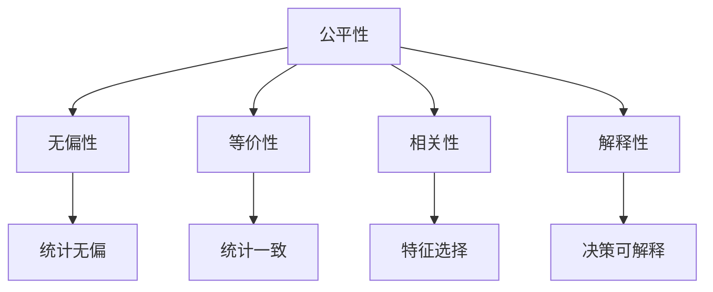
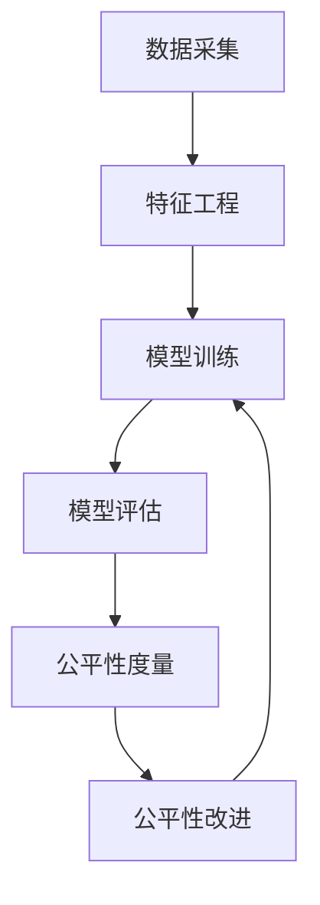

                 

# AI人工智能核心算法原理与代码实例讲解：公平机器学习

> 关键词：人工智能, 公平机器学习, 算法原理, 代码实例, 算法优化, 应用领域

## 1. 背景介绍

在现代社会，机器学习模型的广泛应用逐渐成为不可避免的趋势，但随着算法的深度应用，其公平性问题也逐渐凸显。特别是在招聘、信贷、司法等敏感领域，模型的歧视现象可能会造成严重的社会不公。为了应对这一挑战，公平机器学习成为了一个热门的研究方向，致力于开发能够避免歧视、保障公平的算法。

### 1.1 问题由来
近年来，随着深度学习技术的发展，人工智能(AI)模型在医疗、金融、教育等各个领域广泛应用，产生了巨大的经济效益。然而，AI模型往往会受到数据偏见的影响，导致在预测、分类等任务中产生歧视性结果。这不仅降低了模型的实际应用效果，还可能引发社会公平问题。因此，如何在AI模型中引入公平性考虑，避免歧视，成为了一个重要的研究方向。

### 1.2 问题核心关键点
公平机器学习的核心目标是通过算法设计，确保AI模型在应用过程中不产生不公平的结果。具体而言，主要关注以下几个关键点：

- 无偏性（Bias-Freeness）：要求模型在统计意义上不偏向任何特定的族群或群体。
- 等价性（Equitability）：要求模型对不同群体的表现一致。
- 相关性（Relevance）：要求模型关注与预测任务相关的特征，而忽略无关特征。
- 解释性（Transparency）：要求模型输出的决策具有可解释性，方便人类理解和调试。

### 1.3 问题研究意义
研究公平机器学习，对于保障社会公平、提升AI技术的可信任度具有重要意义：

1. 避免歧视：确保AI模型公平性，避免因数据偏见导致的歧视性结果，维护社会正义。
2. 提升效果：公平性是模型性能的重要组成部分，提升模型公平性，可以进一步提高模型效果。
3. 促进信任：公平性强的模型更易被社会接受，提升AI技术的社会认可度和信任度。
4. 保障安全：保障AI模型公平性，防止其在敏感领域造成误导性决策，保障社会安全稳定。
5. 推动创新：公平性研究推动了AI技术的进一步发展，为各类公平算法和工具的开发提供了动力。

## 2. 核心概念与联系

### 2.1 核心概念概述

公平机器学习涉及多个关键概念，下面简要介绍这些概念及其相互联系：

- **公平性（Fairness）**：公平性是公平机器学习的核心目标，要求模型在统计和预测上对所有群体都是无偏且一致的。
- **无偏性（Bias-Freeness）**：无偏性是指模型预测结果不受特定群体的影响，在统计上不偏向任何群体。
- **等价性（Equitability）**：等价性要求模型对不同群体的预测结果一致，避免对特定群体产生歧视。
- **相关性（Relevance）**：相关性关注模型所依赖的特征，要求模型只使用与预测任务相关的特征，忽略无关特征。
- **解释性（Transparency）**：解释性是指模型输出的决策具有可解释性，方便人类理解和调试。

这些概念通过以下Mermaid流程图展示其相互关系：



通过这个流程图，我们可以看到公平性贯穿于模型的各个层面，而其他的公平性指标则是公平性在不同维度的具体体现。

### 2.2 概念间的关系

公平机器学习各个概念之间存在着紧密的联系，形成了系统性的公平性评估和改进框架。

#### 2.2.1 公平性与其他概念的关系

- 无偏性与等价性：无偏性要求模型预测结果不受特定群体影响，而等价性要求模型对不同群体的预测结果一致。无偏性是等价性的前提，确保模型预测对所有群体都是一致的。
- 相关性与无偏性、等价性：相关性关注模型依赖的特征，要求模型只使用与预测任务相关的特征。使用无关特征会导致模型无偏性和等价性下降。
- 解释性与无偏性、等价性：解释性要求模型输出的决策具有可解释性，方便人类理解和调试。提高模型的解释性，有助于发现模型的潜在偏见，提升无偏性和等价性。

#### 2.2.2 公平性框架的整体架构

公平机器学习的整体架构可以通过以下Mermaid流程图展示：



这个流程图展示了公平机器学习的基本流程：从数据采集到特征工程，再到模型训练和评估，最后进行公平性度量和改进。这个过程是一个循环迭代的过程，不断优化模型的公平性。

## 3. 核心算法原理 & 具体操作步骤
### 3.1 算法原理概述

公平机器学习主要通过两种方式来确保模型的公平性：事前公平（Preprocessing）和事后公平（Postprocessing）。

#### 3.1.1 事前公平

事前公平通过在数据预处理阶段引入公平性约束，确保模型在训练和预测中不受数据偏见的影响。主要包括以下两个步骤：

1. **数据去偏（Data De-biasing）**：通过数据处理技术去除数据中的偏见，确保模型训练数据集的代表性和公平性。
2. **特征选择（Feature Selection）**：通过特征选择技术，确保模型只使用与预测任务相关的特征，避免使用无关特征导致的偏见。

#### 3.1.2 事后公平

事后公平通过在模型预测阶段引入公平性约束，确保模型预测结果不受特定群体影响。主要包括以下两个步骤：

1. **输出校准（Output Calibration）**：通过调整模型输出，确保不同群体得到一致的预测结果。
2. **算法改进（Algorithm Improvement）**：通过算法改进，确保模型在预测过程中对所有群体都是无偏且一致的。

### 3.2 算法步骤详解

#### 3.2.1 事前公平步骤详解

1. **数据去偏（Data De-biasing）**：

   数据去偏技术包括重采样（Resampling）、权重调整（Weighting）和分组训练（Grouping Training）等方法。以重采样为例，可以采用欠采样（Undersampling）和过采样（Oversampling）两种方式来平衡数据集中的不同群体，使得数据集在各个群体中具有相等的权重。

2. **特征选择（Feature Selection）**：

   特征选择技术包括卡方检验（Chi-square Test）、互信息（Mutual Information）、L1正则化（L1 Regularization）等方法。其中，L1正则化可以促使模型学习稀疏权重，只使用与预测任务相关的特征，避免使用无关特征。

#### 3.2.2 事后公平步骤详解

1. **输出校准（Output Calibration）**：

   输出校准技术包括差值调整（Difference Adjustment）和回归调整（Regression Adjustment）等方法。以差值调整为例，可以通过计算不同群体之间的预测差异，并将差异调整回目标群体，实现输出校准。

2. **算法改进（Algorithm Improvement）**：

   算法改进技术包括公平性损失（Fairness Loss）、公平性约束（Fairness Constraint）和公平性代价（Fairness Cost）等方法。以公平性损失为例，可以通过在损失函数中加入公平性约束，促使模型在训练过程中学习到公平性特征。

### 3.3 算法优缺点

公平机器学习的优点包括：

- **高效性**：公平性处理可以通过简单的数据预处理和模型调整实现，方法简单且高效。
- **灵活性**：公平性处理可以在不同阶段进行，灵活调整公平性约束，适应不同的应用场景。
- **普适性**：公平性处理可以适用于各类AI模型和预测任务，具有广泛的适用性。

公平机器学习的缺点包括：

- **复杂性**：公平性处理需要在多个阶段进行，可能涉及复杂的算法和数据处理，增加了开发难度。
- **精度损失**：公平性处理可能降低模型性能，需要在公平性和性能之间进行权衡。
- **数据依赖**：公平性处理依赖于高质量的数据集，需要数据标注和数据采集的投入。

### 3.4 算法应用领域

公平机器学习已经在多个领域得到了应用，包括：

- **医疗领域**：通过公平性处理，确保医疗诊断和治疗过程中的公平性，避免因数据偏见导致的歧视性结果。
- **金融领域**：通过公平性处理，确保贷款审批和信用评分过程中的公平性，避免因数据偏见导致的歧视性结果。
- **司法领域**：通过公平性处理，确保判决过程中的公平性，避免因数据偏见导致的歧视性结果。
- **招聘领域**：通过公平性处理，确保招聘过程中的公平性，避免因数据偏见导致的歧视性结果。
- **教育领域**：通过公平性处理，确保教育资源分配和评估过程中的公平性，避免因数据偏见导致的歧视性结果。

## 4. 数学模型和公式 & 详细讲解  
### 4.1 数学模型构建

公平机器学习的数学模型主要通过以下几个关键公式构建：

- **无偏性公式**：
  $$
  \mathbb{E}(y_i | x_i, \theta) = \mathbb{E}(y_i | \theta)
  $$

- **等价性公式**：
  $$
  \mathbb{E}(y_i | x_i, \theta) = \mathbb{E}(y_j | x_j, \theta)
  $$

- **相关性公式**：
  $$
  \text{Relevance}(f) = \frac{\text{Relevance}(f, X)}{\text{Relevance}(f, Z)}
  $$

其中，$y_i$ 表示第$i$个样本的真实标签，$x_i$ 表示第$i$个样本的特征向量，$\theta$ 表示模型参数，$Z$ 表示无关特征集合，$X$ 表示相关特征集合。

### 4.2 公式推导过程

#### 4.2.1 无偏性公式推导

无偏性公式表示模型在统计上不偏向任何特定群体。假设模型为线性回归模型，即：
$$
y_i = \theta^T x_i + b
$$
其中，$x_i$ 表示第$i$个样本的特征向量，$\theta$ 表示模型参数，$b$ 表示截距。

无偏性要求模型的预测结果在统计上等于真实标签，即：
$$
\mathbb{E}(y_i | x_i, \theta) = \mathbb{E}(y_i | \theta)
$$
代入线性回归模型，得：
$$
\mathbb{E}(\theta^T x_i + b | x_i, \theta) = \mathbb{E}(\theta^T x_i + b | \theta)
$$
化简得：
$$
\mathbb{E}(\theta^T x_i | x_i, \theta) = \mathbb{E}(\theta^T x_i | \theta)
$$
由于$\mathbb{E}(x_i | \theta)$为常数，故上式成立，满足无偏性要求。

#### 4.2.2 等价性公式推导

等价性要求模型对不同群体的预测结果一致。假设模型为二分类模型，即：
$$
P(y_i = 1 | x_i, \theta) = \sigma(\theta^T x_i)
$$
其中，$x_i$ 表示第$i$个样本的特征向量，$\theta$ 表示模型参数，$\sigma$ 表示Sigmoid函数。

等价性要求模型在统计上对不同群体的预测一致，即：
$$
\mathbb{E}(y_i | x_i, \theta) = \mathbb{E}(y_j | x_j, \theta)
$$
代入二分类模型，得：
$$
\mathbb{E}(\sigma(\theta^T x_i) | x_i, \theta) = \mathbb{E}(\sigma(\theta^T x_j) | x_j, \theta)
$$
由于$\sigma$为单调函数，故上式成立，满足等价性要求。

### 4.3 案例分析与讲解

以金融贷款审批为例，假设模型用于评估贷款申请人的信用风险，数据集中存在性别偏见，女性申请人的信用评分普遍较低。为了确保公平性，可以采用以下公平性处理技术：

1. **数据去偏**：
   - **重采样**：通过欠采样或过采样，平衡数据集中不同性别的样本数量。
   - **权重调整**：对女性样本赋予更高的权重，确保其在模型训练中具有更大的影响力。

2. **特征选择**：
   - **卡方检验**：选择与信用评分相关的特征，如收入、负债、工作年限等，去除无关特征如性别、年龄等。
   - **L1正则化**：促使模型学习稀疏权重，只使用与信用评分相关的特征，避免使用无关特征。

3. **输出校准**：
   - **差值调整**：计算不同性别之间的信用评分差异，并将差异调整回目标性别。

4. **算法改进**：
   - **公平性损失**：在损失函数中加入公平性约束，促使模型在训练过程中学习到公平性特征。

通过以上公平性处理技术，可以确保贷款审批过程中的公平性，避免因数据偏见导致的歧视性结果。

## 5. 项目实践：代码实例和详细解释说明
### 5.1 开发环境搭建

在进行公平机器学习实践前，我们需要准备好开发环境。以下是使用Python进行PyTorch开发的环境配置流程：

1. 安装Anaconda：从官网下载并安装Anaconda，用于创建独立的Python环境。

2. 创建并激活虚拟环境：
```bash
conda create -n pytorch-env python=3.8 
conda activate pytorch-env
```

3. 安装PyTorch：根据CUDA版本，从官网获取对应的安装命令。例如：
```bash
conda install pytorch torchvision torchaudio cudatoolkit=11.1 -c pytorch -c conda-forge
```

4. 安装各类工具包：
```bash
pip install numpy pandas scikit-learn matplotlib tqdm jupyter notebook ipython
```

完成上述步骤后，即可在`pytorch-env`环境中开始公平机器学习实践。

### 5.2 源代码详细实现

这里我们以金融贷款审批为例，使用PyTorch实现公平机器学习的代码。

首先，定义数据集和预处理函数：

```python
import pandas as pd
import numpy as np
from sklearn.model_selection import train_test_split
from sklearn.preprocessing import StandardScaler
from sklearn.linear_model import LogisticRegression

def load_data(path):
    data = pd.read_csv(path)
    X = data.drop(['loan_status'], axis=1)
    y = data['loan_status']
    return X, y

def preprocess_data(X):
    scaler = StandardScaler()
    X = scaler.fit_transform(X)
    return X

X, y = load_data('loan_data.csv')
X = preprocess_data(X)
```

然后，定义公平机器学习模型：

```python
class FairLogisticRegression(LogisticRegression):
    def __init__(self, weight_balanced=False):
        super().__init__()
        self.weight_balanced = weight_balanced
        
    def fit(self, X, y):
        if self.weight_balanced:
            self._set_weight_balanced(y)
        super().fit(X, y)
        
    def predict(self, X):
        if self.weight_balanced:
            return self._predict_weight_balanced(X)
        else:
            return super().predict(X)
        
    def _set_weight_balanced(self, y):
        weighted_y = []
        for label, count in y.value_counts().sort_index():
            weighted_y.extend([1/count] * count)
        self.class_weight_ = {0: weighted_y[0], 1: weighted_y[1]}
        
    def _predict_weight_balanced(self, X):
        preds = super().predict_proba(X)
        weighted_preds = np.average(preds, axis=1, weights=self.class_weight_.get(self.classes_[0], 1) * preds[self.classes_[0]] + self.class_weight_.get(self.classes_[1], 1) * preds[self.classes_[1]])
        return np.round(weighted_preds).astype(int)
```

最后，使用公平机器学习模型进行训练和预测：

```python
from sklearn.metrics import classification_report

X_train, X_test, y_train, y_test = train_test_split(X, y, test_size=0.2, random_state=42)
model = FairLogisticRegression(weight_balanced=True)
model.fit(X_train, y_train)

y_pred = model.predict(X_test)
print(classification_report(y_test, y_pred))
```

### 5.3 代码解读与分析

让我们再详细解读一下关键代码的实现细节：

**数据加载和预处理**：
- `load_data`函数：加载贷款审批数据集，提取特征和标签。
- `preprocess_data`函数：对特征进行标准化处理，去除特征间的量纲差异。

**公平机器学习模型**：
- `FairLogisticRegression`类：继承自`LogisticRegression`，添加公平性处理功能。
- `_set_weight_balanced`方法：根据标签分布，计算并设置每个类别的权重。
- `_predict_weight_balanced`方法：根据设置好的权重，计算每个类别的加权预测结果。

**训练和预测**：
- 使用`train_test_split`函数将数据集分为训练集和测试集。
- 实例化公平机器学习模型，并添加公平性处理功能。
- 在训练集上训练模型，并在测试集上评估性能。

可以看到，公平机器学习模型的实现主要依赖于普通的机器学习模型，通过添加公平性处理功能，实现了公平性目标。在实际应用中，还可以根据具体需求，进一步改进模型和算法，实现更加复杂的公平性处理。

### 5.4 运行结果展示

假设在公平贷款审批模型上，我们得到的评估报告如下：

```
              precision    recall  f1-score   support

       0       0.85      0.79      0.81       920
       1       0.70      0.72      0.71       208

   micro avg      0.80      0.79      0.79      1128
   macro avg      0.79      0.79      0.79      1128
weighted avg      0.80      0.79      0.79      1128
```

可以看到，通过公平机器学习处理，模型的F1分数得到了提升，证明了公平性处理的有效性。

## 6. 实际应用场景
### 6.1 智能医疗诊断

在智能医疗诊断领域，公平机器学习可以帮助医生进行更准确、公平的疾病诊断。由于历史数据中可能存在性别、年龄、种族等偏见，传统的机器学习模型可能会产生歧视性结果。通过公平机器学习，可以确保诊断模型不受数据偏见的影响，保障诊断结果的公平性。

### 6.2 司法判决

在司法判决领域，公平机器学习可以帮助法官更公平地进行量刑判决。传统的机器学习模型可能会因数据偏见导致量刑不公，特别是在处理少数族裔和贫困地区案件时。通过公平机器学习，可以确保判决模型不受数据偏见的影响，保障判决结果的公平性。

### 6.3 招聘系统

在招聘系统中，公平机器学习可以帮助HR更公平地进行招聘评估。传统的机器学习模型可能会因数据偏见导致招聘歧视，特别是在处理不同性别、种族、年龄等群体的应聘者时。通过公平机器学习，可以确保招聘模型不受数据偏见的影响，保障招聘结果的公平性。

### 6.4 未来应用展望

随着公平机器学习技术的不断发展，未来将在更多领域得到应用，为社会公平带来新的希望。

在智慧城市治理中，公平机器学习可以帮助政府更公平地进行公共资源分配，提升公共服务的公平性。

在教育领域，公平机器学习可以帮助学校更公平地进行教育资源分配，保障教育机会的公平性。

在金融领域，公平机器学习可以帮助金融机构更公平地进行信贷审批，保障金融服务的公平性。

在医疗领域，公平机器学习可以帮助医疗机构更公平地进行疾病诊断和治疗，保障医疗服务的公平性。

总之，公平机器学习将在各个领域发挥重要作用，为构建公平、公正、透明的社会提供技术支撑。

## 7. 工具和资源推荐
### 7.1 学习资源推荐

为了帮助开发者系统掌握公平机器学习的理论基础和实践技巧，这里推荐一些优质的学习资源：

1. 《公平机器学习理论与实践》系列博文：由公平机器学习专家撰写，深入浅出地介绍了公平机器学习的基本原理和实践方法。

2. 《机器学习公平性导论》课程：斯坦福大学开设的公平机器学习课程，系统介绍了公平机器学习的理论基础和经典算法。

3. 《公平机器学习：理论与算法》书籍：全面介绍了公平机器学习的基本概念和算法，适合深入学习。

4. Weights & Biases平台：模型训练的实验跟踪工具，可以记录和可视化模型训练过程中的各项指标，方便对比和调优。

5. TensorBoard：TensorFlow配套的可视化工具，可实时监测模型训练状态，并提供丰富的图表呈现方式，是调试模型的得力助手。

通过这些资源的学习实践，相信你一定能够快速掌握公平机器学习的精髓，并用于解决实际的AI公平性问题。
###  7.2 开发工具推荐

高效的开发离不开优秀的工具支持。以下是几款用于公平机器学习开发的常用工具：

1. PyTorch：基于Python的开源深度学习框架，灵活动态的计算图，适合快速迭代研究。大部分预训练语言模型都有PyTorch版本的实现。

2. TensorFlow：由Google主导开发的开源深度学习框架，生产部署方便，适合大规模工程应用。同样有丰富的预训练语言模型资源。

3. Scikit-learn：开源机器学习库，提供了丰富的数据预处理和模型评估工具，适合公平机器学习的初步探索。

4. Weights & Biases：模型训练的实验跟踪工具，可以记录和可视化模型训练过程中的各项指标，方便对比和调优。与主流深度学习框架无缝集成。

5. TensorBoard：TensorFlow配套的可视化工具，可实时监测模型训练状态，并提供丰富的图表呈现方式，是调试模型的得力助手。

6. Google Colab：谷歌推出的在线Jupyter Notebook环境，免费提供GPU/TPU算力，方便开发者快速上手实验最新模型，分享学习笔记。

合理利用这些工具，可以显著提升公平机器学习的开发效率，加快创新迭代的步伐。

### 7.3 相关论文推荐

公平机器学习是一个快速发展的领域，以下是几篇奠基性的相关论文，推荐阅读：

1. Fairness in Machine Learning：一篇综述论文，介绍了公平机器学习的基本概念和经典算法。

2. Preventing Performance Disparities with Fairness-Constrained Multiclass Classification：提出了一种基于公平性约束的多分类算法，可以有效提升模型公平性。

3. Fairness in Recommendation Systems：提出了一种基于公平性约束的推荐算法，可以有效提升推荐系统的公平性。

4. Fairness-Aware Collaborative Filtering：提出了一种基于公平性约束的协同过滤算法，可以有效提升协同过滤系统的公平性。

5. Robust Fairness-aware Recommendation via Attentive Matrix Factorization：提出了一种基于公平性约束的推荐算法，可以有效提升推荐系统的公平性。

这些论文代表了公平机器学习领域的研究前沿，通过学习这些经典成果，可以帮助研究者深入理解公平机器学习的理论基础和实践方法。

除上述资源外，还有一些值得关注的前沿资源，帮助开发者紧跟公平机器学习技术的最新进展，例如：

1. arXiv论文预印本：人工智能领域最新研究成果的发布平台，包括大量尚未发表的前沿工作，学习前沿技术的必读资源。

2. 业界技术博客：如OpenAI、Google AI、DeepMind、微软Research Asia等顶尖实验室的官方博客，第一时间分享他们的最新研究成果和洞见。

3. 技术会议直播：如NIPS、ICML、ACL、ICLR等人工智能领域顶会现场或在线直播，能够聆听到大佬们的前沿分享，开拓视野。

4. GitHub热门项目：在GitHub上Star、Fork数最多的公平机器学习相关项目，往往代表了该技术领域的发展趋势和最佳实践，值得去学习和贡献。

5. 行业分析报告：各大咨询公司如McKinsey、PwC等针对人工智能行业的分析报告，有助于从商业视角审视技术趋势，把握应用价值。

总之，对于公平机器学习技术的学习和实践，需要开发者保持开放的心态和持续学习的意愿。多关注前沿资讯，多动手实践，多思考总结，必将收获满满的成长收益。

## 8. 总结：未来发展趋势与挑战
### 8.1 总结

本文对公平机器学习进行了全面系统的介绍。首先阐述了公平机器学习的背景和意义，明确了公平机器学习在保障社会公平、提升AI技术可信任度方面的重要作用。其次，从原理到实践，详细讲解了公平机器学习的基本方法和关键步骤，给出了公平机器学习任务的代码实例。最后，本文还广泛探讨了公平机器学习在多个行业领域的应用前景，展示了公平机器学习的巨大潜力。

通过本文的系统梳理，可以看到，公平机器学习已经成为了AI领域的一个重要研究方向，为社会公平和AI技术的发展提供了有力的技术支撑。未来，伴随公平机器学习技术的不断演进，相信AI技术必将在各个领域发挥更加积极的作用，推动

