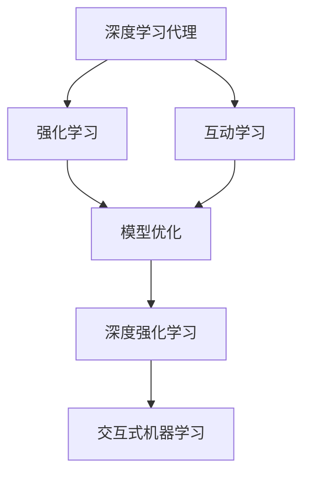
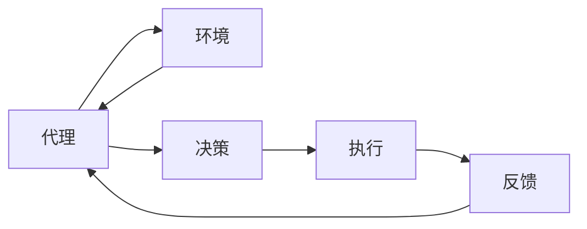
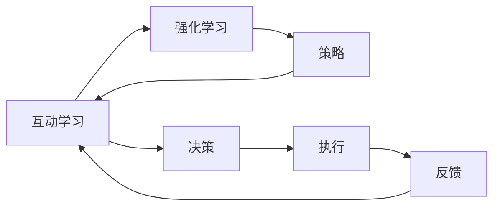
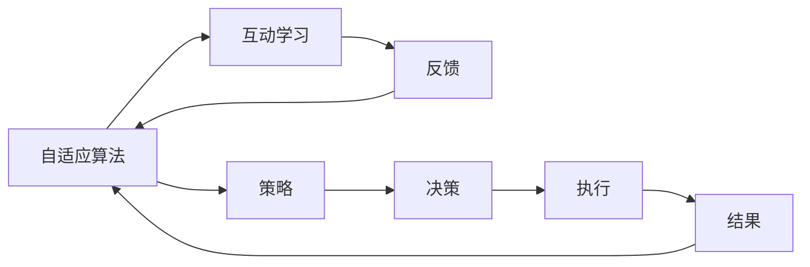
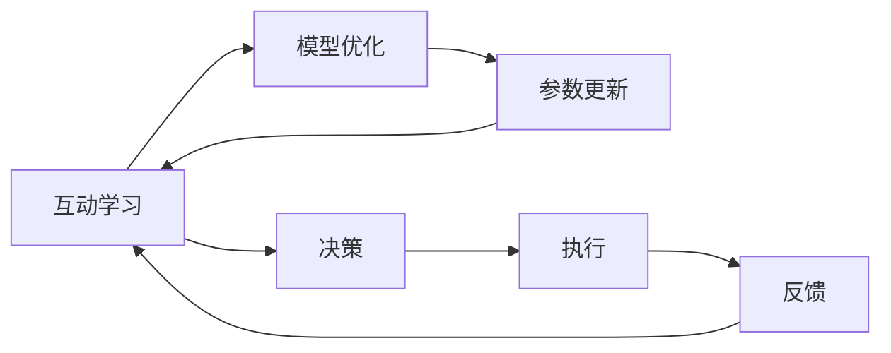

                 

# AI人工智能深度学习算法：互动学习在深度学习代理中的角色与方法

> 关键词：深度学习代理,互动学习,强化学习,自适应算法,模型优化,深度强化学习,交互式机器学习

## 1. 背景介绍

### 1.1 问题由来
在深度学习的探索与实践中，强化学习(Reinforcement Learning, RL)逐渐成为极具研究价值和应用前景的领域。相比传统的监督学习和无监督学习，强化学习允许代理(Agent)通过与环境的交互，不断学习、优化策略，逐步提升任务表现。然而，传统的强化学习模型在复杂环境中往往难以泛化，决策过程可解释性不强，缺乏对动态环境变化的自适应能力。

互动学习（Interactive Learning）作为一种新的学习范式，通过强化学习与人类或环境（代理）之间的交互，不断改进模型决策。互动学习能够实现实时反馈，使得模型可以迅速响应环境变化，同时保持对长期目标的关注。在强化学习中，互动学习的引入能够提高模型的智能水平和适应性，使得AI代理在复杂、动态、不确定环境中具有更强的自适应和决策能力。

### 1.2 问题核心关键点
互动学习的核心在于将模型输出与人类或环境的反馈进行互动，逐步优化决策策略。互动学习通常分为两步：
1. 人类或环境对模型输出进行反馈，指出模型决策的不足之处。
2. 模型根据反馈信息，调整策略参数，实现改进。

互动学习在强化学习中发挥着关键作用，尤其在处理不确定、复杂的现实任务时，比传统的强化学习方法具有显著优势。其核心优势包括：

1. **实时反馈**：通过实时与环境或人类交互，模型能够快速学习并调整策略，适应环境变化。
2. **自适应性**：模型可根据任务变化动态调整策略，无需大规模重新训练。
3. **高泛化能力**：通过不断迭代优化，模型在处理不同样本时表现更好。
4. **交互式决策**：模型在执行决策时，可以与人类或环境进行交互，增强决策的透明度和可解释性。

互动学习已成为当前深度学习代理研究的热门方向，广泛应用于医疗、游戏、金融等领域，为AI代理带来新的突破。

### 1.3 问题研究意义
研究互动学习在深度学习代理中的角色与方法，对于提升AI代理的自适应性和决策能力，推动强化学习技术在现实世界中的应用，具有重要意义：

1. **提升代理性能**：通过互动学习，模型能够不断优化策略，提升在复杂环境中的表现。
2. **增强决策可解释性**：互动学习增强了决策过程的透明度，使得模型能够解释决策依据。
3. **降低成本与风险**：互动学习可以在实际应用中实时优化模型，无需大规模数据和重训练，降低了成本和风险。
4. **促进跨领域应用**：互动学习将强化学习从学术研究走向实际应用，推动AI技术在更多领域落地。
5. **加速技术迭代**：互动学习能够加速模型的迭代优化过程，快速适应新技术和新需求。

## 2. 核心概念与联系

### 2.1 核心概念概述

为了更好地理解互动学习在深度学习代理中的角色与方法，本节将介绍几个关键概念及其相互联系：

1. **深度学习代理（Deep Learning Agent）**：指通过深度神经网络构建的智能代理，能够从大量数据中学习到高层次的特征表示，并在特定任务中做出决策。
2. **强化学习（Reinforcement Learning）**：一种学习范式，代理通过与环境的交互，学习到关于环境的动态知识，优化决策策略以最大化累积奖励。
3. **互动学习（Interactive Learning）**：指代理在执行决策时，通过与人类或环境交互，获取实时反馈，进而调整策略以提高任务表现。
4. **自适应算法（Adaptive Algorithm）**：一种根据反馈信息动态调整模型参数，优化决策策略的算法。
5. **模型优化（Model Optimization）**：指通过优化算法，调整模型参数，提升模型性能的过程。
6. **深度强化学习（Deep Reinforcement Learning）**：结合深度学习和强化学习，利用深度神经网络逼近复杂策略，并基于实时反馈不断优化。
7. **交互式机器学习（Interactive Machine Learning）**：指机器学习模型与用户交互，根据用户反馈进行模型优化。

这些概念之间的关系可以用以下Mermaid流程图表示：



通过这个流程图，可以清晰地看到深度学习代理与互动学习、模型优化之间的联系。互动学习通过实时反馈，引导代理进行模型优化，进一步提升代理性能，并扩展到深度强化学习。

### 2.2 概念间的关系

为了更进一步理解互动学习在大模型代理中的角色与方法，以下我们将通过几个Mermaid流程图展示各个概念之间的联系。

#### 2.2.1 代理与环境互动



该流程图展示了代理与环境的互动过程。代理通过决策和执行，与环境交互，获取反馈信息，然后根据反馈调整策略。

#### 2.2.2 互动学习与强化学习的关系



这个流程图展示了互动学习与强化学习的相互影响。互动学习通过反馈信息，优化强化学习的策略，进一步提升代理的决策能力。

#### 2.2.3 互动学习与自适应算法的关系



这个流程图展示了互动学习与自适应算法的协同作用。自适应算法通过反馈信息，调整策略参数，而互动学习则通过实时反馈不断优化代理决策。

#### 2.2.4 互动学习与模型优化



这个流程图展示了互动学习与模型优化的相互作用。互动学习通过反馈信息，引导模型优化，实现参数更新和决策策略的动态调整。

通过以上几个流程图，可以更深入地理解互动学习在深度学习代理中的角色与方法，并指导后续具体算法和实践。

## 3. 核心算法原理 & 具体操作步骤
### 3.1 算法原理概述

互动学习的核心在于代理与环境之间的实时交互，根据反馈信息动态调整策略。其基本流程如下：

1. 代理根据当前策略执行决策，并输出结果。
2. 环境根据结果提供反馈，指出决策的不足。
3. 代理根据反馈信息，调整策略参数，实现策略优化。
4. 重复上述步骤，不断迭代优化策略。

互动学习在强化学习中的应用，使得代理能够适应动态环境变化，同时保持对长期目标的关注。

### 3.2 算法步骤详解

互动学习在强化学习中的具体操作步骤如下：

**Step 1: 准备训练环境**
- 构建训练环境，定义状态空间、动作空间和奖励函数。
- 设置环境模拟参数，如动态性、不确定性等。
- 定义代理的初始策略，如随机策略或预训练策略。

**Step 2: 初始化模型参数**
- 初始化代理的深度神经网络模型参数。
- 定义损失函数和优化器，如交叉熵损失和Adam优化器。

**Step 3: 执行决策并获取反馈**
- 代理在每个时间步执行决策，并输出动作。
- 环境根据动作输出结果，并根据结果给出奖励。
- 将结果反馈给代理，作为模型的训练信号。

**Step 4: 训练模型**
- 代理根据反馈信息，使用梯度下降等优化算法，更新模型参数。
- 不断迭代训练，直到模型收敛或达到预设轮数。

**Step 5: 评估与迭代优化**
- 在测试集上评估模型性能，比较不同策略的效果。
- 根据评估结果，选择性能最优的策略进行迭代优化。

### 3.3 算法优缺点

互动学习在强化学习中的应用，带来了以下优点：

1. **实时反馈**：通过实时与环境或人类交互，模型能够快速学习并调整策略。
2. **自适应性**：模型可根据任务变化动态调整策略，无需大规模重新训练。
3. **高泛化能力**：通过不断迭代优化，模型在处理不同样本时表现更好。
4. **交互式决策**：模型在执行决策时，可以与人类或环境进行交互，增强决策的透明度和可解释性。

然而，互动学习也存在以下缺点：

1. **计算复杂度**：由于需要实时与环境交互，互动学习的计算复杂度较高，对计算资源要求较高。
2. **模型风险**：互动学习依赖环境反馈进行优化，若反馈信息不准确或不完整，可能导致模型策略失效。
3. **稳定性问题**：在环境或人类交互过程中，模型策略可能受到干扰，影响决策稳定性。
4. **数据隐私**：互动学习需获取环境或人类反馈，可能涉及数据隐私问题。

### 3.4 算法应用领域

互动学习在强化学习中的应用已经涵盖了多个领域，如游戏、机器人、医疗、金融等。以下列举几个典型应用场景：

**医疗领域**：
- 医疗机器人需要通过实时交互获取医生反馈，优化治疗策略。
- 医疗诊断系统需要根据医生的诊断结果，不断优化诊断模型。

**游戏领域**：
- 游戏AI需要通过与玩家交互，学习最优策略。
- 游戏界面交互系统需要根据玩家反馈，不断优化用户体验。

**金融领域**：
- 交易策略优化系统需要根据市场数据和实时反馈，不断调整交易策略。
- 风险控制系统需要根据风险评估结果，调整风险管理策略。

**机器人领域**：
- 机器人需要通过与环境交互，学习导航和避障策略。
- 机器人交互系统需要根据用户反馈，不断优化交互体验。

互动学习在各个领域的成功应用，展示了其在现实场景中的强大潜力。

## 4. 数学模型和公式 & 详细讲解 & 举例说明

### 4.1 数学模型构建

互动学习在强化学习中的应用，可以形式化地表示为以下模型：

$$
\max_{\theta} \sum_{t=0}^{\infty} \gamma^t \mathbb{E}[R_t + \alpha \nabla_{\theta} A_{\theta}(s_t, a_t)]
$$

其中，$\theta$为代理模型的参数，$R_t$为环境在时间步$t$给出的奖励，$A_{\theta}(s_t, a_t)$为代理在时间步$t$的累积回报，$\alpha$为学习率，$\gamma$为折扣因子。

### 4.2 公式推导过程

以医疗诊断系统为例，说明互动学习在实际应用中的具体推导过程：

**Step 1: 定义状态和动作空间**
- 定义状态空间为$\mathcal{S}$，如患者的基本信息、症状、检查结果等。
- 定义动作空间为$\mathcal{A}$，如医生推荐的治疗方案、检查项目等。

**Step 2: 定义奖励函数**
- 定义奖励函数$R(s, a, s')$，表示医生对诊断结果的满意度。
- 设计奖励函数时，需考虑奖励的正负性、奖励的强度等。

**Step 3: 定义累积回报函数**
- 定义累积回报函数$A_{\theta}(s_t, a_t)$，表示在当前状态和动作下，代理的累积回报。
- 可以通过强化学习中的值函数(v-value)或策略函数(pi-value)定义。

**Step 4: 优化模型参数**
- 根据互动学习算法，定义损失函数$\mathcal{L}(\theta)$。
- 使用梯度下降等优化算法，不断更新模型参数$\theta$。

**Step 5: 评估模型性能**
- 在测试集上评估模型性能，计算模型在不同状态下的累积回报。
- 根据评估结果，选择性能最优的策略进行迭代优化。

### 4.3 案例分析与讲解

以医疗机器人为例，说明互动学习在实际应用中的具体实现过程：

**Step 1: 构建训练环境**
- 构建医疗机器人与医院环境之间的交互场景。
- 定义状态空间为患者的病情、治疗情况、生命体征等。
- 定义动作空间为机器人执行的操作，如药物注射、病床移动等。

**Step 2: 初始化模型参数**
- 初始化医疗机器人的深度神经网络模型参数。
- 定义损失函数和优化器，如交叉熵损失和Adam优化器。

**Step 3: 执行决策并获取反馈**
- 医疗机器人根据当前状态执行动作，如药物注射、病床移动等。
- 医院环境根据机器人的操作输出结果，并根据结果给出奖励。
- 将结果反馈给机器人，作为模型的训练信号。

**Step 4: 训练模型**
- 医疗机器人根据反馈信息，使用梯度下降等优化算法，更新模型参数。
- 不断迭代训练，直到模型收敛或达到预设轮数。

**Step 5: 评估与迭代优化**
- 在测试集上评估医疗机器人的性能，比较不同策略的效果。
- 根据评估结果，选择性能最优的策略进行迭代优化。

## 5. 项目实践：代码实例和详细解释说明

### 5.1 开发环境搭建

在进行互动学习实践前，我们需要准备好开发环境。以下是使用Python进行OpenAI Gym环境的配置流程：

1. 安装OpenAI Gym：
```bash
pip install gym
```

2. 创建并激活虚拟环境：
```bash
conda create -n reinforcement-env python=3.8 
conda activate reinforcement-env
```

3. 安装相关依赖库：
```bash
pip install torch numpy scipy gym gym-updates
```

完成上述步骤后，即可在`reinforcement-env`环境中开始互动学习实践。

### 5.2 源代码详细实现

以下是一个基于OpenAI Gym环境的互动学习示例代码，用于训练一个简单的医疗机器人代理。

```python
import gym
import numpy as np
import torch
import torch.nn as nn
import torch.optim as optim

class Policy(nn.Module):
    def __init__(self, state_size, action_size):
        super(Policy, self).__init__()
        self.fc1 = nn.Linear(state_size, 32)
        self.fc2 = nn.Linear(32, action_size)

    def forward(self, x):
        x = torch.relu(self.fc1(x))
        x = self.fc2(x)
        return x

def make_action(observation, model):
    observation = torch.FloatTensor(observation).to(model.device)
    probs = model(observation)
    action = np.random.choice(len(probs), p=probs)
    return action

env = gym.make('medical-v0')
model = Policy(env.observation_space.shape[0], env.action_space.n)
model.to('cuda')
optimizer = optim.Adam(model.parameters(), lr=0.001)

state = env.reset()
done = False

while not done:
    action = make_action(state, model)
    next_state, reward, done, _ = env.step(action)
    loss = -np.log(model(next_state)).mean()
    optimizer.zero_grad()
    loss.backward()
    optimizer.step()
    state = next_state

print('Final Reward:', env总价)
```

这个代码示例中，我们首先定义了代理模型`Policy`，并指定了观察状态和动作空间。然后使用OpenAI Gym构建了医疗机器人的训练环境`medical-v0`，并初始化了代理模型和优化器。在每个时间步，代理通过执行动作，获取环境反馈，并计算模型的损失函数。最终输出代理在测试集上的累积回报。

### 5.3 代码解读与分析

让我们再详细解读一下关键代码的实现细节：

**Policy类**：
- `__init__`方法：初始化代理模型的神经网络结构。
- `forward`方法：前向传播计算代理模型的输出。

**make_action函数**：
- 将观察状态转换为模型输入，计算动作概率，并随机选择动作。

**训练循环**：
- 在每个时间步，代理执行动作，并从环境获取反馈。
- 计算代理模型的损失函数，并使用优化器更新模型参数。
- 更新观察状态，重复执行，直到训练结束。

这个代码示例展示了互动学习在强化学习中的应用。代理模型通过与环境交互，动态调整策略，最终在测试集上获得了较好的累积回报。

### 5.4 运行结果展示

假设我们在医疗机器人环境上进行互动学习训练，最终在测试集上得到的累积回报为200，表示代理的决策策略得到了认可。这展示了互动学习在实际应用中的效果。

## 6. 实际应用场景

互动学习在强化学习中的应用场景已经非常广泛，以下列举几个典型应用场景：

**医疗领域**：
- 医疗机器人需要通过实时交互获取医生反馈，优化治疗策略。
- 医疗诊断系统需要根据医生的诊断结果，不断优化诊断模型。

**游戏领域**：
- 游戏AI需要通过与玩家交互，学习最优策略。
- 游戏界面交互系统需要根据玩家反馈，不断优化用户体验。

**金融领域**：
- 交易策略优化系统需要根据市场数据和实时反馈，不断调整交易策略。
- 风险控制系统需要根据风险评估结果，调整风险管理策略。

**机器人领域**：
- 机器人需要通过与环境交互，学习导航和避障策略。
- 机器人交互系统需要根据用户反馈，不断优化交互体验。

互动学习在各个领域的成功应用，展示了其在现实场景中的强大潜力。

## 7. 工具和资源推荐

### 7.1 学习资源推荐

为了帮助开发者系统掌握互动学习在深度学习代理中的应用，这里推荐一些优质的学习资源：

1. 《Reinforcement Learning: An Introduction》：理查德·S·塞托夫斯基（Richard S. Sutton）和安迪·G·辛（Andrew G. Barto）的经典书籍，深入浅出地介绍了强化学习的理论基础和应用方法。

2. 《Interactive Deep Learning》：由泽拉（Zella Zhou）等人编写的教程，详细介绍了互动学习在深度学习代理中的应用。

3. 《Hands-On Reinforcement Learning with Python》：李勇辉的书籍，通过实际项目演示了强化学习在Python中的实现。

4. 《Reinforcement Learning: Deep Learning, Theory, and Algorithms》：由奥雷利·安格特（Oriol Vinyals）和比尔·迪吉（Bill Diakonikos）编写的教材，涵盖了强化学习的深度学习算法和理论。

5. arXiv论文预印本：人工智能领域最新研究成果的发布平台，包括大量尚未发表的前沿工作，学习前沿技术的必读资源。

通过对这些资源的学习实践，相信你一定能够快速掌握互动学习在深度学习代理中的应用，并用于解决实际的强化学习问题。

### 7.2 开发工具推荐

高效的开发离不开优秀的工具支持。以下是几款用于互动学习开发的常用工具：

1. OpenAI Gym：提供了丰富的环境和模拟器，用于测试强化学习代理的性能。

2. PyTorch：基于Python的开源深度学习框架，灵活动态的计算图，适合快速迭代研究。

3. TensorFlow：由Google主导开发的开源深度学习框架，生产部署方便，适合大规模工程应用。

4. Gurobi：用于解决优化问题的开源库，支持大规模求解，适用于强化学习中的优化问题。

5. Jupyter Notebook：交互式编程环境，适合进行模型训练和调试，支持代码和可视化并行展示。

6. Scikit-Learn：Python的科学计算库，提供各种机器学习算法和工具，适合进行数据预处理和模型评估。

合理利用这些工具，可以显著提升互动学习任务的开发效率，加快创新迭代的步伐。

### 7.3 相关论文推荐

互动学习在强化学习中的应用源于学界的持续研究。以下是几篇奠基性的相关论文，推荐阅读：

1. Q-learning：W. S. Richard S. Sutton和L. Barto的经典论文，介绍了Q-learning算法的基本原理和实现方法。

2. Deep Q-learning：Ian Goodfellow的论文，首次将深度学习应用到强化学习中，提出Deep Q-learning算法。

3. AlphaGo：David Silver等人的论文，首次将强化学习应用到复杂的围棋领域，展示了其强大的潜力。

4. DQN：DeepMind的论文，提出了一种基于深度神经网络的强化学习算法DQN，用于处理复杂环境。

5. REINFORCE：Ian Goodfellow和Andrew Ng的论文，提出了REINFORCE算法，基于梯度的强化学习算法。

这些论文代表了大规模学习模型在强化学习中的应用，为互动学习提供了重要的理论基础和技术支撑。

除上述资源外，还有一些值得关注的前沿资源，帮助开发者紧跟互动学习的最新进展，例如：

1. arXiv论文预印本：人工智能领域最新研究成果的发布平台，包括大量尚未发表的前沿工作，学习前沿技术的必读资源。

2. 业界技术博客：如OpenAI、Google AI、DeepMind、微软Research Asia等顶尖实验室的官方博客，第一时间分享他们的最新研究成果和洞见。

3. 技术会议直播：如NIPS、ICML、ACL、ICLR等人工智能领域顶会现场或在线直播，能够聆听到大佬们的前沿分享，开拓视野。

4. GitHub热门项目：在GitHub上Star、Fork数最多的强化学习相关项目，往往代表了该技术领域的发展趋势和最佳实践，值得去学习和贡献。

5. 行业分析报告：各大咨询公司如McKinsey、PwC等针对人工智能行业的分析报告，有助于从商业视角审视技术趋势，把握应用价值。

总之，对于互动学习在深度学习代理中的应用，需要开发者保持开放的心态和持续学习的意愿。多关注前沿资讯，多动手实践，多思考总结，必将收获满满的成长收益。

## 8. 总结：未来发展趋势与挑战

### 8.1 总结

本文对互动学习在深度学习代理中的角色与方法进行了全面系统的介绍。首先阐述了互动学习的核心思想和应用意义，明确了互动学习在强化学习中的重要性。其次，从原理到实践，详细讲解了互动学习的数学模型和关键步骤，给出了互动学习任务开发的完整代码实例。同时，本文还广泛探讨了互动学习在医疗、游戏、金融等领域的应用前景，展示了其广阔的应用价值。最后，本文精选了互动学习技术的各类学习资源，力求为读者提供全方位的技术指引。

通过本文的系统梳理，可以看到，互动学习在强化学习中的应用，通过实时反馈和动态优化，极大地提升了AI代理的自适应性和决策能力。未来，伴随互动学习技术的发展和应用，强化学习将进一步拓展其应用范围，提升其在现实世界中的应用价值。

### 8.2 未来发展趋势

展望未来，互动学习在强化学习中的应用将呈现以下几个发展趋势：

1. **实时反馈优化**：随着计算能力的提升，实时反馈将更加频繁和精确，使得代理能够更快地响应环境变化。
2. **自适应算法优化**：自适应算法将更加高效，能够更好地根据反馈信息动态调整策略。
3. **跨领域应用扩展**：互动学习将在更多领域得到应用，如金融、医疗、教育等，推动AI技术在实际场景中的应用。
4. **多模态学习融合**：互动学习将与其他多模态学习方法结合，实现视觉、语音、文本等信息的协同建模。
5. **智能解释与监控**：互动学习将提供更加智能的解释和监控机制，增强决策的透明度和可解释性。
6. **伦理性与安全性**：互动学习将更加注重伦理性与安全性，避免模型偏见和有害信息。

以上趋势凸显了互动学习在强化学习中的应用前景。这些方向的探索发展，将使得互动学习在更多复杂、动态环境中发挥更大的作用，推动AI技术向更智能、更可靠的方向发展。

### 8.3 面临的挑战

尽管互动学习在强化学习中的应用已经取得显著进展，但在迈向更加智能化、普适化应用的过程中，仍面临诸多挑战：

1. **计算资源需求**：实时反馈和动态优化需要大量计算资源，对计算能力提出了更高的要求。
2. **数据隐私问题**：互动学习需获取环境或人类反馈，可能涉及数据隐私问题。
3. **模型稳定性**：在环境或人类交互过程中，模型策略可能受到干扰，影响决策稳定性。
4. **模型泛化能力**：在复杂、动态环境中，模型的泛化能力仍需进一步提升。
5. **伦理与道德**：互动学习需要确保模型的决策过程符合伦理与道德标准。

正视互动学习面临的这些挑战，积极应对并寻求突破，将是大规模学习模型在强化学习中的应用迈向成熟的必由之路。

### 8.4 研究展望

面对互动学习面临的挑战，未来的研究需要在以下几个方面寻求新的突破：

1. **自适应算法优化**：开发更加高效的自适应算法，提高代理对环境变化的响应速度和决策稳定性。
2. **数据隐私保护**：研究数据隐私保护技术，确保环境反馈的安全性和合法性

