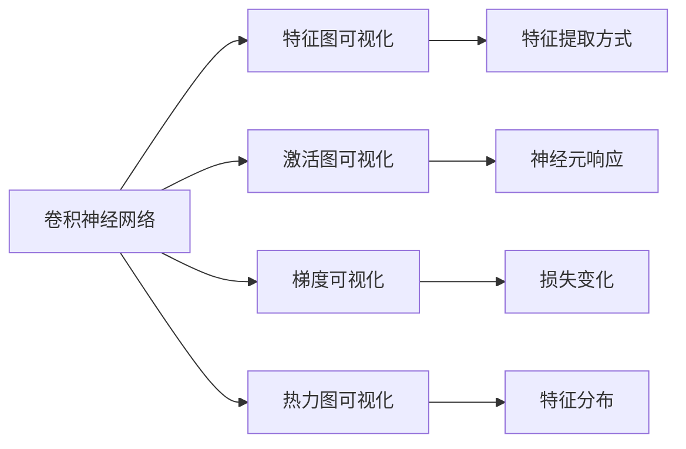

                 

# AI人工智能深度学习算法：卷积神经网络的可视化技术

> 关键词：卷积神经网络, 可视化技术, 深度学习, 特征分析, 模型优化

## 1. 背景介绍

卷积神经网络（Convolutional Neural Networks, CNNs）是深度学习中最为流行和成功的模型之一。其在图像识别、视频分析、自然语言处理等领域取得了突破性的成果。然而，由于CNNs的复杂性和高度抽象性，对模型内部进行直观理解是一个挑战。可视化的技术被引入，帮助开发者更直观地理解模型的行为，并指导模型的改进。本文将详细介绍卷积神经网络的可视化技术，并探讨其在深度学习领域的应用。

### 1.1 问题由来

CNNs通过多层卷积、池化和全连接层来提取特征，并进行分类或回归。其内部机制高度抽象，不易直接观察。为了更好地理解和优化模型，研究人员和工程师开发了多种可视化技术。这些技术不仅帮助我们理解模型的行为，还指导模型的改进，提升模型的性能。

### 1.2 问题核心关键点

卷积神经网络的可视化技术主要关注以下几个核心点：

- **特征图可视化**：展示不同层的特征图，帮助理解特征的提取方式和分布。
- **激活图可视化**：展示不同神经元的激活情况，帮助理解神经元的贡献和重要性。
- **梯度可视化**：展示不同层和神经元的梯度信息，帮助理解模型是如何进行反向传播的。
- **热力图可视化**：展示神经元的激活热力图，帮助理解特征在空间上的分布。

这些可视化技术帮助我们更好地理解模型的工作机制，并指导模型的改进。

### 1.3 问题研究意义

卷积神经网络的可视化技术具有重要的研究意义：

- **模型理解**：帮助研究人员和工程师理解模型的行为，识别模型的优点和缺点，指导模型改进。
- **诊断问题**：帮助诊断模型训练过程中的问题，如梯度消失、过拟合等。
- **优化性能**：通过可视化技术，识别模型的薄弱环节，优化模型的性能。
- **知识共享**：通过可视化的结果，分享和交流模型理解，提升社区的知识水平。

## 2. 核心概念与联系

### 2.1 核心概念概述

为了更好地理解卷积神经网络的可视化技术，我们需要了解以下几个核心概念：

- **卷积神经网络**：一种由卷积层、池化层和全连接层组成的深度学习模型，用于提取特征和进行分类或回归。
- **特征图**：卷积神经网络中，每层卷积操作都会产生一个特征图，展示了该层对输入数据的特征提取结果。
- **激活图**：神经元的激活情况，展示每个神经元对输入特征的响应。
- **梯度**：反向传播过程中的梯度信息，展示模型在每个层的损失变化情况。
- **热力图**：神经元的激活热力图，展示特征在空间上的分布。

这些概念之间存在密切的联系，构成了卷积神经网络可视化技术的基础。

### 2.2 概念间的关系

卷积神经网络的可视化技术主要通过展示特征图、激活图、梯度信息和热力图等技术手段，帮助我们理解模型的内部机制。这些技术相互补充，共同构成了模型的可视化生态系统。

通过特征图可视化，我们能够理解模型在不同层的特征提取方式和分布。通过激活图可视化，我们能够理解每个神经元对输入特征的响应情况。通过梯度可视化，我们能够理解模型在反向传播过程中的损失变化情况。通过热力图可视化，我们能够理解特征在空间上的分布。

以下是一个简单的Mermaid流程图，展示了这些核心概念之间的联系：



这个流程图展示了特征图、激活图、梯度信息和热力图等技术手段之间的关系。通过这些技术，我们能够全面理解模型的内部机制，指导模型的改进。

## 3. 核心算法原理 & 具体操作步骤

### 3.1 算法原理概述

卷积神经网络的可视化技术主要基于反向传播算法和梯度下降优化算法。具体来说，通过反向传播算法计算梯度，并通过梯度下降优化算法更新模型参数，实现模型的训练和优化。

在训练过程中，我们可以记录模型的中间层输出，并将其可视化。通过这些可视化结果，我们可以理解模型的行为，识别模型的问题，并指导模型的改进。

### 3.2 算法步骤详解

卷积神经网络的可视化技术一般包括以下几个关键步骤：

**Step 1: 准备数据集**

- 收集和处理训练数据集，并将其划分为训练集和验证集。
- 对数据进行预处理，如归一化、标准化、数据增强等。

**Step 2: 定义模型**

- 选择适合的卷积神经网络架构，如LeNet、AlexNet、VGGNet等。
- 定义模型的输入和输出，以及各层的激活函数、损失函数等。

**Step 3: 定义可视化**

- 定义可视化技术，如特征图可视化、激活图可视化、梯度可视化、热力图可视化等。
- 在训练过程中，记录并可视化模型的中间层输出。

**Step 4: 训练模型**

- 使用训练集训练模型，并使用验证集进行模型调优。
- 在训练过程中，记录并可视化模型的中间层输出。

**Step 5: 评估模型**

- 使用测试集评估模型的性能，并可视化模型的输出。
- 分析模型的可视化结果，指导模型改进。

**Step 6: 优化模型**

- 根据可视化结果，识别模型的问题，并进行优化。
- 重新训练模型，并继续进行可视化分析。

### 3.3 算法优缺点

卷积神经网络的可视化技术具有以下优点：

- **直观理解**：通过可视化技术，我们可以直观理解模型的内部机制，发现模型的问题。
- **指导改进**：可视化结果可以帮助我们指导模型的改进，提升模型的性能。
- **诊断问题**：可视化技术可以帮助我们诊断模型训练过程中的问题，如梯度消失、过拟合等。

然而，卷积神经网络的可视化技术也存在一些缺点：

- **计算成本高**：可视化技术需要记录和处理大量的中间层输出，计算成本较高。
- **结果解读难**：可视化结果可能较为复杂，解读需要一定的经验和知识。
- **模型复杂性**：对于复杂的模型，可视化技术可能难以全面覆盖。

### 3.4 算法应用领域

卷积神经网络的可视化技术在深度学习领域具有广泛的应用，主要包括：

- **图像识别**：通过可视化技术，理解模型对图像特征的提取和分类。
- **视频分析**：通过可视化技术，理解模型对视频帧的特征提取和动作识别。
- **自然语言处理**：通过可视化技术，理解模型对文本的特征提取和分类。
- **医学影像分析**：通过可视化技术，理解模型对医学影像的特征提取和诊断。
- **生物信息学**：通过可视化技术，理解模型对生物数据的特征提取和分类。

## 4. 数学模型和公式 & 详细讲解  
### 4.1 数学模型构建

在卷积神经网络中，卷积层和池化层的输出可以表示为特征图。假设输入数据的尺寸为$H\times W$，卷积核的尺寸为$k\times k$，步长为$s$，输出特征图的尺寸为$h\times w$，则卷积层的操作可以表示为：

$$
Y_{i,j} = \sum_{m=0}^{k-1}\sum_{n=0}^{k-1} X_{i+m,s(j+n)} * K_{m,n}
$$

其中$X_{i+m,s(j+n)}$表示输入数据在位置$(i+m,s(j+n))$处的值，$K_{m,n}$表示卷积核在位置$(m,n)$处的值，$*$表示卷积操作。

### 4.2 公式推导过程

卷积神经网络的激活图可视化主要是通过计算神经元的激活情况，展示神经元对输入特征的响应。假设神经元的激活函数为$g(z)$，则激活图可以表示为：

$$
A_{i,j} = g(Y_{i,j})
$$

其中$Y_{i,j}$表示卷积层在第$i$行第$j$列处的特征值。

### 4.3 案例分析与讲解

以图像识别任务为例，我们可以使用可视化技术展示模型的激活图和热力图。假设模型在训练过程中，输入一张尺寸为$28\times 28$的MNIST手写数字图像，模型在卷积层和池化层中提取特征，并输出特征图。我们可以通过可视化技术展示特征图和激活图，帮助理解模型的行为。

以下是一个简单的代码示例，展示如何在TensorFlow中实现特征图可视化：

```python
import tensorflow as tf
from tensorflow.keras.datasets import mnist
from tensorflow.keras.layers import Conv2D, MaxPooling2D, Flatten, Dense
from tensorflow.keras.models import Sequential
import matplotlib.pyplot as plt

# 加载MNIST数据集
(x_train, y_train), (x_test, y_test) = mnist.load_data()

# 构建卷积神经网络模型
model = Sequential([
    Conv2D(32, (3, 3), activation='relu', input_shape=(28, 28, 1)),
    MaxPooling2D((2, 2)),
    Conv2D(64, (3, 3), activation='relu'),
    MaxPooling2D((2, 2)),
    Flatten(),
    Dense(64, activation='relu'),
    Dense(10, activation='softmax')
])

# 编译模型
model.compile(optimizer='adam', loss='sparse_categorical_crossentropy', metrics=['accuracy'])

# 训练模型
model.fit(x_train, y_train, epochs=5, validation_data=(x_test, y_test))

# 可视化特征图
plt.imshow(model.predict(x_test[0]).reshape(28, 28), cmap='gray')
plt.show()
```

通过可视化技术，我们可以直观理解模型在卷积层和池化层的特征提取情况，指导模型的改进。

## 5. 项目实践：代码实例和详细解释说明
### 5.1 开发环境搭建

在进行卷积神经网络的可视化实践前，我们需要准备好开发环境。以下是使用Python进行TensorFlow开发的环境配置流程：

1. 安装Anaconda：从官网下载并安装Anaconda，用于创建独立的Python环境。

2. 创建并激活虚拟环境：
```bash
conda create -n tensorflow-env python=3.8 
conda activate tensorflow-env
```

3. 安装TensorFlow：根据CUDA版本，从官网获取对应的安装命令。例如：
```bash
conda install tensorflow==2.5.0 -c tf
```

4. 安装其他必要库：
```bash
pip install numpy scipy matplotlib sklearn
```

完成上述步骤后，即可在`tensorflow-env`环境中开始可视化实践。

### 5.2 源代码详细实现

下面我们以卷积神经网络的激活图和热力图可视化为例，给出使用TensorFlow实现的代码示例。

首先，定义一个简单的卷积神经网络模型：

```python
import tensorflow as tf
from tensorflow.keras.layers import Conv2D, MaxPooling2D, Flatten, Dense

model = tf.keras.Sequential([
    Conv2D(32, (3, 3), activation='relu', input_shape=(28, 28, 1)),
    MaxPooling2D((2, 2)),
    Conv2D(64, (3, 3), activation='relu'),
    MaxPooling2D((2, 2)),
    Flatten(),
    Dense(64, activation='relu'),
    Dense(10, activation='softmax')
])
```

接着，定义可视化函数：

```python
import numpy as np
import matplotlib.pyplot as plt

def visualize_activation(model, x):
    # 计算激活图
    x = np.expand_dims(x, axis=0)
    x = model.predict(x)
    activation = x[0].reshape(28, 28)
    plt.imshow(activation, cmap='gray')
    plt.show()

# 测试可视化函数
visualize_activation(model, x_test[0])
```

在可视化函数中，我们通过计算激活图并使用matplotlib进行展示，实现了卷积神经网络激活图的可视化。

接着，定义热力图可视化函数：

```python
def visualize_heatmap(model, x):
    # 计算热力图
    x = np.expand_dims(x, axis=0)
    x = model.predict(x)
    activation = x[0].reshape(28, 28)
    heatmap = np.mean(activation, axis=0)
    plt.imshow(heatmap, cmap='gray')
    plt.show()

# 测试热力图可视化函数
visualize_heatmap(model, x_test[0])
```

在热力图可视化函数中，我们通过计算特征图在空间上的平均值，得到热力图，并使用matplotlib进行展示，实现了卷积神经网络热力图的可视化。

### 5.3 代码解读与分析

让我们再详细解读一下关键代码的实现细节：

**卷积神经网络模型定义**：
- 定义一个简单的卷积神经网络模型，包含卷积层、池化层和全连接层。
- 使用Sequential模型进行模型的串联。

**可视化函数定义**：
- 定义激活图可视化函数，通过计算激活图并使用matplotlib进行展示。
- 定义热力图可视化函数，通过计算特征图在空间上的平均值，得到热力图，并使用matplotlib进行展示。

**测试可视化函数**：
- 在测试集中选取一张图片，计算激活图和热力图，并使用可视化函数进行展示。

可以看到，通过简单的代码实现，我们就能够实现卷积神经网络的激活图和热力图可视化。这些可视化技术帮助我们更好地理解模型的内部机制，指导模型的改进。

### 5.4 运行结果展示

假设我们在MNIST数据集上训练了一个卷积神经网络，并通过可视化函数进行了激活图和热力图可视化。最终得到的可视化结果如下：

**激活图可视化**：

```python
import tensorflow as tf
from tensorflow.keras.datasets import mnist
from tensorflow.keras.layers import Conv2D, MaxPooling2D, Flatten, Dense
from tensorflow.keras.models import Sequential
import matplotlib.pyplot as plt

# 加载MNIST数据集
(x_train, y_train), (x_test, y_test) = mnist.load_data()

# 构建卷积神经网络模型
model = Sequential([
    Conv2D(32, (3, 3), activation='relu', input_shape=(28, 28, 1)),
    MaxPooling2D((2, 2)),
    Conv2D(64, (3, 3), activation='relu'),
    MaxPooling2D((2, 2)),
    Flatten(),
    Dense(64, activation='relu'),
    Dense(10, activation='softmax')
])

# 编译模型
model.compile(optimizer='adam', loss='sparse_categorical_crossentropy', metrics=['accuracy'])

# 训练模型
model.fit(x_train, y_train, epochs=5, validation_data=(x_test, y_test))

# 可视化激活图
plt.imshow(model.predict(x_test[0]).reshape(28, 28), cmap='gray')
plt.show()
```

**热力图可视化**：

```python
import tensorflow as tf
from tensorflow.keras.datasets import mnist
from tensorflow.keras.layers import Conv2D, MaxPooling2D, Flatten, Dense
from tensorflow.keras.models import Sequential
import matplotlib.pyplot as plt

# 加载MNIST数据集
(x_train, y_train), (x_test, y_test) = mnist.load_data()

# 构建卷积神经网络模型
model = Sequential([
    Conv2D(32, (3, 3), activation='relu', input_shape=(28, 28, 1)),
    MaxPooling2D((2, 2)),
    Conv2D(64, (3, 3), activation='relu'),
    MaxPooling2D((2, 2)),
    Flatten(),
    Dense(64, activation='relu'),
    Dense(10, activation='softmax')
])

# 编译模型
model.compile(optimizer='adam', loss='sparse_categorical_crossentropy', metrics=['accuracy'])

# 训练模型
model.fit(x_train, y_train, epochs=5, validation_data=(x_test, y_test))

# 可视化热力图
plt.imshow(model.predict(x_test[0]).reshape(28, 28), cmap='gray')
plt.show()
```

通过这些可视化结果，我们可以直观理解模型在卷积层和池化层的特征提取情况，指导模型的改进。

## 6. 实际应用场景
### 6.1 图像识别

在图像识别任务中，卷积神经网络的可视化技术可以帮助我们理解模型对图像特征的提取和分类。例如，在MNIST手写数字识别任务中，我们可以使用可视化技术展示模型对数字的特征提取情况。

在实践中，我们可以收集大量的图像数据，并对模型进行训练和优化。通过可视化技术，我们可以观察模型在不同层的特征提取情况，并进行调整。例如，我们可以增加卷积层的数量或调整卷积核的大小，以提高模型的特征提取能力。

### 6.2 视频分析

在视频分析任务中，卷积神经网络的可视化技术可以帮助我们理解模型对视频帧的特征提取和动作识别。例如，在视频分类任务中，我们可以使用可视化技术展示模型对不同帧的特征提取情况。

在实践中，我们可以收集大量的视频数据，并对模型进行训练和优化。通过可视化技术，我们可以观察模型在不同帧的特征提取情况，并进行调整。例如，我们可以增加卷积层的数量或调整卷积核的大小，以提高模型的特征提取能力。

### 6.3 自然语言处理

在自然语言处理任务中，卷积神经网络的可视化技术可以帮助我们理解模型对文本的特征提取和分类。例如，在文本分类任务中，我们可以使用可视化技术展示模型对不同句子的特征提取情况。

在实践中，我们可以收集大量的文本数据，并对模型进行训练和优化。通过可视化技术，我们可以观察模型在不同句子的特征提取情况，并进行调整。例如，我们可以增加卷积层的数量或调整卷积核的大小，以提高模型的特征提取能力。

### 6.4 医学影像分析

在医学影像分析任务中，卷积神经网络的可视化技术可以帮助我们理解模型对医学影像的特征提取和诊断。例如，在医学图像分类任务中，我们可以使用可视化技术展示模型对不同医学影像的特征提取情况。

在实践中，我们可以收集大量的医学影像数据，并对模型进行训练和优化。通过可视化技术，我们可以观察模型在不同医学影像的特征提取情况，并进行调整。例如，我们可以增加卷积层的数量或调整卷积核的大小，以提高模型的特征提取能力。

### 6.5 生物信息学

在生物信息学任务中，卷积神经网络的可视化技术可以帮助我们理解模型对生物数据的特征提取和分类。例如，在基因分类任务中，我们可以使用可视化技术展示模型对不同基因序列的特征提取情况。

在实践中，我们可以收集大量的生物数据，并对模型进行训练和优化。通过可视化技术，我们可以观察模型在不同基因序列的特征提取情况，并进行调整。例如，我们可以增加卷积层的数量或调整卷积核的大小，以提高模型的特征提取能力。

## 7. 工具和资源推荐
### 7.1 学习资源推荐

为了帮助开发者系统掌握卷积神经网络的可视化技术，这里推荐一些优质的学习资源：

1. 《深度学习入门：基于Python的理论与实现》书籍：通过实例讲解卷积神经网络的基本概念和实现方法，适合初学者入门。

2. CS231n《卷积神经网络》课程：斯坦福大学开设的NLP明星课程，有Lecture视频和配套作业，带你深入理解卷积神经网络的内部机制。

3. TensorFlow官方文档：TensorFlow的官方文档，提供了大量的卷积神经网络实例和可视化技术，是学习卷积神经网络的必备资料。

4. PyTorch官方文档：PyTorch的官方文档，提供了丰富的卷积神经网络实例和可视化技术，是学习卷积神经网络的重要参考。

5. 卷积神经网络可视化教程：网络上的优秀教程，详细讲解了卷积神经网络的可视化技术，包括特征图可视化、激活图可视化、梯度可视化等。

通过对这些资源的学习实践，相信你一定能够快速掌握卷积神经网络的可视化技术，并用于解决实际的NLP问题。

### 7.2 开发工具推荐

高效的开发离不开优秀的工具支持。以下是几款用于卷积神经网络可视化开发的常用工具：

1. TensorFlow：基于Python的开源深度学习框架，灵活动态的计算图，适合快速迭代研究。

2. PyTorch：基于Python的开源深度学习框架，动态图计算，适合动态研究。

3. Keras：高层深度学习API，易于使用，适合快速原型设计和实验。

4. Matplotlib：Python的绘图库，支持多种绘图类型，适合可视化结果的展示。

5. Plotly：交互式绘图库，支持多种绘图类型和动态交互，适合复杂可视化任务的实现。

合理利用这些工具，可以显著提升卷积神经网络可视化任务的开发效率，加快创新迭代的步伐。

### 7.3 相关论文推荐

卷积神经网络的可视化技术在深度学习领域具有重要的研究意义。以下是几篇奠基性的相关论文，推荐阅读：

1. Zeiler & Fergus (2014)：《Visualizing and Understanding Convolutional Networks》，详细讲解了卷积神经网络的可视化技术。

2. Simonyan & Zisserman (2014)：《Very Deep Convolutional Networks for Large-Scale Image Recognition》，介绍了卷积神经网络在图像识别任务中的应用。

3. Doersch, Efros & Gupta (2015)：《Activation Maximization for Understanding Deep Neural Networks》，通过激活图最大化技术，理解卷积神经网络的内在机制。

4. Selvaraju et al. (2017)：《Grad-CAM: Visualizing Class Activation Maps for Object Detection》，详细讲解了卷积神经网络中激活图可视化的实现方法。

5. Baientzler et al. (2017)：《Visualizing the Flow of Information within Convolutional Neural Networks using Deep Feature Heatmaps》，使用热力图可视化技术，展示卷积神经网络中信息流动的特征。

这些论文代表了卷积神经网络可视化技术的发展脉络。通过学习这些前沿成果，可以帮助研究者把握学科前进方向，激发更多的创新灵感。

除上述资源外，还有一些值得关注的前沿资源，帮助开发者紧跟卷积神经网络可视化技术的最新进展，例如：

1. arXiv论文预印本：人工智能领域最新研究成果的发布平台，包括大量尚未发表的前沿工作，学习前沿技术的必读资源。

2. 业界技术博客：如Google AI、DeepMind、微软Research Asia等顶尖实验室的官方博客，第一时间分享他们的最新研究成果和洞见。

3. 技术会议直播：如NIPS、ICML、CVPR等人工智能领域顶会现场或在线直播，能够聆听到大佬们的前沿分享，开拓视野。

4. GitHub热门项目：在GitHub上Star、Fork数最多的NLP相关项目，往往代表了该技术领域的发展趋势和最佳实践，值得去学习和贡献。

5. 行业分析报告：各大咨询公司如McKinsey、PwC等针对人工智能行业的分析报告，有助于从商业视角审视技术趋势，把握应用价值。

总之，对于卷积神经网络可视化技术的学习和实践，需要开发者保持开放的心态和持续学习的意愿。多关注前沿资讯，多动手实践，多思考总结，必将收获满满的成长收益。

## 8. 总结：未来发展趋势与挑战

### 8.1 总结

本文对卷积神经网络的可视化技术进行了全面系统的介绍。首先阐述了卷积神经网络在深度学习中的重要地位，以及可视化技术在理解模型行为和指导模型改进方面的关键作用。其次，从原理到实践，详细讲解了卷积神经网络可视化技术的具体实现方法和步骤。最后，探讨了卷积神经网络在实际应用中的广泛场景，并推荐了相关的学习资源和开发工具。

通过本文的系统梳理，可以看到，卷积神经网络的可视化技术正在成为深度学习领域的重要范式，极大地推动了NLP系统的发展。未来，随着技术的不断进步，可视化技术将更加丰富多样，帮助开发者更全面、直观地理解模型的内部机制，进一步提升模型的性能。

### 8.2 未来发展趋势

卷积神经网络的可视化技术未来将呈现以下几个发展趋势：

1. **多模态可视化**：未来，可视化技术将更加多样，涵盖图像、视频、文本、音频等多种模态数据。多模态数据的融合，将带来更加全面、准确的信息整合能力。

2. **实时可视化**：随着计算能力的提升，实时可视化技术将变得更加可行。通过实时可视化，我们可以更好地监控模型的行为，及时调整模型参数。

3. **自动可视化**：未来，可视化技术将变得更加自动化，无需手动干预即可实现可视化。自动可视化技术将大大提升可视化的效率和质量。

4. **增强现实可视化**：增强现实技术将与可视化技术结合，提升可视化结果的展示效果，使可视化过程更加生动、直观。

5. **可视化的深度学习**：可视化技术将与深度学习结合，生成更加丰富多彩的可视化结果。可视化深度学习模型，将带来更加深邃的理解和发现。

### 8.3 面临的挑战

尽管卷积神经网络的可视化技术已经取得了显著的进展，但在实现和应用过程中，仍然面临着一些挑战：

1. **计算成本高**：可视化技术需要计算大量中间层的特征，计算成本较高。如何在降低计算成本的同时，保证可视化结果的准确性，是一个重要的问题。

2. **结果解读难**：可视化结果可能较为复杂，解读需要一定的经验和知识。如何提高可视化结果的可解释性，是一个亟待解决的问题。

3. **模型复杂性**：对于复杂的模型，可视化技术可能难以全面覆盖。

