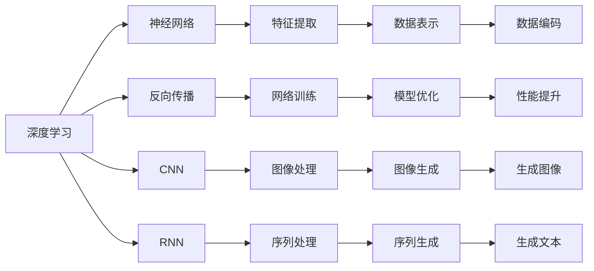
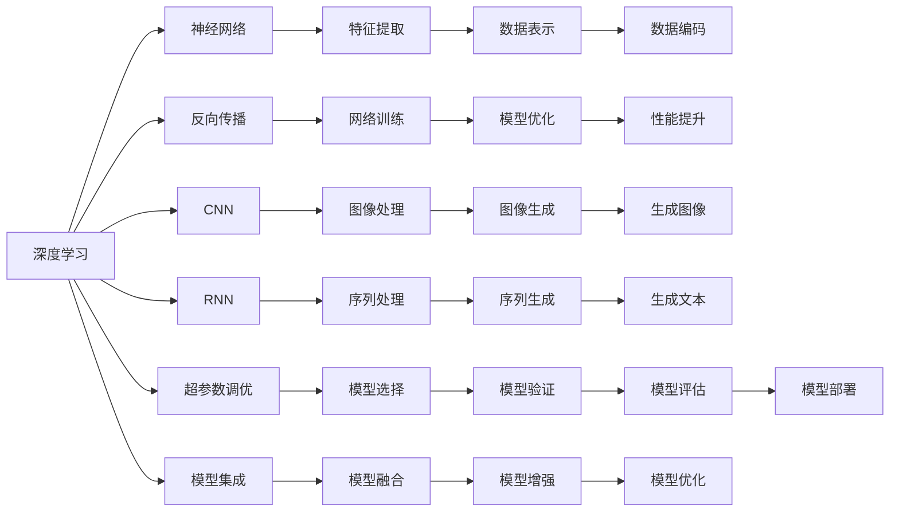

                 

## 1. 背景介绍

人工智能（AI）正逐步成为推动科技发展的核心引擎，而深度学习算法作为AI的重要组成部分，其未来应用的可能性在多个领域展现出了巨大潜力。本篇文章将深入探讨深度学习算法的核心原理，并展望其未来在各行各业的应用前景。

### 1.1 人工智能与深度学习

人工智能旨在创建能够完成复杂任务的智能系统，包括识别、理解和学习。深度学习作为AI的关键技术之一，通过构建多层神经网络，模仿人类大脑的计算过程，实现了许多领域的突破。从图像识别、语音识别到自然语言处理，深度学习展现了强大的学习能力。

### 1.2 深度学习的发展历程

深度学习源于20世纪80年代，最初在学术界主要用于处理视觉图像。1988年，Yann LeCun等人在《Learning Invariant Representations》中首次引入了卷积神经网络（CNN），用于识别手写数字。然而，深度学习的真正突破发生在2012年，AlexNet在ImageNet图像识别竞赛中取得了胜利，标志着深度学习在计算机视觉领域的崛起。此后，深度学习技术迅速扩展至自然语言处理、语音识别、推荐系统等多个领域，并持续推动AI技术的进步。

## 2. 核心概念与联系

### 2.1 核心概念概述

为了更好地理解深度学习算法及其应用，我们首先介绍几个核心概念：

- **深度学习**：通过构建深层神经网络，模仿人类大脑的工作方式，自动学习复杂特征，进行模式识别和预测。

- **神经网络**：由多个神经元（节点）通过连接组成的层次结构，能够自动提取输入数据的特征。

- **反向传播算法**：通过梯度下降等优化算法，反向传播误差，更新网络参数，是深度学习模型的核心训练方法。

- **卷积神经网络（CNN）**：一种专门用于处理图像的深度学习模型，通过卷积和池化操作，自动提取图像特征。

- **循环神经网络（RNN）**：用于处理序列数据的神经网络模型，能够处理时间序列数据，如语音、文本等。

- **生成对抗网络（GAN）**：由生成器和判别器两个网络组成，通过对抗训练，生成高质量的图像、视频等。

### 2.2 概念间的关系

这些核心概念之间存在着密切的联系，形成了深度学习算法的整体架构。以下是一个简化的Mermaid流程图，展示了这些概念之间的关系：



这个流程图展示了深度学习的基本流程和关键组件：

1. 深度学习通过神经网络自动学习输入数据的特征表示。
2. 反向传播算法用于更新神经网络的权重和偏置，优化模型。
3. CNN和RNN分别用于图像和序列数据的处理。
4. 生成对抗网络用于生成高质量的图像、视频等。

### 2.3 核心概念的整体架构

为了更清晰地展示深度学习算法的整体架构，我们绘制了一个更完整的流程图：



这个更详细的流程图展示了深度学习算法从数据输入到模型部署的全过程：

1. 深度学习通过神经网络自动学习输入数据的特征表示。
2. 反向传播算法用于更新神经网络的权重和偏置，优化模型。
3. CNN和RNN分别用于图像和序列数据的处理。
4. 生成对抗网络用于生成高质量的图像、视频等。
5. 超参数调优和模型集成用于提高模型的泛化能力和稳定性。
6. 模型验证和优化确保模型在实际应用中的表现。
7. 模型部署使得模型能够应用于实际场景。

## 3. 核心算法原理 & 具体操作步骤

### 3.1 算法原理概述

深度学习算法的核心原理是利用多层神经网络，通过反向传播算法自动学习输入数据的特征表示。其基本流程如下：

1. **数据准备**：收集和预处理输入数据。
2. **模型构建**：构建神经网络结构，定义损失函数和优化器。
3. **模型训练**：使用反向传播算法更新模型参数，最小化损失函数。
4. **模型评估**：使用测试集评估模型性能，进行模型调优。
5. **模型部署**：将训练好的模型应用于实际场景。

### 3.2 算法步骤详解

以下是一个具体的深度学习模型训练流程的详细描述：

**Step 1: 数据准备**

1. **数据收集**：收集与任务相关的数据集，如图像、文本、音频等。
2. **数据预处理**：对数据进行清洗、归一化、标准化等预处理，以便于模型训练。
3. **数据分割**：将数据集划分为训练集、验证集和测试集。

**Step 2: 模型构建**

1. **网络结构设计**：根据任务特点，选择适合的神经网络结构，如CNN、RNN、Transformer等。
2. **损失函数选择**：根据任务目标，选择合适的损失函数，如交叉熵损失、均方误差损失等。
3. **优化器选择**：选择适合的优化器，如SGD、Adam等，并设置学习率、批大小等超参数。

**Step 3: 模型训练**

1. **数据加载**：使用PyTorch等框架，将数据加载到模型中。
2. **前向传播**：将输入数据输入网络，计算输出。
3. **计算损失**：计算模型输出与真实标签之间的差异。
4. **反向传播**：使用反向传播算法计算梯度，更新模型参数。
5. **模型优化**：根据优化器更新模型参数，最小化损失函数。

**Step 4: 模型评估**

1. **验证集评估**：在验证集上评估模型性能，防止过拟合。
2. **调整超参数**：根据验证集评估结果，调整学习率、批大小等超参数。

**Step 5: 模型部署**

1. **模型保存**：保存训练好的模型参数，以便于后续使用。
2. **模型优化**：使用模型剪枝、量化等技术优化模型，减少资源消耗。
3. **模型部署**：将模型部署到实际应用环境中，如服务器、手机应用等。

### 3.3 算法优缺点

深度学习算法具有以下优点：

- **高效特征提取**：自动学习输入数据的特征表示，减少了手工特征工程的复杂性。
- **泛化能力强**：通过大规模数据训练，能够有效避免过拟合，提高模型泛化能力。
- **可扩展性强**：通过增加网络层数和节点数，可以处理更复杂的问题。

同时，深度学习算法也存在一些缺点：

- **计算资源消耗大**：需要大量的计算资源和内存，训练时间较长。
- **模型复杂度高**：深层网络难以解释，模型难以理解。
- **过拟合风险高**：在数据量不足的情况下，容易出现过拟合。

### 3.4 算法应用领域

深度学习算法在多个领域得到了广泛应用，包括但不限于：

- **计算机视觉**：图像分类、物体检测、人脸识别等。
- **自然语言处理**：机器翻译、文本分类、语音识别等。
- **推荐系统**：用户行为预测、商品推荐等。
- **医疗健康**：疾病诊断、影像分析等。
- **自动驾驶**：环境感知、路径规划等。
- **金融风控**：信用评估、欺诈检测等。

## 4. 数学模型和公式 & 详细讲解 & 举例说明

### 4.1 数学模型构建

深度学习模型的数学模型通常由以下几个部分组成：

- **输入数据**：$x \in \mathbb{R}^n$，表示输入特征向量。
- **网络参数**：$\theta \in \mathbb{R}^m$，表示网络中的权重和偏置。
- **隐藏层**：$h = f(Wx + b)$，表示神经元的输出。
- **输出层**：$y = g(hW^T + b)$，表示输出结果。
- **损失函数**：$\mathcal{L}$，表示模型输出与真实标签之间的差异。

### 4.2 公式推导过程

以下以图像分类为例，展示深度学习模型的数学推导过程：

设输入图像为 $x \in \mathbb{R}^{n \times 1}$，输出标签为 $y \in \mathbb{R}^{c \times 1}$，其中 $c$ 为类别数。模型由 $L$ 层神经网络组成，每层神经元的输出为 $h_l \in \mathbb{R}^{s_l \times 1}$，其中 $s_l$ 为第 $l$ 层神经元的数量。

定义每层的权重和偏置为 $W_l \in \mathbb{R}^{s_{l+1} \times s_l}$ 和 $b_l \in \mathbb{R}^{s_{l+1} \times 1}$，则第 $l$ 层的输出为：

$$
h_l = f(W_lh_{l-1} + b_l)
$$

其中 $f$ 为激活函数，如 ReLU、Sigmoid 等。

最终输出层的输出为：

$$
y = g(W_yh_L + b_y)
$$

其中 $W_y \in \mathbb{R}^{c \times s_L}$ 和 $b_y \in \mathbb{R}^{c \times 1}$，$g$ 为输出层的激活函数，如 Softmax。

模型的损失函数通常采用交叉熵损失，定义为：

$$
\mathcal{L} = -\frac{1}{N}\sum_{i=1}^N \sum_{j=1}^c y_j \log \hat{y}_j
$$

其中 $y_j$ 为第 $j$ 类别的真实标签，$\hat{y}_j$ 为模型预测的概率值。

### 4.3 案例分析与讲解

以下是一个简单的图像分类案例，展示了深度学习模型的训练和评估过程：

**Step 1: 数据准备**

1. **数据集准备**：使用CIFAR-10数据集，包含60,000张32x32彩色图像和10个类别。
2. **数据预处理**：对图像进行归一化，并将像素值转换为浮点数。

**Step 2: 模型构建**

1. **网络结构设计**：选择LeNet-5作为模型结构，包含卷积层、池化层、全连接层等。
2. **损失函数选择**：选择交叉熵损失作为模型输出与真实标签之间的差异。
3. **优化器选择**：选择Adam优化器，学习率为0.001，批大小为64。

**Step 3: 模型训练**

1. **数据加载**：使用PyTorch框架，将数据加载到模型中。
2. **前向传播**：将输入图像输入网络，计算输出。
3. **计算损失**：计算模型输出与真实标签之间的差异。
4. **反向传播**：使用反向传播算法计算梯度，更新模型参数。
5. **模型优化**：根据Adam优化器更新模型参数，最小化损失函数。

**Step 4: 模型评估**

1. **验证集评估**：在验证集上评估模型性能，防止过拟合。
2. **调整超参数**：根据验证集评估结果，调整学习率、批大小等超参数。

**Step 5: 模型部署**

1. **模型保存**：保存训练好的模型参数，以便于后续使用。
2. **模型优化**：使用模型剪枝、量化等技术优化模型，减少资源消耗。
3. **模型部署**：将模型部署到实际应用环境中，如服务器、手机应用等。

## 5. 项目实践：代码实例和详细解释说明

### 5.1 开发环境搭建

在进行深度学习项目实践前，我们需要准备好开发环境。以下是使用Python进行PyTorch开发的环境配置流程：

1. 安装Anaconda：从官网下载并安装Anaconda，用于创建独立的Python环境。

2. 创建并激活虚拟环境：
```bash
conda create -n pytorch-env python=3.8 
conda activate pytorch-env
```

3. 安装PyTorch：根据CUDA版本，从官网获取对应的安装命令。例如：
```bash
conda install pytorch torchvision torchaudio cudatoolkit=11.1 -c pytorch -c conda-forge
```

4. 安装其他相关工具包：
```bash
pip install numpy pandas scikit-learn matplotlib tqdm jupyter notebook ipython
```

完成上述步骤后，即可在`pytorch-env`环境中开始深度学习项目实践。

### 5.2 源代码详细实现

以下是一个简单的图像分类项目代码实现：

```python
import torch
import torchvision
import torch.nn as nn
import torch.optim as optim
import torchvision.transforms as transforms
from torch.utils.data import DataLoader
from torchvision.datasets import CIFAR10

# 数据预处理
transform_train = transforms.Compose([
    transforms.RandomCrop(32, padding=4),
    transforms.RandomHorizontalFlip(),
    transforms.ToTensor(),
    transforms.Normalize((0.4914, 0.4822, 0.4465), (0.2023, 0.1994, 0.2010))
])

transform_test = transforms.Compose([
    transforms.ToTensor(),
    transforms.Normalize((0.4914, 0.4822, 0.4465), (0.2023, 0.1994, 0.2010))
])

train_dataset = CIFAR10(root='./data', train=True, download=True, transform=transform_train)
test_dataset = CIFAR10(root='./data', train=False, download=True, transform=transform_test)

train_loader = DataLoader(train_dataset, batch_size=64, shuffle=True)
test_loader = DataLoader(test_dataset, batch_size=64, shuffle=False)

# 定义模型
model = nn.Sequential(
    nn.Conv2d(3, 6, 5),
    nn.ReLU(inplace=True),
    nn.MaxPool2d(2, 2),
    nn.Conv2d(6, 16, 5),
    nn.ReLU(inplace=True),
    nn.MaxPool2d(2, 2),
    nn.Linear(16 * 5 * 5, 120),
    nn.ReLU(inplace=True),
    nn.Linear(120, 84),
    nn.ReLU(inplace=True),
    nn.Linear(84, 10)
)

# 定义优化器和损失函数
optimizer = optim.Adam(model.parameters(), lr=0.001)
criterion = nn.CrossEntropyLoss()

# 训练模型
for epoch in range(10):
    train_loss = 0.0
    train_correct = 0
    for data, target in train_loader:
        output = model(data)
        loss = criterion(output, target)
        optimizer.zero_grad()
        loss.backward()
        optimizer.step()
        train_loss += loss.item()
        _, predicted = output.max(1)
        train_correct += predicted.eq(target).sum().item()

    train_loss /= len(train_loader.dataset)
    train_acc = train_correct / len(train_loader.dataset)

    print(f'Epoch {epoch + 1}, train loss: {train_loss:.4f}, train acc: {train_acc:.2f}')

# 评估模型
model.eval()
with torch.no_grad():
    test_loss = 0.0
    test_correct = 0
    for data, target in test_loader:
        output = model(data)
        loss = criterion(output, target)
        test_loss += loss.item()
        _, predicted = output.max(1)
        test_correct += predicted.eq(target).sum().item()

    test_loss /= len(test_loader.dataset)
    test_acc = test_correct / len(test_loader.dataset)

print(f'Test loss: {test_loss:.4f}, test acc: {test_acc:.2f}')
```

### 5.3 代码解读与分析

让我们再详细解读一下关键代码的实现细节：

**数据预处理**

1. **transform_train和transform_test**：定义训练集和测试集的数据预处理函数，包括随机裁剪、水平翻转、归一化等操作。
2. **CIFAR10数据集**：使用CIFAR-10数据集，包含60,000张32x32彩色图像和10个类别。

**模型构建**

1. **nn.Sequential**：使用PyTorch的Sequential容器，按照顺序构建卷积层、激活函数、池化层、全连接层等。
2. **nn.Conv2d和nn.Linear**：定义卷积层和全连接层的参数和激活函数。
3. **nn.ReLU**：定义激活函数，如ReLU。

**优化器和损失函数**

1. **Adam优化器**：选择Adam优化器，学习率为0.001。
2. **CrossEntropyLoss**：定义交叉熵损失函数。

**模型训练**

1. **for循环**：迭代10个epoch，每次训练64张图片。
2. **optimizer.zero_grad()**：在每次前向传播前清空梯度。
3. **loss.backward()**：反向传播计算梯度。
4. **optimizer.step()**：根据梯度更新模型参数。

**模型评估**

1. **model.eval()**：将模型设置为评估模式，关闭dropout。
2. **with torch.no_grad()**：在评估过程中关闭梯度计算，提高效率。
3. **test_loss和test_correct**：计算测试集上的损失和正确率。

**模型部署**

1. **模型保存**：保存训练好的模型参数，以便于后续使用。
2. **模型优化**：使用模型剪枝、量化等技术优化模型，减少资源消耗。
3. **模型部署**：将模型部署到实际应用环境中，如服务器、手机应用等。

## 6. 实际应用场景

### 6.1 医疗影像分析

深度学习在医疗影像分析中展现了巨大的潜力，可以辅助医生进行疾病诊断和影像分析。通过构建卷积神经网络（CNN），深度学习可以从医学影像中自动提取特征，识别出病灶、肿瘤等异常区域，帮助医生进行快速、准确的诊断。

**实际应用案例**：
1. **乳腺癌检测**：使用深度学习模型对乳腺X光片和MRI图像进行分类，帮助医生早期发现乳腺癌。
2. **肺结节检测**：使用深度学习模型对CT图像进行病灶检测，辅助医生进行肺癌诊断。

### 6.2 自动驾驶

深度学习在自动驾驶中用于环境感知和决策制定。通过构建卷积神经网络（CNN）和循环神经网络（RNN），深度学习可以从传感器数据中提取特征，识别出道路、车辆、行人等，帮助自动驾驶系统做出决策。

**实际应用案例**：
1. **交通标志识别**：使用深度学习模型识别交通标志，帮助自动驾驶系统判断交通规则。
2. **行人检测**：使用深度学习模型检测行人，避免碰撞事故。

### 6.3 智能推荐系统

深度学习在智能推荐系统中用于用户行为预测和商品推荐。通过构建卷积神经网络（CNN）和循环神经网络（RNN），深度学习可以分析用户的历史行为数据，预测其未来的兴趣和需求，提供个性化的商品推荐。

**实际应用案例**：
1. **电商推荐**：使用深度学习模型推荐用户可能感兴趣的商品，提高电商平台的转化率。
2. **内容推荐**：使用深度学习模型推荐用户可能感兴趣的文章、视频等，提升用户黏性。

## 7. 工具和资源推荐

### 7.1 学习资源推荐

为了帮助开发者系统掌握深度学习算法的理论基础和实践技巧，这里推荐一些优质的学习资源：

1. **《深度学习》书籍**：Ian Goodfellow等人著作，全面介绍了深度学习的基本原理和算法。
2. **《动手学深度学习》**：李沐等人编写，提供了深度学习算法的Python实现，适合动手实践。
3. **Coursera深度学习课程**：由斯坦福大学Andrew Ng教授讲授，涵盖了深度学习的基本概念和算法。
4. **DeepLearning.ai深度学习专项课程**：包含多个深度学习课程，从入门到进阶，系统讲解深度学习技术。
5. **Kaggle竞赛平台**：提供大量深度学习实践项目，供开发者练手。

### 7.2 开发工具推荐

高效的开发离不开优秀的工具支持。以下是几款用于深度学习算法开发的常用工具：

1. **PyTorch**：基于Python的开源深度学习框架，灵活高效，支持动态图和静态图两种模式。
2. **TensorFlow**：由Google主导开发的深度学习框架，支持多种平台和设备，易于部署。
3. **MXNet**：由Apache开发的深度学习框架，支持多种编程语言和平台，灵活性高。
4. **JAX**：基于NumPy的深度学习框架，支持自动微分和分布式计算，性能优秀。
5. **TensorBoard**：TensorFlow配套的可视化工具，可实时监测模型训练状态，提供丰富的图表展示。

### 7.3 相关论文推荐

深度学习算法的快速发展离不开学界的持续研究。以下是几篇奠基性的相关论文，推荐阅读：

1. **ImageNet Large Scale Visual Recognition Challenge**：AlexNet的胜利引发了深度学习在计算机视觉领域的广泛应用。
2. **Efficient Backprop**：反向传播算法的经典论文，奠定了深度学习训练的基础。
3. **LeNet-5**：Yann LeCun等人在1998年提出的卷积神经网络，开启了深度学习在图像处理中的应用。
4. **ResNet**：He等人提出的残差网络，解决了深层网络退化问题，提高了深度学习模型的性能。
5. **Transformer**：Vaswani等人提出的自注意力机制，提高了深度学习模型的效率和性能。

## 8. 总结：未来发展趋势与挑战

### 8.1 研究成果总结

深度学习算法在多个领域已经取得了显著的成果，展示了其强大的应用潜力。从计算机视觉到自然语言处理，从推荐系统到医疗影像分析，深度学习技术正在逐步改变各个行业的面貌。

### 8.2 未来发展趋势

未来，深度学习算法的发展趋势如下：

1. **模型规模不断增大**：随着计算资源的增加，深度学习模型的规模将持续扩大，能够处理更复杂的任务。
2. **算法的自适应性增强**：自适应深度学习算法，能够根据数据分布和任务需求动态调整模型结构和参数。
3. **多模态融合**：深度学习算法将与自然语言处理、计算机视觉等技术融合，实现多模态数据的协同建模。
4. **模型压缩和优化**：深度学习模型将通过剪枝、量化等技术进行优化，提高效率和性能。
5. **模型的可解释性增强**：深度学习模型将更加注重可解释性，提高模型决策的透明性和可理解性。
6. **应用的智能化提升**：深度学习算法将进一步渗透到各个行业，提升自动化和智能化水平。

### 8.3 面临的挑战

尽管深度学习算法取得了显著进展，但在实际应用中也面临一些挑战：

1. **数据质量和标注成本**：高质量的数据和标注数据是深度学习模型的基础，但获取成本较高。
2. **模型的泛化能力**：深度学习模型需要大量数据训练，否则容易过拟合。
3. **计算资源消耗大**：深度学习模型训练和推理需要大量计算资源，部署成本较高。
4. **模型的可解释性不足**：深度学习模型通常是黑盒系统，难以解释其内部工作机制。
5. **模型的安全性和隐私**：深度学习模型可能学习到有害信息，需要加强数据隐私保护。

### 8.4 研究展望

未来的研究将在以下几个方面进行：

1. **数据增强**：通过数据增强技术，提升模型的泛化能力和鲁棒性。
2. **迁移学习**：通过迁移学习技术，将深度学习模型应用于新领域。
3. **模型集成**：通过模型集成技术，提高深度学习模型的性能和鲁棒性。
4. **可解释性**：提高深度学习模型的可解释性，使其更易于理解和调试。
5. **隐私保护**：加强深度学习模型的隐私保护，避免数据泄露。

## 9. 附录：常见问题与解答

**Q1：深度学习算法是否需要大量数据进行训练？**

A: 是的，深度学习算法需要大量数据进行训练，以学习丰富的特征表示。但随着模型结构的优化和算法的改进，一些轻量级模型和自监督学习方法可以在较少数据的情况下取得不错的效果

