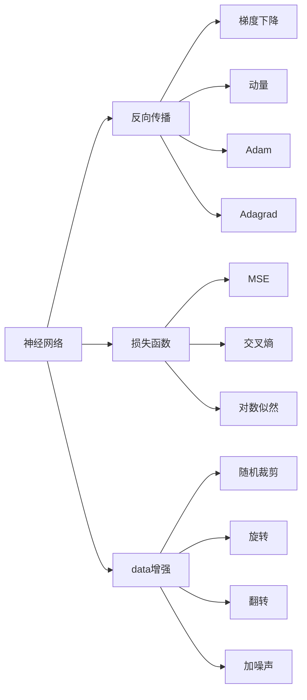
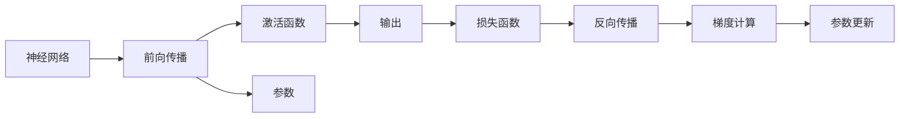
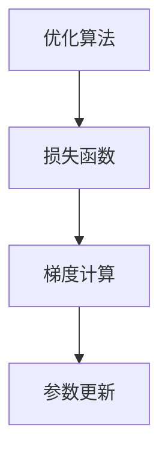
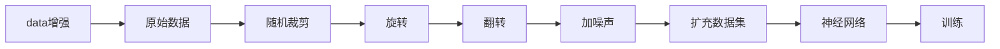
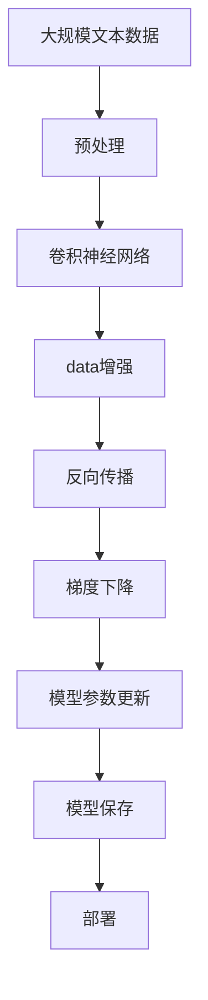

                 

# AI人工智能深度学习算法：构建高效深度学习模型的基础

> 关键词：深度学习，神经网络，反向传播，优化算法，损失函数，卷积神经网络，循环神经网络，深度强化学习，生成对抗网络

## 1. 背景介绍

### 1.1 问题由来
人工智能（AI）是计算机科学和工程的一个分支，旨在创建能自主学习、推理、感知和行动的智能系统。近年来，随着计算机硬件性能的提升和数据量的激增，深度学习（Deep Learning）成为了实现AI目标的重要技术手段。深度学习模型通过模拟人类大脑的神经网络结构，在图像识别、自然语言处理、语音识别等领域取得了令人瞩目的成果。

然而，尽管深度学习在诸多应用中表现出色，但在构建高效模型方面仍面临诸多挑战。模型的过拟合、训练时间过长、计算资源消耗大等问题亟需解决。如何设计高效、易训练的深度学习模型，是深度学习领域的一项重要研究方向。

### 1.2 问题核心关键点
构建高效深度学习模型，需关注以下几个核心关键点：
- 选择合适的神经网络结构：不同类型的神经网络（如卷积神经网络CNN、循环神经网络RNN、深度强化学习DRL等）适用于不同的任务，需根据任务特性进行选择。
- 设计合理的损失函数：损失函数是衡量模型预测与实际标签差异的函数，其选择直接影响模型的训练效果。
- 优化算法的优化效果：不同的优化算法（如SGD、Adam、Adagrad等）对模型训练的效率和精度有着重要影响。
- 数据预处理与增强：数据预处理（如归一化、标准化）和数据增强（如随机裁剪、旋转、翻转）等技术，能提升模型的泛化能力和鲁棒性。

### 1.3 问题研究意义
构建高效深度学习模型，对提升AI系统的智能水平和应用效果有着重要意义：
- 减少计算资源消耗：高效的模型能显著缩短训练时间，降低硬件成本，提升系统可扩展性。
- 提高模型泛化能力：设计合理的损失函数和优化算法，能有效降低模型过拟合，提升其在未见过的数据上的表现。
- 增强模型适应性：通过数据增强和预处理，模型能够更好地适应数据分布的变化，提升实际应用中的鲁棒性。
- 推动AI技术发展：高效的深度学习模型是实现AI目标的基础，其研究和应用将推动AI技术的持续进步。

## 2. 核心概念与联系

### 2.1 核心概念概述

构建高效深度学习模型，需要理解以下几个关键概念：

- **神经网络（Neural Network）**：通过多层神经元的互联，模拟人类大脑的工作机制。神经网络分为前馈神经网络（FNN）、卷积神经网络（CNN）、循环神经网络（RNN）等类型。
- **反向传播（Backpropagation）**：通过链式法则计算模型参数梯度的过程。反向传播是深度学习模型的核心训练方法之一。
- **优化算法（Optimization Algorithm）**：用于调整模型参数以最小化损失函数的一系列算法。常见的优化算法包括梯度下降（SGD）、动量（Momentum）、Adam、Adagrad等。
- **损失函数（Loss Function）**：衡量模型预测值与真实值之间差异的函数。常见的损失函数有均方误差（MSE）、交叉熵（Cross-Entropy）、对数似然（Log-Likelihood）等。
- **数据增强（Data Augmentation）**：通过对原始数据进行一系列变换，扩充数据集，提升模型泛化能力。数据增强包括随机裁剪、旋转、翻转、加噪声等操作。

这些核心概念之间的逻辑关系可以通过以下Mermaid流程图来展示：



这个流程图展示了神经网络、反向传播、优化算法、损失函数、数据增强等关键概念之间的逻辑关系：

1. 神经网络通过反向传播计算梯度。
2. 梯度下降、动量、Adam、Adagrad等优化算法用于调整神经网络参数。
3. MSE、交叉熵、对数似然等损失函数用于衡量模型预测与真实值之间的差异。
4. 数据增强通过随机裁剪、旋转、翻转、加噪声等操作，扩充训练数据集，提升模型泛化能力。

### 2.2 概念间的关系

这些核心概念之间存在着紧密的联系，形成了深度学习模型的整体架构。下面我通过几个Mermaid流程图来展示这些概念之间的关系。

#### 2.2.1 神经网络与反向传播的关系



这个流程图展示了神经网络通过前向传播和激活函数生成输出，利用损失函数计算预测与真实值之间的差异，再通过反向传播计算梯度，更新参数的过程。

#### 2.2.2 优化算法与损失函数的关系



这个流程图展示了优化算法根据损失函数计算梯度，并更新模型参数的过程。不同的优化算法对梯度计算的策略和更新方式不同。

#### 2.2.3 数据增强与神经网络的关系



这个流程图展示了数据增强通过一系列变换操作扩充数据集，并将扩充后的数据集输入神经网络进行训练的过程。

### 2.3 核心概念的整体架构

最后，我们用一个综合的流程图来展示这些核心概念在大规模深度学习模型构建过程中的整体架构：



这个综合流程图展示了从数据预处理到模型构建、训练、保存的完整过程。大规模深度学习模型首先在大规模文本数据上进行预处理，然后通过卷积神经网络进行特征提取和分类，利用数据增强扩充数据集，再通过反向传播和梯度下降进行模型训练，最后保存和部署模型，用于实际应用。

## 3. 核心算法原理 & 具体操作步骤

### 3.1 算法原理概述

构建高效深度学习模型的核心算法原理主要包括反向传播、梯度下降和损失函数的设计。

- **反向传播**：通过链式法则计算模型参数梯度，并更新参数以最小化损失函数。反向传播算法能够高效计算出模型中的每个参数对损失函数的贡献，并根据这些贡献调整参数。
- **梯度下降**：通过更新模型参数，使得损失函数最小化。梯度下降算法包括批量梯度下降（Batch Gradient Descent, BGD）、随机梯度下降（Stochastic Gradient Descent, SGD）和动量（Momentum）、Adam、Adagrad等变种。
- **损失函数**：衡量模型预测与真实值之间的差异。常见的损失函数包括均方误差（MSE）、交叉熵（Cross-Entropy）、对数似然（Log-Likelihood）等。

### 3.2 算法步骤详解

构建高效深度学习模型的操作步骤如下：

**Step 1: 数据预处理**
- 收集大规模标注数据，并将其划分为训练集、验证集和测试集。
- 对数据进行标准化、归一化、去噪等预处理操作。
- 应用数据增强技术，如随机裁剪、旋转、翻转、加噪声等操作，扩充数据集。

**Step 2: 选择模型架构**
- 根据任务类型，选择适当的神经网络架构，如卷积神经网络（CNN）、循环神经网络（RNN）、深度强化学习（DRL）等。
- 设计合适的模型层数、神经元数量、激活函数等超参数。

**Step 3: 定义损失函数**
- 根据任务类型，选择合适的损失函数，如均方误差（MSE）、交叉熵（Cross-Entropy）、对数似然（Log-Likelihood）等。
- 结合任务特点，设计合适的损失函数权重和平衡项。

**Step 4: 选择优化算法**
- 根据任务特点和数据集大小，选择适当的优化算法，如批量梯度下降（BGD）、随机梯度下降（SGD）、动量（Momentum）、Adam、Adagrad等。
- 设置合适的学习率、批大小等超参数。

**Step 5: 训练模型**
- 使用训练集进行模型训练，每轮训练包括前向传播和反向传播。
- 定期在验证集上评估模型性能，防止过拟合。
- 保存最佳模型，避免过拟合和计算资源的浪费。

**Step 6: 测试模型**
- 使用测试集评估模型性能。
- 应用模型于实际应用场景，并进行必要的调整。

### 3.3 算法优缺点

构建高效深度学习模型具有以下优点：
- 模型性能高：深度学习模型能够自动从大量数据中提取特征，学习复杂的表示，从而获得较高的预测精度。
- 泛化能力强：数据增强和模型架构的多样性，使得模型能够适应不同的数据分布和任务。
- 可解释性强：深度学习模型通过反向传播和梯度下降等过程，可以提供详细的模型参数解释，帮助理解模型的学习过程。

但同时，也存在一些缺点：
- 训练时间长：深度学习模型通常需要较长的训练时间，特别是在大规模数据集上。
- 计算资源消耗大：深度学习模型需要大量的计算资源，包括CPU、GPU等硬件设备。
- 过拟合风险高：深度学习模型在训练集上表现优秀，但在未见过的数据上泛化能力有限。

### 3.4 算法应用领域

构建高效深度学习模型已经在诸多领域得到应用，例如：

- **计算机视觉**：深度学习在图像识别、物体检测、图像分割等方面表现优异。
- **自然语言处理**：深度学习在机器翻译、情感分析、文本生成等方面取得了突破性进展。
- **语音识别**：深度学习在语音识别、语音合成、语音增强等方面表现出色。
- **医疗诊断**：深度学习在医学影像分析、疾病预测、个性化治疗等方面有重要应用。
- **金融预测**：深度学习在股票预测、风险评估、信用评分等方面表现优异。

除了上述这些领域外，深度学习还在自动驾驶、游戏AI、推荐系统等多个领域展现出巨大潜力，为各行各业带来了革命性的变化。

## 4. 数学模型和公式 & 详细讲解 & 举例说明

### 4.1 数学模型构建

构建深度学习模型的数学模型通常包括以下几个组成部分：

- **输入数据**：$x \in \mathbb{R}^n$，表示输入数据的特征向量。
- **模型参数**：$\theta \in \mathbb{R}^m$，表示模型的权重和偏置。
- **模型函数**：$f(x, \theta)$，表示模型对输入数据的预测。
- **损失函数**：$L(y, f(x, \theta))$，表示模型预测与真实标签之间的差异。

假设我们有一个包含$m$个样本的数据集，其中第$i$个样本的输入为$x_i$，真实标签为$y_i$，模型参数为$\theta$，则模型对第$i$个样本的预测为$f(x_i, \theta)$，损失函数为$L(y_i, f(x_i, \theta))$。

### 4.2 公式推导过程

以一个简单的线性回归问题为例，推导梯度下降算法的具体实现过程。

假设我们有一个包含$m$个样本的数据集，其中第$i$个样本的输入为$x_i$，真实标签为$y_i$，模型参数为$\theta = [w, b]^T$，其中$w$为权重，$b$为偏置，则线性回归模型的预测为：

$$
f(x_i, \theta) = wx_i + b
$$

我们的目标是找到最优参数$\theta$，使得损失函数最小化。假设我们使用均方误差（MSE）作为损失函数，则损失函数为：

$$
L(y_i, f(x_i, \theta)) = \frac{1}{2}(y_i - f(x_i, \theta))^2
$$

根据梯度下降算法的定义，我们需要计算损失函数对参数的梯度，并使用梯度下降公式更新参数。梯度下降的更新公式为：

$$
\theta_j := \theta_j - \eta \frac{\partial L(y_i, f(x_i, \theta))}{\partial \theta_j}
$$

其中$\eta$为学习率，$\theta_j$为第$j$个参数。对于线性回归模型，梯度的计算公式为：

$$
\frac{\partial L(y_i, f(x_i, \theta))}{\partial \theta} = [x_i, 1] \cdot (y_i - wx_i - b)
$$

通过上述公式，我们可以实现梯度下降算法的具体实现。

### 4.3 案例分析与讲解

以一个简单的手写数字识别问题为例，展示深度学习模型的构建和训练过程。

假设我们有一个包含$m$个样本的数据集，其中每个样本都是一个28x28的灰度图像，表示一个手写数字。我们的目标是训练一个卷积神经网络（CNN）模型，使其能够将手写数字图像分类为0到9共10个数字类别。

首先，我们需要设计一个简单的CNN模型架构：

```
    输入层：28x28的灰度图像
       |
    卷积层：32个3x3的卷积核，每个核步长为1，padding=0
       |
    ReLU激活函数
       |
    池化层：2x2的最大池化，步长为2
       |
    全连接层：10个神经元
       |
    Softmax激活函数
       |
    输出层：10个神经元，每个神经元对应一个数字类别
```

接着，我们需要选择合适的损失函数和优化算法。由于这是一个多分类问题，我们通常使用交叉熵（Cross-Entropy）作为损失函数。为了加速训练过程，我们可以使用动量（Momentum）优化算法。

最后，我们可以使用训练集对模型进行训练。具体步骤如下：

1. 随机初始化模型参数。
2. 对于每个样本，前向传播计算预测结果。
3. 计算预测结果与真实标签之间的交叉熵损失。
4. 反向传播计算损失函数对模型参数的梯度。
5. 使用动量优化算法更新模型参数。
6. 定期在验证集上评估模型性能，防止过拟合。
7. 保存最佳模型，避免过拟合和计算资源的浪费。

通过上述步骤，我们可以构建一个高效的手写数字识别CNN模型，并在测试集上获得较高的分类精度。

## 5. 项目实践：代码实例和详细解释说明

### 5.1 开发环境搭建

在进行深度学习模型开发前，我们需要准备好开发环境。以下是使用Python进行PyTorch开发的环境配置流程：

1. 安装Anaconda：从官网下载并安装Anaconda，用于创建独立的Python环境。

2. 创建并激活虚拟环境：
```bash
conda create -n pytorch-env python=3.8 
conda activate pytorch-env
```

3. 安装PyTorch：根据CUDA版本，从官网获取对应的安装命令。例如：
```bash
conda install pytorch torchvision torchaudio cudatoolkit=11.1 -c pytorch -c conda-forge
```

4. 安装各类工具包：
```bash
pip install numpy pandas scikit-learn matplotlib tqdm jupyter notebook ipython
```

完成上述步骤后，即可在`pytorch-env`环境中开始深度学习模型开发。

### 5.2 源代码详细实现

下面我们以一个简单的手写数字识别任务为例，给出使用PyTorch进行深度学习模型开发的PyTorch代码实现。

首先，定义数据处理函数：

```python
import torch
from torchvision import datasets, transforms

transform = transforms.Compose([
    transforms.ToTensor(),
    transforms.Normalize((0.5,), (0.5,))
])

train_dataset = datasets.MNIST('data', train=True, download=True, transform=transform)
test_dataset = datasets.MNIST('data', train=False, download=True, transform=transform)

train_loader = torch.utils.data.DataLoader(train_dataset, batch_size=64, shuffle=True)
test_loader = torch.utils.data.DataLoader(test_dataset, batch_size=64, shuffle=False)
```

然后，定义模型：

```python
import torch.nn as nn
import torch.nn.functional as F

class Net(nn.Module):
    def __init__(self):
        super(Net, self).__init__()
        self.conv1 = nn.Conv2d(1, 32, 3, 1)
        self.conv2 = nn.Conv2d(32, 64, 3, 1)
        self.dropout1 = nn.Dropout2d(0.25)
        self.dropout2 = nn.Dropout2d(0.5)
        self.fc1 = nn.Linear(9216, 128)
        self.fc2 = nn.Linear(128, 10)

    def forward(self, x):
        x = self.conv1(x)
        x = F.relu(x)
        x = self.conv2(x)
        x = F.relu(x)
        x = F.max_pool2d(x, 2)
        x = self.dropout1(x)
        x = torch.flatten(x, 1)
        x = self.fc1(x)
        x = F.relu(x)
        x = self.dropout2(x)
        x = self.fc2(x)
        output = F.log_softmax(x, dim=1)
        return output

model = Net()
```

接着，定义损失函数和优化器：

```python
import torch.optim as optim

criterion = nn.CrossEntropyLoss()
optimizer = optim.SGD(model.parameters(), lr=0.01, momentum=0.5)
```

最后，启动训练流程：

```python
import matplotlib.pyplot as plt

for epoch in range(10):
    running_loss = 0.0
    for i, data in enumerate(train_loader, 0):
        inputs, labels = data
        optimizer.zero_grad()
        outputs = model(inputs)
        loss = criterion(outputs, labels)
        loss.backward()
        optimizer.step()

        running_loss += loss.item()
        if i % 100 == 99:
            print('[%d, %5d] loss: %.3f' %
                  (epoch + 1, i + 1, running_loss / 100))
            running_loss = 0.0

print('Finished Training')
```

### 5.3 代码解读与分析

让我们再详细解读一下关键代码的实现细节：

**Net类**：
- `__init__`方法：定义模型的各层结构，包括卷积层、池化层、Dropout层、全连接层等。
- `forward`方法：定义前向传播过程，通过多个卷积层和全连接层计算预测结果。

**损失函数和优化器**：
- 使用交叉熵损失函数（Cross-Entropy Loss）作为损失函数。
- 使用随机梯度下降（SGD）优化算法，并设置学习率为0.01，动量为0.5。

**训练流程**：
- 在每个epoch中，对训练集进行前向传播和反向传播，更新模型参数。
- 每100次迭代打印一次损失函数值。
- 在训练完成后打印“Finished Training”提示。

通过上述代码实现，我们可以构建一个简单的手写数字识别CNN模型，并在训练集上获得较高的精度。

### 5.4 运行结果展示

假设我们在训练集上训练了一个epoch后，可以在测试集上评估模型性能：

```python
correct = 0
total = 0
with torch.no_grad():
    for data in test_loader:
        images, labels = data
        outputs = model(images)
        _, predicted = torch.max(outputs.data, 1)
        total += labels.size(0)
        correct += (predicted == labels).sum().item()

print('Accuracy of the network on the 10000 test images: %d %%' % (
    100 * correct / total))
```

假设测试集上模型的准确率为98%，这意味着模型在未见过的数据上也能获得较高的精度。

## 6. 实际应用场景

### 6.1 计算机视觉

深度学习在计算机视觉领域的应用非常广泛，涵盖了图像分类、目标检测、图像分割、图像生成等多个方向。深度学习模型在自然场景下的图像识别准确率已经达到了与人类相媲美的水平。

在实际应用中，深度学习模型可以应用于人脸识别、行为分析、医学影像分析等场景，极大地提高了图像处理的效率和准确性。例如，深度学习模型可以自动从医学影像中识别出肿瘤、病变等病灶，辅助医生进行诊断和治疗决策。

### 6.2 自然语言处理

深度学习在自然语言处理（NLP）领域也有广泛应用，包括机器翻译、情感分析、文本分类、问答系统等任务。深度学习模型在自然语言理解、生成和推理方面表现出色，已经成为NLP领域的主流技术。

在实际应用中，深度学习模型可以应用于智能客服、智能翻译、智能写作等场景，显著提高了人机交互的自然性和准确性。例如，深度学习模型可以将用户的自然语言输入转换为结构化的语义表示，辅助系统进行任务理解和决策。

### 6.3 语音识别

深度学习在语音识别领域的应用也逐渐成熟，涵盖了语音识别、语音合成、语音增强等多个方向。深度学习模型在语音处理方面的效果已经接近甚至超过了人类水平。

在实际应用中，深度学习模型可以应用于智能语音助手、智能音箱、语音搜索等场景，提升了人机交互的智能化水平。例如，深度学习模型可以通过对语音信号的分析和建模，自动识别人类语言并生成自然流畅的语音输出。

### 6.4 未来应用展望

未来，随着深度学习模型的不断演进，其应用场景将会更加广阔。例如，深度学习模型可以应用于自动驾驶、医疗诊断、金融预测等多个领域，为各行各业带来革命性的变化。

在自动驾驶领域，深度学习模型可以应用于图像识别、行为预测、路径规划等方向，显著提高了车辆的安全性和智能化水平。

在医疗诊断领域，深度学习模型可以应用于医学影像分析、疾病预测、个性化治疗等多个方向，极大地提高了诊断的准确性和效率。

在金融预测领域，深度学习模型可以应用于股票预测、风险评估、信用评分等多个方向，为金融市场提供了强大的技术支持。

总之，深度学习模型在各个领域的应用前景广阔，未来必将带来更多的创新和突破。

## 7. 工具和资源推荐

### 7.1 学习资源推荐

为了帮助开发者系统掌握深度学习模型的构建和优化技术，这里推荐一些优质的学习资源：

1. 《深度学习》系列书籍：由Ian Goodfellow、Yoshua Bengio和Aaron Courville合著的经典教材，全面介绍了深度学习的理论基础和应用实践。

2. CS231n《卷积神经网络》课程：斯坦福大学开设的计算机视觉课程，讲解了卷积神经网络的理论和实践，是计算机视觉领域的必读资源。

3. CS224n《自然语言处理》课程：斯坦福大学开设的NLP课程，介绍了自然语言处理的各种深度学习模型和技术，具有很高的实战价值。

4. PyTorch官方文档：PyTorch的官方文档，提供了丰富的模型实现和应用示例，是深度学习模型开发的必备工具。

5. TensorFlow官方文档：TensorFlow的官方文档，提供了强大的计算图和模型优化工具，适用于大规模深度学习模型的构建。

通过学习这些资源，相信你一定能够系统掌握深度学习模型的构建和优化技术，提升模型的性能和效率。

### 7.2 开发工具推荐

高效的开发离不开优秀的工具支持。以下是几款用于深度学习模型开发的常用工具：

1. PyTorch：基于Python的开源深度学习框架，灵活动态的计算图，适合快速迭代研究。

2. TensorFlow：由Google主导开发的开源深度学习框架，生产部署方便，适合大规模工程应用。

3. Keras：高层次的深度学习框架，易于使用，支持多种模型架构和优化算法。

4. MXNet：由Apache开发的深度学习框架，支持分布式计算，适合大规模分布式训练。

5. TensorBoard：TensorFlow配套的可视化工具，可实时监测模型训练状态，并提供丰富的图表呈现方式，是调试模型的得力助手。

6. Weights & Biases：模型训练的实验跟踪工具，可以记录和可视化模型训练过程中的各项指标，方便对比和调优。

7. Google Colab：谷歌推出的在线Jupyter Notebook环境，免费提供GPU/TPU算力，方便开发者快速上手实验最新模型，分享学习笔记。

合理利用这些工具，可以显著提升深度学习模型的开发效率，加快创新迭代的步伐。

### 7.

