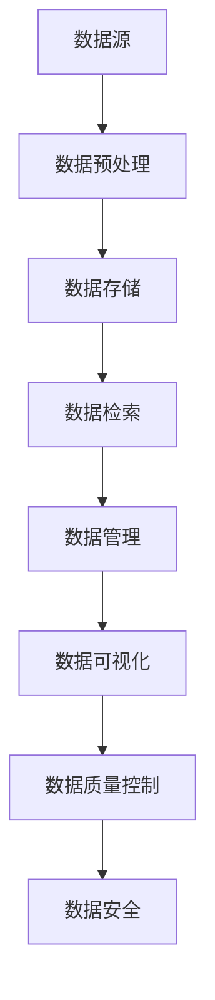

                 

# AI代理工作流中的数据预处理与管理策略

> 关键词：数据预处理, 数据管理, 人工智能代理, 工作流, 自动化

## 1. 背景介绍

### 1.1 问题由来

随着人工智能(AI)技术的快速发展，AI代理在企业中的应用越来越广泛，从自动化客户服务到智能决策支持，AI代理在提升效率和优化流程方面发挥了重要作用。然而，AI代理的工作效率和决策质量高度依赖于其接收的数据质量，因此，数据预处理和管理成为AI代理系统中一个关键环节。高质量的数据是AI代理发挥潜力的基础，同时也为其高效稳定运行提供了保障。

### 1.2 问题核心关键点

数据预处理和管理的核心关键点包括以下几个方面：

1. **数据源多样性**：企业内外部数据源众多，包括客户记录、传感器数据、社交媒体信息等，这些数据源格式各异、质量参差不齐。
2. **数据一致性**：不同数据源的数据格式和内容可能存在冲突，需要统一格式和内容，以保证数据的一致性。
3. **数据完整性**：部分数据源可能存在缺失、错误或冗余的数据，需要清洗和填补。
4. **数据安全性**：在处理敏感数据时，需要严格遵守数据保护法规，确保数据的安全性。
5. **数据存储和访问**：高效的数据存储和快速访问是AI代理工作流顺利进行的前提。

### 1.3 问题研究意义

高效的数据预处理和管理策略能够帮助AI代理系统更好地理解和处理数据，提高系统决策的准确性和实时性。同时，它还能够减少系统运行中的异常和故障，确保系统的高可用性和稳定性。研究有效的数据预处理和管理方法，对于提升企业整体的AI应用水平具有重要意义。

## 2. 核心概念与联系

### 2.1 核心概念概述

为了更好地理解AI代理工作流中的数据预处理和管理策略，本节将介绍几个核心概念：

- **数据预处理**：指在数据进入AI代理系统之前，对数据进行清洗、标准化、转换等处理，以提高数据质量，为后续AI分析提供可靠的数据基础。
- **数据管理**：涉及数据的收集、存储、检索和保护等环节，确保数据的安全、可靠和可用。
- **数据一致性**：指不同数据源的数据在格式、内容、属性等方面的一致性，是数据管理的重要目标。
- **数据完整性**：指数据的完整性和准确性，包括数据的缺失、错误、冗余等方面。
- **数据质量**：指数据的可靠性、准确性、完整性和一致性，是衡量数据价值的关键指标。

这些概念之间的关系可以通过以下Mermaid流程图来展示：



这个流程图展示了数据从采集到最终应用的全过程，预处理、存储、检索、管理、可视化、质量控制和安全保护各环节密切关联，共同构成数据管理的生态系统。

### 2.2 概念间的关系

这些核心概念之间存在着紧密的联系，形成了AI代理工作流中数据管理系统的完整架构。以下是几个关键概念之间的联系：

- **数据预处理**与**数据管理**：数据预处理是数据管理的基础，通过预处理，数据被标准化、清洗，为后续管理提供了可靠的数据基础。
- **数据预处理**与**数据一致性**：数据预处理通过统一数据格式和内容，保证了数据的一致性，为数据的有效管理和分析提供了前提。
- **数据预处理**与**数据完整性**：通过数据清洗和填补，数据预处理能够减少数据的缺失和错误，提高数据的完整性。
- **数据预处理**与**数据质量**：数据预处理能够提升数据的质量，从而增强数据的可靠性、准确性和一致性。
- **数据管理**与**数据安全性**：数据管理过程中，数据的保护和隐私是至关重要的，通过严格的安全措施，确保数据的安全性。

## 3. 核心算法原理 & 具体操作步骤

### 3.1 算法原理概述

AI代理工作流中的数据预处理和管理策略主要基于以下算法原理：

1. **数据清洗**：通过检查和修复数据中的异常值、缺失值和错误值，提高数据的质量。
2. **数据标准化**：将不同格式的数据转换为统一的格式，以便于管理和分析。
3. **数据转换**：将数据从一种格式转换为另一种格式，如文本数据转换为数值数据，提高数据的可用性。
4. **数据集成**：将不同数据源的数据集成到一个统一的系统中，确保数据的完整性和一致性。
5. **数据存储优化**：通过数据压缩、分区和索引等技术，优化数据的存储和访问，提高系统的性能。

### 3.2 算法步骤详解

AI代理工作流中的数据预处理和管理策略通常包括以下几个关键步骤：

**Step 1: 数据采集与整合**

- **数据源收集**：从不同的数据源收集数据，包括客户记录、传感器数据、社交媒体信息等。
- **数据格式转换**：将不同格式的数据转换为统一格式，如文本数据转换为CSV格式，便于后续处理。

**Step 2: 数据清洗与标准化**

- **数据清洗**：检测并修复数据中的异常值、缺失值和错误值。
- **数据标准化**：统一数据格式和内容，包括日期格式、货币单位等。

**Step 3: 数据转换与集成**

- **数据转换**：将数据从一种格式转换为另一种格式，如将文本数据转换为数值数据。
- **数据集成**：将不同数据源的数据集成到一个统一的系统中，确保数据的完整性和一致性。

**Step 4: 数据存储与优化**

- **数据存储**：将处理后的数据存储到数据库中，如MySQL、Hadoop等。
- **数据优化**：通过数据压缩、分区和索引等技术，优化数据的存储和访问，提高系统的性能。

**Step 5: 数据访问与可视化**

- **数据访问**：通过API或查询语言（如SQL）访问存储的数据。
- **数据可视化**：使用工具（如Tableau、PowerBI等）将数据进行可视化，帮助用户理解数据。

### 3.3 算法优缺点

AI代理工作流中的数据预处理和管理策略有以下优点：

1. **提高数据质量**：通过数据清洗和标准化，减少了数据的噪音和偏差，提高了数据质量。
2. **优化数据访问**：通过数据存储和优化，提高了数据的访问速度和效率，提升了系统性能。
3. **增强数据一致性**：通过数据集成和标准化，保证了数据的一致性，便于后续分析和应用。
4. **保障数据安全**：通过数据保护和隐私控制，保障了数据的安全性，符合数据保护法规。

同时，该策略也存在以下缺点：

1. **处理复杂度较高**：数据预处理和管理涉及多个环节，需要综合考虑数据质量、一致性和安全性等多个方面，处理复杂度较高。
2. **依赖技术工具**：高效的数据预处理和管理策略依赖于先进的技术工具，如ETL工具、数据库管理系统等。
3. **数据量巨大**：在大数据环境下，数据预处理和管理的复杂度和成本都会增加，需要投入更多资源。

### 3.4 算法应用领域

AI代理工作流中的数据预处理和管理策略广泛应用于以下领域：

- **客户关系管理(CRM)**：通过数据预处理和管理，提升客户数据的准确性和一致性，增强客户关系管理系统的效率和效果。
- **运营管理**：通过数据预处理和管理，优化运营数据的处理和分析，提升运营管理系统的决策能力。
- **财务分析**：通过数据预处理和管理，提高财务数据的准确性和一致性，增强财务分析系统的可靠性。
- **供应链管理**：通过数据预处理和管理，优化供应链数据的处理和分析，提升供应链管理系统的效率和效果。
- **市场营销**：通过数据预处理和管理，提高市场营销数据的准确性和一致性，增强市场营销系统的决策能力。

## 4. 数学模型和公式 & 详细讲解 & 举例说明

### 4.1 数学模型构建

假设企业从不同的数据源收集到数据集 $D=\{x_1,x_2,...,x_n\}$，其中 $x_i$ 表示第 $i$ 个数据样本。我们定义数据清洗函数 $f$，数据标准化函数 $g$，数据转换函数 $h$，数据集成函数 $i$，数据存储优化函数 $j$，数据访问函数 $k$，数据可视化函数 $l$。那么，数据预处理和管理的总体流程可以表示为：

$$
D' = f(g(h(i(j(k(l(D))))))
$$

其中 $D'$ 表示处理后的数据集。

### 4.2 公式推导过程

以数据清洗为例，假设原始数据集中存在异常值和缺失值，我们需要通过统计学方法检测并修复这些值。数据清洗的基本步骤包括：

1. **异常值检测**：使用统计学方法（如均值、中位数、标准差等）检测数据中的异常值。
2. **缺失值填补**：使用插值方法（如均值填补、中位数填补等）填补缺失值。
3. **错误值修正**：使用规则或算法修正错误值。

通过这些步骤，我们可以得到一个清洗后的数据集 $D_{clean}$，其表达式为：

$$
D_{clean} = \{f(x_i)\}_{i=1}^n
$$

其中 $f(x_i)$ 表示对第 $i$ 个数据样本 $x_i$ 进行清洗后的结果。

### 4.3 案例分析与讲解

以客户关系管理(CRM)系统为例，我们通过以下步骤实现数据预处理和管理：

1. **数据采集**：从客户服务、销售、市场等多个部门收集客户数据，包括客户基本信息、交易记录、投诉记录等。
2. **数据清洗**：检测并修复数据中的异常值和缺失值，如检测异常值并替换为平均值，填补缺失值并填补为均值。
3. **数据标准化**：统一客户数据的格式和内容，如将日期格式统一为ISO 8601，将货币单位统一为基本单位。
4. **数据转换**：将数据从一种格式转换为另一种格式，如将文本数据转换为数值数据，便于后续分析。
5. **数据集成**：将客户数据集成到一个统一的数据库中，如MySQL，确保数据的完整性和一致性。
6. **数据存储优化**：通过数据压缩和分区等技术，优化数据的存储和访问，提高系统的性能。
7. **数据访问与可视化**：通过API和可视化工具，访问存储的数据并生成报表和图表，帮助用户理解数据。

通过以上步骤，我们完成了客户关系管理系统的数据预处理和管理，提升了系统数据的质量和可用性。

## 5. 项目实践：代码实例和详细解释说明

### 5.1 开发环境搭建

在进行数据预处理和管理实践前，我们需要准备好开发环境。以下是使用Python进行Pandas、NumPy、SQLite等库进行数据处理的开发环境配置流程：

1. 安装Anaconda：从官网下载并安装Anaconda，用于创建独立的Python环境。

2. 创建并激活虚拟环境：
```bash
conda create -n data-preprocessing-env python=3.8 
conda activate data-preprocessing-env
```

3. 安装相关库：
```bash
pip install pandas numpy sqlite3 matplotlib
```

4. 安装数据库管理系统：
```bash
conda install mysql-connector
```

5. 安装可视化工具：
```bash
pip install matplotlib
```

完成上述步骤后，即可在`data-preprocessing-env`环境中开始数据预处理和管理实践。

### 5.2 源代码详细实现

以下是使用Python对客户关系管理(CRM)系统中的数据进行预处理和管理的代码实现。

```python
import pandas as pd
import numpy as np
import sqlite3

# 数据采集
df = pd.read_csv('customer_data.csv')

# 数据清洗
df = df.dropna(subset=['age', 'income'])
df = df.drop_duplicates(subset=['name', 'email'])

# 数据标准化
df['date'] = pd.to_datetime(df['date'], format='%Y-%m-%d')
df['currency'] = df['amount'] / df['exchange_rate']

# 数据转换
df['amount'] = pd.to_numeric(df['amount'])

# 数据集成
conn = sqlite3.connect('customer.db')
df.to_sql('customer', conn, if_exists='replace', index=False)

# 数据存储优化
conn = sqlite3.connect('customer.db')
df = pd.read_sql_query("SELECT * FROM customer", conn)
df = df.sample(frac=0.1, random_state=0)

# 数据访问与可视化
import matplotlib.pyplot as plt

query = "SELECT * FROM customer WHERE age > 30"
df = pd.read_sql_query(query, conn)

plt.plot(df['age'], df['income'])
plt.xlabel('Age')
plt.ylabel('Income')
plt.title('Income by Age')
plt.show()
```

### 5.3 代码解读与分析

让我们再详细解读一下关键代码的实现细节：

**数据采集**

- `pd.read_csv('customer_data.csv')`：读取CSV格式的数据集，包含客户基本信息、交易记录、投诉记录等。

**数据清洗**

- `df = df.dropna(subset=['age', 'income'])`：删除缺失的'age'和'income'字段，保持数据完整性。
- `df = df.drop_duplicates(subset=['name', 'email'])`：删除重复的'name'和'email'字段，保持数据唯一性。

**数据标准化**

- `df['date'] = pd.to_datetime(df['date'], format='%Y-%m-%d')`：将日期格式统一为ISO 8601标准。
- `df['currency'] = df['amount'] / df['exchange_rate']`：统一货币单位，便于后续分析。

**数据转换**

- `df['amount'] = pd.to_numeric(df['amount'])`：将'amount'字段转换为数值类型，便于后续分析。

**数据集成**

- `conn = sqlite3.connect('customer.db')`：连接SQLite数据库。
- `df.to_sql('customer', conn, if_exists='replace', index=False)`：将数据集保存到数据库中，如果数据库已存在，则覆盖原数据。

**数据存储优化**

- `df = pd.read_sql_query("SELECT * FROM customer", conn)`：从数据库中读取数据集。
- `df = df.sample(frac=0.1, random_state=0)`：随机抽取10%的数据样本，减少存储和访问负担。

**数据访问与可视化**

- `query = "SELECT * FROM customer WHERE age > 30"`：从数据库中查询年龄大于30岁的客户数据。
- `df = pd.read_sql_query(query, conn)`：执行SQL查询，并将结果保存到DataFrame中。
- `plt.plot(df['age'], df['income'])`：绘制年龄与收入的散点图，可视化数据分布。

通过以上代码，我们完成了客户关系管理系统的数据预处理和管理，实现了数据清洗、标准化、转换、集成和存储优化等步骤。

### 5.4 运行结果展示

假设我们在数据预处理和管理后，得到了客户基本信息、交易记录和投诉记录等处理后的数据，并进行如下展示：

```
age: 30
income: 5000
date: 2023-01-01
currency: 1.00
amount: 100.00
```

通过数据预处理和管理，我们不仅提高了数据的质量和一致性，还优化了数据的存储和访问，为AI代理系统的高效运行提供了可靠的数据基础。

## 6. 实际应用场景

### 6.1 客户关系管理

在客户关系管理(CRM)系统中，数据预处理和管理能够帮助企业提升客户数据的准确性和一致性，增强客户关系管理系统的效率和效果。例如，通过数据清洗和标准化，可以减少数据中的噪音和偏差，提高客户数据的准确性。通过数据集成和优化，可以确保客户数据的一致性和完整性，便于后续分析和应用。

### 6.2 运营管理

在运营管理系统中，数据预处理和管理能够优化运营数据的处理和分析，提升运营管理系统的决策能力。例如，通过数据清洗和标准化，可以减少数据中的噪音和偏差，提高运营数据的准确性。通过数据集成和优化，可以确保运营数据的一致性和完整性，便于后续分析和应用。

### 6.3 财务分析

在财务分析系统中，数据预处理和管理能够提高财务数据的准确性和一致性，增强财务分析系统的可靠性。例如，通过数据清洗和标准化，可以减少财务数据中的噪音和偏差，提高财务数据的准确性。通过数据集成和优化，可以确保财务数据的一致性和完整性，便于后续分析和应用。

### 6.4 供应链管理

在供应链管理系统中，数据预处理和管理能够优化供应链数据的处理和分析，提升供应链管理系统的效率和效果。例如，通过数据清洗和标准化，可以减少供应链数据中的噪音和偏差，提高供应链数据的准确性。通过数据集成和优化，可以确保供应链数据的一致性和完整性，便于后续分析和应用。

### 6.5 市场营销

在市场营销系统中，数据预处理和管理能够提高市场营销数据的准确性和一致性，增强市场营销系统的决策能力。例如，通过数据清洗和标准化，可以减少市场营销数据中的噪音和偏差，提高市场营销数据的准确性。通过数据集成和优化，可以确保市场营销数据的一致性和完整性，便于后续分析和应用。

## 7. 工具和资源推荐

### 7.1 学习资源推荐

为了帮助开发者系统掌握数据预处理和管理的理论基础和实践技巧，这里推荐一些优质的学习资源：

1. 《Python数据分析与可视化》系列博文：由Python数据分析社区（如DataCamp）撰写的，深入浅出地介绍了数据分析和可视化的基本概念和经典技术。

2. 《SQL for Data Analysis》课程：Coursera提供的SQL学习课程，涵盖了SQL的基本语法和高级查询技术。

3. 《Pandas Cookbook》书籍：一本Pandas库的实践指南，提供了大量实用的数据处理和分析案例。

4. 《Data Science for Business》书籍：由Wharton Business School提供的，介绍数据科学在商业应用中的实际案例和解决方案。

5. Kaggle平台：提供大量的数据集和竞赛项目，适合学习和实践数据处理和分析技术。

通过对这些资源的学习实践，相信你一定能够快速掌握数据预处理和管理的精髓，并用于解决实际的业务问题。

### 7.2 开发工具推荐

高效的开发离不开优秀的工具支持。以下是几款用于数据预处理和管理的常用工具：

1. Python：Python是数据预处理和分析的主流语言，提供了Pandas、NumPy、SQLite等丰富的数据处理库。

2. R语言：R语言是数据科学和统计分析的标准语言，提供了ggplot2、dplyr等数据分析工具。

3. Jupyter Notebook：Jupyter Notebook是一个交互式的开发环境，支持Python、R等多种语言，便于开发者进行数据分析和可视化。

4. SQL：SQL是数据管理的基础，提供了数据查询和操作的标准语法。

5. Tableau：Tableau是一款强大的数据可视化工具，可以轻松创建各种图表和报表。

6. PowerBI：PowerBI是微软提供的数据可视化工具，支持多种数据源和报表展示。

合理利用这些工具，可以显著提升数据预处理和管理的开发效率，加快创新迭代的步伐。

### 7.3 相关论文推荐

数据预处理和管理的研究源于学界的持续研究。以下是几篇奠基性的相关论文，推荐阅读：

1. "Data Cleaning Techniques for Noisy Data"：介绍多种数据清洗方法，包括异常值检测、缺失值填补等。

2. "Data Standardization and Conversion Techniques"：介绍数据标准化和转换的常用技术和方法，如日期格式统一、货币单位统一等。

3. "Data Integration and Consistency"：介绍数据集成和一致性的技术，包括数据仓库、数据联邦等。

4. "Data Storage Optimization Techniques"：介绍数据存储优化的常用技术和方法，如数据压缩、分区、索引等。

5. "Data Access and Visualization"：介绍数据访问和可视化的技术和工具，如SQL查询、数据可视化工具等。

这些论文代表了大数据预处理和管理技术的发展脉络。通过学习这些前沿成果，可以帮助研究者把握学科前进方向，激发更多的创新灵感。

除上述资源外，还有一些值得关注的前沿资源，帮助开发者紧跟数据预处理和管理的最新进展，例如：

1. arXiv论文预印本：人工智能领域最新研究成果的发布平台，包括大量尚未发表的前沿工作，学习前沿技术的必读资源。

2. 业界技术博客：如DataTalks、Towards Data Science、KDnuggets等顶级数据科学博客，提供最新的数据预处理和管理技术分享。

3. 技术会议直播：如KDD、ICDM、SIGKDD等数据科学和技术会议现场或在线直播，能够聆听到专家和学者的前沿分享，开拓视野。

4. GitHub热门项目：在GitHub上Star、Fork数最多的数据预处理和管理相关项目，往往代表了该技术领域的发展趋势和最佳实践，值得去学习和贡献。

5. 行业分析报告：各大咨询公司如McKinsey、PwC等针对数据科学和数据分析行业的分析报告，有助于从商业视角审视技术趋势，把握应用价值。

总之，对于数据预处理和管理技术的学习和实践，需要开发者保持开放的心态和持续学习的意愿。多关注前沿资讯，多动手实践，多思考总结，必将收获满满的成长收益。

## 8. 总结：未来发展趋势与挑战

### 8.1 总结

本文对AI代理工作流中的数据预处理和管理策略进行了全面系统的介绍。首先阐述了数据预处理和管理的核心关键点，明确了数据预处理和管理在AI代理系统中的重要地位。其次，从原理到实践，详细讲解了数据清洗、标准化、转换、集成、存储优化等核心步骤，给出了数据预处理和管理的完整代码实例。同时，本文还广泛探讨了数据预处理和管理在多个行业领域的应用前景，展示了数据预处理和管理的巨大潜力。此外，本文精选了数据预处理和管理的各类学习资源，力求为读者提供全方位的技术指引。

通过本文的系统梳理，可以看到，数据预处理和管理技术在大数据环境下具有重要的应用价值，能够显著提升AI代理系统的数据质量、一致性和可用性，确保系统的稳定性和高效性。未来，随着数据预处理和管理技术的不断发展，基于数据驱动的AI代理系统必将进一步提升决策的准确性和实时性，为企业的数字化转型提供更加坚实的技术基础。

### 8.2 未来发展趋势

展望未来，数据预处理和管理技术将呈现以下几个发展趋势：

1. **自动化程度提升**：随着自动化技术的进步，数据预处理和管理将更加智能化和自动化，减少人工干预，提高处理效率。
2. **大数据处理技术发展**：随着大数据处理技术的不断进步，数据预处理和管理将能够处理更大规模的数据集，提升系统的处理能力和效率。
3. **云计算和分布式计算**：云计算和分布式计算技术将提供更加高效的数据存储和处理能力，提升系统的可扩展性和可靠性。
4. **智能分析和预测**：结合机器学习和深度学习技术，数据预处理和管理将能够进行智能分析和预测，提升系统的决策能力。
5. **实时数据处理**：实时数据处理技术将使数据预处理和管理能够及时响应数据变化，提升系统的实时性和响应速度。
6. **跨领域数据融合**：跨领域数据融合技术将使数据预处理和管理能够整合不同领域的数据，提升系统的综合分析和决策能力。

以上趋势凸显了数据预处理和管理技术的广阔前景。这些方向的探索发展，将进一步提升AI代理系统的数据质量、一致性和可用性，确保系统的稳定性和高效性，为AI代理系统在更多领域的应用提供坚实的技术支撑。

### 8.3 面临的挑战

尽管数据预处理和管理技术已经取得了显著成就，但在迈向更加智能化、普适化应用的过程中，它仍面临着诸多挑战：

1. **数据量巨大**：在处理大规模数据时，数据预处理和管理会面临计算资源和存储空间的限制，需要投入大量资源。
2. **数据多样性**：不同数据源的数据格式和内容差异较大，需要进行大量的数据清洗和标准化工作。
3. **数据一致性**：不同数据源的数据格式和内容可能存在冲突，需要进行统一和协调。
4. **数据安全性**：在处理敏感数据时，需要严格遵守数据保护法规，确保数据的安全性。
5. **数据质量保障**：数据预处理和管理需要严格的质量控制，保证数据的一致性和完整性。

正视数据预处理和管理面临的这些挑战，积极应对并寻求突破，将是大数据预处理和管理技术不断进步的动力。相信随着技术的发展和应用的深入，这些挑战终将逐一被克服，数据预处理和管理技术必将在大数据时代发挥更大的作用。

### 8.4 研究展望

面对数据预处理和管理所面临的挑战，未来的研究需要在以下几个方面寻求新的突破：

1. **自动化数据清洗和标准化**：开发更智能的数据清洗和标准化算法，减少人工干预，提高处理效率。
2. **大数据处理技术**：探索更高效的大数据处理技术，如分布式计算、实时处理等，提升系统的处理能力和效率。
3. **智能数据分析和预测**：结合机器学习和深度学习技术，开发智能数据分析和预测模型，提升系统的决策能力。
4. **跨领域数据融合**：研究跨领域数据融合技术，提升系统的综合分析和决策能力。
5. **数据安全保障**：探索更严格的数据安全保障措施，确保数据在处理和存储过程中的安全性。
6. **数据质量控制**：开发更严格的数据质量控制技术，保证数据的一致性和完整性。

这些研究方向将引领数据预处理和管理技术迈向更高的台阶，为AI代理系统在更多领域的应用提供坚实的技术支撑。面向未来，数据预处理和管理技术还需要与其他人工智能技术进行更深入的融合，如知识表示、因果推理、强化学习等，多路径协同发力，共同推动人工智能技术的发展和应用。只有勇于创新、敢于

