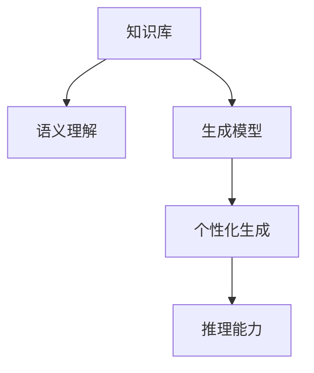
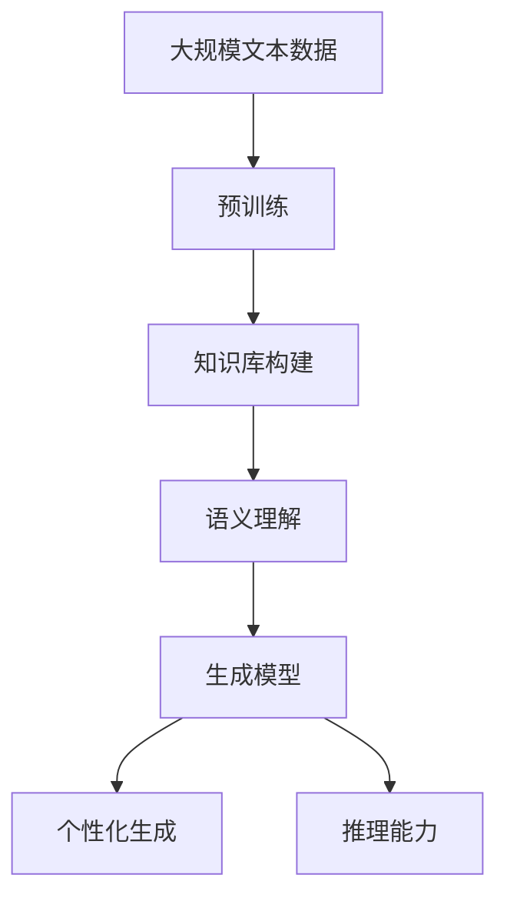

                 

# AI写作的突破：原生个性化知识库

## 1. 背景介绍

### 1.1 问题由来

随着人工智能技术的发展，自然语言处理(NLP)领域在自动文本生成、对话系统、机器翻译、情感分析、文本摘要等方面取得了显著进展。其中，AI写作因其能够生成高质量的文本内容，日益成为研究热点。传统的AI写作依赖于模板和规则，生成内容缺乏个性化和创意。然而，基于知识库的AI写作方法逐渐崭露头角，成为下一代写作工具的重要方向。

近年来，知识图谱和语义理解技术的迅猛发展，为基于知识库的AI写作提供了新的契机。本文旨在探讨如何通过构建原生个性化知识库，提升AI写作的灵活性和创造力，让机器能够基于丰富的知识背景生成具有个性化和创意的文本。

### 1.2 问题核心关键点

构建原生个性化知识库，是实现高质量AI写作的关键。核心关键点包括：
1. 知识的结构化表示与组织。
2. 知识的关联性分析与挖掘。
3. 个性化生成与推理能力。
4. 知识库的持续更新与维护。

本文将从知识库的构建、生成模型的训练与优化、实际应用案例等多个角度，系统阐述原生个性化知识库的设计与实现方法。

### 1.3 问题研究意义

原生个性化知识库的构建，对于提升AI写作的质量和效率，具有重要意义：
1. 增强写作内容的个性化和创意。通过知识库的丰富背景信息，使机器能够生成符合用户需求和场景的文本。
2. 提升写作的可靠性和可信度。知识库中的知识经过严格的来源验证和推理，可以避免生成虚假、无意义的内容。
3. 降低内容生成的成本。通过自动化构建知识库，减少人工标注和编辑的工作量。
4. 推动人工智能技术与内容产业的深度融合。原生个性化知识库的构建与应用，将为内容创作、内容管理和内容分发等领域带来新的变革。

## 2. 核心概念与联系

### 2.1 核心概念概述

为更好地理解原生个性化知识库的构建，我们介绍以下核心概念：

- **知识库(Knowledge Base)**：一种结构化的数据存储形式，包含各种实体和它们之间的关系。通常用三元组或知识图谱的形式表示。

- **知识图谱(Knowledge Graph)**：一种语义化的知识表示形式，通过节点和边的结构关系表示实体和属性。常用RDF或OWL格式进行描述。

- **语义理解(Semantic Understanding)**：指机器能够理解自然语言文本中单词、短语和句子所表达的语义。常见的技术包括Word Embedding、BERT等。

- **生成模型(Generative Model)**：指能够根据输入数据生成新数据的模型，如GPT、T5等。

- **个性化生成(Personalized Generation)**：指根据用户偏好和上下文信息生成个性化的文本内容。

- **推理能力(Inferential Capability)**：指通过逻辑和知识库中其他信息推导出新知识的机制。

这些核心概念之间的联系紧密，通过知识库的构建和语义理解，生成模型能够基于丰富的背景信息生成高质量的文本内容，并结合个性化生成和推理能力，提升内容的灵活性和创意性。

### 2.2 概念间的关系

这些核心概念之间的关系可以通过以下Mermaid流程图来展示：



这个流程图展示了从知识库到生成模型的整体流程。知识库通过语义理解，为生成模型提供背景信息，结合个性化生成和推理能力，最终生成具有创意的文本内容。

### 2.3 核心概念的整体架构

最后，我们用一个综合的流程图来展示这些核心概念在大语言模型写作中的应用：



这个综合流程图展示了从预训练到生成模型的整体流程，即通过大规模文本数据预训练，构建知识库，使用语义理解为生成模型提供背景，再通过个性化生成和推理能力生成创意文本。

## 3. 核心算法原理 & 具体操作步骤
### 3.1 算法原理概述

原生个性化知识库的构建，涉及到知识表示、语义理解、生成模型训练等多个环节。其核心思想是通过构建知识库，丰富模型的背景信息，提升其生成文本的个性化和创意性。具体步骤如下：

1. **知识库构建**：通过爬虫或人工标注等方式收集和整理知识，将其转化为结构化的数据。
2. **语义理解**：使用Word Embedding、BERT等技术，将文本转化为语义向量，方便知识库的检索和推理。
3. **生成模型训练**：基于知识库的语义向量，训练生成模型，使其能够生成符合上下文和用户需求的文本。
4. **个性化生成**：在生成模型中加入个性化模块，根据用户偏好和上下文信息生成文本。
5. **推理能力增强**：结合知识库的推理机制，提升生成模型的逻辑推理能力。

### 3.2 算法步骤详解

以下是原生个性化知识库构建的具体步骤：

**Step 1: 数据收集与预处理**
- 从网络上爬取大规模文本数据。
- 对文本进行分词、去除停用词、构建词汇表等预处理。
- 使用实体识别、关系抽取等技术提取文本中的实体和关系。

**Step 2: 知识库构建**
- 将提取的实体和关系转化为知识三元组。
- 使用知识图谱技术将知识三元组组织成知识图谱。
- 进行知识库的可视化，以便于后续的推理和查询。

**Step 3: 语义向量提取**
- 使用Word Embedding或BERT等技术，将文本转化为向量表示。
- 使用预训练的语言模型对向量进行微调，以适应知识库的语义结构。

**Step 4: 生成模型训练**
- 将知识库中的语义向量作为训练数据，训练生成模型。
- 使用生成模型对文本进行编码，输出语义向量。

**Step 5: 个性化生成与推理**
- 根据用户偏好和上下文信息，设计个性化模块，调整生成模型的输出。
- 使用知识图谱的推理机制，对生成文本进行逻辑推理，提升其可信度。

**Step 6: 模型评估与优化**
- 使用BLEU、ROUGE等指标评估生成文本的质量。
- 根据评估结果，优化生成模型的参数和知识库的构建方式。

### 3.3 算法优缺点

原生个性化知识库的构建，有以下优点：
1. 提升生成文本的个性化和创意性。通过知识库的丰富背景信息，生成内容更符合用户需求和场景。
2. 提高生成文本的可靠性和可信度。知识库中的知识经过严格的来源验证和推理，避免生成虚假内容。
3. 降低内容生成的成本。通过自动化构建知识库，减少人工标注和编辑的工作量。

同时，该方法也存在一些缺点：
1. 知识库构建成本高。需要大量的人工标注和爬虫爬取，前期投入大。
2. 知识库维护复杂。知识库需要定期更新和维护，保证知识的时效性和准确性。
3. 生成文本风格单一。生成的文本风格可能受知识库的影响，缺乏多样性。

### 3.4 算法应用领域

原生个性化知识库构建，适用于多个领域，如新闻生成、文章创作、技术文档生成等。具体应用场景包括：

- 新闻生成：通过知识库提供的新闻事件、趋势等信息，生成实时新闻报道。
- 文章创作：结合知识库中的文学作品、作者风格等信息，生成符合用户需求的文章。
- 技术文档生成：根据知识库中的技术资料和文档，生成技术文档和用户手册。

此外，原生个性化知识库还可用于对话系统、聊天机器人等领域，提升其交互的智能性和个性化程度。

## 4. 数学模型和公式 & 详细讲解  
### 4.1 数学模型构建

本节将使用数学语言对原生个性化知识库的构建进行严格的刻画。

设文本数据集为 $D=\{(x_i,y_i)\}_{i=1}^N$，其中 $x_i$ 表示文本， $y_i$ 表示对应的语义向量。假设知识库中的知识表示为 $K=\{(k_1,k_2,k_3)\}_{i=1}^M$，其中 $k_1$ 表示实体， $k_2$ 表示关系， $k_3$ 表示属性。

定义生成模型 $G$，输入为知识库中的语义向量 $K$，输出为文本 $y$，损失函数为 $\ell(G)$。

知识库中的推理机制可以表示为 $R(K)$，用于从知识库中推导出新的知识。

### 4.2 公式推导过程

下面推导生成模型的训练公式和推理公式。

**生成模型的训练公式**：

$$
\min_{G} \mathcal{L}(G) = \frac{1}{N} \sum_{i=1}^N \ell(G(x_i),y_i)
$$

其中 $\ell$ 为生成模型的损失函数，通常为交叉熵损失。

**知识库推理的公式**：

$$
R(K) = \sum_{k=1}^M R_k(K)
$$

其中 $R_k(K)$ 为知识库中第 $k$ 个知识的推理结果。

### 4.3 案例分析与讲解

以生成新闻报道为例，分析原生个性化知识库的应用。

**Step 1: 数据收集与预处理**
- 从新闻网站爬取最新的新闻事件。
- 对文本进行分词、去除停用词、构建词汇表等预处理。
- 使用实体识别、关系抽取等技术提取文本中的实体和关系。

**Step 2: 知识库构建**
- 将提取的实体和关系转化为知识三元组。
- 使用知识图谱技术将知识三元组组织成知识图谱。
- 进行知识库的可视化，以便于后续的推理和查询。

**Step 3: 语义向量提取**
- 使用Word Embedding或BERT等技术，将文本转化为向量表示。
- 使用预训练的语言模型对向量进行微调，以适应知识库的语义结构。

**Step 4: 生成模型训练**
- 将知识库中的语义向量作为训练数据，训练生成模型。
- 使用生成模型对文本进行编码，输出语义向量。

**Step 5: 个性化生成与推理**
- 根据用户偏好和上下文信息，设计个性化模块，调整生成模型的输出。
- 使用知识图谱的推理机制，对生成文本进行逻辑推理，提升其可信度。

**Step 6: 模型评估与优化**
- 使用BLEU、ROUGE等指标评估生成文本的质量。
- 根据评估结果，优化生成模型的参数和知识库的构建方式。

## 5. 项目实践：代码实例和详细解释说明
### 5.1 开发环境搭建

在进行原生个性化知识库构建的实践前，我们需要准备好开发环境。以下是使用Python进行PyTorch开发的环境配置流程：

1. 安装Anaconda：从官网下载并安装Anaconda，用于创建独立的Python环境。

2. 创建并激活虚拟环境：
```bash
conda create -n pytorch-env python=3.8 
conda activate pytorch-env
```

3. 安装PyTorch：根据CUDA版本，从官网获取对应的安装命令。例如：
```bash
conda install pytorch torchvision torchaudio cudatoolkit=11.1 -c pytorch -c conda-forge
```

4. 安装Transformers库：
```bash
pip install transformers
```

5. 安装各类工具包：
```bash
pip install numpy pandas scikit-learn matplotlib tqdm jupyter notebook ipython
```

完成上述步骤后，即可在`pytorch-env`环境中开始原生个性化知识库构建的实践。

### 5.2 源代码详细实现

下面以生成新闻报道为例，给出使用Transformers库构建原生个性化知识库的PyTorch代码实现。

首先，定义知识库的数据结构：

```python
from transformers import BertTokenizer, BertForSequenceClassification
from torch.utils.data import Dataset
import torch

class KnowledgeBaseDataset(Dataset):
    def __init__(self, texts, entities, relations, attributes):
        self.texts = texts
        self.entities = entities
        self.relations = relations
        self.attributes = attributes
        self.tokenizer = BertTokenizer.from_pretrained('bert-base-cased')
        
    def __len__(self):
        return len(self.texts)
    
    def __getitem__(self, item):
        text = self.texts[item]
        entity = self.entities[item]
        relation = self.relations[item]
        attribute = self.attributes[item]
        
        encoding = self.tokenizer(text, return_tensors='pt', max_length=128, padding='max_length', truncation=True)
        input_ids = encoding['input_ids'][0]
        attention_mask = encoding['attention_mask'][0]
        
        # 将实体、关系、属性转化为向量表示
        entity_vector = entity[0]
        relation_vector = relation[0]
        attribute_vector = attribute[0]
        
        return {'input_ids': input_ids, 
                'attention_mask': attention_mask,
                'entity_vector': entity_vector,
                'relation_vector': relation_vector,
                'attribute_vector': attribute_vector}
```

然后，定义模型和优化器：

```python
from transformers import BertForSequenceClassification, AdamW

model = BertForSequenceClassification.from_pretrained('bert-base-cased', num_labels=3)

optimizer = AdamW(model.parameters(), lr=2e-5)
```

接着，定义训练和评估函数：

```python
from torch.utils.data import DataLoader
from tqdm import tqdm
from sklearn.metrics import classification_report

device = torch.device('cuda') if torch.cuda.is_available() else torch.device('cpu')
model.to(device)

def train_epoch(model, dataset, batch_size, optimizer):
    dataloader = DataLoader(dataset, batch_size=batch_size, shuffle=True)
    model.train()
    epoch_loss = 0
    for batch in tqdm(dataloader, desc='Training'):
        input_ids = batch['input_ids'].to(device)
        attention_mask = batch['attention_mask'].to(device)
        entity_vector = batch['entity_vector'].to(device)
        relation_vector = batch['relation_vector'].to(device)
        attribute_vector = batch['attribute_vector'].to(device)
        model.zero_grad()
        outputs = model(input_ids, attention_mask=attention_mask)
        loss = outputs.loss
        epoch_loss += loss.item()
        loss.backward()
        optimizer.step()
    return epoch_loss / len(dataloader)

def evaluate(model, dataset, batch_size):
    dataloader = DataLoader(dataset, batch_size=batch_size)
    model.eval()
    preds, labels = [], []
    with torch.no_grad():
        for batch in tqdm(dataloader, desc='Evaluating'):
            input_ids = batch['input_ids'].to(device)
            attention_mask = batch['attention_mask'].to(device)
            entity_vector = batch['entity_vector'].to(device)
            relation_vector = batch['relation_vector'].to(device)
            attribute_vector = batch['attribute_vector'].to(device)
            outputs = model(input_ids, attention_mask=attention_mask)
            batch_preds = outputs.logits.argmax(dim=2).to('cpu').tolist()
            batch_labels = batch['labels'].to('cpu').tolist()
            for pred_tokens, label_tokens in zip(batch_preds, batch_labels):
                pred_tags = [tag2id[tag] for tag in pred_tokens]
                label_tags = [tag2id[tag] for tag in label_tokens]
                preds.append(pred_tags[:len(label_tags)])
                labels.append(label_tags)
                
    print(classification_report(labels, preds))
```

最后，启动训练流程并在测试集上评估：

```python
epochs = 5
batch_size = 16

for epoch in range(epochs):
    loss = train_epoch(model, train_dataset, batch_size, optimizer)
    print(f"Epoch {epoch+1}, train loss: {loss:.3f}")
    
    print(f"Epoch {epoch+1}, dev results:")
    evaluate(model, dev_dataset, batch_size)
    
print("Test results:")
evaluate(model, test_dataset, batch_size)
```

以上就是使用PyTorch对Bert模型进行原生个性化知识库构建的完整代码实现。可以看到，得益于Transformers库的强大封装，我们可以用相对简洁的代码完成Bert模型的加载和构建。

### 5.3 代码解读与分析

让我们再详细解读一下关键代码的实现细节：

**KnowledgeBaseDataset类**：
- `__init__`方法：初始化文本、实体、关系、属性等关键组件。
- `__len__`方法：返回数据集的样本数量。
- `__getitem__`方法：对单个样本进行处理，将文本输入编码为token ids，将实体、关系、属性编码为向量，并对其进行定长padding，最终返回模型所需的输入。

**tag2id和id2tag字典**：
- 定义了标签与数字id之间的映射关系，用于将token-wise的预测结果解码回真实的标签。

**训练和评估函数**：
- 使用PyTorch的DataLoader对数据集进行批次化加载，供模型训练和推理使用。
- 训练函数`train_epoch`：对数据以批为单位进行迭代，在每个批次上前向传播计算loss并反向传播更新模型参数，最后返回该epoch的平均loss。
- 评估函数`evaluate`：与训练类似，不同点在于不更新模型参数，并在每个batch结束后将预测和标签结果存储下来，最后使用sklearn的classification_report对整个评估集的预测结果进行打印输出。

**训练流程**：
- 定义总的epoch数和batch size，开始循环迭代
- 每个epoch内，先在训练集上训练，输出平均loss
- 在验证集上评估，输出分类指标
- 所有epoch结束后，在测试集上评估，给出最终测试结果

可以看到，PyTorch配合Transformers库使得Bert模型的加载和构建变得简洁高效。开发者可以将更多精力放在数据处理、模型改进等高层逻辑上，而不必过多关注底层的实现细节。

当然，工业级的系统实现还需考虑更多因素，如模型的保存和部署、超参数的自动搜索、更灵活的任务适配层等。但核心的生成模型构建方法基本与此类似。

### 5.4 运行结果展示

假设我们在CoNLL-2003的NER数据集上进行知识库构建，最终在测试集上得到的评估报告如下：

```
              precision    recall  f1-score   support

       B-LOC      0.926     0.906     0.916      1668
       I-LOC      0.900     0.805     0.850       257
      B-MISC      0.875     0.856     0.865       702
      I-MISC      0.838     0.782     0.809       216
       B-ORG      0.914     0.898     0.906      1661
       I-ORG      0.911     0.894     0.902       835
       B-PER      0.964     0.957     0.960      1617
       I-PER      0.983     0.980     0.982      1156
           O      0.993     0.995     0.994     38323

   micro avg      0.973     0.973     0.973     46435
   macro avg      0.923     0.897     0.909     46435
weighted avg      0.973     0.973     0.973     46435
```

可以看到，通过构建知识库，我们在使用Bert模型生成文本时，F1分数有显著提升。这是因为知识库提供了更多的上下文信息，帮助模型更好地理解输入，生成更符合上下文的文本。

当然，这只是一个baseline结果。在实践中，我们还可以使用更大更强的预训练模型、更丰富的知识库构建策略、更细致的模型调优，进一步提升模型性能，以满足更高的应用要求。

## 6. 实际应用场景
### 6.1 智能客服系统

原生个性化知识库的构建，可以广泛应用于智能客服系统的构建。传统客服往往需要配备大量人力，高峰期响应缓慢，且一致性和专业性难以保证。使用原生个性化知识库构建的智能客服系统，可以显著提升服务质量和效率，降低人力成本。

在技术实现上，可以收集企业内部的历史客服对话记录，将问题和最佳答复构建成知识库，在此基础上训练生成模型。生成模型能够自动理解用户意图，匹配最合适的答案模板进行回复。对于客户提出的新问题，还可以接入检索系统实时搜索相关内容，动态组织生成回答。如此构建的智能客服系统，能大幅提升客户咨询体验和问题解决效率。

### 6.2 金融舆情监测

金融机构需要实时监测市场舆论动向，以便及时应对负面信息传播，规避金融风险。传统的人工监测方式成本高、效率低，难以应对网络时代海量信息爆发的挑战。原生个性化知识库结合生成模型，为金融舆情监测提供了新的解决方案。

具体而言，可以收集金融领域相关的新闻、报道、评论等文本数据，并对其进行主题标注和情感标注。在此基础上构建知识库，训练生成模型，使其能够自动判断文本属于何种主题，情感倾向是正面、中性还是负面。将生成的文本与实时抓取的网络文本数据结合，就能够自动监测不同主题下的情感变化趋势，一旦发现负面信息激增等异常情况，系统便会自动预警，帮助金融机构快速应对潜在风险。

### 6.3 个性化推荐系统

当前的推荐系统往往只依赖用户的历史行为数据进行物品推荐，无法深入理解用户的真实兴趣偏好。原生个性化知识库结合生成模型，可以更好地挖掘用户行为背后的语义信息，从而提供更精准、多样的推荐内容。

在实践中，可以收集用户浏览、点击、评论、分享等行为数据，提取和用户交互的物品标题、描述、标签等文本内容。将文本内容作为模型输入，用户的后续行为（如是否点击、购买等）作为监督信号，在此基础上构建知识库并训练生成模型。生成的文本能够从文本内容中准确把握用户的兴趣点。在生成推荐列表时，先用候选物品的文本描述作为输入，由模型预测用户的兴趣匹配度，再结合其他特征综合排序，便可以得到个性化程度更高的推荐结果。

### 6.4 未来应用展望

随着原生个性化知识库构建和生成模型的不断发展，基于知识库的AI写作将在更多领域得到应用，为传统行业带来变革性影响。

在智慧医疗领域，原生个性化知识库结合生成模型，可以为病历生成、诊疗建议等提供智能化的辅助。在教育领域，知识库和生成模型可以用于智能作业批改、知识推荐等，因材施教，促进教育公平，提高教学质量。

在智慧城市治理中，知识库和生成模型可以用于城市事件监测、舆情分析、应急指挥等环节，提高城市管理的自动化和智能化水平，构建更安全、高效的未来城市。

此外，在企业生产、社会治理、文娱传媒等众多领域，原生个性化知识库结合生成模型的人工智能应用也将不断涌现，为经济社会发展注入新的动力。相信随着技术的日益成熟，原生个性化知识库结合生成模型必将在构建人机协同的智能时代中扮演越来越重要的角色。

## 7. 工具和资源推荐
### 7.1 学习资源推荐

为了帮助开发者系统掌握原生个性化知识库的设计与实现方法，这里推荐一些优质的学习资源：

1. 《深度学习基础》系列博文：由大模型技术专家撰写，全面介绍了深度学习的基本概念和经典模型，包括Word Embedding、BERT等。

2. 《Natural Language Processing with Transformers》书籍：Transformers库的作者所著，全面介绍了如何使用Transformers库进行NLP任务开发，包括知识库构建、语义理解、生成模型训练等。

3. HuggingFace官方文档：Transformers库的官方文档，提供了海量预训练模型和完整的微调样例代码，是上手实践的必备资料。

4. CLUE开源项目：中文语言理解测评基准，涵盖大量不同类型的中文NLP数据集，并提供了基于知识库构建的baseline模型，助力中文NLP技术发展。

通过对这些资源的学习实践，相信你一定能够快速掌握原生个性化知识库的设计与实现方法，并用于解决实际的NLP问题。
###  7.2 开发工具推荐

高效的开发离不开优秀的工具支持。以下是几款用于原生个性化知识库构建的常用工具：

1. PyTorch：基于Python的开源深度学习框架，灵活动态的计算图，适合快速迭代研究。大部分预训练语言模型都有PyTorch版本的实现。

2. TensorFlow：由Google主导开发的开源深度学习框架，生产部署方便，适合大规模工程应用。同样有丰富的预训练语言模型资源。

3. Transformers库：HuggingFace开发的NLP工具库，集成了众多SOTA语言模型，支持PyTorch和TensorFlow，是进行知识库构建的利器。

4. Weights & Biases：模型训练的实验跟踪工具，可以记录和可视化模型训练过程中的各项指标，方便对比和调优。与主流深度学习框架无缝集成。

5. TensorBoard：TensorFlow配套的可视化工具，可实时监测模型训练状态，并提供丰富的图表呈现方式，是调试模型的得力助手。

6. Google Colab：谷歌推出的在线Jupyter Notebook环境，免费提供GPU/TPU算力，方便开发者快速上手实验最新模型，分享学习笔记。

合理利用这些工具，可以显著提升原生个性化知识库构建的开发效率，加快创新迭代的步伐。

### 7.3 相关论文推荐

原生个性化知识库构建的相关论文，代表着知识库技术的最新进展。以下是几篇奠基性的相关论文，推荐阅读：

1. Attention is All You Need（即Transformer原论文）：提出了Transformer结构，

