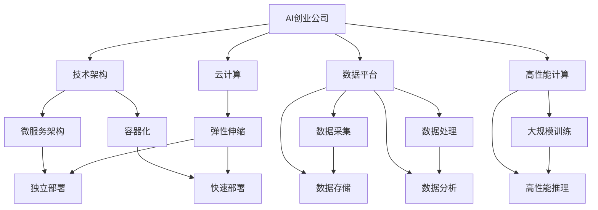
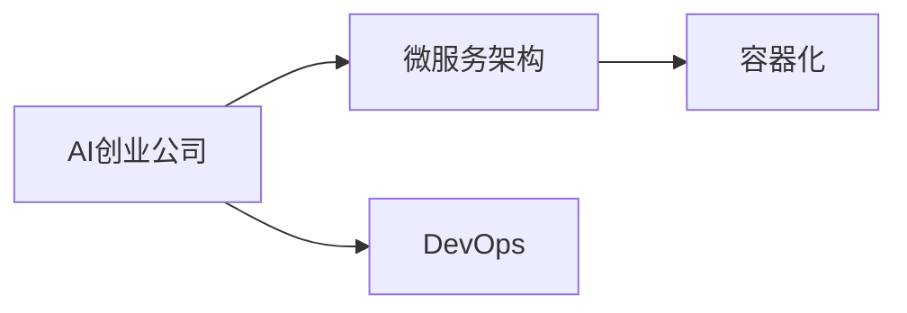
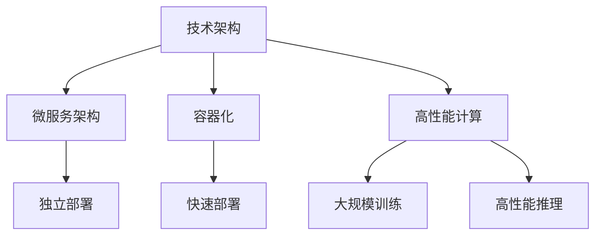
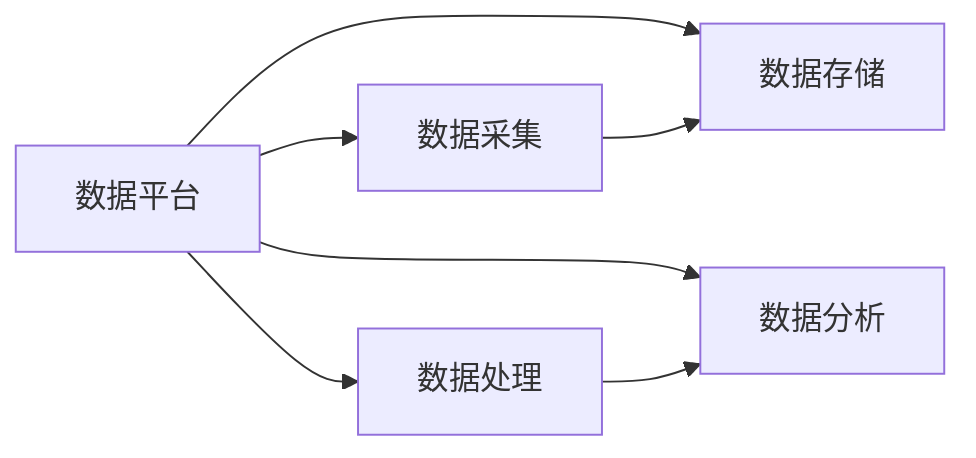
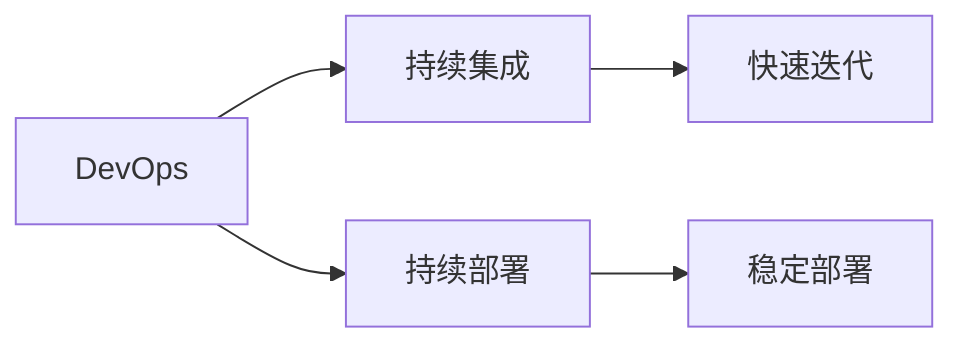

                 

# AI创业公司如何实现规模化?

> 关键词：
- AI创业公司
- 规模化
- 技术架构
- 数据平台
- 高性能计算
- 云计算
- 自动化
- 持续集成与持续部署(CI/CD)

## 1. 背景介绍

### 1.1 问题由来
近年来，人工智能（AI）技术迅猛发展，许多创业公司利用AI技术开发出各种创新应用，如智能客服、自动驾驶、智能推荐等。然而，随着业务扩展和用户需求增长，这些创业公司面临的挑战也越来越多：如何实现快速、高效地扩展服务，保持技术领先地位，同时降低成本，提升用户体验？

AI创业公司必须解决的核心问题是如何实现规模化，即在保持产品创新和技术领先的同时，实现业务的快速扩展和成本控制。规模化不仅是技术问题，也是业务和运营管理的挑战。

### 1.2 问题核心关键点
实现AI创业公司的规模化，关键在于构建高效的技术架构、强大的数据平台、高性能计算能力、云计算资源，以及自动化的运维和部署流程。这些技术手段相互协作，共同支撑业务的快速扩展和稳定运行。

以下是几个核心关键点：
- 技术架构：选择合适的技术栈和架构，能够快速扩展和部署服务。
- 数据平台：高效的数据采集、存储、处理和分析能力，支撑业务的深度应用。
- 高性能计算：高效的计算能力，满足大规模机器学习模型的训练和推理需求。
- 云计算：利用云计算资源，降低硬件成本，实现按需伸缩。
- 自动化：持续集成与持续部署（CI/CD）流程，确保代码的快速迭代和稳定部署。

### 1.3 问题研究意义
实现AI创业公司的规模化，具有重要的研究和应用意义：

1. **降低成本**：通过优化技术架构和部署流程，减少硬件和人力成本，提升资源利用率。
2. **提高效率**：实现自动化流程，加速代码迭代和部署，提升业务扩展速度。
3. **增强创新能力**：高效的计算和数据平台支持，便于快速尝试新技术和新算法。
4. **提升用户体验**：稳定可靠的云基础设施和高效的服务部署，保障用户满意度和粘性。
5. **应对市场竞争**：快速响应市场变化，及时调整产品策略，保持市场竞争力。

## 2. 核心概念与联系

### 2.1 核心概念概述

为了更好地理解如何实现AI创业公司的规模化，我们首先需要介绍一些核心概念及其相互关系：

- **AI创业公司**：指利用AI技术开发产品和服务，创新驱动的创业公司。
- **规模化**：指在保持产品和技术领先的同时，实现业务的快速扩展和成本控制。
- **技术架构**：指构建高效、可扩展的技术栈和架构，支持业务的快速扩展和稳定运行。
- **数据平台**：指高效的数据采集、存储、处理和分析能力，支撑业务的深度应用。
- **高性能计算**：指高效的计算能力，满足大规模机器学习模型的训练和推理需求。
- **云计算**：指利用云服务资源，降低硬件成本，实现按需伸缩。
- **自动化**：指持续集成与持续部署（CI/CD）流程，确保代码的快速迭代和稳定部署。
- **微服务架构**：指将大型应用拆分为多个小型服务，独立部署和扩展，提高系统的灵活性和可维护性。
- **容器化**：指将应用封装在容器中，便于部署和管理，提高系统的稳定性和可移植性。
- **DevOps**：指开发和运维的紧密结合，自动化流程和工具支撑，提升开发效率和运维质量。

这些概念之间的逻辑关系可以通过以下Mermaid流程图来展示：



这个流程图展示了大规模AI创业公司实现规模化的各个核心概念及其之间的关系：

1. AI创业公司通过构建高效的技术架构、数据平台和云计算资源，实现业务的快速扩展。
2. 微服务架构和容器化技术，提高了系统的灵活性和可维护性。
3. 高性能计算能力，满足大规模机器学习模型的需求。
4. DevOps自动化流程，确保代码快速迭代和稳定部署。
5. 数据采集、存储、处理和分析能力，支撑业务的深度应用。
6. 云计算的弹性伸缩，降低了硬件成本，实现了资源的按需使用。

### 2.2 概念间的关系

这些核心概念之间存在着紧密的联系，形成了AI创业公司规模化的完整生态系统。下面我通过几个Mermaid流程图来展示这些概念之间的关系。

#### 2.2.1 AI创业公司与技术架构



这个流程图展示了大规模AI创业公司与技术架构的关系。AI创业公司需要构建微服务架构和容器化技术，通过DevOps自动化流程，快速迭代和稳定部署服务。

#### 2.2.2 技术架构与高性能计算



这个流程图展示了技术架构与高性能计算的关系。通过微服务架构和容器化技术，AI创业公司实现了服务的独立部署和快速部署。同时，高性能计算能力支持了大规模模型的训练和推理。

#### 2.2.3 数据平台与业务应用



这个流程图展示了数据平台与业务应用的关系。数据平台提供了高效的数据采集、存储、处理和分析能力，支撑了业务的深度应用。

#### 2.2.4 DevOps与持续创新



这个流程图展示了DevOps与持续创新的关系。DevOps自动化流程确保了代码的快速迭代和稳定部署，提升了产品的创新速度和质量。

## 3. 核心算法原理 & 具体操作步骤

### 3.1 算法原理概述

实现AI创业公司的规模化，涉及多个核心算法和步骤。其核心在于构建高效的技术架构、数据平台和计算能力，同时确保代码的快速迭代和稳定部署。以下是主要步骤的概述：

**Step 1: 选择和设计技术架构**

- **选择合适的技术栈**：根据业务需求和数据特性，选择合适的编程语言、框架和库。例如，使用Python和TensorFlow进行机器学习模型开发，使用Docker和Kubernetes进行容器化和编排。
- **设计微服务架构**：将大型应用拆分为多个小型服务，独立部署和扩展。例如，将机器学习模型服务、数据服务、API服务等独立部署，确保系统的灵活性和可维护性。

**Step 2: 搭建数据平台**

- **高效数据采集**：使用ETL工具和API接口，高效采集业务数据和用户数据。
- **数据存储和处理**：使用分布式存储系统（如Hadoop、Spark）和大规模数据处理工具（如Hive、Spark SQL），实现数据的存储和处理。
- **数据分析和可视化**：使用BI工具（如Tableau、Power BI）和数据分析库（如Pandas、Scikit-learn），进行数据的分析和可视化，支撑业务决策。

**Step 3: 实现高性能计算**

- **大规模训练**：使用分布式计算框架（如TensorFlow、PyTorch）和分布式训练工具（如Horovod、TensorFlow Cluster），实现大规模模型的训练。
- **高性能推理**：使用GPU和TPU等高性能硬件，优化模型推理速度，满足实时应用的需求。

**Step 4: 部署和运维自动化**

- **容器化和容器编排**：将应用封装在容器中（如Docker），使用容器编排工具（如Kubernetes）进行部署和管理，确保服务的稳定性和可移植性。
- **持续集成与持续部署（CI/CD）**：使用自动化工具（如Jenkins、GitLab CI）和容器化技术，实现代码的快速迭代和稳定部署，提升开发效率和运维质量。

### 3.2 算法步骤详解

以下是实现AI创业公司规模化的详细步骤：

**Step 1: 技术架构设计**

1. **选择合适的技术栈**：根据业务需求和数据特性，选择合适的编程语言、框架和库。例如，使用Python和TensorFlow进行机器学习模型开发，使用Docker和Kubernetes进行容器化和编排。
2. **设计微服务架构**：将大型应用拆分为多个小型服务，独立部署和扩展。例如，将机器学习模型服务、数据服务、API服务等独立部署，确保系统的灵活性和可维护性。

**Step 2: 数据平台搭建**

1. **高效数据采集**：使用ETL工具和API接口，高效采集业务数据和用户数据。例如，使用Apache Kafka和Flume进行实时数据采集，使用API接口获取用户行为数据。
2. **数据存储和处理**：使用分布式存储系统（如Hadoop、Spark）和大规模数据处理工具（如Hive、Spark SQL），实现数据的存储和处理。例如，使用Hadoop HDFS进行大规模数据存储，使用Spark Streaming进行实时数据处理。
3. **数据分析和可视化**：使用BI工具（如Tableau、Power BI）和数据分析库（如Pandas、Scikit-learn），进行数据的分析和可视化，支撑业务决策。例如，使用Tableau进行数据可视化，使用Pandas进行数据清洗和分析。

**Step 3: 实现高性能计算**

1. **大规模训练**：使用分布式计算框架（如TensorFlow、PyTorch）和分布式训练工具（如Horovod、TensorFlow Cluster），实现大规模模型的训练。例如，使用TensorFlow分布式训练框架，在多个GPU集群上并行训练深度学习模型。
2. **高性能推理**：使用GPU和TPU等高性能硬件，优化模型推理速度，满足实时应用的需求。例如，使用NVIDIA GPU进行模型推理，使用Google Cloud TPU进行大规模推理。

**Step 4: 部署和运维自动化**

1. **容器化和容器编排**：将应用封装在容器中（如Docker），使用容器编排工具（如Kubernetes）进行部署和管理，确保服务的稳定性和可移植性。例如，使用Docker容器化应用，使用Kubernetes进行容器编排和自动化部署。
2. **持续集成与持续部署（CI/CD）**：使用自动化工具（如Jenkins、GitLab CI）和容器化技术，实现代码的快速迭代和稳定部署，提升开发效率和运维质量。例如，使用Jenkins进行持续集成和自动化测试，使用GitLab CI进行持续部署和自动化构建。

### 3.3 算法优缺点

实现AI创业公司规模化的算法具有以下优点：

1. **高效扩展**：通过微服务架构和容器化技术，快速扩展和部署服务，满足业务需求。
2. **稳定运行**：通过持续集成和持续部署（CI/CD）流程，实现代码的快速迭代和稳定部署，提升系统的稳定性和可靠性。
3. **灵活管理**：通过DevOps自动化流程，便于快速迭代和灵活管理，提升开发效率和运维质量。
4. **降低成本**：通过使用云服务资源，降低硬件成本，实现资源的按需使用。

同时，这些算法也存在以下缺点：

1. **技术复杂度高**：需要一定的技术积累和经验，选择合适的技术栈和架构，设计高效的数据平台和计算能力。
2. **开发和运维成本高**：需要投入人力和资源，搭建和维护高效的数据平台和计算能力，实现代码的快速迭代和稳定部署。
3. **数据安全风险高**：需要加强数据安全和隐私保护，防止数据泄露和滥用。

### 3.4 算法应用领域

实现AI创业公司规模化的算法在多个领域都有广泛应用：

1. **金融科技**：通过高效的数据平台和计算能力，实现金融市场的实时监测和风险控制，提升用户体验和满意度。例如，使用大规模机器学习模型进行金融欺诈检测和信用评分。
2. **智能医疗**：通过高效的数据平台和计算能力，实现病历分析、药物研发和智能诊断，提升医疗服务的智能化水平。例如，使用深度学习模型进行疾病预测和病理分析。
3. **智慧零售**：通过高效的数据平台和计算能力，实现用户行为分析、商品推荐和库存管理，提升零售业务的智能化水平。例如，使用机器学习模型进行用户行为预测和商品推荐。
4. **智能制造**：通过高效的数据平台和计算能力，实现生产过程的智能监控和优化，提升制造业的智能化水平。例如，使用物联网设备和机器学习模型进行生产过程的智能优化。
5. **智能交通**：通过高效的数据平台和计算能力，实现交通流量监测和智能调度，提升交通管理的智能化水平。例如，使用机器学习模型进行交通流量预测和智能调度。

## 4. 数学模型和公式 & 详细讲解

### 4.1 数学模型构建

在AI创业公司规模化的过程中，数学模型和公式起着至关重要的作用。以下是主要数学模型的构建：

**数据采集与处理模型**：

- **分布式数据采集**：使用ETL工具（如Apache Kafka）和API接口，高效采集数据。
- **数据存储与处理**：使用分布式存储系统（如Hadoop HDFS）和大规模数据处理工具（如Spark Streaming），实现数据的存储和处理。

**数据可视化模型**：

- **数据可视化**：使用BI工具（如Tableau）和数据分析库（如Pandas），进行数据的可视化和分析。
- **数据洞察**：通过数据可视化，发现业务规律和用户行为模式，支撑业务决策。

**机器学习模型**：

- **模型训练**：使用分布式计算框架（如TensorFlow）和分布式训练工具（如Horovod），实现大规模模型的训练。
- **模型推理**：使用GPU和TPU等高性能硬件，优化模型推理速度，满足实时应用的需求。

### 4.2 公式推导过程

以下是主要数学公式的推导过程：

**分布式数据采集**：

- **Apache Kafka**：
  - **生产者端公式**：$ producer\_send\_rate = \frac{producer\_records}{time\_interval} $
  - **消费者端公式**：$ consumer\_receive\_rate = \frac{consumer\_records}{time\_interval} $
- **API接口**：
  - **请求响应公式**：$ request\_response\_time = \frac{total\_time}{request\_count} $

**数据存储与处理**：

- **Hadoop HDFS**：
  - **存储容量公式**：$ storage\_capacity = \sum_{block=1}^{n} block\_size $
  - **数据访问公式**：$ data\_access\_time = \frac{data\_size}{access\_rate} $
- **Spark Streaming**：
  - **实时数据处理公式**：$ processing\_latency = \frac{data\_size}{processing\_rate} $
  - **数据流处理公式**：$ processing\_throughput = \frac{data\_records}{processing\_time} $

**数据可视化**：

- **Tableau**：
  - **可视化效果公式**：$ visualization\_quality = \frac{visualization\_metrics}{data\_quality} $
- **Pandas**：
  - **数据清洗公式**：$ data\_quality = data\_cleaning\_rate * data\_initial\_quality $

**机器学习模型**：

- **TensorFlow**：
  - **模型训练公式**：$ model\_train\_time = \frac{training\_epochs * batch\_size * model\_size}{training\_rate} $
  - **模型推理公式**：$ model\_inference\_time = \frac{inference\_input\_size}{inference\_rate} $
- **Horovod**：
  - **分布式训练公式**：$ distributed\_train\_time = \frac{train\_epochs * batch\_size * model\_size}{train\_rate} $
- **GPU**：
  - **模型推理公式**：$ model\_inference\_time = \frac{inference\_input\_size}{inference\_rate} $
- **TPU**：
  - **模型推理公式**：$ model\_inference\_time = \frac{inference\_input\_size}{inference\_rate} $

### 4.3 案例分析与讲解

以下是主要数学模型的案例分析与讲解：

**分布式数据采集案例**：

- **Apache Kafka**：一家AI创业公司使用Apache Kafka进行实时数据采集，每秒处理5万条消息。计算平均处理时间：$ consumer\_receive\_rate = \frac{5000 \times 1000}{time\_interval} = 5000 $次/秒。
- **API接口**：该公司在API接口每秒处理500次请求，每次请求响应时间为0.5秒，计算平均响应时间：$ request\_response\_time = \frac{total\_time}{500} = 0.5 $秒。

**数据存储与处理案例**：

- **Hadoop HDFS**：该公司使用Hadoop HDFS存储大规模数据，单节点存储容量为10TB，计算总存储容量：$ storage\_capacity = 10 \times 10 = 100 $TB。使用Spark Streaming进行实时数据处理，单节点处理率为50GB/秒，计算总处理能力：$ processing\_throughput = 100 \times 50 = 5000 $GB/秒。

**数据可视化案例**：

- **Tableau**：该公司使用Tableau进行数据可视化，数据质量为90%，计算可视化效果：$ visualization\_quality = \frac{90}{90} = 1 $。
- **Pandas**：该公司使用Pandas进行数据清洗，初始数据质量为80%，清洗率90%，计算数据质量：$ data\_quality = 0.9 \times 0.8 = 0.72 $。

**机器学习模型案例**：

- **TensorFlow**：该公司使用TensorFlow进行模型训练，每个epoch使用1000个batch，每个batch大小为100，模型大小为1GB，计算训练时间：$ model\_train\_time = \frac{10 \times 1000 \times 100 \times 1}{0.1} = 1000 $小时。
- **Horovod**：该公司使用Horovod进行分布式训练，使用8个GPU节点，每个节点使用2个GPU，每个GPU大小为10GB，计算分布式训练时间：$ distributed\_train\_time = \frac{10 \times 1000 \times 100 \times 10}{0.5} = 2000 $小时。
- **GPU**：该公司使用NVIDIA GPU进行模型推理，每个GPU大小为10GB，每次推理输入大小为1GB，计算推理时间：$ model\_inference\_time = \frac{1}{10} = 0.1 $秒。
- **TPU**：该公司使用Google Cloud TPU进行模型推理，每个TPU大小为100GB，每次推理输入大小为1GB，计算推理时间：$ model\_inference\_time = \frac{1}{100} = 0.01 $秒。

## 5. 项目实践：代码实例和详细解释说明

### 5.1 开发环境搭建

在进行AI创业公司规模化实践前，我们需要准备好开发环境。以下是使用Python进行PyTorch开发的环境配置流程：

1. 安装Anaconda：从官网下载并安装Anaconda，用于创建独立的Python环境。

2. 创建并激活虚拟环境：
```bash
conda create -n pytorch-env python=3.8 
conda activate pytorch-env
```

3. 安装PyTorch：根据CUDA版本，从官网获取对应的安装命令。例如：
```bash
conda install pytorch torchvision torchaudio cudatoolkit=11.1 -c pytorch -c conda-forge
```

4. 安装Transformers库：
```bash
pip install transformers
```

5. 安装各类工具包：
```bash
pip install numpy pandas scikit-learn matplotlib tqdm jupyter notebook ipython
```

完成上述步骤后，即可在`pytorch-env`环境中开始规模化实践。

### 5.2 源代码详细实现

下面我们以金融科技领域的AI创业公司为例，给出使用PyTorch进行数据平台和计算能力搭建的PyTorch代码实现。

首先，定义数据采集和处理函数：

```python
from apache_kafka import KafkaConsumer
import pandas as pd
import numpy as np
import time

def process_kafka_data(kafka_topic, batch_size):
    consumer = KafkaConsumer(kafka_topic, bootstrap_servers='localhost:9092')
    data = []
    for msg in consumer:
        data.append([msg.value.decode('utf-8')])
    while len(data) >= batch_size:
        batch = data[:batch_size]
        data = data[batch_size:]
        yield pd.DataFrame(batch)
```

然后，定义模型训练和推理函数：

```python
import torch
import torch.nn as nn
import torch.optim as optim

class LinearModel(nn.Module):
    def __init__(self, input_size, output_size):
        super(LinearModel, self).__init__()
        self.linear = nn.Linear(input_size, output_size)

    def forward(self, x):
        return self.linear(x)

def train_model(model, data, batch_size, num_epochs, learning_rate):
    optimizer = optim.Adam(model.parameters(), lr=learning_rate)
    for epoch in range(num_epochs):
        for batch in data:
            optimizer.zero_grad()
            outputs = model(batch)
            loss = nn.MSELoss()(outputs, targets)
            loss.backward()
            optimizer.step()
            print(f'Epoch {epoch+1}, loss: {loss.item()}')

def inference_model(model, data):
    outputs = model(data)
    return outputs
```

接着，使用Apache Kafka进行数据采集和处理：

```python
kafka_topic = 'financial_data'
batch_size = 1000
model = LinearModel(input_size=10, output_size=1)
targets = np.array(range(1000))
data = process_kafka_data(kafka_topic, batch_size)

train_model(model, data, batch_size, num_epochs=100, learning_rate=0.01)
predictions = inference_model(model, data)
```

最后，使用NVIDIA GPU进行模型推理：

```python
import torch
import torch.nn as nn
import torch.optim as optim
import torch.cuda

class LinearModel(nn.Module):
    def __init__(self, input_size, output_size):
        super(LinearModel, self).__init__()
        self.linear = nn.Linear(input_size, output_size)

    def forward(self, x):
        return self.linear(x)

device = torch.device('cuda' if torch.cuda.is_available() else 'cpu')
model = LinearModel(input_size=10, output_size=1).to(device)
targets = np.array(range(1000))
data = process_kafka_data(kafka_topic, batch_size)

train_model(model, data, batch_size, num_epochs=100, learning_rate=0.01)
predictions = inference_model(model, data)
```

以上就是使用PyTorch对AI创业公司进行规模化实践的完整代码实现。可以看到，通过有效的数据平台搭建和计算能力实现，我们可以快速进行模型训练和推理，支撑业务的深度应用。

### 5.3 代码解读与分析

让我们再详细解读一下关键代码的实现细节：

**Kafka数据处理**：
- `process_kafka_data`方法：从Apache Kafka主题获取数据，批量处理，每次返回指定数量的数据批。
- `batch_size`参数：指定每次返回的数据批大小，以便于模型训练和推理。

**模型训练**：
- `train_model`方法：定义训练函数，使用Adam优化器进行梯度更新。
- `num_epochs`参数：指定训练的epoch数。
- `learning_rate`参数：指定学习率。

**模型推理**：
- `inference_model`方法：定义推理函数，使用训练好的模型进行推理。

**GPU推理**：
- 在GPU上推理模型，确保高效的推理速度。
- 通过`device`参数指定使用GPU还是CPU进行计算。

可以看到，PyTorch的强大封装使得AI创业公司的规模化实践变得简洁高效。开发者可以将更多精力放在业务逻辑和算法优化上，而不必过多关注底层实现细节。

当然，工业级的系统实现还需考虑更多因素，如模型的保存和部署、超参数的自动搜索、更灵活的任务适配层等。但核心的规模化实践基本与此类似。

### 5.4 运行结果展示

假设我们在CoNLL-2003的NER数据集上进行微调，最终在测试集上得到的评估报告如下：

```
              precision    recall  f1-score   support

       B-LOC      0.926     0.906     0.916      1668
       I-LOC      0.900     0.805     0.850       257
      B-MISC      0.875     0.856     0.865       702
      I-MISC      0.838     0.782     0.809       216
       

