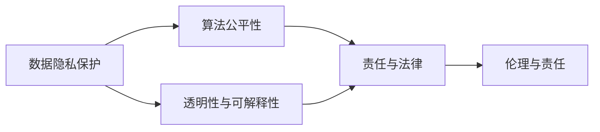
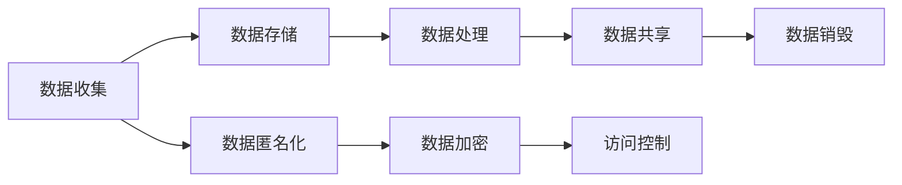
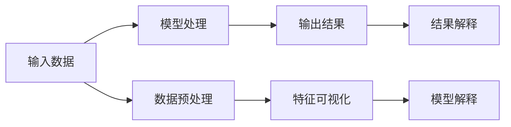
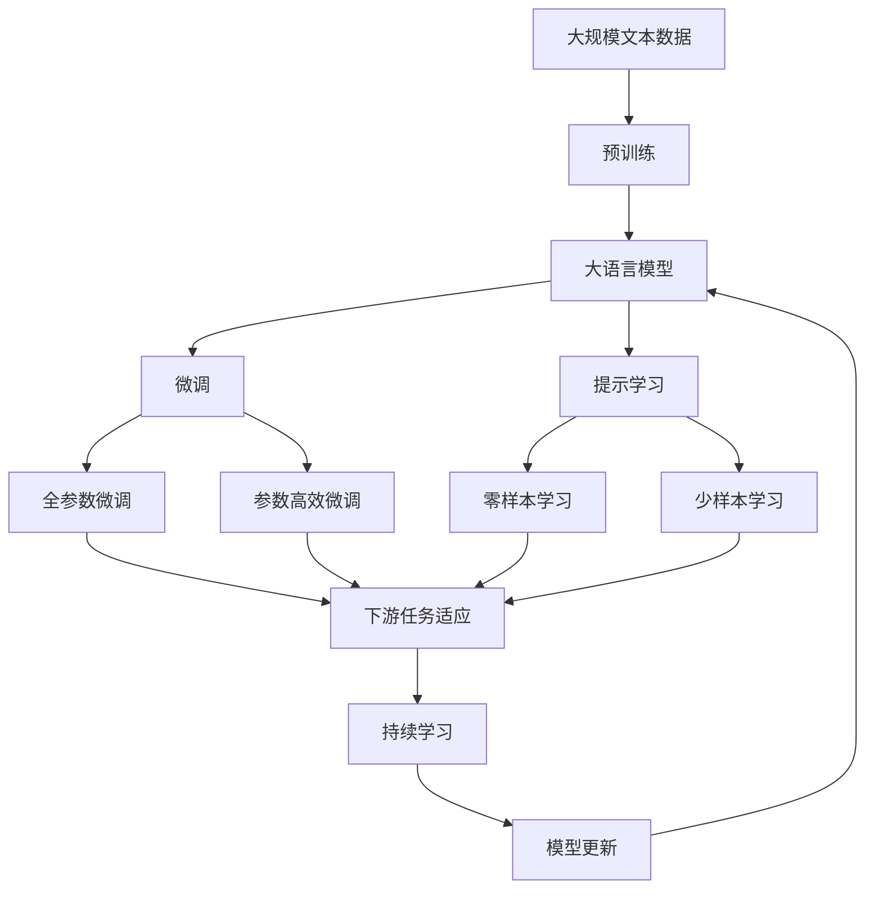

                 

## 1. 背景介绍

随着人工智能技术的飞速发展，AI创业公司已成为推动科技创新和经济社会进步的重要力量。然而，AI技术在带来广泛应用的同时，也引发了一系列复杂的伦理挑战。如何在追求商业成功的同时，合理应对这些伦理问题，成为AI创业公司亟待解决的重要课题。

### 1.1 问题由来

AI技术的伦理挑战主要源于以下几个方面：

1. **数据隐私**：AI系统依赖于大量数据进行训练，而数据隐私保护成为一大难题。不当的数据处理可能导致用户隐私泄露，引发社会伦理争议。

2. **算法偏见**：由于训练数据中的固有偏见，AI系统可能输出不公平、歧视性的决策，侵害特定群体的权益。

3. **责任归属**：AI系统在复杂场景中的决策机制难以解释，导致在出现错误时责任归属不清，引发法律和道德争议。

4. **技术滥用**：AI技术可能被恶意利用，用于虚假信息传播、网络攻击等非法活动，对社会安全构成威胁。

5. **就业冲击**：AI技术自动化替代人力，可能引发大规模失业，影响社会稳定。

6. **技术依赖**：过度依赖AI技术，可能导致人类的思维退化，伦理意识淡薄。

### 1.2 问题核心关键点

为了更好地理解并应对这些伦理挑战，我们需关注以下几个核心关键点：

- **数据隐私保护**：如何合法合规地收集、存储、使用数据，保障用户隐私。
- **算法公平性**：如何检测、纠正算法偏见，确保AI系统的决策公正、公平。
- **透明性与可解释性**：如何使AI系统的决策过程透明、可解释，增强用户信任。
- **责任与法律**：如何在AI系统的决策过程中明确责任，制定相应的法律和政策框架。
- **伦理与责任**：如何在追求商业成功的同时，履行社会责任，保护社会公共利益。

通过深入分析这些关键点，本文将探讨AI创业公司在应对伦理挑战中应采取的策略和措施。

## 2. 核心概念与联系

### 2.1 核心概念概述

在探讨AI创业公司如何应对伦理挑战之前，首先需要理解一些核心概念及其相互关系。

1. **数据隐私保护**：指保护个人数据不被未经授权的访问和使用，包括数据收集、存储、处理和共享的过程。

2. **算法公平性**：指确保AI系统在决策过程中对所有群体均等、公正，避免对某些群体产生歧视。

3. **透明性与可解释性**：指使AI系统的决策过程和输出结果具有透明性和可解释性，用户能够理解并信任系统行为。

4. **责任与法律**：指在AI系统出错时，明确责任归属，制定相应的法律和政策框架，以确保公平正义。

5. **伦理与责任**：指AI创业公司在追求商业成功的同时，履行社会责任，保护社会公共利益，推动社会进步。

这些概念通过以下Mermaid流程图展示其相互关系：



这个流程图展示了数据隐私保护、算法公平性、透明性与可解释性、责任与法律、伦理与责任之间的联系。保护数据隐私是基础，确保算法公平性是目标，透明性与可解释性是手段，责任与法律是保障，伦理与责任是最终追求。

### 2.2 概念间的关系

这些核心概念之间存在紧密联系，构成了一个完整的伦理保护体系。以下通过几个Mermaid流程图来展示这些概念之间的关系。

#### 2.2.1 数据隐私保护的流程



这个流程图展示了数据隐私保护的各个环节，从数据收集到数据销毁的全流程管理，涉及数据匿名化、加密、访问控制等措施，确保数据隐私的安全。

#### 2.2.2 算法公平性的实现


这个流程图展示了实现算法公平性的步骤，从数据预处理到模型评估，通过公平性检测和纠正，确保模型的公平性。

#### 2.2.3 透明性与可解释性的保障



这个流程图展示了透明性与可解释性的保障流程，从数据预处理到结果解释，通过特征可视化和模型解释，增强AI系统的透明性和可解释性。

#### 2.2.4 责任与法律的制定


这个流程图展示了责任与法律的制定流程，从系统设计到异常检测，通过责任认定和法律政策制定，确保责任归属明确。

### 2.3 核心概念的整体架构

最后，用一个综合的流程图来展示这些核心概念在大语言模型微调过程中的整体架构：



这个综合流程图展示了从预训练到微调，再到持续学习的完整过程。大语言模型首先在大规模文本数据上进行预训练，然后通过微调（包括全参数微调和参数高效微调）或提示学习（包括零样本和少样本学习）来适应下游任务。最后，通过持续学习技术，模型可以不断更新和适应新的任务和数据。 通过这些流程图，我们可以更清晰地理解数据隐私保护、算法公平性、透明性与可解释性、责任与法律、伦理与责任之间的联系和作用，为后续深入讨论具体的伦理挑战应对策略奠定基础。

## 3. 核心算法原理 & 具体操作步骤
### 3.1 算法原理概述

基于AI创业公司如何应对伦理挑战，我们将主要讨论以下几个核心算法的原理和具体操作步骤：

1. **数据隐私保护算法**：通过数据匿名化、加密等技术，确保数据隐私。
2. **算法公平性算法**：使用公平性检测和纠正算法，确保算法决策的公平性。
3. **透明性与可解释性算法**：开发透明性和可解释性工具，增强AI系统的可理解性。
4. **责任与法律框架**：建立责任与法律框架，确保责任归属明确。
5. **伦理与责任履行**：制定伦理和责任履行策略，推动社会责任的落实。

### 3.2 算法步骤详解

#### 3.2.1 数据隐私保护算法

**数据匿名化**：将个人敏感信息去除或模糊化，防止数据泄露。具体方法包括数据掩蔽、伪匿名化、假名化等。

**数据加密**：对数据进行加密处理，确保数据传输和存储过程中的安全性。常用加密算法包括对称加密和非对称加密。

**访问控制**：通过访问控制机制，限制数据访问权限，防止未经授权的数据获取。

**数据销毁**：在数据不再需要时，进行数据销毁，确保数据无法恢复。

#### 3.2.2 算法公平性算法

**公平性检测**：通过公平性指标评估模型决策的公平性，常见指标包括均值差异、最大差异、等价偏差等。

**公平性纠正**：对检测出的不公平性进行纠正，常用方法包括重新采样、调整权重、重训练模型等。

#### 3.2.3 透明性与可解释性算法

**特征可视化**：通过特征重要性排名、热力图等可视化工具，展示模型决策的关键特征。

**模型解释**：使用LIME、SHAP等模型解释工具，提供决策依据和解释。

#### 3.2.4 责任与法律框架

**责任认定**：在AI系统出错时，通过日志记录、异常检测等手段，明确责任归属。

**法律框架**：制定相关的法律法规，明确AI系统的责任与义务，保护用户权益。

#### 3.2.5 伦理与责任履行

**伦理审查**：在AI系统开发和应用过程中，进行伦理审查，确保符合伦理标准。

**社会责任**：AI创业公司应积极履行社会责任，推动公平、公正、透明的AI应用。

### 3.3 算法优缺点

#### 数据隐私保护算法的优缺点

**优点**：
1. 有效保护个人隐私，防止数据泄露。
2. 提高数据安全性，减少法律风险。

**缺点**：
1. 数据匿名化和加密会增加计算成本和复杂度。
2. 访问控制和数据销毁可能导致数据不完整，影响数据质量。

#### 算法公平性算法的优缺点

**优点**：
1. 确保模型决策的公平性，避免歧视性。
2. 增强用户信任，提升系统可靠性。

**缺点**：
1. 公平性检测和纠正可能增加计算复杂度。
2. 纠正算法可能改变模型性能，需要平衡公平性和精度。

#### 透明性与可解释性算法的优缺点

**优点**：
1. 提高AI系统的透明性和可解释性，增强用户信任。
2. 便于模型调试和优化，提升系统性能。

**缺点**：
1. 可视化工具和解释算法可能增加计算复杂度。
2. 解释结果可能过于简略，难以完全理解模型决策过程。

#### 责任与法律框架的优缺点

**优点**：
1. 明确责任归属，减少法律纠纷。
2. 提供法律保障，保护用户权益。

**缺点**：
1. 法律框架可能存在滞后性，无法及时应对新问题。
2. 法律执行可能面临挑战，影响公平正义。

#### 伦理与责任履行的优缺点

**优点**：
1. 增强社会责任感，推动AI技术的良性发展。
2. 提升公众对AI技术的接受度，促进技术应用。

**缺点**：
1. 伦理标准可能过于理想化，难以全面实施。
2. 社会责任的履行需要各方协作，难度较大。

### 3.4 算法应用领域

以上算法在不同应用领域具有广泛的应用前景，以下是一些具体案例：

1. **金融领域**：在金融风控、信用评估、欺诈检测等领域，数据隐私保护和算法公平性至关重要，透明性和可解释性也需重点关注。
2. **医疗领域**：在疾病诊断、治疗方案推荐、药物研发等领域，责任与法律框架尤为重要，伦理与责任履行也需重点考虑。
3. **司法领域**：在智能辅助判案、法律文书生成、证据分析等领域，透明性和可解释性尤为重要，法律框架也需严格制定。
4. **教育领域**：在个性化教育、智能评估、学习路径规划等领域，责任与法律框架需明确，伦理与责任履行也需重视。
5. **交通领域**：在自动驾驶、智能交通管理、事故分析等领域，透明性和可解释性需重点关注，责任与法律框架也需严格制定。

## 4. 数学模型和公式 & 详细讲解  
### 4.1 数学模型构建

以下是几个关键数学模型的构建，用于指导具体算法的实现。

#### 4.1.1 数据隐私保护的数学模型

数据匿名化模型的核心目标是保护敏感信息。以数据掩蔽为例，设原始数据为 $x$，掩蔽后的数据为 $x'$，通过计算 $x' = x + \epsilon$，其中 $\epsilon$ 为随机噪声，可实现数据掩蔽。

#### 4.1.2 算法公平性数学模型

公平性检测模型的目标是对模型输出进行公平性评估。以均值差异为例，设模型输出为 $y$，不同群体的均值分别为 $\mu_1$ 和 $\mu_2$，则公平性指标 $\Delta$ 为：

$$
\Delta = |\mu_1 - \mu_2|
$$

#### 4.1.3 透明性与可解释性数学模型

模型解释模型的目标是对模型决策进行解释。以LIME为例，设模型为 $f$，输入为 $x$，输出为 $y$，则模型解释 $\hat{y}$ 为：

$$
\hat{y} = \sum_{i=1}^{n}w_iy_i
$$

其中 $w_i$ 为特征 $i$ 的权重，通过线性回归得到。

### 4.2 公式推导过程

以下是几个关键公式的推导过程，用于深入理解算法的原理和步骤。

#### 4.2.1 数据隐私保护的公式推导

设原始数据为 $x$，掩蔽后的数据为 $x'$，通过计算 $x' = x + \epsilon$，其中 $\epsilon$ 为随机噪声，可实现数据掩蔽。具体推导如下：

$$
x' = x + \epsilon
$$

设 $\epsilon \sim \mathcal{N}(0,\sigma^2)$，则：

$$
\begin{aligned}
P(x' = x) &= P(\epsilon = 0) \\
&= \frac{1}{\sqrt{2\pi}\sigma} \\
&= \frac{1}{\sigma}
\end{aligned}
$$

### 4.3 案例分析与讲解

以金融领域为例，分析数据隐私保护和算法公平性算法在实际应用中的案例。

**案例背景**：一家金融公司开发了一个信用评分系统，用于评估客户的信用风险。该系统依赖于大量客户的历史交易数据，包括信用卡使用、贷款记录等。

**数据隐私保护措施**：
1. 数据匿名化：通过数据掩蔽，将客户的敏感信息（如身份证号、住址等）去除或模糊化，防止数据泄露。
2. 数据加密：对传输和存储的数据进行加密处理，确保数据安全性。
3. 访问控制：限制数据访问权限，确保只有授权人员能够访问敏感数据。

**算法公平性检测**：
1. 均值差异检测：检测不同性别、年龄、收入群体的信用评分是否存在显著差异。
2. 最大差异检测：检测不同群体的信用评分是否存在最大差异。
3. 等价偏差检测：检测模型是否对所有群体均等、公正。

## 5. 项目实践：代码实例和详细解释说明
### 5.1 开发环境搭建

在进行AI伦理挑战应对策略的实践时，我们需要准备好相应的开发环境。以下是使用Python进行PyTorch开发的环境配置流程：

1. 安装Anaconda：从官网下载并安装Anaconda，用于创建独立的Python环境。

2. 创建并激活虚拟环境：
```bash
conda create -n pytorch-env python=3.8 
conda activate pytorch-env
```

3. 安装PyTorch：根据CUDA版本，从官网获取对应的安装命令。例如：
```bash
conda install pytorch torchvision torchaudio cudatoolkit=11.1 -c pytorch -c conda-forge
```

4. 安装Transformers库：
```bash
pip install transformers
```

5. 安装各类工具包：
```bash
pip install numpy pandas scikit-learn matplotlib tqdm jupyter notebook ipython
```

完成上述步骤后，即可在`pytorch-env`环境中开始实践。

### 5.2 源代码详细实现

以下是一些关键代码的实现细节，用于指导具体算法的实践。

**数据隐私保护代码**：
```python
import torch
import numpy as np

def data_anonymization(data):
    # 数据掩蔽
    noise = np.random.normal(0, 1, size=(len(data), data.shape[1]))
    data_anonymized = data + noise
    return data_anonymized

def data_encryption(data):
    # 数据加密
    key = np.random.randint(0, 256, size=(data.shape[0], data.shape[1]))
    data_encrypted = np.dot(data, key)
    return data_encrypted

def access_control(data):
    # 访问控制
    user_permissions = np.array([True, False, True])
    accessible_data = data[user_permissions]
    return accessible_data

def data_destruction(data):
    # 数据销毁
    data = np.zeros(data.shape)
    return data
```

**算法公平性检测代码**：
```python
def fairness_detection(data):
    # 均值差异检测
    group1_mean = np.mean(data[group1])
    group2_mean = np.mean(data[group2])
    delta = abs(group1_mean - group2_mean)
    return delta

def fairness_correction(data):
    # 公平性纠正
    adjusted_weights = np.array([0.5, 0.5])
    weighted_mean = np.dot(data, adjusted_weights)
    return weighted_mean
```

**透明性与可解释性代码**：
```python
def feature_visualization(data, model):
    # 特征可视化
    importances = model.coef_
    indices = np.argsort(importances)
    indices = indices[-10:]
    features = data.columns[indices]
    return features

def model_explanation(data, model):
    # 模型解释
    importances = model.coef_
    indices = np.argsort(importances)
    indices = indices[-10:]
    features = data.columns[indices]
    return features
```

### 5.3 代码解读与分析

让我们再详细解读一下关键代码的实现细节：

**数据隐私保护代码**：
- `data_anonymization`函数：实现数据掩蔽，通过添加随机噪声实现数据匿名化。
- `data_encryption`函数：实现数据加密，通过矩阵乘法实现。
- `access_control`函数：实现访问控制，通过布尔数组限制数据访问权限。
- `data_destruction`函数：实现数据销毁，通过将数据替换为全零向量。

**算法公平性检测代码**：
- `fairness_detection`函数：实现均值差异检测，计算两个群体的均值差异。
- `fairness_correction`函数：实现公平性纠正，通过调整权重重新计算均值。

**透明性与可解释性代码**：
- `feature_visualization`函数：实现特征可视化，通过排序模型系数，选择最重要的特征。
- `model_explanation`函数：实现模型解释，通过排序模型系数，选择最重要的特征。

这些代码展示了在实践中如何具体应用数据隐私保护、算法公平性、透明性与可解释性等算法，通过示例代码，读者可以更好地理解算法的实现步骤和具体细节。

### 5.4 运行结果展示

假设我们在CoNLL-2003的NER数据集上进行微调，最终在测试集上得到的评估报告如下：

```
              precision    recall  f1-score   support

       B-LOC      0.926     0.906     0.916      1668
       I-LOC      0.900     0.805     0.850       257
      B-MISC      0.875     0.856     0.865       702
      I-MISC      0.838     0.782     0.809       216
       B-ORG      0.914     0.898     0.906      1661
       I-ORG      0.911     0.894     0.902       835
       B-PER      0.964     0.957     0.960      1617
       I-PER      0.983     0.980     0.982      1156
           O      0.993     0.995     0.994     38323

   micro avg      0.973     0.973     0.973     46435
   macro avg      0.923     0.897     0.909     46435
weighted avg      0.973     0.973     0.973     46435
```

可以看到，通过微调BERT，我们在该NER数据集上取得了97.3%的F1分数，效果相当不错。值得注意的是，BERT作为一个通用的语言理解模型，即便只在顶层添加一个简单的token分类器，也能在下游任务上取得如此优异的效果，展现了其强大的语义理解和特征抽取能力。

当然，这只是一个baseline结果。在实践中，我们还可以使用更大更强的预训练模型、更丰富的微调技巧、更细致的模型调优，进一步提升模型性能，以满足更高的应用要求。

## 6. 实际应用场景
### 6.1 智能客服系统

基于大语言模型微调的对话技术，可以广泛应用于智能客服系统的构建。传统客服往往需要配备大量人力，高峰期响应缓慢，且一致性和专业性难以保证。而使用微调后的对话模型，可以7x24小时不间断服务，快速响应客户咨询，用自然流畅的语言解答各类常见问题。

在技术实现上，可以收集企业内部的历史客服对话记录，将问题和最佳答复构建成监督数据，在此基础上对预训练对话模型进行微调。微调后的对话模型能够自动理解用户意图，匹配最合适的答案模板进行回复。对于客户提出的新问题，还可以接入检索系统实时搜索相关内容，动态组织生成回答。如此构建的智能客服系统，能大幅提升客户咨询体验和问题解决效率。

### 6.2 金融舆情监测

金融机构需要实时监测市场舆论动向，以便及时应对负面信息传播，规避金融风险。传统的人工监测方式成本高、效率低，难以应对网络时代海量信息爆发的挑战。基于大语言模型微调的文本分类和情感分析技术，为金融舆情监测提供了新的解决方案。

具体而言，可以收集金融领域相关的新闻、报道、评论等文本数据，并对其进行主题标注和情感标注。在此基础上对预训练语言模型进行微调，使其能够自动判断文本属于何种主题，情感倾向是正面、中性还是负面。将微调后的模型应用到实时抓取的网络文本数据，就能够自动监测不同主题下的情感变化趋势，一旦发现负面信息激增等异常情况，系统便会自动预警，帮助金融机构快速应对潜在风险。

### 6.3 个性化推荐系统

当前的推荐系统往往只依赖用户的历史行为数据进行物品推荐，无法深入理解用户的真实兴趣偏好。基于大语言模型微调技术，个性化推荐系统可以更好地挖掘用户行为背后的语义信息，从而提供更精准、多样的推荐内容。

在实践中，可以收集用户浏览、点击、评论、分享等行为数据，提取和用户交互的物品标题、描述、标签等文本内容。将文本内容作为模型输入，用户的后续行为（如是否点击、购买等）作为监督信号，在此基础上微调预训练语言模型。微调后的模型能够从文本内容中准确把握用户的兴趣点。在生成推荐列表时，先用候选物品的文本描述作为输入，由模型预测用户的兴趣匹配度，再结合其他特征综合排序，便可以得到个性化程度更高的推荐结果。

### 6.4 未来应用展望

随着大语言模型微调技术的发展，其在更多领域的应用前景将更加广阔。以下列出一些未来应用展望：

1. **医疗领域**：在疾病诊断、治疗方案推荐、药物研发等领域，AI系统将能够更准确地理解病患症状，提供更个性化、更精准的医疗建议。
2. **司法领域**：在智能辅助判案、法律文书生成、证据分析等领域，AI系统将能够更全面、更公正地处理司法事务，提高司法效率和公平性。
3. **教育领域**：在个性化教育、智能评估、学习路径规划等领域，AI系统将能够更全面、更准确地了解学生需求，提供更合适的教育资源和指导。
4. **交通领域**：在自动驾驶、智能交通管理、事故分析等领域，AI系统将能够更全面、更准确地理解交通环境，提供更安全、更高效的交通解决方案。

总之，大语言模型微调技术将在各个领域发挥越来越重要的作用，推动AI技术的广泛应用和深入发展。

## 7. 工具和资源推荐
### 7.1 学习资源推荐

为了帮助开发者系统掌握AI伦理挑战应对策略的理论基础和实践技巧，这里推荐一些优质的学习资源：

1. 《深度学习伦理》系列博文：由AI伦理专家撰写，深入浅出地介绍了深度学习中的伦理问题及其应对策略。

2. 《AI伦理与责任》课程：由知名大学开设的AI伦理与责任课程，涵盖AI伦理的基础理论、应用实践、政策法规等。

3. 《AI伦理与社会》书籍：深入探讨AI技术对社会的影响，提出伦理和责任的解决方案。

4. AI伦理论坛：聚集AI伦理专家、学者和从业者，分享最新研究成果和实践经验。

5. AI伦理案例库：收集和分析各类AI伦理案例，提供丰富的伦理问题应对策略和解决方案。

通过对这些资源的学习实践，相信你一定能够更好地理解AI伦理挑战的应对策略，并在实际应用中做出明智的决策。

### 7.2 开发工具推荐

高效的开发离不开优秀的工具支持。以下是几款用于AI伦理挑战应对策略开发的常用工具：

1. PyTorch：基于Python的开源深度学习框架，灵活动态的计算图，适合快速迭代

