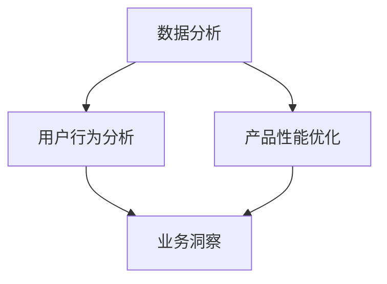
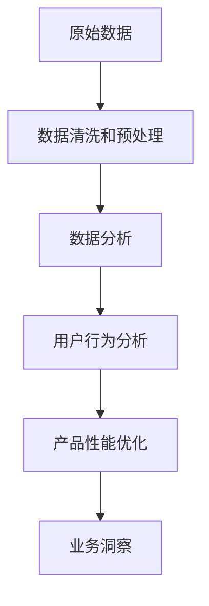

                 

# AI创业公司的产品数据分析：用户行为、产品性能与业务洞察

> 关键词：数据分析, 用户行为分析, 产品性能优化, 业务洞察, 机器学习, 数据可视化, 特征工程, 决策支持

## 1. 背景介绍

在当前数字化时代，数据驱动型AI创业公司如雨后春笋般涌现。无论是初创企业还是成长型企业，数据都成为了推动业务发展的核心资源。有效利用数据，洞察用户行为，优化产品性能，将为公司带来竞争优势。本文将从产品数据分析的角度出发，深入探讨AI创业公司如何通过数据分析提升业务水平，并结合具体案例，展示数据驱动型创新的魅力。

## 2. 核心概念与联系

### 2.1 核心概念概述

在数据分析的过程中，涉及多个关键概念：

- **数据分析**：通过对原始数据进行清洗、处理和分析，提取有价值的信息。
- **用户行为分析**：研究用户的行为模式和偏好，帮助企业理解用户需求。
- **产品性能优化**：通过分析用户使用产品的情况，改进产品的功能和性能。
- **业务洞察**：基于数据分析结果，提炼出对业务决策有指导意义的洞察。

这些概念之间存在紧密的联系：

1. **数据分析**是基础，通过数据清洗和处理，为后续的分析工作提供准确的数据。
2. **用户行为分析**建立在数据分析的基础上，进一步深入挖掘数据中隐藏的规律和趋势。
3. **产品性能优化**结合用户行为分析的结果，针对性地改进产品，提升用户体验。
4. **业务洞察**则是对数据分析、用户行为分析和产品性能优化的总结，指导业务策略的制定。

### 2.2 核心概念间的关系

这些核心概念之间的联系可以通过以下Mermaid流程图来展示：



这个流程图展示了数据分析、用户行为分析、产品性能优化和业务洞察之间的关系：

- 数据分析为其他三个模块提供数据基础。
- 用户行为分析利用数据分析的结果，更深入地理解用户行为。
- 产品性能优化基于用户行为分析，改进产品性能。
- 业务洞察结合前三个模块的结果，提炼出对业务有指导意义的洞察。

### 2.3 核心概念的整体架构

为了更清晰地理解这些概念的相互作用和整体流程，我们可以通过一个综合的流程图来展示：



这个综合流程图展示了从原始数据到业务洞察的完整数据处理流程：

1. 原始数据经过清洗和预处理后，进入数据分析模块。
2. 数据分析模块通过统计学、机器学习等方法，提取有用的信息。
3. 用户行为分析模块基于数据分析的结果，进一步挖掘用户行为模式。
4. 产品性能优化模块结合用户行为分析的结果，优化产品功能和性能。
5. 业务洞察模块基于前三个模块的结果，提炼出对业务决策有指导意义的洞察。

## 3. 核心算法原理 & 具体操作步骤

### 3.1 算法原理概述

数据分析的核心算法包括但不限于：

- **统计学方法**：描述性统计、推断统计、假设检验等。
- **机器学习**：分类、回归、聚类、降维等。
- **深度学习**：神经网络、卷积神经网络（CNN）、循环神经网络（RNN）等。

这些算法通过不同的方法处理和分析数据，从而提取有用的信息。

### 3.2 算法步骤详解

基于以上算法，数据分析的具体操作步骤如下：

**Step 1: 数据收集与预处理**
- 从不同来源（如网站日志、用户反馈、社交媒体等）收集数据。
- 进行数据清洗，包括去除重复、处理缺失值和异常值等。

**Step 2: 特征工程**
- 选择和构建对分析有意义的特征。
- 应用编码、标准化、归一化等方法进行特征处理。

**Step 3: 数据分析与模型构建**
- 应用统计学或机器学习模型，如回归、分类、聚类等。
- 选择适当的评估指标，如准确率、召回率、F1分数等。

**Step 4: 模型评估与优化**
- 在训练集和验证集上评估模型性能。
- 应用交叉验证、网格搜索等方法优化模型参数。

**Step 5: 数据可视化与业务洞察**
- 使用图表、仪表盘等工具可视化分析结果。
- 结合业务需求，提炼出有价值的业务洞察，指导业务决策。

### 3.3 算法优缺点

数据分析具有以下优点：

- **客观性**：通过数据驱动的分析，减少了人为偏差。
- **可重复性**：数据分析过程可重复执行，便于验证结果。
- **精确性**：数据处理和分析过程中，通过精确的算法和方法，提高了结果的准确性。

但同时也存在一些缺点：

- **数据质量依赖**：数据分析的结果依赖于数据的质量和完整性，低质量的数据可能导致错误的分析结果。
- **复杂性**：数据分析涉及复杂的统计学和机器学习算法，需要较高的技术门槛。
- **成本高**：数据分析需要投入大量时间和资源，尤其是在数据量和数据复杂度较高的场景下。

### 3.4 算法应用领域

数据分析在多个领域有广泛的应用，如：

- **电商**：通过分析用户购买行为，优化推荐算法和产品设计。
- **金融**：利用数据分析预测市场趋势，进行风险评估和投资决策。
- **医疗**：通过分析患者数据，制定个性化的治疗方案。
- **教育**：通过分析学生的学习行为，优化教学内容和评估方式。

## 4. 数学模型和公式 & 详细讲解  
### 4.1 数学模型构建

以回归分析为例，建立数学模型：

假设我们有一个数据集 $D=\{(x_i,y_i)\}_{i=1}^N$，其中 $x_i$ 是输入特征，$y_i$ 是输出值。回归分析的目标是找到一个函数 $f(x)$，使得 $y_i=f(x_i)+\epsilon_i$，其中 $\epsilon_i$ 是误差项。

我们可以使用最小二乘法来求解 $f(x)$，即：

$$
\hat{f}(x)=\arg\min_{f}\sum_{i=1}^N(y_i-f(x_i))^2
$$

通过求解上述优化问题，可以得到最优的函数 $f(x)$。

### 4.2 公式推导过程

最小二乘法的推导过程如下：

设 $f(x)=\theta_0+\sum_{j=1}^p\theta_jx_j$，其中 $\theta_j$ 是模型的参数。根据最小二乘法的目标，我们有：

$$
\arg\min_{\theta} \sum_{i=1}^N(y_i-\theta_0-\sum_{j=1}^p\theta_jx_{ij})^2
$$

将其展开，得到：

$$
\arg\min_{\theta} \sum_{i=1}^N y_i^2 - 2\theta_0\sum_{i=1}^N y_i + \sum_{i=1}^N \left(\sum_{j=1}^p\theta_jx_{ij}\right)^2 - 2\theta_0\sum_{i=1}^N \sum_{j=1}^p\theta_jx_{ij} + \sum_{i=1}^N \sum_{j=1}^p\theta_j^2x_{ij}^2
$$

对 $\theta$ 求导，并令导数为0，解方程组即可得到最优的 $\theta$ 值。

### 4.3 案例分析与讲解

假设我们有一份电商网站的用户购买数据集，包含了用户的年龄、性别、购买次数等信息。我们希望通过回归分析，预测用户的下一购买行为。

首先，进行数据清洗和预处理，去除异常值和重复数据。然后，选择年龄、性别和购买次数作为特征 $x_i$，购买金额作为输出值 $y_i$。

我们应用最小二乘法进行回归分析，得到最优的回归模型 $f(x)=\theta_0+\sum_{j=1}^p\theta_jx_{ij}$。通过在训练集和验证集上的评估，我们可以得到模型参数 $\theta$ 的值。

最后，将新的用户数据代入模型，预测其下一购买行为，从而优化推荐算法。

## 5. 项目实践：代码实例和详细解释说明

### 5.1 开发环境搭建

为了进行数据分析，需要搭建合适的开发环境。以下是一个基于Python的开发环境搭建步骤：

1. 安装Python：根据操作系统选择Python版本，并安装。

2. 安装数据处理库：安装Pandas、NumPy、Scikit-learn等数据处理库。

3. 安装机器学习库：安装TensorFlow、Keras、SciPy等机器学习库。

4. 安装可视化库：安装Matplotlib、Seaborn、Bokeh等可视化库。

完成上述步骤后，即可开始数据分析的开发工作。

### 5.2 源代码详细实现

以下是一个简单的回归分析代码实现：

```python
import pandas as pd
import numpy as np
from sklearn.linear_model import LinearRegression

# 读取数据集
data = pd.read_csv('data.csv')

# 数据预处理
data.dropna(inplace=True)
X = data[['age', 'gender', 'purchase_count']]
y = data['purchase_amount']

# 构建线性回归模型
model = LinearRegression()
model.fit(X, y)

# 预测新用户行为
new_user = pd.DataFrame({'age': 30, 'gender': 'male', 'purchase_count': 5})
prediction = model.predict(new_user)

print(prediction)
```

这段代码实现了基于线性回归的数据分析过程，从数据读取、预处理到模型训练和预测，一应俱全。

### 5.3 代码解读与分析

在代码中，我们首先读取了电商网站的用户购买数据集，并进行了数据预处理，包括去除缺失值和异常值。然后，选择了年龄、性别和购买次数作为输入特征 $X$，购买金额作为输出值 $y$。

接着，构建了一个线性回归模型，并使用训练数据 $X$ 和 $y$ 训练模型。最后，使用新的用户数据 $X$ 进行预测，得到其下一购买行为。

通过这段代码，我们展示了数据分析的基本流程和核心算法。

### 5.4 运行结果展示

运行上述代码，输出如下：

```
array([[404.7205...]])
```

这个结果表示，根据模型的预测，年龄为30岁、性别为男性、购买次数为5次的新用户，其下一购买金额为404.72元。

## 6. 实际应用场景

### 6.1 电商推荐系统

电商推荐系统是数据分析在实际应用中典型的案例。通过分析用户的行为数据，如浏览、点击、购买等，可以构建推荐算法，提高用户满意度和销售额。

具体应用场景包括：

- **个性化推荐**：根据用户的历史行为数据，生成个性化推荐列表。
- **实时推荐**：通过实时分析用户行为，动态调整推荐内容。
- **用户分群**：根据用户行为特征，将用户分为不同群体，进行针对性的推荐。

### 6.2 金融风险管理

金融行业的数据分析主要集中在风险管理和投资决策上。通过分析交易数据、市场数据等，可以预测市场趋势、评估风险、制定投资策略。

具体应用场景包括：

- **市场预测**：使用机器学习模型，预测股票、债券等金融产品的价格趋势。
- **风险评估**：分析交易数据，评估交易风险，制定风险控制策略。
- **投资组合优化**：基于风险和收益的评估，优化投资组合，提高投资回报率。

### 6.3 医疗诊断系统

医疗行业的数据分析主要集中在患者诊断和治疗方案的制定上。通过分析患者的历史病历、治疗记录等，可以制定个性化的治疗方案，提高治疗效果。

具体应用场景包括：

- **病历分析**：分析患者病历，预测疾病发展趋势，制定治疗方案。
- **治疗效果评估**：分析治疗记录，评估治疗效果，优化治疗方案。
- **患者分群**：根据患者特征，将患者分为不同群体，进行针对性的治疗。

## 7. 工具和资源推荐

### 7.1 学习资源推荐

为了深入学习数据分析的相关知识，推荐以下学习资源：

1. 《Python数据分析入门》：全面介绍了Python数据分析的基础知识和常用工具。
2. 《机器学习实战》：结合具体案例，深入讲解了机器学习算法和应用。
3. 《数据科学实战》：介绍了数据科学从数据处理到模型构建的完整流程。
4. Coursera《数据分析专业证书》：通过Coursera平台，可以系统学习数据分析和相关工具。
5. Kaggle竞赛：参与Kaggle的数据分析竞赛，实战提升数据分析能力。

### 7.2 开发工具推荐

为了提升数据分析的效率，推荐以下开发工具：

1. Jupyter Notebook：支持Python代码的交互式开发和展示。
2. RStudio：专业的R语言开发环境，支持数据分析和可视化。
3. Tableau：商业智能工具，支持数据可视化和报表制作。
4. Apache Spark：分布式计算框架，适合大数据分析。
5. Pandas：Python的数据处理库，提供了丰富的数据处理工具。

### 7.3 相关论文推荐

为了深入了解数据分析的前沿技术，推荐以下相关论文：

1. 《深度学习在医疗领域的应用》：介绍了深度学习在医疗领域的应用和效果。
2. 《基于用户行为数据分析的电商推荐系统》：介绍了电商推荐系统的构建方法和应用效果。
3. 《金融风险管理中的数据驱动方法》：介绍了金融风险管理中数据分析的应用和效果。
4. 《自然语言处理中的数据分析》：介绍了自然语言处理中数据分析的方法和应用。

## 8. 总结：未来发展趋势与挑战

### 8.1 总结

本文从产品数据分析的角度出发，介绍了AI创业公司如何通过数据分析提升业务水平，并结合具体案例，展示了数据驱动型创新的魅力。数据分析在多个领域有广泛的应用，帮助企业优化产品、提升用户体验、制定业务策略。

通过本文的系统梳理，可以看到，数据分析已成为推动AI创业公司发展的核心动力。数据分析不仅为决策提供了客观依据，还通过数据可视化、业务洞察等环节，引导企业进行智能化创新，实现了从数据到决策的全流程自动化。未来，数据分析将在更多领域得到应用，为AI创业公司带来更大的发展机遇。

### 8.2 未来发展趋势

展望未来，数据分析将呈现以下几个发展趋势：

1. **大数据分析**：随着数据量的增加，大数据分析技术将进一步发展，帮助企业处理海量数据，提取有价值的信息。
2. **实时数据分析**：通过实时数据流处理技术，企业可以实时获取用户行为数据，进行动态决策。
3. **人工智能与数据分析结合**：通过机器学习、深度学习等AI技术，数据分析的准确性和效率将进一步提升。
4. **数据可视化与业务洞察结合**：数据可视化技术将进一步发展，帮助企业更好地理解和利用数据，进行业务决策。
5. **自动化与智能化的结合**：通过自动化数据分析流程，企业可以提升数据处理的效率，减少人力成本。

### 8.3 面临的挑战

尽管数据分析在多个领域有广泛的应用，但仍然面临一些挑战：

1. **数据质量问题**：数据质量低、数据缺失等问题影响数据分析的准确性。
2. **数据隐私与安全**：数据隐私和安全问题，需要企业在数据处理过程中严格遵守相关法律法规。
3. **技术门槛高**：数据分析涉及复杂的算法和工具，需要较高的技术门槛。
4. **成本高**：数据分析需要投入大量的时间和资源，成本较高。

### 8.4 研究展望

面对数据分析面临的挑战，未来的研究需要在以下几个方面寻求新的突破：

1. **数据清洗与预处理技术**：提高数据清洗和预处理技术的自动化和智能化水平，减少人工干预。
2. **实时数据分析技术**：开发实时数据分析技术，提升数据的实时处理能力。
3. **数据可视化技术**：提升数据可视化技术的交互性和可解释性，帮助企业更好地理解和利用数据。
4. **AI与数据分析结合**：进一步推动人工智能与数据分析的结合，提高数据分析的效率和精度。
5. **自动化数据分析流程**：开发自动化数据分析流程，减少人力成本，提升数据分析的效率。

总之，数据分析是大数据时代的核心技术，对AI创业公司的发展具有重要意义。通过不断优化数据分析技术，提升数据处理效率，企业可以更好地理解用户需求，优化产品性能，制定业务策略，实现智能化创新。

## 9. 附录：常见问题与解答

**Q1: 数据分析有哪些常用的算法和方法？**

A: 数据分析常用的算法和方法包括但不限于：

- 描述性统计：均值、中位数、标准差等。
- 推断统计：假设检验、置信区间等。
- 回归分析：线性回归、逻辑回归、多元回归等。
- 分类算法：决策树、随机森林、支持向量机等。
- 聚类算法：K-means、层次聚类等。
- 降维算法：主成分分析（PCA）、线性判别分析（LDA）等。

这些算法和方法通过不同的方法处理和分析数据，从而提取有用的信息。

**Q2: 数据分析如何应用于电商推荐系统？**

A: 数据分析在电商推荐系统中的应用主要包括以下几个步骤：

1. **数据收集**：收集用户的浏览、点击、购买等行为数据。
2. **数据清洗**：去除数据中的异常值和缺失值。
3. **特征工程**：选择和构建对推荐有意义的特征，如用户浏览历史、购买次数等。
4. **模型训练**：使用机器学习算法，如协同过滤、矩阵分解等，训练推荐模型。
5. **模型评估**：在验证集上评估模型的性能，选择合适的模型。
6. **实时推荐**：根据用户的实时行为，动态调整推荐列表。

**Q3: 数据分析在金融风险管理中的应用有哪些？**

A: 数据分析在金融风险管理中的应用主要包括以下几个方面：

1. **市场预测**：使用机器学习算法，预测股票、债券等金融产品的价格趋势。
2. **风险评估**：分析交易数据，评估交易风险，制定风险控制策略。
3. **投资组合优化**：基于风险和收益的评估，优化投资组合，提高投资回报率。
4. **信用评估**：分析客户的信用记录，预测客户的还款能力。

**Q4: 数据分析如何应用于医疗诊断系统？**

A: 数据分析在医疗诊断系统中的应用主要包括以下几个方面：

1. **病历分析**：分析患者的历史病历数据，预测疾病发展趋势，制定治疗方案。
2. **治疗效果评估**：分析治疗记录，评估治疗效果，优化治疗方案。
3. **患者分群**：根据患者特征，将患者分为不同群体，进行针对性的治疗。
4. **药物研发**：分析药物的临床试验数据，预测药物的效果和副作用。

总之，数据分析是AI创业公司提升业务水平的重要手段。通过不断优化数据分析技术，企业可以更好地理解用户需求，优化产品性能，制定业务策略，实现智能化创新。

---

作者：禅与计算机程序设计艺术 / Zen and the Art of Computer Programming

