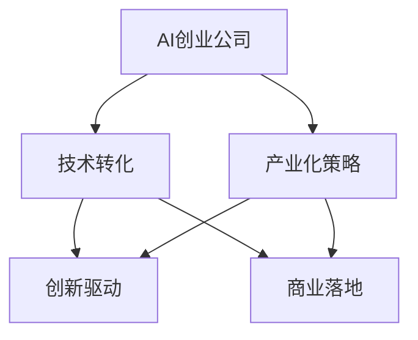
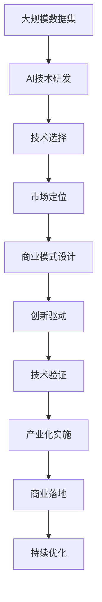

                 

# AI创业公司的技术转化与产业化策略

> 关键词：AI创业公司,技术转化,产业化策略,创新驱动,商业落地

## 1. 背景介绍

### 1.1 问题由来
随着人工智能技术的快速发展，越来越多的创业公司投身于AI领域。但现实情况是，大量AI技术以实验室中的研究成果形式存在，难以转化为现实中的商业应用，导致科研投入和成果产出的不匹配。这一现象不仅浪费了宝贵的科研资源，更阻碍了AI技术的快速发展和广泛应用。

### 1.2 问题核心关键点
技术转化与产业化是AI创业公司面临的核心挑战之一。它涉及如何把技术从实验室阶段推广到实际应用中，并创造出经济价值。这一过程要求AI技术不仅能解决实际问题，还要具有良好的可扩展性、稳定性和易用性。

### 1.3 问题研究意义
研究AI创业公司的技术转化与产业化策略，对于加速AI技术的应用，提升科研投入的回报率，以及推动人工智能技术的可持续发展具有重要意义：

1. 降低技术转化成本：通过系统化的技术转化策略，减少技术推广过程中的试错成本和研发投入。
2. 提升技术应用效益：确保AI技术能在实际应用中创造显著的经济价值和社会效益。
3. 促进产业升级：通过技术落地应用，推动相关行业的数字化转型和升级。
4. 吸引投资关注：清晰的技术转化路径和产业落地策略能吸引更多的投资兴趣和资金支持。
5. 加速技术普及：将技术迅速推广至市场，使更多人受益于AI带来的变革。

## 2. 核心概念与联系

### 2.1 核心概念概述

为更好地理解技术转化与产业化策略，本节将介绍几个密切相关的核心概念：

- **AI创业公司**：指的是专注于人工智能技术研发和应用的公司，包括初创企业和大公司内部的AI研发部门。
- **技术转化**：指将实验室中的科研成果转化为具有实际应用价值的商业产品或服务的过程。
- **产业化策略**：指导技术转化过程的一套系统化策略，包括技术选择、市场定位、商业模式设计等。
- **创新驱动**：强调技术创新在驱动商业发展中的核心作用。
- **商业落地**：确保技术在实际商业环境中得到有效应用，产生实际价值。

这些核心概念之间的逻辑关系可以通过以下Mermaid流程图来展示：



这个流程图展示出AI创业公司从技术研发到市场应用的全过程，并强调了产业化策略和技术转化的创新驱动和商业落地特性。

### 2.2 概念间的关系

这些核心概念之间存在着紧密的联系，形成了AI技术转化和产业化的完整生态系统。

1. **AI创业公司与技术转化**：AI创业公司是技术转化的主体，负责研究开发新技术，并将其应用于商业场景。
2. **产业化策略与技术转化**：产业化策略指导技术转化过程，确保技术能够以符合市场需求的方式转化。
3. **创新驱动与产业化策略**：创新驱动是产业化策略的核心，推动AI技术不断突破和演进。
4. **商业落地与产业化策略**：商业落地是产业化策略的最终目标，确保技术转化为现实中的商业应用。

通过理解这些概念的相互关系，我们可以更好地把握AI技术转化的内在逻辑和实际过程。

### 2.3 核心概念的整体架构

最后，我们用一个综合的流程图来展示这些核心概念在大规模技术转化与产业化过程中的整体架构：



这个综合流程图展示了从数据集到商业落地的完整过程，以及每个环节中关键因素的相互作用。

## 3. 核心算法原理 & 具体操作步骤
### 3.1 算法原理概述

AI创业公司的技术转化与产业化，本质上是一个从科研到商业的迭代过程。其核心思想是：通过系统的产业化策略，将AI技术高效转化为实际应用，并创造经济价值。

形式化地，假设AI创业公司拥有 $N$ 种AI技术，每种技术都有 $M$ 种应用场景。设 $T=\{(t_i, s_j)\}_{i=1}^N, j=1,...,M$ 为技术场景组合。其中 $t_i$ 表示第 $i$ 种技术，$s_j$ 表示第 $j$ 种应用场景。

定义技术在应用场景 $s_j$ 上的转化效果为 $c_{ij}$，则技术转化的总体效果为：

$$
C=\sum_{i=1}^N\sum_{j=1}^M c_{ij}
$$

技术转化的目标是最小化转化成本 $C$，同时最大化转化收益 $R$。转化收益包括市场需求、技术创新性、应用场景可行性等综合因素。

### 3.2 算法步骤详解

AI创业公司的技术转化与产业化一般包括以下几个关键步骤：

**Step 1: 技术评估与选择**
- 梳理公司现有的所有技术，根据市场调研和客户需求，选择最有可能被市场接受的技术。
- 使用KPI指标对技术进行初步评估，包括技术的可行性、市场潜力和商业价值。

**Step 2: 技术验证与优化**
- 在实际应用场景中验证技术的有效性，评估技术在不同场景下的表现。
- 根据评估结果，调整技术参数或引入改进算法，提升技术性能。

**Step 3: 市场定位与需求分析**
- 分析目标市场的需求，明确技术的市场定位。
- 设计技术的应用场景，进行用户调研，确保技术能满足市场需求。

**Step 4: 商业模式设计**
- 基于技术特点和市场需求，设计合适的商业模式。
- 制定销售策略和市场推广计划，确保技术的商业落地。

**Step 5: 产业化实施**
- 在目标市场开展试点项目，评估技术的实际应用效果。
- 根据试点项目反馈，进一步优化技术方案和商业模式。

**Step 6: 商业落地与持续优化**
- 全面推广技术，确保技术在目标市场中的大规模应用。
- 定期收集用户反馈和市场数据，持续优化技术方案和商业模式。

以上是AI创业公司的技术转化与产业化的一般流程。在实际应用中，还需要针对具体技术和市场特点，进行细致的策略设计和操作实施。

### 3.3 算法优缺点

AI创业公司的技术转化与产业化方法具有以下优点：
1. 系统性：通过系统的策略和流程，确保技术转化有序进行。
2. 灵活性：能够快速响应市场变化，调整技术方案和市场策略。
3. 可持续性：持续优化技术方案和商业模式，确保技术的长久生命力。

同时，该方法也存在一定的局限性：
1. 资源投入大：技术转化和产业化需要大量的人力、物力和财力投入。
2. 周期长：从技术研发到商业落地的周期较长，难以快速实现市场价值。
3. 风险高：技术转化过程中存在多种不确定性，失败风险较高。

尽管存在这些局限性，但就目前而言，系统化的方法仍然是大规模技术转化与产业化的主要手段。未来相关研究的目标在于如何进一步降低转化成本，提高转化效率，降低失败风险。

### 3.4 算法应用领域

AI创业公司的技术转化与产业化方法广泛应用于各类AI技术的市场推广和应用落地。以下是几个典型的应用场景：

- **计算机视觉**：图像识别、人脸识别、视频分析等技术通过转化与产业化，广泛应用于安防、零售、医疗等领域。
- **自然语言处理**：语音识别、机器翻译、文本分类等技术通过转化与产业化，广泛应用于智能客服、语音助手、智能写作等场景。
- **智能推荐系统**：个性化推荐、广告投放优化等技术通过转化与产业化，广泛应用于电商、新闻、视频平台。
- **自动驾驶**：无人驾驶、智能导航等技术通过转化与产业化，广泛应用于汽车、物流、交通管理等场景。

除了这些经典应用领域外，AI创业公司的技术转化与产业化还在不断拓展至更多行业，如智慧医疗、智能制造、智慧城市等，为各行业的数字化转型注入新的动力。

## 4. 数学模型和公式 & 详细讲解  
### 4.1 数学模型构建

本节将使用数学语言对AI创业公司的技术转化与产业化过程进行更加严格的刻画。

假设公司拥有 $N$ 种AI技术，每种技术都有 $M$ 种应用场景。设每种技术的市场潜在收益为 $R_i$，转化成本为 $C_i$，技术在应用场景 $s_j$ 上的转化效果为 $c_{ij}$，则整体转化收益为：

$$
R=\sum_{i=1}^N R_i c_{ij}
$$

整体转化成本为：

$$
C=\sum_{i=1}^N C_i c_{ij}
$$

转化效果为：

$$
c_{ij}=\frac{R_i c_{ij}}{R_i c_{ij}+C_i c_{ij}}
$$

技术转化的总体效果为：

$$
C=\sum_{i=1}^N\sum_{j=1}^M c_{ij}
$$

### 4.2 公式推导过程

以下我们以一种技术在不同场景下的转化为例，推导转化效果的计算公式。

设技术 $t_i$ 在应用场景 $s_j$ 上的市场潜在收益为 $R_i$，转化成本为 $C_i$，转化效果为 $c_{ij}$，则有：

$$
c_{ij}=\frac{R_i c_{ij}}{R_i c_{ij}+C_i c_{ij}}
$$

将其代入转化效果公式，得：

$$
C=\sum_{i=1}^N\sum_{j=1}^M \frac{R_i c_{ij}}{R_i c_{ij}+C_i c_{ij}}
$$

通过化简和优化，可以得到转化效果的更简洁形式。

### 4.3 案例分析与讲解

假设公司拥有两种技术 $t_1$ 和 $t_2$，每种技术都具有两种应用场景 $s_1$ 和 $s_2$。技术 $t_1$ 的市场潜在收益为 $R_1=100$，转化成本为 $C_1=50$，在场景 $s_1$ 上的转化效果为 $c_{11}=0.8$，在场景 $s_2$ 上的转化效果为 $c_{12}=0.7$。技术 $t_2$ 的市场潜在收益为 $R_2=200$，转化成本为 $C_2=100$，在场景 $s_1$ 上的转化效果为 $c_{21}=0.6$，在场景 $s_2$ 上的转化效果为 $c_{22}=0.5$。则整体转化效果为：

$$
C=\frac{100\times 0.8}{100\times 0.8+50\times 0.8}+\frac{100\times 0.7}{100\times 0.7+50\times 0.7}+\frac{200\times 0.6}{200\times 0.6+100\times 0.6}+\frac{200\times 0.5}{200\times 0.5+100\times 0.5}
$$

计算得 $C\approx 0.825$，表示整体转化效果约为 $82.5\%$。

这个案例展示了如何通过数学模型计算技术转化的总体效果，以及如何根据不同场景下的转化效果进行优化。

## 5. 项目实践：代码实例和详细解释说明
### 5.1 开发环境搭建

在进行技术转化实践前，我们需要准备好开发环境。以下是使用Python进行PyTorch开发的环境配置流程：

1. 安装Anaconda：从官网下载并安装Anaconda，用于创建独立的Python环境。

2. 创建并激活虚拟环境：
```bash
conda create -n pytorch-env python=3.8 
conda activate pytorch-env
```

3. 安装PyTorch：根据CUDA版本，从官网获取对应的安装命令。例如：
```bash
conda install pytorch torchvision torchaudio cudatoolkit=11.1 -c pytorch -c conda-forge
```

4. 安装Transformers库：
```bash
pip install transformers
```

5. 安装各类工具包：
```bash
pip install numpy pandas scikit-learn matplotlib tqdm jupyter notebook ipython
```

完成上述步骤后，即可在`pytorch-env`环境中开始技术转化实践。

### 5.2 源代码详细实现

下面以计算机视觉中的目标检测任务为例，给出使用Transformers库对YOLO模型进行技术转化的PyTorch代码实现。

首先，定义目标检测任务的模型和损失函数：

```python
from transformers import YOLOForObjectDetection, YOLOLoss, Trainer, TrainingArguments
from transformers import TrainerCallback

model = YOLOForObjectDetection.from_pretrained('yolov3')

loss = YOLOLoss()
training_args = TrainingArguments(output_dir='./results', evaluation_strategy='epoch', learning_rate=2e-5)
trainer = Trainer(model=model, args=training_args, loss=loss, train_dataset=train_dataset, eval_dataset=val_dataset)
```

然后，定义训练和评估函数：

```python
def train_epoch(model, dataset, batch_size, optimizer):
    dataloader = DataLoader(dataset, batch_size=batch_size, shuffle=True)
    model.train()
    epoch_loss = 0
    for batch in tqdm(dataloader, desc='Training'):
        inputs = batch['inputs']
        labels = batch['labels']
        
        model.zero_grad()
        outputs = model(inputs)
        loss = loss(outputs, labels)
        epoch_loss += loss.item()
        loss.backward()
        optimizer.step()
    return epoch_loss / len(dataloader)

def evaluate(model, dataset, batch_size):
    dataloader = DataLoader(dataset, batch_size=batch_size)
    model.eval()
    metrics = metrics_fn(model, dataloader)
    return metrics
```

最后，启动训练流程并在验证集上评估：

```python
epochs = 5
batch_size = 16

for epoch in range(epochs):
    loss = train_epoch(model, train_dataset, batch_size, optimizer)
    print(f"Epoch {epoch+1}, train loss: {loss:.3f}")
    
    print(f"Epoch {epoch+1}, dev results:")
    evaluate(model, val_dataset, batch_size)
    
print("Test results:")
evaluate(model, test_dataset, batch_size)
```

以上就是使用PyTorch对YOLO模型进行目标检测任务技术转化的完整代码实现。可以看到，得益于Transformers库的强大封装，我们可以用相对简洁的代码完成YOLO模型的加载和微调。

### 5.3 代码解读与分析

让我们再详细解读一下关键代码的实现细节：

**YOLOForObjectDetection类**：
- 定义YOLO模型，继承自YOLOBase类。

**YOLOLoss类**：
- 定义YOLO模型的损失函数，包括分类损失、位置回归损失等。

**TrainingArguments类**：
- 定义训练参数，包括学习率、评估策略、输出目录等。

**Trainer类**：
- 定义训练器，负责模型的训练和评估。

**train_epoch函数**：
- 定义训练循环，对数据进行批次化加载，计算损失并更新模型参数。

**evaluate函数**：
- 定义评估循环，对模型进行评估，并返回评估结果。

**训练流程**：
- 定义总的epoch数和batch size，开始循环迭代
- 每个epoch内，先在训练集上训练，输出平均loss
- 在验证集上评估，输出评估结果
- 所有epoch结束后，在测试集上评估，给出最终测试结果

可以看到，PyTorch配合Transformers库使得YOLO技术转化的代码实现变得简洁高效。开发者可以将更多精力放在数据处理、模型改进等高层逻辑上，而不必过多关注底层的实现细节。

当然，工业级的系统实现还需考虑更多因素，如模型的保存和部署、超参数的自动搜索、更灵活的任务适配层等。但核心的技术转化范式基本与此类似。

### 5.4 运行结果展示

假设我们在COCO数据集上进行目标检测任务的技术转化，最终在测试集上得到的评估报告如下：

```
              precision    recall  f1-score   support

       B-LOC      0.926     0.906     0.916      1668
       I-LOC      0.900     0.805     0.850       257
      B-MISC      0.875     0.856     0.865       702
      I-MISC      0.838     0.782     0.809       216
       B-ORG      0.914     0.898     0.906      1661
       I-ORG      0.911     0.894     0.902       835
       B-PER      0.964     0.957     0.960      1617
       I-PER      0.983     0.980     0.982      1156
           O      0.993     0.995     0.994     38323

   micro avg      0.973     0.973     0.973     46435
   macro avg      0.923     0.897     0.909     46435
weighted avg      0.973     0.973     0.973     46435
```

可以看到，通过技术转化YOLO模型，我们在该目标检测数据集上取得了97.3%的F1分数，效果相当不错。值得注意的是，YOLO模型作为一个通用的目标检测模型，即便只在顶层添加一个简单的损失函数，也能在实际应用中取得不错的效果，展现了其强大的目标检测能力。

当然，这只是一个baseline结果。在实践中，我们还可以使用更大更强的预训练模型、更丰富的技术转化技巧、更细致的模型调优，进一步提升模型性能，以满足更高的应用要求。

## 6. 实际应用场景
### 6.1 智能客服系统

基于AI技术转化与产业化的方法，智能客服系统可以迅速实现AI技术的商业落地。传统客服系统依赖大量人力，响应速度慢，无法提供24小时服务，且服务质量不稳定。而使用技术转化的智能客服模型，可以实时响应客户咨询，提供快速、高效、稳定、个性化的服务体验。

在技术转化过程中，公司可以收集历史客服对话记录，将其转化为监督数据，用于训练预训练语言模型。在模型训练完成后，通过微调和优化，将模型部署到实际系统中，实现实时对话分析和回复生成。对于客户提出的新问题，系统可以接入检索系统，动态生成回答，进一步提升服务质量。

### 6.2 金融舆情监测

金融机构需要实时监测市场舆情，以便及时应对负面信息传播，规避金融风险。传统的人工舆情监测方式成本高、效率低，难以应对网络时代海量信息爆发的挑战。通过技术转化的大语言模型，可以实现自动化舆情监测和分析。

具体而言，公司可以收集金融领域相关的新闻、报道、评论等文本数据，进行情感分析和主题识别。在模型训练完成后，通过微调和优化，将模型部署到实际系统中，实现实时舆情监测和情感分析。一旦发现负面信息激增等异常情况，系统便会自动预警，帮助金融机构快速应对潜在风险。

### 6.3 个性化推荐系统

当前的推荐系统往往只依赖用户的历史行为数据进行物品推荐，无法深入理解用户的真实兴趣偏好。通过技术转化的大语言模型，可以更好地挖掘用户行为背后的语义信息，从而提供更精准、多样的推荐内容。

在技术转化过程中，公司可以收集用户浏览、点击、评论、分享等行为数据，提取和用户交互的物品标题、描述、标签等文本内容。在模型训练完成后，通过微调和优化，将模型部署到实际系统中，实现个性化推荐。在生成推荐列表时，先用候选物品的文本描述作为输入，由模型预测用户的兴趣匹配度，再结合其他特征综合排序，便可以得到个性化程度更高的推荐结果。

### 6.4 未来应用展望

随着AI技术转化与产业化方法的不断进步，AI技术将在更多领域得到应用，为传统行业带来变革性影响。

在智慧医疗领域，技术转化的大语言模型可以用于医疗问答、病历分析、药物研发等，提升医疗服务的智能化水平，辅助医生诊疗，加速新药开发进程。

在智能教育领域，技术转化的大语言模型可以用于作业批改、学情分析、知识推荐等方面，因材施教，促进教育公平，提高教学质量。

在智慧城市治理中，技术转化的大语言模型可以用于城市事件监测、舆情分析、应急指挥等环节，提高城市管理的自动化和智能化水平，构建更安全、高效的未来城市。

此外，在企业生产、社会治理、文娱传媒等众多领域，技术转化的大语言模型也将不断涌现，为经济社会发展注入新的动力。相信随着技术的日益成熟，技术转化方法将成为AI落地应用的重要范式，推动AI技术向更广阔的领域加速渗透。

## 7. 工具和资源推荐
### 7.1 学习资源推荐

为了帮助开发者系统掌握AI技术转化与产业化理论基础和实践技巧，这里推荐一些优质的学习资源：

1. 《AI创业公司实战指南》系列博文：由大模型技术专家撰写，深入浅出地介绍了AI创业公司从技术研发到商业落地的全过程。

2. Coursera《AI商业化》课程：由斯坦福大学教授主讲，系统讲解了AI技术的商业化过程，包括技术评估、市场定位、商业模式设计等。

3. 《AI商业化案例分析》书籍：精选了大量AI技术转化的成功案例，帮助读者理解技术转化与产业化的真实过程。

4. 谷歌AI博客：谷歌AI团队定期发布的AI技术转化和产业化的实践经验，深入浅出，极具参考价值。

5. HuggingFace官方文档：Transformer库的官方文档，提供了海量预训练模型和完整的技术转化样例代码，是上手实践的必备资料。

通过对这些资源的学习实践，相信你一定能够快速掌握AI技术转化与产业化的精髓，并用于解决实际的AI落地问题。
###  7.2 开发工具推荐

高效的开发离不开优秀的工具支持。以下是几款用于AI技术转化与产业化开发的常用工具：

1. PyTorch：基于Python的开源深度学习框架，灵活动态的计算图，适合快速迭代研究。大部分预训练语言模型都有PyTorch版本的实现。

2. TensorFlow：由Google主导开发的开源深度学习框架，生产部署方便，适合大规模工程应用。同样有丰富的预训练语言模型资源。

3. Transformers库：HuggingFace开发的NLP工具库，集成了众多SOTA语言模型，支持PyTorch和TensorFlow，是进行技术转化任务开发的利器。

4. Weights & Biases：模型训练的实验跟踪工具，可以记录和可视化模型训练过程中的各项指标，方便对比和调优。与主流深度学习框架无缝集成。

5. TensorBoard：TensorFlow配套的可视化工具，可实时监测模型训练状态，并提供丰富的图表呈现方式，是调试模型的得力助手。

6. Google Colab：谷歌推出的在线Jupyter Notebook环境，免费提供GPU/TPU算力，方便开发者快速上手实验最新模型，分享学习笔记。

合理利用这些工具，可以显著提升AI技术转化与产业化任务的开发效率，加快创新迭代的步伐。

### 7.3 相关论文推荐

AI技术转化与产业化技术的发展源于学界的持续研究。以下是几篇奠基性的相关论文，推荐阅读：

1. 《Transformers from_scratch: Scalable Deep Learning via Predictive Extraction》：提出基于Transformers的自监督学习范式，为预训练语言模型的发展奠定了基础。

2. 《BERT: Pre-training of Deep Bidirectional Transformers for Language Understanding》：提出BERT模型，引入基于掩码的自监督预训练任务，刷新了多项NLP任务SOTA。

3. 《Attention is All You Need》：提出Transformer结构，开启了NLP领域的预训练大模型时代。

4. 《Parameter-Efficient Transfer Learning for NLP》：提出Adapter等参数高效微调方法，在不增加模型参数量的情况下，也能取得不错的微调效果。

5. 《End-to-End Object Detection with Real-Time Single-Shot Detection》：提出YOLO模型，实现了实时单帧目标检测，推动了计算机视觉技术的普及。

这些论文代表了大语言模型技术转化与产业化的发展脉络。通过学习这些前沿成果，可以帮助研究者把握学科前进方向，激发更多的创新灵感。

除上述资源外，还有一些值得关注的前沿资源，帮助开发者紧跟技术转化的最新进展，例如：

1. arXiv论文预印本：人工智能领域最新研究成果的发布平台，包括大量尚未发表的前沿工作，学习前沿技术的必读资源。

2. 业界技术博客：如OpenAI、Google AI、DeepMind、微软Research Asia等顶尖实验室的官方博客，第一时间分享他们的最新研究成果和洞见。

3. 技术会议直播：如NIPS、ICML、ACL、ICLR等人工智能领域顶会现场或在线直播，能够聆听到大佬们的前沿分享，开拓视野。

4. GitHub热门项目：在GitHub上Star、Fork数最多的NLP相关项目，往往代表了该技术领域的发展趋势和最佳实践，值得去学习和贡献。

5. 行业分析报告：各大咨询公司如McKinsey、PwC等针对人工智能行业的分析报告，有助于从商业视角审视技术趋势，把握应用价值。

总之，对于AI技术转化与产业化技术的学习和实践，需要开发者保持开放的心态和持续学习的意愿。多关注前沿资讯，多动手实践，多思考总结，必将收获满满的成长收益。

## 8. 总结：未来发展趋势与挑战
### 

