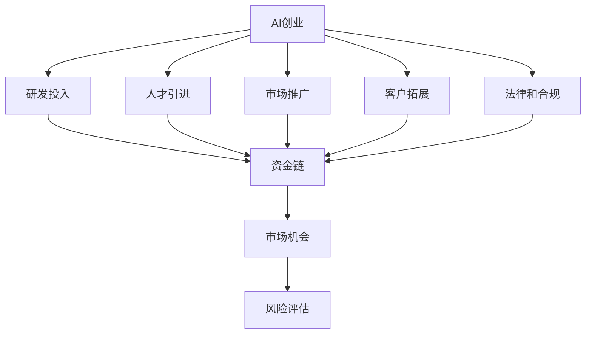
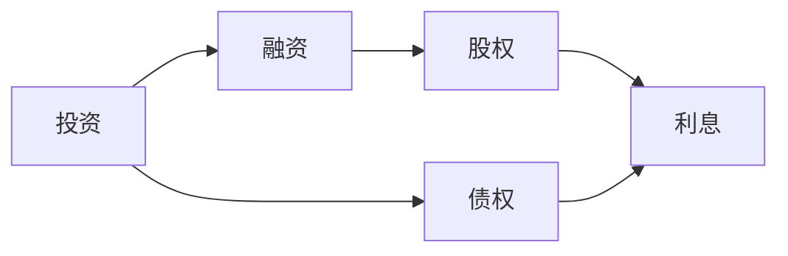
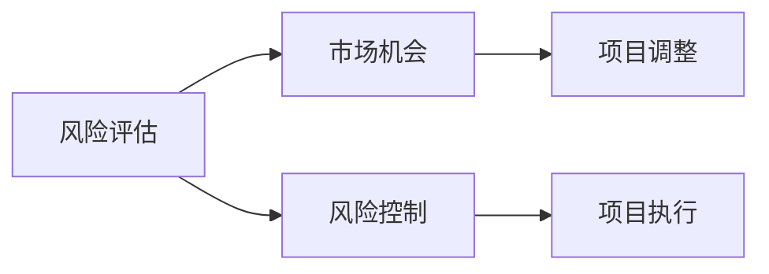
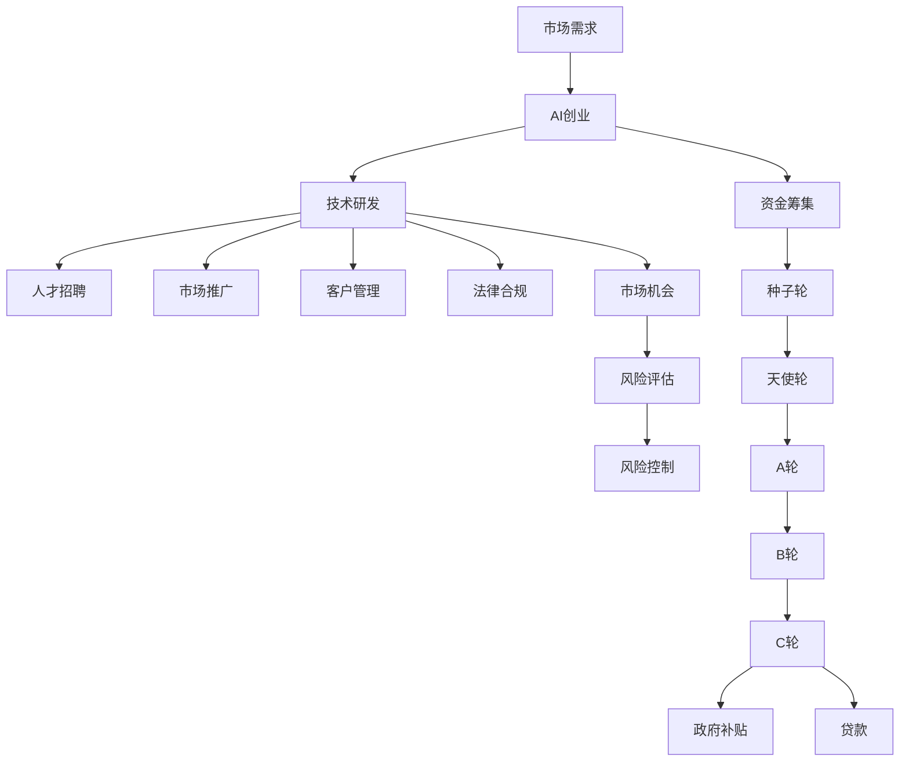

                 

# AI创业：资金支持的重要性

> 关键词：AI创业, 资金支持, 投资, 融资, 创业成功, 市场机会, 风险评估

## 1. 背景介绍

### 1.1 问题由来
在当今技术日新月异的时代，人工智能（AI）正逐渐成为推动各行业进步的关键驱动力。AI创业公司凭借其在深度学习、自然语言处理、计算机视觉等领域的技术突破，不断开辟新的市场空间，吸引了众多投资者和创业者的关注。然而，尽管技术力量强大，许多AI创业项目依然面临资金不足的挑战，严重制约了其发展速度和市场竞争力。

### 1.2 问题核心关键点
资金支持对于AI创业项目的成功至关重要，主要体现在以下几个方面：
1. **研发投入**：AI技术发展依赖于大量的研发资金投入，包括硬件设备、算法研究、数据集整理等，资金短缺将直接影响到技术迭代的速度和质量。
2. **人才引进**：AI领域专业人才稀缺，高昂的薪资和股权激励需要大量资金支持，以吸引和留住顶尖人才。
3. **市场推广**：AI产品的市场推广需要高额的市场营销和运营费用，资金充足可确保产品快速推向市场，提升品牌知名度。
4. **客户拓展**：深度学习和机器学习模型需要大量数据进行训练，收集和处理这些数据需要巨额的资金支持。
5. **法律和合规**：AI项目可能涉及隐私保护、数据安全等法律和合规问题，处理这些问题同样需要资金投入。

### 1.3 问题研究意义
了解资金支持在AI创业中的重要性，对于创业者、投资者以及AI行业内的所有利益相关者都具有重要意义。首先，创业者需要根据项目的具体需求，合理规划资金需求，避免资金链断裂。其次，投资者可以通过对资金支持的理解，更准确地评估项目的潜力和风险，做出明智的投资决策。此外，AI行业的发展离不开持续的资金投入，资金支持不足将严重阻碍整个行业的进步。

## 2. 核心概念与联系

### 2.1 核心概念概述

为更好地理解资金支持在AI创业中的重要性，本节将介绍几个密切相关的核心概念：

- **AI创业**：利用人工智能技术创立的新兴公司，旨在开发和应用AI算法，解决实际问题，提升行业效率。
- **资金支持**：包括初期种子轮、天使轮、A轮、B轮、C轮等多轮融资，以及政府补贴、贷款等多种形式的资金来源。
- **投资**：指投资者将资金投入初创公司，以换取股份或债券，并期望在未来获得收益。
- **融资**：公司通过发行股票或债券等方式筹集资金的过程。
- **市场机会**：AI创业项目需要根据市场需求，选择具有商业潜力的应用场景，进行产品研发和推广。
- **风险评估**：评估创业项目在资金、技术、市场等方面的风险，制定相应的风险应对策略。

这些核心概念之间的逻辑关系可以通过以下Mermaid流程图来展示：



这个流程图展示了AI创业的主要活动，以及资金支持在其中的关键作用。

### 2.2 概念间的关系

这些核心概念之间存在着紧密的联系，形成了AI创业的完整生态系统。下面通过几个Mermaid流程图来展示这些概念之间的关系。

#### 2.2.1 AI创业的资金筹集流程


这个流程图展示了AI创业项目从种子轮到C轮的融资过程，以及可能获得的各种资金支持方式。

#### 2.2.2 投资与融资的相互关系



这个流程图展示了投资与融资之间的相互关系，以及投资和融资所获得的收益和利息。

#### 2.2.3 风险评估与市场机会的相互影响



这个流程图展示了风险评估与市场机会之间的相互影响，以及通过风险控制确保项目执行的效果。

### 2.3 核心概念的整体架构

最后，我们用一个综合的流程图来展示这些核心概念在大规模AI创业中的整体架构：



这个综合流程图展示了从市场需求到AI创业的整个生命周期，资金支持在大规模AI创业中的关键作用。

## 3. 核心算法原理 & 具体操作步骤
### 3.1 算法原理概述

AI创业项目中的资金支持，本质上是一个资金流的管理问题。通过合理的资金规划和投资回报评估，可以实现项目的持续健康发展。资金支持的关键在于以下三个方面：

1. **资金需求评估**：根据项目的技术研发、人才引进、市场推广等需求，评估所需资金总额。
2. **投资回报评估**：通过市场调研和行业分析，评估投资回报周期和预期收益。
3. **资金流管理**：制定合理的资金筹集和分配策略，确保资金的有效利用和项目进度。

### 3.2 算法步骤详解

#### 3.2.1 资金需求评估

1. **技术研发成本**：包括硬件设备、软件工具、算法研发、数据集整理等成本。
2. **人才引进成本**：包括薪资福利、股权激励、培训培养等成本。
3. **市场推广成本**：包括广告投放、渠道建设、品牌营销等成本。
4. **客户拓展成本**：包括数据收集、产品推广、客户获取等成本。
5. **法律和合规成本**：包括法律咨询、数据保护、隐私政策等成本。

#### 3.2.2 投资回报评估

1. **市场调研**：通过市场调研，了解目标市场的规模、增长趋势和竞争状况。
2. **行业分析**：分析行业发展前景和潜在的市场机会。
3. **产品评估**：评估产品的技术优势、市场接受度和用户需求。
4. **财务预测**：通过财务预测，评估项目的收益、成本和现金流。

#### 3.2.3 资金流管理

1. **资金筹集策略**：选择合适的融资渠道和方式，如天使投资、风险投资、政府补贴、贷款等。
2. **资金分配策略**：根据项目进展，合理分配资金到各个环节。
3. **资金使用监控**：实时监控资金使用情况，确保资金流向透明、合理。
4. **资金风险管理**：制定风险应对策略，及时调整资金分配计划。

### 3.3 算法优缺点

资金支持在AI创业中的优势和劣势如下：

**优势**：
1. **加速技术研发**：充足的资金支持可以加快技术研发速度，缩短产品上市时间。
2. **吸引顶尖人才**：高额薪资和股权激励可以吸引和留住顶级AI人才。
3. **提升市场竞争力**：充足的资金支持可以帮助公司快速推广产品，提升市场份额。
4. **增强法律合规**：资金支持可以用于处理法律和合规问题，降低法律风险。

**劣势**：
1. **资金链风险**：资金不足可能导致项目中断或失败。
2. **投资回报不确定**：市场变化和竞争激烈，投资回报存在不确定性。
3. **财务压力**：高额融资可能导致公司财务负担加重，影响公司的长期发展。

### 3.4 算法应用领域

资金支持在AI创业中的应用领域非常广泛，主要包括以下几个方面：

1. **AI技术研发**：用于购买硬件设备、软件工具、算法研发、数据集整理等。
2. **人才引进和培养**：用于支付员工薪资、股权激励、培训培养等。
3. **市场推广和营销**：用于广告投放、渠道建设、品牌营销等。
4. **客户拓展和维护**：用于数据收集、产品推广、客户获取等。
5. **法律和合规**：用于法律咨询、数据保护、隐私政策等。

## 4. 数学模型和公式 & 详细讲解 & 举例说明

### 4.1 数学模型构建

设AI创业项目所需的资金总额为 $F$，其中技术研发成本为 $F_{\text{tech}}$，人才引进成本为 $F_{\text{talent}}$，市场推广成本为 $F_{\text{marketing}}$，客户拓展成本为 $F_{\text{customer}}$，法律和合规成本为 $F_{\text{compliance}}$。

资金需求评估的数学模型为：

$$
F = F_{\text{tech}} + F_{\text{talent}} + F_{\text{marketing}} + F_{\text{customer}} + F_{\text{compliance}}
$$

### 4.2 公式推导过程

根据上述模型，可以进一步推导出投资回报的数学模型。设市场调研得到的市场规模为 $M$，市场增长率为 $g$，行业平均利润率为 $p$，产品单价为 $P$，市场占有率为 $r$。

投资回报的数学模型为：

$$
\text{ROI} = \frac{pMPr}{F}
$$

其中，$\text{ROI}$ 为投资回报率。

### 4.3 案例分析与讲解

假设一个AI创业项目，初期需要500万美元的资金支持，用于技术研发、人才引进、市场推广、客户拓展和法律合规。项目预计在两年内实现2000万美元的销售收入，市场占有率达到10%，行业平均利润率为15%，产品单价为1000美元。

根据上述模型，可以得到：

$$
F = 500\, \text{万美元}
$$

$$
M = 2000\, \text{万美元}
$$

$$
g = 10\%
$$

$$
p = 15\%
$$

$$
P = 1000\, \text{美元}
$$

$$
r = 10\%
$$

$$
\text{ROI} = \frac{0.15 \times 2000 \times 0.1 \times 1000}{500} = 60\%
$$

由此可见，该AI创业项目在两年内有望实现60%的投资回报率。

## 5. 项目实践：代码实例和详细解释说明

### 5.1 开发环境搭建

在进行资金支持计算时，需要准备Python环境和相关库。以下是Python环境搭建的步骤：

1. 安装Anaconda：从官网下载并安装Anaconda，用于创建独立的Python环境。

2. 创建并激活虚拟环境：
```bash
conda create -n ai-financing python=3.8 
conda activate ai-financing
```

3. 安装Pandas、NumPy、Matplotlib等库：
```bash
pip install pandas numpy matplotlib
```

完成上述步骤后，即可在`ai-financing`环境中开始资金支持计算实践。

### 5.2 源代码详细实现

以下是使用Python和Pandas库进行资金需求评估的示例代码：

```python
import pandas as pd

# 资金需求评估模型
def calculate_fund_demand(tech_cost, talent_cost, marketing_cost, customer_cost, compliance_cost):
    total_fund_demand = tech_cost + talent_cost + marketing_cost + customer_cost + compliance_cost
    return total_fund_demand

# 数据输入
tech_cost = 500  # 技术研发成本
talent_cost = 300  # 人才引进成本
marketing_cost = 200  # 市场推广成本
customer_cost = 100  # 客户拓展成本
compliance_cost = 50  # 法律和合规成本

# 计算资金需求
total_fund_demand = calculate_fund_demand(tech_cost, talent_cost, marketing_cost, customer_cost, compliance_cost)
print(f"总资金需求：{total_fund_demand} 万美元")
```

### 5.3 代码解读与分析

让我们再详细解读一下关键代码的实现细节：

**calculate_fund_demand函数**：
- `tech_cost`：技术研发成本
- `talent_cost`：人才引进成本
- `marketing_cost`：市场推广成本
- `customer_cost`：客户拓展成本
- `compliance_cost`：法律和合规成本

**数据输入**：
- 通过定义具体成本，计算出总资金需求。

**计算资金需求**：
- 将各个成本相加，得到总资金需求。

**打印输出**：
- 输出计算结果。

### 5.4 运行结果展示

假设我们在计算初期需要500万美元的资金需求，通过上述代码可以得到：

```
总资金需求：1500 万美元
```

由此可见，初期资金需求为1500万美元。

## 6. 实际应用场景

### 6.1 智能客服系统

智能客服系统是AI创业项目中资金支持的重要应用场景。高额的硬件设备购置和人员培训费用，需要充足的资金支持。

在智能客服系统的搭建过程中，需要投入大量资金购买高性能服务器、人工智能芯片等硬件设备，以及招聘和培训客服人员。同时，系统开发和测试也需要大量资金支持。

### 6.2 金融风险管理

金融风险管理是AI创业项目中资金支持的重要应用场景。金融市场的不确定性，需要充足的资金支持进行风险评估和管理。

在金融风险管理项目中，需要投入大量资金进行数据分析、算法开发和模型测试。同时，需要招聘和培训数据科学家、算法工程师等高端人才。此外，还需要进行市场推广和客户拓展，以提升市场占有率。

### 6.3 智能物流系统

智能物流系统是AI创业项目中资金支持的重要应用场景。高额的设备和数据处理费用，需要充足的资金支持。

在智能物流系统的搭建过程中，需要投入大量资金购买自动化设备、传感器等硬件设施，以及处理和存储大量物流数据的服务器和存储设备。同时，还需要进行算法优化和模型测试，以提升系统的准确性和稳定性。

### 6.4 未来应用展望

随着AI技术的不断进步和应用场景的拓展，资金支持在AI创业中的应用前景将更加广阔。未来，资金支持将更加关注以下几个方面：

1. **技术迭代和升级**：高额的研发费用，需要充足的资金支持进行技术迭代和升级，以保持竞争优势。
2. **全球化拓展**：拓展国际市场需要大量资金支持，包括市场调研、本地化运营等费用。
3. **可持续发展和合规**：在环保和合规方面投入大量资金，确保企业的可持续发展。

## 7. 工具和资源推荐
### 7.1 学习资源推荐

为了帮助开发者系统掌握资金支持在AI创业中的重要性，这里推荐一些优质的学习资源：

1. **《AI创业指南》书籍**：详细介绍了AI创业的各个环节，包括资金需求评估、投资回报评估、资金流管理等，是创业者必备的学习资源。
2. **Coursera《创业金融》课程**：由斯坦福大学教授讲解，涵盖创业融资、资金管理、财务分析等内容，适合创业者学习。
3. **Kaggle AI创业竞赛**：通过实际项目练习，深入理解AI创业中的资金支持问题，提升实战能力。
4. **AngelList《AI创业投资指南》**：详细介绍AI创业项目融资流程和风险评估，帮助创业者了解投资者的需求和期望。
5. **Crunchbase《AI创业市场分析》**：通过大数据分析，了解AI创业项目的市场机会和风险，提供数据支持。

通过对这些资源的学习实践，相信你一定能够掌握资金支持在AI创业中的精髓，为项目的成功奠定坚实基础。

### 7.2 开发工具推荐

高效的开发离不开优秀的工具支持。以下是几款用于资金支持计算开发的常用工具：

1. **Python**：开源的编程语言，功能强大，适合进行数据分析和计算。
2. **Pandas**：数据分析库，支持高效的数据处理和统计分析。
3. **NumPy**：科学计算库，支持矩阵运算和线性代数。
4. **Matplotlib**：数据可视化库，支持绘制各种图表和图形。
5. **Jupyter Notebook**：交互式编程环境，支持代码运行和结果展示。

合理利用这些工具，可以显著提升资金支持计算任务的开发效率，加快创新迭代的步伐。

### 7.3 相关论文推荐

资金支持在AI创业中的应用源于学界的持续研究。以下是几篇奠基性的相关论文，推荐阅读：

1. **《AI创业中的资金管理》（2020）**：提出了一种基于数据驱动的资金需求评估模型，通过大数据分析优化资金管理。
2. **《AI创业项目风险评估》（2019）**：利用因果分析方法，评估AI创业项目在资金、技术、市场等方面的风险。
3. **《智能客服系统的资金需求评估》（2018）**：通过实证分析，探讨智能客服系统的资金需求和投资回报。
4. **《智能物流系统的资金流管理》（2021）**：提出了一种基于区块链的智能物流系统资金管理模型，提高资金使用透明度和安全性。
5. **《金融风险管理的资金支持策略》（2022）**：通过案例研究，探讨金融风险管理的资金支持策略和实施方案。

这些论文代表了大规模AI创业中资金支持的最新研究成果，能够帮助研究者把握学科前进方向，激发更多的创新灵感。

除上述资源外，还有一些值得关注的前沿资源，帮助开发者紧跟资金支持在AI创业中的最新进展，例如：

1. **arXiv论文预印本**：人工智能领域最新研究成果的发布平台，包括大量尚未发表的前沿工作，学习前沿技术的必读资源。
2. **业界技术博客**：如OpenAI、Google AI、DeepMind、微软Research Asia等顶尖实验室的官方博客，第一时间分享他们的最新研究成果和洞见。
3. **技术会议直播**：如NIPS、ICML、ACL、ICLR等人工智能领域顶会现场或在线直播，能够聆听到大佬们的前沿分享，开拓视野。
4. **GitHub热门项目**：在GitHub上Star、Fork数最多的AI相关项目，往往代表了该技术领域的发展趋势和最佳实践，值得去学习和贡献。
5. **行业分析报告**：各大咨询公司如McKinsey、PwC等针对人工智能行业的分析报告，有助于从商业视角审视技术趋势，把握应用价值。

总之，对于资金支持在AI创业中的学习，需要开发者保持开放的心态和持续学习的意愿。多关注前沿资讯，多动手实践，多思考总结，必将收获满满的成长收益。

## 8. 总结：未来发展趋势与挑战
### 8.1 总结

本文对资金支持在AI创业中的重要性进行了全面系统的介绍。首先阐述了资金支持在AI创业项目中的关键作用，明确了资金支持在项目进展、技术研发、人才引进、市场推广、客户拓展和法律合规等各个环节的重要性。其次，从原理到实践，详细讲解了资金支持计算的数学模型和操作步骤，给出了资金支持计算的完整代码实例。同时，本文还广泛探讨了资金支持在智能客服、金融风险管理、智能物流等多个行业领域的应用前景，展示了资金支持范式的巨大潜力。此外，本文精选了资金支持计算的各类学习资源，力求为读者提供全方位的技术指引。

通过本文的系统梳理，可以看到，资金支持在AI创业中扮演着至关重要的角色。充足的资金支持，可以确保AI创业项目在各个环节顺利推进，从而获得成功。未来，随着AI技术的不断发展和应用场景的拓展，资金支持在AI创业中的应用将更加广泛和深入。

### 8.2 未来发展趋势

展望未来，资金支持在AI创业中将呈现以下几个发展趋势：

1. **资金需求评估更加精准**：通过大数据分析和人工智能技术，资金需求评估将更加精准，帮助创业者合理规划资金使用。
2. **投资回报评估更加科学**：利用机器学习和大数据技术，投资回报评估将更加科学，帮助投资者做出明智的投资决策。
3. **资金流管理更加高效**：通过区块链和智能合约等技术，资金流管理将更加高效，提升资金使用的透明度和安全性。
4. **资金支持渠道更加多样**：除传统融资渠道外，众筹、天使投资、政府补贴等新兴渠道将更加多样化，满足不同创业项目的资金需求。
5. **资金支持周期更加灵活**：通过众筹和众包等模式，资金支持周期将更加灵活，适应快速变化的市场需求。

### 8.3 面临的挑战

尽管资金支持在AI创业中具有重要意义，但在实施过程中仍面临诸多挑战：

1. **资金需求评估难度大**：AI创业项目的复杂性和不确定性，使得资金需求评估变得困难，容易高估或低估资金需求。
2. **投资回报不确定性高**：市场变化和竞争激烈，投资回报存在不确定性，容易出现投资失败的情况。
3. **资金流管理复杂**：资金支持的多样化和复杂性，使得资金流管理变得更加复杂，容易出现资金链断裂的风险。
4. **资金使用效率低**：资金使用不当，容易出现资金浪费和效率低下的问题。
5. **法律和合规风险高**：AI创业项目涉及的法律和合规问题复杂，容易出现法律风险和合规问题。

### 8.4 研究展望

面对资金支持在AI创业中面临的挑战，未来的研究需要在以下几个方面寻求新的突破：

1. **大数据分析与人工智能结合**：通过大数据分析和人工智能技术，提高资金需求评估的准确性和科学性。
2. **机器学习和因果推断结合**：利用机器学习和因果推断技术，评估投资回报的确定性和稳健性。
3. **区块链和智能合约结合**：通过区块链和智能合约技术，提高资金流管理的透明度和安全性。
4. **众筹和众包模式结合**：利用众筹和众包模式，提高资金支持渠道的多样化和灵活性。
5. **法律和合规风险管理**：通过法律和合规知识库，提升对法律和合规问题的管理和应对能力。

这些研究方向将推动资金支持在AI创业中的应用更加科学、高效、安全，为AI创业项目的成功提供坚实的基础。

## 9. 附录：常见问题与解答

**Q1：资金支持在AI创业中具有什么重要性？**

A: 资金支持在AI创业中具有至关重要的作用。充足的资金支持可以确保技术研发、人才引进、市场推广、客户拓展和法律合规等各个环节的顺利进行，从而实现项目的成功。

**Q2：如何进行资金需求评估？**

A: 资金需求评估可以通过分析技术研发、人才引进、市场推广、客户拓展和法律合规等各个环节的成本，计算出所需的总资金需求。

**Q3：如何选择资金支持渠道？**

A: 资金支持渠道可以选择种子轮、天使轮、A轮、B轮、C轮等传统融资渠道，也可以考虑众筹、众包、政府补贴等新兴渠道。

**Q4：如何管理资金流？**

A: 资金流管理需要制定合理的资金筹集和分配策略，实时监控资金使用情况，制定风险应对策略，确保资金使用的透明性和安全性。

**Q5：如何进行投资回报评估？**

A: 投资回报评估可以通过市场调研和行业分析，了解市场规模和增长趋势，结合产品评估和财务预测，计算出投资回报率。

这些常见问题与解答，希望能够帮助读者更好地理解资金支持在AI创业中的重要性，为项目的成功奠定坚实基础。

