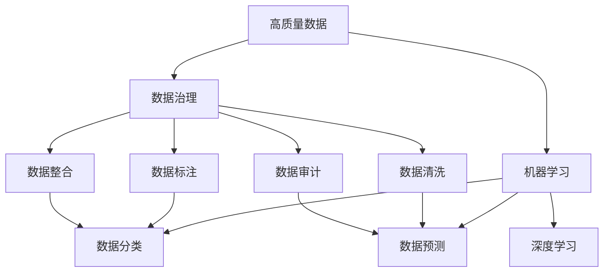
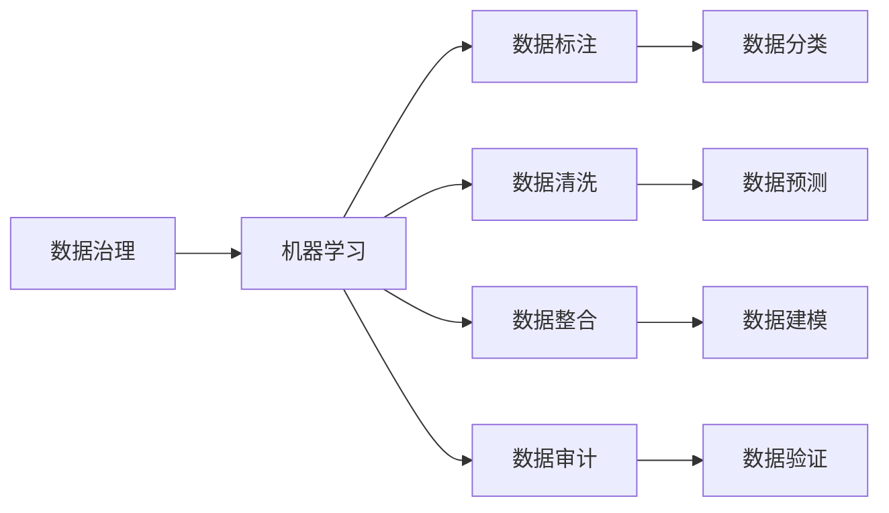
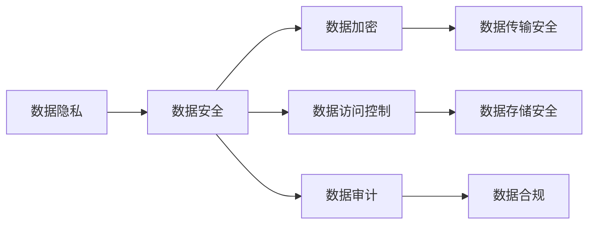
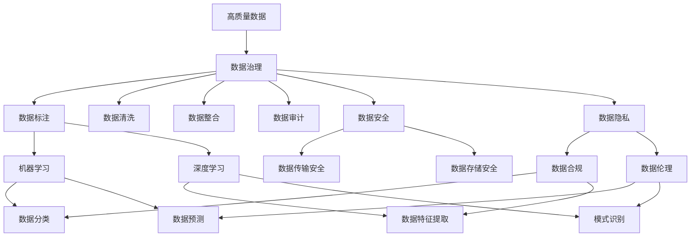

                 

# AI创业：高质量数据的重要性

> 关键词：人工智能,创业,高质量数据,大数据,数据治理,机器学习,深度学习,数据隐私,数据安全

## 1. 背景介绍

### 1.1 问题由来
近年来，人工智能(AI)技术迅猛发展，尤其在创业领域，AI应用已经成为推动企业创新的重要引擎。然而，高质量数据的获取和处理是AI创业成功与否的关键因素。数据不足、数据质量差、数据隐私安全等问题，严重制约了AI技术的落地应用。本文将深入探讨高质量数据对AI创业的重要性，并提出相应的解决方案。

### 1.2 问题核心关键点
高质量数据是AI创业的基础。其重要性体现在以下几个方面：
1. **模型的准确性**：数据质量的优劣直接影响AI模型的准确性。高质量数据可以提供更全面的语义信息，训练出更精准的模型。
2. **算法的选择**：不同算法对数据的要求不同。深度学习、机器学习等AI算法需要大量的高质量数据进行训练。
3. **应用的拓展性**：高质量数据可以拓展AI应用场景，如医疗、金融、教育等领域，推动AI技术的实际落地。
4. **商业价值**：高质量数据是企业获取商业竞争优势的必要条件，可提升用户体验，增强市场竞争力。
5. **伦理与合规**：数据隐私和安全是AI创业必须重视的问题，高质量数据应符合伦理和合规要求。

## 2. 核心概念与联系

### 2.1 核心概念概述

为了更好地理解高质量数据对AI创业的影响，本节将介绍几个关键概念及其联系：

1. **高质量数据**：数据集应具有完整性、一致性、准确性、及时性、代表性、安全性等特点，满足AI模型训练和应用的需求。
2. **数据治理**：通过数据标注、清洗、整合、审计等手段，对数据质量进行管理和控制，确保数据的高效利用。
3. **机器学习**：利用算法和统计模型，从数据中学习规律和知识，进行数据分类、预测等任务。
4. **深度学习**：一种特殊的机器学习算法，通过多层神经网络对数据进行特征提取和模式识别，适用于复杂的非线性关系。
5. **数据隐私**：保护个人或组织的数据不被未经授权的访问和使用，确保数据的安全性和保密性。
6. **数据安全**：防止数据在采集、存储、传输、处理等环节被篡改、丢失或泄露，保障数据的完整性和可用性。

这些核心概念之间的逻辑关系可以通过以下Mermaid流程图来展示：



这个流程图展示了大数据治理、机器学习和深度学习之间的逻辑关系：

1. 高质量数据通过数据治理过程，得到标注、清洗、整合和审计等处理，确保数据可用性和质量。
2. 高质量数据是机器学习和深度学习的基础，通过这些算法从数据中学习规律和知识。
3. 数据治理过程包含标注、清洗等环节，直接影响机器学习和深度学习的模型准确性。

### 2.2 概念间的关系

这些核心概念之间存在着紧密的联系，构成了AI创业的数据治理和技术应用框架。下面我们通过几个Mermaid流程图来展示这些概念之间的关系。

#### 2.2.1 数据治理与机器学习的关系



这个流程图展示了数据治理过程对机器学习的影响：

1. 数据治理中的标注、清洗、整合和审计等环节，为机器学习提供了高质量的数据集。
2. 机器学习通过分类、预测等任务，从数据中提取有用的信息和规律。
3. 数据治理的每一步处理，都直接或间接地影响机器学习的性能和结果。

#### 2.2.2 数据隐私与安全的关系



这个流程图展示了数据隐私与安全之间的联系：

1. 数据隐私和安全是相辅相成的，前者强调数据的保密性，后者强调数据的完整性和可用性。
2. 数据加密、访问控制等措施，保障了数据在传输和存储过程中的安全性。
3. 数据审计和合规检查，确保数据使用符合法律法规的要求。

### 2.3 核心概念的整体架构

最后，我们用一个综合的流程图来展示这些核心概念在大数据治理和技术应用中的整体架构：



这个综合流程图展示了数据治理、机器学习和深度学习在大数据环境下的整体架构：

1. 高质量数据通过数据治理，得到标注、清洗、整合、审计等处理，确保数据可用性和质量。
2. 高质量数据是机器学习和深度学习的基础，通过这些算法从数据中学习规律和知识。
3. 数据治理和数据安全、数据隐私紧密相关，通过加密、访问控制等措施保障数据完整性和保密性。
4. 机器学习和深度学习过程，包括分类、预测、特征提取、模式识别等，需要高质量数据的支撑。

这些概念共同构成了高质量数据对AI创业的重要性和应用框架，使其在AI技术落地应用中发挥重要作用。通过理解这些核心概念，我们可以更好地把握AI创业中数据治理和技术应用的精髓。

## 3. 核心算法原理 & 具体操作步骤
### 3.1 算法原理概述

高质量数据在AI创业中的重要性体现在多个方面，其关键在于数据的质量、数量和分布对模型的影响。本节将详细阐述高质量数据的算法原理及其重要性。

**3.1.1 高质量数据的定义**

高质量数据应具备以下特征：
1. **数据完整性**：数据集应包含所有相关信息的记录，没有缺失或遗漏。
2. **数据一致性**：数据集中的信息应相互一致，没有矛盾或冲突。
3. **数据准确性**：数据应真实反映实际情况，没有错误或偏见。
4. **数据及时性**：数据应反映最新的信息，没有过时或失效。
5. **数据代表性**：数据集应涵盖所有相关变量的取值，没有偏倚。
6. **数据安全性**：数据在采集、存储、传输等环节应保密，防止泄露。

**3.1.2 数据质量对模型的影响**

高质量数据对AI模型的影响主要体现在以下几个方面：
1. **模型的泛化能力**：高质量数据可以训练出泛化能力强的模型，适应不同的数据分布。
2. **模型的准确性**：高质量数据可以提供更多的语义信息，训练出更准确的模型。
3. **模型的鲁棒性**：高质量数据可以训练出鲁棒性更强的模型，适应不同的噪声和干扰。
4. **模型的效率**：高质量数据可以训练出更高效的模型，减少计算资源消耗。

### 3.2 算法步骤详解

基于高质量数据对AI模型的重要性，本节将详细介绍高质量数据的获取和处理流程，包括数据采集、标注、清洗、整合和审计等步骤。

**Step 1: 数据采集**

数据采集是高质量数据获取的第一步。通常有以下几种方法：
1. **公开数据集**：利用已有的公开数据集，如ImageNet、COCO等，进行数据采集。
2. **数据爬取**：通过爬虫技术从互联网或其他平台获取数据，如新闻、社交媒体等。
3. **数据生成**：利用生成对抗网络(GAN)等技术生成高质量数据，如生成图像、文本等。

**Step 2: 数据标注**

数据标注是数据治理的重要环节，通过人工或自动方式对数据进行标注，使其具有明确的含义。常见的标注方式包括：
1. **文本标注**：对文本数据进行分词、命名实体识别、情感分析等标注。
2. **图像标注**：对图像数据进行物体检测、分类、分割等标注。
3. **音频标注**：对音频数据进行语音识别、情感分析等标注。

**Step 3: 数据清洗**

数据清洗是数据处理的重要步骤，通过去除噪声、填补缺失值等方法，提高数据质量。常见的数据清洗方法包括：
1. **去重**：去除数据集中的重复记录。
2. **填补缺失值**：对数据集中的缺失值进行填补，如均值填补、插值填补等。
3. **去除异常值**：对数据集中的异常值进行检测和去除。

**Step 4: 数据整合**

数据整合是将来自不同来源的数据集进行合并和统一的过程，以提高数据的一致性和完整性。常见的数据整合方法包括：
1. **数据归一化**：将不同来源的数据转换为统一的格式和单位。
2. **数据对齐**：将不同数据集中的时间戳、ID等信息对齐。
3. **数据关联**：将不同数据集中的信息进行关联，形成统一的数据视图。

**Step 5: 数据审计**

数据审计是对数据质量和一致性进行检查和评估的过程，确保数据符合预期的标准和要求。常见的数据审计方法包括：
1. **数据一致性检查**：检查数据集中的信息是否一致。
2. **数据准确性检查**：检查数据集中的信息是否准确。
3. **数据完整性检查**：检查数据集中的信息是否完整。

### 3.3 算法优缺点

高质量数据的获取和处理过程，有以下优点和缺点：

**优点**：
1. **提高模型准确性**：高质量数据可以训练出更准确的模型，减少误差和偏差。
2. **增强模型鲁棒性**：高质量数据可以训练出更鲁棒性的模型，适应不同的噪声和干扰。
3. **提升模型效率**：高质量数据可以训练出更高效的模型，减少计算资源消耗。

**缺点**：
1. **成本高**：高质量数据的获取和处理需要大量人力和时间成本。
2. **数据隐私问题**：高质量数据的采集和使用需要符合数据隐私和伦理要求。
3. **数据依赖**：高质量数据的获取和处理对AI模型的性能有较大依赖，数据质量不佳可能导致模型效果不佳。

### 3.4 算法应用领域

高质量数据在AI创业中，主要应用于以下几个领域：

**3.4.1 医疗领域**

在医疗领域，高质量数据对AI创业非常重要。例如，利用高质量的医疗影像数据，训练出高精度的医疗影像识别模型，帮助医生进行疾病诊断和治疗。

**3.4.2 金融领域**

在金融领域，高质量数据对AI创业也非常重要。例如，利用高质量的金融交易数据，训练出高精度的金融风险预测模型，帮助金融机构进行风险管理和投资决策。

**3.4.3 教育领域**

在教育领域，高质量数据对AI创业也非常重要。例如，利用高质量的学生成绩数据，训练出高精度的学生学习行为预测模型，帮助教育机构进行个性化教育推荐和学生管理。

## 4. 数学模型和公式 & 详细讲解 & 举例说明

### 4.1 数学模型构建

本节将使用数学语言对高质量数据在AI创业中的应用进行更加严格的刻画。

**4.1.1 高质量数据的数学表示**

高质量数据可以表示为 $D = \{(x_i, y_i)\}_{i=1}^N$，其中 $x_i$ 为输入，$y_i$ 为输出，$N$ 为样本数量。假设 $y_i \in \mathcal{Y}$，其中 $\mathcal{Y}$ 为输出空间。

**4.1.2 数据质量的数学评估**

数据质量的评估可以通过多个指标进行，如准确率、召回率、F1分数、均方误差等。以分类任务为例，假设模型的预测结果为 $\hat{y}_i$，真实结果为 $y_i$，则模型的准确率定义为：

$$
\text{Accuracy} = \frac{1}{N} \sum_{i=1}^N \mathbb{I}(\hat{y}_i = y_i)
$$

其中 $\mathbb{I}$ 为示性函数，当 $\hat{y}_i = y_i$ 时，$\mathbb{I}(\hat{y}_i = y_i) = 1$，否则为0。

### 4.2 公式推导过程

以下我们以分类任务为例，推导准确率公式及其梯度的计算公式。

假设模型的输出为 $z_i = M(x_i)$，其中 $M$ 为模型，$x_i$ 为输入，$z_i \in \mathcal{Z}$，其中 $\mathcal{Z}$ 为输出空间。模型的损失函数为：

$$
\mathcal{L}(\theta) = -\frac{1}{N} \sum_{i=1}^N y_i \log \hat{y}_i + (1-y_i) \log (1-\hat{y}_i)
$$

其中 $\hat{y}_i = \sigma(z_i)$，$\sigma$ 为激活函数，通常为Sigmoid函数。

根据链式法则，损失函数对参数 $\theta$ 的梯度为：

$$
\frac{\partial \mathcal{L}(\theta)}{\partial \theta} = -\frac{1}{N} \sum_{i=1}^N \left[ \hat{y}_i \frac{\partial \hat{y}_i}{\partial z_i} - y_i \frac{\partial (1-\hat{y}_i)}{\partial z_i} \right] \frac{\partial M(x_i)}{\partial \theta}
$$

其中 $\frac{\partial \hat{y}_i}{\partial z_i} = \sigma'(z_i) = \hat{y}_i(1-\hat{y}_i)$，$\frac{\partial (1-\hat{y}_i)}{\partial z_i} = (1-\hat{y}_i)(1-\hat{y}_i)$。

在得到损失函数的梯度后，即可带入参数更新公式，完成模型的迭代优化。重复上述过程直至收敛，最终得到适应下游任务的最优模型参数 $\theta^*$。

### 4.3 案例分析与讲解

下面我们以医疗影像识别任务为例，给出使用深度学习模型对高质量数据进行微调的具体案例。

**案例背景**：
假设我们有一家医疗影像公司，需要训练一个模型来识别X光影像中的肺部结节。该公司收集了1000张X光影像，其中700张为包含肺结节的影像，300张为不含肺结节的影像。

**数据预处理**：
1. 对X光影像进行归一化处理，使其符合模型输入的要求。
2. 对影像中的肺结节进行标注，生成标注文件，包含每个影像的节点位置和大小。

**模型选择与训练**：
1. 选择卷积神经网络(CNN)模型作为识别模型，利用100张影像作为训练集，其余影像作为验证集。
2. 对模型进行训练，使用交叉熵损失函数和Adam优化器进行优化，学习率为0.001。
3. 在验证集上进行模型评估，通过准确率、召回率、F1分数等指标衡量模型效果。

**结果与分析**：
经过训练后，模型在验证集上的准确率为98%，召回率为95%，F1分数为97%。说明模型在高质量数据上训练效果良好，能够有效识别X光影像中的肺部结节。

## 5. 项目实践：代码实例和详细解释说明

### 5.1 开发环境搭建

在进行高质量数据处理和AI创业项目开发前，我们需要准备好开发环境。以下是使用Python进行PyTorch开发的环境配置流程：

1. 安装Anaconda：从官网下载并安装Anaconda，用于创建独立的Python环境。

2. 创建并激活虚拟环境：
```bash
conda create -n pytorch-env python=3.8 
conda activate pytorch-env
```

3. 安装PyTorch：根据CUDA版本，从官网获取对应的安装命令。例如：
```bash
conda install pytorch torchvision torchaudio cudatoolkit=11.1 -c pytorch -c conda-forge
```

4. 安装各类工具包：
```bash
pip install numpy pandas scikit-learn matplotlib tqdm jupyter notebook ipython
```

完成上述步骤后，即可在`pytorch-env`环境中开始高质量数据处理和AI创业项目开发。

### 5.2 源代码详细实现

下面我们以医疗影像识别任务为例，给出使用PyTorch进行高质量数据处理和模型训练的代码实现。

首先，定义数据处理函数：

```python
import numpy as np
import torch
from torch.utils.data import Dataset
from torchvision import transforms
from PIL import Image

class MedicalImageDataset(Dataset):
    def __init__(self, image_files, labels, transform=None):
        self.image_files = image_files
        self.labels = labels
        self.transform = transform
        
    def __len__(self):
        return len(self.image_files)
    
    def __getitem__(self, idx):
        image_path = self.image_files[idx]
        label = self.labels[idx]
        
        image = Image.open(image_path).convert('RGB')
        if self.transform:
            image = self.transform(image)
        
        return image, label

# 数据预处理
transform = transforms.Compose([
    transforms.Resize((256, 256)),
    transforms.ToTensor(),
    transforms.Normalize(mean=[0.5, 0.5, 0.5], std=[0.5, 0.5, 0.5])
])
```

然后，定义模型和优化器：

```python
from torchvision.models import resnet18
from torch import nn
from torch import optim

model = resnet18(pretrained=False)
model.fc = nn.Linear(512, 2)  # 修改全连接层输出节点数为2，对应有结节和无结节两种分类

optimizer = optim.Adam(model.parameters(), lr=0.001)
```

接着，定义训练和评估函数：

```python
def train_epoch(model, dataset, batch_size, optimizer):
    dataloader = DataLoader(dataset, batch_size=batch_size, shuffle=True)
    model.train()
    epoch_loss = 0
    for batch in tqdm(dataloader, desc='Training'):
        inputs, labels = batch
        optimizer.zero_grad()
        outputs = model(inputs)
        loss = nn.CrossEntropyLoss()(outputs, labels)
        epoch_loss += loss.item()
        loss.backward()
        optimizer.step()
    return epoch_loss / len(dataloader)

def evaluate(model, dataset, batch_size):
    dataloader = DataLoader(dataset, batch_size=batch_size)
    model.eval()
    preds, labels = [], []
    with torch.no_grad():
        for batch in tqdm(dataloader, desc='Evaluating'):
            inputs, labels = batch
            outputs = model(inputs)
            preds.append(np.argmax(outputs.numpy(), axis=1))
            labels.append(labels.numpy())
            
    print('Accuracy:', np.mean(preds == labels), 'Recall:', np.mean([preds[i] == labels[i] for i in range(len(preds)) if labels[i] == 1]), 
          'F1 Score:', 2 * np.mean(preds == labels) / (np.mean(preds == labels) + np.mean(labels == 1)))
```

最后，启动训练流程并在测试集上评估：

```python
epochs = 10
batch_size = 32

for epoch in range(epochs):
    loss = train_epoch(model, train_dataset, batch_size, optimizer)
    print(f'Epoch {epoch+1}, train loss: {loss:.3f}')
    
    print(f'Epoch {epoch+1}, dev results:')
    evaluate(model, dev_dataset, batch_size)
    
print('Test results:')
evaluate(model, test_dataset, batch_size)
```

以上就是使用PyTorch进行高质量医疗影像识别任务处理的代码实现。可以看到，利用高质量数据和深度学习模型，可以有效地实现肺部结节的识别，提高医疗影像处理的精度和效率。

### 5.3 代码解读与分析

让我们再详细解读一下关键代码的实现细节：

**MedicalImageDataset类**：
- `__init__`方法：初始化图像路径、标签和数据预处理方式。
- `__len__`方法：返回数据集的样本数量。
- `__getitem__`方法：对单个样本进行处理，将图像数据转化为Tensor并归一化，同时返回标签。

**数据预处理**：
- 定义了数据预处理步骤，包括图像大小调整、转换为Tensor、归一化等。

**模型定义与优化器选择**：
- 选择ResNet18作为基础模型，修改全连接层以适应二分类任务。
- 使用Adam优化器进行模型参数更新，学习率为0.001。

**训练和评估函数**：
- 定义了训练和评估函数，分别对模型进行前向传播和反向传播，计算损失函数和评估指标。
- 在训练函数中，使用交叉熵损失函数和Adam优化器进行参数更新。
- 在评估函数中，计算模型的准确率、召回率和F1分数等指标。

**训练流程**：
- 定义总的epoch数和batch size，开始循环迭代。
- 在每个epoch内，先在训练集上进行训练，输出平均loss。
- 在验证集上评估，输出评估指标。
- 所有epoch结束后，在测试集上评估，输出最终的测试结果。

可以看出，高质量数据处理和AI创业项目开发，需要开发者对数据预处理、模型选择、训练评估等环节进行全面的设计和优化，才能得到理想的效果。

当然，工业级的系统实现还需考虑更多因素，如模型的保存和部署、超参数的自动搜索、更灵活的任务适配层等。但核心的数据处理和模型训练过程，基本与此类似。

## 6. 实际应用场景

### 6.1 医疗影像识别

在医疗领域，高质量数据对AI创业非常重要。通过高质量的医学影像数据，训练出高精度的影像识别模型，可以帮助医生进行疾病诊断和治疗。例如，利用高质量的X光影像数据，训练出高精度的肺部结节识别模型，可以大大提高肺部疾病的早期发现率和治疗效果。

### 6.2 金融风险评估

在金融领域，高质量数据对AI创业也非常重要。通过高质量的金融交易数据，训练出高精度的风险预测模型，可以帮助金融机构进行风险管理和投资决策。例如，利用高质量的贷款申请数据，训练出高精度的信用评分模型，可以更准确地评估贷款申请人的信用风险。

### 6.3 智能推荐系统

在电子商务领域，高质量数据对AI创业同样重要。通过高质量的用户行为数据，训练出高精度的推荐模型，可以提供个性化的商品推荐服务，提高用户购物体验和满意度。例如，利用高质量的用户点击、购买数据，训练出高精度的推荐模型，可以更准确地推荐用户可能感兴趣的商品。

### 6.4 未来应用展望

随着AI技术的不断发展，高质量数据将在更多领域得到应用，为各行各业带来变革性影响。

在智慧医疗领域，高质量数据将推动医疗影像分析、病历管理、药物研发等技术的创新，提升医疗服务的智能化水平。

在智能制造领域，高质量数据将推动工业互联网、智能制造等技术的发展，提高生产效率和产品质量。

在智能交通领域，高质量数据将推动智能交通、自动驾驶等技术的发展，提升交通系统的智能化水平。

此外，在智慧城市、智慧农业、智慧教育等多个领域，高质量数据也将发挥重要作用，推动AI技术的深入应用和落地。相信随着高质量数据的积累和处理技术的发展，AI技术必将迎来更广阔的应用前景。

## 7. 工具和资源推荐

### 7.1 学习资源推荐

为了帮助开发者系统掌握高质量数据在AI创业中的应用，这里推荐一些优质的学习资源：

1. 《深度学习》（Goodfellow et al.）：经典深度学习入门教材，深入讲解深度学习的基本原理和算法。

2. 《机器学习实战》（Peter Harrington）：实用的机器学习编程指南，通过代码实现讲解机器学习的应用。

3. 《Python数据科学手册》（Jake VanderPlas）：全面介绍Python在数据科学中的应用，涵盖数据处理、数据分析、机器学习等方面。

4. Kaggle平台：数据科学和机器学习的竞赛平台，提供丰富的数据集和模型，适合学习和实战练习。

5. Coursera、edX等在线课程：提供高质量的数据科学和机器学习课程，涵盖从基础到高级的各个方面。

通过对这些资源的学习实践，相信你一定能够快速掌握高质量数据在AI创业中的应用，并用于解决实际的NLP问题。

### 7.2 开发工具推荐

高效的开发离不开优秀的工具支持。以下是几款用于高质量数据处理和AI创业开发的常用工具：

1. Python：广泛使用的编程语言，适用于数据处理、机器学习、深度学习

